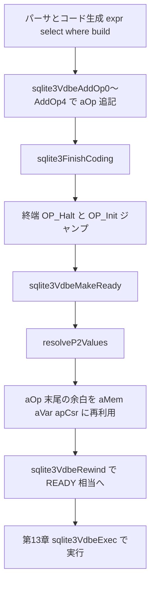

# 第14章 VDBE プログラムの構築

> **本章で読むソース**
>
> - [src/vdbeaux.c](https://github.com/sqlite/sqlite/blob/version-3.53.3/src/vdbeaux.c)
> - [src/vdbe.c](https://github.com/sqlite/sqlite/blob/version-3.53.3/src/vdbe.c)
> - [src/vdbe.h](https://github.com/sqlite/sqlite/blob/version-3.53.3/src/vdbe.h)
> - [src/build.c](https://github.com/sqlite/sqlite/blob/version-3.53.3/src/build.c)
> - [src/expr.c](https://github.com/sqlite/sqlite/blob/version-3.53.3/src/expr.c)
> - [src/select.c](https://github.com/sqlite/sqlite/blob/version-3.53.3/src/select.c)
> - [src/wherecode.c](https://github.com/sqlite/sqlite/blob/version-3.53.3/src/wherecode.c)

## この章の狙い

第6章から第12章までのコンパイラ各章は、構文木やプランナの結果を VDBE 命令へ落とす側を読んできた。
本章ではその受け皿である `vdbeaux.c` の命令追加 API と、実行可能状態へ仕上げる `sqlite3VdbeMakeReady` を追う。
`sqlite3VdbeAddOp0` から `sqlite3VdbeAddOp4` までの層構造、一括投入の `sqlite3VdbeAddOpList`、カーソル用メモリの確保までを押さえる。
`vdbeapi.c` の `step`/`reset`/`finalize` は第2章の範囲とし、本章では触れない。

## 前提

コンパイル中の VDBE は `eVdbeState == VDBE_INIT_STATE` である。
この状態でのみ `sqlite3VdbeAddOp*` が `aOp[]` 末尾へ命令を追記できる。
`Parse` の `nMem`（レジスタ数）、`nTab`（カーソル数）、`nVar`（バインド変数数）はコード生成の過程で増え、最終的に `sqlite3VdbeMakeReady` が実配列を割り当てる。

1命令の形は `VdbeOp` で、opcode と `p1` から `p3`、`p4` 共用体、`p5` で表される。

[src/vdbe.h L55-L82](https://github.com/sqlite/sqlite/blob/version-3.53.3/src/vdbe.h#L55-L82)

```c
struct VdbeOp {
  u8 opcode;          /* What operation to perform */
  signed char p4type; /* One of the P4_xxx constants for p4 */
  u16 p5;             /* Fifth parameter is an unsigned 16-bit integer */
  int p1;             /* First operand */
  int p2;             /* Second parameter (often the jump destination) */
  int p3;             /* The third parameter */
  union p4union {     /* fourth parameter */
    int i;                 /* Integer value if p4type==P4_INT32 */
    void *p;               /* Generic pointer */
    char *z;               /* Pointer to data for string (char array) types */
    i64 *pI64;             /* Used when p4type is P4_INT64 */
    double *pReal;         /* Used when p4type is P4_REAL */
    FuncDef *pFunc;        /* Used when p4type is P4_FUNCDEF */
    sqlite3_context *pCtx; /* Used when p4type is P4_FUNCCTX */
    CollSeq *pColl;        /* Used when p4type is P4_COLLSEQ */
    Mem *pMem;             /* Used when p4type is P4_MEM */
    VTable *pVtab;         /* Used when p4type is P4_VTAB */
    KeyInfo *pKeyInfo;     /* Used when p4type is P4_KEYINFO */
    u32 *ai;               /* Used when p4type is P4_INTARRAY */
    SubProgram *pProgram;  /* Used when p4type is P4_SUBPROGRAM */
    Table *pTab;           /* Used when p4type is P4_TABLE */
    SubrtnSig *pSubrtnSig; /* Used when p4type is P4_SUBRTNSIG */
    Index *pIdx;           /* Used when p4type is P4_INDEX */
#ifdef SQLITE_ENABLE_CURSOR_HINTS
    Expr *pExpr;           /* Used when p4type is P4_EXPR */
#endif
  } p4;
```

## sqlite3VdbeAddOp0 から AddOp4 まで

`sqlite3VdbeAddOp0`/`AddOp1`/`AddOp2` はいずれも `sqlite3VdbeAddOp3` への薄いラッパーである。
`AddOp3` は `nOp` 位置へ opcode と3オペランドを書き、戻り値はその命令のアドレス（0始まりインデックス）になる。

[src/vdbeaux.c L263-L315](https://github.com/sqlite/sqlite/blob/version-3.53.3/src/vdbeaux.c#L263-L315)

```c
int sqlite3VdbeAddOp0(Vdbe *p, int op){
  return sqlite3VdbeAddOp3(p, op, 0, 0, 0);
}
int sqlite3VdbeAddOp1(Vdbe *p, int op, int p1){
  return sqlite3VdbeAddOp3(p, op, p1, 0, 0);
}
int sqlite3VdbeAddOp2(Vdbe *p, int op, int p1, int p2){
  return sqlite3VdbeAddOp3(p, op, p1, p2, 0);
}
int sqlite3VdbeAddOp3(Vdbe *p, int op, int p1, int p2, int p3){
  int i;
  VdbeOp *pOp;

  i = p->nOp;
  assert( p->eVdbeState==VDBE_INIT_STATE );
  assert( op>=0 && op<0xff );
  if( p->nOpAlloc<=i ){
    return growOp3(p, op, p1, p2, p3);
  }
  assert( p->aOp!=0 );
  p->nOp++;
  pOp = &p->aOp[i];
  assert( pOp!=0 );
  pOp->opcode = (u8)op;
  pOp->p5 = 0;
  pOp->p1 = p1;
  pOp->p2 = p2;
  pOp->p3 = p3;
  pOp->p4.p = 0;
  pOp->p4type = P4_NOTUSED;
  // ... (中略) ...
  return i;
}
```

`sqlite3VdbeAddOp4Int` は配列に余裕がある高速経路で、`p4` を `P4_INT32` として直接埋め込む。
`sqlite3VdbeAddOp4` はまず `AddOp3` で枠を確保し、`sqlite3VdbeChangeP4` で文字列や `KeyInfo` など型付き `p4` を後付けする。

[src/vdbeaux.c L317-L365](https://github.com/sqlite/sqlite/blob/version-3.53.3/src/vdbeaux.c#L317-L365)

```c
int sqlite3VdbeAddOp4Int(
  Vdbe *p,            /* Add the opcode to this VM */
  int op,             /* The new opcode */
  int p1,             /* The P1 operand */
  int p2,             /* The P2 operand */
  int p3,             /* The P3 operand */
  int p4              /* The P4 operand as an integer */
){
  int i;
  VdbeOp *pOp;

  i = p->nOp;
  if( p->nOpAlloc<=i ){
    return addOp4IntSlow(p, op, p1, p2, p3, p4);
  }
  p->nOp++;
  pOp = &p->aOp[i];
  assert( pOp!=0 );
  pOp->opcode = (u8)op;
  pOp->p5 = 0;
  pOp->p1 = p1;
  pOp->p2 = p2;
  pOp->p3 = p3;
  pOp->p4.i = p4;
  pOp->p4type = P4_INT32;
  // ... (中略) ...
  return i;
}
```

[src/vdbeaux.c L414-L426](https://github.com/sqlite/sqlite/blob/version-3.53.3/src/vdbeaux.c#L414-L426)

```c
int sqlite3VdbeAddOp4(
  Vdbe *p,            /* Add the opcode to this VM */
  int op,             /* The new opcode */
  int p1,             /* The P1 operand */
  int p2,             /* The P2 operand */
  int p3,             /* The P3 operand */
  const char *zP4,    /* The P4 operand */
  int p4type          /* P4 operand type */
){
  int addr = sqlite3VdbeAddOp3(p, op, p1, p2, p3);
  sqlite3VdbeChangeP4(p, addr, zP4, p4type);
  return addr;
}
```

配列拡張は `growOpArray` が担い、通常ビルドでは現在サイズの2倍または初回1024バイト相当まで伸ばす。
拡張が必要なときだけ `growOp3` などの `SQLITE_NOINLINE` 経路へ入り、ホットパスでの関数呼び出しを避ける。

[src/vdbeaux.c L164-L198](https://github.com/sqlite/sqlite/blob/version-3.53.3/src/vdbeaux.c#L164-L198)

```c
static int growOpArray(Vdbe *v, int nOp){
  VdbeOp *pNew;
  Parse *p = v->pParse;
  // ... (中略) ...
#ifdef SQLITE_TEST_REALLOC_STRESS
  sqlite3_int64 nNew = (v->nOpAlloc>=512 ? 2*(sqlite3_int64)v->nOpAlloc
                        : (sqlite3_int64)v->nOpAlloc+nOp);
#else
  sqlite3_int64 nNew = (v->nOpAlloc ? 2*(sqlite3_int64)v->nOpAlloc
                        : (sqlite3_int64)(1024/sizeof(Op)));
  UNUSED_PARAMETER(nOp);
#endif
  // ... (中略) ...
  pNew = sqlite3DbRealloc(p->db, v->aOp, nNew*sizeof(Op));
  if( pNew ){
    p->szOpAlloc = sqlite3DbMallocSize(p->db, pNew);
    v->nOpAlloc = p->szOpAlloc/sizeof(Op);
    v->aOp = pNew;
  }
  return (pNew ? SQLITE_OK : SQLITE_NOMEM_BKPT);
}
```

## sqlite3VdbeAddOpList：定型列の一括投入

`sqlite3VdbeAddOpList` は `VdbeOpList` 配列をまとめて `aOp[]` にコピーする。
ジャンプ命令で `p2>0` のとき、相対アドレスを追加列の先頭（現在の `nOp`）へ加算し、プログラム全体のアドレスへ補正する（前方ジャンプと後方ジャンプの両方）。
`insert.c` の `autoInc[]` には `OP_Rewind`（P2=10、前方）と `OP_Next`（P2=2、後方）が混在する。

[src/vdbeaux.c L1142-L1184](https://github.com/sqlite/sqlite/blob/version-3.53.3/src/vdbeaux.c#L1142-L1184)

```c
VdbeOp *sqlite3VdbeAddOpList(
  Vdbe *p,                     /* Add opcodes to the prepared statement */
  int nOp,                     /* Number of opcodes to add */
  VdbeOpList const *aOp,       /* The opcodes to be added */
  int iLineno                  /* Source-file line number of first opcode */
){
  int i;
  VdbeOp *pOut, *pFirst;
  assert( nOp>0 );
  assert( p->eVdbeState==VDBE_INIT_STATE );
  if( p->nOp + nOp > p->nOpAlloc && growOpArray(p, nOp) ){
    return 0;
  }
  pFirst = pOut = &p->aOp[p->nOp];
  for(i=0; i<nOp; i++, aOp++, pOut++){
    pOut->opcode = aOp->opcode;
    pOut->p1 = aOp->p1;
    pOut->p2 = aOp->p2;
    assert( aOp->p2>=0 );
    if( (sqlite3OpcodeProperty[aOp->opcode] & OPFLG_JUMP)!=0 && aOp->p2>0 ){
      pOut->p2 += p->nOp;
    }
    pOut->p3 = aOp->p3;
    pOut->p4type = P4_NOTUSED;
    pOut->p4.p = 0;
    pOut->p5 = 0;
    // ... (中略) ...
  }
  p->nOp += nOp;
  return pFirst;
}
```

## 呼び出し元：build.c、expr.c、wherecode.c、select.c

`build.c` の `sqlite3FinishCoding` はコンパイル終端処理である。
RETURNING 句の行返却列、`OP_Halt`、トランザクション開始、`OP_Init` へのジャンプを追記したうえで `sqlite3VdbeMakeReady` を呼ぶ。

[src/build.c L171-L193](https://github.com/sqlite/sqlite/blob/version-3.53.3/src/build.c#L171-L193)

```c
    if( pParse->bReturning ){
      Returning *pReturning;
      int addrRewind;
      int reg;

      assert( !pParse->isCreate );
      pReturning = pParse->u1.d.pReturning;
      if( pReturning->nRetCol ){
        sqlite3VdbeAddOp0(v, OP_FkCheck);
        addrRewind =
           sqlite3VdbeAddOp1(v, OP_Rewind, pReturning->iRetCur);
        VdbeCoverage(v);
        reg = pReturning->iRetReg;
        for(i=0; i<pReturning->nRetCol; i++){
          sqlite3VdbeAddOp3(v, OP_Column, pReturning->iRetCur, i, reg+i);
        }
        sqlite3VdbeAddOp2(v, OP_ResultRow, reg, i);
        sqlite3VdbeAddOp2(v, OP_Next, pReturning->iRetCur, addrRewind+1);
        VdbeCoverage(v);
        sqlite3VdbeJumpHere(v, addrRewind);
      }
    }
    sqlite3VdbeAddOp0(v, OP_Halt);
```

[src/build.c L265-L274](https://github.com/sqlite/sqlite/blob/version-3.53.3/src/build.c#L265-L274)

```c
  /* Get the VDBE program ready for execution
  */
  assert( v!=0 || pParse->nErr );
  assert( db->mallocFailed==0 || pParse->nErr );
  if( pParse->nErr==0 ){
  // ... (中略) ...
    sqlite3VdbeMakeReady(v, pParse);
    pParse->rc = SQLITE_DONE;
  }else{
    pParse->rc = SQLITE_ERROR;
  }
```

`expr.c` の `sqlite3ExprCodeTarget` は式木を走査し、葉や演算子ごとに `sqlite3VdbeAddOp2`/`AddOp3`/`AddOp4` を発行する。

[src/expr.c L4950-L4999](https://github.com/sqlite/sqlite/blob/version-3.53.3/src/expr.c#L4950-L4999)

```c
int sqlite3ExprCodeTarget(Parse *pParse, Expr *pExpr, int target){
  Vdbe *v = pParse->pVdbe;  /* The VM under construction */
  int op;                   /* The opcode being coded */
  int inReg = target;       /* Results stored in register inReg */
  // ... (中略) ...
  assert( target>0 && target<=pParse->nMem );
  assert( v!=0 );

expr_code_doover:
  // ... (中略) ...
  switch( op ){
    case TK_AGG_COLUMN: {
      AggInfo *pAggInfo = pExpr->pAggInfo;
      struct AggInfo_col *pCol;
      // ... (中略) ...
      if( !pAggInfo->directMode ){
        return AggInfoColumnReg(pAggInfo, pExpr->iAgg);
      }else if( pAggInfo->useSortingIdx ){
        Table *pTab = pCol->pTab;
        sqlite3VdbeAddOp3(v, OP_Column, pAggInfo->sortingIdxPTab,
```

`wherecode.c` の `codeINTerm` は `codeEqualityTerm` から呼ばれる IN 制約専用の補助経路で、IN 右辺の値を反復するループを組み立てる。
インデックス走査一般のコードではなく、IN 制約の各候補値を読み出すために `OP_Rewind` や `OP_Column` を並べる。

[src/wherecode.c L668-L756](https://github.com/sqlite/sqlite/blob/version-3.53.3/src/wherecode.c#L668-L756)

```c
static SQLITE_NOINLINE void codeINTerm(
  Parse *pParse,      /* The parsing context */
  WhereTerm *pTerm,   /* The term of the WHERE clause to be coded */
  WhereLevel *pLevel, /* The level of the FROM clause we are working on */
  int iEq,            /* Index of the equality term within this level */
  int bRev,           /* True for reverse-order IN operations */
  int iTarget         /* Attempt to leave results in this register */
){
  Expr *pX = pTerm->pExpr;
  // ... (中略) ...
  sqlite3VdbeAddOp2(v, bRev ? OP_Last : OP_Rewind, iTab, 0);
  VdbeCoverageIf(v, bRev);
  VdbeCoverageIf(v, !bRev);
  // ... (中略) ...
    for(i=iEq; i<pLoop->nLTerm; i++){
      if( pLoop->aLTerm[i]->pExpr==pX ){
        int iOut = iTarget + i - iEq;
        if( eType==IN_INDEX_ROWID ){
          pIn->addrInTop = sqlite3VdbeAddOp2(v, OP_Rowid, iTab, iOut);
        }else{
          int iCol = aiMap ? aiMap[iMap++] : 0;
          pIn->addrInTop = sqlite3VdbeAddOp3(v,OP_Column,iTab, iCol, iOut);
        }
        sqlite3VdbeAddOp1(v, OP_IsNull, iOut); VdbeCoverage(v);
```

`select.c` は内部ループ `selectInnerLoop` などで `OP_ResultRow` を発行し、集約やソート経路と接続する。

[src/select.c L1448-L1452](https://github.com/sqlite/sqlite/blob/version-3.53.3/src/select.c#L1448-L1452)

```c
      }else if( eDest==SRT_Coroutine ){
        sqlite3VdbeAddOp1(v, OP_Yield, pDest->iSDParm);
      }else{
        sqlite3VdbeAddOp2(v, OP_ResultRow, regResult, nResultCol);
      }
```

## sqlite3VdbeMakeReady とカーソル割り当て

`sqlite3VdbeMakeReady` は構築完了後に一度だけ呼ばれる。
`Parse` から `nVar`、`nMem`、`nTab`（カーソル数）、`nMaxArg` を受け取り、レジスタ配列とカーソルポインタ配列を確保する。
カーソル1本につきレジスタを1つ追加し、カーソル0用に `aMem[0]` を確保する設計は `allocateCursor` と対になる。

[src/vdbeaux.c L2647-L2744](https://github.com/sqlite/sqlite/blob/version-3.53.3/src/vdbeaux.c#L2647-L2744)

```c
void sqlite3VdbeMakeReady(
  Vdbe *p,                       /* The VDBE */
  Parse *pParse                  /* Parsing context */
){
  sqlite3 *db;                   /* The database connection */
  int nVar;                      /* Number of parameters */
  int nMem;                      /* Number of VM memory registers */
  int nCursor;                   /* Number of cursors required */
  int nArg;                      /* Max number args to xFilter or xUpdate */
  // ... (中略) ...
  nVar = pParse->nVar;
  nMem = pParse->nMem;
  nCursor = pParse->nTab;
  nArg = pParse->nMaxArg;
 
  /* Each cursor uses a memory cell.  The first cursor (cursor 0) can
  ** use aMem[0] which is not otherwise used by the VDBE program.  Allocate
  ** space at the end of aMem[] for cursors 1 and greater.
  ** See also: allocateCursor().
  */
  nMem += nCursor;
  if( nCursor==0 && nMem>0 ) nMem++;  /* Space for aMem[0] even if not used */

  /* Figure out how much reusable memory is available at the end of the
  ** opcode array.  This extra memory will be reallocated for other elements
  ** of the prepared statement.
  */
  n = ROUND8P(sizeof(Op)*p->nOp);             /* Bytes of opcode memory used */
  x.pSpace = &((u8*)p->aOp)[n];               /* Unused opcode memory */
  // ... (中略) ...
  p->aMem = allocSpace(&x, 0, nMem*sizeof(Mem));
  p->aVar = allocSpace(&x, 0, nVar*sizeof(Mem));
  p->apArg = allocSpace(&x, 0, nArg*sizeof(Mem*));
  p->apCsr = allocSpace(&x, 0, nCursor*sizeof(VdbeCursor*));
  // ... (中略) ...
    p->nCursor = nCursor;
    p->nVar = (ynVar)nVar;
    initMemArray(p->aVar, nVar, db, MEM_Null);
    p->nMem = nMem;
    initMemArray(p->aMem, nMem, db, MEM_Undefined);
    memset(p->apCsr, 0, nCursor*sizeof(VdbeCursor*));
  sqlite3VdbeRewind(p);
}
```

実行時に `OP_OpenRead` などが呼ぶ `allocateCursor` は、カーソル0を `aMem[0]`、カーソル1以降を `aMem` 末尾から逆順に割り当てた `Mem` セルへ `VdbeCursor` と内包 `BtCursor` を配置する。

[src/vdbe.c L253-L320](https://github.com/sqlite/sqlite/blob/version-3.53.3/src/vdbe.c#L253-L320)

```c
static VdbeCursor *allocateCursor(
  Vdbe *p,              /* The virtual machine */
  int iCur,             /* Index of the new VdbeCursor */
  int nField,           /* Number of fields in the table or index */
  u8 eCurType           /* Type of the new cursor */
){
  /* The memory cell for cursor 0 is aMem[0]. The rest are allocated from
  ** the top of the register space.  Cursor 1 is at Mem[p->nMem-1].
  ** Cursor 2 is at Mem[p->nMem-2]. And so forth.
  */
  Mem *pMem = iCur>0 ? &p->aMem[p->nMem-iCur] : p->aMem;
  // ... (中略) ...
  p->apCsr[iCur] = pCx = (VdbeCursor*)pMem->zMalloc;
  memset(pCx, 0, offsetof(VdbeCursor,pAltCursor));
  pCx->eCurType = eCurType;
  pCx->nField = nField;
  pCx->aOffset = &pCx->aType[nField];
  if( eCurType==CURTYPE_BTREE ){
    pCx->uc.pCursor = (BtCursor*)&pMem->z[SZ_VDBECURSOR(nField)];
    sqlite3BtreeCursorZero(pCx->uc.pCursor);
  }
  return pCx;
}
```

## 処理の流れ

SQL 1文のコンパイルから実行準備完了までの流れを示す。



## 高速化と最適化の工夫

`sqlite3VdbeAddOp3` は配列に空きがある場合インラインで1命令を書き、拡張が要るときだけ `growOp3` へ分岐する。
`sqlite3VdbeMakeReady` は `aOp` 配列末尾の未使用バイトを `aMem` などへ再利用し、プリペアドステートメント1本あたりの追加 `malloc` を抑える。
`sqlite3VdbeAddOpList` は定型シーケンスをループ1回でコピーし、関数呼び出し回数とジャンプアドレス修正をまとめる。

## まとめ

VDBE プログラム構築は `sqlite3VdbeAddOp*` 族が `aOp[]` を伸ばし、`sqlite3VdbeMakeReady` がレジスタとカーソル用メモリを確定する。
呼び出し元はコンパイラ全体に散らばるが、`build.c` の `sqlite3FinishCoding` が終端と `MakeReady` の共通出口である。
カーソル番号はコンパイル時に `Parse->nTab` で予約され、実行時の `allocateCursor` が `Mem` セルへ実体を載せる。

## 関連する章

- [第13章 VDBE バイトコードエンジン](13-vdbe-engine.md)（`sqlite3VdbeExec` と `case OP_*`）
- [第6章 式のコード生成と定数式因数分解](../part02-compiler/06-expr-codegen.md)（`sqlite3ExprCodeTarget`）
- [第7章 SELECT の処理](../part02-compiler/07-select.md)（`sqlite3Select` と結果生成）
- [第9章 クエリプランナ（2）ループ候補とコード生成](../part02-compiler/09-planner-loops-codegen.md)（`sqlite3WhereCodeOneLoopStart`）
