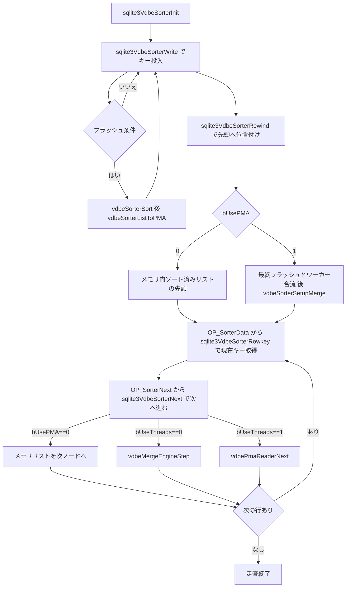

# 第16章 外部マージソート

> **本章で読むソース**
>
> - [src/vdbesort.c](https://github.com/sqlite/sqlite/blob/version-3.53.3/src/vdbesort.c)

## この章の狙い

ORDER BY や DISTINCT、GROUP BY のソート段階では、行数がメモリ閾値を超えるとディスクへ溢れる。
本章では `vdbesort.c` の **VdbeSorter** が、メモリ上のレコード列を **PMA**（Packed Memory Array）へ書き出し、マージしながら順序付き読み出しを提供する仕組みを読む。
入口は `sqlite3VdbeSorterInit`、行の投入は `sqlite3VdbeSorterWrite`、読み出し準備は `sqlite3VdbeSorterRewind`、順序付き消費は `sqlite3VdbeSorterNext` である。

## 前提

ソータカーソルは `VdbeCursor.eCurType == CURTYPE_SORTER` で、`uc.pSorter` に `VdbeSorter` を保持する。
しきい値はおおよそ `PRAGMA main.page_size` と `PRAGMA main.cache_size` の積で、メモリ使用量がこれを超えると level-0 PMA へフラッシュする。

[src/vdbesort.c L75-L113](https://github.com/sqlite/sqlite/blob/version-3.53.3/src/vdbesort.c#L75-L113)

```c
** If the amount of space used to store records in main memory exceeds the
** threshold, then the set of records currently in memory are sorted and
** written to a temporary file in "Packed Memory Array" (PMA) format.
** A PMA created at this point is known as a "level-0 PMA". Higher levels
** of PMAs may be created by merging existing PMAs together - for example
** merging two or more level-0 PMAs together creates a level-1 PMA.
**
** The threshold for the amount of main memory to use before flushing
** records to a PMA is roughly the same as the limit configured for the
** page-cache of the main database. Specifically, the threshold is set to
** the value returned by "PRAGMA main.page_size" multiplied by
** that returned by "PRAGMA main.cache_size", in bytes.
**
** If the sorter is running in single-threaded mode, then all PMAs generated
** are appended to a single temporary file. Or, if the sorter is running in
** multi-threaded mode then up to (N+1) temporary files may be opened, where
** N is the configured number of worker threads. In this case, instead of
** sorting the records and writing the PMA to a temporary file itself, the
** calling thread usually launches a worker thread to do so. Except, if
** there are already N worker threads running, the main thread does the work
** itself.
**
** When Rewind() is called, any data remaining in memory is flushed to a
** final PMA. So at this point the data is stored in some number of sorted
** PMAs within temporary files on disk.
**
** If there are fewer than SORTER_MAX_MERGE_COUNT PMAs in total and the
** sorter is running in single-threaded mode, then these PMAs are merged
** incrementally as keys are retrieved from the sorter by the VDBE.  The
** MergeEngine object, described in further detail below, performs this
** merge.
```

**VdbeSorter** は in-memory リスト、PMA リーダ、マージエンジン、ワーカー配列 `aTask[]` を束ねる。

[src/vdbesort.c L318-L337](https://github.com/sqlite/sqlite/blob/version-3.53.3/src/vdbesort.c#L318-L337)

```c
struct VdbeSorter {
  int mnPmaSize;                  /* Minimum PMA size, in bytes */
  int mxPmaSize;                  /* Maximum PMA size, in bytes.  0==no limit */
  int mxKeysize;                  /* Largest serialized key seen so far */
  int pgsz;                       /* Main database page size */
  PmaReader *pReader;             /* Readr data from here after Rewind() */
  MergeEngine *pMerger;           /* Or here, if bUseThreads==0 */
  sqlite3 *db;                    /* Database connection */
  KeyInfo *pKeyInfo;              /* How to compare records */
  UnpackedRecord *pUnpacked;      /* Used by VdbeSorterCompare() */
  SorterList list;                /* List of in-memory records */
  int iMemory;                    /* Offset of free space in list.aMemory */
  int nMemory;                    /* Size of list.aMemory allocation in bytes */
  u8 bUsePMA;                     /* True if one or more PMAs created */
  u8 bUseThreads;                 /* True to use background threads */
  u8 iPrev;                       /* Previous thread used to flush PMA */
  u8 nTask;                       /* Size of aTask[] array */
  u8 typeMask;
  SortSubtask aTask[FLEXARRAY];   /* One or more subtasks */
};
```

## sqlite3VdbeSorterInit

ソータカーソル生成時に `VdbeSorter` とコピーした `KeyInfo` を1塊で確保する。
ワーカー数は `SQLITE_LIMIT_WORKER_THREADS` を元に決めるが、メインスレッドを含む総タスク数を `SORTER_MAX_MERGE_COUNT` 以下にするため `nWorker` は最大 `SORTER_MAX_MERGE_COUNT-1` に制限される。
`mnPmaSize`/`mxPmaSize` はページサイズとキャッシュ設定から決める。

[src/vdbesort.c L936-L1007](https://github.com/sqlite/sqlite/blob/version-3.53.3/src/vdbesort.c#L936-L1007)

```c
int sqlite3VdbeSorterInit(
  sqlite3 *db,                    /* Database connection (for malloc()) */
  int nField,                     /* Number of key fields in each record */
  VdbeCursor *pCsr                /* Cursor that holds the new sorter */
){
  int pgsz;                       /* Page size of main database */
  int i;                          /* Used to iterate through aTask[] */
  VdbeSorter *pSorter;            /* The new sorter */
  KeyInfo *pKeyInfo;              /* Copy of pCsr->pKeyInfo with db==0 */
  int szKeyInfo;                  /* Size of pCsr->pKeyInfo in bytes */
  i64 sz;                         /* Size of pSorter in bytes */
  int rc = SQLITE_OK;
  // ... (中略) ...
  szKeyInfo = SZ_KEYINFO(pCsr->pKeyInfo->nAllField);
  sz = SZ_VDBESORTER(nWorker+1);

  pSorter = (VdbeSorter*)sqlite3DbMallocZero(db, sz + szKeyInfo);
  pCsr->uc.pSorter = pSorter;
  if( pSorter==0 ){
    rc = SQLITE_NOMEM_BKPT;
  }else{
    Btree *pBt = db->aDb[0].pBt;
    pSorter->pKeyInfo = pKeyInfo = (KeyInfo*)((u8*)pSorter + sz);
    memcpy(pKeyInfo, pCsr->pKeyInfo, szKeyInfo);
    pKeyInfo->db = 0;
    // ... (中略) ...
    pSorter->pgsz = pgsz = sqlite3BtreeGetPageSize(pBt);
    pSorter->nTask = nWorker + 1;
    pSorter->iPrev = (u8)(nWorker - 1);
    pSorter->bUseThreads = (pSorter->nTask>1);
    pSorter->db = db;
    for(i=0; i<pSorter->nTask; i++){
      SortSubtask *pTask = &pSorter->aTask[i];
      pTask->pSorter = pSorter;
    }
```

## sqlite3VdbeSorterWrite と PMA へのフラッシュ

`sqlite3VdbeSorterWrite` はシリアル化済みキー（`Mem.z`/`Mem.n`）を in-memory リストへ追加する。
単一 `aMemory` モードでは、既存キーがあり新規追加後の `iMemory+nReq` が `mxPmaSize` を超えるとき `vdbeSorterFlushPMA` でソートして PMA へ書き出す。
個別 malloc モードでは、追加前の `szPMA` が `mxPmaSize` を既に超過しているか、`mnPmaSize` を超えて `sqlite3HeapNearlyFull()` のときフラッシュする。

[src/vdbesort.c L1797-L1901](https://github.com/sqlite/sqlite/blob/version-3.53.3/src/vdbesort.c#L1797-L1901)

```c
int sqlite3VdbeSorterWrite(
  const VdbeCursor *pCsr,         /* Sorter cursor */
  Mem *pVal                       /* Memory cell containing record */
){
  VdbeSorter *pSorter;
  int rc = SQLITE_OK;             /* Return Code */
  SorterRecord *pNew;             /* New list element */
  int bFlush;                     /* True to flush contents of memory to PMA */
  i64 nReq;                       /* Bytes of memory required */
  i64 nPMA;                       /* Bytes of PMA space required */
  // ... (中略) ...
  pSorter = pCsr->uc.pSorter;
  // ... (中略) ...
  nReq = pVal->n + sizeof(SorterRecord);
  nPMA = pVal->n + sqlite3VarintLen(pVal->n);
  if( pSorter->mxPmaSize ){
    if( pSorter->list.aMemory ){
      bFlush = pSorter->iMemory && (pSorter->iMemory+nReq) > pSorter->mxPmaSize;
    }else{
      bFlush = (
          (pSorter->list.szPMA > pSorter->mxPmaSize)
       || (pSorter->list.szPMA > pSorter->mnPmaSize && sqlite3HeapNearlyFull())
      );
    }
    if( bFlush ){
      rc = vdbeSorterFlushPMA(pSorter);
      pSorter->list.szPMA = 0;
      pSorter->iMemory = 0;
      assert( rc!=SQLITE_OK || pSorter->list.pList==0 );
    }
  }

  pSorter->list.szPMA += nPMA;
  // ... (中略) ...
  memcpy(SRVAL(pNew), pVal->z, pVal->n);
  pNew->nVal = pVal->n;
  pSorter->list.pList = pNew;

  return rc;
}
```

PMA のオンディスク形式は先頭 varint（ペイロード総バイト数）のあと、各レコードが「長さ varint + キー blob」の連続である。

[src/vdbesort.c L1569-L1627](https://github.com/sqlite/sqlite/blob/version-3.53.3/src/vdbesort.c#L1569-L1627)

```c
** The format of a PMA is:
**
**     * A varint. This varint contains the total number of bytes of content
**       in the PMA (not including the varint itself).
**
**     * One or more records packed end-to-end in order of ascending keys.
**       Each record consists of a varint followed by a blob of data (the
**       key). The varint is the number of bytes in the blob of data.
*/
static int vdbeSorterListToPMA(SortSubtask *pTask, SorterList *pList){
  sqlite3 *db = pTask->pSorter->db;
  int rc = SQLITE_OK;             /* Return code */
  PmaWriter writer;               /* Object used to write to the file */
  // ... (中略) ...
  if( rc==SQLITE_OK ){
    rc = vdbeSorterSort(pTask, pList);
  }

  if( rc==SQLITE_OK ){
    SorterRecord *p;
    SorterRecord *pNext = 0;

    vdbePmaWriterInit(pTask->file.pFd, &writer, pTask->pSorter->pgsz,
                      pTask->file.iEof);
    pTask->nPMA++;
    vdbePmaWriteVarint(&writer, pList->szPMA);
    for(p=pList->pList; p; p=pNext){
      pNext = p->u.pNext;
      vdbePmaWriteVarint(&writer, p->nVal);
      vdbePmaWriteBlob(&writer, SRVAL(p), p->nVal);
      if( pList->aMemory==0 ) sqlite3_free(p);
    }
    pList->pList = p;
    rc = vdbePmaWriterFinish(&writer, &pTask->file.iEof, &pTask->nSpill);
  }
  // ... (中略) ...
  return rc;
}
```

## マージと順序付き読み出し

複数 PMA を同時に読む **MergeEngine** は、トーナメント木 `aTree[]` で最小キーを O(log N) で維持する。

[src/vdbesort.c L193-L221](https://github.com/sqlite/sqlite/blob/version-3.53.3/src/vdbesort.c#L193-L221)

```c
** The MergeEngine object is used to combine two or more smaller PMAs into
** one big PMA using a merge operation.  Separate PMAs all need to be
** combined into one big PMA in order to be able to step through the sorted
** records in order.
**
** The aReadr[] array contains a PmaReader object for each of the PMAs being
** merged.  An aReadr[] object either points to a valid key or else is at EOF.
** ("EOF" means "End Of File".  When aReadr[] is at EOF there is no more data.)
** For the purposes of the paragraphs below, we assume that the array is
** actually N elements in size, where N is the smallest power of 2 greater
** to or equal to the number of PMAs being merged. The extra aReadr[] elements
** are treated as if they are empty (always at EOF).
**
** The aTree[] array is also N elements in size. The value of N is stored in
** the MergeEngine.nTree variable.
**
** The final (N/2) elements of aTree[] contain the results of comparing
** pairs of PMA keys together. Element i contains the result of
** comparing aReadr[2*i-N] and aReadr[2*i-N+1]. Whichever key is smaller, the
** aTree element is set to the index of it.
**
** For the purposes of this comparison, EOF is considered greater than any
** other key value. If the keys are equal (only possible with two EOF
** values), it doesn't matter which index is stored.
**
** The (N/4) elements of aTree[] that precede the final (N/2) described
** above contains the index of the smallest of each block of 4 PmaReaders
** And so on. So that aTree[1] contains the index of the PmaReader that
** currently points to the smallest key value. aTree[0] is unused.
```

`vdbeMergeEngineStep` は勝者側の `PmaReader` を1キー進め、`aTree` を根に向かって更新する。

[src/vdbesort.c L1642-L1676](https://github.com/sqlite/sqlite/blob/version-3.53.3/src/vdbesort.c#L1642-L1676)

```c
static int vdbeMergeEngineStep(
  MergeEngine *pMerger,      /* The merge engine to advance to the next row */
  int *pbEof                 /* Set TRUE at EOF.  Set false for more content */
){
  int rc;
  int iPrev = pMerger->aTree[1];/* Index of PmaReader to advance */
  SortSubtask *pTask = pMerger->pTask;

  /* Advance the current PmaReader */
  rc = vdbePmaReaderNext(&pMerger->aReadr[iPrev]);

  /* Update contents of aTree[] */
  if( rc==SQLITE_OK ){
    int i;                      /* Index of aTree[] to recalculate */
    PmaReader *pReadr1;         /* First PmaReader to compare */
    PmaReader *pReadr2;         /* Second PmaReader to compare */
    int bCached = 0;

    pReadr1 = &pMerger->aReadr[(iPrev & 0xFFFE)];
    pReadr2 = &pMerger->aReadr[(iPrev | 0x0001)];

    for(i=(pMerger->nTree+iPrev)/2; i>0; i=i/2){
      int iRes;
      if( pReadr1->pFd==0 ){
        iRes = +1;
      }else if( pReadr2->pFd==0 ){
        iRes = -1;
      }else{
        iRes = pTask->xCompare(pTask, &bCached,
            pReadr1->aKey, pReadr1->nKey, pReadr2->aKey, pReadr2->nKey
        );
      }
```

メモリ内マージでは `vdbeSorterMerge` が2つのソート済み連結リストを `xCompare` で統合する。
比較用の `UnpackedRecord` は `vdbeSortAllocUnpacked` で遅延確保する。

[src/vdbesort.c L1354-L1382](https://github.com/sqlite/sqlite/blob/version-3.53.3/src/vdbesort.c#L1354-L1382)

```c
static int vdbeSortAllocUnpacked(SortSubtask *pTask){
  if( pTask->pUnpacked==0 ){
    pTask->pUnpacked = sqlite3VdbeAllocUnpackedRecord(pTask->pSorter->pKeyInfo);
    if( pTask->pUnpacked==0 ) return SQLITE_NOMEM_BKPT;
    pTask->pUnpacked->nField = pTask->pSorter->pKeyInfo->nKeyField;
    pTask->pUnpacked->errCode = 0;
  }
  return SQLITE_OK;
}

static SorterRecord *vdbeSorterMerge(
  SortSubtask *pTask,             /* Calling thread context */
  SorterRecord *p1,               /* First list to merge */
  SorterRecord *p2                /* Second list to merge */
){
  SorterRecord *pFinal = 0;
  SorterRecord **pp = &pFinal;
  int bCached = 0;

  assert( p1!=0 && p2!=0 );
  for(;;){
    int res;
    res = pTask->xCompare(
        pTask, &bCached, SRVAL(p1), p1->nVal, SRVAL(p2), p2->nVal
    );
```

## sqlite3VdbeSorterRewind

読み出し開始時、PMA が1つもなければ in-memory リストだけをソートする。
ディスク PMA がある場合は残りをフラッシュし、ワーカーを合流させて `vdbeSorterSetupMerge` でマージパイプラインを構築する。

[src/vdbesort.c L2612-L2654](https://github.com/sqlite/sqlite/blob/version-3.53.3/src/vdbesort.c#L2612-L2654)

```c
int sqlite3VdbeSorterRewind(const VdbeCursor *pCsr, int *pbEof){
  VdbeSorter *pSorter;
  int rc = SQLITE_OK;             /* Return code */

  assert( pCsr->eCurType==CURTYPE_SORTER );
  pSorter = pCsr->uc.pSorter;
  assert( pSorter );

  if( pSorter->bUsePMA==0 ){
    if( pSorter->list.pList ){
      *pbEof = 0;
      rc = vdbeSorterSort(&pSorter->aTask[0], &pSorter->list);
    }else{
      *pbEof = 1;
    }
    return rc;
  }

  assert( pSorter->list.pList );
  rc = vdbeSorterFlushPMA(pSorter);

  rc = vdbeSorterJoinAll(pSorter, rc);

  assert( pSorter->pReader==0 );
  if( rc==SQLITE_OK ){
    rc = vdbeSorterSetupMerge(pSorter);
    *pbEof = 0;
  }

  return rc;
}
```

## sqlite3VdbeSorterNext と順序付き読み出し

`sqlite3VdbeSorterRewind` のあと、VDBE は `OP_SorterNext` 経由で `sqlite3VdbeSorterNext` を呼び、ソート済みストリームを1キーずつ進める。
`bUsePMA==0` のときは in-memory 連結リストの先頭を進め、`SQLITE_DONE` で終端を示す。
PMA 使用時は `bUseThreads==0` なら `vdbeMergeEngineStep`、`bUseThreads==1` なら `vdbePmaReaderNext` で次キーへ進む。
現在キーの取得は `sqlite3VdbeSorterRowkey` が `vdbeSorterRowkey` を経由して行う。

[src/vdbesort.c L2664-L2743](https://github.com/sqlite/sqlite/blob/version-3.53.3/src/vdbesort.c#L2664-L2743)

```c
int sqlite3VdbeSorterNext(sqlite3 *db, const VdbeCursor *pCsr){
  VdbeSorter *pSorter;
  int rc;                         /* Return code */

  assert( pCsr->eCurType==CURTYPE_SORTER );
  pSorter = pCsr->uc.pSorter;
  assert( pSorter->bUsePMA || (pSorter->pReader==0 && pSorter->pMerger==0) );
  if( pSorter->bUsePMA ){
    assert( pSorter->pReader==0 || pSorter->pMerger==0 );
    assert( pSorter->bUseThreads==0 || pSorter->pReader );
    assert( pSorter->bUseThreads==1 || pSorter->pMerger );
#if SQLITE_MAX_WORKER_THREADS>0
    if( pSorter->bUseThreads ){
      rc = vdbePmaReaderNext(pSorter->pReader);
      if( rc==SQLITE_OK && pSorter->pReader->pFd==0 ) rc = SQLITE_DONE;
    }else
#endif
    /*if( !pSorter->bUseThreads )*/ {
      int res = 0;
      assert( pSorter->pMerger!=0 );
      assert( pSorter->pMerger->pTask==(&pSorter->aTask[0]) );
      rc = vdbeMergeEngineStep(pSorter->pMerger, &res);
      if( rc==SQLITE_OK && res ) rc = SQLITE_DONE;
    }
  }else{
    SorterRecord *pFree = pSorter->list.pList;
    pSorter->list.pList = pFree->u.pNext;
    pFree->u.pNext = 0;
    if( pSorter->list.aMemory==0 ) vdbeSorterRecordFree(db, pFree);
    rc = pSorter->list.pList ? SQLITE_OK : SQLITE_DONE;
  }
  return rc;
}

// ... (中略) ...

int sqlite3VdbeSorterRowkey(const VdbeCursor *pCsr, Mem *pOut){
  VdbeSorter *pSorter;
  void *pKey; int nKey;           /* Sorter key to copy into pOut */

  assert( pCsr->eCurType==CURTYPE_SORTER );
  pSorter = pCsr->uc.pSorter;
  pKey = vdbeSorterRowkey(pSorter, &nKey);
  if( sqlite3VdbeMemClearAndResize(pOut, nKey) ){
    return SQLITE_NOMEM_BKPT;
  }
  pOut->n = nKey;
  MemSetTypeFlag(pOut, MEM_Blob);
  memcpy(pOut->z, pKey, nKey);

  return SQLITE_OK;
}
```

## 処理の流れ

ORDER BY 大量データの典型経路を示す。



## 高速化と最適化の工夫

単一の大きな `aMemory` バッファへレコードを詰めるモードでは、個別 `malloc` を避け、PMA フラッシュ単位でまとめて解放する。
`MergeEngine` のトーナメント木はマルチウェイマージの比較回数を抑え、PMA 数が `SORTER_MAX_MERGE_COUNT` を超えるときは階層マージで局所性を保つ。
`PmaWriter` はページ境界に揃えたブロック書き込みで一時ファイル I/O をまとめる。

## まとめ

VdbeSorter はメモリ内リストと PMA ファイルの二段階でソートを実現する。
`sqlite3VdbeSorterWrite` が閾値管理とキー蓄積を担い、`vdbeSorterListToPMA` がソート済みバイト列をディスクへ落とす。
読み出し時は `sqlite3VdbeSorterNext` が次キーへ進み、`sqlite3VdbeSorterRowkey` が現在キーを `Mem` へ写す。
PMA 使用時は `MergeEngine` または `PmaReader` が複数 PMA を1本の順序付きストリームに合成する。

## 関連する章

- [第7章 SELECT の処理](../part02-compiler/07-select.md)（ORDER BY とソートカーソル生成）
- [第13章 VDBE バイトコードエンジン](13-vdbe-engine.md)（`OP_SorterInsert`/`OP_SorterSort`/`OP_SorterNext`）
- [第15章 Mem 値の表現と型アフィニティ](15-mem-affinity.md)（ソートキーのシリアル形式）
