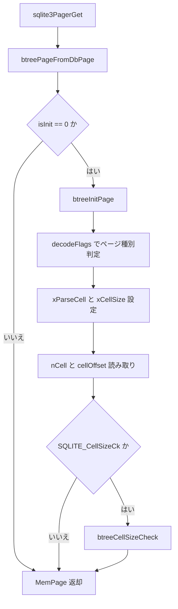

# 第17章 B-tree（1）ファイルフォーマットとページ

> **本章で読むソース**
>
> - [src/btree.c](https://github.com/sqlite/sqlite/blob/version-3.53.3/src/btree.c)
> - [src/btreeInt.h](https://github.com/sqlite/sqlite/blob/version-3.53.3/src/btreeInt.h)

## この章の狙い

第3部までで VDBE が `OP_OpenRead` や `OP_Insert` 経由で B-tree を呼ぶ入口は示した。
本章ではディスク上の B-tree ページがどう配置され、Pager から読み込んだ生バイトが `MemPage` として解釈されるかを読む。
`btreeInitPage` と `zeroPage` がページヘッダを立て、セル解析関数が可変長整数とペイロード境界を切り出す。

## 前提

SQLite のテーブル行とインデックスは、いずれも B-tree ページの連鎖として格納される。
1ページはファイルヘッダ（ページ1のみ）、ページヘッダ、セルポインタ配列、セル内容領域の4層に分かれる。
`btreeInt.h` 冒頭のコメントがオンディスク仕様の一次資料であり、実装はこのレイアウトに従って `get2byte` や `getVarint` でフィールドを読む。

[src/btreeInt.h L53-L84](https://github.com/sqlite/sqlite/blob/version-3.53.3/src/btreeInt.h#L53-L84)

```c
** The first page is always a btree page.  The first 100 bytes of the first
** page contain a special header (the "file header") that describes the file.
** The format of the file header is as follows:
**
**   OFFSET   SIZE    DESCRIPTION
**      0      16     Header string: "SQLite format 3\000"
**     16       2     Page size in bytes.  (1 means 65536)
**     18       1     File format write version
**     19       1     File format read version
**     20       1     Bytes of unused space at the end of each page
**     21       1     Max embedded payload fraction (must be 64)
**     22       1     Min embedded payload fraction (must be 32)
**     23       1     Min leaf payload fraction (must be 32)
**     24       4     File change counter
**     28       4     The size of the database in pages
**     32       4     First freelist page
**     36       4     Number of freelist pages in the file
**     40      60     15 4-byte meta values passed to higher layers
**
**     40       4     Schema cookie
**     44       4     File format of schema layer
**     48       4     Size of page cache
**     52       4     Largest root-page (auto/incr_vacuum)
**     56       4     1=UTF-8 2=UTF16le 3=UTF16be
**     60       4     User version
**     64       4     Incremental vacuum mode
**     68       4     Application-ID
**     72      20     unused
**     92       4     The version-valid-for number
**     96       4     SQLITE_VERSION_NUMBER
**
** All of the integer values are big-endian (most significant byte first).
```

**フリーリスト**はファイルヘッダのオフセット32からたどるトランクページの連鎖である。
トランクは次のトランク番号と複数のリーフページ番号を保持し、解放されたページを再利用する。

[src/btreeInt.h L206-L214](https://github.com/sqlite/sqlite/blob/version-3.53.3/src/btreeInt.h#L206-L214)

```c
** Freelist pages come in two subtypes: trunk pages and leaf pages.  The
** file header points to the first in a linked list of trunk page.  Each trunk
** page points to multiple leaf pages.  The content of a leaf page is
** unspecified.  A trunk page looks like this:
**
**    SIZE    DESCRIPTION
**      4     Page number of next trunk page
**      4     Number of leaf pointers on this page
**      *     zero or more pages numbers of leaves
```

## MemPage と BtShared

Pager がページをキャッシュに載せると、`sqlite3PagerGetExtra` で確保した領域に `MemPage` が重なる。
先頭8バイトだけは Pager 側でゼロ初期化され、残りは `btreeInitPage` が埋める。
`aData` はディスクイメージ、`xParseCell` と `xCellSize` はページ種別ごとの関数ポインタである。

[src/btreeInt.h L273-L304](https://github.com/sqlite/sqlite/blob/version-3.53.3/src/btreeInt.h#L273-L304)

```c
struct MemPage {
  u8 isInit;           /* True if previously initialized. MUST BE FIRST! */
  u8 intKey;           /* True if table b-trees.  False for index b-trees */
  u8 intKeyLeaf;       /* True if the leaf of an intKey table */
  Pgno pgno;           /* Page number for this page */
  // ... (中略) ...
  u8 leaf;             /* True if a leaf page */
  u8 hdrOffset;        /* 100 for page 1.  0 otherwise */
  u8 childPtrSize;     /* 0 if leaf==1.  4 if leaf==0 */
  u8 max1bytePayload;  /* min(maxLocal,127) */
  u8 nOverflow;        /* Number of overflow cell bodies in aCell[] */
  u16 maxLocal;        /* Copy of BtShared.maxLocal or BtShared.maxLeaf */
  u16 minLocal;        /* Copy of BtShared.minLocal or BtShared.minLeaf */
  u16 cellOffset;      /* Index in aData of first cell pointer */
  int nFree;           /* Number of free bytes on the page. -1 for unknown */
  u16 nCell;           /* Number of cells on this page, local and ovfl */
  u16 maskPage;        /* Mask for page offset */
  u16 aiOvfl[4];       /* Insert the i-th overflow cell before the aiOvfl-th
                       ** non-overflow cell */
  u8 *apOvfl[4];       /* Pointers to the body of overflow cells */
  BtShared *pBt;       /* Pointer to BtShared that this page is part of */
  u8 *aData;           /* Pointer to disk image of the page data */
  u8 *aDataEnd;        /* One byte past the end of the entire page - not just
                       ** the usable space, the entire page.  Used to prevent
                       ** corruption-induced buffer overflow. */
  u8 *aCellIdx;        /* The cell index area */
  u8 *aDataOfst;       /* Same as aData for leaves.  aData+4 for interior */
  DbPage *pDbPage;     /* Pager page handle */
  u16 (*xCellSize)(MemPage*,u8*);             /* cellSizePtr method */
  void (*xParseCell)(MemPage*,u8*,CellInfo*); /* btreeParseCell method */
};
```

共有キャッシュが有効で同一ファイルのページキャッシュを複数接続が共有するとき、実体は `BtShared` に集約される。
通常モードでは同じファイルを複数接続が開いても `BtShared` は共有されない。
`pPager` がページキャッシュを担う。
`maxLocal` と `maxLeaf` はローカル保持量の上限、`minLocal` と `minLeaf` はオーバーフローページを使うセルでページ内に残す最小量である。
`pTmpSpace` はセル組み立て用の一時バッファである。

[src/btreeInt.h L425-L460](https://github.com/sqlite/sqlite/blob/version-3.53.3/src/btreeInt.h#L425-L460)

```c
struct BtShared {
  Pager *pPager;        /* The page cache */
  sqlite3 *db;          /* Database connection currently using this Btree */
  BtCursor *pCursor;    /* A list of all open cursors */
  MemPage *pPage1;      /* First page of the database */
  u8 openFlags;         /* Flags to sqlite3BtreeOpen() */
  // ... (中略) ...
  u16 maxLocal;         /* Maximum local payload in non-LEAFDATA tables */
  u16 minLocal;         /* Minimum local payload in non-LEAFDATA tables */
  u16 maxLeaf;          /* Maximum local payload in a LEAFDATA table */
  u16 minLeaf;          /* Minimum local payload in a LEAFDATA table */
  u32 pageSize;         /* Total number of bytes on a page */
  u32 usableSize;       /* Number of usable bytes on each page */
  int nTransaction;     /* Number of open transactions (read + write) */
  u32 nPage;            /* Number of pages in the database */
  void *pSchema;        /* Pointer to space allocated by sqlite3BtreeSchema() */
  void (*xFreeSchema)(void*);  /* Destructor for BtShared.pSchema */
  sqlite3_mutex *mutex; /* Non-recursive mutex required to access this object */
  Bitvec *pHasContent;  /* Set of pages moved to free-list this transaction */
  // ... (中略) ...
  u8 *pTmpSpace;        /* Temp space sufficient to hold a single cell */
  int nPreformatSize;   /* Size of last cell written by TransferRow() */
};
```

セル解析の結果は `CellInfo` に集約される。
テーブル葉では `nKey` が rowid、インデックスではペイロード長がキー長に相当する。

[src/btreeInt.h L480-L486](https://github.com/sqlite/sqlite/blob/version-3.53.3/src/btreeInt.h#L480-L486)

```c
struct CellInfo {
  i64 nKey;      /* The key for INTKEY tables, or nPayload otherwise */
  u8 *pPayload;  /* Pointer to the start of payload */
  u32 nPayload;  /* Bytes of payload */
  u16 nLocal;    /* Amount of payload held locally, not on overflow */
  u16 nSize;     /* Size of the cell content on the main b-tree page */
};
```

## ページの初期化経路

`getAndInitPage` は Pager から `DbPage` を取得し、`isInit` が立っていなければ `btreeInitPage` を呼ぶ。
これが B-tree 層への標準的な読み込み入口である。

[src/btree.c L2379-L2413](https://github.com/sqlite/sqlite/blob/version-3.53.3/src/btree.c#L2379-L2413)

```c
static int getAndInitPage(
  BtShared *pBt,                  /* The database file */
  Pgno pgno,                      /* Number of the page to get */
  MemPage **ppPage,               /* Write the page pointer here */
  int bReadOnly                   /* True for a read-only page */
){
  int rc;
  DbPage *pDbPage;
  MemPage *pPage;
  assert( sqlite3_mutex_held(pBt->mutex) );

  if( pgno>btreePagecount(pBt) ){
    *ppPage = 0;
    return SQLITE_CORRUPT_BKPT;
  }
  rc = sqlite3PagerGet(pBt->pPager, pgno, (DbPage**)&pDbPage, bReadOnly);
  if( rc ){
    *ppPage = 0;
    return rc;
  }
  pPage = (MemPage*)sqlite3PagerGetExtra(pDbPage);
  if( pPage->isInit==0 ){
    btreePageFromDbPage(pDbPage, pgno, pBt);
    rc = btreeInitPage(pPage);
    if( rc!=SQLITE_OK ){
      releasePage(pPage);
      *ppPage = 0;
      return rc;
    }
  }
  assert( pPage->pgno==pgno || CORRUPT_DB );
  assert( pPage->aData==sqlite3PagerGetData(pDbPage) );
  *ppPage = pPage;
  return SQLITE_OK;
}
```

`btreeInitPage` はフラグバイトを `decodeFlags` に渡し、セル数と `cellOffset` を確定する。
`SQLITE_CellSizeCk` が有効なら `btreeCellSizeCheck` で各セル境界も検証する。

[src/btree.c L2218-L2265](https://github.com/sqlite/sqlite/blob/version-3.53.3/src/btree.c#L2218-L2265)

```c
static int btreeInitPage(MemPage *pPage){
  u8 *data;          /* Equal to pPage->aData */
  BtShared *pBt;        /* The main btree structure */

  assert( pPage->pBt!=0 );
  assert( pPage->pBt->db!=0 );
  assert( sqlite3_mutex_held(pPage->pBt->mutex) );
  assert( pPage->pgno==sqlite3PagerPagenumber(pPage->pDbPage) );
  assert( pPage == sqlite3PagerGetExtra(pPage->pDbPage) );
  assert( pPage->aData == sqlite3PagerGetData(pPage->pDbPage) );
  assert( pPage->isInit==0 );

  pBt = pPage->pBt;
  data = pPage->aData + pPage->hdrOffset;
  if( decodeFlags(pPage, data[0]) ){
    return SQLITE_CORRUPT_PAGE(pPage);
  }
  assert( pBt->pageSize>=512 && pBt->pageSize<=65536 );
  pPage->maskPage = (u16)(pBt->pageSize - 1);
  pPage->nOverflow = 0;
  pPage->cellOffset = (u16)(pPage->hdrOffset + 8 + pPage->childPtrSize);
  pPage->aCellIdx = data + pPage->childPtrSize + 8;
  pPage->aDataEnd = pPage->aData + pBt->pageSize;
  pPage->aDataOfst = pPage->aData + pPage->childPtrSize;
  pPage->nCell = get2byte(&data[3]);
  if( pPage->nCell>MX_CELL(pBt) ){
    return SQLITE_CORRUPT_PAGE(pPage);
  }
  pPage->nFree = -1;  /* Indicate that this value is yet uncomputed */
  pPage->isInit = 1;
  if( pBt->db->flags & SQLITE_CellSizeCk ){
    return btreeCellSizeCheck(pPage);
  }
  return SQLITE_OK;
}
```

`decodeFlags` はページ先頭1バイト（`PTF_INTKEY`、`PTF_LEAF` 等）から葉か内部か、テーブルかインデックスかを判定し、対応する `xParseCell` を割り当てる。

[src/btree.c L2028-L2085](https://github.com/sqlite/sqlite/blob/version-3.53.3/src/btree.c#L2028-L2085)

```c
static int decodeFlags(MemPage *pPage, int flagByte){
  BtShared *pBt;     /* A copy of pPage->pBt */

  assert( pPage->hdrOffset==(pPage->pgno==1 ? 100 : 0) );
  assert( sqlite3_mutex_held(pPage->pBt->mutex) );
  pBt = pPage->pBt;
  pPage->max1bytePayload = pBt->max1bytePayload;
  if( flagByte>=(PTF_ZERODATA | PTF_LEAF) ){
    pPage->childPtrSize = 0;
    pPage->leaf = 1;
    if( flagByte==(PTF_LEAFDATA | PTF_INTKEY | PTF_LEAF) ){
      pPage->intKeyLeaf = 1;
      pPage->xCellSize = cellSizePtrTableLeaf;
      pPage->xParseCell = btreeParseCellPtr;
      pPage->intKey = 1;
      pPage->maxLocal = pBt->maxLeaf;
      pPage->minLocal = pBt->minLeaf;
    }else if( flagByte==(PTF_ZERODATA | PTF_LEAF) ){
      pPage->intKey = 0;
      pPage->intKeyLeaf = 0;
      pPage->xCellSize = cellSizePtrIdxLeaf;
      pPage->xParseCell = btreeParseCellPtrIndex;
      pPage->maxLocal = pBt->maxLocal;
      pPage->minLocal = pBt->minLocal;
    }else{
      // ... (中略) ...
      return SQLITE_CORRUPT_PAGE(pPage);
    }
  }else{
    pPage->childPtrSize = 4;
    pPage->leaf = 0;
    // ... (中略) ...
  }
  return SQLITE_OK;
}
```

新規ページやルートの空化では `zeroPage` がヘッダを書き、`decodeFlags` で `MemPage` 側の派生フィールドを揃える。

[src/btree.c L2271-L2301](https://github.com/sqlite/sqlite/blob/version-3.53.3/src/btree.c#L2271-L2301)

```c
static void zeroPage(MemPage *pPage, int flags){
  unsigned char *data = pPage->aData;
  BtShared *pBt = pPage->pBt;
  int hdr = pPage->hdrOffset;
  int first;

  assert( sqlite3PagerPagenumber(pPage->pDbPage)==pPage->pgno || CORRUPT_DB );
  assert( sqlite3PagerGetExtra(pPage->pDbPage) == (void*)pPage );
  assert( sqlite3PagerGetData(pPage->pDbPage) == data );
  assert( sqlite3PagerIswriteable(pPage->pDbPage) );
  assert( sqlite3_mutex_held(pBt->mutex) );
  if( pBt->btsFlags & BTS_FAST_SECURE ){
    memset(&data[hdr], 0, pBt->usableSize - hdr);
  }
  data[hdr] = (char)flags;
  first = hdr + ((flags&PTF_LEAF)==0 ? 12 : 8);
  memset(&data[hdr+1], 0, 4);
  data[hdr+7] = 0;
  put2byte(&data[hdr+5], pBt->usableSize);
  pPage->nFree = (u16)(pBt->usableSize - first);
  decodeFlags(pPage, flags);
  pPage->cellOffset = (u16)first;
  pPage->aDataEnd = &data[pBt->pageSize];
  pPage->aCellIdx = &data[first];
  pPage->aDataOfst = &data[pPage->childPtrSize];
  pPage->nOverflow = 0;
  pPage->maskPage = (u16)(pBt->pageSize - 1);
  pPage->nCell = 0;
  pPage->isInit = 1;
}
```

## セル内容の解析

テーブル葉セルは可変長のデータ長と整数キー（rowid）が連続し、ペイロードはその直後から始まる。
`btreeParseCellPtr` は `getVarint` のインライン展開でホットパスを短くしている。

[src/btree.c L1259-L1346](https://github.com/sqlite/sqlite/blob/version-3.53.3/src/btree.c#L1259-L1346)

```c
static void btreeParseCellPtr(
  MemPage *pPage,         /* Page containing the cell */
  u8 *pCell,              /* Pointer to the cell text. */
  CellInfo *pInfo         /* Fill in this structure */
){
  u8 *pIter;              /* For scanning through pCell */
  u64 nPayload;           /* Number of bytes of cell payload */
  u64 iKey;               /* Extracted Key value */

  assert( sqlite3_mutex_held(pPage->pBt->mutex) );
  assert( pPage->leaf==0 || pPage->leaf==1 );
  assert( pPage->intKeyLeaf );
  assert( pPage->childPtrSize==0 );
  pIter = pCell;

  nPayload = *pIter;
  if( nPayload>=0x80 ){
    u8 *pEnd = &pIter[8];
    nPayload &= 0x7f;
    do{
      nPayload = (nPayload<<7) | (*++pIter & 0x7f);
    }while( (*pIter)>=0x80 && pIter<pEnd );
    nPayload &= 0xffffffff;
  }
  pIter++;

  iKey = *pIter;
  if( iKey>=0x80 ){
    // ... (中略) ... varint 展開 ...
  }
  pIter++;

  pInfo->nKey = *(i64*)&iKey;
  pInfo->nPayload = (u32)nPayload;
  pInfo->pPayload = pIter;
  if( nPayload<=pPage->maxLocal ){
    pInfo->nSize = (u16)nPayload + (u16)(pIter - pCell);
    if( pInfo->nSize<4 ) pInfo->nSize = 4;
    pInfo->nLocal = (u16)nPayload;
  }else{
    btreeParseCellAdjustSizeForOverflow(pPage, pCell, pInfo);
  }
}
```

インデックス葉は子ポインタを持たず、キー長とレコード本体がペイロード全体になる。

[src/btree.c L1347-L1385](https://github.com/sqlite/sqlite/blob/version-3.53.3/src/btree.c#L1347-L1385)

```c
static void btreeParseCellPtrIndex(
  MemPage *pPage,         /* Page containing the cell */
  u8 *pCell,              /* Pointer to the cell text. */
  CellInfo *pInfo         /* Fill in this structure */
){
  u8 *pIter;              /* For scanning through pCell */
  u32 nPayload;           /* Number of bytes of cell payload */

  assert( sqlite3_mutex_held(pPage->pBt->mutex) );
  assert( pPage->leaf==0 || pPage->leaf==1 );
  assert( pPage->intKeyLeaf==0 );
  pIter = pCell + pPage->childPtrSize;
  nPayload = *pIter;
  if( nPayload>=0x80 ){
    u8 *pEnd = &pIter[8];
    nPayload &= 0x7f;
    do{
      nPayload = (nPayload<<7) | (*++pIter & 0x7f);
    }while( *(pIter)>=0x80 && pIter<pEnd );
  }
  pIter++;
  pInfo->nKey = nPayload;
  pInfo->nPayload = nPayload;
  pInfo->pPayload = pIter;
  if( nPayload<=pPage->maxLocal ){
    pInfo->nSize = (u16)nPayload + (u16)(pIter - pCell);
    if( pInfo->nSize<4 ) pInfo->nSize = 4;
    pInfo->nLocal = (u16)nPayload;
  }else{
    btreeParseCellAdjustSizeForOverflow(pPage, pCell, pInfo);
  }
}
```

## 処理の流れ

ディスクページが `MemPage` になるまでの経路を示す。



## 高速化と最適化の工夫

`btreeParseCellPtr` はコメントどおり high-runner であり、可変長整数デコードを関数呼び出しせずインライン展開している。
これによりテーブル走査や挿入位置探索のたびに発生するセル先頭解析の命令数を抑える。
`MemPage` の `xParseCell` 関数ポインタは `decodeFlags` 時に一度だけ設定され、ページ種別ごとの分岐を初期化段階に閉じ込める。

## まとめ

B-tree ページはファイルヘッダ、ページヘッダ、セルポインタ、セル内容の4層で構成される。
`getAndInitPage` が Pager ページを `MemPage` に変換し、`btreeInitPage` がオンディスクヘッダをメモリ上のメタデータへ写す。
セル境界は `btreeParseCellPtr` 系が可変長整数を読み、`CellInfo` にキー長、ペイロード先頭、ローカル保持量を渡す。

## 関連する章

- [第13章 VDBE バイトコードエンジン](../part03-vdbe/13-vdbe-engine.md)（`OP_OpenRead` から B-tree カーソルへ）
- [第18章 B-tree（2）カーソルと探索](18-btree-cursor.md)（`BtCursor` と `moveToRoot`）
- [第20章 Pager とトランザクション](20-pager.md)（`sqlite3PagerGet` とページキャッシュ）
