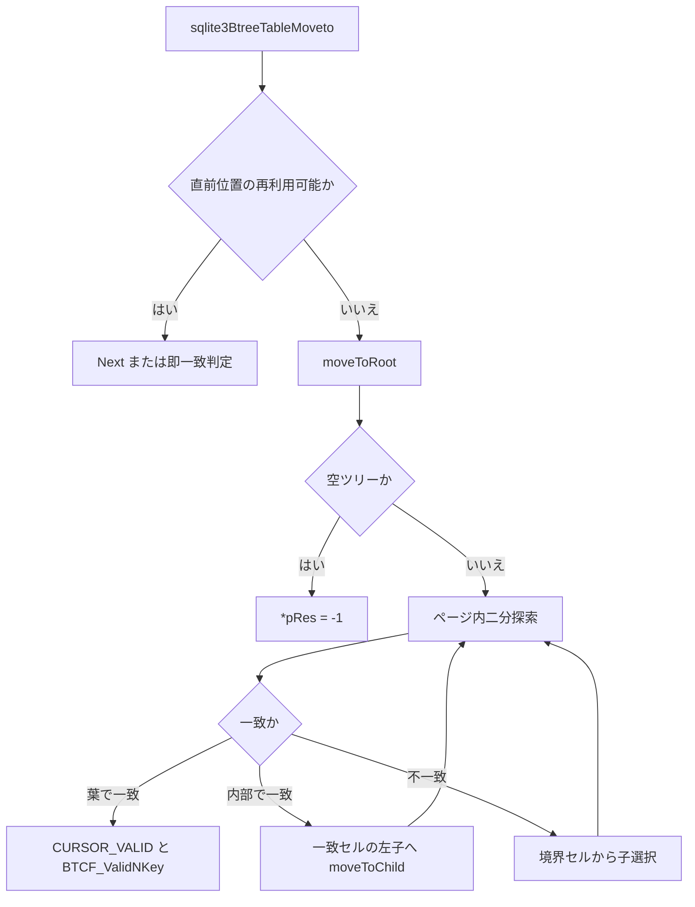

# 第18章 B-tree（2）カーソルと探索

> **本章で読むソース**
>
> - [src/btree.c](https://github.com/sqlite/sqlite/blob/version-3.53.3/src/btree.c)
> - [src/btreeInt.h](https://github.com/sqlite/sqlite/blob/version-3.53.3/src/btreeInt.h)

## この章の狙い

VDBE の `OP_SeekRowid` や `OP_SeekGE` は、最終的に B-tree カーソルを目的のセルへ移動させる。
本章では `BtCursor` がページスタックをどう保持し、`sqlite3BtreeTableMoveto` と `sqlite3BtreeIndexMoveto` が二分探索と子ページ降下を繰り返すかを読む。
VDBE の seek opcode はこの2関数を直接呼ぶ。
`btreeMoveto` は保存済みキーや packed key を展開して両 API へ振り分ける補助関数に限られる。

## 前提

**カーソル**は特定 B-tree 内の1エントリを指す `BtCursor` である。
現在地は `pPage`（葉または内部ページ）、`ix`（セルインデックス）、`apPage[]` と `aiIdx[]`（祖先スタック）で表現される。
`eState` は `CURSOR_VALID` から `CURSOR_REQUIRESEEK` まで遷移し、ページのバランス後は位置の再探索が必要になる。

[src/btreeInt.h L531-L557](https://github.com/sqlite/sqlite/blob/version-3.53.3/src/btreeInt.h#L531-L557)

```c
struct BtCursor {
  u8 eState;                /* One of the CURSOR_XXX constants (see below) */
  u8 curFlags;              /* zero or more BTCF_* flags defined below */
  u8 curPagerFlags;         /* Flags to send to sqlite3PagerGet() */
  u8 hints;                 /* As configured by CursorSetHints() */
  int skipNext;    /* Prev() is noop if negative. Next() is noop if positive.
                   ** Error code if eState==CURSOR_FAULT */
  Btree *pBtree;            /* The Btree to which this cursor belongs */
  Pgno *aOverflow;          /* Cache of overflow page locations */
  void *pKey;               /* Saved key that was cursor last known position */
  // ... (中略) ...
  BtShared *pBt;            /* The BtShared this cursor points to */
  BtCursor *pNext;          /* Forms a linked list of all cursors */
  CellInfo info;            /* A parse of the cell we are pointing at */
  i64 nKey;                 /* Size of pKey, or last integer key */
  Pgno pgnoRoot;            /* The root page of this tree */
  i8 iPage;                 /* Index of current page in apPage */
  u8 curIntKey;             /* Value of apPage[0]->intKey */
  u16 ix;                   /* Current index for apPage[iPage] */
  u16 aiIdx[BTCURSOR_MAX_DEPTH-1];     /* Current index in apPage[i] */
  struct KeyInfo *pKeyInfo;            /* Arg passed to comparison function */
  MemPage *pPage;                        /* Current page */
  MemPage *apPage[BTCURSOR_MAX_DEPTH-1]; /* Stack of parents of current page */
};
```

`pKeyInfo` が NULL ならテーブル B-tree（整数キー）、非 NULL ならインデックス B-tree として開かれている。
`BTCF_ValidNKey` が立っているとき、直前の `getCellInfo` 結果を再利用できる。

## btreeMoveto と packed key の展開

`btreeMoveto` は packed インデックスキーを `UnpackedRecord` に展開し `sqlite3BtreeIndexMoveto` へ渡す補助関数である。
テーブル側は `pKey` が NULL のため `sqlite3BtreeTableMoveto` が整数キー探索を行う。
呼び出し元は `btreeRestoreCursorPosition`（保存済みキーから位置復元）と `sqlite3BtreeInsert` の packed-key 経路に限られ、VDBE の seek opcode は `sqlite3BtreeTableMoveto` と `sqlite3BtreeIndexMoveto` を直接使う。

[src/btree.c L860-L887](https://github.com/sqlite/sqlite/blob/version-3.53.3/src/btree.c#L860-L887)

```c
static int btreeMoveto(
  BtCursor *pCur,     /* Cursor open on the btree to be searched */
  const void *pKey,   /* Packed key if the btree is an index */
  i64 nKey,           /* Integer key for tables.  Size of pKey for indices */
  int bias,           /* Bias search to the high end */
  int *pRes           /* Write search results here */
){
  int rc;                    /* Status code */
  UnpackedRecord *pIdxKey;   /* Unpacked index key */

  if( pKey ){
    KeyInfo *pKeyInfo = pCur->pKeyInfo;
    assert( nKey==(i64)(int)nKey );
    pIdxKey = sqlite3VdbeAllocUnpackedRecord(pKeyInfo);
    if( pIdxKey==0 ) return SQLITE_NOMEM_BKPT;
    sqlite3VdbeRecordUnpack((int)nKey, pKey, pIdxKey);
    if( pIdxKey->nField==0 || pIdxKey->nField>pKeyInfo->nAllField ){
      rc = SQLITE_CORRUPT_BKPT;
    }else{
      rc = sqlite3BtreeIndexMoveto(pCur, pIdxKey, pRes);
    }
    sqlite3DbFree(pCur->pKeyInfo->db, pIdxKey);
  }else{
    pIdxKey = 0;
    rc = sqlite3BtreeTableMoveto(pCur, nKey, bias, pRes);
  }
  return rc;
}
```

注記として、公開 API 名 `sqlite3BtreeMovetoUnpacked` は version-3.53.3 の `btree.c` には存在しない。
インデックス探索は `sqlite3BtreeIndexMoveto` が `UnpackedRecord` を直接受け取る形で実装されている。
`SQLITE_DEBUG` 時の `Btree.nSeek` カウンタはデバッグ用の別名を参照するコメントを持つが、本章の主経路には含めない。

## moveToRoot と moveToChild

探索はまず `moveToRoot` でルート（または仮想ルート）へ戻る。
ルートにセルがなく内部ページだけのとき、ページ1では子1枚へ降りる仮想ルート処理が入る。

[src/btree.c L5554-L5631](https://github.com/sqlite/sqlite/blob/version-3.53.3/src/btree.c#L5554-L5631)

```c
static int moveToRoot(BtCursor *pCur){
  MemPage *pRoot;
  int rc = SQLITE_OK;

  assert( cursorOwnsBtShared(pCur) );
  // ... (中略) ...
  if( pCur->iPage>=0 ){
    if( pCur->iPage ){
      releasePageNotNull(pCur->pPage);
      while( --pCur->iPage ){
        releasePageNotNull(pCur->apPage[pCur->iPage]);
      }
      pRoot = pCur->pPage = pCur->apPage[0];
      goto skip_init;
    }
  }else if( pCur->pgnoRoot==0 ){
    pCur->eState = CURSOR_INVALID;
    return SQLITE_EMPTY;
  }else{
    assert( pCur->iPage==(-1) );
    if( pCur->eState>=CURSOR_REQUIRESEEK ){
      if( pCur->eState==CURSOR_FAULT ){
        assert( pCur->skipNext!=SQLITE_OK );
        return pCur->skipNext;
      }
      sqlite3BtreeClearCursor(pCur);
    }
    rc = getAndInitPage(pCur->pBt, pCur->pgnoRoot, &pCur->pPage,
                        pCur->curPagerFlags);
    if( rc!=SQLITE_OK ){
      pCur->eState = CURSOR_INVALID;
      return rc;
    }
    pCur->iPage = 0;
    pCur->curIntKey = pCur->pPage->intKey;
  }
  pRoot = pCur->pPage;
  // ... (中略) ...
  if( pRoot->nCell>0 ){
    pCur->eState = CURSOR_VALID;
  }else if( !pRoot->leaf ){
    Pgno subpage;
    if( pRoot->pgno!=1 ) return SQLITE_CORRUPT_BKPT;
    subpage = get4byte(&pRoot->aData[pRoot->hdrOffset+8]);
    pCur->eState = CURSOR_VALID;
    rc = moveToChild(pCur, subpage);
  }else{
    pCur->eState = CURSOR_INVALID;
    rc = SQLITE_EMPTY;
  }
  return rc;
}
```

内部ページで子へ降りるときは `moveToChild` が祖先スタックへ現在ページを積み、`getAndInitPage` で子を読む。
子の `intKey` フラグが親ツリーと一致しない場合は破損として `SQLITE_CORRUPT` を返す。

[src/btree.c L5454-L5481](https://github.com/sqlite/sqlite/blob/version-3.53.3/src/btree.c#L5454-L5481)

```c
static int moveToChild(BtCursor *pCur, u32 newPgno){
  int rc;
  assert( cursorOwnsBtShared(pCur) );
  assert( pCur->eState==CURSOR_VALID );
  assert( pCur->iPage<BTCURSOR_MAX_DEPTH );
  assert( pCur->iPage>=0 );
  if( pCur->iPage>=(BTCURSOR_MAX_DEPTH-1) ){
    return SQLITE_CORRUPT_BKPT;
  }
  pCur->info.nSize = 0;
  pCur->curFlags &= ~(BTCF_ValidNKey|BTCF_ValidOvfl);
  pCur->aiIdx[pCur->iPage] = pCur->ix;
  pCur->apPage[pCur->iPage] = pCur->pPage;
  pCur->ix = 0;
  pCur->iPage++;
  rc = getAndInitPage(pCur->pBt, newPgno, &pCur->pPage, pCur->curPagerFlags);
  assert( pCur->pPage!=0 || rc!=SQLITE_OK );
  if( rc==SQLITE_OK
   && (pCur->pPage->nCell<1 || pCur->pPage->intKey!=pCur->curIntKey)
  ){
    releasePage(pCur->pPage);
    rc = SQLITE_CORRUPT_PGNO(newPgno);
  }
  if( rc ){
    pCur->pPage = pCur->apPage[--pCur->iPage];
  }
  return rc;
}
```

## sqlite3BtreeTableMoveto

テーブル探索は各レベルでセル内の整数キーを `getVarint` で読み、二分探索する。
一致かつ内部ページなら一致した separator cell のインデックスを `lwr` に設定し、そのセルが指す左子へ降りる。
葉で一致したときは `BTCF_ValidNKey` を立てて `*pRes=0` で終了する。

[src/btree.c L5805-L5946](https://github.com/sqlite/sqlite/blob/version-3.53.3/src/btree.c#L5805-L5946)

```c
int sqlite3BtreeTableMoveto(
  BtCursor *pCur,          /* The cursor to be moved */
  i64 intKey,              /* The table key */
  int biasRight,           /* If true, bias the search to the high end */
  int *pRes                /* Write search results here */
){
  int rc;

  assert( cursorOwnsBtShared(pCur) );
  assert( sqlite3_mutex_held(pCur->pBtree->db->mutex) );
  assert( pRes );
  assert( pCur->pKeyInfo==0 );
  assert( pCur->eState!=CURSOR_VALID || pCur->curIntKey!=0 );

  if( pCur->eState==CURSOR_VALID && (pCur->curFlags & BTCF_ValidNKey)!=0 ){
    if( pCur->info.nKey==intKey ){
      *pRes = 0;
      return SQLITE_OK;
    }
    if( pCur->info.nKey<intKey ){
      if( (pCur->curFlags & BTCF_AtLast)!=0 ){
        assert( cursorIsAtLastEntry(pCur) || CORRUPT_DB );
        *pRes = -1;
        return SQLITE_OK;
      }
      if( pCur->info.nKey+1==intKey ){
        *pRes = 0;
        rc = sqlite3BtreeNext(pCur, 0);
        if( rc==SQLITE_OK ){
          getCellInfo(pCur);
          if( pCur->info.nKey==intKey ){
            return SQLITE_OK;
          }
        }else if( rc!=SQLITE_DONE ){
          return rc;
        }
      }
    }
  }

  rc = moveToRoot(pCur);
  if( rc ){
    if( rc==SQLITE_EMPTY ){
      assert( pCur->pgnoRoot==0 || pCur->pPage->nCell==0 );
      *pRes = -1;
      return SQLITE_OK;
    }
    return rc;
  }
  // ... (中略) ...
  for(;;){
    int lwr, upr, idx, c;
    Pgno chldPg;
    MemPage *pPage = pCur->pPage;
    u8 *pCell;

    lwr = 0;
    upr = pPage->nCell-1;
    assert( biasRight==0 || biasRight==1 );
    idx = upr>>(1-biasRight);
    for(;;){
      i64 nCellKey;
      pCell = findCellPastPtr(pPage, idx);
      if( pPage->intKeyLeaf ){
        while( 0x80 <= *(pCell++) ){
          if( pCell>=pPage->aDataEnd ){
            return SQLITE_CORRUPT_PAGE(pPage);
          }
        }
      }
      getVarint(pCell, (u64*)&nCellKey);
      if( nCellKey<intKey ){
        lwr = idx+1;
        if( lwr>upr ){ c = -1; break; }
      }else if( nCellKey>intKey ){
        upr = idx-1;
        if( lwr>upr ){ c = +1; break; }
      }else{
        assert( nCellKey==intKey );
        pCur->ix = (u16)idx;
        if( !pPage->leaf ){
          lwr = idx;
          goto moveto_table_next_layer;
        }else{
          pCur->curFlags |= BTCF_ValidNKey;
          pCur->info.nKey = nCellKey;
          pCur->info.nSize = 0;
          *pRes = 0;
          return SQLITE_OK;
        }
      }
      idx = (lwr+upr)>>1;
    }
    // ... (中略) 子ページへ moveToChild ...
  }
  // ... (中略) ...
}
```

テーブル B-tree の整数キーは一意であるため、同値セルの優先は起きない。
`biasRight` が 0 なら中央セルから二分探索を始め、1 なら最右セルから始めて append 挿入を見込んだ探索を短縮する。

## sqlite3BtreeIndexMoveto

インデックス探索は `sqlite3VdbeFindCompare` で得た比較関数をセルレコードに適用する。
レコードがページ内に収まる場合は先頭1〜2バイトだけ読んでサイズを推定し、オーバーフローへ流れるときだけ `accessPayload` で全体を取得する。

[src/btree.c L6036-L6218](https://github.com/sqlite/sqlite/blob/version-3.53.3/src/btree.c#L6036-L6218)

```c
int sqlite3BtreeIndexMoveto(
  BtCursor *pCur,          /* The cursor to be moved */
  UnpackedRecord *pIdxKey, /* Unpacked index key */
  int *pRes                /* Write search results here */
){
  int rc;
  RecordCompare xRecordCompare;

  assert( cursorOwnsBtShared(pCur) );
  assert( sqlite3_mutex_held(pCur->pBtree->db->mutex) );
  assert( pRes );
  assert( pCur->pKeyInfo!=0 );

  xRecordCompare = sqlite3VdbeFindCompare(pIdxKey);
  pIdxKey->errCode = 0;

  if( pCur->eState==CURSOR_VALID
   && pCur->pPage->leaf
   && cursorOnLastPage(pCur)
  ){
    int c;
    if( pCur->ix==pCur->pPage->nCell-1
     && (c = indexCellCompare(pCur->pPage,pCur->ix,pIdxKey,xRecordCompare))<=0
     && pIdxKey->errCode==SQLITE_OK
    ){
      *pRes = c;
      return SQLITE_OK;
    }
    if( pCur->iPage>0
     && indexCellCompare(pCur->pPage, 0, pIdxKey, xRecordCompare)<=0
     && pIdxKey->errCode==SQLITE_OK
    ){
      pCur->curFlags &= ~(BTCF_ValidOvfl|BTCF_AtLast);
      goto bypass_moveto_root;
    }
    pIdxKey->errCode = SQLITE_OK;
  }

  rc = moveToRoot(pCur);
  // ... (中略) ...
bypass_moveto_root:
  for(;;){
    int lwr, upr, idx, c;
    Pgno chldPg;
    MemPage *pPage = pCur->pPage;
    u8 *pCell;

    lwr = 0;
    upr = pPage->nCell-1;
    idx = upr>>1;
    for(;;){
      int nCell;
      pCell = findCellPastPtr(pPage, idx);

      nCell = pCell[0];
      if( nCell<=pPage->max1bytePayload ){
        if( pCell + nCell >= pPage->aDataEnd ){
          rc = SQLITE_CORRUPT_PAGE(pPage);
          goto moveto_index_finish;
        }
        c = xRecordCompare(nCell, (void*)&pCell[1], pIdxKey);
      }else if( !(pCell[1] & 0x80)
        && (nCell = ((nCell&0x7f)<<7) + pCell[1])<=pPage->maxLocal
        && pCell + nCell < pPage->aDataEnd
      ){
        c = xRecordCompare(nCell, (void*)&pCell[2], pIdxKey);
      }else{
        // ... (中略) accessPayload 経由の完全比較 ...
      }
      if( c<0 ){
        lwr = idx+1;
      }else if( c>0 ){
        upr = idx-1;
      }else{
        *pRes = 0;
        rc = SQLITE_OK;
        pCur->ix = (u16)idx;
        goto moveto_index_finish;
      }
      if( lwr>upr ) break;
      idx = (lwr+upr)>>1;
    }
    // ... (中略) 子ページへ降下 ...
  }
moveto_index_finish:
  pCur->info.nSize = 0;
  return rc;
}
```

`indexCellCompare` は上記の「ページ内完結レコード」専用の短絡比較である。

[src/btree.c L5964-L5994](https://github.com/sqlite/sqlite/blob/version-3.53.3/src/btree.c#L5964-L5994)

```c
static int indexCellCompare(
  MemPage *pPage,
  int idx,
  UnpackedRecord *pIdxKey,
  RecordCompare xRecordCompare
){
  int c;
  int nCell;
  u8 *pCell = findCellPastPtr(pPage, idx);

  nCell = pCell[0];
  if( nCell<=pPage->max1bytePayload ){
    if( pCell + nCell >= pPage->aDataEnd ) return 99;
    c = xRecordCompare(nCell, (void*)&pCell[1], pIdxKey);
  }else if( !(pCell[1] & 0x80)
    && (nCell = ((nCell&0x7f)<<7) + pCell[1])<=pPage->maxLocal
  ){
    if( pCell + nCell >= pPage->aDataEnd ) return 99;
    c = xRecordCompare(nCell, (void*)&pCell[2], pIdxKey);
  }else{
    c = 99;
  }
  return c;
}
```

## 処理の流れ

テーブルキー探索の典型経路を示す。



## 高速化と最適化の工夫

`sqlite3BtreeTableMoveto` は現在キーが目的キーの1つ手前なら全木再走査の代わりに `sqlite3BtreeNext` を試す。
連続する整数キー挿入や `INSERT INTO ... SELECT` のような順次アクセスで、ルートからの二分探索コストを避けられる。
インデックス側は `indexCellCompare` と2バイト varint 推定により、オーバーフローしないセルではペイロード全体のコピーを省略する。

## まとめ

`BtCursor` はページスタックと `ix` で木内位置を表し、`moveToRoot` と `moveToChild` が層間移動を担う。
テーブルは整数キーの二分探索、インデックスは `xRecordCompare` によるレコード比較が各レベルで繰り返される。
VDBE の seek は `sqlite3BtreeTableMoveto` と `sqlite3BtreeIndexMoveto` を直接呼ぶ。
`btreeMoveto` は packed key 展開の補助に限られ、`btreeRestoreCursorPosition` と `sqlite3BtreeInsert` から使われる。

## 関連する章

- [第17章 B-tree（1）ファイルフォーマットとページ](17-btree-format.md)（`MemPage` とセルレイアウト）
- [第13章 VDBE バイトコードエンジン](../part03-vdbe/13-vdbe-engine.md)（`OP_SeekRowid` と `OP_IdxGT`）
- [第19章 B-tree（3）挿入、削除、バランス](19-btree-balance.md)（探索後の `sqlite3BtreeInsert`）
