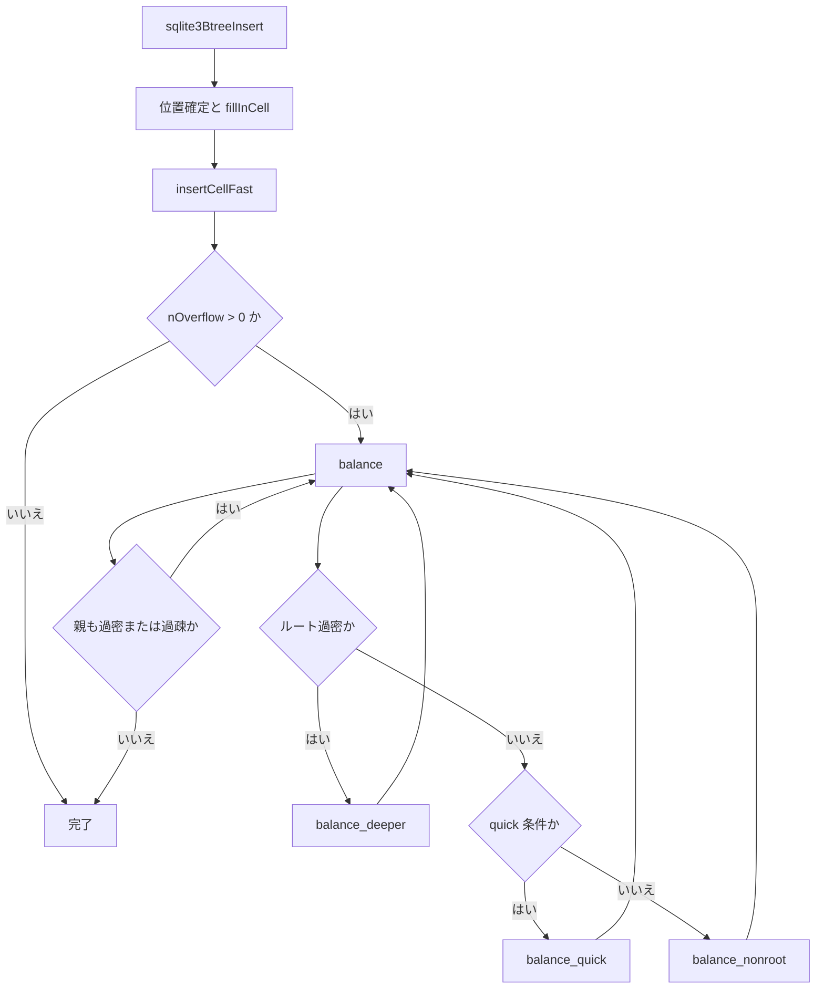

# 第19章 B-tree（3）挿入、削除、バランス

> **本章で読むソース**
>
> - [src/btree.c](https://github.com/sqlite/sqlite/blob/version-3.53.3/src/btree.c)

## この章の狙い

第18章まででカーソルが目的セルへ到達する経路を読んだ。
本章では `sqlite3BtreeInsert` と `sqlite3BtreeDelete` がセルを書き換え、ページが過密または過疎になったとき `balance` が木を再配分する流れを追う。
`balance` は状況に応じて `balance_quick`、`balance_deeper`、`balance_nonroot` のいずれかを選ぶ。

## 前提

挿入は `fillInCell` で新セルバイト列を組み立て、`insertCellFast` でページに載せる。
セルがページ容量を超えると `nOverflow` が立ち、`balance` が兄弟ページや親ページへ再分配する。
削除は内部ノードの場合、削除対象の直前エントリを葉から持ち上げて穴を埋め、その後バランス判定に入る。

## sqlite3BtreeInsert

入口ではカーソル位置の保存、上書き可否、探索の要否を順に処理する。
テーブル B-tree では `sqlite3BtreeTableMoveto`、インデックスでは `btreeMoveto` または `sqlite3BtreeIndexMoveto` で挿入位置を確定する。

[src/btree.c L9409-L9516](https://github.com/sqlite/sqlite/blob/version-3.53.3/src/btree.c#L9409-L9516)

```c
int sqlite3BtreeInsert(
  BtCursor *pCur,                /* Insert data into the table of this cursor */
  const BtreePayload *pX,        /* Content of the row to be inserted */
  int flags,                     /* True if this is likely an append */
  int seekResult                 /* Result of prior IndexMoveto() call */
){
  int rc;
  int loc = seekResult;
  int szNew = 0;
  int idx;
  MemPage *pPage;
  Btree *p = pCur->pBtree;
  unsigned char *oldCell;
  unsigned char *newCell = 0;

  assert( (flags & (BTREE_SAVEPOSITION|BTREE_APPEND|BTREE_PREFORMAT))==flags );
  assert( (flags & BTREE_PREFORMAT)==0 || seekResult || pCur->pKeyInfo==0 );

  if( pCur->curFlags & BTCF_Multiple ){
    rc = saveAllCursors(p->pBt, pCur->pgnoRoot, pCur);
    if( rc ) return rc;
    // ... (中略) ...
  }

  if( pCur->eState>=CURSOR_REQUIRESEEK ){
    rc = moveToRoot(pCur);
    if( rc && rc!=SQLITE_EMPTY ) return rc;
  }

  assert( cursorOwnsBtShared(pCur) );
  assert( (pCur->curFlags & BTCF_WriteFlag)!=0
              && p->pBt->inTransaction==TRANS_WRITE
              && (p->pBt->btsFlags & BTS_READ_ONLY)==0 );

  if( pCur->pKeyInfo==0 ){
    assert( pX->pKey==0 );
    if( p->hasIncrblobCur ){
      invalidateIncrblobCursors(p, pCur->pgnoRoot, pX->nKey, 0);
    }
    if( (pCur->curFlags&BTCF_ValidNKey)!=0 && pX->nKey==pCur->info.nKey ){
      if( pCur->info.nSize!=0
       && pCur->info.nPayload==(u32)pX->nData+pX->nZero
      ){
        return btreeOverwriteCell(pCur, pX);
      }
      assert( loc==0 );
    }else if( loc==0 ){
      rc = sqlite3BtreeTableMoveto(pCur, pX->nKey,
               (flags & BTREE_APPEND)!=0, &loc);
      if( rc ) return rc;
    }
  }else{
    if( loc==0 && (flags & BTREE_SAVEPOSITION)==0 ){
      if( pX->nMem ){
        UnpackedRecord r;
        r.pKeyInfo = pCur->pKeyInfo;
        r.aMem = pX->aMem;
        r.nField = pX->nMem;
        r.default_rc = 0;
        r.eqSeen = 0;
        rc = sqlite3BtreeIndexMoveto(pCur, &r, &loc);
      }else{
        rc = btreeMoveto(pCur, pX->pKey, pX->nKey,
                    (flags & BTREE_APPEND)!=0, &loc);
      }
      if( rc ) return rc;
    }
    // ... (中略) 上書き最適化 ...
  }
```

セル挿入後 `nOverflow` が非ゼロなら `balance` を呼ぶ。
コメントが述べるとおり、バランス後はカーソルを `CURSOR_INVALID` にし、連続挿入時の末尾カーソル保持という別経路の最適化と両立させる。

[src/btree.c L9656-L9705](https://github.com/sqlite/sqlite/blob/version-3.53.3/src/btree.c#L9656-L9705)

```c
  rc = insertCellFast(pPage, idx, newCell, szNew);
  assert( pPage->nOverflow==0 || rc==SQLITE_OK );
  assert( rc!=SQLITE_OK || pPage->nCell>0 || pPage->nOverflow>0 );

  if( pPage->nOverflow ){
    assert( rc==SQLITE_OK );
    pCur->curFlags &= ~(BTCF_ValidNKey|BTCF_ValidOvfl);
    rc = balance(pCur);

    pCur->pPage->nOverflow = 0;
    pCur->eState = CURSOR_INVALID;
    if( (flags & BTREE_SAVEPOSITION) && rc==SQLITE_OK ){
      btreeReleaseAllCursorPages(pCur);
      if( pCur->pKeyInfo ){
        assert( pCur->pKey==0 );
        pCur->pKey = sqlite3Malloc( pX->nKey );
        if( pCur->pKey==0 ){
          rc = SQLITE_NOMEM;
        }else{
          memcpy(pCur->pKey, pX->pKey, pX->nKey);
        }
      }
      pCur->eState = CURSOR_REQUIRESEEK;
      pCur->nKey = pX->nKey;
    }
  }
end_insert:
  return rc;
}
```

## sqlite3BtreeDelete

削除前に `saveCursorKey` で位置保存が必要かを判定する。
内部ノードのセル削除では `sqlite3BtreePrevious` で葉の最大エントリを持ち上げ、親の削除セルを置き換える。

[src/btree.c L9841-L9983](https://github.com/sqlite/sqlite/blob/version-3.53.3/src/btree.c#L9841-L9983)

```c
int sqlite3BtreeDelete(BtCursor *pCur, u8 flags){
  Btree *p = pCur->pBtree;
  BtShared *pBt = p->pBt;
  int rc;
  MemPage *pPage;
  unsigned char *pCell;
  int iCellIdx;
  int iCellDepth;
  CellInfo info;
  u8 bPreserve;

  assert( cursorOwnsBtShared(pCur) );
  assert( pBt->inTransaction==TRANS_WRITE );
  assert( (pBt->btsFlags & BTS_READ_ONLY)==0 );
  assert( pCur->curFlags & BTCF_WriteFlag );

  if( pCur->eState!=CURSOR_VALID ){
    if( pCur->eState>=CURSOR_REQUIRESEEK ){
      rc = btreeRestoreCursorPosition(pCur);
      if( rc || pCur->eState!=CURSOR_VALID ) return rc;
    }else{
      return SQLITE_CORRUPT_PGNO(pCur->pgnoRoot);
    }
  }

  iCellDepth = pCur->iPage;
  iCellIdx = pCur->ix;
  pPage = pCur->pPage;
  pCell = findCell(pPage, iCellIdx);

  bPreserve = (flags & BTREE_SAVEPOSITION)!=0;
  if( bPreserve ){
    if( !pPage->leaf
     || (pPage->nFree+pPage->xCellSize(pPage,pCell)+2) >
                                                   (int)(pBt->usableSize*2/3)
     || pPage->nCell==1
    ){
      rc = saveCursorKey(pCur);
      if( rc ) return rc;
    }else{
      bPreserve = 2;
    }
  }

  if( !pPage->leaf ){
    rc = sqlite3BtreePrevious(pCur, 0);
    assert( rc!=SQLITE_DONE );
    if( rc ) return rc;
  }

  rc = sqlite3PagerWrite(pPage->pDbPage);
  if( rc ) return rc;
  BTREE_CLEAR_CELL(rc, pPage, pCell, info);
  dropCell(pPage, iCellIdx, info.nSize, &rc);
  if( rc ) return rc;

  if( !pPage->leaf ){
    MemPage *pLeaf = pCur->pPage;
    int nCell;
    Pgno n;
    unsigned char *pTmp;

    pCell = findCell(pLeaf, pLeaf->nCell-1);
    nCell = pLeaf->xCellSize(pLeaf, pCell);
    pTmp = pBt->pTmpSpace;
    rc = sqlite3PagerWrite(pLeaf->pDbPage);
    if( rc==SQLITE_OK ){
      rc = insertCell(pPage, iCellIdx, pCell-4, nCell+4, pTmp, n);
    }
    dropCell(pLeaf, pLeaf->nCell-1, nCell, &rc);
    if( rc ) return rc;
  }
```

削除後のバランスは空きがページの2/3以下なら `balance` を省略する短絡判定から入る。

[src/btree.c L10000-L10017](https://github.com/sqlite/sqlite/blob/version-3.53.3/src/btree.c#L10000-L10017)

```c
  assert( pCur->pPage->nOverflow==0 );
  assert( pCur->pPage->nFree>=0 );
  if( pCur->pPage->nFree*3<=(int)pCur->pBt->usableSize*2 ){
    rc = SQLITE_OK;
  }else{
    rc = balance(pCur);
  }
  if( rc==SQLITE_OK && pCur->iPage>iCellDepth ){
    releasePageNotNull(pCur->pPage);
    pCur->iPage--;
    while( pCur->iPage>iCellDepth ){
      releasePage(pCur->apPage[pCur->iPage--]);
    }
    pCur->pPage = pCur->apPage[pCur->iPage];
    rc = balance(pCur);
  }
```

## balance ディスパッチ

`balance` は `do` ループで祖先方向へ伝播する。
ルート過密は `balance_deeper`、テーブル葉の右端オーバーフロー1件は `balance_quick`、それ以外は `balance_nonroot` がセルを兄弟間で再分配する。

[src/btree.c L9130-L9259](https://github.com/sqlite/sqlite/blob/version-3.53.3/src/btree.c#L9130-L9259)

```c
static int balance(BtCursor *pCur){
  int rc = SQLITE_OK;
  u8 aBalanceQuickSpace[13];
  u8 *pFree = 0;

  do {
    int iPage;
    MemPage *pPage = pCur->pPage;

    if( NEVER(pPage->nFree<0) && btreeComputeFreeSpace(pPage) ) break;
    if( pPage->nOverflow==0 && pPage->nFree*3<=(int)pCur->pBt->usableSize*2 ){
      break;
    }else if( (iPage = pCur->iPage)==0 ){
      if( pPage->nOverflow && (rc = anotherValidCursor(pCur))==SQLITE_OK ){
        rc = balance_deeper(pPage, &pCur->apPage[1]);
        if( rc==SQLITE_OK ){
          pCur->iPage = 1;
          pCur->ix = 0;
          pCur->aiIdx[0] = 0;
          pCur->apPage[0] = pPage;
          pCur->pPage = pCur->apPage[1];
          assert( pCur->pPage->nOverflow );
        }
      }else{
        break;
      }
    }else if( sqlite3PagerPageRefcount(pPage->pDbPage)>1 ){
      rc = SQLITE_CORRUPT_PAGE(pPage);
    }else{
      MemPage * const pParent = pCur->apPage[iPage-1];
      int const iIdx = pCur->aiIdx[iPage-1];

      rc = sqlite3PagerWrite(pParent->pDbPage);
      if( rc==SQLITE_OK ){
#ifndef SQLITE_OMIT_QUICKBALANCE
        if( pPage->intKeyLeaf
         && pPage->nOverflow==1
         && pPage->aiOvfl[0]==pPage->nCell
         && pParent->pgno!=1
         && pParent->nCell==iIdx
        ){
          rc = balance_quick(pParent, pPage, aBalanceQuickSpace);
        }else
#endif
        {
          u8 *pSpace = sqlite3PageMalloc(pCur->pBt->pageSize);
          rc = balance_nonroot(pParent, iIdx, pSpace, iPage==1,
                               pCur->hints&BTREE_BULKLOAD);
          if( pFree ){
            sqlite3PageFree(pFree);
          }
          pFree = pSpace;
        }
      }

      pPage->nOverflow = 0;
      releasePage(pPage);
      pCur->iPage--;
      pCur->pPage = pCur->apPage[pCur->iPage];
    }
  }while( rc==SQLITE_OK );

  if( pFree ){
    sqlite3PageFree(pFree);
  }
  return rc;
}
```

## balance_quick

末尾オーバーフローセル1件だけを新しい右兄弟葉へ移し、親に区切りセルを1つ挿入する。
全セルの再分配を避けるため、単調増加挿入のホットパス向けである。

[src/btree.c L8007-L8095](https://github.com/sqlite/sqlite/blob/version-3.53.3/src/btree.c#L8007-L8095)

```c
static int balance_quick(MemPage *pParent, MemPage *pPage, u8 *pSpace){
  BtShared *const pBt = pPage->pBt;
  MemPage *pNew;
  int rc;
  Pgno pgnoNew;

  assert( pPage->nOverflow==1 );

  rc = allocateBtreePage(pBt, &pNew, &pgnoNew, 0, 0);

  if( rc==SQLITE_OK ){
    u8 *pOut = &pSpace[4];
    u8 *pCell = pPage->apOvfl[0];
    u16 szCell = pPage->xCellSize(pPage, pCell);
    CellArray b;

    zeroPage(pNew, PTF_INTKEY|PTF_LEAFDATA|PTF_LEAF);
    b.nCell = 1;
    b.pRef = pPage;
    b.apCell = &pCell;
    b.szCell = &szCell;
    rc = rebuildPage(&b, 0, 1, pNew);
  // ... (中略) ...
    pCell = findCell(pPage, pPage->nCell-1);
    // ... (中略) 区切りキーを pSpace へコピー ...
    if( rc==SQLITE_OK ){
      rc = insertCell(pParent, pParent->nCell, pSpace, (int)(pOut-pSpace),
                      0, pPage->pgno);
    }
    put4byte(&pParent->aData[pParent->hdrOffset+8], pgnoNew);
    releasePage(pNew);
  }

  return rc;
}
```

## balance_deeper

ルートが過密のとき、新規子ページを割り当ててルート内容を丸ごとコピーし、ルートは子ポインタ1本だけの内部ノードに縮退する。
木の高さが1段増える操作である。

[src/btree.c L9049-L9094](https://github.com/sqlite/sqlite/blob/version-3.53.3/src/btree.c#L9049-L9094)

```c
static int balance_deeper(MemPage *pRoot, MemPage **ppChild){
  int rc;
  MemPage *pChild = 0;
  Pgno pgnoChild = 0;
  BtShared *pBt = pRoot->pBt;

  assert( pRoot->nOverflow>0 );
  assert( sqlite3_mutex_held(pBt->mutex) );

  rc = sqlite3PagerWrite(pRoot->pDbPage);
  if( rc==SQLITE_OK ){
    rc = allocateBtreePage(pBt,&pChild,&pgnoChild,pRoot->pgno,0);
    copyNodeContent(pRoot, pChild, &rc);
    if( ISAUTOVACUUM(pBt) ){
      ptrmapPut(pBt, pgnoChild, PTRMAP_BTREE, pRoot->pgno, &rc);
    }
  }
  if( rc ){
    *ppChild = 0;
    releasePage(pChild);
    return rc;
  }

  memcpy(pChild->aiOvfl, pRoot->aiOvfl,
         pRoot->nOverflow*sizeof(pRoot->aiOvfl[0]));
  memcpy(pChild->apOvfl, pRoot->apOvfl,
         pRoot->nOverflow*sizeof(pRoot->apOvfl[0]));
  pChild->nOverflow = pRoot->nOverflow;

  zeroPage(pRoot, pChild->aData[0] & ~PTF_LEAF);
  put4byte(&pRoot->aData[pRoot->hdrOffset+8], pgnoChild);

  *ppChild = pChild;
  return SQLITE_OK;
}
```

## balance_nonroot

一般ケースでは親の区切りセルと最大3枚の兄弟ページを集め、セルを均等に再配置する。
冒頭で親から区切りセルを `dropCell` し、以降の再分配ループがオーバーフローセルを抱えないようにする。

[src/btree.c L8245-L8338](https://github.com/sqlite/sqlite/blob/version-3.53.3/src/btree.c#L8245-L8338)

```c
static int balance_nonroot(
  MemPage *pParent,               /* Parent page of siblings being balanced */
  int iParentIdx,                 /* Index of "the page" in pParent */
  u8 *aOvflSpace,                 /* page-size bytes of space for parent ovfl */
  int isRoot,                     /* True if pParent is a root-page */
  int bBulk                       /* True if this call is part of a bulk load */
){
  BtShared *pBt;               /* The whole database */
  int nMaxCells = 0;           /* Allocated size of apCell, szCell, aFrom. */
  int nNew = 0;                /* Number of pages in apNew[] */
  int nOld;                    /* Number of pages in apOld[] */
  int i, j, k;                 /* Loop counters */
  int nxDiv;                   /* Next divider slot in pParent->aCell[] */
  int rc = SQLITE_OK;          /* The return code */
  u16 leafCorrection;          /* 4 if pPage is a leaf.  0 if not */
  int leafData;                /* True if pPage is a leaf of a LEAFDATA tree */
  int usableSpace;             /* Bytes in pPage beyond the header */
  int pageFlags;               /* Value of pPage->aData[0] */
  int iSpace1 = 0;             /* First unused byte of aSpace1[] */
  int iOvflSpace = 0;          /* First unused byte of aOvflSpace[] */
  u64 szScratch;               /* Size of scratch memory requested */
  MemPage *apOld[NB];          /* pPage and up to two siblings */
  MemPage *apNew[NB+2];        /* pPage and up to NB siblings after balancing */
  u8 *pRight;                  /* Location in parent of right-sibling pointer */
  u8 *apDiv[NB-1];             /* Divider cells in pParent */
  int cntNew[NB+2];            /* Index in b.paCell[] of cell after i-th page */
  int cntOld[NB+2];            /* Old index in b.apCell[] */
  int szNew[NB+2];             /* Combined size of cells placed on i-th page */
  u8 *aSpace1;                 /* Space for copies of dividers cells */
  Pgno pgno;                   /* Temp var to store a page number in */
  u8 abDone[NB+2];             /* True after i'th new page is populated */
  Pgno aPgno[NB+2];            /* Page numbers of new pages before shuffling */
  CellArray b;                 /* Parsed information on cells being balanced */

  memset(abDone, 0, sizeof(abDone));
  assert( sizeof(b) - sizeof(b.ixNx) == offsetof(CellArray,ixNx) );
  memset(&b, 0, sizeof(b)-sizeof(b.ixNx[0]));
  b.ixNx[NB*2-1] = 0x7fffffff;
  pBt = pParent->pBt;
  assert( sqlite3_mutex_held(pBt->mutex) );
  assert( sqlite3PagerIswriteable(pParent->pDbPage) );

  assert( pParent->nOverflow==0 || pParent->nOverflow==1 );
  assert( pParent->nOverflow==0 || pParent->aiOvfl[0]==iParentIdx );

  if( !aOvflSpace ){
    return SQLITE_NOMEM_BKPT;
  }
  assert( pParent->nFree>=0 );

  i = pParent->nOverflow + pParent->nCell;
  if( i<2 ){
    nxDiv = 0;
  }else{
    assert( bBulk==0 || bBulk==1 );
    if( iParentIdx==0 ){
      nxDiv = 0;
    }else if( iParentIdx==i ){
      nxDiv = i-2+bBulk;
    }else{
      nxDiv = iParentIdx-1;
    }
    i = 2-bBulk;
  }
  nOld = i+1;
  if( (i+nxDiv-pParent->nOverflow)==pParent->nCell ){
    pRight = &pParent->aData[pParent->hdrOffset+8];
  }else{
    pRight = findCell(pParent, i+nxDiv-pParent->nOverflow);
  }
  pgno = get4byte(pRight);
  while( 1 ){
    if( rc==SQLITE_OK ){
      rc = getAndInitPage(pBt, pgno, &apOld[i], 0);
    }
    if( rc ){
      memset(apOld, 0, (i+1)*sizeof(MemPage*));
      goto balance_cleanup;
    }
```

## 処理の流れ

挿入からバランス伝播までの経路を示す。



## 高速化と最適化の工夫

`balance` 本体では `nOverflow==0` かつ空きが usableSize の2/3以下なら再分配不要として break する。
削除後に `balance` を呼ぶのは空きが2/3を超える過疎ページのときである。
挿入直後は `nOverflow` が非ゼロのときだけ `balance` を呼び、その場合は overflow があるため空き率による早期 break は適用されない。
`balance_quick` は右端オーバーフロー1件に限定した軽量経路であり、順次 append 挿入で `balance_nonroot` の全兄弟再分配をスキップできる。

## まとめ

`sqlite3BtreeInsert` はセル組み立てと `insertCellFast` でページを更新し、過密なら `balance` へ委ねる。
`sqlite3BtreeDelete` は内部ノードで葉からの持ち上げを挟み、過疎判定のあと同じ `balance` を再利用する。
`balance` は `balance_deeper`、`balance_quick`、`balance_nonroot` を状況分岐し、親方向へ伝播しながら木の充填率を保つ。

## 関連する章

- [第18章 B-tree（2）カーソルと探索](18-btree-cursor.md)（挿入前の `TableMoveto`）
- [第10章 INSERT / DELETE / UPDATE / UPSERT](../part02-compiler/10-insert-delete-update.md)（VDBE からの `sqlite3BtreeInsert` 呼び出し）
- [第20章 Pager とトランザクション](20-pager.md)（`sqlite3PagerWrite` とダーティページ）
