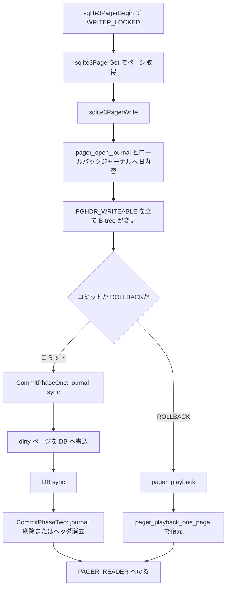

# 第20章 Pager とトランザクション

> **本章で読むソース**
>
> - [src/pager.c](https://github.com/sqlite/sqlite/blob/version-3.53.3/src/pager.c)
> - [src/pager.h](https://github.com/sqlite/sqlite/blob/version-3.53.3/src/pager.h)

## この章の狙い

第17章から第19章では B-tree が `MemPage` を通じてページを読み書きする経路を追った。
その下層でページキャッシュ、ディスク I/O、トランザクション境界を束ねるのが **Pager** である。
本章では `sqlite3PagerGet` と `sqlite3PagerWrite` を中心に、ロールバックジャーナル、`pager_playback` による復元、`sqlite3PagerSavepoint` までを読む。
`pager.h` と `Pager.eState` が示す状態遷移を、ロールバックジャーナルモードの実行経路に対応づける。

## 前提

Pager は1つのデータベースファイルに対して1インスタンスが開かれる。
ページ本体は `PCache` が保持し、Pager は `DbPage`（`PgHdr`）経由でキャッシュと VFS を接続する。
`journal_mode` が WAL でなく、かつ `PAGER_JOURNALMODE_OFF` でもないとき、Pager は **ロールバックジャーナル**を使う。
トランザクション開始時点から存在したページ（`pgno <= dbOrigSize`）の初回書込で、`pager_write` が変更前内容をジャーナルへ記録する。
`PAGER_JOURNALMODE_OFF` ではジャーナルを省略し、`useJournal` や `pInJournal` の状態によっては旧内容の記録も行わない。
`pager.h` はジャーナルモード定数と `sqlite3PagerGet` のフラグを公開する。

[src/pager.h L72-L84](https://github.com/sqlite/sqlite/blob/version-3.53.3/src/pager.h#L72-L84)

```c
#define PAGER_JOURNALMODE_QUERY     (-1)  /* Query the value of journalmode */
#define PAGER_JOURNALMODE_DELETE      0   /* Commit by deleting journal file */
#define PAGER_JOURNALMODE_PERSIST     1   /* Commit by zeroing journal header */
#define PAGER_JOURNALMODE_OFF         2   /* Journal omitted.  */
#define PAGER_JOURNALMODE_TRUNCATE    3   /* Commit by truncating journal */
#define PAGER_JOURNALMODE_MEMORY      4   /* In-memory journal file */
#define PAGER_JOURNALMODE_WAL         5   /* Use write-ahead logging */

#define isWalMode(x) ((x)==PAGER_JOURNALMODE_WAL)
```

[src/pager.h L103-L106](https://github.com/sqlite/sqlite/blob/version-3.53.3/src/pager.h#L103-L106)

```c
#define PAGER_GET_NOCONTENT     0x01  /* Do not load data from disk */
#define PAGER_GET_READONLY      0x02  /* Read-only page is acceptable */
```

## Pager の状態

`Pager.eState` は OPEN から ERROR までの7段階で、読取専用接続か書込トランザクション中かを表す。
WRITER 系の状態は、キャッシュだけが汚れている段階（`PAGER_WRITER_CACHEMOD`）から、ディスクへ書き出す段階（`PAGER_WRITER_DBMOD`）へ進む。

[src/pager.c L351-L357](https://github.com/sqlite/sqlite/blob/version-3.53.3/src/pager.c#L351-L357)

```c
#define PAGER_OPEN                  0
#define PAGER_READER                1
#define PAGER_WRITER_LOCKED         2
#define PAGER_WRITER_CACHEMOD       3
#define PAGER_WRITER_DBMOD          4
#define PAGER_WRITER_FINISHED       5
#define PAGER_ERROR                 6
```

`struct Pager` は設定（`journalMode`、`pageSize`）と実行時状態（`eState`、`dbSize`、`pInJournal`）を分けて持つ。
ロールバックジャーナル用の `jfd`、セーブポイント用の `sjfd`、`aSavepoint[]` もここに集約される。

[src/pager.c L619-L703](https://github.com/sqlite/sqlite/blob/version-3.53.3/src/pager.c#L619-L703)

```c
struct Pager {
  sqlite3_vfs *pVfs;          /* OS functions to use for IO */
  u8 exclusiveMode;           /* Boolean. True if locking_mode==EXCLUSIVE */
  u8 journalMode;             /* One of the PAGER_JOURNALMODE_* values */
  u8 useJournal;              /* Use a rollback journal on this file */
  // ... (中略) ...
  u8 eState;                  /* Pager state (OPEN, READER, WRITER_LOCKED..) */
  u8 eLock;                   /* Current lock held on database file */
  // ... (中略) ...
  Pgno dbSize;                /* Number of pages in the database */
  Pgno dbOrigSize;            /* dbSize before the current transaction */
  Pgno dbFileSize;            /* Number of pages in the database file */
  // ... (中略) ...
  int nRec;                   /* Pages journalled since last j-header written */
  Bitvec *pInJournal;         /* One bit for each page in the database file */
  sqlite3_file *fd;           /* File descriptor for database */
  sqlite3_file *jfd;          /* File descriptor for main journal */
  sqlite3_file *sjfd;         /* File descriptor for sub-journal */
  i64 journalOff;             /* Current write offset in the journal file */
  i64 journalHdr;             /* Byte offset to previous journal header */
  PagerSavepoint *aSavepoint; /* Array of active savepoints */
  int nSavepoint;             /* Number of elements in aSavepoint[] */
  // ... (中略) ...
  int (*xGet)(Pager*,Pgno,DbPage**,int); /* Routine to fetch a patch */
  PCache *pPCache;            /* Pointer to page cache object */
#ifndef SQLITE_OMIT_WAL
  Wal *pWal;                  /* Write-ahead log used by "journal_mode=wal" */
  char *zWal;                 /* File name for write-ahead log */
#endif
};
```

## sqlite3PagerGet とページ取得

`sqlite3PagerGet` は薄いディスパッチで、実体は `pPager->xGet`（通常は `getPageNormal`）に委譲される。
B-tree はページ番号と `PAGER_GET_*` フラグを渡し、キャッシュヒットならディスク読み出しを省略する。

[src/pager.c L5772-L5791](https://github.com/sqlite/sqlite/blob/version-3.53.3/src/pager.c#L5772-L5791)

```c
int sqlite3PagerGet(
  Pager *pPager,      /* The pager open on the database file */
  Pgno pgno,          /* Page number to fetch */
  DbPage **ppPage,    /* Write a pointer to the page here */
  int flags           /* PAGER_GET_XXX flags */
){
#if 0   /* Trace page fetch by setting to 1 */
  // ... (中略) ...
#else
  /* Normal, high-speed version of sqlite3PagerGet() */
  return pPager->xGet(pPager, pgno, ppPage, flags);
#endif
}
```

`getPageNormal` は `sqlite3PcacheFetch` でキャッシュを引き、初期化済みページなら `PAGER_STAT_HIT` を加算して即返す。
未キャッシュのときだけ `readDbPage` でディスクから読み込む。

[src/pager.c L5581-L5619](https://github.com/sqlite/sqlite/blob/version-3.53.3/src/pager.c#L5581-L5619)

```c
static int getPageNormal(
  Pager *pPager,      /* The pager open on the database file */
  Pgno pgno,          /* Page number to fetch */
  DbPage **ppPage,    /* Write a pointer to the page here */
  int flags           /* PAGER_GET_XXX flags */
){
  int rc = SQLITE_OK;
  PgHdr *pPg;
  u8 noContent;                   /* True if PAGER_GET_NOCONTENT is set */
  sqlite3_pcache_page *pBase;
  // ... (中略) ...
  pBase = sqlite3PcacheFetch(pPager->pPCache, pgno, 3);
  // ... (中略) ...
  pPg = *ppPage = sqlite3PcacheFetchFinish(pPager->pPCache, pgno, pBase);
  // ... (中略) ...
  noContent = (flags & PAGER_GET_NOCONTENT)!=0;
  if( pPg->pPager && !noContent ){
    /* In this case the pcache already contains an initialized copy of
    ** the page. Return without further ado.  */
    assert( pgno!=PAGER_SJ_PGNO(pPager) );
    pPager->aStat[PAGER_STAT_HIT]++;
    return SQLITE_OK;
```

## sqlite3PagerWrite とロールバックジャーナル

`sqlite3PagerWrite` はページを書き換え可能にする入口である。
`dbSize` は現在のデータベースイメージの論理ページ数であり、ディスク上の実サイズは `dbFileSize` が別途持つ。
すでに `PGHDR_WRITEABLE` で、ページ番号が現在のデータベースイメージ内（`pPager->dbSize >= pPg->pgno`）なら、セーブポイント用サブジャーナル処理だけで早期 return できる。

[src/pager.c L6280-L6295](https://github.com/sqlite/sqlite/blob/version-3.53.3/src/pager.c#L6280-L6295)

```c
int sqlite3PagerWrite(PgHdr *pPg){
  Pager *pPager = pPg->pPager;
  assert( (pPg->flags & PGHDR_MMAP)==0 );
  assert( pPager->eState>=PAGER_WRITER_LOCKED );
  assert( assert_pager_state(pPager) );
  if( (pPg->flags & PGHDR_WRITEABLE)!=0 && pPager->dbSize>=pPg->pgno ){
    if( pPager->nSavepoint ) return subjournalPageIfRequired(pPg);
    return SQLITE_OK;
  }else if( pPager->errCode ){
    return pPager->errCode;
  }else if( pPager->sectorSize > (u32)pPager->pageSize ){
    assert( pPager->tempFile==0 );
    return pagerWriteLargeSector(pPg);
  }else{
    return pager_write(pPg);
  }
}
```

`pager_write` は初回書込時に `pager_open_journal` でジャーナルファイルを開き、変更前のページ内容を `pagerAddPageToRollbackJournal` で記録する。
ジャーナルへの記録が終わってから `PGHDR_WRITEABLE` を立て、B-tree がページデータを安全に変更できるようにする。

[src/pager.c L6094-L6160](https://github.com/sqlite/sqlite/blob/version-3.53.3/src/pager.c#L6094-L6160)

```c
static int pager_write(PgHdr *pPg){
  Pager *pPager = pPg->pPager;
  int rc = SQLITE_OK;
  // ... (中略) ...
  if( pPager->eState==PAGER_WRITER_LOCKED ){
    rc = pager_open_journal(pPager);
    if( rc!=SQLITE_OK ) return rc;
  }
  assert( pPager->eState>=PAGER_WRITER_CACHEMOD );
  // ... (中略) ...
  sqlite3PcacheMakeDirty(pPg);

  assert( (pPager->pInJournal!=0) == isOpen(pPager->jfd) );
  if( pPager->pInJournal!=0
   && sqlite3BitvecTestNotNull(pPager->pInJournal, pPg->pgno)==0
  ){
    assert( pagerUseWal(pPager)==0 );
    if( pPg->pgno<=pPager->dbOrigSize ){
      rc = pagerAddPageToRollbackJournal(pPg);
      if( rc!=SQLITE_OK ){
        return rc;
      }
    }else{
      if( pPager->eState!=PAGER_WRITER_DBMOD ){
        pPg->flags |= PGHDR_NEED_SYNC;
      }
      // ... (中略) ...
    }
  }
  // ... (中略) ...
  pPg->flags |= PGHDR_WRITEABLE;
  if( pPager->nSavepoint>0 ){
    rc = subjournalPageIfRequired(pPg);
  }
  if( pPager->dbSize<pPg->pgno ){
    pPager->dbSize = pPg->pgno;
  }
  return rc;
}
```

## pager_playback によるロールバック

トランザクションの ROLLBACK やホットジャーナル検出時、Pager はジャーナルから元のページ像を読み戻す。
`pager_playback` はジャーナルヘッダを順に読み、`pager_playback_one_page` で各レコードを処理する。

[src/pager.c L2864-L2917](https://github.com/sqlite/sqlite/blob/version-3.53.3/src/pager.c#L2864-L2917)

```c
static int pager_playback(Pager *pPager, int isHot){
  sqlite3_vfs *pVfs = pPager->pVfs;
  i64 szJ;                 /* Size of the journal file in bytes */
  u32 nRec;                /* Number of Records in the journal */
  u32 u;                   /* Unsigned loop counter */
  Pgno mxPg = 0;           /* Size of the original file in pages */
  int rc;                  /* Result code of a subroutine */
  // ... (中略) ...
  assert( isOpen(pPager->jfd) );
  rc = sqlite3OsFileSize(pPager->jfd, &szJ);
  if( rc!=SQLITE_OK ){
    goto end_playback;
  }
  // ... (中略) ...
  while( 1 ){
    rc = readJournalHdr(pPager, isHot, szJ, &nRec, &mxPg);
    if( rc!=SQLITE_OK ){
      if( rc==SQLITE_DONE ){
        rc = SQLITE_OK;
      }
      goto end_playback;
    }
    // ... (中略) ...
```

`pager_playback_one_page` はジャーナルからページ番号とバイト列を読み、チェックサムを検証したうえでキャッシュまたは DB ファイルへ復元する。
破損レコードは `SQLITE_DONE` で打ち切り、それ以前の整合した部分だけを戻す。

[src/pager.c L2298-L2360](https://github.com/sqlite/sqlite/blob/version-3.53.3/src/pager.c#L2298-L2360)

```c
static int pager_playback_one_page(
  Pager *pPager,                /* The pager being played back */
  i64 *pOffset,                 /* Offset of record to playback */
  Bitvec *pDone,                /* Bitvec of pages already played back */
  int isMainJrnl,               /* 1 -> main journal. 0 -> sub-journal. */
  int isSavepnt                 /* True for a savepoint rollback */
){
  int rc;
  PgHdr *pPg;                   /* An existing page in the cache */
  Pgno pgno;                    /* The page number of a page in journal */
  u32 cksum;                    /* Checksum used for sanity checking */
  char *aData;                  /* Temporary storage for the page */
  sqlite3_file *jfd;            /* The file descriptor for the journal file */
  // ... (中略) ...
  jfd = isMainJrnl ? pPager->jfd : pPager->sjfd;
  rc = read32bits(jfd, *pOffset, &pgno);
  if( rc!=SQLITE_OK ) return rc;
  rc = sqlite3OsRead(jfd, (u8*)aData, pPager->pageSize, (*pOffset)+4);
  if( rc!=SQLITE_OK ) return rc;
  *pOffset += pPager->pageSize + 4 + isMainJrnl*4;
  // ... (中略) ...
  if( isMainJrnl ){
    rc = read32bits(jfd, (*pOffset)-4, &cksum);
    if( rc ) return rc;
    if( !isSavepnt && pager_cksum(pPager, (u8*)aData)!=cksum ){
      return SQLITE_DONE;
    }
  }
```

`sqlite3PagerRollback` は WAL モードなら `sqlite3PagerSavepoint` と `pager_end_transaction` へ分岐し、ロールバックジャーナルモードでは `pager_playback` を呼ぶ。

[src/pager.c L6814-L6846](https://github.com/sqlite/sqlite/blob/version-3.53.3/src/pager.c#L6814-L6846)

```c
int sqlite3PagerRollback(Pager *pPager){
  int rc = SQLITE_OK;                  /* Return code */
  // ... (中略) ...
  if( pPager->eState==PAGER_ERROR ) return pPager->errCode;
  if( pPager->eState<=PAGER_READER ) return SQLITE_OK;

  if( pagerUseWal(pPager) ){
    int rc2;
    rc = sqlite3PagerSavepoint(pPager, SAVEPOINT_ROLLBACK, -1);
    rc2 = pager_end_transaction(pPager, pPager->setSuper, 0);
    if( rc==SQLITE_OK ) rc = rc2;
  }else if( !isOpen(pPager->jfd) || pPager->eState==PAGER_WRITER_LOCKED ){
    // ... (中略) ...
  }else{
    rc = pager_playback(pPager, 0);
  }
```

## sqlite3PagerSavepoint

セーブポイントは `PagerSavepoint` 配列とサブジャーナルで部分ロールバックを実現する。
`SAVEPOINT_ROLLBACK` では `pagerPlaybackSavepoint` が、対象セーブポイント開始時点（`nOrig`）へ `dbSize` を戻したうえでジャーナルを再生する。
再生は次の3段階をこの順で行う。
メインジャーナルの `iOffset` から `iHdrOffset`（またはファイル末尾）まで。
`iHdrOffset` が非ゼロなら、その直後のジャーナルヘッダからファイル末尾まで。
サブジャーナルの `iSubRec` から末尾まで。
各段階では `pDone` ビットベクタで重複ページを排除する。

[src/pager.c L3422-L3450](https://github.com/sqlite/sqlite/blob/version-3.53.3/src/pager.c#L3422-L3450)

```c
** When pSavepoint is not NULL (meaning a non-transaction savepoint is
** being rolled back), then the rollback consists of up to three stages,
** performed in the order specified:
**
**   * Pages are played back from the main journal starting at byte
**     offset PagerSavepoint.iOffset and continuing to
**     PagerSavepoint.iHdrOffset, or to the end of the main journal
**     file if PagerSavepoint.iHdrOffset is zero.
**
**   * If PagerSavepoint.iHdrOffset is not zero, then pages are played
**     back starting from the journal header immediately following
**     PagerSavepoint.iHdrOffset to the end of the main journal file.
**
**   * Pages are then played back from the sub-journal file, starting
**     with the PagerSavepoint.iSubRec and continuing to the end of
**     the journal file.
**
** Throughout the rollback process, each time a page is rolled back, the
** corresponding bit is set in a bitvec structure (variable pDone in the
** implementation below). This is used to ensure that a page is only
** rolled back the first time it is encountered in either journal.
**
** In either case, before playback commences the Pager.dbSize variable
** is reset to the value that it held at the start of the savepoint
** (or transaction). No page with a page-number greater than this value
** is played back. If one is encountered it is simply skipped.
```

[src/pager.c L3469-L3473](https://github.com/sqlite/sqlite/blob/version-3.53.3/src/pager.c#L3469-L3473)

```c
  /* Set the database size back to the value it was before the savepoint
  ** being reverted was opened.
  */
  pPager->dbSize = pSavepoint ? pSavepoint->nOrig : pPager->dbOrigSize;
  pPager->changeCountDone = pPager->tempFile;
```

[src/pager.c L3487-L3548](https://github.com/sqlite/sqlite/blob/version-3.53.3/src/pager.c#L3487-L3548)

```c
  /* Begin by rolling back records from the main journal starting at
  ** PagerSavepoint.iOffset and continuing to the next journal header.
  ** There might be records in the main journal that have a page number
  ** greater than the current database size (pPager->dbSize) but those
  ** will be skipped automatically.  Pages are added to pDone as they
  ** are played back.
  */
  if( pSavepoint && !pagerUseWal(pPager) ){
    iHdrOff = pSavepoint->iHdrOffset ? pSavepoint->iHdrOffset : szJ;
    pPager->journalOff = pSavepoint->iOffset;
    while( rc==SQLITE_OK && pPager->journalOff<iHdrOff ){
      rc = pager_playback_one_page(pPager, &pPager->journalOff, pDone, 1, 1);
    }
    assert( rc!=SQLITE_DONE );
  }else{
    pPager->journalOff = 0;
  }

  /* Continue rolling back records out of the main journal starting at
  ** the first journal header seen and continuing until the effective end
  ** of the main journal file.  Continue to skip out-of-range pages and
  ** continue adding pages rolled back to pDone.
  */
  while( rc==SQLITE_OK && pPager->journalOff<szJ ){
    u32 ii;            /* Loop counter */
    u32 nJRec = 0;     /* Number of Journal Records */
    u32 dummy;
    rc = readJournalHdr(pPager, 0, szJ, &nJRec, &dummy);
    assert( rc!=SQLITE_DONE );
    // ... (中略) ...
    for(ii=0; rc==SQLITE_OK && ii<nJRec && pPager->journalOff<szJ; ii++){
      rc = pager_playback_one_page(pPager, &pPager->journalOff, pDone, 1, 1);
    }
    assert( rc!=SQLITE_DONE );
  }
  assert( rc!=SQLITE_OK || pPager->journalOff>=szJ );

  /* Finally,  rollback pages from the sub-journal.  Page that were
  ** previously rolled back out of the main journal (and are hence in pDone)
  ** will be skipped.  Out-of-range pages are also skipped.
  */
  if( pSavepoint ){
    u32 ii;            /* Loop counter */
    i64 offset = (i64)pSavepoint->iSubRec*(4+pPager->pageSize);
    // ... (中略) ...
    for(ii=pSavepoint->iSubRec; rc==SQLITE_OK && ii<pPager->nSubRec; ii++){
      assert( offset==(i64)ii*(4+pPager->pageSize) );
      rc = pager_playback_one_page(pPager, &offset, pDone, 0, 1);
    }
    assert( rc!=SQLITE_DONE );
  }
```

`sqlite3PagerSavepoint` は配列の縮小と `pagerPlaybackSavepoint` の呼び出しを担う。

[src/pager.c L7053-L7099](https://github.com/sqlite/sqlite/blob/version-3.53.3/src/pager.c#L7053-L7099)

```c
int sqlite3PagerSavepoint(Pager *pPager, int op, int iSavepoint){
  int rc = pPager->errCode;
  // ... (中略) ...
  assert( op==SAVEPOINT_RELEASE || op==SAVEPOINT_ROLLBACK );
  assert( iSavepoint>=0 || op==SAVEPOINT_ROLLBACK );

  if( rc==SQLITE_OK && iSavepoint<pPager->nSavepoint ){
    int ii;            /* Iterator variable */
    int nNew;          /* Number of remaining savepoints after this op. */
    // ... (中略) ...
    nNew = iSavepoint + (( op==SAVEPOINT_RELEASE ) ? 0 : 1);
    for(ii=nNew; ii<pPager->nSavepoint; ii++){
      sqlite3BitvecDestroy(pPager->aSavepoint[ii].pInSavepoint);
    }
    pPager->nSavepoint = nNew;
    // ... (中略) ...
    else if( pagerUseWal(pPager) || isOpen(pPager->jfd) ){
      PagerSavepoint *pSavepoint = (nNew==0)?0:&pPager->aSavepoint[nNew-1];
      rc = pagerPlaybackSavepoint(pPager, pSavepoint);
      assert(rc!=SQLITE_DONE);
    }
  }

  return rc;
}
```

## コミットの二段階

ロールバックジャーナルモードのコミットは `sqlite3PagerCommitPhaseOne` と `sqlite3PagerCommitPhaseTwo` に分かれる。
PhaseOne ではジャーナルを sync し、dirty ページを DB へ書き、DB を sync する。
この時点で DB ファイルは新しい内容を反映しているが、ジャーナルはまだ残る。
PhaseTwo のコメントは、DB が同期済みでもジャーナルが残っていればホットジャーナルとしてロールバック可能であることを述べる。
PhaseTwo はジャーナルを削除、truncate、またはヘッダ消去して確定する。

[src/pager.c L6647-L6720](https://github.com/sqlite/sqlite/blob/version-3.53.3/src/pager.c#L6647-L6720)

```c
      /* Sync the journal file and write all dirty pages to the database.
      ** If the atomic-update optimization is being used, this sync will not
      ** create the journal file or perform any real IO.
      **
      ** Because the change-counter page was just modified, unless the
      ** atomic-update optimization is used it is almost certain that the
      ** journal requires a sync here. However, in locking_mode=exclusive
      ** on a system under memory pressure it is just possible that this is
      ** not the case. In this case it is likely enough that the redundant
      ** xSync() call will be changed to a no-op by the OS anyhow.
      */
      rc = syncJournal(pPager, 0);
      if( rc!=SQLITE_OK ) goto commit_phase_one_exit;

      pList = sqlite3PcacheDirtyList(pPager->pPCache);
      // ... (中略) ...
      if( bBatch==0 ){
        rc = pager_write_pagelist(pPager, pList);
      }
      if( rc!=SQLITE_OK ){
        assert( rc!=SQLITE_IOERR_BLOCKED );
        goto commit_phase_one_exit;
      }
      sqlite3PcacheCleanAll(pPager->pPCache);
      // ... (中略) ...
      /* Finally, sync the database file. */
      if( !noSync ){
        rc = sqlite3PagerSync(pPager, zSuper);
      }
      IOTRACE(("DBSYNC %p\n", pPager))
```

[src/pager.c L6733-L6743](https://github.com/sqlite/sqlite/blob/version-3.53.3/src/pager.c#L6733-L6743)

```c
/*
** When this function is called, the database file has been completely
** updated to reflect the changes made by the current transaction and
** synced to disk. The journal file still exists in the file-system
** though, and if a failure occurs at this point it will eventually
** be used as a hot-journal and the current transaction rolled back.
**
** This function finalizes the journal file, either by deleting,
** truncating or partially zeroing it, so that it cannot be used
** for hot-journal rollback. Once this is done the transaction is
** irrevocably committed.
```

[src/pager.c L6748-L6785](https://github.com/sqlite/sqlite/blob/version-3.53.3/src/pager.c#L6748-L6785)

```c
int sqlite3PagerCommitPhaseTwo(Pager *pPager){
  int rc = SQLITE_OK;                  /* Return code */
  // ... (中略) ...
  PAGERTRACE(("COMMIT %d\n", PAGERID(pPager)));
  rc = pager_end_transaction(pPager, pPager->setSuper, 1);
  return pager_error(pPager, rc);
}
```

## 処理の流れ

ロールバックジャーナルモードでの書込トランザクション、コミット、ROLLBACK を示す。



## 高速化と最適化の工夫

`getPageNormal` のキャッシュヒット経路は `readDbPage` を呼ばず統計だけ更新するため、B-tree の反復アクセスでディスク読み出しを避けられる。
`sqlite3PagerWrite` は `PGHDR_WRITEABLE` が既に立っているページへの再呼び出しを即 return し、ジャーナル重複記録を省く。
`sqlite3PagerDontWrite` はフリーリストへ載せたページなど、内容が不要になった dirty ページのディスク書込を抑止し、大規模 DELETE を高速化する。

## まとめ

Pager はページキャッシュと VFS のあいだで、取得（`sqlite3PagerGet`）、書込準備（`sqlite3PagerWrite`）、ジャーナル、ロールバックを担う。
コミットは CommitPhaseOne（ジャーナル sync、DB 書込、DB sync）と CommitPhaseTwo（ジャーナル確定）の二段階である。
`eState` と `pInJournal` がトランザクションの進行段階を表し、障害時は `pager_playback` がジャーナルから整合した接頭辞だけを復元する。
セーブポイントはメインジャーナル、サブジャーナル、`nOrig` への `dbSize` 復元で部分巻き戻しを行う。
WAL モードの詳細は第21章へ譲る。

## 関連する章

- [第17章 B-tree（1）ファイルフォーマットとページ](17-btree-format.md)（`MemPage` と `pDbPage`）
- [第19章 B-tree（3）挿入、削除、バランス](19-btree-balance.md)（`sqlite3BtreeInsert` が要求する書込ロック）
- [第21章 WAL モード](21-wal.md)（`pagerUseWal` と `pWal`）
- [第23章 メモリ確保とページキャッシュ](../part05-os/23-memory-pcache.md)（`sqlite3PcacheFetch`）
