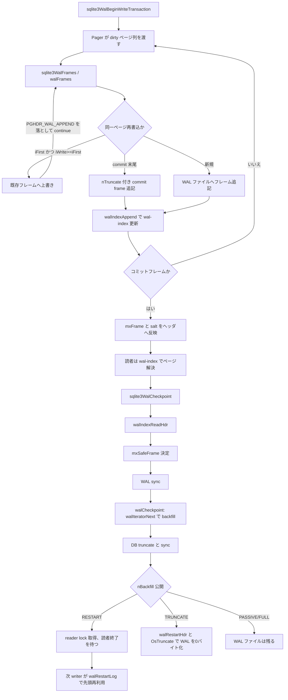

# 第21章 WAL モード

> **本章で読むソース**
>
> - [src/wal.c](https://github.com/sqlite/sqlite/blob/version-3.53.3/src/wal.c)
> - [src/wal.h](https://github.com/sqlite/sqlite/blob/version-3.53.3/src/wal.h)

## この章の狙い

第20章ではロールバックジャーナル前提の Pager を読んだ。
`journal_mode=WAL` では変更はまず **WAL**（Write-Ahead Log）ファイルのフレームへ追記され、読者は **wal-index** で最新ページを引く。
本章では `walIndexAppend` と `walFrames` によるフレーム追記、`walIndexReadHdr` と `WalIterator`、`sqlite3WalCheckpoint` によるチェックポイントまでを追う。

## 前提

WAL ファイルは32バイトのヘッダのあと、各フレームが「24バイトのフレームヘッダ + ページサイズ分のデータ」で連なる。
コミットフレームは `nPage` フィールドにコミット後の DB サイズを載せ、チェックサムと salt で正当性を判定する。

[src/wal.c L16-L58](https://github.com/sqlite/sqlite/blob/version-3.53.3/src/wal.c#L16-L58)

```c
** WRITE-AHEAD LOG (WAL) FILE FORMAT
**
** A WAL file consists of a header followed by zero or more "frames".
** Each frame records the revised content of a single page from the
** database file.  All changes to the database are recorded by writing
** frames into the WAL.  Transactions commit when a frame is written that
** contains a commit marker.  A single WAL can and usually does record
** multiple transactions.  Periodically, the content of the WAL is
** transferred back into the database file in an operation called a
** "checkpoint".
**
** The WAL header is 32 bytes in size and consists of the following eight
** big-endian 32-bit unsigned integer values:
**
**     0: Magic number.  0x377f0682 or 0x377f0683
**     4: File format version.  Currently 3007000
**     8: Database page size.  Example: 1024
**    12: Checkpoint sequence number
**    16: Salt-1, random integer incremented with each checkpoint
**    20: Salt-2, a different random integer changing with each ckpt
**    24: Checksum-1 (first part of checksum for first 24 bytes of header).
**    28: Checksum-2 (second part of checksum for first 24 bytes of header).
**
** Immediately following the wal-header are zero or more frames. Each
** frame consists of a 24-byte frame-header followed by <page-size> bytes
** of page data. The frame-header is six big-endian 32-bit unsigned
** integer values, as follows:
**
**     0: Page number.
**     4: For commit records, the size of the database image in pages
**        after the commit. For all other records, zero.
```

WAL 全体を走査するのは遅いため、共有メモリ相当の **wal-index**（実装では `-shm` ファイル）がページ番号からフレーム番号への逆引きを担う。

[src/wal.c L119-L157](https://github.com/sqlite/sqlite/blob/version-3.53.3/src/wal.c#L119-L157)

```c
** The reader algorithm in the previous paragraphs works correctly, but
** because frames for page P can appear anywhere within the WAL, the
** reader has to scan the entire WAL looking for page P frames.  If the
** WAL is large (multiple megabytes is typical) that scan can be slow,
** and read performance suffers.  To overcome this problem, a separate
** data structure called the wal-index is maintained to expedite the
** search for frames of a particular page.
**
** WAL-INDEX FORMAT
**
** Conceptually, the wal-index is shared memory, though VFS implementations
** might choose to implement the wal-index using a mmapped file.  Because
** the wal-index is shared memory, SQLite does not support journal_mode=WAL
** on a network filesystem.  All users of the database must be able to
** share memory.
**
** The purpose of the wal-index is to answer this question quickly:  Given
** a page number P and a maximum frame index M, return the index of the
** last frame in the wal before frame M for page P in the WAL, or return
** NULL if there are no frames for page P in the WAL prior to M.
**
** The wal-index consists of a header region, followed by an one or
** more index blocks.
**
** The wal-index header contains the total number of frames within the WAL
** in the mxFrame field.
```

wal-index ヘッダの実体は `WalIndexHdr` で、`mxFrame` が読者のスナップショット上限、`aSalt` が WAL ヘッダと対応づく。

[src/wal.c L321-L333](https://github.com/sqlite/sqlite/blob/version-3.53.3/src/wal.c#L321-L333)

```c
struct WalIndexHdr {
  u32 iVersion;                   /* Wal-index version */
  u32 unused;                     /* Unused (padding) field */
  u32 iChange;                    /* Counter incremented each transaction */
  u8 isInit;                      /* 1 when initialized */
  u8 bigEndCksum;                 /* True if checksums in WAL are big-endian */
  u16 szPage;                     /* Database page size in bytes. 1==64K */
  u32 mxFrame;                    /* Index of last valid frame in the WAL */
  u32 nPage;                      /* Size of database in pages */
  u32 aFrameCksum[2];             /* Checksum of last frame in log */
  u32 aSalt[2];                   /* Two salt values copied from WAL header */
  u32 aCksum[2];                  /* Checksum over all prior fields */
};
```

## walIndexAppend

フレームを WAL ファイルへ書いたあと、対応する `(iFrame, iPage)` を wal-index のハッシュ表へ登録する。
`walIndexAppend` は `aPgno[]` にページ番号を置き、衝突解決付きハッシュスロットへフレーム番号を書く。

[src/wal.c L1301-L1344](https://github.com/sqlite/sqlite/blob/version-3.53.3/src/wal.c#L1301-L1344)

```c
static int walIndexAppend(Wal *pWal, u32 iFrame, u32 iPage){
  int rc;                         /* Return code */
  WalHashLoc sLoc;                /* Wal-index hash table location */

  rc = walHashGet(pWal, walFramePage(iFrame), &sLoc);
  // ... (中略) ...
  if( rc==SQLITE_OK ){
    int iKey;                     /* Hash table key */
    int idx;                      /* Value to write to hash-table slot */
    int nCollide;                 /* Number of hash collisions */
    idx = iFrame - sLoc.iZero;
    // ... (中略) ...
    if( idx==1 ){
      int nByte = (int)((u8*)&sLoc.aHash[HASHTABLE_NSLOT] - (u8*)sLoc.aPgno);
      assert( nByte>=0 );
      memset((void*)sLoc.aPgno, 0, nByte);
    }
    // ... (中略) ...
    nCollide = idx;
    for(iKey=walHash(iPage); sLoc.aHash[iKey]; iKey=walNextHash(iKey)){
      if( (nCollide--)==0 ) return SQLITE_CORRUPT_BKPT;
    }
    sLoc.aPgno[(idx-1)&(HASHTABLE_NPAGE-1)] = iPage;
    AtomicStore(&sLoc.aHash[iKey], (ht_slot)idx);
```

## walFrames によるフレーム追記

`sqlite3WalFrames` は `walFrames` を SEH 保護で包む公開 API である。
書込トランザクション中、dirty ページ列を WAL へ追記し、コミット時は最終フレームに DB サイズを載せる。

[src/wal.h L97-L98](https://github.com/sqlite/sqlite/blob/version-3.53.3/src/wal.h#L97-L98)

```c
/* Write a frame or frames to the log. */
int sqlite3WalFrames(Wal *pWal, int, PgHdr *, Pgno, int, int);
```

[src/wal.c L4275-L4288](https://github.com/sqlite/sqlite/blob/version-3.53.3/src/wal.c#L4275-L4288)

```c
int sqlite3WalFrames(
  Wal *pWal,                      /* Wal handle to write to */
  int szPage,                     /* Database page-size in bytes */
  PgHdr *pList,                   /* List of dirty pages to write */
  Pgno nTruncate,                 /* Database size after this commit */
  int isCommit,                   /* True if this is a commit */
  int sync_flags                  /* Flags to pass to OsSync() (or 0) */
){
  int rc;
  SEH_TRY {
    rc = walFrames(pWal, szPage, pList, nTruncate, isCommit, sync_flags);
  }
  SEH_EXCEPT( rc = walHandleException(pWal); )
  return rc;
}
```

`walFrames` は dirty リストを走査し、`walWriteOneFrame` で各フレームを書く。
同一トランザクション内で同じページが再変更された場合、条件 `iFirst != 0` かつ `iWrite >= iFirst` を満たせば既存フレーム位置へ上書きする。
ただしコミット時の dirty リスト末尾（`p->pDirty == 0`）は上書きせず、`nTruncate` を載せた commit frame として追記する。
上書き条件は `iFirst && (p->pDirty || isCommit==0)` で表される。
上書きが起きると `iReCksum` 以降の checksum をコミット時に再計算する。
書込完了後、`PGHDR_WAL_APPEND` が立ったフレームだけ `walIndexAppend` へ渡す。

[src/wal.c L4071-L4074](https://github.com/sqlite/sqlite/blob/version-3.53.3/src/wal.c#L4071-L4074)

```c
  pLive = (WalIndexHdr*)walIndexHdr(pWal);
  if( memcmp(&pWal->hdr, (void *)pLive, sizeof(WalIndexHdr))!=0 ){
    iFirst = pLive->mxFrame+1;
  }
```

[src/wal.c L4038-L4062](https://github.com/sqlite/sqlite/blob/version-3.53.3/src/wal.c#L4038-L4062)

```c
static int walFrames(
  Wal *pWal,                      /* Wal handle to write to */
  int szPage,                     /* Database page-size in bytes */
  PgHdr *pList,                   /* List of dirty pages to write */
  Pgno nTruncate,                 /* Database size after this commit */
  int isCommit,                   /* True if this is a commit */
  int sync_flags                  /* Flags to pass to OsSync() (or 0) */
){
  int rc;                         /* Used to catch return codes */
  u32 iFrame;                     /* Next frame address */
  PgHdr *p;                       /* Iterator to run through pList with. */
  // ... (中略) ...
  assert( pList );
  assert( pWal->writeLock );

  assert( (isCommit!=0)==(nTruncate!=0) );
```

[src/wal.c L4140-L4178](https://github.com/sqlite/sqlite/blob/version-3.53.3/src/wal.c#L4140-L4178)

```c
  for(p=pList; p; p=p->pDirty){
    int nDbSize;   /* 0 normally.  Positive == commit flag */
    // ... (中略) ...
    if( iFirst && (p->pDirty || isCommit==0) ){
      u32 iWrite = 0;
      VVA_ONLY(rc =) walFindFrame(pWal, p->pgno, &iWrite);
      // ... (中略) ...
      if( iWrite>=iFirst ){
        i64 iOff = walFrameOffset(iWrite, szPage) + WAL_FRAME_HDRSIZE;
        // ... (中略) ...
        if( pWal->iReCksum==0 || iWrite<pWal->iReCksum ){
          pWal->iReCksum = iWrite;
        }
        // ... (中略) ...
        rc = sqlite3OsWrite(pWal->pWalFd, pData, szPage, iOff);
        if( rc ) return rc;
        p->flags &= ~PGHDR_WAL_APPEND;
        continue;
      }
    }

    iFrame++;
    nDbSize = (isCommit && p->pDirty==0) ? nTruncate : 0;
    rc = walWriteOneFrame(&w, p, nDbSize, iOffset);
    if( rc ) return rc;
    pLast = p;
    iOffset += szFrame;
    p->flags |= PGHDR_WAL_APPEND;
  }

  /* Recalculate checksums within the wal file if required. */
  if( isCommit && pWal->iReCksum ){
    rc = walRewriteChecksums(pWal, iFrame);
    if( rc ) return rc;
  }
```

[src/wal.c L4229-L4239](https://github.com/sqlite/sqlite/blob/version-3.53.3/src/wal.c#L4229-L4239)

```c
  iFrame = pWal->hdr.mxFrame;
  for(p=pList; p && rc==SQLITE_OK; p=p->pDirty){
    if( (p->flags & PGHDR_WAL_APPEND)==0 ) continue;
    iFrame++;
    rc = walIndexAppend(pWal, iFrame, p->pgno);
  }
```

## walIndexReadHdr

チェックポイントや読者は、まず wal-index ヘッダを読み `mxFrame` と salt を確定する。
`walIndexReadHdr` はロックなし読み取りを試し、競合時は WRITE ロックを取って再試行または `walIndexRecover` で再構築する。

[src/wal.c L2660-L2740](https://github.com/sqlite/sqlite/blob/version-3.53.3/src/wal.c#L2660-L2740)

```c
static int walIndexReadHdr(Wal *pWal, int *pChanged){
  int rc;                         /* Return code */
  int badHdr;                     /* True if a header read failed */
  volatile u32 *page0;            /* Chunk of wal-index containing header */
  // ... (中略) ...
  assert( pChanged );
  rc = walIndexPage(pWal, 0, &page0);
  if( rc!=SQLITE_OK ){
    // ... (中略) ...
  }
  // ... (中略) ...
  badHdr = (page0 ? walIndexTryHdr(pWal, pChanged) : 1);

  if( badHdr ){
    if( pWal->bShmUnreliable==0 && (pWal->readOnly & WAL_SHM_RDONLY) ){
      if( SQLITE_OK==(rc = walLockShared(pWal, WAL_WRITE_LOCK)) ){
        walUnlockShared(pWal, WAL_WRITE_LOCK);
        rc = SQLITE_READONLY_RECOVERY;
      }
    }else{
      int bWriteLock = pWal->writeLock;
      if( bWriteLock 
       || SQLITE_OK==(rc = walLockExclusive(pWal, WAL_WRITE_LOCK, 1)) 
      ){
        // ... (中略) ...
        if( SQLITE_OK==(rc = walIndexPage(pWal, 0, &page0)) ){
          badHdr = walIndexTryHdr(pWal, pChanged);
          if( badHdr ){
            // ... (中略) ...
          }
        }
        if( bWriteLock==0 ){
          pWal->writeLock = 0;
          walUnlockExclusive(pWal, WAL_WRITE_LOCK, 1);
        }
      }
    }
  }
```

## WalIterator と walCheckpoint

チェックポイントは WAL 内のフレームをページ番号順に DB へ戻す。
`WalIterator` は wal-index セグメントごとに昇順インデックスを持ち、`walCheckpoint` が backfill 対象を列挙する。
`walCheckpoint` は active reader の `aReadMark` から `mxSafeFrame` を決め、WAL を sync したうえで `walIteratorNext` が選ぶ各ページの最新フレーム（`nBackfill < iFrame <= mxSafeFrame`）を DB へ書く。
全フレームを戻せたら DB を truncate して sync し、`nBackfill` を公開する。
RESTART と TRUNCATE はいずれも reader lock を取得して既存の WAL 読者が終わるまで待つ。
TRUNCATE だけが待機後に `walRestartHdr` と `sqlite3OsTruncate` で WAL ファイルを0バイトに縮め、その checkpoint 内で reset する。
RESTART はその場で WAL を reset せず、次の writer が `walRestartLog` を呼んで先頭フレームから既存ログを上書き再利用できる状態を作る。

[src/wal.c L591-L601](https://github.com/sqlite/sqlite/blob/version-3.53.3/src/wal.c#L591-L601)

```c
struct WalIterator {
  u32 iPrior;                     /* Last result returned from the iterator */
  int nSegment;                   /* Number of entries in aSegment[] */
  struct WalSegment {
    int iNext;                    /* Next slot in aIndex[] not yet returned */
    ht_slot *aIndex;              /* i0, i1, i2... such that aPgno[iN] ascend */
    u32 *aPgno;                   /* Array of page numbers. */
    int nEntry;                   /* Nr. of entries in aPgno[] and aIndex[] */
    int iZero;                    /* Frame number associated with aPgno[0] */
  } aSegment[FLEXARRAY];          /* One for every 32KB page in the wal-index */
};
```

[src/wal.c L2228-L2251](https://github.com/sqlite/sqlite/blob/version-3.53.3/src/wal.c#L2228-L2251)

```c
    /* Compute in mxSafeFrame the index of the last frame of the WAL that is
    ** safe to write into the database.  Frames beyond mxSafeFrame might
    ** overwrite database pages that are in use by active readers and thus
    ** cannot be backfilled from the WAL.
    */
    mxSafeFrame = pWal->hdr.mxFrame;
    mxPage = pWal->hdr.nPage;
    for(i=1; i<WAL_NREADER; i++){
      u32 y = AtomicLoad(pInfo->aReadMark+i); SEH_INJECT_FAULT;
      if( mxSafeFrame>y ){
        assert( y<=pWal->hdr.mxFrame );
        rc = walBusyLock(pWal, xBusy, pBusyArg, WAL_READ_LOCK(i), 1);
        if( rc==SQLITE_OK ){
          u32 iMark = (i==1 ? mxSafeFrame : READMARK_NOT_USED);
          AtomicStore(pInfo->aReadMark+i, iMark); SEH_INJECT_FAULT;
          walUnlockExclusive(pWal, WAL_READ_LOCK(i), 1);
        }else if( rc==SQLITE_BUSY ){
          mxSafeFrame = y;
          xBusy = 0;
        }else{
          goto walcheckpoint_out;
        }
      }
    }
```

[src/wal.c L2276-L2338](https://github.com/sqlite/sqlite/blob/version-3.53.3/src/wal.c#L2276-L2338)

```c
        /* Sync the WAL to disk */
        rc = sqlite3OsSync(pWal->pWalFd, CKPT_SYNC_FLAGS(sync_flags));
        // ... (中略) ...
        /* Iterate through the contents of the WAL, copying data to the 
        ** db file */
        while( rc==SQLITE_OK && 0==walIteratorNext(pIter, &iDbpage, &iFrame) ){
          // ... (中略) ...
          if( iFrame<=nBackfill || iFrame>mxSafeFrame || iDbpage>mxPage ){
            continue;
          }
          iOffset = walFrameOffset(iFrame, szPage) + WAL_FRAME_HDRSIZE;
          // ... (中略) ...
          rc = sqlite3OsRead(pWal->pWalFd, zBuf, szPage, iOffset);
          if( rc!=SQLITE_OK ) break;
          iOffset = (iDbpage-1)*(i64)szPage;
          // ... (中略) ...
          rc = sqlite3OsWrite(pWal->pDbFd, zBuf, szPage, iOffset);
          if( rc!=SQLITE_OK ) break;
        }
        // ... (中略) ...
        if( rc==SQLITE_OK ){
          if( mxSafeFrame==walIndexHdr(pWal)->mxFrame ){
            i64 szDb = pWal->hdr.nPage*(i64)szPage;
            // ... (中略) ...
            rc = sqlite3OsTruncate(pWal->pDbFd, szDb);
            if( rc==SQLITE_OK ){
              rc = sqlite3OsSync(pWal->pDbFd, CKPT_SYNC_FLAGS(sync_flags));
            }
          }
          if( rc==SQLITE_OK ){
            AtomicStore(&pInfo->nBackfill, mxSafeFrame); SEH_INJECT_FAULT;
          }
        }
```

[src/wal.c L2353-L2385](https://github.com/sqlite/sqlite/blob/version-3.53.3/src/wal.c#L2353-L2385)

```c
  /* If this is an SQLITE_CHECKPOINT_RESTART or TRUNCATE operation, and the
  ** entire wal file has been copied into the database file, then block
  ** until all readers have finished using the wal file. This ensures that
  ** the next process to write to the database restarts the wal file.
  */
  if( rc==SQLITE_OK && eMode!=SQLITE_CHECKPOINT_PASSIVE ){
    assert( pWal->writeLock );
    // ... (中略) ...
    if( pInfo->nBackfill<pWal->hdr.mxFrame ){
      rc = SQLITE_BUSY;
    }else if( eMode>=SQLITE_CHECKPOINT_RESTART ){
      // ... (中略) ...
      if( rc==SQLITE_OK ){
        if( eMode==SQLITE_CHECKPOINT_TRUNCATE ){
          walRestartHdr(pWal, salt1);
          rc = sqlite3OsTruncate(pWal->pWalFd, 0);
        }
        walUnlockExclusive(pWal, WAL_READ_LOCK(1), WAL_NREADER-1);
      }
    }
  }
```

`walRestartLog` は `walFrames` の冒頭で呼ばれ、全 reader が `WAL_READ_LOCK(0)` だけを使っていれば wal-index ヘッダの `mxFrame` を0に戻してログ先頭への上書きを許す。
チェックポイント RESTART は reader lock を取るだけで、この reset は次の書込トランザクションへ委ねる。

[src/wal.c L3875-L3897](https://github.com/sqlite/sqlite/blob/version-3.53.3/src/wal.c#L3875-L3897)

```c
static int walRestartLog(Wal *pWal){
  int rc = SQLITE_OK;
  int cnt;

  if( pWal->readLock==0 ){
    volatile WalCkptInfo *pInfo = walCkptInfo(pWal);
    assert( pInfo->nBackfill==pWal->hdr.mxFrame );
    if( pInfo->nBackfill>0 ){
      u32 salt1;
      sqlite3_randomness(4, &salt1);
      rc = walLockExclusive(pWal, WAL_READ_LOCK(1), WAL_NREADER-1);
      if( rc==SQLITE_OK ){
        /* If all readers are using WAL_READ_LOCK(0) (in other words if no
        ** readers are currently using the WAL), then the transactions
        ** frames will overwrite the start of the existing log. Update the
        ** wal-index header to reflect this.
        **
        ** In theory it would be Ok to update the cache of the header only
        ** at this point. But updating the actual wal-index header is also
        ** safe and means there is no special case for sqlite3WalUndo()
        ** to handle if this transaction is rolled back.  */
        walRestartHdr(pWal, salt1);
        walUnlockExclusive(pWal, WAL_READ_LOCK(1), WAL_NREADER-1);
```

## sqlite3WalCheckpoint

`sqlite3WalCheckpoint` は CHECKPOINT ロックを取り、wal-index ヘッダを読んだうえで `walCheckpoint` を呼ぶ。
PASSIVE 以外では WRITER ロックも試み、ビジーなら PASSIVE に降格する。

[src/wal.c L4301-L4396](https://github.com/sqlite/sqlite/blob/version-3.53.3/src/wal.c#L4301-L4396)

```c
int sqlite3WalCheckpoint(
  Wal *pWal,                      /* Wal connection */
  sqlite3 *db,                    /* Check this handle's interrupt flag */
  int eMode,                      /* PASSIVE, FULL, RESTART, or TRUNCATE */
  int (*xBusy)(void*),            /* Function to call when busy */
  void *pBusyArg,                 /* Context argument for xBusyHandler */
  int sync_flags,                 /* Flags to sync db file with (or 0) */
  int nBuf,                       /* Size of temporary buffer */
  u8 *zBuf,                       /* Temporary buffer to use */
  int *pnLog,                     /* OUT: Number of frames in WAL */
  int *pnCkpt                     /* OUT: Number of backfilled frames in WAL */
){
  int rc;                         /* Return code */
  int isChanged = 0;              /* True if a new wal-index header is loaded */
  int eMode2 = eMode;             /* Mode to pass to walCheckpoint() */
  int (*xBusy2)(void*) = xBusy;   /* Busy handler for eMode2 */
  // ... (中略) ...
  if( eMode!=SQLITE_CHECKPOINT_NOOP ){
    rc = walLockExclusive(pWal, WAL_CKPT_LOCK, 1);
    // ... (中略) ...
    if( eMode!=SQLITE_CHECKPOINT_PASSIVE ){
      rc = walBusyLock(pWal, xBusy2, pBusyArg, WAL_WRITE_LOCK, 1);
      // ... (中略) ...
    }
  }
  // ... (中略) ...
  SEH_TRY {
    if( rc==SQLITE_OK ){
      walDisableBlocking(pWal);
      rc = walIndexReadHdr(pWal, &isChanged);
      // ... (中略) ...
    }
    if( rc==SQLITE_OK ){
      if( pWal->hdr.mxFrame && walPagesize(pWal)!=nBuf ){
        rc = SQLITE_CORRUPT_BKPT;
      }else if( eMode2!=SQLITE_CHECKPOINT_NOOP ){
        rc = walCheckpoint(pWal, db, eMode2, xBusy2, pBusyArg, sync_flags,zBuf);
      }
      if( rc==SQLITE_OK || rc==SQLITE_BUSY ){
        if( pnLog ) *pnLog = (int)pWal->hdr.mxFrame;
        if( pnCkpt ) *pnCkpt = (int)(walCkptInfo(pWal)->nBackfill);
      }
    }
  }
```

## 処理の流れ

コミットからチェックポイントまでの主経路を示す。



## 高速化と最適化の工夫

`walFindFrame` は `mxFrame` 側から `minFrame` 側へ、最大4096フレーム単位の複数 hash table を逆向き走査する。
各 index block 内では hash lookup を使い、WAL 全フレームの線形走査を避ける。
`walFrames` は同一トランザクション内の同一ページ再書込を既存オフセットへ上書きし、`PGHDR_WAL_APPEND` を落として `walIndexAppend` を skip する。
これによりログ肥大と wal-index 更新を抑える。
ただし commit frame は常に追記する。
読者は開始時に記録した `mxFrame` を固定すれば、以降の追記を無視してスナップショット一貫性を保てる。

[src/wal.c L3549-L3605](https://github.com/sqlite/sqlite/blob/version-3.53.3/src/wal.c#L3549-L3605)

```c
  /* Search the hash table or tables for an entry matching page number
  ** pgno. Each iteration of the following for() loop searches one
  ** hash table (each hash table indexes up to HASHTABLE_NPAGE frames).
  */
  iMinHash = walFramePage(pWal->minFrame);
  for(iHash=walFramePage(iLast); iHash>=iMinHash; iHash--){
    WalHashLoc sLoc;              /* Hash table location */
    // ... (中略) ...
    while( (iH = AtomicLoad(&sLoc.aHash[iKey]))!=0 ){
      u32 iFrame = iH + sLoc.iZero;
      if( iFrame<=iLast
       && iFrame>=pWal->minFrame
       && sLoc.aPgno[(iH-1)&(HASHTABLE_NPAGE-1)]==pgno
      ){
        assert( iFrame>iRead || CORRUPT_DB );
        iRead = iFrame;
      }
      // ... (中略) ...
    }
    if( iRead ) break;
  }
```

## まとめ

WAL モードでは変更がフレーム列としてログへ追記され、wal-index がページ読み出しを加速する。
`walFrames` と `walIndexAppend` が書込側、`walIndexReadHdr` と `WalIterator` が読み出しとチェックポイント側の索引を担う。
`sqlite3WalCheckpoint` は WAL 内容を DB ファイルへ backfill する。
PASSIVE と FULL は backfill しても WAL を truncate しない。
RESTART は次の writer が WAL を再利用できる状態を作る。
TRUNCATE だけが成功時に WAL を0バイトへ縮める。

## 関連する章

- [第20章 Pager とトランザクション](20-pager.md)（`pagerUseWal` と `sqlite3PagerBegin`）
- [第17章 B-tree（1）ファイルフォーマットとページ](17-btree-format.md)（ページサイズと DB ヘッダ）
- [第22章 VFS とロック、共有メモリ](../part05-os/22-vfs-locking.md)（wal-index の `-shm` 実装）
- [第23章 メモリ確保とページキャッシュ](../part05-os/23-memory-pcache.md)（チェックポイント後のキャッシュ無効化）
