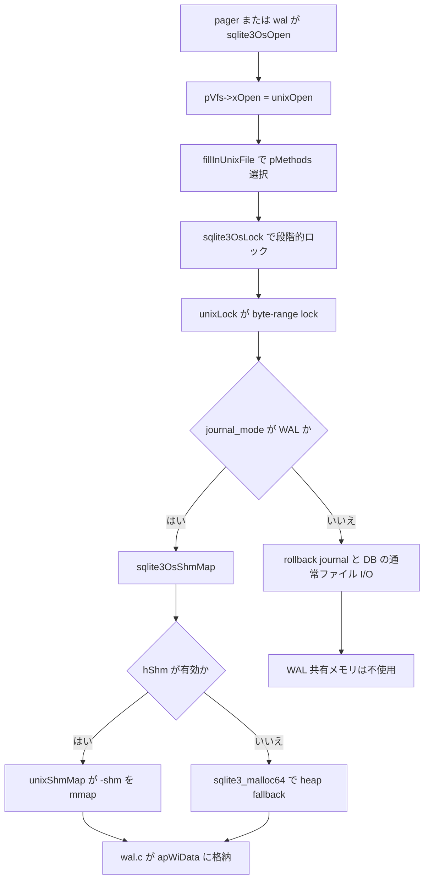

# 第22章 VFS とロック、共有メモリ

> **本章で読むソース**
>
> - [src/sqlite.h.in](https://github.com/sqlite/sqlite/blob/version-3.53.3/src/sqlite.h.in)
> - [src/os.c](https://github.com/sqlite/sqlite/blob/version-3.53.3/src/os.c)
> - [src/os_unix.c](https://github.com/sqlite/sqlite/blob/version-3.53.3/src/os_unix.c)
> - [src/wal.c](https://github.com/sqlite/sqlite/blob/version-3.53.3/src/wal.c)

本章は Unix ビルド（`os_unix.c`）を主対象とする。
Windows 向けの同等実装は `os_win.c` にあり、ロックと共有メモリの骨格は同じだが POSIX 固有の `flock` や `mmap` の詳細は異なる。

## この章の狙い

第20章と第21章では Pager と WAL がページ I/O と wal-index をどう使うかを読んだ。
その最下層でファイルを開き、バイト列を読み書きし、プロセス間ロックと共有メモリを提供するのが **VFS**（Virtual File System）である。
本章では公開 API の `sqlite3_vfs` と `sqlite3_io_methods`、中間ラッパーの `sqlite3OsOpen`、Unix 実装の `unixOpen`、`unixLock`、`unixShmMap` を追い、WAL が wal-index をマップする接続点までを読む。

## 前提

SQLite コアは OS 関数を直接呼ばない。
`sqlite3_vfs` がファイルの open/delete/access などを、`sqlite3_io_methods` が個々の `sqlite3_file` に対する read/write/lock/shm を担う。
Pager は `sqlite3OsOpen` で DB ファイルを開き、`sqlite3OsLock` で排他段階を上げ、WAL モードでは `sqlite3OsShmMap` 経由で wal-index を共有メモリとして参照する。

## sqlite3_io_methods

各オープン済みファイルは `sqlite3_file` 構造体の先頭に `sqlite3_io_methods` へのポインタを持つ。
`xRead` と `xWrite` がページ本体の転送、`xLock` と `xUnlock` が DB ロック、`xShmMap` と `xShmLock` が WAL 用の共有メモリ領域を担う。

[src/sqlite.h.in L854-L878](https://github.com/sqlite/sqlite/blob/version-3.53.3/src/sqlite.h.in#L854-L878)

```c
struct sqlite3_io_methods {
  int iVersion;
  int (*xClose)(sqlite3_file*);
  int (*xRead)(sqlite3_file*, void*, int iAmt, sqlite3_int64 iOfst);
  int (*xWrite)(sqlite3_file*, const void*, int iAmt, sqlite3_int64 iOfst);
  int (*xTruncate)(sqlite3_file*, sqlite3_int64 size);
  int (*xSync)(sqlite3_file*, int flags);
  int (*xFileSize)(sqlite3_file*, sqlite3_int64 *pSize);
  int (*xLock)(sqlite3_file*, int);
  int (*xUnlock)(sqlite3_file*, int);
  int (*xCheckReservedLock)(sqlite3_file*, int *pResOut);
  int (*xFileControl)(sqlite3_file*, int op, void *pArg);
  int (*xSectorSize)(sqlite3_file*);
  int (*xDeviceCharacteristics)(sqlite3_file*);
  /* Methods above are valid for version 1 */
  int (*xShmMap)(sqlite3_file*, int iPg, int pgsz, int, void volatile**);
  int (*xShmLock)(sqlite3_file*, int offset, int n, int flags);
  void (*xShmBarrier)(sqlite3_file*);
  int (*xShmUnmap)(sqlite3_file*, int deleteFlag);
  /* Methods above are valid for version 2 */
  int (*xFetch)(sqlite3_file*, sqlite3_int64 iOfst, int iAmt, void **pp);
  int (*xUnfetch)(sqlite3_file*, sqlite3_int64 iOfst, void *p);
  /* Methods above are valid for version 3 */
  /* Additional methods may be added in future releases */
};
```

ロック段階は `SQLITE_LOCK_NONE` から `SQLITE_LOCK_EXCLUSIVE` まで5段であり、コアは常に段階を上げる方向に `xLock` を呼ぶ。

## sqlite3_vfs

`sqlite3_vfs` は VFS 登録チェーンの1ノードであり、`xOpen` で `sqlite3_file` を初期化する。
`szOsFile` は VFS 固有の `sqlite3_file` サブクラス（Unix では `unixFile`）の格納サイズをコアに伝え、十分なサイズの格納領域を確保できるようにする。
`sqlite3OsOpenMalloc` は `sqlite3MallocZero(pVfs->szOsFile)` でヒープに確保し、Pager の main DB handle も Pager と同じヒープブロック内に置かれる。

[src/os.c L308-L329](https://github.com/sqlite/sqlite/blob/version-3.53.3/src/os.c#L308-L329)

```c
int sqlite3OsOpenMalloc(
  sqlite3_vfs *pVfs,
  const char *zFile,
  sqlite3_file **ppFile,
  int flags,
  int *pOutFlags
){
  int rc;
  sqlite3_file *pFile;
  pFile = (sqlite3_file *)sqlite3MallocZero(pVfs->szOsFile);
  if( pFile ){
    rc = sqlite3OsOpen(pVfs, zFile, pFile, flags, pOutFlags);
    if( rc!=SQLITE_OK ){
      sqlite3_free(pFile);
      *ppFile = 0;
    }else{
      *ppFile = pFile;
    }
  }else{
    *ppFile = 0;
    rc = SQLITE_NOMEM_BKPT;
  }
  assert( *ppFile!=0 || rc!=SQLITE_OK );
  return rc;
}
```

[src/pager.c L4916-L4938](https://github.com/sqlite/sqlite/blob/version-3.53.3/src/pager.c#L4916-L4938)

```c
  pPtr = (u8 *)sqlite3MallocZero(
    ROUND8(sizeof(*pPager)) +            /* Pager structure */
    ROUND8(pcacheSize) +                 /* PCache object */
    ROUND8(pVfs->szOsFile) +             /* The main db file */
    (u64)journalFileSize * 2 +           /* The two journal files */
    // ... (中略) ...
  );
  // ... (中略) ...
  pPager = (Pager*)pPtr;                  pPtr += ROUND8(sizeof(*pPager));
  pPager->pPCache = (PCache*)pPtr;        pPtr += ROUND8(pcacheSize);
  pPager->fd = (sqlite3_file*)pPtr;       pPtr += ROUND8(pVfs->szOsFile);
```

[src/sqlite.h.in L1513-L1550](https://github.com/sqlite/sqlite/blob/version-3.53.3/src/sqlite.h.in#L1513-L1550)

```c
struct sqlite3_vfs {
  int iVersion;            /* Structure version number (currently 3) */
  int szOsFile;            /* Size of subclassed sqlite3_file */
  int mxPathname;          /* Maximum file pathname length */
  sqlite3_vfs *pNext;      /* Next registered VFS */
  const char *zName;       /* Name of this virtual file system */
  void *pAppData;          /* Pointer to application-specific data */
  int (*xOpen)(sqlite3_vfs*, sqlite3_filename zName, sqlite3_file*,
               int flags, int *pOutFlags);
  int (*xDelete)(sqlite3_vfs*, const char *zName, int syncDir);
  int (*xAccess)(sqlite3_vfs*, const char *zName, int flags, int *pResOut);
  int (*xFullPathname)(sqlite3_vfs*, const char *zName, int nOut, char *zOut);
  void *(*xDlOpen)(sqlite3_vfs*, const char *zFilename);
  void (*xDlError)(sqlite3_vfs*, int nByte, char *zErrMsg);
  void (*(*xDlSym)(sqlite3_vfs*,void*, const char *zSymbol))(void);
  void (*xDlClose)(sqlite3_vfs*, void*);
  int (*xRandomness)(sqlite3_vfs*, int nByte, char *zOut);
  int (*xSleep)(sqlite3_vfs*, int microseconds);
  int (*xCurrentTime)(sqlite3_vfs*, double*);
  int (*xGetLastError)(sqlite3_vfs*, int, char *);
  int (*xCurrentTimeInt64)(sqlite3_vfs*, sqlite3_int64*);
  int (*xSetSystemCall)(sqlite3_vfs*, const char *zName, sqlite3_syscall_ptr);
  sqlite3_syscall_ptr (*xGetSystemCall)(sqlite3_vfs*, const char *zName);
  const char *(*xNextSystemCall)(sqlite3_vfs*, const char *zName);
};
```

## os.c のラッパー

`os.c` は VFS メソッドへの薄いラッパーを集約する。
`sqlite3OsOpen` はフラグの一部をマスクしたうえで `pVfs->xOpen` を呼び、`sqlite3OsLock` と `sqlite3OsShmMap` は `id->pMethods` の関数ポインタへ委譲する。

[src/os.c L107-L111](https://github.com/sqlite/sqlite/blob/version-3.53.3/src/os.c#L107-L111)

```c
int sqlite3OsLock(sqlite3_file *id, int lockType){
  DO_OS_MALLOC_TEST(id);
  assert( lockType>=SQLITE_LOCK_SHARED && lockType<=SQLITE_LOCK_EXCLUSIVE );
  return id->pMethods->xLock(id, lockType);
}
```

[src/os.c L179-L188](https://github.com/sqlite/sqlite/blob/version-3.53.3/src/os.c#L179-L188)

```c
int sqlite3OsShmMap(
  sqlite3_file *id,               /* Database file handle */
  int iPage,
  int pgsz,
  int bExtend,                    /* True to extend file if necessary */
  void volatile **pp              /* OUT: Pointer to mapping */
){
  DO_OS_MALLOC_TEST(id);
  return id->pMethods->xShmMap(id, iPage, pgsz, bExtend, pp);
}
```

[src/os.c L215-L232](https://github.com/sqlite/sqlite/blob/version-3.53.3/src/os.c#L215-L232)

```c
int sqlite3OsOpen(
  sqlite3_vfs *pVfs,
  const char *zPath,
  sqlite3_file *pFile,
  int flags,
  int *pFlagsOut
){
  int rc;
  DO_OS_MALLOC_TEST(0);
  assert( zPath || (flags & SQLITE_OPEN_EXCLUSIVE) );
  rc = pVfs->xOpen(pVfs, zPath, pFile, flags & 0x1087f7f, pFlagsOut);
  assert( rc==SQLITE_OK || pFile->pMethods==0 );
  return rc;
}
```

`SQLITE_OPEN_FULLMUTEX` などコア内部向けフラグは VFS へ渡る前にマスクされる点に注意する。

## unixOpen と I/O メソッドの選択

`unixOpen` はファイル種別フラグから `ctrlFlags` を組み立て、`fillInUnixFile` を呼ぶ。
`fillInUnixFile` は `UNIXFILE_NOLOCK` なら `nolockIoMethods`、そうでなければ `pVfs->pAppData` の finder 関数で `pLockingStyle` を選ぶ。
POSIX や NFS では `findInodeInfo` で inode 情報を取得したうえで `pId->pMethods` に設定する。

[src/os_unix.c L5852-L5861](https://github.com/sqlite/sqlite/blob/version-3.53.3/src/os_unix.c#L5852-L5861)

```c
IOMETHODS(
  posixIoFinder,            /* Finder function name */
  posixIoMethods,           /* sqlite3_io_methods object name */
  3,                        /* shared memory and mmap are enabled */
  unixClose,                /* xClose method */
  unixLock,                 /* xLock method */
  unixUnlock,               /* xUnlock method */
  unixCheckReservedLock,    /* xCheckReservedLock method */
  unixShmMap                /* xShmMap method */
)
```

[src/os_unix.c L6080-L6130](https://github.com/sqlite/sqlite/blob/version-3.53.3/src/os_unix.c#L6080-L6130)

```c
static int fillInUnixFile(
  sqlite3_vfs *pVfs,      /* Pointer to vfs object */
  int h,                  /* Open file descriptor of file being opened */
  sqlite3_file *pId,      /* Write to the unixFile structure here */
  const char *zFilename,  /* Name of the file being opened */
  int ctrlFlags           /* Zero or more UNIXFILE_* values */
){
  const sqlite3_io_methods *pLockingStyle;
  unixFile *pNew = (unixFile *)pId;
  int rc = SQLITE_OK;
  // ... (中略) ...
  if( ctrlFlags & UNIXFILE_NOLOCK ){
    pLockingStyle = &nolockIoMethods;
  }else{
    pLockingStyle = (**(finder_type*)pVfs->pAppData)(zFilename, pNew);
  }

  if( pLockingStyle == &posixIoMethods
#if defined(__APPLE__) && SQLITE_ENABLE_LOCKING_STYLE
    || pLockingStyle == &nfsIoMethods
#endif
  ){
    unixEnterMutex();
    rc = findInodeInfo(pNew, &pNew->pInode);
```

[src/os_unix.c L6251-L6255](https://github.com/sqlite/sqlite/blob/version-3.53.3/src/os_unix.c#L6251-L6255)

```c
  }else{
    pId->pMethods = pLockingStyle;
    OpenCounter(+1);
    verifyDbFile(pNew);
  }
```

`unixOpen` は `ctrlFlags` を組み立てたうえで `fillInUnixFile` を呼ぶ。

[src/os_unix.c L6772-L6819](https://github.com/sqlite/sqlite/blob/version-3.53.3/src/os_unix.c#L6772-L6819)

```c
  /* Set up appropriate ctrlFlags */
  if( isDelete )                ctrlFlags |= UNIXFILE_DELETE;
  if( isReadonly )              ctrlFlags |= UNIXFILE_RDONLY;
  noLock = eType!=SQLITE_OPEN_MAIN_DB;
  if( noLock )                  ctrlFlags |= UNIXFILE_NOLOCK;
  if( isNewJrnl )               ctrlFlags |= UNIXFILE_DIRSYNC;
  if( flags & SQLITE_OPEN_URI ) ctrlFlags |= UNIXFILE_URI;
  // ... (中略) ...
  rc = fillInUnixFile(pVfs, fd, pFile, zPath, ctrlFlags);
```

`posixIoMethods` は `unixLock` と `unixShmMap` を登録した標準的な POSIX 実装である。

`unixOpen` 冒頭では `SQLITE_OPEN_READONLY` と `SQLITE_OPEN_READWRITE` の排他、`SQLITE_OPEN_CREATE` と `SQLITE_OPEN_EXCLUSIVE` の前提関係を `assert` で検証する。

[src/os_unix.c L6538-L6605](https://github.com/sqlite/sqlite/blob/version-3.53.3/src/os_unix.c#L6538-L6605)

```c
static int unixOpen(
  sqlite3_vfs *pVfs,           /* The VFS for which this is the xOpen method */
  const char *zPath,           /* Pathname of file to be opened */
  sqlite3_file *pFile,         /* The file descriptor to be filled in */
  int flags,                   /* Input flags to control the opening */
  int *pOutFlags               /* Output flags returned to SQLite core */
){
  unixFile *p = (unixFile *)pFile;
  int fd = -1;                   /* File descriptor returned by open() */
  int openFlags = 0;             /* Flags to pass to open() */
  int eType = flags&0x0FFF00;  /* Type of file to open */
  int noLock;                    /* True to omit locking primitives */
  int rc = SQLITE_OK;            /* Function Return Code */
  int ctrlFlags = 0;             /* UNIXFILE_* flags */

  int isExclusive  = (flags & SQLITE_OPEN_EXCLUSIVE);
  int isDelete     = (flags & SQLITE_OPEN_DELETEONCLOSE);
  int isCreate     = (flags & SQLITE_OPEN_CREATE);
  int isReadonly   = (flags & SQLITE_OPEN_READONLY);
  int isReadWrite  = (flags & SQLITE_OPEN_READWRITE);
  // ... (中略) ...
  assert((isReadonly==0 || isReadWrite==0) && (isReadWrite || isReadonly));
  assert(isCreate==0 || isReadWrite);
  assert(isExclusive==0 || isCreate);
  assert(isDelete==0 || isCreate);

  assert( (!isDelete && zName) || eType!=SQLITE_OPEN_MAIN_DB );
  assert( (!isDelete && zName) || eType!=SQLITE_OPEN_MAIN_JOURNAL );
  assert( (!isDelete && zName) || eType!=SQLITE_OPEN_SUPER_JOURNAL );
  assert( (!isDelete && zName) || eType!=SQLITE_OPEN_WAL );

  assert( eType==SQLITE_OPEN_MAIN_DB      || eType==SQLITE_OPEN_TEMP_DB
       || eType==SQLITE_OPEN_MAIN_JOURNAL || eType==SQLITE_OPEN_TEMP_JOURNAL
       || eType==SQLITE_OPEN_SUBJOURNAL   || eType==SQLITE_OPEN_SUPER_JOURNAL
       || eType==SQLITE_OPEN_TRANSIENT_DB || eType==SQLITE_OPEN_WAL
  );
```

## unixLock

`unixLock` は DB ファイル上のバイトレンジロックで SQLite の5段階ロックを実装する。
コメントが述べるとおり、SHARED は pending byte の読ロックのあと shared byte range を読ロックし、RESERVED は reserved byte への書ロック、EXCLUSIVE は shared byte range 全体への書ロックで達成する。

[src/os_unix.c L1866-L1906](https://github.com/sqlite/sqlite/blob/version-3.53.3/src/os_unix.c#L1866-L1906)

```c
static int unixLock(sqlite3_file *id, int eFileLock){
  /* The following describes the implementation of the various locks and
  ** lock transitions in terms of the POSIX advisory shared and exclusive
  ** lock primitives (called read-locks and write-locks below, to avoid
  ** confusion with SQLite lock names). The algorithms are complicated
  ** slightly in order to be compatible with Windows95 systems simultaneously
  ** accessing the same database file, in case that is ever required.
  **
  ** Symbols defined in os.h identify the 'pending byte' and the 'reserved
  ** byte', each single bytes at well known offsets, and the 'shared byte
  ** range', a range of 510 bytes at a well known offset.
  **
  ** To obtain a SHARED lock, a read-lock is obtained on the 'pending
  ** byte'.  If this is successful, 'shared byte range' is read-locked
  ** and the lock on the 'pending byte' released.  (Legacy note:  When
  ** SQLite was first developed, Windows95 systems were still very common,
  ** and Windows95 lacks a shared-lock capability.  So on Windows95, a
  ** single randomly selected by from the 'shared byte range' is locked.
  ** Windows95 is now pretty much extinct, but this work-around for the
  ** lack of shared-locks on Windows95 lives on, for backwards
  ** compatibility.)
  **
  ** A process may only obtain a RESERVED lock after it has a SHARED lock.
  ** A RESERVED lock is implemented by grabbing a write-lock on the
  ** 'reserved byte'.
  **
  ** An EXCLUSIVE lock may only be requested after either a SHARED or
  ** RESERVED lock is held. An EXCLUSIVE lock is implemented by obtaining
  ** a write-lock on the entire 'shared byte range'. Since all other locks
  ** require a read-lock on one of the bytes within this range, this ensures
  ** that no other locks are held on the database.
  **
  ** If a process that holds a RESERVED lock requests an EXCLUSIVE, then
  ** a PENDING lock is obtained first. A PENDING lock is implemented by
  ** obtaining a write-lock on the 'pending byte'. This ensures that no new
  ** SHARED locks can be obtained, but existing SHARED locks are allowed to
  ** persist. If the call to this function fails to obtain the EXCLUSIVE
  ** lock in this case, it holds the PENDING lock instead. The client may
  ** then re-attempt the EXCLUSIVE lock later on, after existing SHARED
  ** locks have cleared.
  */
```

ロック取得の本体では、既に同等以上のロックがあれば即 return し、inode 単位の mutex で直列化したうえで同一プロセス内の競合を `SQLITE_BUSY` で返す。

[src/os_unix.c L1907-L1951](https://github.com/sqlite/sqlite/blob/version-3.53.3/src/os_unix.c#L1907-L1951)

```c
  int rc = SQLITE_OK;
  unixFile *pFile = (unixFile*)id;
  unixInodeInfo *pInode;
  struct flock lock;
  int tErrno = 0;

  assert( pFile );
  OSTRACE(("LOCK    %d %s was %s(%s,%d) pid=%d (unix)\n", pFile->h,
      azFileLock(eFileLock), azFileLock(pFile->eFileLock),
      azFileLock(pFile->pInode->eFileLock), pFile->pInode->nShared,
      osGetpid(0)));

  /* If there is already a lock of this type or more restrictive on the
  ** unixFile, do nothing. Don't use the end_lock: exit path, as
  ** unixEnterMutex() hasn't been called yet.
  */
  if( pFile->eFileLock>=eFileLock ){
    OSTRACE(("LOCK    %d %s ok (already held) (unix)\n", pFile->h,
            azFileLock(eFileLock)));
    return SQLITE_OK;
  }

  /* Make sure the locking sequence is correct.
  **  (1) We never move from unlocked to anything higher than shared lock.
  **  (2) SQLite never explicitly requests a pending lock.
  **  (3) A shared lock is always held when a reserve lock is requested.
  */
  assert( pFile->eFileLock!=NO_LOCK || eFileLock==SHARED_LOCK );
  assert( eFileLock!=PENDING_LOCK );
  assert( eFileLock!=RESERVED_LOCK || pFile->eFileLock==SHARED_LOCK );

  /* This mutex is needed because pFile->pInode is shared across threads
  */
  pInode = pFile->pInode;
  sqlite3_mutex_enter(pInode->pLockMutex);

  /* If some thread using this PID has a lock via a different unixFile*
  ** handle that precludes the requested lock, return BUSY.
  */
  if( (pFile->eFileLock!=pInode->eFileLock &&
          (pInode->eFileLock>=PENDING_LOCK || eFileLock>SHARED_LOCK))
  ){
    rc = SQLITE_BUSY;
    goto end_lock;
  }
```

同一 inode を複数 `unixFile` が共有するときは `pInode->pLockMutex` で直列化し、上記の `SQLITE_BUSY` 分岐が同一プロセス内の競合を返す。

## unixShmMap と WAL への接続

WAL の wal-index は概念上 shared memory である。
通常は DB ファイルと同じディレクトリの `-shm` ファイルを `mmap` し、`unixShmMap` が領域の確保とマップを担う。
`pShmNode->hShm < 0` の process-lock 経路では、`-shm` ファイルの代わりに `sqlite3_malloc64` でプロセス内領域を確保する。

[src/os_unix.c L5106-L5137](https://github.com/sqlite/sqlite/blob/version-3.53.3/src/os_unix.c#L5106-L5137)

```c
static int unixShmMap(
  sqlite3_file *fd,               /* Handle open on database file */
  int iRegion,                    /* Region to retrieve */
  int szRegion,                   /* Size of regions */
  int bExtend,                    /* True to extend file if necessary */
  void volatile **pp              /* OUT: Mapped memory */
){
  unixFile *pDbFd = (unixFile*)fd;
  unixShm *p;
  unixShmNode *pShmNode;
  int rc = SQLITE_OK;
  int nShmPerMap = unixShmRegionPerMap();
  int nReqRegion;

  if( pDbFd->pShm==0 ){
    rc = unixOpenSharedMemory(pDbFd);
    if( rc!=SQLITE_OK ) return rc;
  }

  p = pDbFd->pShm;
  pShmNode = p->pShmNode;
  sqlite3_mutex_enter(pShmNode->pShmMutex);
  if( pShmNode->isUnlocked ){
    rc = unixLockSharedMemory(pDbFd, pShmNode);
    if( rc!=SQLITE_OK ) goto shmpage_out;
    pShmNode->isUnlocked = 0;
  }
  assert( szRegion==pShmNode->szRegion || pShmNode->nRegion==0 );
  assert( pShmNode->pInode==pDbFd->pInode );
```

[src/os_unix.c L5136-L5137](https://github.com/sqlite/sqlite/blob/version-3.53.3/src/os_unix.c#L5136-L5137)

```c
  assert( pShmNode->hShm>=0 || pDbFd->pInode->bProcessLock==1 );
  assert( pShmNode->hShm<0 || pDbFd->pInode->bProcessLock==0 );
```

[src/os_unix.c L5159-L5187](https://github.com/sqlite/sqlite/blob/version-3.53.3/src/os_unix.c#L5159-L5187)

```c
      if( sStat.st_size<nByte ){
        // ... (中略) ...
        else{
          static const int pgsz = 4096;
          i64 iPg;

          /* Write to the last byte of each newly allocated or extended page */
          assert( (nByte % pgsz)==0 );
          for(iPg=(sStat.st_size/pgsz); iPg<(nByte/pgsz); iPg++){
            int x = 0;
            if( seekAndWriteFd(pShmNode->hShm, iPg*pgsz + pgsz-1,"",1,&x)!=1 ){
              const char *zFile = pShmNode->zFilename;
              rc = unixLogError(SQLITE_IOERR_SHMSIZE, "write", zFile);
              goto shmpage_out;
            }
          }
        }
      }
```

[src/os_unix.c L5201-L5221](https://github.com/sqlite/sqlite/blob/version-3.53.3/src/os_unix.c#L5201-L5221)

```c
    while( pShmNode->nRegion<nReqRegion ){
      i64 nMap = (i64)szRegion*(i64)nShmPerMap;
      // ... (中略) ...
      if( pShmNode->hShm>=0 ){
        pMem = osMmap(0, nMap,
            pShmNode->isReadonly ? PROT_READ : PROT_READ|PROT_WRITE,
            MAP_SHARED, pShmNode->hShm, szRegion*(i64)pShmNode->nRegion
        );
        // ... (中略) ...
      }else{
        pMem = sqlite3_malloc64(nMap);
        if( pMem==0 ){
          rc = SQLITE_NOMEM_BKPT;
          goto shmpage_out;
        }
        memset(pMem, 0, nMap);
      }
```

WAL 層の `walIndexPageRealloc` は heap モードでなければ `sqlite3OsShmMap` を呼び、返されたポインタを `pWal->apWiData[]` に格納する。

[src/wal.c L778-L803](https://github.com/sqlite/sqlite/blob/version-3.53.3/src/wal.c#L778-L803)

```c
  assert( pWal->apWiData[iPage]==0 );
  if( pWal->exclusiveMode==WAL_HEAPMEMORY_MODE ){
    pWal->apWiData[iPage] = (u32 volatile *)sqlite3MallocZero(WALINDEX_PGSZ);
    if( !pWal->apWiData[iPage] ) rc = SQLITE_NOMEM_BKPT;
  }else{
    rc = sqlite3OsShmMap(pWal->pDbFd, iPage, WALINDEX_PGSZ,
        pWal->writeLock, (void volatile **)&pWal->apWiData[iPage]
    );
    assert( pWal->apWiData[iPage]!=0
         || rc!=SQLITE_OK
         || (pWal->writeLock==0 && iPage==0) );
    testcase( pWal->apWiData[iPage]==0 && rc==SQLITE_OK );
    if( rc==SQLITE_OK ){
      if( iPage>0 && sqlite3FaultSim(600) ) rc = SQLITE_NOMEM;
    }else if( (rc&0xff)==SQLITE_READONLY ){
      pWal->readOnly |= WAL_SHM_RDONLY;
      if( rc==SQLITE_READONLY ){
        rc = SQLITE_OK;
      }
    }
  }

  *ppPage = pWal->apWiData[iPage];
  assert( iPage==0 || *ppPage || rc!=SQLITE_OK );
  return rc;
```

第21章で読んだ `walIndexReadHdr` や `walIndexAppend` は、いずれもこの `apWiData` 上のヘッダとハッシュブロックを参照する。

## 処理の流れ

DB オープンから WAL が wal-index をマップするまでの経路を示す。



## 高速化と最適化の工夫

file-backed 経路の `unixShmMap` は領域拡張時に新規ページの末尾1バイトずつ書き込み、OS に物理ページを即時確保させる。
遅延割り当てのまま `mmap` した領域へ後からアクセスすると `SIGBUS` になりうるため、wal-index 参照の安定性を優先している。

## まとめ

`sqlite3_vfs` と `sqlite3_io_methods` が OS 依存処理の契約を定義し、`os.c` の `sqlite3Os*` ラッパーがコアから VFS へ橋渡しする。
Unix では `unixOpen` が `fillInUnixFile` 経由で `pMethods` を選び、`unixLock` がファイル上のバイトロックでトランザクション排他を実現する。
WAL は `sqlite3OsShmMap` 経由で wal-index を共有メモリとしてマップし、第21章のフレーム逆引きを高速化する。
rollback-journal モードでは DB とジャーナルの通常ファイル I/O のみを使い、WAL 共有メモリは使わない。

## 関連する章

- [第20章 Pager とトランザクション](../part04-storage/20-pager.md)（`sqlite3OsOpen` と `sqlite3OsLock` の呼び出し元）
- [第21章 WAL モード](../part04-storage/21-wal.md)（wal-index と `walIndexPage`）
- [第24章 Mutex とワーカースレッド](24-mutex-threads.md)（`unixInode` の `pLockMutex`）
