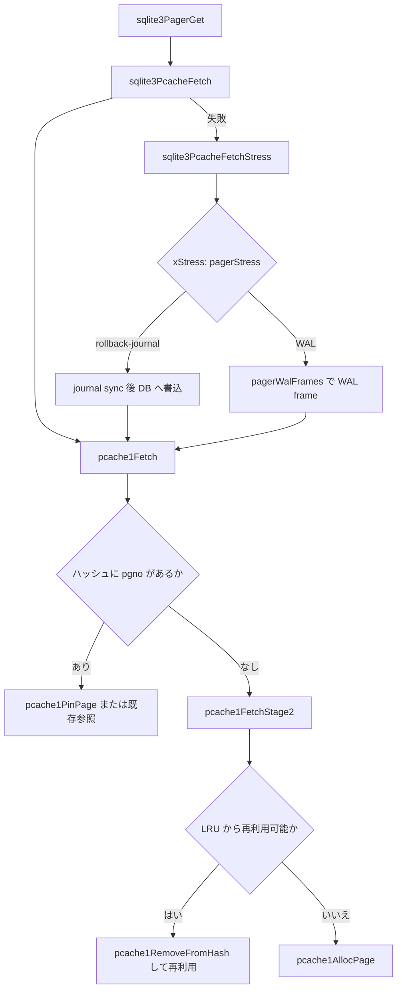

# 第23章 メモリ確保とページキャッシュ

> **本章で読むソース**
>
> - [src/malloc.c](https://github.com/sqlite/sqlite/blob/version-3.53.3/src/malloc.c)
> - [src/mem1.c](https://github.com/sqlite/sqlite/blob/version-3.53.3/src/mem1.c)
> - [src/pcache.c](https://github.com/sqlite/sqlite/blob/version-3.53.3/src/pcache.c)
> - [src/pcache1.c](https://github.com/sqlite/sqlite/blob/version-3.53.3/src/pcache1.c)

## この章の狙い

第20章の Pager はページ本体を `PCache` 経由で保持する。
その下ではヒープ確保とページバッファの再利用が別レイヤで管理されている。
本章では `malloc.c` の抽象 API と **lookaside**、`mem1.c` などの低レベル実装候補、`pcache.c` の `sqlite3PcacheFetch`、`pcache1.c` の `pcache1Fetch` と LRU 再分配を追う。

## 前提

`sqlite3GlobalConfig` は `sqlite3_mem_methods`（`m`）と `sqlite3_pcache_methods2`（`pcache2`）を保持する。
アプリは `sqlite3_config(SQLITE_CONFIG_MALLOC, ...)` でヒープ実装を差し替えられ、ページキャッシュは既定で `pcache1.c` が担う。
接続ごとの小さな確保は lookaside が先に試され、ページキャッシュはハッシュと LRU で再利用される。

[src/sqliteInt.h L4298-L4303](https://github.com/sqlite/sqlite/blob/version-3.53.3/src/sqliteInt.h#L4298-L4303)

```c
  int szLookaside;                  /* Default lookaside buffer size */
  int nLookaside;                   /* Default lookaside buffer count */
  int nStmtSpill;                   /* Stmt-journal spill-to-disk threshold */
  sqlite3_mem_methods m;            /* Low-level memory allocation interface */
  sqlite3_mutex_methods mutex;      /* Low-level mutex interface */
  sqlite3_pcache_methods2 pcache2;  /* Low-level page-cache interface */
```

## 低レベルメモリ実装

`sqlite3MallocInit` は `sqlite3GlobalConfig.m.xMalloc` が未設定なら `sqlite3MemSetDefault` を呼ぶ。
ビルド構成により `mem0.c`（スタブ）、`mem1.c`（標準 `malloc`）、`mem2.c`（デバッグ）、`mem3.c`（独自プール）、`mem5.c`（`SQLITE_ENABLE_MEMSYS5` 時の固定ヒープ）のいずれかが選ばれる。

[src/malloc.c L159-L173](https://github.com/sqlite/sqlite/blob/version-3.53.3/src/malloc.c#L159-L173)

```c
int sqlite3MallocInit(void){
  int rc;
  if( sqlite3GlobalConfig.m.xMalloc==0 ){
    sqlite3MemSetDefault();
  }
  mem0.mutex = sqlite3MutexAlloc(SQLITE_MUTEX_STATIC_MEM);
  if( sqlite3GlobalConfig.pPage==0 || sqlite3GlobalConfig.szPage<512
      || sqlite3GlobalConfig.nPage<=0 ){
    sqlite3GlobalConfig.pPage = 0;
    sqlite3GlobalConfig.szPage = 0;
  }
  rc = sqlite3GlobalConfig.m.xInit(sqlite3GlobalConfig.m.pAppData);
  if( rc!=SQLITE_OK ) memset(&mem0, 0, sizeof(mem0));
  return rc;
}
```

`mem1.c` は `SQLITE_SYSTEM_MALLOC` 時の既定実装であり、C ライブラリの `malloc`/`free` をそのまま使う。

[src/mem1.c L17-L23](https://github.com/sqlite/sqlite/blob/version-3.53.3/src/mem1.c#L17-L23)

```c
** This file contains implementations of the low-level memory allocation
** routines specified in the sqlite3_mem_methods object.  The content of
** this file is only used if SQLITE_SYSTEM_MALLOC is defined.  The
** SQLITE_SYSTEM_MALLOC macro is defined automatically if neither the
** SQLITE_MEMDEBUG nor the SQLITE_WIN32_MALLOC macros are defined.  The
** default configuration is to use memory allocation routines in this
** file.
```

`mem5.c` はアプリが事前に渡した固定サイズのヒープからのみ割り当てる実装で、`SQLITE_ENABLE_MEMSYS5` が定義されたビルドにだけ含まれる。

[src/mem5.c L15-L24](https://github.com/sqlite/sqlite/blob/version-3.53.3/src/mem5.c#L15-L24)

```c
** This version of the memory allocation subsystem omits all
** use of malloc(). The application gives SQLite a block of memory
** before calling sqlite3_initialize() from which allocations
** are made and returned by the xMalloc() and xRealloc() 
** implementations. Once sqlite3_initialize() has been called,
** the amount of memory available to SQLite is fixed and cannot
** be changed.
**
** This version of the memory allocation subsystem is included
** in the build only if SQLITE_ENABLE_MEMSYS5 is defined.
```

## sqlite3Malloc とソフトヒープ制限

`sqlite3Malloc` は統計とソフトヒープ制限を通す入口である。
`bMemstat` が有効なら `mem0.mutex` で直列化し、`mallocWithAlarm` が閾値超過時に `sqlite3_release_memory` を誘発する。

[src/malloc.c L246-L309](https://github.com/sqlite/sqlite/blob/version-3.53.3/src/malloc.c#L246-L309)

```c
static void mallocWithAlarm(int n, void **pp){
  void *p;
  int nFull;
  assert( sqlite3_mutex_held(mem0.mutex) );
  assert( n>0 );

  nFull = sqlite3GlobalConfig.m.xRoundup(n);

  sqlite3StatusHighwater(SQLITE_STATUS_MALLOC_SIZE, n);
  if( mem0.alarmThreshold>0 ){
    sqlite3_int64 nUsed = sqlite3StatusValue(SQLITE_STATUS_MEMORY_USED);
    if( nUsed >= mem0.alarmThreshold - nFull ){
      AtomicStore(&mem0.nearlyFull, 1);
      sqlite3MallocAlarm(nFull);
      if( mem0.hardLimit ){
        nUsed = sqlite3StatusValue(SQLITE_STATUS_MEMORY_USED);
        if( nUsed >= mem0.hardLimit - nFull ){
          test_oom_breakpoint(1);
          *pp = 0;
          return;
        }
      }
    }else{
      AtomicStore(&mem0.nearlyFull, 0);
    }
  }
  p = sqlite3GlobalConfig.m.xMalloc(nFull);
  // ... (中略) ...
  *pp = p;
}

void *sqlite3Malloc(u64 n){
  void *p;
  if( n==0 || n>SQLITE_MAX_ALLOCATION_SIZE ){
    p = 0;
  }else if( sqlite3GlobalConfig.bMemstat ){
    sqlite3_mutex_enter(mem0.mutex);
    mallocWithAlarm((int)n, &p);
    sqlite3_mutex_leave(mem0.mutex);
  }else{
    p = sqlite3GlobalConfig.m.xMalloc((int)n);
  }
  assert( EIGHT_BYTE_ALIGNMENT(p) );
  return p;
}
```

## lookaside

接続ローカルの小さな確保は `sqlite3DbMallocRawNN` が lookaside フリーリストから先に取る。
サイズが `db->lookaside.sz` を超えるかプールが空なら `sqlite3Malloc` へ落ちる。

[src/malloc.c L643-L679](https://github.com/sqlite/sqlite/blob/version-3.53.3/src/malloc.c#L643-L679)

```c
void *sqlite3DbMallocRawNN(sqlite3 *db, u64 n){
#ifndef SQLITE_OMIT_LOOKASIDE
  LookasideSlot *pBuf;
  assert( db!=0 );
  assert( sqlite3_mutex_held(db->mutex) );
  assert( db->pnBytesFreed==0 );
  if( n>db->lookaside.sz ){
    if( !db->lookaside.bDisable ){
      db->lookaside.anStat[1]++;      
    }else if( db->mallocFailed ){
      return 0;
    }
    return dbMallocRawFinish(db, n);
  }
#ifndef SQLITE_OMIT_TWOSIZE_LOOKASIDE
  if( n<=LOOKASIDE_SMALL ){
    if( (pBuf = db->lookaside.pSmallFree)!=0 ){
      db->lookaside.pSmallFree = pBuf->pNext;
      db->lookaside.anStat[0]++;
      return (void*)pBuf;
    }else if( (pBuf = db->lookaside.pSmallInit)!=0 ){
      db->lookaside.pSmallInit = pBuf->pNext;
      db->lookaside.anStat[0]++;
      return (void*)pBuf;
    }
  }
#endif
  if( (pBuf = db->lookaside.pFree)!=0 ){
    db->lookaside.pFree = pBuf->pNext;
    db->lookaside.anStat[0]++;
    return (void*)pBuf;
  }else if( (pBuf = db->lookaside.pInit)!=0 ){
    db->lookaside.pInit = pBuf->pNext;
    db->lookaside.anStat[0]++;
    return (void*)pBuf;
  }else{
    db->lookaside.anStat[2]++;
```

`PRAGMA cache_size` はページキャッシュの上限を変えるが、lookaside は別経路で管理される。
接続オープン時は `sqlite3GlobalConfig.szLookaside`/`nLookaside` から `setupLookaside` で初期化される。
lookaside がまだ使われていなければ、`sqlite3_db_config(SQLITE_DBCONFIG_LOOKASIDE)` で接続単位に再設定できる。

[src/main.c L3686-L3688](https://github.com/sqlite/sqlite/blob/version-3.53.3/src/main.c#L3686-L3688)

```c
  /* Enable the lookaside-malloc subsystem */
  setupLookaside(db, 0, sqlite3GlobalConfig.szLookaside,
                        sqlite3GlobalConfig.nLookaside);
```

[src/main.c L772-L811](https://github.com/sqlite/sqlite/blob/version-3.53.3/src/main.c#L772-L811)

```c
static int setupLookaside(
  sqlite3 *db,    /* Database connection being configured */
  void *pBuf,     /* Memory to use for lookaside.  May be NULL */
  int sz,         /* Desired size of each lookaside memory slot */
  int cnt         /* Number of slots to allocate */
){
  // ... (中略) ...
  if( sqlite3LookasideUsed(db,0)>0 ){
    return SQLITE_BUSY;
  }
  // ... (中略) ...
  sz = ROUNDDOWN8(sz);
  if( sz<=(int)sizeof(LookasideSlot*) ) sz = 0;
  if( sz>65528 ) sz = 65528;
  // ... (中略) ...
  if( szAlloc==0 ){
    sz = 0;
    pStart = 0;
  }else if( pBuf==0 ){
    sqlite3BeginBenignMalloc();
    pStart = sqlite3Malloc( szAlloc );
    sqlite3EndBenignMalloc();
```

[src/main.c L967-L972](https://github.com/sqlite/sqlite/blob/version-3.53.3/src/main.c#L967-L972)

```c
    case SQLITE_DBCONFIG_LOOKASIDE: {
      void *pBuf = va_arg(ap, void*); /* IMP: R-26835-10964 */
      int sz = va_arg(ap, int);       /* IMP: R-47871-25994 */
      int cnt = va_arg(ap, int);      /* IMP: R-04460-53386 */
      rc = setupLookaside(db, pBuf, sz, cnt);
      break;
    }
```

## sqlite3PcacheFetch

`pcache.c` は Pager 向けの抽象層である。
`sqlite3PcacheFetch` はダーティリストの状態から `eCreate` を決め、`pcache2.xFetch`（実体は `pcache1Fetch`）へ委譲する。
`sqlite3PcacheFetchFinish` と分離しており、ホットパスでのスタック操作を減らす。

[src/pcache.c L403-L432](https://github.com/sqlite/sqlite/blob/version-3.53.3/src/pcache.c#L403-L432)

```c
sqlite3_pcache_page *sqlite3PcacheFetch(
  PCache *pCache,       /* Obtain the page from this cache */
  Pgno pgno,            /* Page number to obtain */
  int createFlag        /* If true, create page if it does not exist already */
){
  int eCreate;
  sqlite3_pcache_page *pRes;

  assert( pCache!=0 );
  assert( pCache->pCache!=0 );
  assert( createFlag==3 || createFlag==0 );
  assert( pCache->eCreate==((pCache->bPurgeable && pCache->pDirty) ? 1 : 2) );

  eCreate = createFlag & pCache->eCreate;
  assert( eCreate==0 || eCreate==1 || eCreate==2 );
  assert( createFlag==0 || pCache->eCreate==eCreate );
  assert( createFlag==0 || eCreate==1+(!pCache->bPurgeable||!pCache->pDirty) );
  pRes = sqlite3GlobalConfig.pcache2.xFetch(pCache->pCache, pgno, eCreate);
  pcacheTrace(("%p.FETCH %d%s (result: %p) ",pCache,pgno,
               createFlag?" create":"",pRes));
  pcachePageTrace(pgno, pRes);
  return pRes;
}
```

キャッシュが満杯で `sqlite3PcacheFetch` が失敗したとき、`sqlite3PcacheFetchStress` はダーティページを `xStress`（Pager の `pagerStress`）経由で追い出してから再試行する。
rollback-journal モードでは `pagerStress` が必要ならジャーナルを sync したうえで dirty page 本体を DB ファイルへ書き clean にする。
WAL モードでは `pagerWalFrames` で WAL frame を書く。

[src/pager.c L4655-L4717](https://github.com/sqlite/sqlite/blob/version-3.53.3/src/pager.c#L4655-L4717)

```c
static int pagerStress(void *p, PgHdr *pPg){
  Pager *pPager = (Pager *)p;
  int rc = SQLITE_OK;
  // ... (中略) ...
  if( pagerUseWal(pPager) ){
    /* Write a single frame for this page to the log. */
    rc = subjournalPageIfRequired(pPg);
    if( rc==SQLITE_OK ){
      rc = pagerWalFrames(pPager, pPg, 0, 0);
    }
  }else{
    // ... (中略) ...
    /* Sync the journal file if required. */
    if( pPg->flags&PGHDR_NEED_SYNC
     || pPager->eState==PAGER_WRITER_CACHEMOD
    ){
      rc = syncJournal(pPager, 1);
    }

    /* Write the contents of the page out to the database file. */
    if( rc==SQLITE_OK ){
      assert( (pPg->flags&PGHDR_NEED_SYNC)==0 );
      rc = pager_write_pagelist(pPager, pPg);
    }
  }
```

[src/pcache.c L445-L489](https://github.com/sqlite/sqlite/blob/version-3.53.3/src/pcache.c#L445-L489)

```c
int sqlite3PcacheFetchStress(
  PCache *pCache,                 /* Obtain the page from this cache */
  Pgno pgno,                      /* Page number to obtain */
  sqlite3_pcache_page **ppPage    /* Write result here */
){
  PgHdr *pPg;
  if( pCache->eCreate==2 ) return 0;

  if( sqlite3PcachePagecount(pCache)>pCache->szSpill ){
    for(pPg=pCache->pSynced; 
        pPg && (pPg->nRef || (pPg->flags&PGHDR_NEED_SYNC)); 
        pPg=pPg->pDirtyPrev
    );
    pCache->pSynced = pPg;
    if( !pPg ){
      for(pPg=pCache->pDirtyTail; pPg && pPg->nRef; pPg=pPg->pDirtyPrev);
    }
    if( pPg ){
      int rc;
      pcacheTrace(("%p.SPILL %d\n",pCache,pPg->pgno));
      rc = pCache->xStress(pCache->pStress, pPg);
      pcacheDump(pCache);
      if( rc!=SQLITE_OK && rc!=SQLITE_BUSY ){
        return rc;
      }
    }
  }
  *ppPage = sqlite3GlobalConfig.pcache2.xFetch(pCache->pCache, pgno, 2);
  return *ppPage==0 ? SQLITE_NOMEM_BKPT : SQLITE_OK;
}
```

## pcache1Fetch と LRU

`pcache1Fetch` はハッシュ検索、新規作成拒否、LRU からの再利用、新規バッファ確保の5段階で動く。
`nMax` と `cache_size` は再利用を促す目標であり、`createFlag==2` の hard fetch では LRU 再利用ができなければ新規 page buffer を割り当て得る。
コメントが列挙するステップ2までは `pcache1FetchNoMutex` にまとめられ、グループ mutex が無い場合はロックなしの高速経路になる。

[src/pcache1.c L943-L995](https://github.com/sqlite/sqlite/blob/version-3.53.3/src/pcache1.c#L943-L995)

```c
**   3. If createFlag is 1, and the page is not already in the cache, then
**      return NULL (do not allocate a new page) if any of the following
**      conditions are true:
**
**       (a) the number of pages pinned by the cache is greater than
**           PCache1.nMax, or
  // ... (中略) ...
**   4. If none of the first three conditions apply and the cache is marked
**      as purgeable, and if one of the following is true:
**
**       (a) The number of pages allocated for the cache is already
**           PCache1.nMax, or
  // ... (中略) ...
**      then attempt to recycle a page from the LRU list. If it is the right
**      size, return the recycled buffer. Otherwise, free the buffer and
**      proceed to step 5.
**
**   5. Otherwise, allocate and return a new page buffer.
```

[src/pcache1.c L1002-L1070](https://github.com/sqlite/sqlite/blob/version-3.53.3/src/pcache1.c#L1002-L1070)

```c
static PgHdr1 *pcache1FetchNoMutex(
  sqlite3_pcache *p,
  unsigned int iKey,
  int createFlag
){
  PCache1 *pCache = (PCache1 *)p;
  PgHdr1 *pPage = 0;

  /* Step 1: Search the hash table for an existing entry. */
  pPage = pCache->apHash[iKey % pCache->nHash];
  while( pPage && pPage->iKey!=iKey ){ pPage = pPage->pNext; }

  if( pPage ){
    if( PAGE_IS_UNPINNED(pPage) ){
      return pcache1PinPage(pPage);
    }else{
      return pPage;
    }
  }else if( createFlag ){
    return pcache1FetchStage2(pCache, iKey, createFlag);
  }else{
    return 0;
  }
}
static sqlite3_pcache_page *pcache1Fetch(
  sqlite3_pcache *p,
  unsigned int iKey,
  int createFlag
){
  // ... (中略) ...
#if PCACHE1_MIGHT_USE_GROUP_MUTEX
  if( pCache->pGroup->mutex ){
    return (sqlite3_pcache_page*)pcache1FetchWithMutex(p, iKey, createFlag);
  }else
#endif
  {
    return (sqlite3_pcache_page*)pcache1FetchNoMutex(p, iKey, createFlag);
  }
}
```

LRU 再利用は `pcache1FetchStage2` のステップ4で、`pGroup->lru.pLruPrev` からアンピン済みページを取り出す。

[src/pcache1.c L899-L923](https://github.com/sqlite/sqlite/blob/version-3.53.3/src/pcache1.c#L899-L923)

```c
  if( pCache->bPurgeable
   && !pGroup->lru.pLruPrev->isAnchor
   && ((pCache->nPage+1>=pCache->nMax) || pcache1UnderMemoryPressure(pCache))
  ){
    PCache1 *pOther;
    pPage = pGroup->lru.pLruPrev;
    assert( PAGE_IS_UNPINNED(pPage) );
    pcache1RemoveFromHash(pPage, 0);
    pcache1PinPage(pPage);
    pOther = pPage->pCache;
    if( pOther->szAlloc != pCache->szAlloc ){
      pcache1FreePage(pPage);
      pPage = 0;
    }else{
      pGroup->nPurgeable -= (pOther->bPurgeable - pCache->bPurgeable);
    }
  }

  if( !pPage ){
    pPage = pcache1AllocPage(pCache, createFlag==1);
  }
```

`pcache1Unpin` は解放されたページをグループ LRU リスト先頭へ挿入し、キャッシュ圧力下では即ハッシュから除去する。

[src/pcache1.c L1078-L1107](https://github.com/sqlite/sqlite/blob/version-3.53.3/src/pcache1.c#L1078-L1107)

```c
static void pcache1Unpin(
  sqlite3_pcache *p,
  sqlite3_pcache_page *pPg,
  int reuseUnlikely
){
  PCache1 *pCache = (PCache1 *)p;
  PgHdr1 *pPage = (PgHdr1 *)pPg;
  PGroup *pGroup = pCache->pGroup;

  assert( pPage->pCache==pCache );
  pcache1EnterMutex(pGroup);

  assert( pPage->pLruNext==0 );
  assert( PAGE_IS_PINNED(pPage) );

  if( reuseUnlikely || pGroup->nPurgeable>pGroup->nMaxPage ){
    pcache1RemoveFromHash(pPage, 1);
  }else{
    PgHdr1 **ppFirst = &pGroup->lru.pLruNext;
    pPage->pLruPrev = &pGroup->lru;
    (pPage->pLruNext = *ppFirst)->pLruPrev = pPage;
    *ppFirst = pPage;
    pCache->nRecyclable++;
  }

  pcache1LeaveMutex(pCache->pGroup);
}
```

## 処理の流れ

Pager がページを要求してからバッファが返るまでの経路を示す。



## 高速化と最適化の工夫

`pcache.c` はダーティリストが空になったとき `eCreate` を 2 に上げ、`sqlite3PcacheFetch` がダーティ追い出し候補を探すループをスキップできる。
ページキャッシュに空きがある通常読み取りでは、毎回の fetch でクリーンページ探索が不要になる。

## まとめ

`sqlite3_mem_methods` がヒープ実装を差し替え可能にし、`sqlite3Malloc` と lookaside が接続ローカルの確保を分担する。
`pcache.c` は Pager 向けの抽象 API を提供し、`pcache1.c` がハッシュとグループ LRU でページバッファを再利用する。
キャッシュ圧力時は `sqlite3PcacheFetchStress` が `pagerStress` と連携し、可能なら LRU 再利用やモード別 spill で空きを作る。
`xStress` が成功または `SQLITE_BUSY` なら hard fetch へ進み、その新規ページ確保は OOM のときに失敗する。
`xStress` 自身が返す I/O エラー（ジャーナル同期、DB 書き込み、WAL フレーム書き込み）はそのまま伝播する。

## 関連する章

- [第20章 Pager とトランザクション](../part04-storage/20-pager.md)（`sqlite3PagerGet` と `PCache`）
- [第22章 VFS とロック、共有メモリ](22-vfs-locking.md)（mmap ページの読み取り元）
- [第24章 Mutex とワーカースレッド](24-mutex-threads.md)（`mem0.mutex` と pcache グループ mutex）
