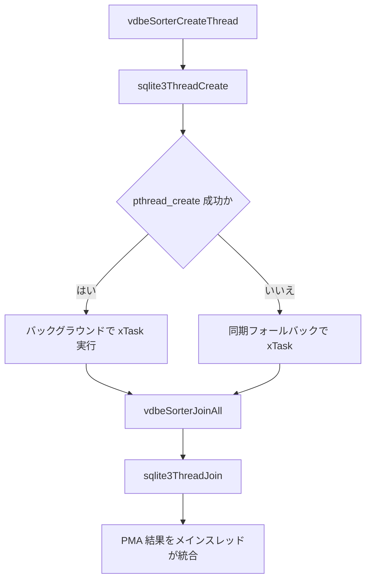

# 第24章 Mutex とワーカースレッド

> **本章で読むソース**
>
> - [src/mutex.c](https://github.com/sqlite/sqlite/blob/version-3.53.3/src/mutex.c)
> - [src/mutex_unix.c](https://github.com/sqlite/sqlite/blob/version-3.53.3/src/mutex_unix.c)
> - [src/threads.c](https://github.com/sqlite/sqlite/blob/version-3.53.3/src/threads.c)

本章は Unix ビルド（`mutex_unix.c`）を主対象とする。
Windows では `mutex_w32.c` が `CRITICAL_SECTION` ベースの同等 API を提供する。

## この章の狙い

第22章と第23章では VFS とメモリ、ページキャッシュが複数接続やスレッドから触れうる共有資源を扱った。
その直列化は **Mutex** と内部スレッド API で担われる。
本章では `mutex.c` の抽象層、`mutex_unix.c` の `pthread_mutex` 実装、`threads.c` の `sqlite3ThreadCreate` を読み、外部マージソートなどのワーカー起動経路までを追う。
`hash.c`、`bitvec.c`、`printf.c`、`util.c` は本章の主経路には含めず、各利用章で補助的に引用する。

## 前提

SQLite は `sqlite3_mutex_methods` で Mutex 実装を差し替え可能にしている。
コア内部は `sqlite3MutexAlloc` と `sqlite3_mutex_enter` を使い、公開 API の `sqlite3_mutex_alloc` は初期化チェックを挟む。
`threads.c` 全体は `#if SQLITE_MAX_WORKER_THREADS>0` 内にあり、`SQLITE_MAX_WORKER_THREADS==0` ならワーカー呼び出し側とともにコンパイル対象外になる。
同期版 `SQLiteThread` は `MAX_WORKER_THREADS>0` だが pthread/Win32 実装が選ばれず `SQLITE_THREADS_IMPLEMENTED` が未定義の構成で使われる。

## mutex.c の抽象層

`sqlite3MutexAlloc` は `bCoreMutex` が無効なら NULL を返し、有効なら `sqlite3GlobalConfig.mutex.xMutexAlloc` へ委譲する。
動的 mutex（`SQLITE_MUTEX_FAST`/`SQLITE_MUTEX_RECURSIVE`）と静的 mutex（`SQLITE_MUTEX_STATIC_*`）を同じ入口で扱う。

[src/mutex.c L299-L306](https://github.com/sqlite/sqlite/blob/version-3.53.3/src/mutex.c#L299-L306)

```c
sqlite3_mutex *sqlite3MutexAlloc(int id){
  if( !sqlite3GlobalConfig.bCoreMutex ){
    return 0;
  }
  assert( GLOBAL(int, mutexIsInit) );
  assert( sqlite3GlobalConfig.mutex.xMutexAlloc );
  return sqlite3GlobalConfig.mutex.xMutexAlloc(id);
}
```

[src/mutex.c L322-L327](https://github.com/sqlite/sqlite/blob/version-3.53.3/src/mutex.c#L322-L327)

```c
void sqlite3_mutex_enter(sqlite3_mutex *p){
  if( p ){
    assert( sqlite3GlobalConfig.mutex.xMutexEnter );
    sqlite3GlobalConfig.mutex.xMutexEnter(p);
  }
}
```

公開 API 側の `sqlite3_mutex_alloc` は `sqlite3_initialize` または `sqlite3MutexInit` を先に呼ぶ。

[src/mutex.c L290-L297](https://github.com/sqlite/sqlite/blob/version-3.53.3/src/mutex.c#L290-L297)

```c
sqlite3_mutex *sqlite3_mutex_alloc(int id){
#ifndef SQLITE_OMIT_AUTOINIT
  if( id<=SQLITE_MUTEX_RECURSIVE && sqlite3_initialize() ) return 0;
  if( id>SQLITE_MUTEX_RECURSIVE && sqlite3MutexInit() ) return 0;
#endif
  assert( sqlite3GlobalConfig.mutex.xMutexAlloc );
  return sqlite3GlobalConfig.mutex.xMutexAlloc(id);
}
```

## mutex_unix.c の pthread 実装

Unix スレッドセーフビルドでは `sqlite3_mutex` が `pthread_mutex_t` を内包する。
`SQLITE_MUTEX_RECURSIVE` は `PTHREAD_MUTEX_RECURSIVE` 属性で生成され、データベース接続 mutex など再入が必要な箇所で使われる。

[src/mutex_unix.c L41-L51](https://github.com/sqlite/sqlite/blob/version-3.53.3/src/mutex_unix.c#L41-L51)

```c
struct sqlite3_mutex {
  pthread_mutex_t mutex;     /* Mutex controlling the lock */
#if SQLITE_MUTEX_NREF || defined(SQLITE_ENABLE_API_ARMOR)
  int id;                    /* Mutex type */
#endif
#if SQLITE_MUTEX_NREF
  volatile int nRef;         /* Number of entrances */
  volatile pthread_t owner;  /* Thread that is within this mutex */
  int trace;                 /* True to trace changes */
#endif
};
```

[src/mutex_unix.c L170-L188](https://github.com/sqlite/sqlite/blob/version-3.53.3/src/mutex_unix.c#L170-L188)

```c
    case SQLITE_MUTEX_RECURSIVE: {
      p = sqlite3MallocZero( sizeof(*p) );
      if( p ){
#ifdef SQLITE_HOMEGROWN_RECURSIVE_MUTEX
        pthread_mutex_init(&p->mutex, 0);
#else
        pthread_mutexattr_t recursiveAttr;
        pthread_mutexattr_init(&recursiveAttr);
        pthread_mutexattr_settype(&recursiveAttr, PTHREAD_MUTEX_RECURSIVE);
        pthread_mutex_init(&p->mutex, &recursiveAttr);
        pthread_mutexattr_destroy(&recursiveAttr);
#endif
#if SQLITE_MUTEX_NREF || defined(SQLITE_ENABLE_API_ARMOR)
        p->id = SQLITE_MUTEX_RECURSIVE;
#endif
      }
      break;
    }
```

静的 mutex はファイル内の `staticMutexes[]` から返され、`SQLITE_MUTEX_STATIC_MEM` などはプロセス全体で1インスタンスである。

[src/mutex_unix.c L153-L167](https://github.com/sqlite/sqlite/blob/version-3.53.3/src/mutex_unix.c#L153-L167)

```c
static sqlite3_mutex *pthreadMutexAlloc(int iType){
  static sqlite3_mutex staticMutexes[] = {
    SQLITE3_MUTEX_INITIALIZER(2),
    SQLITE3_MUTEX_INITIALIZER(3),
    SQLITE3_MUTEX_INITIALIZER(4),
    SQLITE3_MUTEX_INITIALIZER(5),
    SQLITE3_MUTEX_INITIALIZER(6),
    SQLITE3_MUTEX_INITIALIZER(7),
    SQLITE3_MUTEX_INITIALIZER(8),
    SQLITE3_MUTEX_INITIALIZER(9),
    SQLITE3_MUTEX_INITIALIZER(10),
    SQLITE3_MUTEX_INITIALIZER(11),
    SQLITE3_MUTEX_INITIALIZER(12),
    SQLITE3_MUTEX_INITIALIZER(13)
  };
```

`pthreadMutexEnter` は再入可能 mutex では `nRef` と `owner` を更新し、他スレッドが保持中なら `pthread_mutex_lock` でブロックする。
homegrown recursive mutex では同一スレッドの再入時に `nRef` だけ増分し、初回取得時に `pthread_mutex_lock` と `owner` 設定を行う。

[src/mutex_unix.c L251-L285](https://github.com/sqlite/sqlite/blob/version-3.53.3/src/mutex_unix.c#L251-L285)

```c
static void pthreadMutexEnter(sqlite3_mutex *p){
  assert( p->id==SQLITE_MUTEX_RECURSIVE || pthreadMutexNotheld(p) );

#ifdef SQLITE_HOMEGROWN_RECURSIVE_MUTEX
  {
    pthread_t self = pthread_self();
    if( p->nRef>0 && pthread_equal(p->owner, self) ){
      p->nRef++;
    }else{
      pthread_mutex_lock(&p->mutex);
      assert( p->nRef==0 );
      p->owner = self;
      p->nRef = 1;
    }
  }
#else
  /* Use the built-in recursive mutexes if they are available.
  */
  pthread_mutex_lock(&p->mutex);
#if SQLITE_MUTEX_NREF
  assert( p->nRef>0 || p->owner==0 );
  p->owner = pthread_self();
  p->nRef++;
#endif
#endif
```

`mutex_unix.c` の `sqlite3MemoryBarrier` は mutex 無効ビルドでも VFS の `xShmBarrier` から使われ、共有メモリの可視性を保つ。

[src/mutex_unix.c L91-L97](https://github.com/sqlite/sqlite/blob/version-3.53.3/src/mutex_unix.c#L91-L97)

```c
void sqlite3MemoryBarrier(void){
#if defined(SQLITE_MEMORY_BARRIER)
  SQLITE_MEMORY_BARRIER;
#elif defined(__GNUC__) && GCC_VERSION>=4001000
  __sync_synchronize();
#endif
}
```

## mutex_w32.c（注記）

Windows ビルドでは `mutex_w32.c` が `CRITICAL_SECTION` を使う。
構造体と alloc 経路は Unix 版と対応するが、本章では POSIX 実装を主に読む。

[src/mutex_w32.c L37-L39](https://github.com/sqlite/sqlite/blob/version-3.53.3/src/mutex_w32.c#L37-L39)

```c
struct sqlite3_mutex {
  CRITICAL_SECTION mutex;    /* Mutex controlling the lock */
  int id;                    /* Mutex type */
```

## sqlite3ThreadCreate

`threads.c` は SQLite 内部専用の薄いスレッド API である。
Unix では `pthread_create` でワーカーを起動し、失敗時は同期的に `xTask` を呼ぶフォールバックがある。
`SQLITE_MAX_WORKER_THREADS==0` のビルドでは `threads.c` 自体がコンパイルされない。

[src/threads.c L33-L85](https://github.com/sqlite/sqlite/blob/version-3.53.3/src/threads.c#L33-L85)

```c
#if SQLITE_MAX_WORKER_THREADS>0

struct SQLiteThread {
  pthread_t tid;                 /* Thread ID */
  int done;                      /* Set to true when thread finishes */
  void *pOut;                    /* Result returned by the thread */
  void *(*xTask)(void*);         /* The thread routine */
  void *pIn;                     /* Argument to the thread */
};

int sqlite3ThreadCreate(
  SQLiteThread **ppThread,  /* OUT: Write the thread object here */
  void *(*xTask)(void*),    /* Routine to run in a separate thread */
  void *pIn                 /* Argument passed into xTask() */
){
  SQLiteThread *p;
  int rc;

  assert( ppThread!=0 );
  assert( xTask!=0 );
  assert( sqlite3GlobalConfig.bCoreMutex!=0 );

  *ppThread = 0;
  p = sqlite3Malloc(sizeof(*p));
  if( p==0 ) return SQLITE_NOMEM_BKPT;
  memset(p, 0, sizeof(*p));
  p->xTask = xTask;
  p->pIn = pIn;
  if( sqlite3FaultSim(200) ){
    rc = 1;
  }else{    
    rc = pthread_create(&p->tid, 0, xTask, pIn);
  }
  if( rc ){
    p->done = 1;
    p->pOut = xTask(pIn);
  }
  *ppThread = p;
  return SQLITE_OK;
}
```

`sqlite3ThreadJoin` は `pthread_join` で完了を待ち、スレッドオブジェクトを解放する。

[src/threads.c L88-L101](https://github.com/sqlite/sqlite/blob/version-3.53.3/src/threads.c#L88-L101)

```c
int sqlite3ThreadJoin(SQLiteThread *p, void **ppOut){
  int rc;

  assert( ppOut!=0 );
  if( NEVER(p==0) ) return SQLITE_NOMEM_BKPT;
  if( p->done ){
    *ppOut = p->pOut;
    rc = SQLITE_OK;
  }else{
    rc = pthread_join(p->tid, ppOut) ? SQLITE_ERROR : SQLITE_OK;
  }
  sqlite3_free(p);
  return rc;
}
```

同期版 `SQLiteThread` は `pthread_create` が使えない構成で、`sqlite3ThreadCreate` または `sqlite3ThreadJoin` 時に `xTask` を同期的に実行する。

[src/threads.c L211-L271](https://github.com/sqlite/sqlite/blob/version-3.53.3/src/threads.c#L211-L271)

```c
#ifndef SQLITE_THREADS_IMPLEMENTED
/*
** This implementation does not actually create a new thread.  It does the
** work of the thread in the main thread, when either the thread is created
** or when it is joined
*/
  // ... (中略) ...
int sqlite3ThreadCreate(
  SQLiteThread **ppThread,  /* OUT: Write the thread object here */
  void *(*xTask)(void*),    /* Routine to run in a separate thread */
  void *pIn                 /* Argument passed into xTask() */
){
  // ... (中略) ...
  if( (SQLITE_PTR_TO_INT(p)/17)&1 ){
    p->xTask = xTask;
    p->pIn = pIn;
  }else{
    p->xTask = 0;
    p->pResult = xTask(pIn);
  }
  *ppThread = p;
  return SQLITE_OK;
}
  // ... (中略) ...
int sqlite3ThreadJoin(SQLiteThread *p, void **ppOut){
  // ... (中略) ...
  if( p->xTask ){
    *ppOut = p->xTask(p->pIn);
  }else{
    *ppOut = p->pResult;
  }
```

## ワーカースレッドの利用例

第16章で読んだ外部マージソートは、PMA 生成を並列化するために `sqlite3ThreadCreate` を使う。
`vdbeSorterCreateThread` が `SortSubtask` にスレッドハンドルを保持する。

[src/vdbesort.c L1150-L1157](https://github.com/sqlite/sqlite/blob/version-3.53.3/src/vdbesort.c#L1150-L1157)

```c
static int vdbeSorterCreateThread(
  SortSubtask *pTask,             /* Thread will use this task object */
  void *(*xTask)(void*),          /* Routine to run in a separate thread */
  void *pIn                       /* Argument passed into xTask() */
){
  assert( pTask->pThread==0 && pTask->bDone==0 );
  return sqlite3ThreadCreate(&pTask->pThread, xTask, pIn);
}
```

`vdbeSorterJoinAll` はメインスレッドから各タスクの `sqlite3ThreadJoin` を逆順に呼び、レースを避ける。

[src/vdbesort.c L1163-L1179](https://github.com/sqlite/sqlite/blob/version-3.53.3/src/vdbesort.c#L1163-L1179)

```c
static int vdbeSorterJoinAll(VdbeSorter *pSorter, int rcin){
  int rc = rcin;
  int i;

  for(i=pSorter->nTask-1; i>=0; i--){
    SortSubtask *pTask = &pSorter->aTask[i];
    int rc2 = vdbeSorterJoinThread(pTask);
    if( rc==SQLITE_OK ) rc = rc2;
  }
  return rc;
}
```

## 処理の流れ

ワーカー起動から合流までの経路を示す。



## 高速化と最適化の工夫

`pcache1.c` ではグループ mutex が無い構成では `pcache1FetchNoMutex` がロックなしで動く（第23章）。
`threads.c` では `pthread_create` 失敗時に同期的に `xTask` を実行し、ワーカー無効環境でもソート処理が止まらないようにしている。

## まとめ

`mutex.c` が `sqlite3_mutex_methods` 経由でプラットフォーム実装へ委譲し、Unix では `pthread_mutex` が接続 mutex と静的 mutex を提供する。
`threads.c` は内部専用の薄いスレッド API で、外部マージソートが PMA 生成を並列化する。
Windows では `mutex_w32.c` が同等の役割を担うが、本章の主経路は Unix の pthread 実装である。

## 関連する章

- [第16章 外部マージソート](../part03-vdbe/16-external-sort.md)（`vdbeSorterCreateThread` の文脈）
- [第22章 VFS とロック、共有メモリ](22-vfs-locking.md)（`unixInode` の `pLockMutex`）
- [第23章 メモリ確保とページキャッシュ](23-memory-pcache.md)（`SQLITE_MUTEX_STATIC_MEM`）
