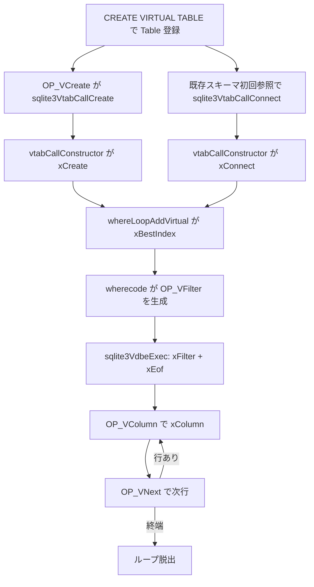

# 第25章 仮想テーブルと JSON

> **本章で読むソース**
>
> - [src/vtab.c](https://github.com/sqlite/sqlite/blob/version-3.53.3/src/vtab.c)
> - [src/where.c](https://github.com/sqlite/sqlite/blob/version-3.53.3/src/where.c)
> - [src/wherecode.c](https://github.com/sqlite/sqlite/blob/version-3.53.3/src/wherecode.c)
> - [src/vdbe.c](https://github.com/sqlite/sqlite/blob/version-3.53.3/src/vdbe.c)
> - [src/func.c](https://github.com/sqlite/sqlite/blob/version-3.53.3/src/func.c)
> - [src/json.c](https://github.com/sqlite/sqlite/blob/version-3.53.3/src/json.c)

## この章の狙い

第8章と第9章では B-tree テーブルを前提にクエリプランナがループ候補を組み立てた。
本章では **virtual table**（仮想テーブル）がその枠組みにどう差し込まれるかを読む。
`sqlite3_module` の登録から `xBestIndex`、`OP_VFilter` などの VDBE opcode までを汎用経路として追い、続けて組み込み JSON 拡張の関数経路と `json_each` / `json_tree` の仮想テーブル経路を分けて見る。

## 前提

仮想テーブルは通常の B-tree ページを持たず、モジュールが提供する `xFilter` / `xNext` / `xColumn` / `xUpdate` などのコールバックで行を供給する。
スキーマ上は `CREATE VIRTUAL TABLE` で `Table` オブジェクトが作られる。
`CREATE VIRTUAL TABLE` 実行時は VDBE の `OP_VCreate` から `sqlite3VtabCallCreate` が呼ばれ、常に `xCreate` で `sqlite3_vtab` を作る。
既存スキーマの仮想テーブルへ初めて触れるときは `sqlite3VtabCallConnect` が別経路で `xConnect` を呼び、接続ごとに `VTable` を束ねる。
JSON 拡張は `SQLITE_OMIT_JSON` が無効なビルドで `json.c` にまとまっており、スカラー関数と表形式関数（`json_each` など）の両方を提供する。

## sqlite3_module とモジュール登録

公開 API の契約は `sqlite3_module` 構造体に集約される。
`xCreate` / `xConnect` でインスタンスを作り、`xBestIndex` がプランナへ計画を返し、カーソル操作と DML が残りのメソッドに割り当てられる。

[src/sqlite.h.in L7686-L7706](https://github.com/sqlite/sqlite/blob/version-3.53.3/src/sqlite.h.in#L7686-L7706)

```c
struct sqlite3_module {
  int iVersion;
  int (*xCreate)(sqlite3*, void *pAux,
               int argc, const char *const*argv,
               sqlite3_vtab **ppVTab, char**);
  int (*xConnect)(sqlite3*, void *pAux,
               int argc, const char *const*argv,
               sqlite3_vtab **ppVTab, char**);
  int (*xBestIndex)(sqlite3_vtab *pVTab, sqlite3_index_info*);
  int (*xDisconnect)(sqlite3_vtab *pVTab);
  int (*xDestroy)(sqlite3_vtab *pVtab);
  int (*xOpen)(sqlite3_vtab *pVTab, sqlite3_vtab_cursor **ppCursor);
  int (*xClose)(sqlite3_vtab_cursor*);
  int (*xFilter)(sqlite3_vtab_cursor*, int idxNum, const char *idxStr,
                int argc, sqlite3_value **argv);
  int (*xNext)(sqlite3_vtab_cursor*);
  int (*xEof)(sqlite3_vtab_cursor*);
  int (*xColumn)(sqlite3_vtab_cursor*, sqlite3_context*, int);
  int (*xRowid)(sqlite3_vtab_cursor*, sqlite3_int64 *pRowid);
  int (*xUpdate)(sqlite3_vtab *, int, sqlite3_value **, sqlite3_int64 *);
  // ... (中略) ...
};
```

`sqlite3_create_module` / `sqlite3_create_module_v2` は内部で `sqlite3VtabCreateModule` を呼び、モジュール名を `db->aModule` ハッシュに登録する。
同名モジュールが既にあれば置き換え、削除時は `xDestroy` コールバックで補助データを解放する。

[src/vtab.c L39-L66](https://github.com/sqlite/sqlite/blob/version-3.53.3/src/vtab.c#L39-L66)

```c
Module *sqlite3VtabCreateModule(
  sqlite3 *db,                    /* Database in which module is registered */
  const char *zName,              /* Name assigned to this module */
  const sqlite3_module *pModule,  /* The definition of the module */
  void *pAux,                     /* Context pointer for xCreate/xConnect */
  void (*xDestroy)(void *)        /* Module destructor function */
){
  Module *pMod;
  Module *pDel;
  char *zCopy;
  if( pModule==0 ){
    zCopy = (char*)zName;
    pMod = 0;
  }else{
    int nName = sqlite3Strlen30(zName);
    pMod = (Module *)sqlite3Malloc(sizeof(Module) + nName + 1);
    // ... (中略) ...
    pMod->zName = zCopy;
    pMod->pModule = pModule;
    pMod->pAux = pAux;
    pMod->xDestroy = xDestroy;
    pMod->pEpoTab = 0;
    pMod->nRefModule = 1;
  }
  pDel = (Module *)sqlite3HashInsert(&db->aModule,zCopy,(void*)pMod);
  // ... (中略) ...
  return pMod;
}
```

## CREATE VIRTUAL TABLE とライフサイクル

スキーマ読み込み時、仮想テーブル定義は `Table` に残るが `sqlite3_vtab` はまだ無い。
`CREATE VIRTUAL TABLE` を実行すると VDBE の `OP_VCreate` が `sqlite3VtabCallCreate` を呼び、モジュールの `xCreate` でコンストラクタを起動する。
既存スキーマから初めて参照するときは `sqlite3VtabCallConnect` が `xConnect` を渡す別経路である。

[src/vdbe.c L8323-L8326](https://github.com/sqlite/sqlite/blob/version-3.53.3/src/vdbe.c#L8323-L8326)

```c
  if( zTab ){
    rc = sqlite3VtabCallCreate(db, pOp->p1, zTab, &p->zErrMsg);
  }
```

[src/vtab.c L772-L806](https://github.com/sqlite/sqlite/blob/version-3.53.3/src/vtab.c#L772-L806)

```c
int sqlite3VtabCallCreate(sqlite3 *db, int iDb, const char *zTab, char **pzErr){
  int rc = SQLITE_OK;
  Table *pTab;
  Module *pMod;
  const char *zMod;

  pTab = sqlite3FindTable(db, zTab, db->aDb[iDb].zDbSName);
  assert( pTab && IsVirtual(pTab) && !pTab->u.vtab.p );

  zMod = pTab->u.vtab.azArg[0];
  pMod = (Module*)sqlite3HashFind(&db->aModule, zMod);

  if( pMod==0 || pMod->pModule->xCreate==0 || pMod->pModule->xDestroy==0 ){
    *pzErr = sqlite3MPrintf(db, "no such module: %s", zMod);
    rc = SQLITE_ERROR;
  }else{
    rc = vtabCallConstructor(db, pTab, pMod, pMod->pModule->xCreate, pzErr);
  }

  if( rc==SQLITE_OK && ALWAYS(sqlite3GetVTable(db, pTab)) ){
    rc = growVTrans(db);
    if( rc==SQLITE_OK ){
      addToVTrans(db, sqlite3GetVTable(db, pTab));
    }
  }

  return rc;
}
```

`sqlite3VtabCallConnect` は既存の仮想テーブル定義へ接続を張るときに `vtabCallConstructor` へ `xConnect` を渡す。
`build.c` の `viewGetColumnNames` など、スキーマ解決の途中から呼ばれる。

[src/vtab.c L699-L721](https://github.com/sqlite/sqlite/blob/version-3.53.3/src/vtab.c#L699-L721)

```c
int sqlite3VtabCallConnect(Parse *pParse, Table *pTab){
  sqlite3 *db = pParse->db;
  const char *zMod;
  Module *pMod;
  int rc;

  assert( pTab );
  assert( IsVirtual(pTab) );
  if( sqlite3GetVTable(db, pTab) ){
    return SQLITE_OK;
  }

  /* Locate the required virtual table module */
  zMod = pTab->u.vtab.azArg[0];
  pMod = (Module*)sqlite3HashFind(&db->aModule, zMod);

  if( !pMod ){
    const char *zModule = pTab->u.vtab.azArg[0];
    sqlite3ErrorMsg(pParse, "no such module: %s", zModule);
    rc = SQLITE_ERROR;
  }else{
    char *zErr = 0;
    rc = vtabCallConstructor(db, pTab, pMod, pMod->pModule->xConnect, &zErr);
```

`vtabCallConstructor` は `VtabCtx` をスタックに置き、コンストラクタ内から `sqlite3_declare_vtab` で列定義を受け取れるようにする。
成功時は `VTable` ラッパーを `pTab->u.vtab.p` リストへ繋ぎ、参照カウントがゼロになれば `xDisconnect` で実体を破棄する。

[src/vtab.c L607-L620](https://github.com/sqlite/sqlite/blob/version-3.53.3/src/vtab.c#L607-L620)

```c
  /* Invoke the virtual table constructor */
  assert( &db->pVtabCtx );
  assert( xConstruct );
  sCtx.pTab = pTab;
  sCtx.pVTable = pVTable;
  sCtx.pPrior = db->pVtabCtx;
  sCtx.bDeclared = 0;
  db->pVtabCtx = &sCtx;
  pTab->nTabRef++;
  rc = xConstruct(db, pMod->pAux, nArg, azArg, &pVTable->pVtab, &zErr);
  assert( pTab!=0 );
  assert( pTab->nTabRef>1 || rc!=SQLITE_OK );
  sqlite3DeleteTable(db, pTab);
  db->pVtabCtx = sCtx.pPrior;
```

書き込みを伴う仮想テーブルはトランザクション境界で `db->aVTrans` に載せ、`sqlite3VtabBegin` / `sqlite3VtabSync` / `sqlite3VtabCommit` / `sqlite3VtabRollback` が各 `xBegin` などを順に呼ぶ。
接続クローズ時は `sqlite3VtabDisconnect` が当該接続の `VTable` だけを切り離し、共有スキーマを他接続が使い続けられる。

## クエリプランナと xBestIndex

仮想テーブルを FROM 句に含めると、B-tree 用の `whereLoopAddBtree` の代わりに `whereLoopAddVirtual` が走る。
`allocateIndexInfo` で WHERE 制約を `sqlite3_index_info` に写し、`whereLoopAddVirtualOne` が `usable` フラグを付けたうえでモジュールの `xBestIndex` を呼ぶ。

[src/where.c L4409-L4410](https://github.com/sqlite/sqlite/blob/version-3.53.3/src/where.c#L4409-L4410)

```c
  /* Invoke the virtual table xBestIndex() method */
  rc = vtabBestIndex(pParse, pSrc->pSTab, pIdxInfo);
```

`vtabBestIndex` 本体は接続済み `sqlite3_vtab` から `pModule->xBestIndex` を直接呼び出す薄いラッパーである。

[src/where.c L1674-L1682](https://github.com/sqlite/sqlite/blob/version-3.53.3/src/where.c#L1674-L1682)

```c
static int vtabBestIndex(Parse *pParse, Table *pTab, sqlite3_index_info *p){
  int rc;
  sqlite3_vtab *pVtab;

  assert( IsVirtual(pTab) );
  pVtab = sqlite3GetVTable(pParse->db, pTab)->pVtab;
  whereTraceIndexInfoInputs(p, pTab);
  pParse->db->nSchemaLock++;
  rc = pVtab->pModule->xBestIndex(pVtab, p);
  pParse->db->nSchemaLock--;
```

戻り値の `idxNum`、`idxStr`、`aConstraintUsage[].argvIndex` と `omit` は `WhereLoop` に保存され、後段のコード生成で `OP_VFilter` の引数レジスタへ展開される。

## VDBE の仮想テーブル opcode

ループ開始は `wherecode.c` が `OP_VFilter` を発行する。
直前の `OP_Integer` 2 本で `idxNum` と制約個数をレジスタに載せ、続くレジスタ群が `xFilter` の `argv` になる。

[src/wherecode.c L1596-L1603](https://github.com/sqlite/sqlite/blob/version-3.53.3/src/wherecode.c#L1596-L1603)

```c
    sqlite3VdbeAddOp2(v, OP_Integer, pLoop->u.vtab.idxNum, iReg);
    sqlite3VdbeAddOp2(v, OP_Integer, nConstraint, iReg+1);
    sqlite3VdbeAddOp4(v, OP_VFilter, iCur, addrNotFound, iReg,
                      pLoop->u.vtab.idxStr,
                      pLoop->u.vtab.needFree ? P4_DYNAMIC : P4_STATIC);
```

実行時、`OP_VFilter` はカーソル `pCur->uc.pVCur` から `pModule->xFilter` を呼び、直後に `xEof` で空結果なら分岐先へ飛ぶ。

[src/vdbe.c L8522-L8534](https://github.com/sqlite/sqlite/blob/version-3.53.3/src/vdbe.c#L8522-L8534)

```c
  /* Invoke the xFilter method */
  apArg = p->apArg;
  assert( nArg<=p->napArg );
  for(i = 0; i<nArg; i++){
    apArg[i] = &pArgc[i+1];
  }
  rc = pModule->xFilter(pVCur, iQuery, pOp->p4.z, nArg, apArg);
  sqlite3VtabImportErrmsg(p, pVtab);
  if( rc ) goto abort_due_to_error;
  res = pModule->xEof(pVCur);
  pCur->nullRow = 0;
  VdbeBranchTaken(res!=0,2);
  if( res ) goto jump_to_p2;
```

行の列値は `OP_VColumn` が `xColumn` へ `sqlite3_context` を渡して `Mem` レジスタへ書き込む。
ループ継続は `OP_VNext` が `xNext` と `xEof` を組み合わせ、終端でフォールスルー、行があれば `P2` へ戻る。
INSERT / UPDATE / DELETE は `OP_VUpdate` が `argv` 配列を組み立てて `xUpdate` を呼ぶ。

[src/vdbe.c L8632-L8640](https://github.com/sqlite/sqlite/blob/version-3.53.3/src/vdbe.c#L8632-L8640)

```c
  rc = pModule->xNext(pCur->uc.pVCur);
  sqlite3VtabImportErrmsg(p, pVtab);
  if( rc ) goto abort_due_to_error;
  res = pModule->xEof(pCur->uc.pVCur);
  VdbeBranchTaken(!res,2);
  if( !res ){
    /* If there is data, jump to P2 */
    goto jump_to_p2_and_check_for_interrupt;
  }
```

[src/vdbe.c L8743-L8744](https://github.com/sqlite/sqlite/blob/version-3.53.3/src/vdbe.c#L8743-L8744)

```c
    rc = pModule->xUpdate(pVtab, nArg, apArg, &rowid);
    db->vtabOnConflict = vtabOnConflict;
```

## 汎用 vtab の処理フロー

SELECT が仮想テーブルを参照するときの主経路を示す。



## JSON 関数の登録経路

組み込み関数は `sqlite3_initialize` 経由の `sqlite3RegisterBuiltinFunctions` でグローバルハッシュへ載る。
その末尾で `sqlite3RegisterJsonFunctions` が呼ばれ、JSON 専用の `FuncDef` 配列が追加される。

[src/func.c L3448-L3451](https://github.com/sqlite/sqlite/blob/version-3.53.3/src/func.c#L3448-L3451)

```c
  sqlite3WindowFunctions();
  sqlite3RegisterDateTimeFunctions();
  sqlite3RegisterJsonFunctions();
  sqlite3InsertBuiltinFuncs(aBuiltinFunc, ArraySize(aBuiltinFunc));
```

`sqlite3RegisterJsonFunctions` は `json_extract`、`json_set`、`->` / `->>` 演算子相当のエントリを `JFUNCTION` マクロで並べ、実装関数（例 `jsonExtractFunc`）へ結び付ける。

[src/json.c L5653-L5676](https://github.com/sqlite/sqlite/blob/version-3.53.3/src/json.c#L5653-L5676)

```c
void sqlite3RegisterJsonFunctions(void){
#ifndef SQLITE_OMIT_JSON
  static FuncDef aJsonFunc[] = {
    /*   sqlite3_result_subtype() ----,  ,--- sqlite3_value_subtype()       */
    /*                                |  |                                  */
    /*             Uses cache ------, |  | ,---- Returns JSONB              */
    /*                              | |  | |                                */
    /*     Number of arguments ---, | |  | | ,--- Flags                     */
    /*                            | | |  | | |                              */
    JFUNCTION(json,               1,1,1, 0,0,0,          jsonRemoveFunc),
    JFUNCTION(jsonb,              1,1,0, 0,1,0,          jsonRemoveFunc),
    JFUNCTION(json_array,        -1,0,1, 1,0,0,          jsonArrayFunc),
    JFUNCTION(jsonb_array,       -1,0,1, 1,1,0,          jsonArrayFunc),
    JFUNCTION(json_array_insert, -1,1,1, 1,0,JSON_AINS,  jsonSetFunc),
    JFUNCTION(jsonb_array_insert,-1,1,0, 1,1,JSON_AINS,  jsonSetFunc),
    JFUNCTION(json_array_length,  1,1,0, 0,0,0,          jsonArrayLengthFunc),
    JFUNCTION(json_array_length,  2,1,0, 0,0,0,          jsonArrayLengthFunc),
    JFUNCTION(json_error_position,1,1,0, 0,0,0,          jsonErrorFunc),
    JFUNCTION(json_extract,      -1,1,1, 0,0,0,          jsonExtractFunc),
    JFUNCTION(jsonb_extract,     -1,1,0, 0,1,0,          jsonExtractFunc),
    JFUNCTION(->,                 2,1,1, 0,0,JSON_JSON,  jsonExtractFunc),
    JFUNCTION(->>,                2,1,0, 0,0,JSON_SQL,   jsonExtractFunc),
    JFUNCTION(json_insert,       -1,1,1, 1,0,0,          jsonSetFunc),
    JFUNCTION(jsonb_insert,      -1,1,0, 1,1,0,          jsonSetFunc),
```

`jsonExtractFunc` は第1引数を `jsonParseFuncArg` で `JsonParse`（内部は JSONB バイナリ）へ正規化し、パス引数ごとに `jsonLookupStep` でオフセットを解決してから結果を返す。
スカラー関数経路は VDBE の通常関数 opcode（`OP_Function` 系）で実行され、仮想テーブル opcode とは別系統である。

[src/json.c L4081-L4097](https://github.com/sqlite/sqlite/blob/version-3.53.3/src/json.c#L4081-L4097)

```c
  if( argc<2 ) return;
  p = jsonParseFuncArg(ctx, argv[0], 0);
  if( p==0 ) return;
  flags = SQLITE_PTR_TO_INT(sqlite3_user_data(ctx));
  jsonStringInit(&jx, ctx);
  if( argc>2 ){
    jsonAppendChar(&jx, '[');
  }
  for(i=1; i<argc; i++){
    const char *zPath = (const char*)sqlite3_value_text(argv[i]);
    int nPath;
    u32 j;
    if( zPath==0 ) goto json_extract_error;
    nPath = sqlite3Strlen30(zPath);
    if( zPath[0]=='$' ){
      j = jsonLookupStep(p, 0, zPath+1, 0);
```

## JSONB 表現

テキスト JSON に加え、3.45 以降は BLOB 上の **JSONB** バイナリ形式を受理する。
各要素は先頭バイトの下位4ビットが型、上位4ビットがヘッダ長とペイロード長のエンコード方式を決める。
区切り文字を逐次スキャンせず要素境界が O(1) で分かるため、同じ漸近計算量でも定数因子が小さく、テキスト JSON より高速に扱える。

[src/json.c L40-L62](https://github.com/sqlite/sqlite/blob/version-3.53.3/src/json.c#L40-L62)

```c
** THE JSONB ENCODING:
**
** Every JSON element is encoded in JSONB as a header and a payload.
** The header is between 1 and 9 bytes in size.  The payload is zero
** or more bytes.
**
** The lower 4 bits of the first byte of the header determines the
** element type:
**
**    0:   NULL
**    1:   TRUE
**    2:   FALSE
**    3:   INT        -- RFC-8259 integer literal
**    4:   INT5       -- JSON5 integer literal
**    5:   FLOAT      -- RFC-8259 floating point literal
**    6:   FLOAT5     -- JSON5 floating point literal
**    7:   TEXT       -- Text literal acceptable to both SQL and JSON
**    8:   TEXTJ      -- Text containing RFC-8259 escapes
**    9:   TEXT5      -- Text containing JSON5 and/or RFC-8259 escapes
**   10:   TEXTRAW    -- Text containing unescaped syntax characters
**   11:   ARRAY
**   12:   OBJECT
```

`JsonCache` は `sqlite3_context` の auxdata（`sqlite3_get_auxdata` / `sqlite3_set_auxdata`）に保持され、同一 SQL 関数呼び出しコンテキスト内でテキストから変換した JSONB を再利用する。
接続全体で共有されるキャッシュではない。

[src/json.c L439-L454](https://github.com/sqlite/sqlite/blob/version-3.53.3/src/json.c#L439-L454)

```c
static int jsonCacheInsert(
  sqlite3_context *ctx,   /* The SQL statement context holding the cache */
  JsonParse *pParse       /* The parse object to be added to the cache */
){
  JsonCache *p;

  assert( pParse->zJson!=0 );
  assert( pParse->bJsonIsRCStr );
  assert( pParse->delta==0 );
  p = sqlite3_get_auxdata(ctx, JSON_CACHE_ID);
  if( p==0 ){
    sqlite3 *db = sqlite3_context_db_handle(ctx);
    p = sqlite3DbMallocZero(db, sizeof(*p));
    if( p==0 ) return SQLITE_NOMEM;
    p->db = db;
    sqlite3_set_auxdata(ctx, JSON_CACHE_ID, p, jsonCacheDeleteGeneric);
```

## json_each と json_tree 仮想テーブル

`json_each` / `json_tree` は `sqlite3_module` 実装として `jsonEachModule` にまとめられる。
`xUpdate` は NULL の読み取り専用テーブルであり、走査は `xFilter` と `xNext` が担う。

[src/json.c L5620-L5634](https://github.com/sqlite/sqlite/blob/version-3.53.3/src/json.c#L5620-L5634)

```c
static sqlite3_module jsonEachModule = {
  0,                         /* iVersion */
  0,                         /* xCreate */
  jsonEachConnect,           /* xConnect */
  jsonEachBestIndex,         /* xBestIndex */
  jsonEachDisconnect,        /* xDisconnect */
  0,                         /* xDestroy */
  jsonEachOpen,              /* xOpen - open a cursor */
  jsonEachClose,             /* xClose - close a cursor */
  jsonEachFilter,            /* xFilter - configure scan constraints */
  jsonEachNext,              /* xNext - advance a cursor */
  jsonEachEof,               /* xEof - check for end of scan */
  jsonEachColumn,            /* xColumn - read data */
  jsonEachRowid,             /* xRowid - read data */
  0,                         /* xUpdate */
```

`jsonEachBestIndex` は hidden 列 `json`（`JEACH_JSON=8`）と `root`（`JEACH_ROOT=9`）への等価制約を検出し、使える制約には `argvIndex` を割り当てて `omit` する。
`jsonEachFilter` は第1引数が JSONB かテキストかを判定し、テキストなら `jsonConvertTextToBlob` で JSONB 化してから走査状態を初期化する。

[src/json.c L5131-L5143](https://github.com/sqlite/sqlite/blob/version-3.53.3/src/json.c#L5131-L5143)

```c
/* The xBestIndex method assumes that the JSON and ROOT columns are
** the last two columns in the table.  Should this ever changes, be
** sure to update the xBestIndex method. */
#define JEACH_JSON    8
#define JEACH_ROOT    9

  UNUSED_PARAMETER(pzErr);
  UNUSED_PARAMETER(argv);
  UNUSED_PARAMETER(argc);
  UNUSED_PARAMETER(pAux);
  rc = sqlite3_declare_vtab(db,
     "CREATE TABLE x(key,value,type,atom,id,parent,fullkey,path,"
                    "json HIDDEN,root HIDDEN)");
```

[src/json.c L5450-L5515](https://github.com/sqlite/sqlite/blob/version-3.53.3/src/json.c#L5450-L5515)

```c
/* The query strategy is to look for an equality constraint on the json
** column.  Without such a constraint, the table cannot operate.  idxNum is
** 1 if the constraint is found, 3 if the constraint and zRoot are found,
** and 0 otherwise.
*/
static int jsonEachBestIndex(
  sqlite3_vtab *tab,
  sqlite3_index_info *pIdxInfo
){
  // ... (中略) ...
  for(i=0; i<pIdxInfo->nConstraint; i++, pConstraint++){
    int iCol;
    int iMask;
    if( pConstraint->iColumn < JEACH_JSON ) continue;
    iCol = pConstraint->iColumn - JEACH_JSON;
    // ... (中略) ...
    }else if( pConstraint->op==SQLITE_INDEX_CONSTRAINT_EQ ){
      aIdx[iCol] = i;
      idxMask |= iMask;
    }
  }
  // ... (中略) ...
    pIdxInfo->aConstraintUsage[i].argvIndex = 1;
    pIdxInfo->aConstraintUsage[i].omit = 1;
    if( aIdx[1]<0 ){
      pIdxInfo->idxNum = 1;  /* Only JSON supplied.  Plan 1 */
    }else{
      i = aIdx[1];
      pIdxInfo->aConstraintUsage[i].argvIndex = 2;
      pIdxInfo->aConstraintUsage[i].omit = 1;
      pIdxInfo->idxNum = 3;  /* Both JSON and ROOT are supplied.  Plan 3 */
    }
```

[src/json.c L5537-L5551](https://github.com/sqlite/sqlite/blob/version-3.53.3/src/json.c#L5537-L5551)

```c
  if( jsonArgIsJsonb(argv[0], &p->sParse) ){
    /* We have JSONB */
  }else{
    p->sParse.zJson = (char*)sqlite3_value_text(argv[0]);
    p->sParse.nJson = sqlite3_value_bytes(argv[0]);
    if( p->sParse.zJson==0 ){
      p->i = p->iEnd = 0;
      return SQLITE_OK;
    }      
    if( jsonConvertTextToBlob(&p->sParse, 0) ){
      if( p->sParse.oom ){
        return SQLITE_NOMEM;
      }
      goto json_each_malformed_input;
    }
  }
```

`json_tree` は `bRecursive` フラグで子要素へ再帰的に降り、`json_each` は配列とオブジェクトの直下だけを列挙する。
モジュール登録は遅延で、`sqlite3JsonVtabRegister` が `json_each` などの名前を `sqlite3VtabCreateModule` に渡す。

## 高速化と最適化の工夫

JSONB は要素ヘッダにサイズを埋め込むため、テキスト JSON のような区切り探索を繰り返さずに部分木へランダムアクセスできる。
`xBestIndex` が `aConstraintUsage[].argvIndex` で WHERE 句の右辺を `xFilter` の `argv` へ渡し、`omit=1` を立てると仮想テーブルがその制約を満たすと宣言する契約になる。
コアは `omitMask` に従い `disableTerm` で同一述語の再検査を省略できる。
これはカバリングインデックスとは別機構であり、VDBE ループ外へ述語を押し出すわけでもない。

## まとめ

仮想テーブルは `sqlite3_module` と `db->aModule` 登録を起点に、スキーマ上の `Table` と接続ごとの `VTable` / `sqlite3_vtab` が結ばれる。
クエリは `whereLoopAddVirtual` が `xBestIndex` を呼び、VDBE が `OP_VFilter` / `OP_VNext` / `OP_VColumn` / `OP_VUpdate` でモジュールへ委譲する。
JSON は同じ VDBE 上でスカラー関数（`sqlite3RegisterJsonFunctions`）と表形式モジュール（`json_each` / `json_tree`）の二経路を持ち、内部表現は JSONB に揃えられる。

## 関連する章

- [第8章 クエリプランナ（1）WHERE 解析](../part02-compiler/08-planner-where-analysis.md)（`WhereLoop` と制約解析）
- [第9章 クエリプランナ（2）ループ候補とコード生成](../part02-compiler/09-planner-loops-codegen.md)（`wherecode.c` のループコード生成）
- [第13章 VDBE バイトコードエンジン](../part03-vdbe/13-vdbe-engine.md)（`sqlite3VdbeExec` のディスパッチ）
- [第26章 FTS5 全文検索](26-fts5.md)（別モジュールによる仮想テーブル実装）
