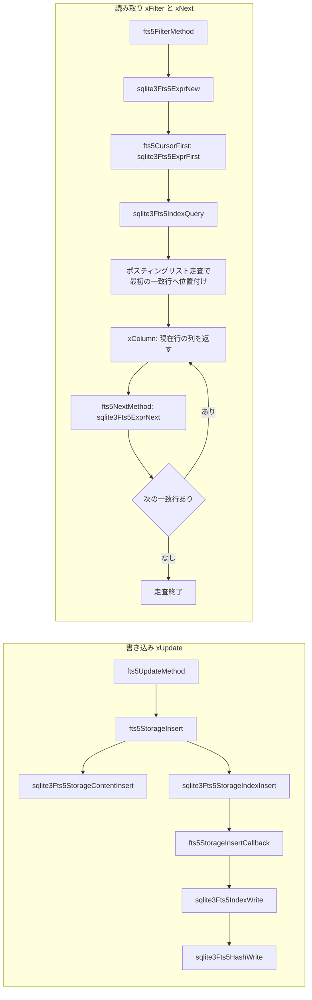

# 第26章 FTS5 全文検索

> **本章で読むソース**
>
> - [src/main.c](https://github.com/sqlite/sqlite/blob/version-3.53.3/src/main.c)
> - [ext/fts5/fts5_main.c](https://github.com/sqlite/sqlite/blob/version-3.53.3/ext/fts5/fts5_main.c)
> - [ext/fts5/fts5_storage.c](https://github.com/sqlite/sqlite/blob/version-3.53.3/ext/fts5/fts5_storage.c)
> - [ext/fts5/fts5_index.c](https://github.com/sqlite/sqlite/blob/version-3.53.3/ext/fts5/fts5_index.c)
> - [ext/fts5/fts5_expr.c](https://github.com/sqlite/sqlite/blob/version-3.53.3/ext/fts5/fts5_expr.c)
> - [ext/fts5/fts5_tokenize.c](https://github.com/sqlite/sqlite/blob/version-3.53.3/ext/fts5/fts5_tokenize.c)

## この章の狙い

第25章では汎用仮想テーブルと JSON 拡張を読んだ。
本章では **FTS5**（Full-Text Search module version 5）が同じ仮想テーブル枠組みの上で全文検索をどう実装するかを追う。
`sqlite3Fts5Init` による組み込み登録から、`xUpdate` 経由の索引書き込みと `xFilter` 経由の MATCH 読み取りを、storage / index / expr / tokenizer の分担で見る。

## 前提

FTS5 テーブルも `CREATE VIRTUAL TABLE ... USING fts5(...)` で定義される仮想テーブルである。
実データは本体テーブル（content= オプションで外部化可能）と、モジュールが管理するシャドウテーブル（`%_data`、`%_idx`、`%_content`、`%_docsize` など）に分かれる。
`ext/fts5/` 以下が実装本体で、アマルガメーションビルドでは `sqlite3.c` に合成される。
`SQLITE_ENABLE_FTS5` は opt-in で、`autosetup/sqlite-config.tcl` の `--fts5` または対応するコンパイル定義を付けたビルドでのみ `main.c` の組み込み拡張配列から `sqlite3Fts5Init` が登録される。
既定の `--all` は0であり、Unix 向け既定ビルドで FTS5 が自動有効になるわけではない。

[autosetup/sqlite-config.tcl L68-L75](https://github.com/sqlite/sqlite/blob/version-3.53.3/autosetup/sqlite-config.tcl#L68-L75)

```tcl
  all-flag-enables {fts4 fts5 rtree geopoly session dbpage dbstat carray}

  #
  # Default value for the --all flag. Can hypothetically be modified
  # by non-canonical builds (it was added for a Tcl extension build
  # mode which was eventually removed).
  #
  all-flag-default 0
```

## sqlite3Fts5Init とモジュール登録

データベース接続を開くと、組み込み拡張の初期化関数が順に呼ばれる。
FTS5 はその配列に `sqlite3Fts5Init` として登録されている。

[src/main.c L57-L63](https://github.com/sqlite/sqlite/blob/version-3.53.3/src/main.c#L57-L63)

```c
static int (*const sqlite3BuiltinExtensions[])(sqlite3*) = {
#ifdef SQLITE_ENABLE_FTS3
  sqlite3Fts3Init,
#endif
#ifdef SQLITE_ENABLE_FTS5
  sqlite3Fts5Init,
#endif
```

[src/main.c L3651-L3654](https://github.com/sqlite/sqlite/blob/version-3.53.3/src/main.c#L3651-L3654)

```c
  /* Load compiled-in extensions */
  for(i=0; rc==SQLITE_OK && i<ArraySize(sqlite3BuiltinExtensions); i++){
    rc = sqlite3BuiltinExtensions[i](db);
  }
```

`fts5Init` は静的 `sqlite3_module fts5Mod` を `sqlite3_create_module_v2` で `"fts5"` 名義登録し、索引、式、トークナイザ、語彙モジュールの各 `Init` を続けて呼ぶ。

[ext/fts5/fts5_main.c L3760-L3786](https://github.com/sqlite/sqlite/blob/version-3.53.3/ext/fts5/fts5_main.c#L3760-L3786)

```c
  static const sqlite3_module fts5Mod = {
    /* iVersion      */ 4,
    /* xCreate       */ fts5CreateMethod,
    /* xConnect      */ fts5ConnectMethod,
    /* xBestIndex    */ fts5BestIndexMethod,
    /* xDisconnect   */ fts5DisconnectMethod,
    /* xDestroy      */ fts5DestroyMethod,
    /* xOpen         */ fts5OpenMethod,
    /* xClose        */ fts5CloseMethod,
    /* xFilter       */ fts5FilterMethod,
    /* xNext         */ fts5NextMethod,
    /* xEof          */ fts5EofMethod,
    /* xColumn       */ fts5ColumnMethod,
    /* xRowid        */ fts5RowidMethod,
    /* xUpdate       */ fts5UpdateMethod,
    /* xBegin        */ fts5BeginMethod,
    /* xSync         */ fts5SyncMethod,
    /* xCommit       */ fts5CommitMethod,
    /* xRollback     */ fts5RollbackMethod,
    /* xFindFunction */ fts5FindFunctionMethod,
    /* xRename       */ fts5RenameMethod,
    /* xSavepoint    */ fts5SavepointMethod,
    /* xRelease      */ fts5ReleaseMethod,
    /* xRollbackTo   */ fts5RollbackToMethod,
    /* xShadowName   */ fts5ShadowName,
    /* xIntegrity    */ fts5IntegrityMethod
  };
```

[ext/fts5/fts5_main.c L3814-L3819](https://github.com/sqlite/sqlite/blob/version-3.53.3/ext/fts5/fts5_main.c#L3814-L3819)

```c
    rc = sqlite3_create_module_v2(db, "fts5", &fts5Mod, p, fts5ModuleDestroy);
    if( rc==SQLITE_OK ) rc = sqlite3Fts5IndexInit(db);
    if( rc==SQLITE_OK ) rc = sqlite3Fts5ExprInit(pGlobal, db);
    if( rc==SQLITE_OK ) rc = sqlite3Fts5AuxInit(&pGlobal->api);
    if( rc==SQLITE_OK ) rc = sqlite3Fts5TokenizerInit(&pGlobal->api);
    if( rc==SQLITE_OK ) rc = sqlite3Fts5VocabInit(pGlobal, db);
```

`Fts5Global` は接続ごとのトークナイザファクトリと `fts5_api` を保持し、カスタムトークナイザ登録 API の入口になる。

## xUpdate から storage への書き込み経路

`fts5UpdateMethod` は仮想テーブルの `xUpdate` 実装であり、DELETE は `nArg==1`、INSERT / UPDATE は旧 rowid、新 rowid、各列値、隠し列を受け取る。
先行削除は `eConflict==SQLITE_REPLACE` かつ新 rowid が整数の場合だけ行われ、通常の INSERT はそのまま `fts5StorageInsert` へ進む。

[ext/fts5/fts5_main.c L2011-L2052](https://github.com/sqlite/sqlite/blob/version-3.53.3/ext/fts5/fts5_main.c#L2011-L2052)

```c
    /* DELETE */
    if( nArg==1 ){
      if( fts5IsContentless(pTab, 1) && pConfig->bContentlessDelete==0 ){
        fts5SetVtabError(pTab, 
            "cannot DELETE from contentless fts5 table: %s", pConfig->zName
        );
        rc = SQLITE_ERROR;
      }else{
        i64 iDel = sqlite3_value_int64(apVal[0]);  /* Rowid to delete */
        rc = sqlite3Fts5StorageDelete(pTab->pStorage, iDel, 0, 0);
      }
    }

    /* INSERT or UPDATE */
    else{
      // ... (中略) ...
      if( eType0!=SQLITE_INTEGER ){
        if( eConflict==SQLITE_REPLACE && eType1==SQLITE_INTEGER ){
          i64 iNew = sqlite3_value_int64(apVal[1]);  /* Rowid to delete */
          rc = sqlite3Fts5StorageDelete(pTab->pStorage, iNew, 0, 0);
        }
        fts5StorageInsert(&rc, pTab, apVal, pRowid);
      }
```

`fts5StorageInsert` は `sqlite3Fts5StorageContentInsert` で本文または rowid を確定し、続けて `sqlite3Fts5StorageIndexInsert` で転置索引へトークンを流し込む二段構成である。
本文の `%_content` 書き込みは `FTS5_CONTENT_NORMAL` または `FTS5_CONTENT_UNINDEXED` の内部 content 構成に限られる。
external-content や contentless では rowid を決めるだけで `%_content` へは書かない。

[ext/fts5/fts5_main.c L1850-L1863](https://github.com/sqlite/sqlite/blob/version-3.53.3/ext/fts5/fts5_main.c#L1850-L1863)

```c
static void fts5StorageInsert(
  int *pRc, 
  Fts5FullTable *pTab, 
  sqlite3_value **apVal, 
  i64 *piRowid
){
  int rc = *pRc;
  if( rc==SQLITE_OK ){
    rc = sqlite3Fts5StorageContentInsert(pTab->pStorage, 0, apVal, piRowid);
  }
  if( rc==SQLITE_OK ){
    rc = sqlite3Fts5StorageIndexInsert(pTab->pStorage, apVal, *piRowid);
  }
  *pRc = rc;
}
```

`sqlite3Fts5StorageIndexInsert` は列ごとに `sqlite3Fts5Tokenize` を呼び、コールバック `fts5StorageInsertCallback` 経由で `sqlite3Fts5IndexWrite` へトークンを送る。
`sqlite3Fts5IndexWrite` は `sqlite3Fts5HashWrite` でメイン索引と prefix 索引へ rowid、列、位置を追記する。
列サイズの varint 列は `columnsize=1` のときだけ `fts5StorageInsertDocsize` が `%_docsize` へ書き、ランキングや整合性チェックで再利用する。

[ext/fts5/fts5_storage.c L447-L463](https://github.com/sqlite/sqlite/blob/version-3.53.3/ext/fts5/fts5_storage.c#L447-L463)

```c
static int fts5StorageInsertCallback(
  void *pContext,                 /* Pointer to Fts5InsertCtx object */
  int tflags,
  const char *pToken,             /* Buffer containing token */
  int nToken,                     /* Size of token in bytes */
  int iUnused1,                   /* Start offset of token */
  int iUnused2                    /* End offset of token */
){
  Fts5InsertCtx *pCtx = (Fts5InsertCtx*)pContext;
  Fts5Index *pIdx = pCtx->pStorage->pIndex;
  UNUSED_PARAM2(iUnused1, iUnused2);
  if( nToken>FTS5_MAX_TOKEN_SIZE ) nToken = FTS5_MAX_TOKEN_SIZE;
  if( (tflags & FTS5_TOKEN_COLOCATED)==0 || pCtx->szCol==0 ){
    pCtx->szCol++;
  }
  return sqlite3Fts5IndexWrite(pIdx, pCtx->iCol, pCtx->szCol-1, pToken, nToken);
}
```

[ext/fts5/fts5_index.c L6980-L7009](https://github.com/sqlite/sqlite/blob/version-3.53.3/ext/fts5/fts5_index.c#L6980-L7009)

```c
int sqlite3Fts5IndexWrite(
  Fts5Index *p,                   /* Index to write to */
  int iCol,                       /* Column token appears in (-ve -> delete) */
  int iPos,                       /* Position of token within column */
  const char *pToken, int nToken  /* Token to add or remove to or from index */
){
  int i;                          /* Used to iterate through indexes */
  int rc = SQLITE_OK;             /* Return code */
  Fts5Config *pConfig = p->pConfig;

  assert( p->rc==SQLITE_OK );
  assert( (iCol<0)==p->bDelete );

  /* Add the entry to the main terms index. */
  rc = sqlite3Fts5HashWrite(
      p->pHash, p->iWriteRowid, iCol, iPos, FTS5_MAIN_PREFIX, pToken, nToken
  );

  for(i=0; i<pConfig->nPrefix && rc==SQLITE_OK; i++){
    const int nChar = pConfig->aPrefix[i];
    int nByte = sqlite3Fts5IndexCharlenToBytelen(pToken, nToken, nChar);
    if( nByte ){
      rc = sqlite3Fts5HashWrite(p->pHash, 
          p->iWriteRowid, iCol, iPos, (char)(FTS5_MAIN_PREFIX+i+1), pToken,
          nByte
      );
    }
  }

  return rc;
}
```

[ext/fts5/fts5_storage.c L653-L685](https://github.com/sqlite/sqlite/blob/version-3.53.3/ext/fts5/fts5_storage.c#L653-L685)

```c
static int fts5StorageInsertDocsize(
  Fts5Storage *p,                 /* Storage module to write to */
  i64 iRowid,                     /* id value */
  Fts5Buffer *pBuf                /* sz value */
){
  int rc = SQLITE_OK;
  if( p->pConfig->bColumnsize ){
    sqlite3_stmt *pReplace = 0;
    rc = fts5StorageGetStmt(p, FTS5_STMT_REPLACE_DOCSIZE, &pReplace, 0);
    // ... (中略) ...
  }
  return rc;
}
```

[ext/fts5/fts5_storage.c L953-L970](https://github.com/sqlite/sqlite/blob/version-3.53.3/ext/fts5/fts5_storage.c#L953-L970)

```c
int sqlite3Fts5StorageContentInsert(
  Fts5Storage *p, 
  int bReplace,                   /* True to use REPLACE instead of INSERT */
  sqlite3_value **apVal, 
  i64 *piRowid
){
  Fts5Config *pConfig = p->pConfig;
  int rc = SQLITE_OK;

  /* Insert the new row into the %_content table. */
  if( pConfig->eContent!=FTS5_CONTENT_NORMAL 
   && pConfig->eContent!=FTS5_CONTENT_UNINDEXED
  ){
    if( sqlite3_value_type(apVal[1])==SQLITE_INTEGER ){
      *piRowid = sqlite3_value_int64(apVal[1]);
    }else{
      rc = fts5StorageNewRowid(p, piRowid);
    }
  }else{
```

[ext/fts5/fts5_storage.c L1048-L1083](https://github.com/sqlite/sqlite/blob/version-3.53.3/ext/fts5/fts5_storage.c#L1048-L1083)

```c
  if( rc==SQLITE_OK ){
    rc = sqlite3Fts5IndexBeginWrite(p->pIndex, 0, iRowid);
  }
  for(ctx.iCol=0; rc==SQLITE_OK && ctx.iCol<pConfig->nCol; ctx.iCol++){
    ctx.szCol = 0;
    if( pConfig->abUnindexed[ctx.iCol]==0 ){
      // ... (中略) ...
      if( rc==SQLITE_OK ){
        sqlite3Fts5SetLocale(pConfig, pLoc, nLoc);
        rc = sqlite3Fts5Tokenize(pConfig, 
            FTS5_TOKENIZE_DOCUMENT, pText, nText, (void*)&ctx,
            fts5StorageInsertCallback
        );
        sqlite3Fts5ClearLocale(pConfig);
      }
    }
    sqlite3Fts5BufferAppendVarint(&rc, &buf, ctx.szCol);
    p->aTotalSize[ctx.iCol] += (i64)ctx.szCol;
  }
```

書き込み経路の要点は、本文ストレージと転置索引の更新を `Fts5Storage` が一括調整し、トークナイザを列ループの内側で呼ぶ点にある。

## トークナイザ層

`sqlite3Fts5TokenizerInit` は `unicode61`、`ascii`、`trigram`、`porter` など組み込みトークナイザを `fts5_api->xCreateTokenizer` で登録する。
`ascii` トークナイザは入力バイト列を走査し、区切り文字を飛ばしてから `xToken` コールバックへ渡す。

[ext/fts5/fts5_tokenize.c L1460-L1467](https://github.com/sqlite/sqlite/blob/version-3.53.3/ext/fts5/fts5_tokenize.c#L1460-L1467)

```c
int sqlite3Fts5TokenizerInit(fts5_api *pApi){
  struct BuiltinTokenizer {
    const char *zName;
    fts5_tokenizer x;
  } aBuiltin[] = {
    { "unicode61", {fts5UnicodeCreate, fts5UnicodeDelete, fts5UnicodeTokenize}},
    { "ascii",     {fts5AsciiCreate, fts5AsciiDelete, fts5AsciiTokenize }},
    { "trigram",   {fts5TriCreate, fts5TriDelete, fts5TriTokenize}},
  };
```

[ext/fts5/fts5_tokenize.c L136-L143](https://github.com/sqlite/sqlite/blob/version-3.53.3/ext/fts5/fts5_tokenize.c#L136-L143)

```c
  while( is<nText && rc==SQLITE_OK ){
    int nByte;

    /* Skip any leading divider characters. */
    while( is<nText && ((pText[is]&0x80)==0 && a[(int)pText[is]]==0) ){
      is++;
    }
    if( is==nText ) break;
```

索引への書き込みとクエリの両方が同じトークナイザ設定（`tokenize=` オプション）を共有するため、検索語と文書語の分割規則が一致する。

## xFilter から expr / index への読み取り経路

`fts5FilterMethod` は `xBestIndex` が選んだ戦略（`idxNum` と `idxStr`）を復号する。
`MATCH` 制約ではクエリ文字列を取り出し、`sqlite3Fts5ExprNew` で構文木を構築してカーソルに保持する。

[ext/fts5/fts5_main.c L1515-L1527](https://github.com/sqlite/sqlite/blob/version-3.53.3/ext/fts5/fts5_main.c#L1515-L1527)

```c
        if( zText[0]=='*' ){
          rc = fts5SpecialMatch(pTab, pCsr, &zText[1]);
          bInternal = 1;
        }else{
          char **pzErr = &pTab->p.base.zErrMsg;
          rc = sqlite3Fts5ExprNew(pConfig, 0, iCol, zText, &pExpr, pzErr);
          if( rc==SQLITE_OK ){
            rc = sqlite3Fts5ExprAnd(&pCsr->pExpr, pExpr);
            pExpr = 0;
          }
        }
```

式が組み上がると、`fts5CursorFirst` が `sqlite3Fts5ExprFirst` で最初のヒット行を配置する。
以降の行移動は `fts5NextMethod` が `sqlite3Fts5ExprNext` を呼ぶ。
各フレーズの語について `sqlite3Fts5IndexQuery` が該当トークンのポスティングリストを開く。

[ext/fts5/fts5_main.c L1136-L1146](https://github.com/sqlite/sqlite/blob/version-3.53.3/ext/fts5/fts5_main.c#L1136-L1146)

```c
static int fts5CursorFirst(Fts5FullTable *pTab, Fts5Cursor *pCsr, int bDesc){
  int rc;
  Fts5Expr *pExpr = pCsr->pExpr;
  rc = sqlite3Fts5ExprFirst(
      pExpr, pTab->p.pIndex, pCsr->iFirstRowid, pCsr->iLastRowid, bDesc
  );
  if( sqlite3Fts5ExprEof(pExpr) ){
    CsrFlagSet(pCsr, FTS5CSR_EOF);
  }
  fts5CsrNewrow(pCsr);
  return rc;
}
```

[ext/fts5/fts5_main.c L991-L1015](https://github.com/sqlite/sqlite/blob/version-3.53.3/ext/fts5/fts5_main.c#L991-L1015)

```c
static int fts5NextMethod(sqlite3_vtab_cursor *pCursor){
  Fts5Cursor *pCsr = (Fts5Cursor*)pCursor;
  int rc;

  // ... (中略) ...

  if( pCsr->ePlan<3 ){
    int bSkip = 0;
    if( (rc = fts5CursorReseek(pCsr, &bSkip)) || bSkip ) return rc;
    rc = sqlite3Fts5ExprNext(pCsr->pExpr, pCsr->iLastRowid);
    CsrFlagSet(pCsr, sqlite3Fts5ExprEof(pCsr->pExpr));
    fts5CsrNewrow(pCsr);
  }else{
```

[ext/fts5/fts5_expr.c L977-L988](https://github.com/sqlite/sqlite/blob/version-3.53.3/ext/fts5/fts5_expr.c#L977-L988)

```c
        for(p=pTerm; p; p=p->pSynonym){
          int rc;
          if( p->pIter ){
            sqlite3Fts5IterClose(p->pIter);
            p->pIter = 0;
          }
          rc = sqlite3Fts5IndexQuery(
              pExpr->pIndex, p->pTerm, p->nQueryTerm,
              (pTerm->bPrefix ? FTS5INDEX_QUERY_PREFIX : 0) |
              (pExpr->bDesc ? FTS5INDEX_QUERY_DESC : 0),
              pNear->pColset,
              &p->pIter
          );
```

`sqlite3Fts5IndexQuery` はトークン（または接頭辞）に対応するセグメントイテレータを選択する。
接頭辞長に応じた prefix 索引があればそちらを使い、無ければメイン索引を複数語でスキャンする。

[ext/fts5/fts5_index.c L7398-L7462](https://github.com/sqlite/sqlite/blob/version-3.53.3/ext/fts5/fts5_index.c#L7398-L7462)

```c
int sqlite3Fts5IndexQuery(
  Fts5Index *p,                   /* FTS index to query */
  const char *pToken, int nToken, /* Token (or prefix) to query for */
  int flags,                      /* Mask of FTS5INDEX_QUERY_X flags */
  Fts5Colset *pColset,            /* Match these columns only */
  Fts5IndexIter **ppIter          /* OUT: New iterator object */
){
  // ... (中略) ...
    if( flags & FTS5INDEX_QUERY_PREFIX ){
      int nChar = fts5IndexCharlen(pToken, nToken);
      for(iIdx=1; iIdx<=pConfig->nPrefix; iIdx++){
        int nIdxChar = pConfig->aPrefix[iIdx-1];
        if( nIdxChar==nChar ) break;
        if( nIdxChar==nChar+1 ) iPrefixIdx = iIdx;
      }
    }

    if( bTokendata && iIdx==0 ){
      buf.p[0] = FTS5_MAIN_PREFIX;
      pRet = fts5SetupTokendataIter(p, buf.p, nToken+1, pColset);
    }else if( iIdx<=pConfig->nPrefix ){
      Fts5Structure *pStruct = fts5StructureRead(p);
      buf.p[0] = (u8)(FTS5_MAIN_PREFIX + iIdx);
      if( pStruct ){
        fts5MultiIterNew(p, pStruct, flags | FTS5INDEX_QUERY_SKIPEMPTY, 
            pColset, buf.p, nToken+1, -1, 0, &pRet
        );
        fts5StructureRelease(pStruct);
      }
```

`MATCH` を含まないクエリは `%_content` への rowid 範囲スキャン（`FTS5_PLAN_SCAN` / `FTS5_PLAN_ROWID`）に落ち、`sqlite3Fts5StorageStmt` で準備済み SQL を実行する。

[ext/fts5/fts5_main.c L1627-L1641](https://github.com/sqlite/sqlite/blob/version-3.53.3/ext/fts5/fts5_main.c#L1627-L1641)

```c
    pCsr->ePlan = (pRowidEq ? FTS5_PLAN_ROWID : FTS5_PLAN_SCAN);
    rc = sqlite3Fts5StorageStmt(
        pTab->pStorage, fts5StmtType(pCsr), &pCsr->pStmt, &pTab->p.base.zErrMsg
    );
    if( rc==SQLITE_OK ){
      if( pRowidEq!=0 ){
        assert( pCsr->ePlan==FTS5_PLAN_ROWID );
        sqlite3_bind_value(pCsr->pStmt, 1, pRowidEq);
      }else{
        sqlite3_bind_int64(pCsr->pStmt, 1, pCsr->iFirstRowid);
        sqlite3_bind_int64(pCsr->pStmt, 2, pCsr->iLastRowid);
      }
      rc = fts5NextMethod(pCursor);
    }
```

## 書き込みと読み取りの処理フロー

FTS5 における DML と MATCH 検索の分担を示す。



## 高速化と最適化の工夫

FTS5 の転置索引はセグメント化され、書き込みはメモリ上のバッファへ追記してからディスクへフラッシュする（詳細は `fts5_index.c` のセグメントマージ）。
`prefix=` オプションで作られる接頭辞索引により、`token*` 型のクエリがメイン索引全体の線形スキャンを避けられる。
`columnsize=1` 時の `%_docsize` BLOB は列ごとのトークン長を varint 圧縮で保持し、BM25 などのランク関数が全文を再トークナイズせずに統計へアクセスできる。
`tokendata=1` ではトークナイザ出力の NUL 以降の付随データを索引語に保持し、`xQueryToken` や `xInstToken` で取得できる。
接頭辞検索では追加の scan が要る場合がある。

## まとめ

FTS5 は `main.c` の組み込み拡張から `sqlite3Fts5Init` が呼ばれ、`fts5` モジュールと関連サブシステムが接続へ載る。
書き込みは `fts5UpdateMethod` が `Fts5Storage` を通じて本文と転置索引を同期更新し、トークナイザがその境界に置かれる。
読み取りは `fts5FilterMethod` が MATCH 式を `Fts5Expr` に変換し、`sqlite3Fts5IndexQuery` がセグメントイテレータを開いて行候補を供給する。

## 関連する章

- [第25章 仮想テーブルと JSON](25-vtab-json.md)（汎用 `sqlite3_module` と VDBE opcode）
- [第9章 クエリプランナ（2）ループ候補とコード生成](../part02-compiler/09-planner-loops-codegen.md)（仮想テーブルの `xBestIndex` 利用）
- [第10章 INSERT / DELETE / UPDATE / UPSERT](../part02-compiler/10-insert-delete-update.md)（通常テーブル DML と対比）
- [第20章 Pager とトランザクション](../part04-storage/20-pager.md)（シャドウテーブルが最終的に通るストレージ層）
