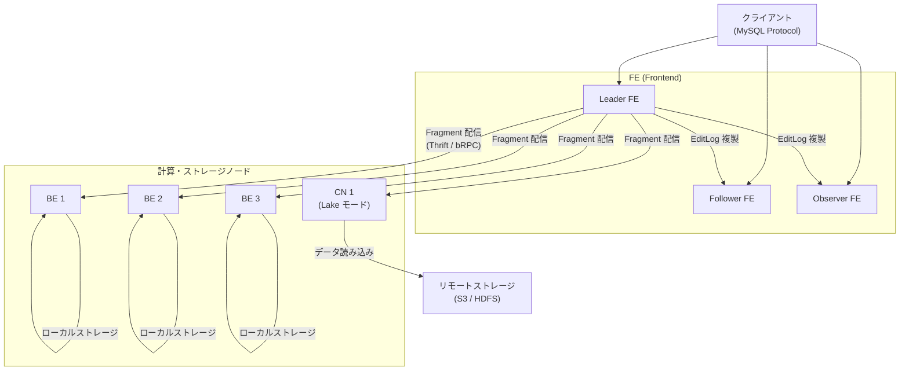
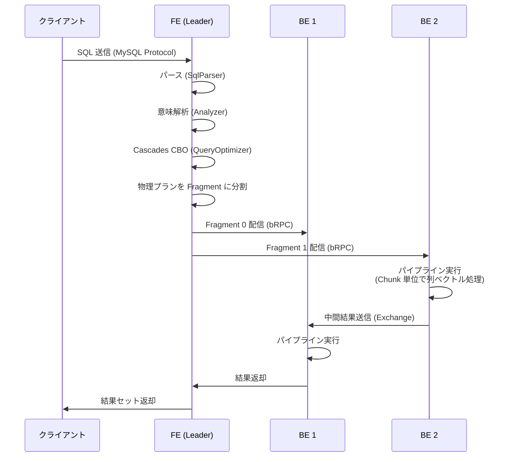

# 第1章 StarRocks とは何か

> **本章で読むソース**
>
> - [`fe/fe-core/src/main/java/com/starrocks/server/GlobalStateMgr.java`](https://github.com/StarRocks/starrocks/blob/4.1.1/fe/fe-core/src/main/java/com/starrocks/server/GlobalStateMgr.java)
> - [`be/src/service/starrocks_main.cpp`](https://github.com/StarRocks/starrocks/blob/4.1.1/be/src/service/starrocks_main.cpp)
> - [`be/src/service/service_be/starrocks_be.cpp`](https://github.com/StarRocks/starrocks/blob/4.1.1/be/src/service/service_be/starrocks_be.cpp)
> - [`be/src/service/service_be/backend_service.h`](https://github.com/StarRocks/starrocks/blob/4.1.1/be/src/service/service_be/backend_service.h)
> - [`gensrc/thrift/FrontendService.thrift`](https://github.com/StarRocks/starrocks/blob/4.1.1/gensrc/thrift/FrontendService.thrift)
> - [`fe/fe-core/src/main/java/com/starrocks/common/Config.java`](https://github.com/StarRocks/starrocks/blob/4.1.1/fe/fe-core/src/main/java/com/starrocks/common/Config.java)

## この章の狙い

StarRocks の全体像を把握する。
FE、BE、CN の役割、クラスタトポロジー、クエリ実行フロー、テーブルモデル、共有データアーキテクチャの概要を、ソースコードの構造と対応づけて理解する。

## 前提

MPP (Massively Parallel Processing) データベースの概念と、列指向ストレージが分析ワークロードに向いている理由を把握していること。
OLAP と OLTP の違いが分かっていれば十分である。

## StarRocks の概要

**StarRocks** は OLAP に特化した MPP データベースである。
Apache Doris (incubating) からフォークして誕生した。
`GlobalStateMgr.java` のライセンスヘッダにその出自が記録されている。

[`fe/fe-core/src/main/java/com/starrocks/server/GlobalStateMgr.java` L15-L16](https://github.com/StarRocks/starrocks/blob/4.1.1/fe/fe-core/src/main/java/com/starrocks/server/GlobalStateMgr.java#L15-L16)

```java
// This file is based on code available under the Apache license here:
//   https://github.com/apache/incubator-doris/blob/master/fe/fe-core/src/main/java/org/apache/doris/catalog/Catalog.java

```

Doris の `Catalog` クラスに相当するものが StarRocks では「GlobalStateMgr」に改名されている。
フォーク後、StarRocks は Cascades ベースの CBO、ベクトル化パイプライン実行エンジン、共有データ (Lake) アーキテクチャなどを独自に開発し、Doris とは別の方向に進化した。

## FE、BE、CN の役割分担

StarRocks のクラスタは3種類のプロセスで構成される。

### FE (Frontend)

**FE** は Java で実装されたプロセスであり、クラスタの「頭脳」に当たる。
SQL の受け付け、パース、Cascades CBO による最適化、メタデータ管理、トランザクション制御を担う。

FE プロセスの中心は `GlobalStateMgr` クラスである。
このクラスはシングルトンとして実装されており、クラスタ全体の状態を保持する。

[`fe/fe-core/src/main/java/com/starrocks/server/GlobalStateMgr.java` L642-L644](https://github.com/StarRocks/starrocks/blob/4.1.1/fe/fe-core/src/main/java/com/starrocks/server/GlobalStateMgr.java#L642-L644)

```java
private static class SingletonHolder {
    private static final GlobalStateMgr INSTANCE = new GlobalStateMgr();
}

```

`GlobalStateMgr` は多数のマネージャーオブジェクトを保持している。
主要なものを以下に示す。

- **NodeMgr**：クラスタ内のノード(FE、BE、CN)を管理する
- **HeartbeatMgr**：各ノードへのハートビートを管理する
- **GlobalTransactionMgr**：トランザクションのライフサイクルを管理する
- **AlterJobMgr**：スキーマ変更やマテリアライズドビュー作成のジョブを管理する
- **LocalMetastore**：テーブルやデータベースのメタデータを管理する
- **StarOSAgent**：共有データモードで StarOS と通信するエージェント

[`fe/fe-core/src/main/java/com/starrocks/server/GlobalStateMgr.java` L311-L312](https://github.com/StarRocks/starrocks/blob/4.1.1/fe/fe-core/src/main/java/com/starrocks/server/GlobalStateMgr.java#L311-L312)

```java
private final NodeMgr nodeMgr;
private final HeartbeatMgr heartbeatMgr;

```

[`fe/fe-core/src/main/java/com/starrocks/server/GlobalStateMgr.java` L397](https://github.com/StarRocks/starrocks/blob/4.1.1/fe/fe-core/src/main/java/com/starrocks/server/GlobalStateMgr.java#L397)

```java
private final GlobalTransactionMgr globalTransactionMgr;

```

[`fe/fe-core/src/main/java/com/starrocks/server/GlobalStateMgr.java` L456](https://github.com/StarRocks/starrocks/blob/4.1.1/fe/fe-core/src/main/java/com/starrocks/server/GlobalStateMgr.java#L456)

```java
private StarOSAgent starOSAgent;

```

`StarOSAgent` のインスタンスは、共有データモードのときだけ生成される。

[`fe/fe-core/src/main/java/com/starrocks/server/GlobalStateMgr.java` L668-L670](https://github.com/StarRocks/starrocks/blob/4.1.1/fe/fe-core/src/main/java/com/starrocks/server/GlobalStateMgr.java#L668-L670)

```java
if (RunMode.isSharedDataMode()) {
    this.starOSAgent = new StarOSAgent();
}

```

### BE (Backend)

**BE** は C++ で実装されたプロセスであり、クラスタの「手足」に当たる。
ベクトル化されたパイプライン実行エンジン、列指向ストレージエンジン、Compaction などのバックグラウンドタスクを実行する。

BE の起動は `starrocks_main.cpp` の `main()` で始まる。
設定ファイルを読み込み、ストレージパスを検証した後、`start_be()` を呼び出す。

[`be/src/service/starrocks_main.cpp` L123-L132](https://github.com/StarRocks/starrocks/blob/4.1.1/be/src/service/starrocks_main.cpp#L123-L132)

```cpp
int main(int argc, char** argv) {
    // Record the TP-relative offset of tls_thread_status as early as possible,
    // ...
    bool as_cn = false;
    // Check if print version or help or cn.
    if (argc > 1) {
        // ...
        } else if (strcmp(argv[1], "--cn") == 0) {
            as_cn = true;
        }
    }

```

`--cn` フラグで起動すると CN モードになる。
BE と CN は同じバイナリであり、起動パラメーターで動作モードが分かれる。

[`be/src/service/starrocks_main.cpp` L271-L272](https://github.com/StarRocks/starrocks/blob/4.1.1/be/src/service/starrocks_main.cpp#L271-L272)

```cpp
// cn need to support all ops for cloudnative table, so just start_be
starrocks::start_be(paths, as_cn);

```

`start_be()` の内部では、以下のサービスが順に起動する。

1. `StorageEngine` の初期化(ストレージエンジン)
2. `ExecEnv` の初期化(実行環境)
3. Thrift サーバー(`BackendService`)の起動
4. bRPC サーバー(`PInternalService`、`LakeService`)の起動
5. HTTP サーバーの起動
6. ハートビートサーバーの起動

[`be/src/service/service_be/starrocks_be.cpp` L85-L92](https://github.com/StarRocks/starrocks/blob/4.1.1/be/src/service/service_be/starrocks_be.cpp#L85-L92)

```cpp
void start_be(const std::vector<StorePath>& paths, bool as_cn) {
    std::string process_name = as_cn ? "CN" : "BE";

    int start_step = 1;

    auto daemon = std::make_unique<Daemon>();
    daemon->init(as_cn, paths);
    LOG(INFO) << process_name << " start step " << start_step++ << ": daemon threads start successfully";

```

`BackendService` は FE からの RPC を受け付けるサービスである。
タスクの受信、スナップショットの作成、Tablet 統計の取得などのメソッドを公開している。

[`be/src/service/service_be/backend_service.h` L45-L65](https://github.com/StarRocks/starrocks/blob/4.1.1/be/src/service/service_be/backend_service.h#L45-L65)

```cpp
class BackendService : public BackendServiceBase {
public:
    explicit BackendService(ExecEnv* exec_env);
    ~BackendService() override;

    void submit_tasks(TAgentResult& return_value, const std::vector<TAgentTaskRequest>& tasks) override;
    void make_snapshot(TAgentResult& return_value, const TSnapshotRequest& snapshot_request) override;
    void release_snapshot(TAgentResult& return_value, const std::string& snapshot_path) override;
    void publish_cluster_state(TAgentResult& result, const TAgentPublishRequest& request) override;
    void get_tablet_stat(TTabletStatResult& result) override;
    // ...
};

```

### CN (Compute Node)

**CN** はステートレスな計算ノードであり、共有データ (Lake) モードで使用する。
前述のとおり、BE と同じバイナリを `--cn` フラグで起動したものである。
CN はローカルにデータを永続化しない。
リモートストレージ (S3、HDFS など) からデータを読み、計算だけを実行して結果を返す。
ワークロードの増減に合わせて CN を追加、削除できるため、計算リソースのスケールアウトが容易になる。

## クラスタトポロジー

StarRocks のクラスタには FE、BE (または CN) が配置される。
FE は複数台で高可用性を構成できる。
FE のノードタイプは `FrontendNodeType` で定義されている。

[`fe/fe-core/src/main/java/com/starrocks/ha/FrontendNodeType.java` L37-L42](https://github.com/StarRocks/starrocks/blob/4.1.1/fe/fe-core/src/main/java/com/starrocks/ha/FrontendNodeType.java#L37-L42)

```java
public enum FrontendNodeType {
    LEADER,
    FOLLOWER,
    OBSERVER,
    INIT,
    UNKNOWN
}

```

各ノードタイプの役割は次のとおりである。

- **Leader FE**：メタデータの書き込みを担う唯一のノード。EditLog を書き込み、他の FE に複製する。
- **Follower FE**：Leader の EditLog を再生してメタデータを同期し、読み取りクエリを処理できる。Leader に障害が発生したとき、Follower の中から新しい Leader が選出される。
- **Observer FE**：EditLog を再生してメタデータを同期するが、Leader 選出には参加しない。読み取りクエリの負荷分散に使う。

以下の図はクラスタの全体構成を示す。



## FE と BE の通信

FE と BE は Thrift RPC で通信する。
FE 側のサービスインターフェースは `FrontendService.thrift` で定義されている。
BE から FE に対して呼ばれる主要な RPC は以下のとおりである。

[`gensrc/thrift/FrontendService.thrift` L2293-L2321](https://github.com/StarRocks/starrocks/blob/4.1.1/gensrc/thrift/FrontendService.thrift#L2293-L2321)

```thrift
service FrontendService {
    TGetDbsResult getDbNames(1:TGetDbsParams params)
    TGetTablesResult getTableNames(1:TGetTablesParams params)
    // ... (中略) ...
    TReportExecStatusResult reportExecStatus(1:TReportExecStatusParams params)
    // ... (中略) ...
    MasterService.TMasterResult finishTask(1:MasterService.TFinishTaskRequest request)
    MasterService.TMasterResult report(1:MasterService.TReportRequest request)
    // ... (中略) ...
    TMasterOpResult forward(TMasterOpRequest params)
}

```

- `reportExecStatus`：BE がクエリ Fragment の実行状況を FE に報告する
- `finishTask`：BE がタスク(Compaction、スキーマ変更など)の完了を FE に通知する
- `report`：BE が Tablet のレプリカ情報を FE に定期報告する
- `forward`：Follower、Observer FE が DDL リクエストを Leader FE に転送する

## クエリ実行の全体フロー

クライアントが SQL を送信してから結果を受け取るまでの流れを示す。



1. クライアントが MySQL プロトコルで SQL を FE に送信する。
2. FE は `SqlParser` で SQL をパースし、AST を生成する。
3. `Analyzer` が意味解析を行い、テーブルや列の参照を解決する。
4. `QueryOptimizer` (Cascades CBO) が論理プランを最適化し、物理プランに変換する。
5. 物理プランを Fragment に分割し、各 BE にbRPC で配信する。
6. 各 BE はパイプライン実行エンジンで Fragment を実行する。データは Chunk 単位でベクトル処理される。
7. BE 間で中間結果を Exchange し、最終結果を FE 経由でクライアントに返す。

## テーブルモデルの概要

StarRocks は4種類のテーブルモデルを提供する。
用途に応じてデータの格納方法と更新ルールが異なる。

- **Duplicate Key**：同一キーの行をすべて保持する。ログやイベントデータのような、重複を許容する追記型ワークロードに向く。
- **Aggregate Key**：同一キーの行を集約関数 (SUM、MAX、MIN、REPLACE など) で自動マージする。事前集計が有効な指標データに向く。
- **Unique Key**：同一キーの行を最新の値で上書きする。実質的には Aggregate Key の REPLACE 集約と同等だが、意味がわかりやすい。
- **Primary Key**：同一キーの行を最新の値で上書きする点は「Unique Key」と同じだが、実装が異なる。Delta Column Group を使い、読み取り時ではなく書き込み時にマージを行う。そのため、リアルタイムの更新と高速な読み取りを両立できる。

## 共有データ (Lake) アーキテクチャと Shared-Nothing の対比

StarRocks は `run_mode` 設定で動作モードを切り替える。

[`fe/fe-core/src/main/java/com/starrocks/common/Config.java` L3065-L3071](https://github.com/StarRocks/starrocks/blob/4.1.1/fe/fe-core/src/main/java/com/starrocks/common/Config.java#L3065-L3071)

```java
/**
 * shared_data: means run on cloud-native
 * shared_nothing: means run on local
 * hybrid: run on both, not production ready, should only be used in test environment now.
 */
@ConfField
public static String run_mode = "shared_nothing";

```

デフォルトは `shared_nothing` であり、従来型のアーキテクチャに相当する。

| 比較項目 | Shared-Nothing | 共有データ (Lake) |
|---------|---------------|-----------------|
| データの格納先 | BE のローカルディスク | リモートストレージ (S3、HDFS など) |
| 計算ノード | BE (ステートフル) | CN (ステートレス) |
| スケーリング | 計算とストレージが一体のため、片方だけの増減が難しい | CN を追加、削除するだけで計算リソースを調整できる |
| コスト | ローカル SSD が必要 | 安価なオブジェクトストレージを利用できる |
| レイテンシー | ローカルディスクアクセスのため低遅延 | リモートアクセスだが、データキャッシュで緩和する |

共有データモードでは、FE が StarOS / StarMgr と連携してリモートストレージ上のデータを管理する。
`GlobalStateMgr` のコンストラクターで `StarOSAgent` が生成されるのは、この連携のためである。

## 高速化の工夫：ベクトル化 Chunk 処理と Cascades CBO の組み合わせ

StarRocks の分析クエリが高速な理由は、「良い実行計画を選ぶ」仕組みと「選ばれた計画を効率よく実行する」仕組みの両方にある。

### Cascades CBO による実行計画の最適化

`QueryOptimizer` は Cascades フレームワークに基づくコストベースオプティマイザーである。
`OptimizerFactory.create()` がクエリの種類に応じてオプティマイザーを選択する。

[`fe/fe-core/src/main/java/com/starrocks/sql/optimizer/OptimizerFactory.java` L57-L64](https://github.com/StarRocks/starrocks/blob/4.1.1/fe/fe-core/src/main/java/com/starrocks/sql/optimizer/OptimizerFactory.java#L57-L64)

```java
public static Optimizer create(OptimizerContext context) {
    if (context.getOptimizerOptions().isShortCircuit()) {
        return new ShortCircuitOptimizer(context);
    } else if (context.getOptimizerOptions().isBaselinePlan()) {
        return new SPMOptimizer(context);
    }
    return new QueryOptimizer(context);
}

```

通常のクエリでは `QueryOptimizer` が使われる。
Cascades フレームワークは、論理的に等価な複数の実行計画を Memo と呼ばれるデータ構造に格納し、コストモデルに基づいて最も安い計画を選択する。
Join の順序、集約の方式、データの分散方法など、組み合わせ爆発しやすい選択肢の探索空間を効率よく枝刈りできる。

最適化タスクは `TaskScheduler` がスタックベースで駆動する。

[`fe/fe-core/src/main/java/com/starrocks/sql/optimizer/task/TaskScheduler.java` L37-L46](https://github.com/StarRocks/starrocks/blob/4.1.1/fe/fe-core/src/main/java/com/starrocks/sql/optimizer/task/TaskScheduler.java#L37-L46)

```java
public void executeTasks(TaskContext context) {
    while (!tasks.empty()) {
        context.getOptimizerContext().checkTimeout();
        OptimizerTask task = tasks.pop();
        context.getOptimizerContext().setTaskContext(context);
        try (Timer ignore = Tracers.watchScope(Tracers.Module.OPTIMIZER, task.getClass().getSimpleName())) {
            task.execute();
        }
    }
}

```

### ベクトル化 Chunk 単位処理

BE のパイプライン実行エンジンは、データを行単位ではなく Chunk 単位で処理する。
`Chunk` は複数の列ベクトル (`Columns`) を束ねたデータ構造である。

[`be/src/column/chunk.h` L57-L68](https://github.com/StarRocks/starrocks/blob/4.1.1/be/src/column/chunk.h#L57-L68)

```cpp
class Chunk {
public:
    enum RESERVED_COLUMN_SLOT_ID {
        HASH_JOIN_SPILL_HASH_SLOT_ID = -1,
        SORT_ORDINAL_COLUMN_SLOT_ID = -2,
        HASH_JOIN_BUILD_INDEX_SLOT_ID = -3,
        HASH_JOIN_PROBE_INDEX_SLOT_ID = -4,
        HASH_AGG_SPILL_HASH_SLOT_ID = -5
    };

    using ChunkPtr = std::shared_ptr<Chunk>;
    using SlotHashMap = phmap::flat_hash_map<SlotId, size_t, StdHash<SlotId>>;

```

1つの Chunk には通常 4096 行分のデータが格納される。
各列はメモリ上で連続した配列として保持されるため、CPU キャッシュの局所性が高い。
SIMD 命令による一括演算とも相性がよく、行単位の処理と比較して演算スループットが大幅に向上する。

この2つの仕組みが組み合わさることで、CBO が選んだ最適な実行計画を、ベクトル化エンジンが高いスループットで実行する。
計画の質と実行の効率の両方を押さえている点が、StarRocks の分析クエリ性能の土台である。

## まとめ

StarRocks は FE (Java)、BE / CN (C++) の2層アーキテクチャで構成される OLAP データベースである。
FE は Cascades CBO で最適な実行計画を生成し、BE はベクトル化パイプラインエンジンで Chunk 単位の列ベクトル処理を行う。
`run_mode` 設定により Shared-Nothing と共有データ (Lake) の2つのアーキテクチャを切り替えられる。
4種類のテーブルモデル (Duplicate Key、Aggregate Key、Unique Key、Primary Key) を用途に応じて使い分ける。

## 関連する章

- 第2章以降で、FE の SQL パースと Cascades CBO の詳細を扱う。
- BE のパイプライン実行エンジンとベクトル化処理は、実行エンジンの章で掘り下げる。
- ストレージエンジン (Rowset、Segment、列指向フォーマット) は、ストレージの章で扱う。
- 共有データモードの StarOS / StarMgr 連携は、Lake アーキテクチャの章で扱う。
