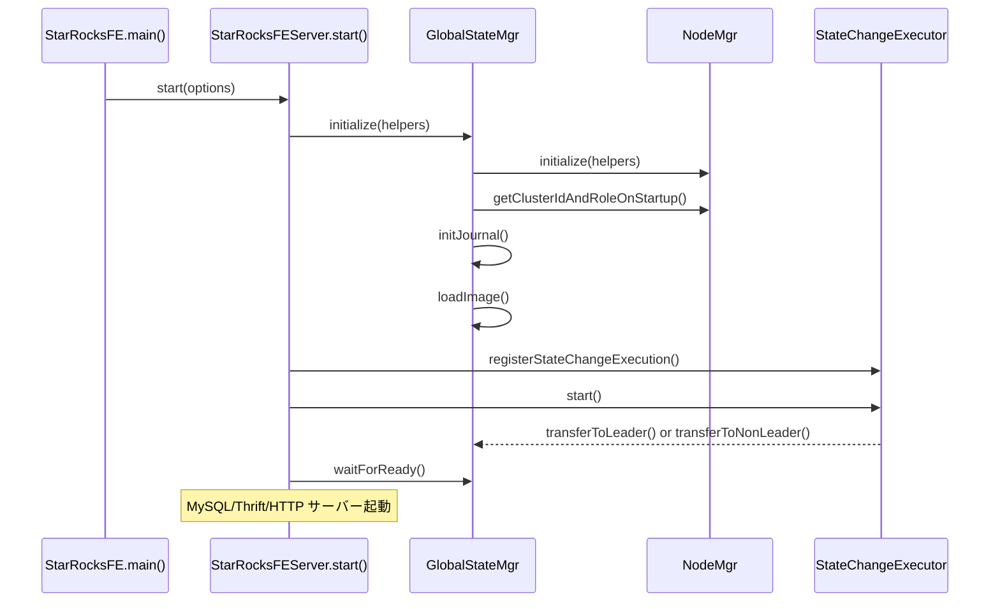
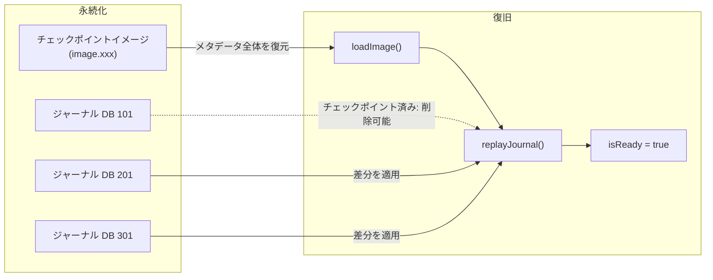
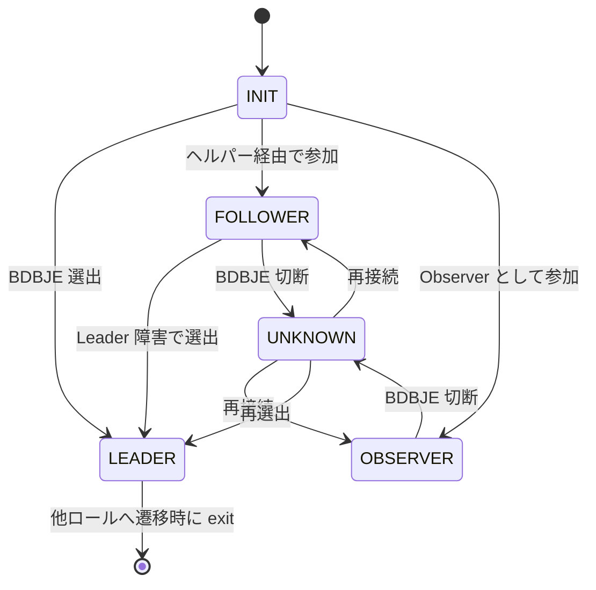
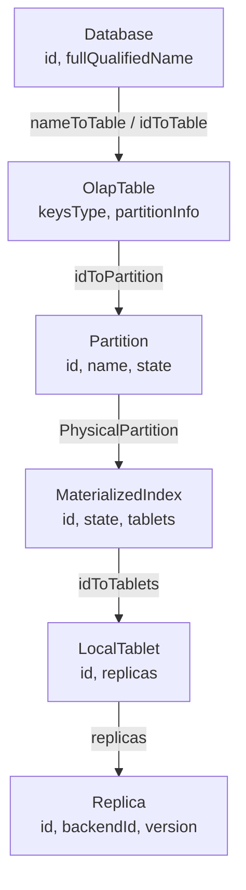

# 第2章 FE の起動とメタデータ管理

> **本章で読むソース**
>
> - [`fe/fe-server/src/main/java/com/starrocks/StarRocksFE.java`](https://github.com/StarRocks/starrocks/blob/4.1.1/fe/fe-server/src/main/java/com/starrocks/StarRocksFE.java)
> - [`fe/fe-core/src/main/java/com/starrocks/StarRocksFEServer.java`](https://github.com/StarRocks/starrocks/blob/4.1.1/fe/fe-core/src/main/java/com/starrocks/StarRocksFEServer.java)
> - [`fe/fe-core/src/main/java/com/starrocks/server/GlobalStateMgr.java`](https://github.com/StarRocks/starrocks/blob/4.1.1/fe/fe-core/src/main/java/com/starrocks/server/GlobalStateMgr.java)
> - [`fe/fe-core/src/main/java/com/starrocks/server/NodeMgr.java`](https://github.com/StarRocks/starrocks/blob/4.1.1/fe/fe-core/src/main/java/com/starrocks/server/NodeMgr.java)
> - [`fe/fe-core/src/main/java/com/starrocks/journal/bdbje/BDBJEJournal.java`](https://github.com/StarRocks/starrocks/blob/4.1.1/fe/fe-core/src/main/java/com/starrocks/journal/bdbje/BDBJEJournal.java)
> - [`fe/fe-core/src/main/java/com/starrocks/ha/BDBHA.java`](https://github.com/StarRocks/starrocks/blob/4.1.1/fe/fe-core/src/main/java/com/starrocks/ha/BDBHA.java)
> - [`fe/fe-core/src/main/java/com/starrocks/persist/EditLog.java`](https://github.com/StarRocks/starrocks/blob/4.1.1/fe/fe-core/src/main/java/com/starrocks/persist/EditLog.java)
> - [`fe/fe-core/src/main/java/com/starrocks/server/MetadataMgr.java`](https://github.com/StarRocks/starrocks/blob/4.1.1/fe/fe-core/src/main/java/com/starrocks/server/MetadataMgr.java)
> - [`fe/fe-core/src/main/java/com/starrocks/catalog/Database.java`](https://github.com/StarRocks/starrocks/blob/4.1.1/fe/fe-core/src/main/java/com/starrocks/catalog/Database.java)
> - [`fe/fe-core/src/main/java/com/starrocks/catalog/OlapTable.java`](https://github.com/StarRocks/starrocks/blob/4.1.1/fe/fe-core/src/main/java/com/starrocks/catalog/OlapTable.java)

## この章の狙い

FE プロセスが起動してからクエリを受け付けられる状態になるまでの道筋を追い、メタデータがどのように永続化され、複数 FE ノード間でどう同期されるかを理解する。
あわせて、メタデータの階層構造と、内部カタログと外部カタログを統合的に扱う MetadataMgr の役割を確認する。

## 前提

第1章で述べた通り、StarRocks の FE は Java で実装されたフロントエンドプロセスである。
FE は SQL 解析、クエリ最適化、メタデータ管理を担い、複数ノードで HA 構成を取る。
メタデータの永続化には **BDBJE**（Berkeley DB Java Edition）が使われる。
BDBJE はレプリケーショングループによる合意ベースの書き込みを提供するため、FE の HA 基盤としても機能する。

## FE の起動シーケンス

### エントリポイント

FE プロセスのエントリポイントは `StarRocksFE.main()` である。
コマンドライン引数を解析し、`StarRocksFEServer.start()` を呼び出す。

[`fe/fe-server/src/main/java/com/starrocks/StarRocksFE.java` L27-L29](https://github.com/StarRocks/starrocks/blob/4.1.1/fe/fe-server/src/main/java/com/starrocks/StarRocksFE.java#L27-L29)

```java
public static void main(String[] args) {
    CommandLineOptions options = parseArgs(args);
    StarRocksFEServer.start(options);
}

```

### StarRocksFEServer.start() の全体構成

`StarRocksFEServer.start()` は FE の起動処理全体を制御する。
処理の流れは次の通りである。

1. PID ファイルのロック取得と設定ファイルの読み込み
2. `GlobalStateMgr.getCurrentState().initialize()` によるメタデータ初期化
3. `StateChangeExecutor` の起動（HA 状態遷移の監視）
4. `GlobalStateMgr.getCurrentState().waitForReady()` によるメタデータ復旧完了の待機
5. MySQL プロトコルサーバー、Thrift サーバー、HTTP サーバー、Arrow Flight SQL サーバーの起動

[`fe/fe-core/src/main/java/com/starrocks/StarRocksFEServer.java` L134-L157](https://github.com/StarRocks/starrocks/blob/4.1.1/fe/fe-core/src/main/java/com/starrocks/StarRocksFEServer.java#L134-L157)

```java
// init globalStateMgr
GlobalStateMgr.getCurrentState().initialize(cmdLineOpts.getHelpers());

// ... (中略) ...

StateChangeExecutor.getInstance().registerStateChangeExecution(
        GlobalStateMgr.getCurrentState().getStateChangeExecution());
// start state change executor
StateChangeExecutor.getInstance().start();

// wait globalStateMgr to be ready
GlobalStateMgr.getCurrentState().waitForReady();

```

各種サーバーが起動した後、FE はメインスレッドで `while (!stopped)` ループに入り、シャットダウンシグナルを待つ。

### GlobalStateMgr.initialize()

`GlobalStateMgr.initialize()` はメタデータの初期化と復旧を行う。

[`fe/fe-core/src/main/java/com/starrocks/server/GlobalStateMgr.java` L1185-L1240](https://github.com/StarRocks/starrocks/blob/4.1.1/fe/fe-core/src/main/java/com/starrocks/server/GlobalStateMgr.java#L1185-L1240)

```java
public void initialize(String helpers) throws Exception {
    boolean isFirstTimeStart = nodeMgr.isVersionAndRoleFilesNotExist();
    try {
        // 0. get local node and helper node info
        nodeMgr.initialize(helpers);

        // 1. create dirs and files
        // ... (中略) ...

        // 2. get cluster id and role (Observer or Follower)
        nodeMgr.getClusterIdAndRoleOnStartup();

        // 3. Load image first and replay edits
        initJournal();
        loadImage(); // load image file

        // 4. create load and export job label cleaner thread
        createLabelCleaner();

        // 5. create txn timeout checker thread
        createTxnTimeoutChecker();

        // 6. start task cleaner thread
        createTaskCleaner();
        createTableKeeper();
    } catch (Exception e) {
        // ... (中略) ...
    }
}

```

処理の要点は次の3つである。

- **NodeMgr による自ノードの認識**：`nodeMgr.initialize()` でヘルパーノード情報を取得し、`getClusterIdAndRoleOnStartup()` でクラスター ID とロール（Follower / Observer）を決定する
- **ジャーナルの初期化**：`initJournal()` で BDBJE ベースのジャーナルを開き、`EditLog` と `JournalWriter` を生成する
- **イメージのロードとジャーナルのリプレイ**：`loadImage()` でチェックポイントイメージからメタデータを復元する（リプレイは状態遷移後に行われる）

初回起動時に `initialize()` が途中で失敗した場合、`ROLE` ファイルと `VERSION` ファイルを削除して中途半端な状態を残さないようにする。



## GlobalStateMgr の構造

**GlobalStateMgr** は FE のメタデータ管理の中核であり、シングルトンとして動作する。
内部に数十のマネージャーを保持し、メタデータのライフサイクル全体を管理する。

[`fe/fe-core/src/main/java/com/starrocks/server/GlobalStateMgr.java` L290-L310](https://github.com/StarRocks/starrocks/blob/4.1.1/fe/fe-core/src/main/java/com/starrocks/server/GlobalStateMgr.java#L290-L310)

```java
public class GlobalStateMgr {
    // ...
    private final NodeMgr nodeMgr;
    private final HeartbeatMgr heartbeatMgr;
    private final AlterJobMgr alterJobMgr;
    // ...
}

```

主要なマネージャー群は次のように分類できる。

- **ノード管理**：`NodeMgr`（FE/BE/CN の管理）、`HeartbeatMgr`（ハートビート監視）
- **メタデータストア**：`LocalMetastore`（内部カタログの DB/テーブル管理）、`CatalogMgr`（カタログ管理）、`MetadataMgr`（内部/外部メタデータの統合アクセス）
- **トランザクション**：`GlobalTransactionMgr`
- **ジョブ管理**：`AlterJobMgr`（スキーマ変更）、`LoadMgr`（データロード）、`RoutineLoadMgr`、`StreamLoadMgr`、`ExportMgr`
- **スケジューリング**：`TabletScheduler`（Tablet の配置修復）、`TabletChecker`（健全性チェック）、`DynamicPartitionScheduler`
- **永続化**：`EditLog`（変更ログ）、`Journal`（ジャーナルストレージ）、`JournalWriter`（書き込みスレッド）
- **認証と認可**：`AuthenticationMgr`、`AuthorizationMgr`
- **統計情報**：`AnalyzeMgr`、`StatisticAutoCollector`
- **Lake モード**：`StarOSAgent`、`CompactionMgr`、`StorageVolumeMgr`

## メタデータの永続化

FE のメタデータはすべてインメモリで保持される。
永続化の仕組みは「EditLog（ジャーナル）」と「チェックポイントイメージ」の組み合わせであり、考え方は HDFS の NameNode と共通する。

### EditLog によるジャーナル書き込み

Leader FE でメタデータを変更する操作（テーブル作成、スキーマ変更など）が発生すると、`EditLog.logEdit()` が呼ばれる。
この関数は変更内容をシリアライズして `JournalTask` を生成し、`journalQueue` に投入する。
`JournalWriter` スレッドがキューからタスクを取り出し、BDBJE に書き込む。

[`fe/fe-core/src/main/java/com/starrocks/persist/EditLog.java` L1368-L1371](https://github.com/StarRocks/starrocks/blob/4.1.1/fe/fe-core/src/main/java/com/starrocks/persist/EditLog.java#L1368-L1371)

```java
public void logEdit(short op, Writable writable) {
    JournalTask task = submitLog(op, writable, -1);
    waitInfinity(task);
}

```

`submitLog()` はオペレーションコード（`short op`）と `Writable` データをバイト列に変換して `JournalTask` を作る。
Leader 以外のノードからの書き込みは `Preconditions.checkState` で拒否される。

[`fe/fe-core/src/main/java/com/starrocks/persist/EditLog.java` L1404-L1424](https://github.com/StarRocks/starrocks/blob/4.1.1/fe/fe-core/src/main/java/com/starrocks/persist/EditLog.java#L1404-L1424)

```java
private JournalTask submitLog(short op, Writable writable, long maxWaitIntervalMs) {
    // ... (中略) ...
    Preconditions.checkState(op == OperationType.OP_STARMGR || GlobalStateMgr.getCurrentState().isLeader(),
            "Current node is not leader, but " +
                    GlobalStateMgr.getCurrentState().getFeType() + ", submit log is not allowed");
    DataOutputBuffer buffer = new DataOutputBuffer(OUTPUT_BUFFER_INIT_SIZE);
    // 1. serialized
    try {
        buffer.writeShort(op);
        writable.write(buffer);
    } catch (IOException | JsonParseException e) {
        // ...
    }
    JournalTask task = new JournalTask(startTimeNano, buffer, maxWaitIntervalMs);
    // 2. put to queue
    // ...
    this.journalQueue.put(task);
    // ...
}

```

### BDBJEJournal の構造

ジャーナルの実体は **BDBJEJournal** である。
BDBJE のデータベースをジャーナル ID 範囲ごとに分割して管理する。
各データベースは、含まれるジャーナルの最小 ID で命名される（例：ジャーナル 100～200 を含むデータベースの名前は `100`）。

[`fe/fe-core/src/main/java/com/starrocks/journal/bdbje/BDBJEJournal.java` L100-L132](https://github.com/StarRocks/starrocks/blob/4.1.1/fe/fe-core/src/main/java/com/starrocks/journal/bdbje/BDBJEJournal.java#L100-L132)

```java
/*
 * Database is named by its minimum journal id.
 * For example:
 * One database contains journal 100 to journal 200, its name is 100.
 * The next database's name is 201
 */
@Override
public void rollJournal(long newName) throws JournalException {
    // Doesn't need to roll if current database contains no journals
    if (currentJournalDB.getDb().count() == 0) {
        return;
    }
    // ... (中略) ...
    String newDbName = getFullDatabaseName(newName);
    LOG.info("roll edit log. new db name is {}", newDbName);
    currentJournalDB.close();
    currentJournalDB = bdbEnvironment.openDatabase(newDbName);
    // ...
}

```

チェックポイント完了時に `rollJournal()` が呼ばれ、新しいデータベースが作られる。
古いデータベースはチェックポイントイメージに含まれるため、`deleteJournals()` で安全に削除できる。

### チェックポイントイメージ

チェックポイントは、ある時点のメタデータ全体をファイルに書き出す操作である。
`GlobalStateMgr.saveImage()` がチェックポイントスレッドから呼ばれ、全マネージャーの `save()` を順に呼び出す。

[`fe/fe-core/src/main/java/com/starrocks/server/GlobalStateMgr.java` L1850-L1915](https://github.com/StarRocks/starrocks/blob/4.1.1/fe/fe-core/src/main/java/com/starrocks/server/GlobalStateMgr.java#L1850-L1915)

```java
public void saveImage(ImageWriter imageWriter, File curFile) throws IOException {
    // ...
    long saveImageStartTime = System.currentTimeMillis();
    try (FileOutputStream outputStream = new FileOutputStream(curFile)) {
        imageWriter.setOutputStream(outputStream);
        try {
            saveHeader(imageWriter.getDataOutputStream());
            nodeMgr.save(imageWriter);
            localMetastore.save(imageWriter);
            alterJobMgr.save(imageWriter);
            recycleBin.save(imageWriter);
            // ... (中略: 30以上のマネージャーの save()) ...
        } catch (SRMetaBlockException e) {
            // ...
        }
        imageWriter.getDataOutputStream().flush();
        outputStream.getChannel().force(true);
        imageWriter.saveChecksum();
    }
}

```

起動時には `loadImage()` で逆順にデータを復元する。
各マネージャーが `SRMetaBlockID` で識別されるブロックに分割して保存されるため、バージョンアップで新しいマネージャーが増えても、古いイメージは未知のブロックをスキップして読み込める。

[`fe/fe-core/src/main/java/com/starrocks/server/GlobalStateMgr.java` L1628-L1666](https://github.com/StarRocks/starrocks/blob/4.1.1/fe/fe-core/src/main/java/com/starrocks/server/GlobalStateMgr.java#L1628-L1666)

```java
Map<SRMetaBlockID, SRMetaBlockLoader> loadImages = ImmutableMap.<SRMetaBlockID, SRMetaBlockLoader>builder()
        .put(SRMetaBlockID.NODE_MGR, nodeMgr::load)
        .put(SRMetaBlockID.LOCAL_META_STORE, localMetastore::load)
        .put(SRMetaBlockID.ALTER_MGR, alterJobMgr::load)
        // ... (中略: 30以上のエントリ) ...
        .build();

```



### 高速化の工夫: EditLog とチェックポイントの組み合わせ

メタデータの永続化と復旧において、EditLog とチェックポイントの組み合わせは復旧時間の短縮に直結する。

チェックポイントがなければ、FE は起動時にすべてのジャーナルを先頭からリプレイしなければならない。
ジャーナルは追記専用であるため、運用期間が長くなるほどリプレイ量が増大する。
チェックポイントは「ある時点の全メタデータのスナップショット」を保存することで、それ以前のジャーナルを不要にする。

起動時の復旧手順は2段階になる。

1. チェックポイントイメージをロードする（`loadImage()`）
2. イメージ作成時点以降のジャーナルだけをリプレイする（`replayJournal()`）

リプレイにはフロー制御も組み込まれている。
Follower/Observer の `replayer` スレッドは、1ループあたり最大 1 秒または 10 万件でリプレイを区切り、他のスレッドに制御を返す。

[`fe/fe-core/src/main/java/com/starrocks/server/GlobalStateMgr.java` L296-L298](https://github.com/StarRocks/starrocks/blob/4.1.1/fe/fe-core/src/main/java/com/starrocks/server/GlobalStateMgr.java#L296-L298)

```java
private static final long REPLAYER_MAX_MS_PER_LOOP = 1000L;
private static final long REPLAYER_MAX_LOGS_PER_LOOP = 100000L;

```

ジャーナルの削除も自動化されている。
チェックポイントが成功するたびに `rollJournal()` で新しいデータベースが作られ、`deleteJournals()` でチェックポイント以前のデータベースが削除される。
この仕組みにより、ジャーナルのディスク使用量は一定の範囲に収まる。

## FE HA

FE は BDBJE のレプリケーション機能を利用して、複数ノードの HA を実現する。
3つのロールが存在する。

- **Leader**：唯一の書き込みノード。メタデータの変更を `EditLog` でジャーナルに書き、BDBJE が Follower に複製する
- **Follower**：選挙に参加するノード。Leader からジャーナルを受信してリプレイし、読み取りリクエストに応答する。Leader が停止すると、Follower 間で新しい Leader を選出する
- **Observer**：選挙に参加しないノード。ジャーナルをリプレイして読み取りに応答するが、Leader 選出の投票権を持たない。読み取りスケーラビリティのために追加する

### 状態遷移

FE の状態遷移は **StateChangeExecutor** が制御する。
BDBJE がレプリケーショングループの状態変化を検知すると、`StateChangeExecutor.notifyNewFETypeTransfer()` が呼ばれ、キューに新しいロールが積まれる。
StateChangeExecutor スレッドがキューからロールを取り出し、登録済みの `StateChangeExecution` の `transferToLeader()` または `transferToNonLeader()` を呼び出す。

[`fe/fe-core/src/main/java/com/starrocks/ha/StateChangeExecutor.java` L91-L106](https://github.com/StarRocks/starrocks/blob/4.1.1/fe/fe-core/src/main/java/com/starrocks/ha/StateChangeExecutor.java#L91-L106)

```java
/*
 * INIT -> LEADER: transferToLeader
 * INIT -> FOLLOWER/OBSERVER: transferToNonLeader
 * UNKNOWN -> LEADER: transferToLeader
 * UNKNOWN -> FOLLOWER/OBSERVER: transferToNonLeader
 * FOLLOWER -> LEADER: transferToLeader
 * FOLLOWER/OBSERVER -> INIT/UNKNOWN: set isReady to false
 */
switch (feType) {
    case INIT: {
        switch (newType) {
            case LEADER: {
                for (StateChangeExecution execution : executions) {
                    execution.transferToLeader();
                }
                break;
            }
            // ...
        }
    }
    // ...
}

```

Leader から他のロールへ遷移した場合、プロセスは `System.exit(-1)` で終了する。
Leader の地位を失ったノードが中途半端な状態で動き続けることを防ぐためである。

### transferToLeader()

Leader に選出されたノードは `GlobalStateMgr.transferToLeader()` で次の処理を行う。

[`fe/fe-core/src/main/java/com/starrocks/server/GlobalStateMgr.java` L1292-L1392](https://github.com/StarRocks/starrocks/blob/4.1.1/fe/fe-core/src/main/java/com/starrocks/server/GlobalStateMgr.java#L1292-L1392)

```java
private void transferToLeader() {
    // stop replayer
    if (replayer != null) {
        replayer.setStop();
        // ...
        replayer = null;
    }
    // ...
    // setup for journal
    try {
        journal.open();
        if (!haProtocol.fencing()) {
            throw new Exception("fencing failed. will exit");
        }
        long maxJournalId = journal.getMaxJournalId();
        replayJournal(maxJournalId);
        nodeMgr.checkCurrentNodeExist();
        journalWriter.init(maxJournalId);
    } catch (Exception e) {
        LOG.error("failed to init journal after transfer to leader! will exit", e);
        System.exit(-1);
    }

    journalWriter.startDaemon();
    feType = FrontendNodeType.LEADER;
    // ...
    startLeaderOnlyDaemonThreads();
    startAllNodeTypeDaemonThreads();
    // ...
    isReady.set(true);
}

```

1. `replayer` スレッドを停止する（Leader はジャーナルを書く側であり、読む側ではないため）
2. ジャーナルを開き、`fencing()` でエポックを更新する（旧 Leader の書き込みを無効化する）
3. 未リプレイのジャーナルをすべてリプレイする
4. `JournalWriter` を起動する
5. Leader 専用のデーモンスレッド群を起動する
6. `isReady` を `true` に設定する

### fencing とエポック

`BDBHA.fencing()` は、新しい Leader が旧 Leader の書き込みを確実に無効化するために、エポック番号をインクリメントして BDBJE に書き込む。

[`fe/fe-core/src/main/java/com/starrocks/ha/BDBHA.java` L87-L117](https://github.com/StarRocks/starrocks/blob/4.1.1/fe/fe-core/src/main/java/com/starrocks/ha/BDBHA.java#L87-L117)

```java
@Override
public boolean fencing() {
    CloseSafeDatabase epochDb = environment.getEpochDB();
    for (int i = 0; i < RETRY_TIME; i++) {
        try {
            long myEpoch = getLatestEpoch() + 1;
            LOG.info("start fencing, epoch number is {}", myEpoch);
            Long key = myEpoch;
            DatabaseEntry theKey = new DatabaseEntry();
            TupleBinding<Long> idBinding = TupleBinding.getPrimitiveBinding(Long.class);
            idBinding.objectToEntry(key, theKey);
            DatabaseEntry theData = new DatabaseEntry(new byte[1]);
            OperationStatus status = epochDb.putNoOverwrite(null, theKey, theData);
            if (status == OperationStatus.SUCCESS) {
                return true;
            } else if (status == OperationStatus.KEYEXIST) {
                return false;
            }
            // ...
        } catch (Exception e) {
            // ...
        }
    }
    return false;
}

```

`putNoOverwrite` を使うことで、同じエポック番号を2つの Leader が同時に書き込もうとした場合、先に書き込んだ方だけが成功する。
これにより、スプリットブレイン時に2つの Leader が同時に有効になることを防ぐ。

### transferToNonLeader()

Follower または Observer として動作するノードは `transferToNonLeader()` で `replayer` スレッドを起動し、Leader からジャーナルを読み取ってリプレイする。

[`fe/fe-core/src/main/java/com/starrocks/server/GlobalStateMgr.java` L1582-L1611](https://github.com/StarRocks/starrocks/blob/4.1.1/fe/fe-core/src/main/java/com/starrocks/server/GlobalStateMgr.java#L1582-L1611)

```java
private void transferToNonLeader(FrontendNodeType newType) {
    isReady.set(false);
    // ...
    // transfer from INIT/UNKNOWN to OBSERVER/FOLLOWER
    if (replayer == null) {
        createReplayer();
        replayer.start();
    }
    startAllNodeTypeDaemonThreads();
    MetricRepo.init();
    feType = newType;
}

```

`replayer` スレッドは 1ms 間隔でジャーナルを読み、`editLog.loadJournal()` を通じてメタデータの変更を自ノードのインメモリ状態に反映する。
メタデータの同期が `meta_delay_toleration_second`（デフォルト 300 秒）以内であれば `canRead` が `true` に設定され、読み取りリクエストに応答できるようになる。



## メタデータ階層

StarRocks のメタデータは階層的に構成される。
最上位の Database から最下位の Replica まで、5つの階層がある。

### Database

**Database** はテーブルの名前空間であり、`id` と `fullQualifiedName` で識別される。
テーブルを `nameToTable`（名前 → テーブル）と `idToTable`（ID → テーブル）の2つの `ConcurrentHashMap` で保持する。

[`fe/fe-core/src/main/java/com/starrocks/catalog/Database.java` L91-L111](https://github.com/StarRocks/starrocks/blob/4.1.1/fe/fe-core/src/main/java/com/starrocks/catalog/Database.java#L91-L111)

```java
public class Database extends MetaObject implements Writable {
    @SerializedName(value = "i")
    private long id;
    @SerializedName(value = "n")
    private String fullQualifiedName;
    // ...
    private final Map<String, Table> nameToTable;
    private final Map<Long, Table> idToTable;
    // ...
}

```

### OlapTable

**OlapTable** は StarRocks の OLAP テーブルを表し、`Table` を継承する。
テーブルモデル（Duplicate Key、Aggregate Key、Unique Key、Primary Key）を `keysType` で保持し、パーティション情報を `idToPartition` で管理する。

[`fe/fe-core/src/main/java/com/starrocks/catalog/OlapTable.java` L174-L231](https://github.com/StarRocks/starrocks/blob/4.1.1/fe/fe-core/src/main/java/com/starrocks/catalog/OlapTable.java#L174-L231)

```java
public class OlapTable extends Table {
    protected OlapTableState state;
    protected Map<Long, MaterializedIndexMeta> indexMetaIdToMeta = Maps.newHashMap();
    protected Map<String, Long> indexNameToMetaId = Maps.newHashMap();
    protected KeysType keysType;
    protected PartitionInfo partitionInfo;
    protected Map<Long, Partition> idToPartition = new HashMap<>();
    protected Map<String, Partition> nameToPartition = Maps.newTreeMap(String.CASE_INSENSITIVE_ORDER);
    protected DistributionInfo defaultDistributionInfo;
    // ...
}

```

### Partition、MaterializedIndex、Tablet、Replica

**Partition** は OlapTable のデータ分割単位であり、パーティションキーに基づく Range パーティションまたは List パーティションに対応する。
各 Partition は `PhysicalPartition` を持ち、その中に **MaterializedIndex** がある。
MaterializedIndex はベーステーブルのインデックス、またはロールアップインデックスに対応する。

[`fe/fe-core/src/main/java/com/starrocks/catalog/Partition.java` L56-L82](https://github.com/StarRocks/starrocks/blob/4.1.1/fe/fe-core/src/main/java/com/starrocks/catalog/Partition.java#L56-L82)

```java
public class Partition extends MetaObject implements GsonPostProcessable {
    @SerializedName(value = "id")
    private long id;
    @SerializedName(value = "name")
    private String name;
    @SerializedName(value = "state")
    private PartitionState state;
    @SerializedName(value = "idToSubPartition")
    private Map<Long, PhysicalPartition> idToSubPartition = Maps.newHashMap();
    // ...
}

```

MaterializedIndex は内部に **Tablet** のリストを持つ。
Tablet はデータの分散配置の単位であり、ハッシュバケットに対応する。

[`fe/fe-core/src/main/java/com/starrocks/catalog/MaterializedIndex.java` L99-L110](https://github.com/StarRocks/starrocks/blob/4.1.1/fe/fe-core/src/main/java/com/starrocks/catalog/MaterializedIndex.java#L99-L110)

```java
public class MaterializedIndex extends MetaObject implements Writable, GsonPostProcessable {
    @SerializedName(value = "id")
    private long id;
    @SerializedName(value = "state")
    private IndexState state;
    private Map<Long, Tablet> idToTablets;
    @SerializedName(value = "tablets")
    private List<Tablet> tablets;
    // ...
}

```

**LocalTablet** は Shared-Nothing モードにおける Tablet の実装であり、内部に **Replica** のリストを持つ。
各 Replica は特定の BE ノード上のデータコピーに対応する。

[`fe/fe-core/src/main/java/com/starrocks/catalog/LocalTablet.java` L74-L99](https://github.com/StarRocks/starrocks/blob/4.1.1/fe/fe-core/src/main/java/com/starrocks/catalog/LocalTablet.java#L74-L99)

```java
public class LocalTablet extends Tablet implements GsonPostProcessable {
    @SerializedName(value = "replicas")
    private List<Replica> replicas;
    // ...
}

```

[`fe/fe-core/src/main/java/com/starrocks/catalog/Replica.java` L52-L109](https://github.com/StarRocks/starrocks/blob/4.1.1/fe/fe-core/src/main/java/com/starrocks/catalog/Replica.java#L52-L109)

```java
public class Replica implements Writable {
    @SerializedName(value = "id")
    private long id;
    @SerializedName(value = "backendId")
    private long backendId;
    @SerializedName(value = "version")
    private volatile long version;
    @SerializedName(value = "state")
    private volatile ReplicaState state;
    // ...
}

```



## MetadataMgr による内部/外部メタデータの統合アクセス

StarRocks は内部カタログ（StarRocks 自身のテーブル）と外部カタログ（Hive、Iceberg、JDBC など）のメタデータを統合的に扱う。
この統合アクセスを提供するのが **MetadataMgr** である。

MetadataMgr は `ConnectorMgr` から外部カタログの `ConnectorMetadata` を取得し、内部カタログの場合は `LocalMetastore` を返す。
呼び出し側はカタログの種別を意識せず、`getDb()` や `getTable()` で一貫したインタフェースを使える。

[`fe/fe-core/src/main/java/com/starrocks/server/MetadataMgr.java` L197-L214](https://github.com/StarRocks/starrocks/blob/4.1.1/fe/fe-core/src/main/java/com/starrocks/server/MetadataMgr.java#L197-L214)

```java
public Optional<ConnectorMetadata> getOptionalMetadata(Optional<String> queryId, String catalogName) {
    if (Strings.isNullOrEmpty(catalogName) || CatalogMgr.isInternalCatalog(catalogName)) {
        return Optional.of(localMetastore);
    }

    CatalogConnector connector = connectorMgr.getConnector(catalogName);
    if (connector == null) {
        LOG.error("Failed to get {} catalog", catalogName);
        return Optional.empty();
    }

    if (queryId.isPresent()) { // use query-level cache if from query
        QueryMetadatas queryMetadatas = metadataCacheByQueryId.getUnchecked(queryId.get());
        return Optional.ofNullable(queryMetadatas.getConnectorMetadata(catalogName, queryId.get()));
    }

    return Optional.ofNullable(connector.getMetadata());
}

```

外部カタログのメタデータはクエリ単位でキャッシュされる。
`QueryMetadatas` がクエリ ID ごとの `ConnectorMetadata` インスタンスを保持し、同一クエリ内で同じカタログへのアクセスが重複しないようにする。
キャッシュは `LoadingCache` で管理され、エントリが除去されるときに `ConnectorMetadata.clear()` が呼ばれてリソースを解放する。

## まとめ

FE の起動は、`StarRocksFE.main()` から `GlobalStateMgr.initialize()` でメタデータのイメージロードとジャーナル初期化を行い、`StateChangeExecutor` による HA 状態遷移を経て、`isReady` が `true` になるまで待機する流れである。

メタデータの永続化は EditLog（ジャーナル）によるインクリメンタルな記録と、チェックポイントイメージによる全体スナップショットの組み合わせで実現される。
チェックポイントにより、起動時のリプレイ対象がチェックポイント以降の差分に限定され、復旧時間が短縮される。

FE の HA は BDBJE のレプリケーションを利用し、Leader/Follower/Observer の3ロールで構成される。
Leader 選出時の fencing がスプリットブレインを防ぎ、Follower/Observer は replayer スレッドでジャーナルを継続的にリプレイしてメタデータを同期する。

## 関連する章

- 第1章：StarRocks の全体像と FE/BE の役割分担
- 第3章：BE の起動とサービス層
- 第16章：Tablet、Rowset とデータモデル（メタデータ階層のストレージ側）
- 第20章：Lake モードと StarOS 連携（Shared-Data モードでの FE メタデータ管理の違い）
