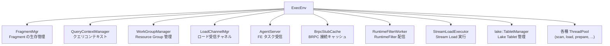
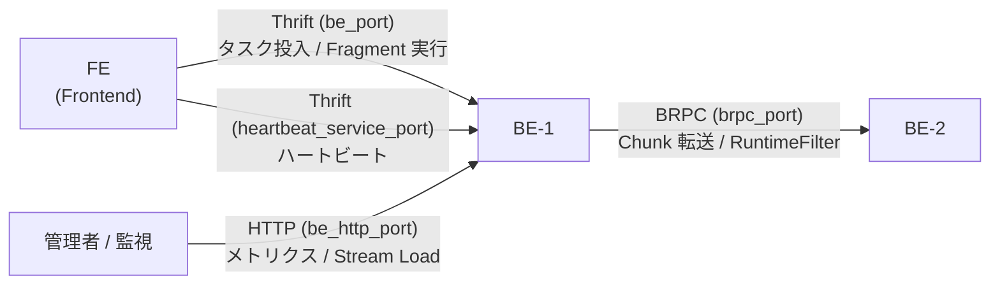

# 第3章 BE の起動とサービス層

> **本章で読むソース**
>
> - [`be/src/service/starrocks_main.cpp`](https://github.com/StarRocks/starrocks/blob/4.1.1/be/src/service/starrocks_main.cpp)
> - [`be/src/service/service.h`](https://github.com/StarRocks/starrocks/blob/4.1.1/be/src/service/service.h)
> - [`be/src/service/service_be/starrocks_be.cpp`](https://github.com/StarRocks/starrocks/blob/4.1.1/be/src/service/service_be/starrocks_be.cpp)
> - [`be/src/runtime/exec_env.h`](https://github.com/StarRocks/starrocks/blob/4.1.1/be/src/runtime/exec_env.h)
> - [`be/src/runtime/exec_env.cpp`](https://github.com/StarRocks/starrocks/blob/4.1.1/be/src/runtime/exec_env.cpp)
> - [`be/src/service/service_be/backend_service.h`](https://github.com/StarRocks/starrocks/blob/4.1.1/be/src/service/service_be/backend_service.h)
> - [`be/src/service/internal_service.h`](https://github.com/StarRocks/starrocks/blob/4.1.1/be/src/service/internal_service.h)
> - [`be/src/service/service_be/internal_service.h`](https://github.com/StarRocks/starrocks/blob/4.1.1/be/src/service/service_be/internal_service.h)
> - [`be/src/agent/agent_server.h`](https://github.com/StarRocks/starrocks/blob/4.1.1/be/src/agent/agent_server.h)
> - [`be/src/agent/heartbeat_server.h`](https://github.com/StarRocks/starrocks/blob/4.1.1/be/src/agent/heartbeat_server.h)
> - [`be/src/storage/storage_engine.h`](https://github.com/StarRocks/starrocks/blob/4.1.1/be/src/storage/storage_engine.h)
> - [`be/src/service/service_be/http_service.h`](https://github.com/StarRocks/starrocks/blob/4.1.1/be/src/service/service_be/http_service.h)
> - [`be/src/service/service_be/http_service.cpp`](https://github.com/StarRocks/starrocks/blob/4.1.1/be/src/service/service_be/http_service.cpp)

## この章の狙い

第2章で FE の起動とメタデータ管理を見た。
本章ではもう一方の主役である **BE**（Backend）の起動シーケンスと、外部から BE に到達する3つのサービス層を読む。
BE は C++ で書かれた実行ノードであり、クエリの実行、データの書き込み、ストレージの管理を一手に引き受ける。
起動時に何がどの順で初期化され、どのポートでどのプロトコルが待ち受けるかを把握すれば、障害時のログ読解やポート設計の判断に役立つ。

## 前提

- 第1章で StarRocks の全体像（FE と BE の役割分担）を理解していること。
- C++ の基本的な構文と、Thrift / BRPC（Baidu RPC）の概念を知っていること。

## 3.1 main() からの起動フロー

BE プロセスのエントリポイントは `starrocks_main.cpp` の `main()` である。

[`be/src/service/starrocks_main.cpp` L123-L144](https://github.com/StarRocks/starrocks/blob/4.1.1/be/src/service/starrocks_main.cpp#L123-L144)

```cpp
int main(int argc, char** argv) {
    // Record the TP-relative offset of tls_thread_status as early as possible,
    // before any thread is created (so the main thread's TLS layout is canonical).
    // External profilers read g_tls_thread_status_tpoff from /proc/PID/mem.
    starrocks::init_tls_thread_status_offset();

    if (argc > 1 && strcmp(argv[1], "meta_tool") == 0) {
        return meta_tool_main(argc - 1, argv + 1);
    }
    bool as_cn = false;
    // Check if print version or help or cn.
    if (argc > 1) {
        if (strcmp(argv[1], "--version") == 0 || strcmp(argv[1], "-v") == 0) {
            puts(starrocks::get_build_version(false).c_str());
            exit(0);
        } else if (strcmp(argv[1], "--help") == 0 || strcmp(argv[1], "-?") == 0) {
            help(basename(argv[0]));
            exit(0);
        } else if (strcmp(argv[1], "--cn") == 0) {
            as_cn = true;
        }
    }

```

`main()` の処理は大きく3段階に分かれる。

1. **コマンドライン解析**: `--cn` フラグで CN モードを判定し、`meta_tool` サブコマンドがあればメタデータツールに制御を渡す。
2. **環境準備**: PID ファイルの作成、設定ファイル（`be.conf` または `cn.conf`）の読み込み、libcurl と AWS SDK の初期化、ストレージパスの検証を行う。
3. **`start_be()` の呼び出し**: すべての準備が整った後、`start_be(paths, as_cn)` を呼ぶ。

ストレージパスの検証では、`ignore_broken_disk` 設定に応じて壊れたディスクをスキップするかプロセスを異常終了させるか分岐する。

[`be/src/service/starrocks_main.cpp` L236-L273](https://github.com/StarRocks/starrocks/blob/4.1.1/be/src/service/starrocks_main.cpp#L236-L273)

```cpp
    std::vector<starrocks::StorePath> paths;
    auto olap_res = starrocks::parse_conf_store_paths(starrocks::config::storage_root_path, &paths);
    if (!olap_res.ok() && !as_cn) {
        LOG(FATAL) << "parse config storage path failed, path=" << starrocks::config::storage_root_path;
        exit(-1);
    }
    // ... (中略) ...
    // cn need to support all ops for cloudnative table, so just start_be
    starrocks::start_be(paths, as_cn);

```

CN モード（`as_cn == true`）ではストレージパスが空でも続行できる。
CN はローカルディスクにデータを永続化しないためである。

## 3.2 start_be() の初期化シーケンス

`start_be()` は BE のすべてのサブシステムを決まった順序で立ち上げる。
実装は `starrocks_be.cpp` にある。

[`be/src/service/service_be/starrocks_be.cpp` L85-L137](https://github.com/StarRocks/starrocks/blob/4.1.1/be/src/service/service_be/starrocks_be.cpp#L85-L137)

```cpp
void start_be(const std::vector<StorePath>& paths, bool as_cn) {
    std::string process_name = as_cn ? "CN" : "BE";

    int start_step = 1;

    auto daemon = std::make_unique<Daemon>();
    daemon->init(as_cn, paths);
    // ... (中略) ...
    auto* global_env = GlobalEnv::GetInstance();
    EXIT_IF_ERROR(global_env->init());
    // ... (中略) ...
    auto* storage_engine = init_storage_engine(global_env, paths, as_cn);
    // ... (中略) ...
    auto* exec_env = ExecEnv::GetInstance();
    EXIT_IF_ERROR(exec_env->init(paths, as_cn));
    // ... (中略) ...
    EXIT_IF_ERROR(storage_engine->start_bg_threads());

```

各ステップをログの `start step N` と対応させると、初期化は以下の順序で進む。

| 順序 | コンポーネント | 役割 |
|------|---------------|------|
| 1 | **Daemon** | メモリ監視やメトリクス更新などのバックグラウンドスレッド |
| 2 | **JDBCDriverManager** | JDBC ドライバーのロード |
| 3 | **BackendOptions** | ネットワークアドレスの決定 |
| 4 | **GlobalEnv** | プロセス全体のメモリトラッカー階層 |
| 5 | **GlobalVariables** | グローバル変数の初期化確認 |
| 6 | **DataCache** | ディスクキャッシュ環境 |
| 7 | **StorageEngine** | Tablet とストレージの管理エンジン |
| 8 | **ExecEnv** | クエリ実行に必要な全コンポーネントのシングルトン |
| 9 | **StorageEngine BG threads** | Compaction やガベージスイープなどの常駐スレッド |
| 10 | **Thrift server** | FE からの制御 RPC 受信 |
| 11 | **BRPC server** | BE 間のデータ転送 RPC |
| 12 | **HTTP server** | 管理用 Web API |
| 13 | **Arrow Flight SQL server** | Arrow Flight プロトコルでの結果返却 |
| 14 | **Heartbeat server** | FE からのハートビート受信 |

サービスの起動が完了すると、`start_be()` は `while (!process_exit_in_progress()) { sleep(1); }` のループに入り、シグナルによるシャットダウン通知を待つ。

## 3.3 ExecEnv: BE 全体のシングルトン

**ExecEnv** は BE プロセスで1つだけ存在するシングルトンで、クエリ実行に必要なすべてのコンポーネントへのポインタを保持する。
`ExecEnv::GetInstance()` で任意の場所から取得でき、サブシステム間の結合点として機能する。

[`be/src/runtime/exec_env.h` L252-L258](https://github.com/StarRocks/starrocks/blob/4.1.1/be/src/runtime/exec_env.h#L252-L258)

```cpp
class ExecEnv {
public:
    // Initial exec environment. must call this to init all
    Status init(const std::vector<StorePath>& store_paths, bool as_cn = false);
    void stop();
    void destroy();
    void wait_for_finish();

```

ExecEnv が保持する主要コンポーネントは以下のとおりである。



`ExecEnv::init()` は約350行にわたり、上図のコンポーネントを1つずつ生成する。

[`be/src/runtime/exec_env.cpp` L322-L338](https://github.com/StarRocks/starrocks/blob/4.1.1/be/src/runtime/exec_env.cpp#L322-L338)

```cpp
Status ExecEnv::init(const std::vector<StorePath>& store_paths, bool as_cn) {
    _store_paths = store_paths;
    _external_scan_context_mgr = new ExternalScanContextMgr(this);
    _metrics = StarRocksMetrics::instance()->metrics();
    _stream_mgr = new DataStreamMgr();
    _lookup_dispatcher_mgr = new LookUpDispatcherMgr();
    _result_mgr = new ResultBufferMgr();
    _result_queue_mgr = new ResultQueueMgr();
    _backend_client_cache = new BackendServiceClientCache(config::max_client_cache_size_per_host);
    _frontend_client_cache = new FrontendServiceClientCache(config::max_client_cache_size_per_host);
    _broker_client_cache = new BrokerServiceClientCache(config::max_client_cache_size_per_host);
    // query_context_mgr keeps slotted map with 64 slot to reduce contention
    _query_context_mgr = new pipeline::QueryContextManager(6);
    // ... (中略) ...
    _thread_pool =
            new PriorityThreadPool("table_scan_io",
                                   config::scanner_thread_pool_thread_num, config::scanner_thread_pool_queue_size);

```

終盤では AgentServer の初期化も行われる。

[`be/src/runtime/exec_env.cpp` L655-L665](https://github.com/StarRocks/starrocks/blob/4.1.1/be/src/runtime/exec_env.cpp#L655-L665)

```cpp
    _agent_server = new AgentServer(this, false);
    RETURN_IF_ERROR(_agent_server->init());
    // ... (中略) ...
    _heartbeat_flags = new HeartbeatFlags();
    auto capacity = std::max<size_t>(config::query_cache_capacity, 4L * 1024 * 1024);
    _cache_mgr = new query_cache::CacheManager(capacity);

    _spill_dir_mgr = std::make_shared<spill::DirManager>();
    RETURN_IF_ERROR(_spill_dir_mgr->init(config::spill_local_storage_dir));

```

ExecEnv とは別に **GlobalEnv** が存在する。
GlobalEnv はメモリトラッカーの階層構造を管理する専用クラスで、プロセスメモリの上限管理、クエリプール、Compaction、メタデータなどカテゴリ別の使用量を追跡する。

## 3.4 サービス層の三層構造

BE は3種類のネットワークプロトコルで外部からの要求を受け付ける。
それぞれ用途が異なり、役割分担が明確である。



### 3.4.1 Thrift: BackendService（制御プレーン）

FE から BE への制御指示は Apache Thrift で行われる。
`BackendService` は `BackendServiceIf`（Thrift の自動生成インターフェース）を実装し、`be_port`（デフォルト 9060）で待ち受ける。

[`be/src/service/service_be/backend_service.h` L45-L65](https://github.com/StarRocks/starrocks/blob/4.1.1/be/src/service/service_be/backend_service.h#L45-L65)

```cpp
class BackendService : public BackendServiceBase {
public:
    explicit BackendService(ExecEnv* exec_env);

    ~BackendService() override;

    void submit_tasks(TAgentResult& return_value, const std::vector<TAgentTaskRequest>& tasks) override;

    void make_snapshot(TAgentResult& return_value, const TSnapshotRequest& snapshot_request) override;

    void release_snapshot(TAgentResult& return_value, const std::string& snapshot_path) override;

    void publish_cluster_state(TAgentResult& result, const TAgentPublishRequest& request) override;

    void get_tablet_stat(TTabletStatResult& result) override;

    void get_tablets_info(TGetTabletsInfoResult& result_, const TGetTabletsInfoRequest& request) override;

```

基底クラス `BackendServiceBase` にはさらに `exec_plan_fragment()`、`cancel_plan_fragment()`、`submit_routine_load_task()` など、クエリ実行やロード関連のメソッドが定義されている。

[`be/src/service/backend_base.h` L65-L131](https://github.com/StarRocks/starrocks/blob/4.1.1/be/src/service/backend_base.h#L65-L131)

```cpp
class BackendServiceBase : public BackendServiceIf {
public:
    // ... (中略) ...
    // StarrocksServer service
    void exec_plan_fragment(TExecPlanFragmentResult& return_val, const TExecPlanFragmentParams& params) override;
    void cancel_plan_fragment(TCancelPlanFragmentResult& return_val, const TCancelPlanFragmentParams& params) override;
    void transmit_data(TTransmitDataResult& return_val, const TTransmitDataParams& params) override;
    // ... (中略) ...
    void submit_routine_load_task(TStatus& t_status, const std::vector<TRoutineLoadTask>& tasks) override;

```

Thrift サーバーの起動コードは以下のとおりである。

[`be/src/service/service_be/starrocks_be.cpp` L167-L179](https://github.com/StarRocks/starrocks/blob/4.1.1/be/src/service/service_be/starrocks_be.cpp#L167-L179)

```cpp
    int thrift_port = config::be_port;
    if (as_cn && config::thrift_port != 0) {
        thrift_port = config::thrift_port;
        LOG(WARNING) << "'thrift_port' is deprecated, please update be.conf to use 'be_port' instead!";
    }
    auto thrift_server = BackendService::create<BackendService>(exec_env, thrift_port);

    if (auto status = thrift_server->start(); !status.ok()) {
        LOG(ERROR) << "Fail to start BackendService thrift server on port " << thrift_port << ": " << status;
        shutdown_logging();
        exit(1);
    }

```

### 3.4.2 BRPC: PInternalService（データプレーン）

BE 間のデータ転送には百度が開発した **BRPC**（Baidu RPC）が使われる。
`PInternalServiceImplBase` が protobuf で定義されたサービスインターフェースを実装し、`brpc_port`（デフォルト 8060）で待ち受ける。

[`be/src/service/internal_service.h` L60-L78](https://github.com/StarRocks/starrocks/blob/4.1.1/be/src/service/internal_service.h#L60-L78)

```cpp
template <typename T>
class PInternalServiceImplBase : public T {
public:
    PInternalServiceImplBase(ExecEnv* exec_env);
    ~PInternalServiceImplBase() override;

    void transmit_data(::google::protobuf::RpcController* controller, const ::starrocks::PTransmitDataParams* request,
                       ::starrocks::PTransmitDataResult* response, ::google::protobuf::Closure* done) override;

    void transmit_chunk(::google::protobuf::RpcController* controller, const ::starrocks::PTransmitChunkParams* request,
                        ::starrocks::PTransmitChunkResult* response, ::google::protobuf::Closure* done) override;

    void transmit_chunk_via_http(::google::protobuf::RpcController* controller,
                                 const ::starrocks::PHttpRequest* request, ::starrocks::PTransmitChunkResult* response,
                                 ::google::protobuf::Closure* done) override;

    void transmit_runtime_filter(::google::protobuf::RpcController* controller,
                                 const ::starrocks::PTransmitRuntimeFilterParams* request,
                                 ::starrocks::PTransmitRuntimeFilterResult* response,
                                 ::google::protobuf::Closure* done) override;

```

BE 固有の `BackendInternalServiceImpl` がこのベースを継承し、Tablet ライター操作を追加する。

[`be/src/service/service_be/internal_service.h` L49-L83](https://github.com/StarRocks/starrocks/blob/4.1.1/be/src/service/service_be/internal_service.h#L49-L83)

```cpp
template <typename T>
class BackendInternalServiceImpl : public PInternalServiceImplBase<T> {
public:
    BackendInternalServiceImpl(ExecEnv* exec_env) : PInternalServiceImplBase<T>(exec_env) {}

    void tablet_writer_open(google::protobuf::RpcController* controller, const PTabletWriterOpenRequest* request,
                            PTabletWriterOpenResult* response, google::protobuf::Closure* done) override;

    void tablet_writer_add_chunk(google::protobuf::RpcController* controller,
                                 const PTabletWriterAddChunkRequest* request, PTabletWriterAddBatchResult* response,
                                 google::protobuf::Closure* done) override;
    // ... (中略) ...
    void tablet_writer_cancel(google::protobuf::RpcController* controller, const PTabletWriterCancelRequest* request,
                              PTabletWriterCancelResult* response, google::protobuf::Closure* done) override;

```

BRPC サーバーの起動では、`BackendInternalServiceImpl` と `LakeServiceImpl` の2つのサービスを1つの `brpc::Server` に登録する。

[`be/src/service/service_be/starrocks_be.cpp` L188-L244](https://github.com/StarRocks/starrocks/blob/4.1.1/be/src/service/service_be/starrocks_be.cpp#L188-L244)

```cpp
    auto brpc_server = std::make_unique<brpc::Server>();

    BackendInternalServiceImpl<PInternalService> internal_service(exec_env);
#ifndef __APPLE__
    LakeServiceImpl lake_service(exec_env, exec_env->lake_tablet_manager());

    brpc_server->AddService(&internal_service, brpc::SERVER_DOESNT_OWN_SERVICE);
    brpc_server->AddService(&lake_service, brpc::SERVER_DOESNT_OWN_SERVICE);
#else
    brpc_server->AddService(&internal_service, brpc::SERVER_DOESNT_OWN_SERVICE);
#endif
    // ... (中略) ...
    if (auto ret = brpc_server->Start(point, &options); ret != 0) {
        LOG(ERROR) << "BRPC service did not start correctly, exiting errcoe: " << ret;
        shutdown_logging();
        exit(1);
    }

```

PInternalService が提供する RPC の主な分類は以下のとおりである。

| RPC メソッド | 用途 |
|-------------|------|
| `transmit_chunk` | Shuffle 時の Chunk データ転送 |
| `transmit_runtime_filter` | RuntimeFilter のブロードキャスト |
| `exec_plan_fragment` / `exec_batch_plan_fragments` | Fragment 実行指示 |
| `cancel_plan_fragment` | Fragment キャンセル |
| `tablet_writer_open` / `tablet_writer_add_chunk` / `tablet_writer_cancel` | ロード時の Tablet 書き込み |
| `stream_load` | Stream Load の BRPC 経路 |
| `process_dictionary_cache` | 辞書キャッシュ更新 |

### 3.4.3 HTTP: HttpServiceBE（管理と Stream Load）

HTTP サーバーは `be_http_port`（デフォルト 8040）で管理用 API と Stream Load のエンドポイントを提供する。
libevent ベースの `EvHttpServer` を内部で使用する。

[`be/src/service/service_be/http_service.cpp` L97-L104](https://github.com/StarRocks/starrocks/blob/4.1.1/be/src/service/service_be/http_service.cpp#L97-L104)

```cpp
Status HttpServiceBE::start() {
    add_default_path_handlers(_web_page_handler.get(), GlobalEnv::GetInstance()->process_mem_tracker());

    // register load
    auto* stream_load_action = new StreamLoadAction(_env, _http_concurrent_limiter.get());
    _ev_http_server->register_handler(HttpMethod::PUT, "/api/{db}/{table}/_stream_load", stream_load_action);
    _http_handlers.emplace_back(stream_load_action);

```

登録されるエンドポイントの代表例は以下のとおりである。

| パス | メソッド | 用途 |
|------|---------|------|
| `/api/{db}/{table}/_stream_load` | PUT | Stream Load によるデータ取り込み |
| `/api/transaction/{txn_op}` | POST/PUT | トランザクション操作 |
| `/api/health` | GET | ヘルスチェック |
| `/metrics` | GET | Prometheus 形式のメトリクス |
| `/pprof/heap`, `/pprof/profile` | GET | CPU/メモリプロファイリング |
| `/api/compaction/show` | GET | Compaction 状態の確認 |
| `/api/update_config` | POST | 設定の動的変更 |
| `/api/query_cache/{action}` | GET/PUT | クエリキャッシュの操作 |
| `/api/runtime_filter_cache/{action}` | GET/PUT | RuntimeFilter キャッシュの操作 |

## 3.5 AgentServer と HeartbeatServer

### 3.5.1 AgentServer: FE からのタスク受信

FE は BE に対して Tablet の作成、削除、Compaction、レプリカクローンなどのタスクを送信する。
`AgentServer` がこれらを受信し、タスク種別ごとの `ThreadPool` にディスパッチする。

[`be/src/agent/agent_server.h` L55-L80](https://github.com/StarRocks/starrocks/blob/4.1.1/be/src/agent/agent_server.h#L55-L80)

```cpp
class AgentServer {
public:
    explicit AgentServer(ExecEnv* exec_env, bool is_compute_node);

    ~AgentServer();

    Status init();

    void stop();

    void submit_tasks(TAgentResult& agent_result, const std::vector<TAgentTaskRequest>& tasks);

    void make_snapshot(TAgentResult& agent_result, const TSnapshotRequest& snapshot_request);

    void release_snapshot(TAgentResult& agent_result, const std::string& snapshot_path);
    // ... (中略) ...
    ThreadPool* get_thread_pool(int type) const;

```

`BackendService::submit_tasks()` が Thrift RPC で呼び出されると、内部で `AgentServer::submit_tasks()` に委譲される。
AgentServer は PIMPL（Pointer to Implementation）パターンで実装されており、`Impl` クラスがタスク種別ごとのワーカースレッドプールを管理する。

[`be/src/agent/agent_server.cpp` L805-L811](https://github.com/StarRocks/starrocks/blob/4.1.1/be/src/agent/agent_server.cpp#L805-L811)

```cpp
AgentServer::AgentServer(ExecEnv* exec_env, bool is_compute_node)
        : _impl(std::make_unique<AgentServer::Impl>(exec_env, is_compute_node)) {}

// ... (中略) ...

void AgentServer::submit_tasks(TAgentResult& agent_result, const std::vector<TAgentTaskRequest>& tasks) {
    _impl->submit_tasks(agent_result, tasks);
}

```

### 3.5.2 HeartbeatServer: 生存確認とメタデータ同期

FE の Master ノードは定期的に各 BE にハートビートを送る。
`HeartbeatServer` は `heartbeat_service_port`（デフォルト 9050）で Thrift サーバーとして待ち受け、受信した `TMasterInfo` をもとに FE のリーダー情報を更新する。

[`be/src/agent/heartbeat_server.h` L55-L86](https://github.com/StarRocks/starrocks/blob/4.1.1/be/src/agent/heartbeat_server.h#L55-L86)

```cpp
class HeartbeatServer : public HeartbeatServiceIf {
public:
    HeartbeatServer();
    ~HeartbeatServer() override = default;

    virtual void init_cluster_id_or_die();

    void heartbeat(THeartbeatResult& heartbeat_result, const TMasterInfo& master_info) override;

```

ハートビートの処理では、受信した `TMasterInfo` と現在キャッシュしている情報を `compare_master_info()` で比較する。
変更がある場合のみ `update_master_info()` を呼び、FE リーダーのアドレスやクラスター ID を更新する。

[`be/src/agent/heartbeat_server.cpp` L76-L114](https://github.com/StarRocks/starrocks/blob/4.1.1/be/src/agent/heartbeat_server.cpp#L76-L114)

```cpp
void HeartbeatServer::heartbeat(THeartbeatResult& heartbeat_result, const TMasterInfo& master_info) {
    //print heartbeat in every minute
    LOG_EVERY_N(INFO, 12) << "get heartbeat from FE. host:" << master_info.network_address.hostname
                          << ", port:" << master_info.network_address.port
                          // ... (中略) ...
    StatusOr<CmpResult> res;
    // reject master's heartbeat when exit
    if (process_exit_in_progress() || is_process_crashing()) {
        res = Status::Shutdown("BE is shutting down");
    } else {
        res = compare_master_info(master_info);
    }
    // ... (中略) ...
    } else if (*res == kNeedUpdate) {
        LOG(INFO) << "Updating master info: " << print_master_info(master_info);
        bool r = update_master_info(master_info);

```

ハートビート応答には BE 自身のポート情報（`be_port`、`http_port`、`brpc_port`、`arrow_flight_port`）、バージョン、CPU コア数、メモリ上限が含まれる。
FE はこの情報をもとに BE の状態を管理する。

[`be/src/agent/heartbeat_server.cpp` L132-L147](https://github.com/StarRocks/starrocks/blob/4.1.1/be/src/agent/heartbeat_server.cpp#L132-L147)

```cpp
    if (res.ok()) {
        heartbeat_result.backend_info.__set_be_port(config::be_port);
        heartbeat_result.backend_info.__set_http_port(config::be_http_port);
        heartbeat_result.backend_info.__set_be_rpc_port(-1);
        heartbeat_result.backend_info.__set_brpc_port(config::brpc_port);
        heartbeat_result.backend_info.__set_arrow_flight_port(config::arrow_flight_port);
        // ... (中略) ...
        heartbeat_result.backend_info.__set_version(get_short_version());
        heartbeat_result.backend_info.__set_num_hardware_cores(num_hardware_cores);
        heartbeat_result.backend_info.__set_mem_limit_bytes(GlobalEnv::GetInstance()->process_mem_tracker()->limit());

```

HeartbeatServer は `create_heartbeat_server()` で生成され、`start_be()` の最終ステップで起動する。

[`be/src/agent/heartbeat_server.cpp` L296-L305](https://github.com/StarRocks/starrocks/blob/4.1.1/be/src/agent/heartbeat_server.cpp#L296-L305)

```cpp
StatusOr<std::unique_ptr<ThriftServer>> create_heartbeat_server(ExecEnv* exec_env, uint32_t server_port,
                                                                uint32_t worker_thread_num) {
    auto* heartbeat_server = new HeartbeatServer();
    heartbeat_server->init_cluster_id_or_die();

    std::shared_ptr<HeartbeatServer> handler(heartbeat_server);
    std::shared_ptr<TProcessor> server_processor(new HeartbeatServiceProcessor(handler));
    return std::make_unique<ThriftServer>("heartbeat", server_processor, server_port, exec_env->metrics(),
                                          worker_thread_num);
}

```

## 3.6 StorageEngine の初期化と役割

`StorageEngine` はローカルディスク上の Tablet、Rowset、トランザクションを管理するシングルトンである。
`start_be()` の中で `init_storage_engine()` が呼ばれ、`StorageEngine::open()` を通じて生成される。

[`be/src/service/service_be/starrocks_be.cpp` L68-L81](https://github.com/StarRocks/starrocks/blob/4.1.1/be/src/service/service_be/starrocks_be.cpp#L68-L81)

```cpp
StorageEngine* init_storage_engine(GlobalEnv* global_env, std::vector<StorePath> paths, bool as_cn) {
    // Init and open storage engine.
    EngineOptions options;
    options.store_paths = std::move(paths);
    options.backend_uid = UniqueId::gen_uid();
    options.compaction_mem_tracker = global_env->compaction_mem_tracker();
    options.update_mem_tracker = global_env->update_mem_tracker();
    options.need_write_cluster_id = !as_cn;
    StorageEngine* engine = nullptr;

    EXIT_IF_ERROR(StorageEngine::open(options, &engine));

    return engine;
}

```

`StorageEngine::open()` の内部ではストアの初期化、既存 Tablet のロード、RowsetId ジェネレーターの設定が行われる。

[`be/src/storage/storage_engine.cpp` L100-L109](https://github.com/StarRocks/starrocks/blob/4.1.1/be/src/storage/storage_engine.cpp#L100-L109)

```cpp
Status StorageEngine::open(const EngineOptions& options, StorageEngine** engine_ptr) {
    if (options.need_write_cluster_id) {
        RETURN_IF_ERROR(_validate_options(options));
    }

    std::unique_ptr<StorageEngine> engine = std::make_unique<StorageEngine>(options);
    RETURN_IF_ERROR_WITH_WARN(engine->_open(options), "open engine failed");
    *engine_ptr = engine.release();
    return Status::OK();
}

```

コンストラクタでは TabletManager、TxnManager、UpdateManager、CompactionManager などの中核コンポーネントが生成される。

[`be/src/storage/storage_engine.cpp` L111-L124](https://github.com/StarRocks/starrocks/blob/4.1.1/be/src/storage/storage_engine.cpp#L111-L124)

```cpp
StorageEngine::StorageEngine(const EngineOptions& options)
        : _effective_cluster_id(-1),
          _options(options),
          _available_storage_medium_type_count(0),
          _is_all_cluster_id_exist(true),
          _tablet_manager(new TabletManager(config::tablet_map_shard_size)),
          _txn_manager(new TxnManager(config::txn_map_shard_size, config::txn_shard_size, options.store_paths.size())),
          _replication_txn_manager(new ReplicationTxnManager()),
          _rowset_id_generator(new UniqueRowsetIdGenerator(options.backend_uid)),
          _memtable_flush_executor(nullptr),
          _update_manager(new UpdateManager(options.update_mem_tracker)),
          _compaction_manager(new CompactionManager()),
          _publish_version_manager(new PublishVersionManager()),
          _dictionary_cache_manager(new DictionaryCacheManager()) {

```

`start_bg_threads()` が呼ばれると、Compaction スレッド、ガベージスイープスレッド、ディスク監視スレッドなど多数のバックグラウンドスレッドが起動する。
CN モードでは `options.need_write_cluster_id` が `false` に設定され、`is_as_cn()` が `true` を返す。
この場合、ローカルストレージへの永続化に関わる処理はスキップされる。

## 3.7 CN モード（`--cn` フラグ）との差異

`main()` で `--cn` フラグが指定されると `as_cn = true` となり、以下の違いが生まれる。

| 項目 | BE モード | CN モード |
|------|----------|----------|
| 設定ファイル | `be.conf` | `cn.conf` |
| PID ファイル | `be.pid` | `cn.pid` |
| ストレージパス | 必須（空なら異常終了） | 空でも続行可能 |
| StorageEngine | ローカル Tablet を管理 | `need_write_cluster_id = false` で起動 |
| AgentServer | 全タスクを受け付ける | コンピュートタスクのみ |

CN は Shared-Data アーキテクチャにおける計算専用ノードであり、データの永続化はオブジェクトストレージに委ねる。
ただし `start_be()` のコード上はコメントにあるとおり、「cn need to support all ops for cloudnative table, so just start_be」として BE と同一の関数で起動する。
差異は `as_cn` フラグによる条件分岐で実現されている。

## 3.8 高速化の工夫: BRPC によるデータ転送

StarRocks が BE 間のデータ転送に Thrift ではなく BRPC を採用した理由は、パフォーマンス上の利点にある。
BRPC は以下の特性を持つ。

**非同期 RPC と bthread**:
BRPC のサーバー側ハンドラは bthread（ユーザー空間の軽量スレッド）上で動作する。
OS スレッドを1対1で消費しないため、数千の同時 RPC を少ないスレッドで処理できる。
`brpc_num_threads` 設定でワーカースレッド数を制御する。

[`be/src/service/service_be/starrocks_be.cpp` L200-L203](https://github.com/StarRocks/starrocks/blob/4.1.1/be/src/service/service_be/starrocks_be.cpp#L200-L203)

```cpp
    brpc::ServerOptions options;
    if (config::brpc_num_threads != -1) {
        options.num_threads = config::brpc_num_threads;
    }

```

**IOBuf によるゼロコピー転送**:
BRPC は `butil::IOBuf` というデータ構造を使い、シリアライズとネットワーク送信の間でメモリコピーを避ける。
従来の Thrift ではリクエスト全体をシリアライズしてからソケットに書き込む2段階が必要だが、BRPC の IOBuf はポインタの付け替えでバッファを連鎖させるため、大きな Chunk データを効率よく転送できる。

**`transmit_chunk_via_http`**:
Chunk のサイズが `brpc_max_body_size` を超える場合のフォールバックとして、HTTP 経由で Chunk を送る `transmit_chunk_via_http` メソッドが用意されている。
BRPC の HTTP チャネルは同じポートで受け付けるため、追加のポート設定は不要である。

**背圧制御**:
`brpc_socket_max_unwritten_bytes` で1ソケットあたりの未書き込みバイト数の上限を設定し、送信側が受信側の処理速度を超えないよう制御する。

[`be/src/service/service_be/starrocks_be.cpp` L182-L187](https://github.com/StarRocks/starrocks/blob/4.1.1/be/src/service/service_be/starrocks_be.cpp#L182-L187)

```cpp
    brpc::FLAGS_max_body_size = config::brpc_max_body_size;

    // Configure keepalive.
    brpc::FLAGS_socket_keepalive = config::brpc_socket_keepalive;

    brpc::FLAGS_socket_max_unwritten_bytes = config::brpc_socket_max_unwritten_bytes;

```

## まとめ

BE の起動は `main()` から `start_be()` へ進み、Daemon、GlobalEnv、StorageEngine、ExecEnv の順に初期化が行われる。
ExecEnv は BE 全体のシングルトンとして FragmentMgr や AgentServer を含む数十のコンポーネントを束ねる。
外部との通信は3つのプロトコルに分かれる。
Thrift（`be_port`）は FE からの制御指示、BRPC（`brpc_port`）は BE 間のデータ転送、HTTP（`be_http_port`）は管理 API と Stream Load を担う。
HeartbeatServer は専用ポートで FE からの生存確認を受け、BE の状態情報を返す。
CN モードでは同じ `start_be()` を使いつつ、`as_cn` フラグで永続化を省略し計算専用ノードとして動作する。

## 関連する章

- 第2章: FE の起動とメタデータ管理（FE 側の起動シーケンスと BE の登録）
- 第10章: Pipeline 実行モデル（ExecEnv の FragmentMgr が Fragment を受け取った後の実行）
- 第16章: Tablet、Rowset とデータモデル（StorageEngine が管理するデータ構造の詳細）
- 第20章: Lake モードと StarOS 連携（CN モードの Shared-Data アーキテクチャ）
- 第22章: ロードパス（Stream Load や Routine Load のデータ取り込み経路）
