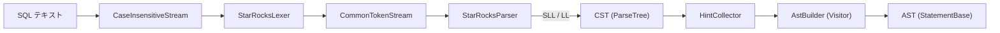
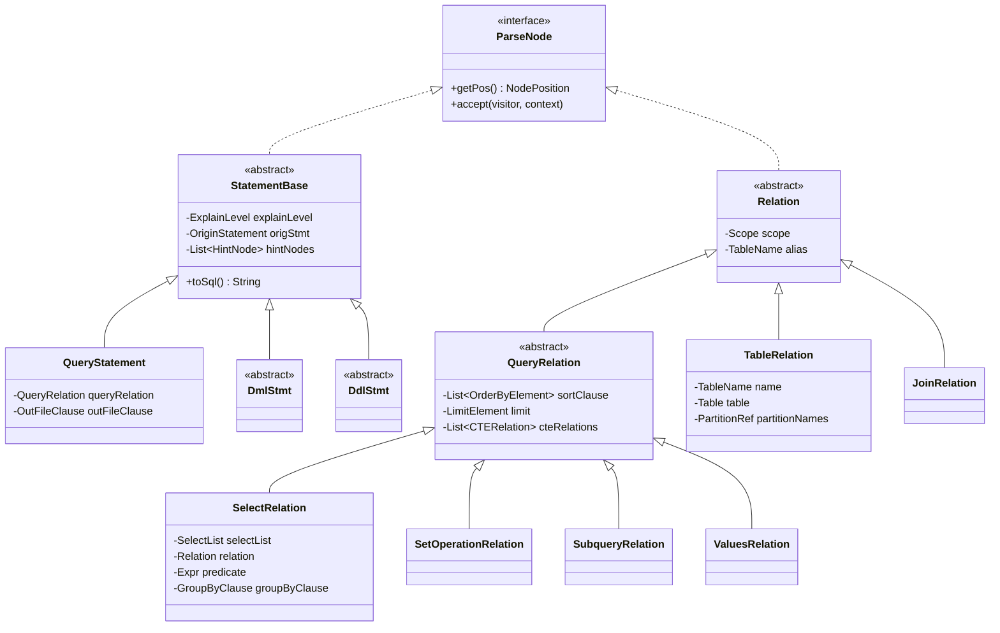

# 第4章 SQL パーサーと AST

> **本章で読むソース**
>
> - [`fe/fe-grammar/src/main/antlr/com/starrocks/grammar/StarRocksLex.g4`](https://github.com/StarRocks/starrocks/blob/4.1.1/fe/fe-grammar/src/main/antlr/com/starrocks/grammar/StarRocksLex.g4)
> - [`fe/fe-grammar/src/main/antlr/com/starrocks/grammar/StarRocks.g4`](https://github.com/StarRocks/starrocks/blob/4.1.1/fe/fe-grammar/src/main/antlr/com/starrocks/grammar/StarRocks.g4)
> - [`fe/fe-core/src/main/java/com/starrocks/sql/parser/SqlParser.java`](https://github.com/StarRocks/starrocks/blob/4.1.1/fe/fe-core/src/main/java/com/starrocks/sql/parser/SqlParser.java)
> - [`fe/fe-core/src/main/java/com/starrocks/sql/parser/AstBuilder.java`](https://github.com/StarRocks/starrocks/blob/4.1.1/fe/fe-core/src/main/java/com/starrocks/sql/parser/AstBuilder.java)
> - [`fe/fe-parser/src/main/java/com/starrocks/sql/ast/StatementBase.java`](https://github.com/StarRocks/starrocks/blob/4.1.1/fe/fe-parser/src/main/java/com/starrocks/sql/ast/StatementBase.java)
> - [`fe/fe-core/src/main/java/com/starrocks/sql/ast/QueryStatement.java`](https://github.com/StarRocks/starrocks/blob/4.1.1/fe/fe-core/src/main/java/com/starrocks/sql/ast/QueryStatement.java)
> - [`fe/fe-core/src/main/java/com/starrocks/sql/ast/SelectRelation.java`](https://github.com/StarRocks/starrocks/blob/4.1.1/fe/fe-core/src/main/java/com/starrocks/sql/ast/SelectRelation.java)
> - [`fe/fe-core/src/main/java/com/starrocks/sql/ast/TableRelation.java`](https://github.com/StarRocks/starrocks/blob/4.1.1/fe/fe-core/src/main/java/com/starrocks/sql/ast/TableRelation.java)

## この章の狙い

SQL テキストが FE に到達してから、後続のアナライザーやオプティマイザーが処理できる AST(抽象構文木)に変換されるまでの全工程を追う。
StarRocks は ANTLR4 で文法を定義し、Visitor パターンで CST(具象構文木)を独自の AST クラス群へ変換する。
この章では、レクサー文法とパーサー文法の構造、`SqlParser` のパース戦略、`AstBuilder` による変換ロジック、AST のクラス階層を読む。

## 前提

ANTLR4 は、`.g4` ファイルに記述した文法からレクサーとパーサーの Java コードを自動生成するパーサージェネレーターである。
生成されたパーサーは入力トークン列から **CST**(ParseTree)を構築する。
CST はそのまま使うこともできるが、StarRocks は CST をそのまま使わず、Visitor パターンで独自の AST へ変換している。

## レクサー文法: StarRocksLex.g4

レクサー文法は SQL テキストを個々のトークンに分解する規則を定義する。

### sqlMode による動的トークン切り替え

レクサーは `sqlMode` フィールドを保持し、`||` 演算子のトークン型を実行時に切り替える。

[`fe/fe-grammar/src/main/antlr/com/starrocks/grammar/StarRocksLex.g4` L16-L25](https://github.com/StarRocks/starrocks/blob/4.1.1/fe/fe-grammar/src/main/antlr/com/starrocks/grammar/StarRocksLex.g4#L16-L25)

```g4
lexer grammar StarRocksLex;
@members {
private long sqlMode = 32L; // MODE_DEFAULT = 32L;
public void setSqlMode(long newSqlMode) {
    sqlMode = newSqlMode;
}
}
tokens {
    CONCAT
}

```

`LOGICAL_OR` の定義では、`MODE_PIPES_AS_CONCAT` ビットが立っている場合に `CONCAT` トークンへ切り替える。

[`fe/fe-grammar/src/main/antlr/com/starrocks/grammar/StarRocksLex.g4` L539](https://github.com/StarRocks/starrocks/blob/4.1.1/fe/fe-grammar/src/main/antlr/com/starrocks/grammar/StarRocksLex.g4#L539)

```g4
LOGICAL_OR: '||' {setType((sqlMode & (1L << 1) /* MODE_PIPES_AS_CONCAT = 1L << 1 */) == 0 ? LOGICAL_OR : StarRocksParser.CONCAT);};

```

MySQL 互換の `PIPES_AS_CONCAT` モードでは `||` を文字列結合として扱う必要があるため、レクサーレベルでトークン型を分岐させている。

### トークンの分類

レクサーが定義するトークンは大きく4種類に分かれる。

- **予約語**(約520個): `SELECT`, `FROM`, `WHERE` など。文法ファイルの L27-L523 にアルファベット順で並ぶ
- **演算子と記号**: 比較演算子(`=`, `<>`, `<`, `<=`, `>`, `>=`, `<=>`)、算術演算子(`+`, `-`, `*`, `/`, `%`)、ビット演算子、論理演算子(L524-L553)
- **リテラル**: 整数値(`INTEGER_VALUE`)、小数値(`DECIMAL_VALUE`)、浮動小数点値(`DOUBLE_VALUE`)、文字列リテラル(シングルクォート、ダブルクォート)、バイナリリテラル(L555-L583)
- **識別子**: 通常の識別子(`LETTER_IDENTIFIER`)、数字始まり識別子(`DIGIT_IDENTIFIER`)、バッククォート識別子(`BACKQUOTED_IDENTIFIER`)(L585-L601)

### 隠しチャンネルとオプティマイザーヒント

コメントと空白は `HIDDEN` チャンネルへ送られ、パーサーの文法規則には影響しない。

[`fe/fe-grammar/src/main/antlr/com/starrocks/grammar/StarRocksLex.g4` L615-L625](https://github.com/StarRocks/starrocks/blob/4.1.1/fe/fe-grammar/src/main/antlr/com/starrocks/grammar/StarRocksLex.g4#L615-L625)

```g4
SIMPLE_COMMENT
    : '--' ~[\r\n]* '\r'? '\n'? -> channel(HIDDEN)
    ;

BRACKETED_COMMENT
    : '/*'([ \r\n\t　]* | ~'+' .*?) '*/' -> channel(HIDDEN)
    ;

OPTIMIZER_HINT
    : '/*+' .*? '*/' -> channel(2)
    ;

```

`/*+ ... */` 形式のオプティマイザーヒントは、通常のコメント(`HIDDEN`)とは別のチャンネル 2 に振り分けられる。
`HintCollector` がチャンネル 2 のトークンを後から収集し、AST ノードにヒント情報を付与する仕組みになっている。

## パーサー文法: StarRocks.g4

パーサー文法は約3,300行あり、SQL の構文規則を定義する。

[`fe/fe-grammar/src/main/antlr/com/starrocks/grammar/StarRocks.g4` L15-L16](https://github.com/StarRocks/starrocks/blob/4.1.1/fe/fe-grammar/src/main/antlr/com/starrocks/grammar/StarRocks.g4#L15-L16)

```g4
grammar StarRocks;
import StarRocksLex;

```

パーサー文法 `StarRocks.g4` はレクサー文法 `StarRocksLex.g4` を `import` で取り込む。
これにより、一つの結合文法ではなく、レクサーとパーサーを独立した `.g4` ファイルに分離している。

### トップレベル構造

パース結果のエントリポイントは `sqlStatements` ルールである。

[`fe/fe-grammar/src/main/antlr/com/starrocks/grammar/StarRocks.g4` L18-L27](https://github.com/StarRocks/starrocks/blob/4.1.1/fe/fe-grammar/src/main/antlr/com/starrocks/grammar/StarRocks.g4#L18-L27)

```g4
sqlStatements
    : singleStatement+ EOF
    ;

singleStatement
    : (statement (SEMICOLON | EOF)) | emptyStatement
    ;
emptyStatement
    : SEMICOLON
    ;

```

セミコロン区切りで複数の SQL 文を一度にパースできる。
`statement` ルール(L29-L380)は、`queryStatement` や `createTableStatement` など約150種類の文を列挙する巨大な選択肢になっている。

### SELECT 文のパース規則

SELECT 文のパースは、次のルール階層をたどる。

[`fe/fe-grammar/src/main/antlr/com/starrocks/grammar/StarRocks.g4` L2377-L2441](https://github.com/StarRocks/starrocks/blob/4.1.1/fe/fe-grammar/src/main/antlr/com/starrocks/grammar/StarRocks.g4#L2377-L2441)

```g4
queryStatement
    : (explainDesc | optimizerTrace) ? queryRelation outfile?;

queryRelation
    : withClause? queryNoWith
    ;

queryNoWith
    : queryPrimary (ORDER BY sortItem (',' sortItem)*)? (limitElement)?
    ;

queryPrimary
    : querySpecification                                              #queryPrimaryDefault
    | subquery                                                        #queryWithParentheses
    | left=queryPrimary operator=INTERSECT setQuantifier? right=queryPrimary  #setOperation
    | left=queryPrimary operator=(UNION | EXCEPT | MINUS)
        setQuantifier? right=queryPrimary                             #setOperation
    ;

querySpecification
    : SELECT setQuantifier? selectItem (',' selectItem)*
      fromClause
      ((WHERE where=expression)? (GROUP BY groupingElement)?
       (HAVING having=expression)?
       (QUALIFY qualifyFunction=selectItem comparisonOperator limit=INTEGER_VALUE)?)
    ;

```

`queryStatement` は `EXPLAIN` 句と出力先(`outfile`)をオプションで持つ。
`queryPrimary` は UNION, INTERSECT, EXCEPT の集合演算を左再帰で表現し、`querySpecification` が個々の SELECT 句を定義する。

### FROM 句とテーブル参照

FROM 句のテーブル参照は `relation` ルールと `relationPrimary` ルールで定義される。

[`fe/fe-grammar/src/main/antlr/com/starrocks/grammar/StarRocks.g4` L2483-L2501](https://github.com/StarRocks/starrocks/blob/4.1.1/fe/fe-grammar/src/main/antlr/com/starrocks/grammar/StarRocks.g4#L2483-L2501)

```g4
relation
    : relationPrimary joinRelation*
    | '(' relationPrimary joinRelation* ')'
    ;

relationPrimary
    : qualifiedName queryPeriod? partitionNames? tabletList? replicaList? sampleClause? (
        AS? alias=identifier)? bracketHint? (BEFORE ts=string)?       #tableAtom
    | '(' VALUES rowConstructor (',' rowConstructor)* ')'
        (AS? alias=identifier columnAliases?)?                        #inlineTable
    | ASSERT_ROWS? subquery (AS? alias=identifier columnAliases?)?    #subqueryWithAlias
    | qualifiedName '(' expressionList ')'
        (AS? alias=identifier columnAliases?)?                        #tableFunction
    | TABLE '(' qualifiedName '(' argumentList ')' ')'
        (AS? alias=identifier columnAliases?)?                        #normalizedTableFunction
    | FILES propertyList
        (AS? alias=identifier columnAliases?)?                        #fileTableFunction
    | '(' relations ')'                                               #parenthesizedRelation
    ;

```

`tableAtom` は通常のテーブル参照であり、`queryPeriod`(タイムトラベル)、`partitionNames`(パーティション指定)、`tabletList`(Tablet ID 指定)、`sampleClause`(サンプリング)をオプションで付けられる。
テーブル関数(`tableFunction`)やファイルテーブル関数(`fileTableFunction`)も `relationPrimary` の選択肢として同じ階層に位置する。

### 式の文法

式(`expression`)は、論理演算、比較演算、算術演算、リテラル、関数呼び出しなどを階層的に定義する。

[`fe/fe-grammar/src/main/antlr/com/starrocks/grammar/StarRocks.g4` L2661-L2666](https://github.com/StarRocks/starrocks/blob/4.1.1/fe/fe-grammar/src/main/antlr/com/starrocks/grammar/StarRocks.g4#L2661-L2666)

```g4
expression
    : (BINARY)? booleanExpression                                      #expressionDefault
    | NOT expression                                                   #logicalNot
    | left=expression operator=(AND|LOGICAL_AND) right=expression      #logicalBinary
    | left=expression operator=(OR|LOGICAL_OR) right=expression        #logicalBinary
    ;

```

`expression` から `booleanExpression` → `predicate` → `valueExpression` → `primaryExpression` と階層が下がるにつれ、演算子の優先順位が高くなる。
ANTLR4 の左再帰サポートにより、優先順位の異なる二項演算子を一つのルール内で自然に記述できている。

## SqlParser: パースのエントリポイント

`SqlParser` は SQL テキストを受け取り、AST(StatementBase のリスト)を返す。

### 方言の選択: StarRocks と Trino

[`fe/fe-core/src/main/java/com/starrocks/sql/parser/SqlParser.java` L65-L76](https://github.com/StarRocks/starrocks/blob/4.1.1/fe/fe-core/src/main/java/com/starrocks/sql/parser/SqlParser.java#L65-L76)

```java
public static List<StatementBase> parse(String sql, SessionVariable sessionVariable) {
    try {
        if (sessionVariable.getSqlDialect().equalsIgnoreCase("trino")) {
            return parseWithTrinoDialect(sql, sessionVariable);
        } else {
            return parseWithStarRocksDialect(sql, sessionVariable);
        }
    } catch (OutOfMemoryError e) {
        LOG.warn("parser out of memory, sql is:" + sql);
        throw e;
    }
}

```

`SessionVariable` の `sqlDialect` 設定に応じて、StarRocks 方言と Trino 方言を切り替える。
Trino 方言でパースに失敗した場合は StarRocks パーサーへフォールバックする仕組みも用意されている(L78-L123)。

### SLL → LL のフォールバック戦略

`invokeParser` メソッドが実際の ANTLR パーサー呼び出しを担う。

[`fe/fe-core/src/main/java/com/starrocks/sql/parser/SqlParser.java` L259-L308](https://github.com/StarRocks/starrocks/blob/4.1.1/fe/fe-core/src/main/java/com/starrocks/sql/parser/SqlParser.java#L259-L308)

```java
private static Pair<ParserRuleContext, com.starrocks.sql.parser.StarRocksParser> invokeParser(
        String sql, SessionVariable sessionVariable,
        Function<com.starrocks.sql.parser.StarRocksParser, ParserRuleContext> parseFunction) {
    com.starrocks.sql.parser.StarRocksLexer lexer =
            new com.starrocks.sql.parser.StarRocksLexer(new CaseInsensitiveStream(CharStreams.fromString(sql)));
    lexer.setSqlMode(sessionVariable.getSqlMode());
    // ... (中略) ...
    try {
        // inspire by https://github.com/antlr/antlr4/issues/192#issuecomment-15238595
        // try SLL mode with BailErrorStrategy firstly
        parser.getInterpreter().setPredictionMode(PredictionMode.SLL);
        parser.setErrorHandler(new StarRocksBailErrorStrategy());
        return Pair.create(parseFunction.apply(parser), parser);
    } catch (ParseCancellationException e) {
        // if we fail, parse with LL mode with our own error strategy
        // rewind input stream
        tokenStream.seek(0);
        parser.reset();
        parser.getInterpreter().setPredictionMode(PredictionMode.LL);
        parser.setErrorHandler(new StarRocksDefaultErrorStrategy());
        return Pair.create(parseFunction.apply(parser), parser);
    }
}

```

この二段階戦略は ANTLR コミュニティで広く知られたパターンである。

1. まず **SLL モード**でパースを試みる。SLL は LL の近似で、先読みの計算量が少なく高速だが、曖昧な文法に対して誤って失敗することがある
2. SLL で `ParseCancellationException` が発生した場合、トークンストリームを巻き戻し、**LL モード**で再パースする。LL モードは完全な先読みを行うため正確だが、SLL より遅い

大半の SQL 文は SLL で正しくパースできるため、LL モードへのフォールバックが発生するのはごく一部のケースに限られる。

### CaseInsensitiveStream によるキーワード照合

[`fe/fe-core/src/main/java/com/starrocks/sql/parser/CaseInsensitiveStream.java` L39-L49](https://github.com/StarRocks/starrocks/blob/4.1.1/fe/fe-core/src/main/java/com/starrocks/sql/parser/CaseInsensitiveStream.java#L39-L49)

```java
@Override
public int LA(int i) {
    int result = stream.LA(i);

    switch (result) {
        case 0:
        case IntStream.EOF:
            return result;
        default:
            return Character.toUpperCase(result);
    }
}

```

`CaseInsensitiveStream` はレクサーへの入力文字を `LA`(lookahead)の時点で大文字に変換する。
`getText` は元の文字列をそのまま返すため、識別子やリテラルの大文字小文字は保持される。
レクサー文法で `'SELECT'` のように大文字だけで定義されたキーワードが、入力中の `select` や `Select` にもマッチするようになる。

### 並行パース最適化

[`fe/fe-core/src/main/java/com/starrocks/sql/parser/SqlParser.java` L265-L276](https://github.com/StarRocks/starrocks/blob/4.1.1/fe/fe-core/src/main/java/com/starrocks/sql/parser/SqlParser.java#L265-L276)

```java
if (Config.enable_concurrent_parse_optimization) {
    DFA[] lexerDecisionDFA = new DFA[StarRocksLexer._ATN.getNumberOfDecisions()];
    for (int i = 0; i < StarRocksLexer._ATN.getNumberOfDecisions(); i++) {
        lexerDecisionDFA[i] = new DFA(StarRocksLexer._ATN.getDecisionState(i), i);
    }
    lexer.setInterpreter(new LexerATNSimulator(
            lexer,
            StarRocksLexer._ATN,
            lexerDecisionDFA,
            new PredictionContextCache()
    ));
}

```

`enable_concurrent_parse_optimization` が有効な場合、レクサーとパーサーの DFA(決定性有限オートマトン)キャッシュと `PredictionContextCache` をパーサーインスタンスごとに新規作成する。
ANTLR4 のデフォルトでは DFA キャッシュはレクサー/パーサーのクラスで共有されるため、複数スレッドが同時にパースすると競合が発生する。
スレッドごとに独立したキャッシュを持たせることで、ロック競合を回避し並行パースの性能を確保している。

### トークン数と式の深さの制限

[`fe/fe-core/src/main/java/com/starrocks/sql/parser/SqlParser.java` L278-L284](https://github.com/StarRocks/starrocks/blob/4.1.1/fe/fe-core/src/main/java/com/starrocks/sql/parser/SqlParser.java#L278-L284)

```java
int exprLimit = Math.max(Config.expr_children_limit, sessionVariable.getExprChildrenLimit());
int tokenLimit = Math.max(MIN_TOKEN_LIMIT, sessionVariable.getParseTokensLimit());
com.starrocks.sql.parser.StarRocksParser parser = new com.starrocks.sql.parser.StarRocksParser(tokenStream);
parser.removeErrorListeners();
parser.addErrorListener(new ErrorHandler());
parser.removeParseListeners();
parser.addParseListener(new PostProcessListener(tokenLimit, exprLimit));

```

`PostProcessListener` は ANTLR の `ParseTreeListener` として組み込まれ、パース中にトークン数と式リストの子要素数を検査する。
制限を超えると `ParsingException` を投げてパースを中断する。
巨大な INSERT 文や大量の IN リストなど、メモリを圧迫する SQL をパース段階で遮断するための防御機構である。

## AstBuilder: CST から AST への変換

`AstBuilder` は ANTLR が生成した `StarRocksBaseVisitor` を継承し、CST の各ノードを訪問して AST ノードへ変換する。

### クラス構造

[`fe/fe-core/src/main/java/com/starrocks/sql/parser/AstBuilder.java` L595-L666](https://github.com/StarRocks/starrocks/blob/4.1.1/fe/fe-core/src/main/java/com/starrocks/sql/parser/AstBuilder.java#L595-L666)

```java
public class AstBuilder extends com.starrocks.sql.parser.StarRocksBaseVisitor<ParseNode> {
    private final long sqlMode;
    private boolean caseInsensitive;
    private final IdentityHashMap<ParserRuleContext, List<HintNode>> hintMap;
    // ... (中略) ...
    protected AstBuilder(long sqlMode, boolean caseInsensitive,
                         IdentityHashMap<ParserRuleContext, List<HintNode>> hintMap) {
        this.hintMap = hintMap;
        // ... (中略) ...
    }

    public static class AstBuilderFactory {
        protected AstBuilderFactory() {
        }

        public AstBuilder create(long sqlMode, boolean caseInsensitive,
                                 IdentityHashMap<ParserRuleContext, List<HintNode>> hintMap) {
            return new AstBuilder(sqlMode, caseInsensitive, hintMap);
        }
    }
}

```

`AstBuilder` は約9,800行の巨大なクラスであり、SQL のすべての構文要素に対応する `visit*` メソッドを持つ。
`AstBuilderFactory` により生成をカスタマイズできるようになっている。

### StarRocks 方言でのパースからAST生成の流れ

`parseWithStarRocksDialect` がパースと AST 生成をつなぐ。

[`fe/fe-core/src/main/java/com/starrocks/sql/parser/SqlParser.java` L153-L180](https://github.com/StarRocks/starrocks/blob/4.1.1/fe/fe-core/src/main/java/com/starrocks/sql/parser/SqlParser.java#L153-L180)

```java
private static List<StatementBase> parseWithStarRocksDialect(String sql, SessionVariable sessionVariable) {
    List<StatementBase> statements = Lists.newArrayList();
    Pair<ParserRuleContext, com.starrocks.sql.parser.StarRocksParser> pair =
            invokeParser(sql, sessionVariable, com.starrocks.sql.parser.StarRocksParser::sqlStatements);
    // ... (中略) ...
    for (int idx = 0; idx < singleStatementContexts.size(); ++idx) {
        // collect hint info
        HintCollector collector = new HintCollector(
                (CommonTokenStream) pair.second.getTokenStream(), sessionVariable);
        collector.collect(singleStatementContexts.get(idx));
        AstBuilder astBuilder = GlobalStateMgr.getCurrentState().getSqlParser()
                .astBuilderFactory.create(
                    sessionVariable.getSqlMode(),
                    GlobalVariable.enableTableNameCaseInsensitive,
                    collector.getContextWithHintMap());
        StatementBase statement = (StatementBase) astBuilder
                .visitSingleStatement(singleStatementContexts.get(idx));
        // ... (中略) ...
        statements.add(statement);
    }
    return statements;
}

```

処理の流れは次のとおりである。

1. `invokeParser` で SQL テキストをパースし、CST(`SqlStatementsContext`)を得る
2. 文ごとに `HintCollector` がヒント情報を収集する
3. `AstBuilder` を生成し、`visitSingleStatement` で CST を AST に変換する

以下の Mermaid 図は、SQL テキストから AST が生成されるまでの全体フローを示す。



### visitQueryStatement: SELECT 文の変換

[`fe/fe-core/src/main/java/com/starrocks/sql/parser/AstBuilder.java` L5935-L5957](https://github.com/StarRocks/starrocks/blob/4.1.1/fe/fe-core/src/main/java/com/starrocks/sql/parser/AstBuilder.java#L5935-L5957)

```java
public ParseNode visitQueryStatement(
        com.starrocks.sql.parser.StarRocksParser.QueryStatementContext context) {
    QueryRelation queryRelation = (QueryRelation) visit(context.queryRelation());
    QueryStatement queryStatement = new QueryStatement(queryRelation);
    if (context.outfile() != null) {
        queryStatement.setOutFileClause((OutFileClause) visit(context.outfile()));
    }
    if (context.explainDesc() != null) {
        queryStatement.setIsExplain(true, getExplainType(context.explainDesc()));
    }
    // ... (中略) ...
    return queryStatement;
}

```

`visitQueryStatement` は CST の `QueryStatementContext` を受け取り、まず `queryRelation` を再帰的に visit して `QueryRelation` を得る。
それを `QueryStatement` で包み、EXPLAIN や OUTFILE などのオプションを設定して返す。

### visitQuerySpecification: SELECT 句の組み立て

[`fe/fe-core/src/main/java/com/starrocks/sql/parser/AstBuilder.java` L6078-L6129](https://github.com/StarRocks/starrocks/blob/4.1.1/fe/fe-core/src/main/java/com/starrocks/sql/parser/AstBuilder.java#L6078-L6129)

```java
public ParseNode visitQuerySpecification(
        com.starrocks.sql.parser.StarRocksParser.QuerySpecificationContext context) {
    Relation from = null;
    List<SelectListItem> selectItems = visit(context.selectItem(), SelectListItem.class);
    // ... (中略) ...
    if (from == null) {
        from = ValuesRelation.newDualRelation();
    }

    boolean isDistinct = context.setQuantifier() != null
            && context.setQuantifier().DISTINCT() != null;
    SelectList selectList = new SelectList(selectItems, isDistinct);
    selectList.setHintNodes(hintMap.get(context));

    SelectRelation resultSelectRelation = new SelectRelation(
            selectList,
            from,
            (Expr) visitIfPresent(context.where),
            (GroupByClause) visitIfPresent(context.groupingElement()),
            (Expr) visitIfPresent(context.having),
            createPos(context));
    // ... (中略) ...
    return resultSelectRelation;
}

```

FROM 句がない場合(`SELECT 1` や `SELECT 1 FROM DUAL`)は `ValuesRelation.newDualRelation()` で NULL 値のダミー行を生成する。
後続のアナライザーが FROM あり/なしを区別せず同一のロジックで処理できるようにするための正規化である。

FROM 句に複数テーブルがカンマ区切りで列挙されている場合、暗黙の CROSS JOIN として `JoinRelation` へ変換される(L6092-L6099)。

### visitRelation と visitTableAtom: テーブル参照の変換

[`fe/fe-core/src/main/java/com/starrocks/sql/parser/AstBuilder.java` L6366-L6376](https://github.com/StarRocks/starrocks/blob/4.1.1/fe/fe-core/src/main/java/com/starrocks/sql/parser/AstBuilder.java#L6366-L6376)

```java
public ParseNode visitRelation(
        com.starrocks.sql.parser.StarRocksParser.RelationContext context) {
    Relation relation = (Relation) visit(context.relationPrimary());
    List<JoinRelation> joinRelations = visit(context.joinRelation(), JoinRelation.class);

    Relation leftChildRelation = relation;
    for (JoinRelation joinRelation : joinRelations) {
        joinRelation.setLeft(leftChildRelation);
        leftChildRelation = joinRelation;
    }
    return leftChildRelation;
}

```

ANTLR の文法では JOIN の左テーブルを左再帰で取得する必要があるため、`visitJoinRelation` の時点では左側が未設定(`null`)になっている。
`visitRelation` がすべての JOIN を処理し、左から右へ順にチェインすることで正しい木構造を組み立てる。

`visitTableAtom` は `qualifiedName` からテーブル名を取得し、パーティション指定や Tablet ID リストとともに `TableRelation` を生成する(L6394-L6425)。

## AST のクラス階層

StarRocks の AST は、`ParseNode` インターフェースを頂点とする階層構造を持つ。



### StatementBase: 文の基底クラス

[`fe/fe-parser/src/main/java/com/starrocks/sql/ast/StatementBase.java` L23-L58](https://github.com/StarRocks/starrocks/blob/4.1.1/fe/fe-parser/src/main/java/com/starrocks/sql/ast/StatementBase.java#L23-L58)

```java
public abstract class StatementBase implements ParseNode {
    private final NodePosition pos;

    protected StatementBase(NodePosition pos) {
        this.pos = pos;
    }

    public enum ExplainLevel {
        NORMAL, LOGICAL, ANALYZE, VERBOSE, COSTS, OPTIMIZER, REWRITE, SCHEDULER, PLAN_ADVISOR;
        // ... (中略) ...
    }

    private ExplainLevel explainLevel;
    protected boolean isExplain = false;
    protected OriginStatement origStmt;
    protected List<HintNode> hintNodes;
    protected List<HintNode> allQueryScopeHints;
    // ...
}

```

`StatementBase` はすべての SQL 文の基底クラスである。
`ExplainLevel` 列挙型で EXPLAIN の種類(NORMAL, VERBOSE, COSTS, ANALYZE など)を表現する。
`origStmt` にパース前の元の SQL テキストを保持し、SQL ブラックリストなどの後続処理で参照される。

主要なサブクラスには次のものがある。

- **QueryStatement**: SELECT/UNION/INTERSECT/EXCEPT を表す
- **DmlStmt**: INSERT, UPDATE, DELETE の基底クラス
- **DdlStmt**: CREATE TABLE, ALTER TABLE, DROP TABLE など DDL の基底クラス

### QueryStatement と QueryRelation

[`fe/fe-core/src/main/java/com/starrocks/sql/ast/QueryStatement.java` L35-L52](https://github.com/StarRocks/starrocks/blob/4.1.1/fe/fe-core/src/main/java/com/starrocks/sql/ast/QueryStatement.java#L35-L52)

```java
public class QueryStatement extends StatementBase {
    private final QueryRelation queryRelation;
    protected OutFileClause outFileClause;
    private int queryStartIndex = -1;

    public QueryStatement(QueryRelation queryRelation, OriginStatement originStatement) {
        super(queryRelation.getPos());
        this.queryRelation = queryRelation;
        this.origStmt = originStatement;
    }

    public QueryStatement(QueryRelation queryRelation) {
        super(queryRelation.getPos());
        this.queryRelation = queryRelation;
    }
    // ...
}

```

`QueryStatement` は `QueryRelation` を一つ保持する。
`QueryRelation` は `Relation` を継承した抽象クラスで、ORDER BY 句と LIMIT 句を持つ。

`QueryRelation` のサブクラスは4つある。

- **SelectRelation**: 通常の SELECT 文
- **SetOperationRelation**(UnionRelation, IntersectRelation, ExceptRelation): 集合演算
- **SubqueryRelation**: サブクエリ
- **ValuesRelation**: VALUES 句

### SelectRelation の構造

[`fe/fe-core/src/main/java/com/starrocks/sql/ast/SelectRelation.java` L29-L99](https://github.com/StarRocks/starrocks/blob/4.1.1/fe/fe-core/src/main/java/com/starrocks/sql/ast/SelectRelation.java#L29-L99)

```java
public class SelectRelation extends QueryRelation {
    private SelectList selectList;
    private List<Expr> outputExpr;
    private Expr predicate;
    private GroupByClause groupByClause;
    private List<Expr> groupBy;
    private List<FunctionCallExpr> aggregate;
    private List<List<Expr>> groupingSetsList;
    private Expr having;
    private boolean isDistinct;
    private List<AnalyticExpr> outputAnalytic;
    private List<AnalyticExpr> orderByAnalytic;
    private Relation relation;
    // ... (中略) ...
    public SelectRelation(
            SelectList selectList,
            Relation fromRelation,
            Expr predicate,
            GroupByClause groupByClause,
            Expr having, NodePosition pos) {
        super(pos);
        this.selectList = selectList;
        this.relation = fromRelation;
        this.predicate = predicate;
        this.groupByClause = groupByClause;
        this.having = having;
    }
}

```

`SelectRelation` は SELECT 文の各句を個別のフィールドとして保持する。
パーサーが生成した `selectList` や `groupByClause` は、後続のアナライザーで解決された結果が `outputExpr` や `groupBy` に格納される。
`fillResolvedAST` メソッド(L131-L154)がアナライザーの結果を一括で設定する。

`relation` フィールドが FROM 句のテーブル参照を保持する。
`Relation` は `TableRelation`, `JoinRelation`, `SubqueryRelation`, `CTERelation` などのいずれかである。

### TableRelation: テーブル参照

[`fe/fe-core/src/main/java/com/starrocks/sql/ast/TableRelation.java` L34-L51](https://github.com/StarRocks/starrocks/blob/4.1.1/fe/fe-core/src/main/java/com/starrocks/sql/ast/TableRelation.java#L34-L51)

```java
public class TableRelation extends Relation {
    public enum TableHint {
        _META_, _BINLOG_, _SYNC_MV_, _USE_PK_INDEX_, _CACHE_STATS_,
    }

    private final TableName name;
    private Table table;
    private Map<Field, Column> columns;
    private PartitionRef partitionNames;
    private final List<Long> tabletIds;
    private final List<Long> replicaIds;
    private final Set<TableHint> tableHints = new HashSet<>();
    private String queryPeriodString;
    private QueryPeriod queryPeriod;
    private TvrVersionRange tvrVersionRange;
    private TableSampleClause sampleClause;
    private Expr partitionPredicate;
    // ...
}

```

`TableRelation` は FROM 句で参照される個別のテーブルを表す。
`name` はカタログ、データベース、テーブル名を含む `TableName` である。
`table` フィールドはパース時点では `null` であり、アナライザーがカタログからテーブルメタデータを解決して設定する。

`TableHint` 列挙型は、`[_META_]` や `[_SYNC_MV_]` のようなブラケットヒントでテーブルの特殊な読み取りモードを指定するために使われる。

## エラーハンドリング

### ErrorHandler

[`fe/fe-core/src/main/java/com/starrocks/sql/parser/ErrorHandler.java` L25-L42](https://github.com/StarRocks/starrocks/blob/4.1.1/fe/fe-core/src/main/java/com/starrocks/sql/parser/ErrorHandler.java#L25-L42)

```java
class ErrorHandler extends BaseErrorListener {
    @Override
    public void syntaxError(Recognizer<?, ?> recognizer, Object offendingSymbol,
                            int line, int charPositionInLine,
                            String message, RecognitionException e) {
        String detailMsg = message == null ? "" : message;
        NodePosition pos = new NodePosition(line, charPositionInLine);
        // ... (中略) ...
        throw new ParsingException(detailMsg, pos);
    }
}

```

ANTLR のデフォルトエラーリスナーを差し替え、構文エラーを `ParsingException` として投げる。
`NodePosition` にエラー発生位置(行番号、列位置)を記録するため、ユーザーにエラー箇所を正確に伝えられる。

### PostProcessListener による制限の適用

[`fe/fe-core/src/main/java/com/starrocks/sql/parser/PostProcessListener.java` L22-L49](https://github.com/StarRocks/starrocks/blob/4.1.1/fe/fe-core/src/main/java/com/starrocks/sql/parser/PostProcessListener.java#L22-L49)

```java
public class PostProcessListener extends com.starrocks.sql.parser.StarRocksBaseListener {
    private final int maxTokensNum;
    private final int maxExprChildCount;
    // ... (中略) ...
    @Override
    public void visitTerminal(TerminalNode node) {
        Token token = node.getSymbol();
        int index = token.getTokenIndex();
        if (index >= maxTokensNum) {
            throw new ParsingException(PARSER_ERROR_MSG.tokenExceedLimit());
        }
    }

    @Override
    public void exitExpressionList(
            com.starrocks.sql.parser.StarRocksParser.ExpressionListContext ctx) {
        long childCount = ctx.children.stream()
                .filter(child -> child instanceof
                    com.starrocks.sql.parser.StarRocksParser.ExpressionContext).count();
        if (childCount > maxExprChildCount) {
            NodePosition pos = new NodePosition(ctx.start, ctx.stop);
            throw new ParsingException(
                    PARSER_ERROR_MSG.exprsExceedLimit(childCount, maxExprChildCount), pos);
        }
    }
}

```

`PostProcessListener` はパースと同時に走り、トークン数(`maxTokensNum`)と式リストの子要素数(`maxExprChildCount`)を監視する。
`visitTerminal` はすべてのトークンで呼ばれるため、巨大な SQL を早期に検出できる。
`exitExpressionList` や `exitExpressionsWithDefault`, `exitInsertStatement` では、IN リストや INSERT の VALUES 行数の上限を検査する。

## 高速化の工夫: DDL 向け独自文法拡張

StarRocks は標準 SQL の SELECT/DML 構文に加え、分散データベース固有の DDL 構文を ANTLR 文法に直接組み込んでいる。

### PROPERTIES 句

[`fe/fe-grammar/src/main/antlr/com/starrocks/grammar/StarRocks.g4` L3043-L3045](https://github.com/StarRocks/starrocks/blob/4.1.1/fe/fe-grammar/src/main/antlr/com/starrocks/grammar/StarRocks.g4#L3043-L3045)

```g4
properties
    : PROPERTIES propertyList
    ;

```

`PROPERTIES` 句は、CREATE TABLE, ALTER TABLE, CREATE MATERIALIZED VIEW など約40箇所の構文規則で使われている。
テーブルのストレージ設定(レプリカ数、Compaction 方式、データキャッシュ)やマテリアライズドビューのリフレッシュ設定などを、文法を変更せずにキーバリュー形式で拡張できる。
新しい設定項目を追加してもパーサー文法の変更が不要であるため、機能追加に伴う文法の肥大化を抑制している。

### パーティション構文

[`fe/fe-grammar/src/main/antlr/com/starrocks/grammar/StarRocks.g4` L2924-L2933](https://github.com/StarRocks/starrocks/blob/4.1.1/fe/fe-grammar/src/main/antlr/com/starrocks/grammar/StarRocks.g4#L2924-L2933)

```g4
partitionDesc
    : PARTITION BY RANGE identifierList '(' (rangePartitionDesc (',' rangePartitionDesc)*)? ')'
    | PARTITION BY RANGE primaryExpression '(' (rangePartitionDesc (',' rangePartitionDesc)*)? ')'
    | PARTITION BY LIST? identifierList '(' (listPartitionDesc (',' listPartitionDesc)*)? ')'
    | PARTITION BY LIST? identifierList
    | PARTITION BY functionCall '(' (rangePartitionDesc (',' rangePartitionDesc)*)? ')'
    | PARTITION BY functionCall
    | PARTITION BY partitionExpr (',' partitionExpr)*
    | PARTITION BY '(' partitionExpr (',' partitionExpr)* ')'
    ;

```

`partitionDesc` は RANGE パーティション、LIST パーティション、関数ベースのパーティション(例: `PARTITION BY date_trunc('month', dt)`)を一つのルールで表現する。
`multiRangePartition` では `START ... END ... EVERY` 構文により、等間隔のパーティションを一行で定義できる(L2990-L2993)。

### CREATE TABLE 文の全体構造

[`fe/fe-grammar/src/main/antlr/com/starrocks/grammar/StarRocks.g4` L447-L460](https://github.com/StarRocks/starrocks/blob/4.1.1/fe/fe-grammar/src/main/antlr/com/starrocks/grammar/StarRocks.g4#L447-L460)

```g4
createTableStatement
    : CREATE (TEMPORARY | EXTERNAL)? TABLE (IF NOT EXISTS)? qualifiedName
          '(' columnDesc (',' columnDesc)* (',' indexDesc)* ')'
          engineDesc?
          charsetDesc?
          keyDesc?
          comment?
          partitionDesc?
          distributionDesc?
          orderByDesc?
          rollupDesc?
          properties?
          extProperties?
     ;

```

CREATE TABLE 文は、テーブルモデル(`keyDesc`: PRIMARY KEY, DUPLICATE KEY, AGGREGATE KEY, UNIQUE KEY)、パーティション、分散方式(`distributionDesc`: HASH/RANDOM)、インデックス、ROLLUP、プロパティをすべて一つの文法規則で宣言できる。
分散データベースのテーブル定義に必要な要素が、パーサーレベルで型付けされた構文として提供されている。

## まとめ

StarRocks の SQL パーサーは、ANTLR4 のレクサー/パーサー分離、Visitor パターンによる CST から AST への変換、SLL/LL フォールバック戦略を組み合わせている。
約150種類の SQL 文に対応する文法を一つの `.g4` ファイルで管理し、`AstBuilder` の約9,800行の Visitor 実装で AST クラス群へ変換する。
並行パース最適化(DFA キャッシュの分離)と防御的制限(トークン数、式の深さ)により、本番環境での安定性を確保している。

## 関連する章

- 第3章: FE のアーキテクチャと SQL 処理フロー(パーサーが呼ばれるまでの経路)
- 第5章: アナライザーとセマンティクス検証(AST を受け取って型解決とスコープ解決を行う)
- 第6章: Cascades オプティマイザー(解析済み AST から論理プランへの変換)
