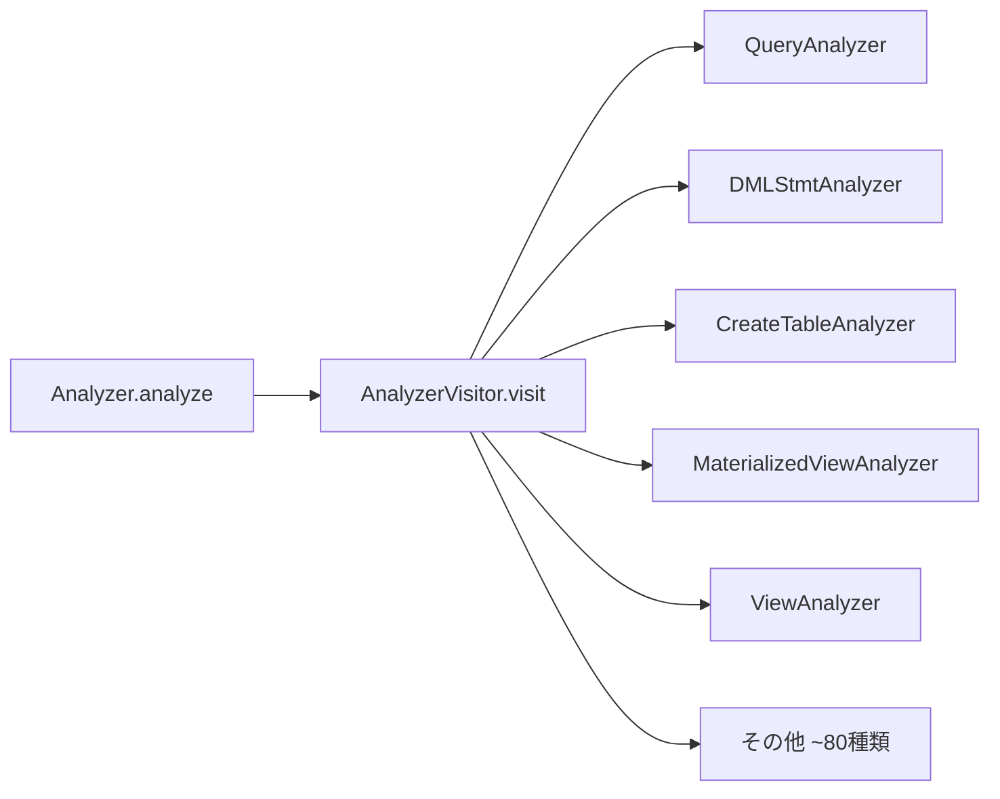
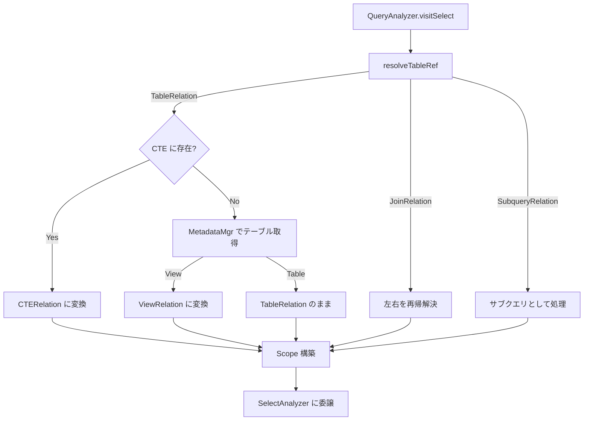
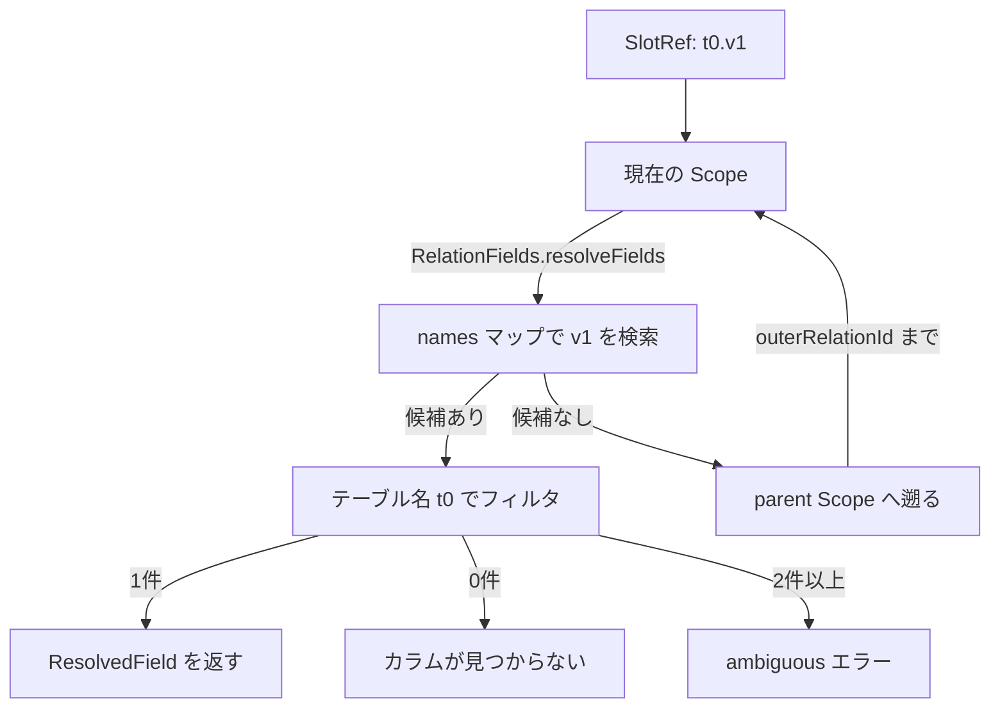
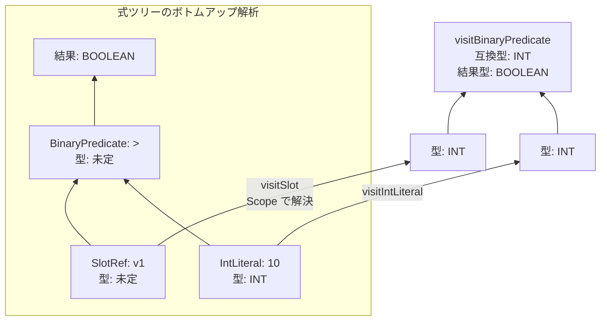

# 第5章 Analyzer と意味解析

> **本章で読むソース**
>
> - [`fe/fe-core/src/main/java/com/starrocks/sql/analyzer/Analyzer.java`](https://github.com/StarRocks/starrocks/blob/4.1.1/fe/fe-core/src/main/java/com/starrocks/sql/analyzer/Analyzer.java)
> - [`fe/fe-core/src/main/java/com/starrocks/sql/analyzer/QueryAnalyzer.java`](https://github.com/StarRocks/starrocks/blob/4.1.1/fe/fe-core/src/main/java/com/starrocks/sql/analyzer/QueryAnalyzer.java)
> - [`fe/fe-core/src/main/java/com/starrocks/sql/analyzer/SelectAnalyzer.java`](https://github.com/StarRocks/starrocks/blob/4.1.1/fe/fe-core/src/main/java/com/starrocks/sql/analyzer/SelectAnalyzer.java)
> - [`fe/fe-core/src/main/java/com/starrocks/sql/analyzer/ExpressionAnalyzer.java`](https://github.com/StarRocks/starrocks/blob/4.1.1/fe/fe-core/src/main/java/com/starrocks/sql/analyzer/ExpressionAnalyzer.java)
> - [`fe/fe-core/src/main/java/com/starrocks/sql/analyzer/Scope.java`](https://github.com/StarRocks/starrocks/blob/4.1.1/fe/fe-core/src/main/java/com/starrocks/sql/analyzer/Scope.java)
> - [`fe/fe-core/src/main/java/com/starrocks/sql/analyzer/AnalyzeState.java`](https://github.com/StarRocks/starrocks/blob/4.1.1/fe/fe-core/src/main/java/com/starrocks/sql/analyzer/AnalyzeState.java)
> - [`fe/fe-core/src/main/java/com/starrocks/sql/analyzer/RelationFields.java`](https://github.com/StarRocks/starrocks/blob/4.1.1/fe/fe-core/src/main/java/com/starrocks/sql/analyzer/RelationFields.java)
> - [`fe/fe-core/src/main/java/com/starrocks/sql/analyzer/Authorizer.java`](https://github.com/StarRocks/starrocks/blob/4.1.1/fe/fe-core/src/main/java/com/starrocks/sql/analyzer/Authorizer.java)

## この章の狙い

パーサーが生成した AST はカラム名の型が不明で、テーブル参照も未解決の状態にある。
Analyzer はこの AST を入力に受け取り、テーブルの実在確認、カラム名の解決、式の型推論、暗黙キャストの挿入、権限チェックを行う。
本章では Analyzer の文種別ディスパッチから始め、SELECT 文の意味解析を中心に、スコープ管理と式の型推論の仕組みを追う。

## 前提

第4章までで扱った SQL パーサーの出力(AST)の構造を理解していること。
Visitor パターンの基本を知っていること。

## Analyzer のディスパッチ構造

**Analyzer** クラスは意味解析のエントリポイントである。
外部からは静的メソッド `Analyzer.analyze()` を呼ぶだけで、文種別に応じた解析が始まる。

[`fe/fe-core/src/main/java/com/starrocks/sql/analyzer/Analyzer.java` L190-L199](https://github.com/StarRocks/starrocks/blob/4.1.1/fe/fe-core/src/main/java/com/starrocks/sql/analyzer/Analyzer.java#L190-L199)

```java
public class Analyzer {
    private final AnalyzerVisitor analyzerVisitor;

    public Analyzer(AnalyzerVisitor analyzerVisitor) {
        this.analyzerVisitor = analyzerVisitor;
    }

    public static void analyze(StatementBase statement, ConnectContext context) {
        GlobalStateMgr.getCurrentState().getAnalyzer().analyzerVisitor.visit(statement, context);
    }
```

内部クラス **AnalyzerVisitor** がシングルトンとして保持されている。
`AstVisitorExtendInterface` を実装しており、AST ノードの型に応じた `visit` メソッドが呼ばれる。

[`fe/fe-core/src/main/java/com/starrocks/sql/analyzer/Analyzer.java` L201-L206](https://github.com/StarRocks/starrocks/blob/4.1.1/fe/fe-core/src/main/java/com/starrocks/sql/analyzer/Analyzer.java#L201-L206)

```java
    public static class AnalyzerVisitor implements AstVisitorExtendInterface<Void, ConnectContext> {
        private static final Analyzer.AnalyzerVisitor INSTANCE = new Analyzer.AnalyzerVisitor();

        public static Analyzer.AnalyzerVisitor getInstance() {
            return INSTANCE;
        }
```

各 `visit` メソッドは、文種別に特化した Analyzer クラスへ処理を委譲する。
たとえば `QueryStatement` が来ると `QueryAnalyzer` へ、`InsertStmt` が来ると `DMLStmtAnalyzer` へ、`CreateTableStmt` が来ると `CreateTableAnalyzer` へ転送される。

[`fe/fe-core/src/main/java/com/starrocks/sql/analyzer/Analyzer.java` L497-L500](https://github.com/StarRocks/starrocks/blob/4.1.1/fe/fe-core/src/main/java/com/starrocks/sql/analyzer/Analyzer.java#L497-L500)

```java
        public Void visitQueryStatement(QueryStatement stmt, ConnectContext session) {
            new QueryAnalyzer(session).analyze(stmt);
            return null;
        }
```

`AnalyzerVisitor` は約1,100行にわたり、DDL、DML、認証、カタログ、ストレージボリュームなど約80種類の文に対応する `visit` メソッドを持つ。
この設計により、各 Analyzer は自身が担当する文の意味解析だけに集中できる。



## QueryAnalyzer によるリレーション解決

**QueryAnalyzer** は `QueryStatement` の解析を担当する。
コンストラクタで `ConnectContext`(セッション情報)と `MetadataMgr`(メタデータアクセス)を受け取る。

[`fe/fe-core/src/main/java/com/starrocks/sql/analyzer/QueryAnalyzer.java` L134-L145](https://github.com/StarRocks/starrocks/blob/4.1.1/fe/fe-core/src/main/java/com/starrocks/sql/analyzer/QueryAnalyzer.java#L134-L145)

```java
public class QueryAnalyzer {
    private final ConnectContext session;
    private final MetadataMgr metadataMgr;

    public QueryAnalyzer(ConnectContext session) {
        this.session = session;
        this.metadataMgr = GlobalStateMgr.getCurrentState().getMetadataMgr();
    }

    public void analyze(StatementBase node) {
        new Visitor().process(node, new Scope(RelationId.anonymous(), new RelationFields()));
    }
```

`analyze` メソッドは空の「Scope」を初期スコープとして渡し、内部の `Visitor` で AST を走査する。
この Visitor は `AstVisitorExtendInterface<Scope, Scope>` を実装しており、戻り値として解析後のスコープを返す。

### CTE の解析

`visitQueryRelation` の最初のステップは CTE の解析である。
`analyzeCTE` は CTE 専用のスコープを作り、WITH 句に定義された各 CTE を順番に処理する。

[`fe/fe-core/src/main/java/com/starrocks/sql/analyzer/QueryAnalyzer.java` L355-L366](https://github.com/StarRocks/starrocks/blob/4.1.1/fe/fe-core/src/main/java/com/starrocks/sql/analyzer/QueryAnalyzer.java#L355-L366)

```java
        public Scope visitQueryRelation(QueryRelation node, Scope parent) {
            Scope scope = analyzeCTE(node, parent);
            return process(node, scope);
        }

        private Scope analyzeCTE(QueryRelation stmt, Scope scope) {
            Scope cteScope = new Scope(RelationId.anonymous(), new RelationFields());
            cteScope.setParent(scope);

            if (!stmt.hasWithClause()) {
                return cteScope;
            }
```

CTE は定義順に処理される。
後の CTE は先に定義された CTE を参照できるが、逆方向の参照はできない。
処理された CTE は `cteScope.addCteQueries()` で登録され、FROM 句のテーブル解決時に参照される。

### SELECT 文の解析フロー

`visitSelect` は SELECT 文解析の中心である。
FROM 句のリレーション解決、スコープ構築、SelectAnalyzer への委譲という手順で進む。

[`fe/fe-core/src/main/java/com/starrocks/sql/analyzer/QueryAnalyzer.java` L489-L543](https://github.com/StarRocks/starrocks/blob/4.1.1/fe/fe-core/src/main/java/com/starrocks/sql/analyzer/QueryAnalyzer.java#L489-L543)

```java
        @Override
        public Scope visitSelect(SelectRelation selectRelation, Scope scope) {
            AnalyzeState analyzeState = new AnalyzeState();
            //Record aliases at this level to prevent alias conflicts
            Set<TableName> aliasSet = new HashSet<>();
            Relation resolvedRelation = resolveTableRef(selectRelation.getRelation(), scope, aliasSet);
            // ... (中略) ...
            selectRelation.setRelation(resolvedRelation);
            //for avoid init column meta, try to prune unused columns
            pruneScanColumns(selectRelation, resolvedRelation);
            Scope sourceScope = process(resolvedRelation, scope);
            sourceScope.setParent(scope);
            // ... (中略) ...
                SelectAnalyzer selectAnalyzer = new SelectAnalyzer(session);
                selectAnalyzer.analyze(
                        analyzeState,
                        selectRelation.getSelectList(),
                        selectRelation.getRelation(),
                        sourceScope,
                        selectRelation.getGroupByClause(),
                        selectRelation.getHavingClause(),
                        selectRelation.getWhereClause(),
                        selectRelation.getOrderBy(),
                        selectRelation.getLimit());

                selectRelation.fillResolvedAST(analyzeState);

```

この処理は次の順序で行われる。

1. `resolveTableRef` で FROM 句のリレーションを解決する(テーブル名 → テーブルオブジェクト、CTE 参照の展開、ビューの展開)
2. `pruneScanColumns` で不要カラムの初期化を回避する
3. `process(resolvedRelation, scope)` で解決済みリレーションからスコープ(利用可能なカラムの名前空間)を構築する
4. `SelectAnalyzer.analyze()` で SELECT 句以降の各句を解析する

### テーブル参照の解決

`resolveTableRef` は FROM 句に現れるリレーションを再帰的に解決する。
処理の分岐は次のとおりである。

- **JoinRelation**：左右の子を再帰的に解決する
- **TableRelation**：まず CTE スコープで名前を検索し、見つかればCTERelation に変換する。見つからなければ `MetadataMgr` でテーブルメタデータを取得する。取得結果が View であれば ViewRelation に変換する

[`fe/fe-core/src/main/java/com/starrocks/sql/analyzer/QueryAnalyzer.java` L648-L686](https://github.com/StarRocks/starrocks/blob/4.1.1/fe/fe-core/src/main/java/com/starrocks/sql/analyzer/QueryAnalyzer.java#L648-L686)

```java
            } else if (relation instanceof TableRelation) {
                TableRelation tableRelation = (TableRelation) relation;
                TableName tableName = tableRelation.getName();
                if (tableName != null && Strings.isNullOrEmpty(tableName.getDb())) {
                    Optional<CTERelation> withQuery = scope.getCteQueries(tableName.getTbl());
                    if (withQuery.isPresent()) {
                        CTERelation withRelation = withQuery.get();
                        withRelation.addTableRef();
                        // ... (中略) ...
                        // The CTERelation stored in the Scope is not used directly here, but a new Relation is copied.
                        // It is because we hope to obtain a new RelationId to distinguish multiple cte reuses.
                        // Because the reused cte should not be considered the same relation.
                        // ... (中略) ...
                        CTERelation newCteRelation = new CTERelation(withRelation.getCteMouldId(), tableName.getTbl(),
                                withRelation.getColumnOutputNames(), withRelation.getCteQueryStatement(),
                                withRelation.isRecursive(), false);
                        // ... (中略) ...
                        return newCteRelation;
                    }
                }

```

CTE が複数箇所で参照される場合、同じ `CTERelation` を再利用するのではなく、新しい `RelationId` を付与したコピーを作る。
これは、同じ CTE でも参照位置ごとに独立したカラム参照を持たせるためである。

ビューの解決では、テーブル名で取得した結果が `View` クラスであれば、ビューの定義 SQL をパースした `QueryStatement` を持つ `ViewRelation` に変換する。

[`fe/fe-core/src/main/java/com/starrocks/sql/analyzer/QueryAnalyzer.java` L706-L736](https://github.com/StarRocks/starrocks/blob/4.1.1/fe/fe-core/src/main/java/com/starrocks/sql/analyzer/QueryAnalyzer.java#L706-L736)

```java
                if (table instanceof View) {
                    View view = (View) table;
                    QueryStatement queryStatement = view.getQueryStatement();
                    ViewRelation viewRelation = new ViewRelation(tableName, view, queryStatement);
                    // ... (中略) ...
                    r = viewRelation;

```

### テーブルスコープの構築

`visitTable` はテーブルのカラム情報から `Field` のリストを生成し、`Scope` を構築する。

[`fe/fe-core/src/main/java/com/starrocks/sql/analyzer/QueryAnalyzer.java` L803-L910](https://github.com/StarRocks/starrocks/blob/4.1.1/fe/fe-core/src/main/java/com/starrocks/sql/analyzer/QueryAnalyzer.java#L803-L910)

```java
        @Override
        public Scope visitTable(TableRelation node, Scope outerScope) {
            TableName tableName = node.getResolveTableName();
            Table table = node.getTable();

            ImmutableList.Builder<Field> fields = ImmutableList.builder();
            ImmutableMap.Builder<Field, Column> columns = ImmutableMap.builder();
            // ... (中略) ...
                List<Column> fullSchema = table.getFullSchema();
                // ... (中略) ...
                for (Column column : fullSchema) {
                    // ... (中略) ...
                    // only output visible columns
                    boolean visible = column.isVisible() && baseSchema.contains(column);
                    SlotRef slot = new SlotRef(tableName, column.getName(), column.getName());
                    Field field = new Field(column.getName(), column.getType(), tableName, slot, visible,
                            column.isAllowNull());
                    columns.put(field, column);
                    fields.add(field);
                }
            // ... (中略) ...
            Scope scope = new Scope(RelationId.of(node), new RelationFields(fields.build()));
            node.setScope(scope);
            // ... (中略) ...
            return scope;
        }

```

各カラムは `Field` オブジェクトに変換される。
`Field` はカラム名、型、所属テーブル名、可視性、NULL 許容性を保持する。
これらの `Field` をまとめた `RelationFields` と、リレーション固有の `RelationId` を組み合わせて `Scope` が完成する。

### JOIN のスコープ構築

`visitJoin` は左右のリレーションをそれぞれ処理してスコープを取得し、JOIN 種別に応じて結合スコープを構築する。

[`fe/fe-core/src/main/java/com/starrocks/sql/analyzer/QueryAnalyzer.java` L972-L1010](https://github.com/StarRocks/starrocks/blob/4.1.1/fe/fe-core/src/main/java/com/starrocks/sql/analyzer/QueryAnalyzer.java#L972-L1010)

```java
        @Override
        public Scope visitJoin(JoinRelation join, Scope parentScope) {
            // ... (中略) ...
            Scope leftScope = process(join.getLeft(), parentScope);
            Scope rightScope;
            if (join.getRight() instanceof TableFunctionRelation || join.isLateral()) {
                // ... (中略) ...
                rightScope = process(join.getRight(), leftScope);
            } else {
                rightScope = process(join.getRight(), parentScope);
            }

```

LATERAL JOIN の場合、右側のリレーション(テーブル関数)は左側のスコープを親に持つ。
左側のカラムを参照できるようにするためである。
通常の JOIN では左右が独立して `parentScope` を参照する。

JOIN 種別に応じたスコープ構築ルールは次のとおりである。

- **LEFT SEMI/ANTI JOIN**：左側のフィールドのみを公開する
- **RIGHT SEMI/ANTI JOIN**：右側のフィールドのみを公開する
- **LEFT OUTER JOIN**：右側のフィールドを NULL 許容に設定してから結合する
- **RIGHT OUTER JOIN**：左側のフィールドを NULL 許容に設定してから結合する
- **FULL OUTER JOIN**：両側のフィールドを NULL 許容に設定してから結合する
- **INNER JOIN, CROSS JOIN**：左右のフィールドをそのまま結合する

### ビューとサブクエリの解析

`visitView` はビューの定義 SQL をパースした `QueryStatement` を再帰的に解析し、ビューのスキーマに基づいたスコープを返す。

[`fe/fe-core/src/main/java/com/starrocks/sql/analyzer/QueryAnalyzer.java` L1424-L1463](https://github.com/StarRocks/starrocks/blob/4.1.1/fe/fe-core/src/main/java/com/starrocks/sql/analyzer/QueryAnalyzer.java#L1424-L1463)

```java
        @Override
        public Scope visitView(ViewRelation node, Scope scope) {
            // ... (中略) ...
            Scope queryOutputScope;
            try {
                queryOutputScope = process(node.getQueryStatement(), scope);
            } catch (SemanticException e) {
                throw new SemanticException("View " + node.getName() + " references invalid table(s) or column(s) or " +
                        "function(s) or definer/invoker of view lack rights to use them: " + e.getMessage(), e);
            } finally {
                // ... (中略) ...
            }

            View view = node.getView();
            List<Field> fields = Lists.newArrayList();
            for (int i = 0; i < view.getBaseSchema().size(); ++i) {
                Column column = view.getBaseSchema().get(i);
                Field originField = queryOutputScope.getRelationFields().getFieldByIndex(i);
                // ... (中略) ...
                Field field = new Field(column.getName(), originField.getType(), node.getResolveTableName(),
                        originField.getOriginExpression());
                fields.add(field);
            }

```

出力スコープのフィールド名はビュー定義時に指定されたカラム名を使い、型はクエリ実行結果の型を使う。
ビューの内部クエリでエラーが発生した場合は、ビュー名を付与したメッセージで再スローする。

`visitSubqueryRelation` も同様に、サブクエリの `QueryStatement` を処理してスコープを構築する。
サブクエリにはエイリアスが必須であり、省略するとエラーになる。



## SelectAnalyzer による SELECT 句の解析

**SelectAnalyzer** は SELECT 文の各句を定められた順序で解析する。
`analyze` メソッドのシグネチャに、処理対象の全情報が引数として渡される。

[`fe/fe-core/src/main/java/com/starrocks/sql/analyzer/SelectAnalyzer.java` L78-L87](https://github.com/StarRocks/starrocks/blob/4.1.1/fe/fe-core/src/main/java/com/starrocks/sql/analyzer/SelectAnalyzer.java#L78-L87)

```java
    public void analyze(AnalyzeState analyzeState,
                        SelectList selectList,
                        Relation fromRelation,
                        Scope sourceScope,
                        GroupByClause groupByClause,
                        Expr havingClause,
                        Expr whereClause,
                        List<OrderByElement> sortClause,
                        LimitElement limitElement) {
        analyzeWhere(whereClause, analyzeState, sourceScope);
```

### 解析の順序

解析は SQL の構文上の出現順ではなく、意味的な依存関係に基づいた順序で行われる。

[`fe/fe-core/src/main/java/com/starrocks/sql/analyzer/SelectAnalyzer.java` L87-L116](https://github.com/StarRocks/starrocks/blob/4.1.1/fe/fe-core/src/main/java/com/starrocks/sql/analyzer/SelectAnalyzer.java#L87-L116)

```java
        analyzeWhere(whereClause, analyzeState, sourceScope);

        List<Expr> outputExpressions =
                analyzeSelect(selectList, fromRelation, analyzeState, sourceScope);
        Scope outputScope = analyzeState.getOutputScope();

        List<Expr> groupByExpressions = new ArrayList<>(
                analyzeGroupBy(groupByClause, analyzeState, sourceScope, outputScope, outputExpressions));
        // ... (中略) ...
        analyzeHaving(havingClause, analyzeState, sourceScope, outputScope, outputExpressions);

        // Construct sourceAndOutputScope with sourceScope and outputScope
        Scope sourceAndOutputScope = computeAndAssignOrderScope(analyzeState, sourceScope, outputScope,
                selectList.isDistinct());

        List<OrderByElement> orderByElements =
                analyzeOrderBy(sortClause, analyzeState, sourceAndOutputScope, outputExpressions, selectList.isDistinct());

```

順序とその理由をまとめると次のようになる。

1. **WHERE**：FROM 句のスコープのみを参照する。出力カラム名やエイリアスは参照できない
2. **SELECT リスト**：FROM 句のスコープで式を解析し、出力スコープ(エイリアスを含む)を構築する
3. **GROUP BY**：FROM 句スコープと出力スコープの両方を参照する。出力のエイリアスを GROUP BY で使える
4. **HAVING**：GROUP BY と出力スコープの両方を参照する
5. **ORDER BY**：FROM 句スコープと出力スコープを結合した「sourceAndOutputScope」を参照する。出力カラムのエイリアスで並べ替えられる
6. **LIMIT**：定数のみ受け付ける

### SELECT リストの解析

`analyzeSelect` は SELECT リストの各項目を処理して出力式と出力スコープを構築する。

[`fe/fe-core/src/main/java/com/starrocks/sql/analyzer/SelectAnalyzer.java` L214-L354](https://github.com/StarRocks/starrocks/blob/4.1.1/fe/fe-core/src/main/java/com/starrocks/sql/analyzer/SelectAnalyzer.java#L214-L354)

```java
    private List<Expr> analyzeSelect(SelectList selectList, Relation fromRelation, AnalyzeState analyzeState, Scope scope) {
        ImmutableList.Builder<Expr> outputExpressionBuilder = ImmutableList.builder();
        ImmutableList.Builder<Field> outputFields = ImmutableList.builder();
        // ... (中略) ...
        for (SelectListItem item : selectList.getItems()) {
            if (item.isStar()) {
                // ... (中略) ...
                for (Field field : fields) {
                    int fieldIndex = scope.getRelationFields().indexOf(field);
                    // ... (中略) ...
                    FieldReference fieldReference =
                            new FieldReference(fieldIndex, item.getTblName() == null ? null : item.getTblName().toString());
                    analyzeExpression(fieldReference, analyzeState, scope);
                    outputExpressionBuilder.add(fieldReference);
                }
                outputFields.addAll(fields);

            } else {
                // ... (中略) ...
                analyzeExpression(item.getExpr(), analyzeState, scope);
                outputExpressionBuilder.add(item.getExpr());
                // ... (中略) ...
            }
            // ... (中略) ...
        }

```

`*`(スター)は、スコープ内の可視フィールドすべてを `FieldReference` に展開する。
通常の式はそのまま `ExpressionAnalyzer` で解析される。
各出力式に対応する `Field` が生成され、エイリアス付きであればそのエイリアスが `Field` の名前になる。

### 集約の検証

集約関数が含まれる場合、`AggregationAnalyzer` が SELECT リストと ORDER BY 式を検証する。
GROUP BY に含まれないカラムが集約関数の外で参照されていないかをチェックする。

[`fe/fe-core/src/main/java/com/starrocks/sql/analyzer/SelectAnalyzer.java` L124-L145](https://github.com/StarRocks/starrocks/blob/4.1.1/fe/fe-core/src/main/java/com/starrocks/sql/analyzer/SelectAnalyzer.java#L124-L145)

```java
        List<FunctionCallExpr> aggregates = analyzeAggregations(analyzeState, sourceScope,
                Stream.concat(sourceExpressions.stream(), orderByExpressions.stream()).collect(Collectors.toList()));
        if (AnalyzerUtils.isAggregate(aggregates, groupByExpressions)) {
            // ... (中略) ...
            new AggregationAnalyzer(session, analyzeState, groupByExpressions, sourceScope, null)
                    .verify(sourceExpressions);

            if (!orderByElements.isEmpty()) {
                new AggregationAnalyzer(session, analyzeState, groupByExpressions, sourceScope, sourceAndOutputScope)
                        .verify(orderByExpressions);
            }
        }

```

`MODE_ONLY_FULL_GROUP_BY` が無効の場合は、GROUP BY に含まれないカラムを `any_value()` 集約関数でラップする。

## Scope と RelationFields によるカラム名解決

### Scope の構造

**Scope** はカラム名を解決するための名前空間を表す。
`parent` ポインタによる階層構造を持ち、CTE の名前空間と `RelationFields`(フィールドのリスト)を保持する。

[`fe/fe-core/src/main/java/com/starrocks/sql/analyzer/Scope.java` L35-L48](https://github.com/StarRocks/starrocks/blob/4.1.1/fe/fe-core/src/main/java/com/starrocks/sql/analyzer/Scope.java#L35-L48)

```java
public class Scope {
    private Scope parent;
    private final RelationId relationId;
    private final RelationFields relationFields;
    private final Map<String, CTERelation> cteQueries = Maps.newLinkedHashMap();

    private List<PlaceHolderExpr> lambdaInputs = Lists.newArrayList();

    private boolean isLambdaScope = false;

    public Scope(RelationId relationId, RelationFields relation) {
        this.relationId = relationId;
        this.relationFields = relation;
    }
```

### カラム名の解決アルゴリズム

`resolveField` は `SlotRef`(カラム参照)を受け取り、現在のスコープの `RelationFields` から一致するフィールドを探す。
見つからない場合は `parent` スコープへ遡る。

[`fe/fe-core/src/main/java/com/starrocks/sql/analyzer/Scope.java` L102-L123](https://github.com/StarRocks/starrocks/blob/4.1.1/fe/fe-core/src/main/java/com/starrocks/sql/analyzer/Scope.java#L102-L123)

```java
    private Optional<ResolvedField> resolveField(SlotRef expression, int fieldIndexOffset, RelationId outerRelationId) {
        List<Field> matchFields = relationFields.resolveFields(expression);
        if (matchFields.size() > 1) {
            throw new SemanticException("Column '%s' is ambiguous", expression.getColumnName());
        } else if (matchFields.size() == 1) {
            if (matchFields.get(0).getType().getPrimitiveType().equals(PrimitiveType.UNKNOWN_TYPE)) {
                throw new SemanticException("Datatype of external table column [" + matchFields.get(0).getName()
                        + "] is not supported!");
            } else {
                return Optional.of(asResolvedField(matchFields.get(0), fieldIndexOffset));
            }
        } else {
            if (parent != null
                    //Correlated subqueries currently only support accessing properties in the first level outer layer
                    && !relationId.equals(outerRelationId)
                    || parent != null && isLambdaScope) { // also to analyze the nested lambda arguments.
                return parent.resolveField(expression, fieldIndexOffset + relationFields.getAllFields().size(),
                        outerRelationId);
            }
            return Optional.empty();
        }
    }
```

この処理には3つの重要な特徴がある。

1. 一致するフィールドが2つ以上あれば「Column is ambiguous」エラーを返す
2. 親スコープへの遡りは `outerRelationId` で制御される。相関サブクエリでは、外側のリレーションまでが遡り可能な範囲となる
3. `fieldIndexOffset` は階層をまたぐフィールドインデックスの計算に使われる。子スコープのフィールド数を加算して、親スコープでの正しいインデックスを算出する

### RelationFields の名前インデックス

**RelationFields** はフィールドのリストを保持し、名前によるルックアップを提供する。

[`fe/fe-core/src/main/java/com/starrocks/sql/analyzer/RelationFields.java` L45-L60](https://github.com/StarRocks/starrocks/blob/4.1.1/fe/fe-core/src/main/java/com/starrocks/sql/analyzer/RelationFields.java#L45-L60)

```java
    public RelationFields(List<Field> fields) {
        this(fields, false);
    }

    public RelationFields(List<Field> fields, boolean fromFullOuterJoinUsing) {
        requireNonNull(fields, "fields is null");
        this.allFields = ImmutableList.copyOf(fields);
        this.resolveStruct = fields.stream().anyMatch(x -> x.getType().isStructType());
        this.fromFullOuterJoinUsing = fromFullOuterJoinUsing;
        if (!resolveStruct) {
            this.names = this.allFields.stream().collect(ImmutableListMultimap.toImmutableListMultimap(
                    x -> x.getName().toLowerCase(), x -> x));
        } else {
            this.names = null;
        }
    }
```

構造体型を含まない通常のケースでは、コンストラクタの時点で `ImmutableListMultimap`(カラム名の小文字 → Field の一覧)を構築する。
この事前構築により、`resolveFields` での名前検索は O(1) のハッシュテーブルルックアップになる。

[`fe/fe-core/src/main/java/com/starrocks/sql/analyzer/RelationFields.java` L92-L115](https://github.com/StarRocks/starrocks/blob/4.1.1/fe/fe-core/src/main/java/com/starrocks/sql/analyzer/RelationFields.java#L92-L115)

```java
    public List<Field> resolveFields(SlotRef name) {
        if (resolveStruct) {
            return allFields.stream().filter(x -> x.canResolve(name)).collect(Collectors.toList());
        }
        // Resolve the slot based on column name first, then table name
        // For the case a table with thousands of columns, resolve by table name could not reduce the cardinality,
        // but resolve by column name first could reduce it a lot
        List<Field> resolved =
                names.get(name.getColumnName().toLowerCase()).stream().collect(ImmutableList.toImmutableList());

        if (name.getTblNameWithoutAnalyzed() == null) {
            // ... (中略) ...
            return resolved;
        } else {
            return resolved.stream().filter(input -> input.canResolve(name)).collect(toImmutableList());
        }
    }

```

カラム名で絞り込んだ後にテーブル名でフィルタする二段階方式を取る。
テーブルに数千のカラムがある場合でも、まずカラム名のハッシュで候補を1つか2つに絞れるため、テーブル名の文字列比較の回数が最小化される。



## ExpressionAnalyzer による式の型推論

**ExpressionAnalyzer** は式ツリーを下から上へ(ボトムアップで)走査し、各ノードの型を決定する。

### ボトムアップ解析

`bottomUpAnalyze` は子ノードを先に解析してから親ノードの `visit` を呼ぶ。

[`fe/fe-core/src/main/java/com/starrocks/sql/analyzer/ExpressionAnalyzer.java` L420-L442](https://github.com/StarRocks/starrocks/blob/4.1.1/fe/fe-core/src/main/java/com/starrocks/sql/analyzer/ExpressionAnalyzer.java#L420-L442)

```java
    private void bottomUpAnalyze(Visitor visitor, Expr expression, Scope scope) {
        boolean hasLambdaFunc = false;
        try {
            hasLambdaFunc = ExprUtils.hasLambdaFunction(expression);
        } catch (SemanticException e) {
            throw e.appendOnlyOnceMsg(ExprToSql.toSql(expression), expression.getPos());
        }
        if (hasLambdaFunc) {
            // ... (中略) ...
                analyzeHighOrderFunction(visitor, expression, scope);
                visitor.visit(expression, scope);
        } else {
            for (Expr expr : expression.getChildren()) {
                bottomUpAnalyze(visitor, expr, scope);
            }
            visitor.visit(expression, scope);
        }
    }

```

通常の式は、まず全子ノードを再帰的に解析してから、自身の `visit` メソッドが呼ばれる。
ラムダ関数(高階関数)を含む場合は特別な解析パスを通る。
子ノードの型がすべて確定した状態で親の型推論が行われるため、型情報が式ツリーの末端から根へ伝播する。

### カラム参照(SlotRef)の解決

`visitSlot` はカラム参照を `Scope` で解決し、型とテーブル名を設定する。

[`fe/fe-core/src/main/java/com/starrocks/sql/analyzer/ExpressionAnalyzer.java` L493-L516](https://github.com/StarRocks/starrocks/blob/4.1.1/fe/fe-core/src/main/java/com/starrocks/sql/analyzer/ExpressionAnalyzer.java#L493-L516)

```java
        @Override
        public Void visitSlot(SlotRef node, Scope scope) {
            ResolvedField resolvedField = scope.resolveField(node);
            node.setType(resolvedField.getField().getType());
            node.setTblName(resolvedField.getField().getRelationAlias());
            node.setNullable(resolvedField.getField().isNullable());
            // ... (中略) ...
            handleResolvedField(node, resolvedField);
            return null;
        }

```

`handleResolvedField` は `AnalyzeState` にカラム参照の情報を記録する。
この情報は後続のオプティマイザで、2つの式が同一カラムに由来するかを判定するために使われる。

### 二項述語の型推論

`visitBinaryPredicate` は二項比較式(`=`, `<`, `>` など)の型を推論する。

[`fe/fe-core/src/main/java/com/starrocks/sql/analyzer/ExpressionAnalyzer.java` L738-L776](https://github.com/StarRocks/starrocks/blob/4.1.1/fe/fe-core/src/main/java/com/starrocks/sql/analyzer/ExpressionAnalyzer.java#L738-L776)

```java
        @Override
        public Void visitBinaryPredicate(BinaryPredicate node, Scope scope) {
            Type type1 = node.getChild(0).getType();
            Type type2 = node.getChild(1).getType();

            Type compatibleType =
                    TypeManager.getCompatibleTypeForBinary(!node.getOp().isNotRangeComparison(), type1, type2);
            // check child type can be cast
            final String ERROR_MSG = "Column type %s does not support binary predicate operation with type %s";
            if (!TypeManager.canCastTo(type1, compatibleType)) {
                throw new SemanticException(String.format(ERROR_MSG, type1.toSql(), type2.toSql()), node.getPos());
            }
            // ... (中略) ...
            node.setType(BooleanType.BOOLEAN);
            return null;
        }

```

左右の子ノードの型から `TypeManager.getCompatibleTypeForBinary` で共通の互換型を計算する。
たとえば `INT` と `BIGINT` の比較では `BIGINT` が互換型となる。
子ノードの型がこの互換型にキャストできない場合はエラーになる。
二項述語自体の型は常に `BOOLEAN` に設定される。

### 関数呼び出しの解決

`visitFunctionCall` は関数名と引数の型から一致する関数定義を検索する。

[`fe/fe-core/src/main/java/com/starrocks/sql/analyzer/ExpressionAnalyzer.java` L1027-L1128](https://github.com/StarRocks/starrocks/blob/4.1.1/fe/fe-core/src/main/java/com/starrocks/sql/analyzer/ExpressionAnalyzer.java#L1027-L1128)

```java
        @Override
        public Void visitFunctionCall(FunctionCallExpr node, Scope scope) {
            if (node.isNondeterministicBuiltinFnName()) {
                ExprId exprId = analyzeState.getNextNondeterministicId();
                node.setNondeterministicId(exprId);
            }
            String fnName = node.getFunctionName();
            // ... (中略) ...
            Type[] argumentTypes = node.getChildren().stream().map(Expr::getType).toArray(Type[]::new);
            // check fn & throw exception direct if analyze failed
            checkFunction(fnName, node, argumentTypes);
            // get function by function expression and argument types
            Function fn = FunctionAnalyzer.getAnalyzedFunction(session, node, argumentTypes);
            if (fn == null) {
                String msg = String.format("No matching function with signature: %s(%s)",
                        fnName,
                        node.getParams().isStar() ? "*" : Joiner.on(", ")
                                .join(Arrays.stream(argumentTypes).map(Type::toSql).collect(Collectors.toList())));
                throw new SemanticException(msg, node.getPos());
            }
            node.setFn(fn);
            node.setType(fn.getReturnType());
            FunctionAnalyzer.analyze(node);
            return null;
        }

```

処理の手順は次のとおりである。

1. 非決定性関数(`rand()` など)には一意な ID を割り振る。同じ関数が複数箇所で使われても、異なる呼び出しとして区別するためである
2. 子ノードの型から引数型の配列を構築する
3. `checkFunction` で特定の関数(例: `time_slice` の第2引数が正の定数か)のバリデーションを行う
4. `FunctionAnalyzer.getAnalyzedFunction` で関数定義を検索する。引数型の厳密一致だけでなく、暗黙キャストで一致する関数も候補になる
5. 見つかった関数の戻り値型をノードに設定する

### CAST 式の検証

`visitCastExpr` は明示的キャストと暗黙キャストの両方を処理する。

[`fe/fe-core/src/main/java/com/starrocks/sql/analyzer/ExpressionAnalyzer.java` L1007-L1025](https://github.com/StarRocks/starrocks/blob/4.1.1/fe/fe-core/src/main/java/com/starrocks/sql/analyzer/ExpressionAnalyzer.java#L1007-L1025)

```java
        public Void visitCastExpr(CastExpr cast, Scope context) {
            Type castType;
            // If cast expr is implicit, targetTypeDef is null
            if (cast.isImplicit()) {
                castType = cast.getType();
            } else {
                castType = cast.getTargetTypeDef().getType();
            }
            Type fromType = cast.getChild(0).getType();
            if (!TypeManager.canCastTo(fromType, castType)) {
                throw new SemanticException("Invalid type cast from " + fromType.toSql() + " to "
                        + castType.toSql() + " in sql `" +
                        AstToStringBuilder.toString(cast.getChild(0)).replace("%", "%%") + "`",
                        cast.getPos());
            }

            cast.setType(castType);
            return null;
        }
```

`TypeManager.canCastTo` がソース型からターゲット型への変換可能性を判定する。
変換不可能な場合(例: `ARRAY` から `INT` へのキャスト)はエラーを返す。



## 権限チェックの統合

意味解析が完了した後、**Authorizer** がアクセス権限を検証する。
`Authorizer.check()` は `AccessControlProvider` 経由で `AuthorizerStmtVisitor` を呼び出す。

[`fe/fe-core/src/main/java/com/starrocks/sql/analyzer/Authorizer.java` L48-L61](https://github.com/StarRocks/starrocks/blob/4.1.1/fe/fe-core/src/main/java/com/starrocks/sql/analyzer/Authorizer.java#L48-L61)

```java
public class Authorizer {
    private final AccessControlProvider accessControlProvider;

    public Authorizer(AccessControlProvider accessControlProvider) {
        this.accessControlProvider = accessControlProvider;
    }

    public static AccessControlProvider getInstance() {
        return GlobalStateMgr.getCurrentState().getAuthorizer().accessControlProvider;
    }

    public static void check(StatementBase statement, ConnectContext context) {
        getInstance().getPrivilegeCheckerVisitor().check(statement, context);
    }
```

`AuthorizerStmtVisitor` は AST を再度走査し、テーブル、ビュー、カタログなどのオブジェクトに対するアクセス権を検証する。

[`fe/fe-core/src/main/java/com/starrocks/sql/analyzer/AuthorizerStmtVisitor.java` L283-L310](https://github.com/StarRocks/starrocks/blob/4.1.1/fe/fe-core/src/main/java/com/starrocks/sql/analyzer/AuthorizerStmtVisitor.java#L283-L310)

```java
    @Override
    public Void visitQueryStatement(QueryStatement statement, ConnectContext context) {
        checkSelectTableAction(context, statement, Lists.newArrayList());
        // ... (中略) ...
        return null;
    }

```

権限チェックはオブジェクトの種類ごとに異なるメソッドで処理される。
`Authorizer.checkTableAction` はテーブルに対する特定の権限(SELECT、INSERT、DELETE など)を検証する。
`Authorizer.checkViewAction` はビューに対する権限を検証する。

[`fe/fe-core/src/main/java/com/starrocks/sql/analyzer/Authorizer.java` L101-L112](https://github.com/StarRocks/starrocks/blob/4.1.1/fe/fe-core/src/main/java/com/starrocks/sql/analyzer/Authorizer.java#L101-L112)

```java
    public static void checkTableAction(ConnectContext context, String db, String table,
                                        PrivilegeType privilegeType) throws AccessDeniedException {
        TableName tableName = new TableName(InternalCatalog.DEFAULT_INTERNAL_CATALOG_NAME, db, table);
        Optional<Table> tableObj = GlobalStateMgr.getCurrentState().getMetadataMgr().getTable(context, tableName);
        // ... (中略) ...
        getInstance().getAccessControlOrDefault(InternalCatalog.DEFAULT_INTERNAL_CATALOG_NAME)
                .checkTableAction(context,
                        new TableName(InternalCatalog.DEFAULT_INTERNAL_CATALOG_NAME, db, table), privilegeType);
    }

```

権限チェックが Analyzer とは独立したパスで実装されている利点は2つある。
第一に、解析ロジックに権限チェックを埋め込まないため、各 Analyzer の責務が明確に保たれる。
第二に、Analyzer が完了した時点で AST 上のすべてのテーブル参照が解決済みであるため、権限チェッカーは解決済みのメタデータだけを見ればよい。

## 最適化の工夫：Scope ベースの階層的名前解決

Analyzer 全体を通じた設計上の工夫は、`Scope` の `parent` チェーンによる階層的な名前解決にある。

サブクエリがネストすると、各レベルに対応する `Scope` が生成される。
相関サブクエリでは内側のスコープから外側のカラムを参照する必要があるが、各 `Scope` は自身の `RelationFields` だけを保持し、`parent` ポインタで外側のスコープを指す。

この設計には3つの利点がある。

**フィールドリストの重複排除**：各スコープは自身のリレーションのフィールドだけを持つ。親のフィールドをコピーする必要がないため、深いネストでもメモリ使用量が増加しない。

**ルックアップの局所性**：`resolveField` は現在のスコープで名前を見つけた場合、親スコープを走査しない。ほとんどのカラム参照は自身のスコープ内で解決されるため、ネストが深くても平均的な解決コストは O(1) に近い。

**相関の制御**：`outerRelationId` による遡り制限により、相関サブクエリが参照できるのは一段外側までに限定される。無制限の遡りを許さないことで、解決の探索範囲を抑えている。

`RelationFields` の名前インデックス(`ImmutableListMultimap`)はこの設計を補完する。
テーブルに数千のカラムがある場合でも、カラム名のハッシュで候補を絞り込むため、線形走査は発生しない。
構造体型を含む特殊なケースだけがフォールバックとして線形走査を行う。

## まとめ

Analyzer は AST を入力として受け取り、テーブル参照の解決、スコープの構築、式の型推論、権限の検証を行い、後続のオプティマイザが処理できる形に AST を仕上げる。

- `Analyzer.AnalyzerVisitor` が文種別ごとに専用の Analyzer へディスパッチする
- `QueryAnalyzer` が CTE、テーブル、ビュー、サブクエリ、JOIN のリレーション解決とスコープ構築を担う
- `SelectAnalyzer` が WHERE、SELECT、GROUP BY、HAVING、ORDER BY、LIMIT を意味的な依存関係に基づく順序で解析する
- `Scope` と `RelationFields` がカラム名の階層的な解決を提供する
- `ExpressionAnalyzer` がボトムアップの走査で式の型を決定し、暗黙キャストの妥当性を検証する
- `Authorizer` が解析完了後のASTを走査して権限を検証する

## 関連する章

- 第4章 SQL パーサー(AST の生成)
- 第6章 オプティマイザ概観(Analyzer の出力を受け取る CBO)
