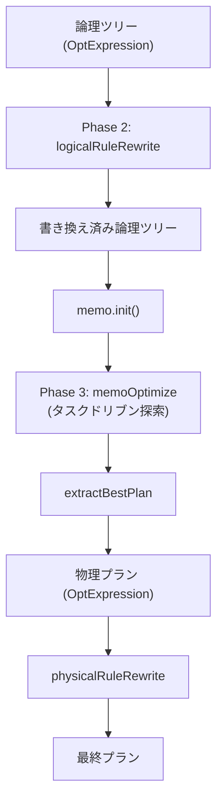
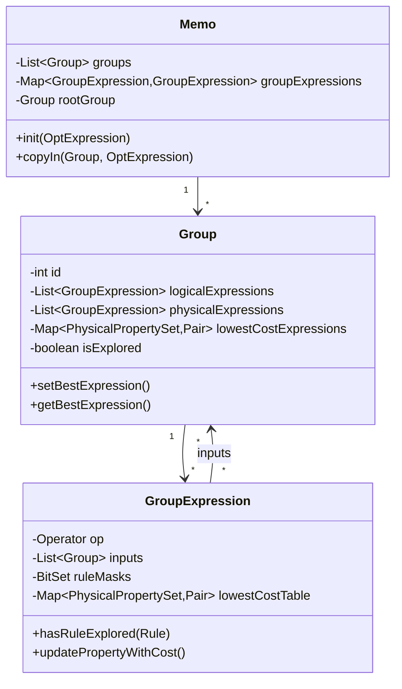
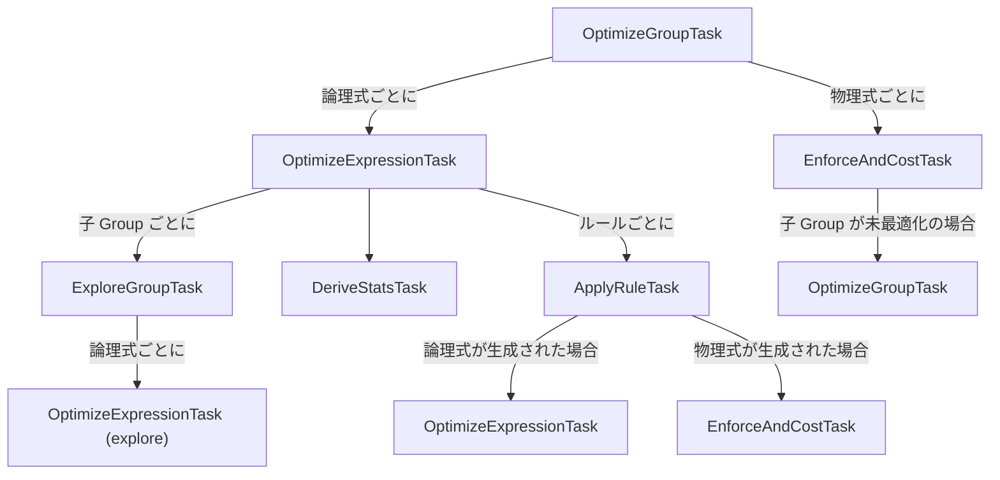

# 第6章 Cascades オプティマイザと Memo

> **本章で読むソース**
>
> - [`fe/fe-core/src/main/java/com/starrocks/sql/optimizer/OptimizerFactory.java`](https://github.com/StarRocks/starrocks/blob/4.1.1/fe/fe-core/src/main/java/com/starrocks/sql/optimizer/OptimizerFactory.java)
> - [`fe/fe-core/src/main/java/com/starrocks/sql/optimizer/Optimizer.java`](https://github.com/StarRocks/starrocks/blob/4.1.1/fe/fe-core/src/main/java/com/starrocks/sql/optimizer/Optimizer.java)
> - [`fe/fe-core/src/main/java/com/starrocks/sql/optimizer/QueryOptimizer.java`](https://github.com/StarRocks/starrocks/blob/4.1.1/fe/fe-core/src/main/java/com/starrocks/sql/optimizer/QueryOptimizer.java)
> - [`fe/fe-core/src/main/java/com/starrocks/sql/optimizer/Memo.java`](https://github.com/StarRocks/starrocks/blob/4.1.1/fe/fe-core/src/main/java/com/starrocks/sql/optimizer/Memo.java)
> - [`fe/fe-core/src/main/java/com/starrocks/sql/optimizer/Group.java`](https://github.com/StarRocks/starrocks/blob/4.1.1/fe/fe-core/src/main/java/com/starrocks/sql/optimizer/Group.java)
> - [`fe/fe-core/src/main/java/com/starrocks/sql/optimizer/GroupExpression.java`](https://github.com/StarRocks/starrocks/blob/4.1.1/fe/fe-core/src/main/java/com/starrocks/sql/optimizer/GroupExpression.java)
> - [`fe/fe-core/src/main/java/com/starrocks/sql/optimizer/OptExpression.java`](https://github.com/StarRocks/starrocks/blob/4.1.1/fe/fe-core/src/main/java/com/starrocks/sql/optimizer/OptExpression.java)
> - [`fe/fe-core/src/main/java/com/starrocks/sql/optimizer/task/TaskScheduler.java`](https://github.com/StarRocks/starrocks/blob/4.1.1/fe/fe-core/src/main/java/com/starrocks/sql/optimizer/task/TaskScheduler.java)
> - [`fe/fe-core/src/main/java/com/starrocks/sql/optimizer/task/OptimizeGroupTask.java`](https://github.com/StarRocks/starrocks/blob/4.1.1/fe/fe-core/src/main/java/com/starrocks/sql/optimizer/task/OptimizeGroupTask.java)
> - [`fe/fe-core/src/main/java/com/starrocks/sql/optimizer/task/OptimizeExpressionTask.java`](https://github.com/StarRocks/starrocks/blob/4.1.1/fe/fe-core/src/main/java/com/starrocks/sql/optimizer/task/OptimizeExpressionTask.java)
> - [`fe/fe-core/src/main/java/com/starrocks/sql/optimizer/task/ApplyRuleTask.java`](https://github.com/StarRocks/starrocks/blob/4.1.1/fe/fe-core/src/main/java/com/starrocks/sql/optimizer/task/ApplyRuleTask.java)
> - [`fe/fe-core/src/main/java/com/starrocks/sql/optimizer/task/EnforceAndCostTask.java`](https://github.com/StarRocks/starrocks/blob/4.1.1/fe/fe-core/src/main/java/com/starrocks/sql/optimizer/task/EnforceAndCostTask.java)
> - [`fe/fe-core/src/main/java/com/starrocks/sql/optimizer/task/DeriveStatsTask.java`](https://github.com/StarRocks/starrocks/blob/4.1.1/fe/fe-core/src/main/java/com/starrocks/sql/optimizer/task/DeriveStatsTask.java)

## この章の狙い

Analyzer が生成した論理演算子ツリーは、一つの実行戦略しか表現していない。
StarRocks はこのツリーを Columbia 論文[^1]に基づく Cascades フレームワークで最適化し、等価な論理式と物理実装の候補をコンパクトに管理しながらコスト最小の物理プランを求める。
本章では、Optimizer のフロー全体を俯瞰したうえで、Memo、Group、GroupExpression のデータ構造と、4種のタスクによるトップダウン探索を追う。
最後に、探索空間の爆発を抑える Upper Bound Pruning の仕組みを確認する。

[^1]: Y. Xu, "Efficiency in the Columbia Database Query Optimizer," 1998。StarRocks の実装は Columbia の Memo 構造とタスクスケジューリングを継承しつつ、ルールベースの rewrite フェーズを前段に置く二段構成を採る。

## 前提

第5章までで扱った Analyzer の出力（論理演算子ツリー `OptExpression`）を理解していること。
Visitor パターンとコストベース最適化(CBO)の基本的な考え方を知っていること。

## Optimizer のファクトリと種類

最適化のエントリポイントは `OptimizerFactory.create()` である。
`OptimizerContext` に設定されたオプションに応じて、3種類の Optimizer を切り替える。

[`fe/fe-core/src/main/java/com/starrocks/sql/optimizer/OptimizerFactory.java` L57-L64](https://github.com/StarRocks/starrocks/blob/4.1.1/fe/fe-core/src/main/java/com/starrocks/sql/optimizer/OptimizerFactory.java#L57-L64)

```java
    public static Optimizer create(OptimizerContext context) {
        if (context.getOptimizerOptions().isShortCircuit()) {
            return new ShortCircuitOptimizer(context);
        } else if (context.getOptimizerOptions().isBaselinePlan()) {
            return new SPMOptimizer(context);
        }
        return new QueryOptimizer(context);
    }
```

通常のクエリでは **QueryOptimizer** が生成される。
`ShortCircuitOptimizer` はポイントクエリ用の軽量パス、`SPMOptimizer` は SQL Plan Management のベースラインプラン用である。

抽象クラス `Optimizer` はテンプレートとなるインターフェースを定義する。

[`fe/fe-core/src/main/java/com/starrocks/sql/optimizer/Optimizer.java` L30-L35](https://github.com/StarRocks/starrocks/blob/4.1.1/fe/fe-core/src/main/java/com/starrocks/sql/optimizer/Optimizer.java#L30-L35)

```java
    public OptExpression optimize(OptExpression tree, ColumnRefSet requiredColumns) {
        return optimize(tree, new PhysicalPropertySet(), requiredColumns);
    }

    public abstract OptExpression optimize(OptExpression tree, PhysicalPropertySet requiredProperty,
                                           ColumnRefSet requiredColumns);
```

`optimize()` は論理ツリーを受け取り、要求された物理プロパティと必要カラムのもとで最適な物理プランを返す。

## QueryOptimizer の3フェーズ

`QueryOptimizer.optimizeByCost()` がコストベース最適化の全体フローを統括する。
処理は3つのフェーズで進む。

[`fe/fe-core/src/main/java/com/starrocks/sql/optimizer/QueryOptimizer.java` L247-L287](https://github.com/StarRocks/starrocks/blob/4.1.1/fe/fe-core/src/main/java/com/starrocks/sql/optimizer/QueryOptimizer.java#L247-L287)

```java
    private OptExpression optimizeByCost(ConnectContext connectContext,
                                         OptExpression logicOperatorTree,
                                         PhysicalPropertySet requiredProperty,
                                         ColumnRefSet requiredColumns) {
        // Phase 1: none
        // ... (中略) ...
        // Phase 2: rewrite based on memo and group
        TaskContext rootTaskContext =
                new TaskContext(context, requiredProperty, requiredColumns.clone(), Double.MAX_VALUE);

        try (Timer ignored = Tracers.watchScope("RuleBaseOptimize")) {
            logicOperatorTree = rewriteAndValidatePlan(logicOperatorTree, rootTaskContext);
        }

        Preconditions.checkNotNull(memo);
        memo.init(logicOperatorTree);
        // ... (中略) ...
        memo.deriveAllGroupLogicalProperty();

        // Phase 3: optimize based on memo and group
        try (Timer ignored = Tracers.watchScope("CostBaseOptimize")) {
            memoOptimize(connectContext, memo, rootTaskContext);
        }

        // ... (中略) ...
            result = extractBestPlan(requiredProperty, memo.getRootGroup());
        // ... (中略) ...
        }

```

1. **Rewrite フェーズ**（Phase 2）: `logicalRuleRewrite()` が Memo の外で論理ツリーにルールベースの書き換えを繰り返し適用する。述語プッシュダウン、カラムプルーニング、サブクエリ除去、MV リライトなど数十のルールがこのフェーズで走る。
2. **CBO フェーズ**（Phase 3）: 書き換え済みツリーを `memo.init()` で Memo に登録し、`memoOptimize()` でタスクドリブンの探索を実行する。
3. **抽出フェーズ**: `extractBestPlan()` が Memo のルート Group から、各 Group の最良式を再帰的にたどって物理プランツリーを組み立てる。



## Memo のデータ構造

**Memo** は、最適化中に生成されるすべてのプラン候補を格納するインメモリデータ構造である。
等価なプラン式を「Group」にまとめ、重複検出と動的計画法による部分問題の再利用を可能にする。

[`fe/fe-core/src/main/java/com/starrocks/sql/optimizer/Memo.java` L49-L64](https://github.com/StarRocks/starrocks/blob/4.1.1/fe/fe-core/src/main/java/com/starrocks/sql/optimizer/Memo.java#L49-L64)

```java
public class Memo {
    private static final Logger LOG = LogManager.getLogger(Memo.class);

    private int nextGroupId = 0;

    // The group id is same with the group index in groups List
    private final List<Group> groups;

    private Group rootGroup;
    /**
     * The map value is root group id for the GroupExpression.
     * We need to store group id because when {@see insertGroupExpression}
     * we need to get existed group id for tmp GroupExpression,
     * which doesn't have group id info
     */
    private final Map<GroupExpression, GroupExpression> groupExpressions;
```

`groups` が全 Group のリスト、`groupExpressions` が全 GroupExpression のハッシュマップである。
このマップにより、新たに生成された GroupExpression が既存のものと等価かどうかを O(1) で検出できる。

### 初期化と再帰的登録

`memo.init()` は入力の `OptExpression` ツリーを再帰的に Memo へコピーする。

[`fe/fe-core/src/main/java/com/starrocks/sql/optimizer/Memo.java` L91-L97](https://github.com/StarRocks/starrocks/blob/4.1.1/fe/fe-core/src/main/java/com/starrocks/sql/optimizer/Memo.java#L91-L97)

```java
    public GroupExpression init(OptExpression originExpression) {
        Preconditions.checkState(groups.size() == 0);
        Preconditions.checkState(groupExpressions.size() == 0);
        GroupExpression rootGroupExpression = copyIn(null, originExpression).second;
        rootGroup = rootGroupExpression.getGroup();
        return rootGroupExpression;
    }
```

`copyIn()` は各ノードを再帰的にたどり、子の Group 参照を持つ GroupExpression を生成して `insertGroupExpression()` で Memo に登録する。

[`fe/fe-core/src/main/java/com/starrocks/sql/optimizer/Memo.java` L134-L162](https://github.com/StarRocks/starrocks/blob/4.1.1/fe/fe-core/src/main/java/com/starrocks/sql/optimizer/Memo.java#L134-L162)

```java
    public Pair<Boolean, GroupExpression> copyIn(Group targetGroup, OptExpression expression) {
        List<Group> inputs = Lists.newArrayList();
        for (OptExpression input : expression.getInputs()) {
            Group group;
            if (input.getGroupExpression() != null) {
                group = input.getGroupExpression().getGroup();
            } else {
                group = copyIn(null, input).second.getGroup();
            }
            // ... (中略) ...
            inputs.add(group);
        }

        GroupExpression groupExpression = new GroupExpression(expression.getOp(), inputs);
        Pair<Boolean, GroupExpression> result = insertGroupExpression(groupExpression, targetGroup);
        if (result.first && targetGroup == null) {
            // For new group, we need drive property from expression
            // add set it to new group
            Preconditions.checkState(result.second.getOp().isLogical());
            result.second.deriveLogicalPropertyItself();
            // ... (中略) ...
        }
        return result;
    }

```

`insertGroupExpression()` は、同じ GroupExpression が既に存在すれば重複として検出し、存在しなければ新しい Group を生成して登録する。

[`fe/fe-core/src/main/java/com/starrocks/sql/optimizer/Memo.java` L99-L121](https://github.com/StarRocks/starrocks/blob/4.1.1/fe/fe-core/src/main/java/com/starrocks/sql/optimizer/Memo.java#L99-L121)

```java
    public Pair<Boolean, GroupExpression> insertGroupExpression(GroupExpression groupExpression, Group targetGroup) {
        if (groupExpressions.get(groupExpression) != null) {
            GroupExpression existedGroupExpression = groupExpressions.get(groupExpression);
            Group existedGroup = existedGroupExpression.getGroup();

            if (needMerge(targetGroup, existedGroup)) {
                mergeGroup(existedGroup, targetGroup);
            }

            return new Pair<>(false, existedGroupExpression);
        }

        if (targetGroup == null) {
            targetGroup = newGroup();
            groups.add(targetGroup);
        }

        groupExpressions.put(groupExpression, groupExpression);

        targetGroup.addExpression(groupExpression);

        return new Pair<>(true, groupExpression);
    }
```

既存の GroupExpression が異なる Group に属する場合、`mergeGroup()` で2つの Group を統合する。
この Group マージは Cascades フレームワークにおける等価クラスの合流に相当する。

## Group と GroupExpression



### Group

**Group** は、同じ出力を生成する等価な式の集合を表す。
一つの Group は論理式リストと物理式リストを持つ。

[`fe/fe-core/src/main/java/com/starrocks/sql/optimizer/Group.java` L48-L88](https://github.com/StarRocks/starrocks/blob/4.1.1/fe/fe-core/src/main/java/com/starrocks/sql/optimizer/Group.java#L48-L88)

```java
public class Group {
    private final int id;

    private final List<GroupExpression> logicalExpressions;
    private final List<GroupExpression> physicalExpressions;

    private boolean isExplored;
    // ... (中略) ...
    private final Map<PhysicalPropertySet, Pair<Double, GroupExpression>> lowestCostExpressions;
    // GroupExpressions in this Group which could satisfy the required property.
    private final Map<PhysicalPropertySet, Set<GroupExpression>> satisfyOutputPropertyGroupExpressions;

    private final Map<PhysicalPropertySet, Double> costLowerBounds;
    // ... (中略) ...
    }

```

`lowestCostExpressions` は、物理プロパティごとに最小コストの GroupExpression とそのコスト値を保持するマップである。
`EnforceAndCostTask` がコスト計算を終えるたびに、`setBestExpression()` でこのマップが更新される。

[`fe/fe-core/src/main/java/com/starrocks/sql/optimizer/Group.java` L179-L187](https://github.com/StarRocks/starrocks/blob/4.1.1/fe/fe-core/src/main/java/com/starrocks/sql/optimizer/Group.java#L179-L187)

```java
    public void setBestExpression(GroupExpression expression, double cost, PhysicalPropertySet physicalPropertySet) {
        if (lowestCostExpressions.containsKey(physicalPropertySet)) {
            if (lowestCostExpressions.get(physicalPropertySet).first > cost) {
                lowestCostExpressions.put(physicalPropertySet, new Pair<>(cost, expression));
            }
        } else {
            lowestCostExpressions.put(physicalPropertySet, new Pair<>(cost, expression));
        }
    }
```

既に同じプロパティで登録済みの式よりコストが低い場合のみ上書きする。
これが各 Group の最適解を保持するメモ化の核となる仕組みである。

`isExplored` フラグは `ExploreGroupTask` で使われ、一度探索済みの Group に対する重複探索を防ぐ。

### GroupExpression

**GroupExpression** は、一つの演算子（`Operator`）と入力となる Group のリストの組である。
通常の式（`OptExpression`）が子として他の式を持つのに対し、GroupExpression は子として Group を持つ。
これにより、子の等価な候補すべてを暗黙的に参照でき、式の組み合わせ爆発を防ぐ。

[`fe/fe-core/src/main/java/com/starrocks/sql/optimizer/GroupExpression.java` L50-L82](https://github.com/StarRocks/starrocks/blob/4.1.1/fe/fe-core/src/main/java/com/starrocks/sql/optimizer/GroupExpression.java#L50-L82)

```java
public class GroupExpression {
    // The group this group expression belong to,
    // will set by setGroup method
    private Group group;
    private final List<Group> inputs;
    private final Operator op;
    private final BitSet ruleMasks = new BitSet(RuleType.NUM_RULES.ordinal() + 1);
    private final BitSet appliedRuleMasks = new BitSet(RuleType.NUM_RULES.ordinal() + 1);
    private boolean statsDerived = false;
    private final Map<PhysicalPropertySet, Pair<Double, List<PhysicalPropertySet>>> lowestCostTable;
    // required property by parent -> output property
    private final Map<PhysicalPropertySet, PhysicalPropertySet> outputPropertyMap;
    // ... (中略) ...

    public GroupExpression(Operator op, List<Group> inputs) {
        this.op = op;
        this.inputs = inputs;
        this.lowestCostTable = Maps.newHashMap();
        // ... (中略) ...
    }

```

`ruleMasks` と `appliedRuleMasks` は、どのルールが適用済みかをビットセットで管理する。
`ruleMasks` はこの GroupExpression からルールで探索済みかを示し、`appliedRuleMasks` はこの GroupExpression 自体がどのルールから生まれたかの系譜を追跡する。
`lowestCostTable` は、要求プロパティごとに最小コストと子への入力プロパティのリストを保持する。

GroupExpression の等価判定は、演算子と入力 Group の ID リストのハッシュで行われる。

[`fe/fe-core/src/main/java/com/starrocks/sql/optimizer/GroupExpression.java` L293-L320](https://github.com/StarRocks/starrocks/blob/4.1.1/fe/fe-core/src/main/java/com/starrocks/sql/optimizer/GroupExpression.java#L293-L320)

```java
    @Override
    public int hashCode() {
        return Objects.hash(op, inputs);
    }

    @Override
    public boolean equals(Object obj) {
        if (!(obj instanceof GroupExpression)) {
            return false;
        }
        GroupExpression rhs = (GroupExpression) obj;
        // ... (中略) ...
        if (!op.equals(rhs.getOp())) {
            return false;
        }
        // ... (中略) ...
        for (int i = 0; i < arity(); ++i) {
            if (inputs.get(i).getId() != (rhs.inputAt(i).getId())) {
                return false;
            }
        }
        return true;
    }

```

この等価判定を利用して、`Memo.insertGroupExpression()` 内の `groupExpressions` HashMap がルール適用で生成された式の重複を O(1) で検出する。

### OptExpression

**OptExpression** は最適化の入出力に使われる式表現である。
Memo の外では通常の木構造（子が `OptExpression`）として使われ、Memo 内ではパターンマッチ時に GroupExpression をラップする形で使われる。

[`fe/fe-core/src/main/java/com/starrocks/sql/optimizer/OptExpression.java` L42-L56](https://github.com/StarRocks/starrocks/blob/4.1.1/fe/fe-core/src/main/java/com/starrocks/sql/optimizer/OptExpression.java#L42-L56)

```java
public class OptExpression {

    private Operator op;
    private List<OptExpression> inputs;

    private LogicalProperty property;
    private Statistics statistics;
    private double cost = 0;
    // The number of plans in the entire search space，this parameter is valid only when cbo_use_nth_exec_plan configured.
    // Default value is 0
    private int planCount = 0;

    // For easily convert a GroupExpression to OptExpression when pattern match
    // we just use OptExpression to wrap GroupExpression
    private GroupExpression groupExpression;
```

`extractBestPlan()` が Memo から最適プランを取り出す際、各 Group の最良 GroupExpression を `OptExpression` のツリーとして再構成する。

## タスクドリブン探索

### TaskScheduler のスタックベース実行

CBO フェーズの探索は、`TaskScheduler` がスタック上のタスクを順に実行する形で進む。

[`fe/fe-core/src/main/java/com/starrocks/sql/optimizer/task/TaskScheduler.java` L26-L47](https://github.com/StarRocks/starrocks/blob/4.1.1/fe/fe-core/src/main/java/com/starrocks/sql/optimizer/task/TaskScheduler.java#L26-L47)

```java
public class TaskScheduler {
    public final Stack<OptimizerTask> tasks;

    public TaskScheduler() {
        tasks = new Stack<>();
    }
    // ... (中略) ...
    public void executeTasks(TaskContext context) {
        while (!tasks.empty()) {
            context.getOptimizerContext().checkTimeout();
            OptimizerTask task = tasks.pop();
            context.getOptimizerContext().setTaskContext(context);
            try (Timer ignore = Tracers.watchScope(Tracers.Module.OPTIMIZER, task.getClass().getSimpleName())) {
                task.execute();
            }
        }
    }

```

タスクは後入れ先出し（LIFO）で処理される。
各タスクの `execute()` 内で `pushTask()` を呼んで新たなタスクをスタックに積むことで、再帰を明示的なスタック操作に変換している。
これにより Java のコールスタックの深さ制限を回避し、探索の途中経過をスタック上に保持できる。

`memoOptimize()` はルート Group に対する `OptimizeGroupTask` をスタックに積んで探索を開始する。

[`fe/fe-core/src/main/java/com/starrocks/sql/optimizer/QueryOptimizer.java` L1012-L1013](https://github.com/StarRocks/starrocks/blob/4.1.1/fe/fe-core/src/main/java/com/starrocks/sql/optimizer/QueryOptimizer.java#L1012-L1013)

```java
        scheduler.pushTask(new OptimizeGroupTask(rootTaskContext, memo.getRootGroup()));
        scheduler.executeTasks(rootTaskContext);
```

### 4種のタスクの連携

探索は4種の主要タスクが相互にタスクを積み合うことで進行する。



#### OptimizeGroupTask

Group 内の全式に対して探索タスクを発行する。

[`fe/fe-core/src/main/java/com/starrocks/sql/optimizer/task/OptimizeGroupTask.java` L43-L58](https://github.com/StarRocks/starrocks/blob/4.1.1/fe/fe-core/src/main/java/com/starrocks/sql/optimizer/task/OptimizeGroupTask.java#L43-L58)

```java
    public void execute() {
        // 1 Group Cost LB > Context Cost UB
        // 2 Group has optimized given the context
        if (group.getCostLowerBound(context.getRequiredProperty()) >= context.getUpperBoundCost() ||
                group.hasBestExpression(context.getRequiredProperty())) {
            return;
        }

        for (int i = group.getLogicalExpressions().size() - 1; i >= 0; i--) {
            pushTask(new OptimizeExpressionTask(context, group.getLogicalExpressions().get(i)));
        }

        for (int i = group.getPhysicalExpressions().size() - 1; i >= 0; i--) {
            pushTask((new EnforceAndCostTask(context, group.getPhysicalExpressions().get(i))));
        }
    }
```

冒頭の2つの条件が枝刈りの要所である。
Group のコスト下限（`costLowerBound`）が現在のコスト上限（`upperBoundCost`）以上であれば、この Group はこれ以上探索しても改善しないため即座に打ち切る。
また、要求プロパティに対する最良式が既に見つかっている場合も探索をスキップする。

論理式には `OptimizeExpressionTask`、物理式には `EnforceAndCostTask` を発行する。
逆順に push することで、スタックの LIFO 特性によりインデックス0の式が最初に処理される。

#### OptimizeExpressionTask

一つの論理 GroupExpression に対して、適用可能なルールの探索と統計情報の導出を行う。

[`fe/fe-core/src/main/java/com/starrocks/sql/optimizer/task/OptimizeExpressionTask.java` L75-L87](https://github.com/StarRocks/starrocks/blob/4.1.1/fe/fe-core/src/main/java/com/starrocks/sql/optimizer/task/OptimizeExpressionTask.java#L75-L87)

```java
    public void execute() {
        List<Rule> rules = getValidRules();

        for (Rule rule : rules) {
            pushTask(new ApplyRuleTask(context, groupExpression, rule, isExplore));
        }

        pushTask(new DeriveStatsTask(context, groupExpression));
        for (int i = groupExpression.arity() - 1; i >= 0; i--) {
            pushTask(new ExploreGroupTask(context, groupExpression.getInputs().get(i)));
        }
    }
}
```

タスクをスタックに積む順序はスタックの LIFO を考慮して、実際の実行順とは逆になっている。
実行時には次の順序で処理される。

1. 各子 Group に対する `ExploreGroupTask`（子の論理変換を先に探索する）
2. `DeriveStatsTask`（子の統計情報が揃った後に自身の統計情報を導出する）
3. 各ルールに対する `ApplyRuleTask`（統計情報の導出後にルールを適用する）

`getValidRules()` は変換ルール（論理から論理）と実装ルール（論理から物理）の両方を取得し、promise 値で昇順にソートする。
`isExplore` が true の場合は変換ルールのみを取得する。

#### ApplyRuleTask

`Binder` を使ってパターンマッチを行い、ルールの `transform()` で新しい式を生成して Memo に登録する。

[`fe/fe-core/src/main/java/com/starrocks/sql/optimizer/task/ApplyRuleTask.java` L65-L140](https://github.com/StarRocks/starrocks/blob/4.1.1/fe/fe-core/src/main/java/com/starrocks/sql/optimizer/task/ApplyRuleTask.java#L65-L140)

```java
    @Override
    public void execute() {
        if (groupExpression.hasRuleExplored(rule) || groupExpression.isUnused()) {
            return;
        }
        // Apply rule and get all new OptExpressions
        final Pattern pattern = rule.getPattern();
        // ... (中略) ...
        final Binder binder = new Binder(optimizerContext, pattern, groupExpression, ruleStopWatch);
        // ... (中略) ...
        OptExpression extractExpr = binder.next();
        while (extractExpr != null) {
            // ... (中略) ...
            List<OptExpression> targetExpressions;
            // ... (中略) ...
                targetExpressions = rule.transform(extractExpr, context.getOptimizerContext());
            // ... (中略) ...
            newExpressions.addAll(targetExpressions);
            // ... (中略) ...
            extractExpr = binder.next();
        }

        for (OptExpression expression : newExpressions) {
            // Insert new OptExpression to memo
            Pair<Boolean, GroupExpression> result = context.getOptimizerContext().getMemo().
                    copyIn(groupExpression.getGroup(), expression);
            // ... (中略) ...
            GroupExpression newGroupExpression = result.second;

            // ... (中略) ...
            if (newGroupExpression.getOp().isLogical()) {
                // For logic newGroupExpression, optimize it
                pushTask(new OptimizeExpressionTask(context, newGroupExpression, isExplore));
            } else {
                // For physical newGroupExpression, enforce and cost it,
                // Optimize its inputs if needed
                pushTask(new EnforceAndCostTask(context, newGroupExpression));
            }
        }

        groupExpression.setRuleExplored(rule);
    }

```

ルール適用で生成された新しい式は `copyIn()` で同じ Group に登録される（重複なら既存の式が返る）。
生成された式が論理式なら `OptimizeExpressionTask` でさらにルール適用を進め、物理式なら `EnforceAndCostTask` でコスト計算に入る。

`groupExpression.setRuleExplored(rule)` により、同一の GroupExpression に同じルールが二重に適用されるのを防ぐ。

#### DeriveStatsTask

GroupExpression の統計情報（行数、カラムの統計量）を導出する。

[`fe/fe-core/src/main/java/com/starrocks/sql/optimizer/task/DeriveStatsTask.java` L43-L109](https://github.com/StarRocks/starrocks/blob/4.1.1/fe/fe-core/src/main/java/com/starrocks/sql/optimizer/task/DeriveStatsTask.java#L43-L109)

```java
    @Override
    public void execute() {
        if (groupExpression.isStatsDerived() || groupExpression.isUnused()) {
            return;
        }

        for (int i = groupExpression.arity() - 1; i >= 0; --i) {
            GroupExpression childExpression = groupExpression.getInputs().get(i).getFirstLogicalExpression();
            Preconditions.checkState(childExpression.isStatsDerived());
            Preconditions.checkNotNull(groupExpression.getInputs().get(i).getStatistics());
        }

        ExpressionContext expressionContext = new ExpressionContext(groupExpression);
        StatisticsCalculator statisticsCalculator = new StatisticsCalculator(expressionContext,
                context.getOptimizerContext().getColumnRefFactory(), context.getOptimizerContext());
        statisticsCalculator.estimatorStats();
        // ... (中略) ...
        groupExpression.setStatsDerived();
    }

```

子 Group の統計情報が導出済みであることを前提条件として、`StatisticsCalculator` がこの GroupExpression の統計情報を推定する。
子から先に統計を導出するボトムアップの順序は、`OptimizeExpressionTask` がスタック上で `ExploreGroupTask` → `DeriveStatsTask` → `ApplyRuleTask` の順に積むことで保証される。

`isStatsDerived` フラグで二重計算を防いでいる。

#### EnforceAndCostTask

物理 GroupExpression のコストを計算し、物理プロパティの充足を判定する。

[`fe/fe-core/src/main/java/com/starrocks/sql/optimizer/task/EnforceAndCostTask.java` L92-L231](https://github.com/StarRocks/starrocks/blob/4.1.1/fe/fe-core/src/main/java/com/starrocks/sql/optimizer/task/EnforceAndCostTask.java#L92-L231)

```java
    @Override
    public void execute() {
        // ... (中略) ...
        // Init costs and get required properties for children
        initRequiredProperties();

        for (; curPropertyPairIndex < childrenRequiredPropertiesList.size(); curPropertyPairIndex++) {
            List<PhysicalPropertySet> childrenRequiredProperties =
                    childrenRequiredPropertiesList.get(curPropertyPairIndex);

            // Calculate local cost and update total cost
            if (curChildIndex == 0 && prevChildIndex == -1) {
                localCost = CostModel.calculateCost(groupExpression);
                curTotalCost += localCost;
            }

            for (; curChildIndex < groupExpression.getInputs().size(); curChildIndex++) {
                PhysicalPropertySet childRequiredProperty = childrenRequiredProperties.get(curChildIndex);
                Group childGroup = groupExpression.getInputs().get(curChildIndex);

                // Check whether the child group is already optimized for the property
                GroupExpression childBestExpr = childGroup.getBestExpression(childRequiredProperty);
                // ... (中略) ...
                if (childBestExpr == null) {
                    // We haven't optimized child group
                    prevChildIndex = curChildIndex;
                    optimizeChildGroup(childRequiredProperty, childGroup);
                    return;
                }
                // ... (中略) ...
                curTotalCost += childBestExpr.getCost(childRequiredProperty);
                if (curTotalCost > context.getUpperBoundCost()) {
                    recordLowerBoundCost(curTotalCost);
                    break;
                }
            }
            // ... (中略) ...
        }
    }

```

処理は次の流れで進む。

1. `RequiredPropertyDeriver` が物理オペレーターの種類に応じて子への要求プロパティ候補のリストを導出する。たとえば Hash Join なら、左子に shuffle 分散、右子に broadcast 分散を要求する組と、両子に shuffle を要求する組を返す。
2. 候補ごとに、各子 Group の最良式を取得する。子 Group が未最適化なら `optimizeChildGroup()` で子の `OptimizeGroupTask` をスタックに積み、自身は clone してスタックに積み直して一旦リターンする。子の最適化が完了すると、clone した自身が再びスタックから取り出されて処理を再開する。
3. 全子のコストを合算した `curTotalCost` が上限 `upperBoundCost` を超えたら即座に打ち切る。
4. 全子の最適化が完了したら、`OutputPropertyDeriver` で出力プロパティを導出し、要求プロパティを満たさなければ Enforcer（Exchange、Sort）を挿入する。

## 物理プロパティ要求の伝播

`EnforceAndCostTask` はトップダウンでプロパティ要求を子 Group に伝播する。
子の最適化にはコスト上限を引き下げた新しい `TaskContext` を作成する。

[`fe/fe-core/src/main/java/com/starrocks/sql/optimizer/task/EnforceAndCostTask.java` L271-L277](https://github.com/StarRocks/starrocks/blob/4.1.1/fe/fe-core/src/main/java/com/starrocks/sql/optimizer/task/EnforceAndCostTask.java#L271-L277)

```java
    private void optimizeChildGroup(PhysicalPropertySet inputProperty, Group childGroup) {
        pushTask((EnforceAndCostTask) clone());
        double newUpperBound = context.getUpperBoundCost() - curTotalCost;
        TaskContext taskContext = new TaskContext(context.getOptimizerContext(), inputProperty,
                context.getRequiredColumns(), newUpperBound);
        pushTask(new OptimizeGroupTask(taskContext, childGroup));
    }
```

`newUpperBound` は現在の上限からこれまでの累積コストを差し引いた値である。
親の残りコスト枠が子の上限となるため、コストの高い子パスが早期に枝刈りされる。

出力プロパティが要求を満たさない場合は Enforcer を挿入する。

[`fe/fe-core/src/main/java/com/starrocks/sql/optimizer/task/EnforceAndCostTask.java` L341-L374](https://github.com/StarRocks/starrocks/blob/4.1.1/fe/fe-core/src/main/java/com/starrocks/sql/optimizer/task/EnforceAndCostTask.java#L341-L374)

```java
    private void recordCostsAndEnforce(PhysicalPropertySet outputProperty,
                                       List<PhysicalPropertySet> childrenOutputProperties) {
        // ... (中略) ...
        setSatisfiedPropertyWithCost(outputProperty, childrenOutputProperties);
        PhysicalPropertySet requiredProperty = context.getRequiredProperty();
        // ... (中略) ...
        // Enforce property if outputProperty doesn't satisfy context requiredProperty
        if (!outputProperty.isSatisfy(requiredProperty)) {
            // Enforce the property to meet the required property
            PhysicalPropertySet enforcedProperty = enforceProperty(outputProperty, requiredProperty);
            // ... (中略) ...
        } else {
            // ... (中略) ...
        }

        if (curTotalCost < context.getUpperBoundCost()) {
            // update context upperbound cost
            context.setUpperBoundCost(curTotalCost);
        }
    }

```

Enforcer の挿入では、ソート要求と分散要求の不足を判定し、不足するプロパティに応じて Exchange ノードや Sort ノードを Group 内に追加する。
コスト計算後に `curTotalCost` が現在の上限を下回れば、上限自体を更新する。
これが Upper Bound Pruning の効果をさらに高める正のフィードバックとなる。

## 最良プランの抽出

`extractBestPlan()` は、Memo のルート Group から再帰的に最良式をたどって `OptExpression` のツリーを組み立てる。

[`fe/fe-core/src/main/java/com/starrocks/sql/optimizer/QueryOptimizer.java` L1093-L1120](https://github.com/StarRocks/starrocks/blob/4.1.1/fe/fe-core/src/main/java/com/starrocks/sql/optimizer/QueryOptimizer.java#L1093-L1120)

```java
    private OptExpression extractBestPlan(PhysicalPropertySet requiredProperty,
                                          Group rootGroup) {
        GroupExpression groupExpression = rootGroup.getBestExpression(requiredProperty);
        if (groupExpression == null) {
            String msg = "no executable plan for this sql. group: %s. required property: %s";
            throw new IllegalArgumentException(String.format(msg, rootGroup, requiredProperty));
        }
        List<PhysicalPropertySet> inputProperties = groupExpression.getInputProperties(requiredProperty);

        List<OptExpression> childPlans = Lists.newArrayList();
        for (int i = 0; i < groupExpression.arity(); ++i) {
            OptExpression childPlan = extractBestPlan(inputProperties.get(i), groupExpression.inputAt(i));
            childPlans.add(childPlan);
        }

        OptExpression expression = OptExpression.create(groupExpression.getOp(),
                childPlans);
        // record inputProperties at optExpression, used for planFragment builder to determine join type
        expression.setRequiredProperties(inputProperties);
        expression.setStatistics(groupExpression.getGroup().getStatistics());
        expression.setCost(groupExpression.getCost(requiredProperty));
        expression.setOutputProperty(requiredProperty);
        // ... (中略) ...
        return expression;
    }

```

各 Group の `getBestExpression()` が、その Group の `lowestCostExpressions` マップから要求プロパティに対する最良 GroupExpression を返す。
GroupExpression の `getInputProperties()` が子への入力プロパティを返すので、子 Group に対しても同じ操作を再帰する。
この再帰が底に達すると、Scan ノードまでの完全な物理プランツリーが構成される。

## 高速化の工夫: Upper Bound Pruning

Cascades 探索の計算量を大きく削減する仕組みが **Upper Bound Pruning** である。
`TaskContext` は `upperBoundCost` を保持し、あるプロパティ要求に対して既に見つかっているプランのコストを上限として設定する。

[`fe/fe-core/src/main/java/com/starrocks/sql/optimizer/task/TaskContext.java` L24-L41](https://github.com/StarRocks/starrocks/blob/4.1.1/fe/fe-core/src/main/java/com/starrocks/sql/optimizer/task/TaskContext.java#L24-L41)

```java
public class TaskContext {
    private final OptimizerContext optimizerContext;
    private final PhysicalPropertySet requiredProperty;
    private ColumnRefSet requiredColumns;
    private double upperBoundCost;
    // ... (中略) ...
    public TaskContext(OptimizerContext context,
                       PhysicalPropertySet physicalPropertySet,
                       ColumnRefSet requiredColumns,
                       double cost) {

```

初期値は `Double.MAX_VALUE` であり、最初のプランが見つかった時点でそのコストに引き下げられる。
以後、より低コストなプランが見つかるたびに上限が更新される。

Upper Bound Pruning は3つの箇所で効果を発揮する。

1. **OptimizeGroupTask の早期リターン**: Group のコスト下限が上限を超えている場合、その Group の探索全体をスキップする。

```java
if (group.getCostLowerBound(context.getRequiredProperty()) >= context.getUpperBoundCost() ||
        group.hasBestExpression(context.getRequiredProperty())) {
    return;
}

```

2. **EnforceAndCostTask の子コスト累積チェック**: 子のコストを加算するたびに上限と比較し、超過した時点で残りの子の探索を打ち切る。

```java
curTotalCost += childBestExpr.getCost(childRequiredProperty);
if (curTotalCost > context.getUpperBoundCost()) {
    recordLowerBoundCost(curTotalCost);
    break;
}

```

3. **子 Group 最適化時の上限伝播**: 子の `OptimizeGroupTask` にはコスト上限から現在の累積コストを差し引いた残余値を渡すため、子の探索空間も制約される。

```java
double newUpperBound = context.getUpperBoundCost() - curTotalCost;

```

これらの枝刈りにより、探索空間が広い Join の順序最適化やマルチテーブルクエリにおいて、明らかにコストの高い候補が早期に排除される。
探索が進むにつれて上限が絞り込まれ、後半の候補はごくわずかな計算で棄却できるようになる。

## まとめ

StarRocks の Cascades オプティマイザは、Memo 構造による等価式のコンパクトな表現と、スタックベースのタスクスケジューリングによるトップダウン探索を組み合わせて、コスト最小の物理プランを求める。
Rewrite フェーズで論理変換を事前に適用することで CBO フェーズの探索空間を縮小し、CBO フェーズでは Upper Bound Pruning によって不要な候補を早期に枝刈りする。
Memo 内の HashMap による重複検出は、ルール適用で生成される式の爆発を O(1) で抑制する。

## 関連する章

- [第5章 Analyzer と意味解析](../part01-sql-analysis/05-analyzer.md): 本章の入力となる論理演算子ツリーを生成する。
- [第7章 変換ルールと実装ルール](07-transformation-and-implementation-rules.md): `ApplyRuleTask` が適用するルールの詳細を扱う。
- [第8章 コストモデルと統計情報](08-cost-model-and-statistics.md): `EnforceAndCostTask` が呼び出すコスト計算と `DeriveStatsTask` の統計推定の詳細を扱う。
- [第9章 分散プランと Fragment](09-distributed-plan-and-fragment.md): Enforcer が挿入する Exchange ノードがどう Fragment に変換されるかを扱う。
