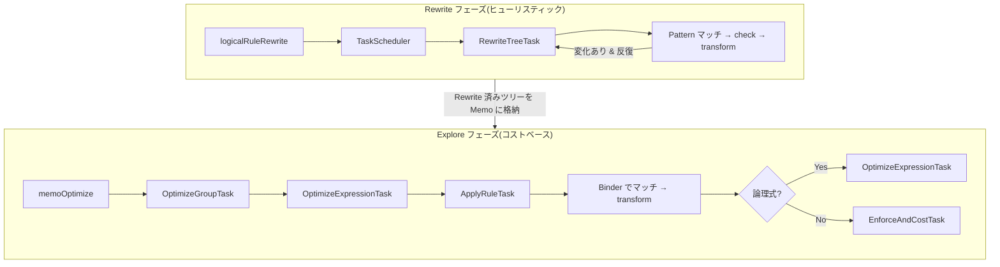

# 第7章 変換ルールと実装ルール

> **本章で読むソース**
>
> - [`fe/fe-core/src/main/java/com/starrocks/sql/optimizer/rule/Rule.java`](https://github.com/StarRocks/starrocks/blob/4.1.1/fe/fe-core/src/main/java/com/starrocks/sql/optimizer/rule/Rule.java)
> - [`fe/fe-core/src/main/java/com/starrocks/sql/optimizer/rule/RuleType.java`](https://github.com/StarRocks/starrocks/blob/4.1.1/fe/fe-core/src/main/java/com/starrocks/sql/optimizer/rule/RuleType.java)
> - [`fe/fe-core/src/main/java/com/starrocks/sql/optimizer/rule/RuleSet.java`](https://github.com/StarRocks/starrocks/blob/4.1.1/fe/fe-core/src/main/java/com/starrocks/sql/optimizer/rule/RuleSet.java)
> - [`fe/fe-core/src/main/java/com/starrocks/sql/optimizer/operator/pattern/Pattern.java`](https://github.com/StarRocks/starrocks/blob/4.1.1/fe/fe-core/src/main/java/com/starrocks/sql/optimizer/operator/pattern/Pattern.java)
> - [`fe/fe-core/src/main/java/com/starrocks/sql/optimizer/rule/transformation/TransformationRule.java`](https://github.com/StarRocks/starrocks/blob/4.1.1/fe/fe-core/src/main/java/com/starrocks/sql/optimizer/rule/transformation/TransformationRule.java)
> - [`fe/fe-core/src/main/java/com/starrocks/sql/optimizer/rule/implementation/ImplementationRule.java`](https://github.com/StarRocks/starrocks/blob/4.1.1/fe/fe-core/src/main/java/com/starrocks/sql/optimizer/rule/implementation/ImplementationRule.java)
> - [`fe/fe-core/src/main/java/com/starrocks/sql/optimizer/rule/transformation/PushDownPredicateScanRule.java`](https://github.com/StarRocks/starrocks/blob/4.1.1/fe/fe-core/src/main/java/com/starrocks/sql/optimizer/rule/transformation/PushDownPredicateScanRule.java)
> - [`fe/fe-core/src/main/java/com/starrocks/sql/optimizer/rule/transformation/JoinCommutativityRule.java`](https://github.com/StarRocks/starrocks/blob/4.1.1/fe/fe-core/src/main/java/com/starrocks/sql/optimizer/rule/transformation/JoinCommutativityRule.java)
> - [`fe/fe-core/src/main/java/com/starrocks/sql/optimizer/rule/transformation/MergeLimitDirectRule.java`](https://github.com/StarRocks/starrocks/blob/4.1.1/fe/fe-core/src/main/java/com/starrocks/sql/optimizer/rule/transformation/MergeLimitDirectRule.java)
> - [`fe/fe-core/src/main/java/com/starrocks/sql/optimizer/rule/implementation/OlapScanImplementationRule.java`](https://github.com/StarRocks/starrocks/blob/4.1.1/fe/fe-core/src/main/java/com/starrocks/sql/optimizer/rule/implementation/OlapScanImplementationRule.java)
> - [`fe/fe-core/src/main/java/com/starrocks/sql/optimizer/rule/implementation/HashJoinImplementationRule.java`](https://github.com/StarRocks/starrocks/blob/4.1.1/fe/fe-core/src/main/java/com/starrocks/sql/optimizer/rule/implementation/HashJoinImplementationRule.java)
> - [`fe/fe-core/src/main/java/com/starrocks/sql/optimizer/task/RewriteTreeTask.java`](https://github.com/StarRocks/starrocks/blob/4.1.1/fe/fe-core/src/main/java/com/starrocks/sql/optimizer/task/RewriteTreeTask.java)
> - [`fe/fe-core/src/main/java/com/starrocks/sql/optimizer/task/ApplyRuleTask.java`](https://github.com/StarRocks/starrocks/blob/4.1.1/fe/fe-core/src/main/java/com/starrocks/sql/optimizer/task/ApplyRuleTask.java)

## この章の狙い

StarRocks の Cascades ベースオプティマイザーは、論理プランの等価変換と物理実装への変換をすべて「ルール」として表現する。
本章では、ルールの基底クラスとパターンマッチングの仕組みを読んだうえで、変換ルール(TransformationRule)と実装ルール(ImplementationRule)の代表的な実装を掘り下げる。
さらに、ルールが適用される2つのフェーズ、すなわち Rewrite フェーズ(ヒューリスティック変換)と Explore フェーズ(コストベース探索)の違いを整理する。

## 前提

第6章までで、SQL テキストが論理プランツリー(`OptExpression` のツリー)に変換される過程を読んだ。
本章のルールはこの `OptExpression` を入力として受け取り、等価な別の `OptExpression` を出力する。
Cascades フレームワークの Memo 構造については第8章以降で扱うため、本章では Memo の詳細には立ち入らない。

## Rule 基底クラスの構造

すべてのルールは抽象クラス `Rule` を継承する。

[`fe/fe-core/src/main/java/com/starrocks/sql/optimizer/rule/Rule.java` L45-L95](https://github.com/StarRocks/starrocks/blob/4.1.1/fe/fe-core/src/main/java/com/starrocks/sql/optimizer/rule/Rule.java#L45-L95)

```java
public abstract class Rule {
    private final RuleType type;
    private final Pattern pattern;

    protected Rule(RuleType type, Pattern pattern) {
        this.type = type;
        this.pattern = pattern;
    }

    // ... (中略) ...

    public int promise() {
        return 1;
    }

    public boolean check(final OptExpression input, OptimizerContext context) {
        return true;
    }

    public abstract List<OptExpression> transform(OptExpression input, OptimizerContext context);

    public boolean exhausted(OptimizerContext context) {
        return false;
    }
}

```

ルールは3つの要素で構成される。

1. **`RuleType type`**: ルールの識別子。`RuleType` enum の値で、ルールの有効/無効の管理や適用済みの追跡に使われる
2. **`Pattern pattern`**: ルールが適用可能な式木の構造を宣言的に記述するパターン。式木がこのパターンにマッチしたときだけ `transform` が呼ばれる
3. **`transform` メソッド**: 実際の変換ロジック。入力の `OptExpression` を受け取り、変換結果の `OptExpression` リストを返す。変換不要なら空リストを返す

`check` メソッドはパターンマッチ後の追加条件チェックに使われる。
`promise` メソッドはルールの優先度を返し、値が大きいほど先にスケジュールされる。
`exhausted` メソッドは、時間のかかるルールが制限時間を超えたときに最適化を打ち切る仕組みを提供する。

## Pattern によるマッチング

`Pattern` は式木の構造を宣言的に記述する抽象クラスである。

[`fe/fe-core/src/main/java/com/starrocks/sql/optimizer/operator/pattern/Pattern.java` L31-L100](https://github.com/StarRocks/starrocks/blob/4.1.1/fe/fe-core/src/main/java/com/starrocks/sql/optimizer/operator/pattern/Pattern.java#L31-L100)

```java
public abstract class Pattern {
    private static final Map<OperatorType, Function<Void, Pattern>> PATTERN_MAP = Map.of(
            OperatorType.PATTERN_LEAF, p -> new AnyPattern(),
            OperatorType.PATTERN_MULTI_LEAF, p -> new MultiLeafPattern(),
            OperatorType.PATTERN_SCAN, p -> MultiOpPattern.ofAllScan(),
            OperatorType.PATTERN_MULTIJOIN, p -> new MultiJoinPattern()
    );

    // ... (中略) ...

    protected abstract boolean matchWithoutChild(OperatorType op);

    public static Pattern create(OperatorType type, OperatorType... children) {
        Pattern p;
        if (PATTERN_MAP.containsKey(type)) {
            p = PATTERN_MAP.get(type).apply(null);
        } else {
            p = new OpPattern(type);
        }
        for (OperatorType child : children) {
            p.addChildren(create(child));
        }
        return p;
    }
}

```

Pattern には複数のサブクラスがある。

- **`OpPattern`**: 特定の `OperatorType` にのみマッチする。`isFixedPattern()` が `true` を返す
- **`MultiOpPattern`**: 指定した `OperatorType` の集合のいずれかにマッチする。`PushDownPredicateScanRule` など、複数種類のスキャンオペレーターに共通のルールで使われる
- **`AnyPattern`**(`PATTERN_LEAF`): 任意の1つのオペレーターにマッチするワイルドカード
- **`MultiLeafPattern`**(`PATTERN_MULTI_LEAF`): 任意の数の子にマッチする可変長ワイルドカード

`Pattern.create` ファクトリメソッドで、ルールのコンストラクター内からパターンツリーを宣言的に組み立てる。
たとえば `JoinCommutativityRule` は次のパターンを定義している。

[`fe/fe-core/src/main/java/com/starrocks/sql/optimizer/rule/transformation/JoinCommutativityRule.java` L54-L57](https://github.com/StarRocks/starrocks/blob/4.1.1/fe/fe-core/src/main/java/com/starrocks/sql/optimizer/rule/transformation/JoinCommutativityRule.java#L54-L57)

```java
private JoinCommutativityRule() {
    super(RuleType.TF_JOIN_COMMUTATIVITY, Pattern.create(OperatorType.LOGICAL_JOIN).
            addChildren(Pattern.create(OperatorType.PATTERN_LEAF),
                    Pattern.create(OperatorType.PATTERN_LEAF)));
}

```

このパターンは「ルートが `LOGICAL_JOIN` で、子が2つの任意のオペレーター」という構造を表す。

## RuleType enum の分類

`RuleType` enum はすべてのルールを一元管理する。
約 330 個の列挙値が定義されており、命名規則で3種類に分類される。

[`fe/fe-core/src/main/java/com/starrocks/sql/optimizer/rule/RuleType.java` L17-L336](https://github.com/StarRocks/starrocks/blob/4.1.1/fe/fe-core/src/main/java/com/starrocks/sql/optimizer/rule/RuleType.java#L17-L336)

```java
public enum RuleType {
    TRANSFORMATION_RULES,
    TF_JOIN_ASSOCIATIVITY_INNER,
    // ... TF_ プレフィクスの変換ルール群 ...

    // The following are implementation rules:
    IMPLEMENTATION_RULES,
    IMP_OLAP_LSCAN_TO_PSCAN,
    // ... IMP_ プレフィクスの実装ルール群 ...

    // The following are combination rules:
    GROUP_RULES,
    GP_MERGE_LIMIT,
    // ... GP_ プレフィクスの組み合わせルール群 ...

    NUM_RULES;
}

```

| プレフィクス | 種別 | 役割 |
|---|---|---|
| `TF_` | 変換ルール | 論理オペレーターを別の等価な論理オペレーターに変換する |
| `IMP_` | 実装ルール | 論理オペレーターを物理オペレーターに変換する |
| `GP_` | 組み合わせルール | 複数のルールをひとまとめにしたグループ |

`TRANSFORMATION_RULES` と `IMPLEMENTATION_RULES` はセンチネル値として区切りの役割を果たす。
各 `RuleType` の `id()` メソッドは `ordinal()` を返し、ビットセットによるルール適用済み管理に使われる。

## TransformationRule と ImplementationRule

`Rule` の直接のサブクラスとして、`TransformationRule` と `ImplementationRule` の2つの抽象クラスがある。

`TransformationRule` は論理から論理への変換を表す。

[`fe/fe-core/src/main/java/com/starrocks/sql/optimizer/rule/transformation/TransformationRule.java` L25-L30](https://github.com/StarRocks/starrocks/blob/4.1.1/fe/fe-core/src/main/java/com/starrocks/sql/optimizer/rule/transformation/TransformationRule.java#L25-L30)

```java
public abstract class TransformationRule extends Rule {

    protected TransformationRule(RuleType type, Pattern pattern) {
        super(type, pattern);
    }
}

```

`ImplementationRule` は論理から物理への変換を表す。
`promise()` を `2` にオーバーライドし、変換ルール(デフォルト `1`)より高い優先度を持つ。

[`fe/fe-core/src/main/java/com/starrocks/sql/optimizer/rule/implementation/ImplementationRule.java` L25-L35](https://github.com/StarRocks/starrocks/blob/4.1.1/fe/fe-core/src/main/java/com/starrocks/sql/optimizer/rule/implementation/ImplementationRule.java#L25-L35)

```java
public abstract class ImplementationRule extends Rule {

    protected ImplementationRule(RuleType type, Pattern pattern) {
        super(type, pattern);
    }

    // Implementation rules have higher promise than transformation rule.
    public int promise() {
        return 2;
    }
}

```

この `promise` の差により、Explore フェーズでは実装ルールが変換ルールより先にスケジュールされる。
物理プランを早期に生成することで、コスト上界を速やかに得て探索空間を枝刈りできる。

## 変換ルールの代表例

### 述語プッシュダウン: PushDownPredicateScanRule

`PushDownPredicateScanRule` は、Filter オペレーターの述語をその子のスキャンオペレーターに押し込むルールである。

[`fe/fe-core/src/main/java/com/starrocks/sql/optimizer/rule/transformation/PushDownPredicateScanRule.java` L43-L67](https://github.com/StarRocks/starrocks/blob/4.1.1/fe/fe-core/src/main/java/com/starrocks/sql/optimizer/rule/transformation/PushDownPredicateScanRule.java#L43-L67)

```java
public class PushDownPredicateScanRule extends TransformationRule {
    private static final ImmutableSet<OperatorType> SUPPORT = ImmutableSet.of(
            OperatorType.LOGICAL_OLAP_SCAN,
            OperatorType.LOGICAL_HIVE_SCAN,
            OperatorType.LOGICAL_ICEBERG_SCAN,
            // ... (中略) ...
            OperatorType.LOGICAL_TABLE_FUNCTION_TABLE_SCAN
    );

    public PushDownPredicateScanRule() {
        super(RuleType.TF_PUSH_DOWN_PREDICATE_SCAN, Pattern.create(OperatorType.LOGICAL_FILTER).addChildren(
                MultiOpPattern.of(SUPPORT)));
    }

```

パターンは「ルートが `LOGICAL_FILTER` で、子が `SUPPORT` に含まれるスキャン系オペレーター」という構造である。
`MultiOpPattern.of(SUPPORT)` で、OLAP, Hive, Iceberg など 17 種類のスキャンオペレーターすべてにマッチさせている。

`transform` メソッドの処理は次のとおりである。

[`fe/fe-core/src/main/java/com/starrocks/sql/optimizer/rule/transformation/PushDownPredicateScanRule.java` L70-L105](https://github.com/StarRocks/starrocks/blob/4.1.1/fe/fe-core/src/main/java/com/starrocks/sql/optimizer/rule/transformation/PushDownPredicateScanRule.java#L70-L105)

```java
@Override
public List<OptExpression> transform(OptExpression input, OptimizerContext context) {
    LogicalFilterOperator lfo = (LogicalFilterOperator) input.getOp();

    OptExpression scan = input.getInputs().get(0);
    LogicalScanOperator logicalScanOperator = (LogicalScanOperator) scan.getOp();

    ScalarOperatorRewriter scalarOperatorRewriter = new ScalarOperatorRewriter();
    ScalarOperator predicates = Utils.compoundAnd(lfo.getPredicate(), logicalScanOperator.getPredicate());

    predicates = ScalarOperatorRewriter.simplifyCaseWhen(predicates, true);

    ScalarRangePredicateExtractor rangeExtractor = new ScalarRangePredicateExtractor();
    predicates = rangeExtractor.rewriteOnlyColumn(Utils.compoundAnd(Utils.extractConjuncts(predicates)
            .stream().map(rangeExtractor::rewriteOnlyColumn).collect(Collectors.toList())));
    // ... (中略) ...

    // clone a new scan operator and rewrite predicate.
    Operator.Builder builder = OperatorBuilderFactory.build(logicalScanOperator);
    LogicalScanOperator newScanOperator = (LogicalScanOperator) builder.withOperator(logicalScanOperator)
            .setPredicate(predicates)
            .build();
    newScanOperator.buildColumnFilters(predicates);
    // ... (中略) ...
    return Lists.newArrayList(project);
}

```

処理の流れは次の3段階である。

1. Filter の述語とスキャンオペレーターの既存の述語を AND で結合する
2. `ScalarRangePredicateExtractor` で範囲述語を最適化し、`ScalarOperatorRewriter` で簡略化する
3. 述語を組み込んだ新しいスキャンオペレーターを生成し、Filter ノードを除去する

述語がスキャンオペレーター内に埋め込まれることで、BE がストレージ層で早期にフィルタリングを行える。

### JOIN 交換則: JoinCommutativityRule

`JoinCommutativityRule` は JOIN の左右の入力を入れ替える変換ルールである。

[`fe/fe-core/src/main/java/com/starrocks/sql/optimizer/rule/transformation/JoinCommutativityRule.java` L33-L46](https://github.com/StarRocks/starrocks/blob/4.1.1/fe/fe-core/src/main/java/com/starrocks/sql/optimizer/rule/transformation/JoinCommutativityRule.java#L33-L46)

```java
public class JoinCommutativityRule extends TransformationRule {
    public static final Map<JoinOperator, JoinOperator> JOIN_COMMUTATIVITY_MAP =
            ImmutableMap.<JoinOperator, JoinOperator>builder()
                    .put(JoinOperator.LEFT_ANTI_JOIN, JoinOperator.RIGHT_ANTI_JOIN)
                    .put(JoinOperator.RIGHT_ANTI_JOIN, JoinOperator.LEFT_ANTI_JOIN)
                    .put(JoinOperator.LEFT_SEMI_JOIN, JoinOperator.RIGHT_SEMI_JOIN)
                    .put(JoinOperator.RIGHT_SEMI_JOIN, JoinOperator.LEFT_SEMI_JOIN)
                    .put(JoinOperator.LEFT_OUTER_JOIN, JoinOperator.RIGHT_OUTER_JOIN)
                    .put(JoinOperator.RIGHT_OUTER_JOIN, JoinOperator.LEFT_OUTER_JOIN)
                    .put(JoinOperator.INNER_JOIN, JoinOperator.INNER_JOIN)
                    .put(JoinOperator.CROSS_JOIN, JoinOperator.CROSS_JOIN)
                    .put(JoinOperator.FULL_OUTER_JOIN, JoinOperator.FULL_OUTER_JOIN)
                    .build();

```

`JOIN_COMMUTATIVITY_MAP` は左右入れ替え時の JOIN 型の変換を定義する。
`INNER_JOIN` と `CROSS_JOIN` は対称であるため自分自身へマップする。
`LEFT_OUTER_JOIN` と `RIGHT_OUTER_JOIN` は相互に入れ替わる。

`check` メソッドでは、ヒントが指定されていないことと、既に交換済みでないことを確認する。

[`fe/fe-core/src/main/java/com/starrocks/sql/optimizer/rule/transformation/JoinCommutativityRule.java` L65-L69](https://github.com/StarRocks/starrocks/blob/4.1.1/fe/fe-core/src/main/java/com/starrocks/sql/optimizer/rule/transformation/JoinCommutativityRule.java#L65-L69)

```java
public boolean check(final OptExpression input, OptimizerContext context) {
    LogicalJoinOperator joinOperator = input.getOp().cast();
    return joinOperator.getJoinHint().isEmpty() &&
            (joinOperator.getTransformMask() != JoinReorderProperty.COMMUTATIVITY_MASK);
}

```

`transformMask` にビットマスクを設定することで、同じルールの無限再適用を防止している。

`transform` メソッドは子の入力を入れ替えた新しい `LogicalJoinOperator` を生成する。

[`fe/fe-core/src/main/java/com/starrocks/sql/optimizer/rule/transformation/JoinCommutativityRule.java` L79-L94](https://github.com/StarRocks/starrocks/blob/4.1.1/fe/fe-core/src/main/java/com/starrocks/sql/optimizer/rule/transformation/JoinCommutativityRule.java#L79-L94)

```java
public static List<OptExpression> commuteJoin(OptExpression input,
                                              Map<JoinOperator, JoinOperator> commuteMap) {
    LogicalJoinOperator oldJoin = (LogicalJoinOperator) input.getOp();
    if (!commuteMap.containsKey(oldJoin.getJoinType())) {
        return Collections.emptyList();
    }

    List<OptExpression> newChildren = Lists.newArrayList(input.inputAt(1), input.inputAt(0));

    LogicalJoinOperator newJoin = new LogicalJoinOperator.Builder().withOperator(oldJoin)
            .setJoinType(commuteMap.get(oldJoin.getJoinType()))
            .setTransformMask(oldJoin.getTransformMask() | JoinReorderProperty.COMMUTATIVITY_MASK)
            .build();
    OptExpression result = OptExpression.create(newJoin, newChildren);
    return Lists.newArrayList(result);
}

```

子の順序を `[1, 0]` に入れ替え、JOIN 型を `commuteMap` で変換し、`COMMUTATIVITY_MASK` を立てる。

### Limit マージ: MergeLimitDirectRule

`MergeLimitDirectRule` は、Limit オペレーターをその子オペレーターの `limit` プロパティに統合するルールである。

[`fe/fe-core/src/main/java/com/starrocks/sql/optimizer/rule/transformation/MergeLimitDirectRule.java` L33-L65](https://github.com/StarRocks/starrocks/blob/4.1.1/fe/fe-core/src/main/java/com/starrocks/sql/optimizer/rule/transformation/MergeLimitDirectRule.java#L33-L65)

```java
public class MergeLimitDirectRule extends TransformationRule {
    private static final Set<OperatorType> SUPPORT_OPERATOR = ImmutableSet.<OperatorType>builder()
            .add(OperatorType.LOGICAL_OLAP_SCAN)
            // ... (中略) ...
            .add(OperatorType.LOGICAL_CTE_CONSUME)
            .build();

    public MergeLimitDirectRule() {
        super(RuleType.TF_MERGE_LIMIT_DIRECT, Pattern.create(OperatorType.LOGICAL_LIMIT)
                .addChildren(MultiOpPattern.of(SUPPORT_OPERATOR)
                        .addChildren(Pattern.create(OperatorType.PATTERN_MULTI_LEAF))));
    }

```

パターンは「ルートが `LOGICAL_LIMIT` で、子が `SUPPORT_OPERATOR` に含まれるオペレーターで、その子は任意」という3階層構造である。
`PATTERN_MULTI_LEAF` は任意個の孫にマッチする。

[`fe/fe-core/src/main/java/com/starrocks/sql/optimizer/rule/transformation/MergeLimitDirectRule.java` L68-L82](https://github.com/StarRocks/starrocks/blob/4.1.1/fe/fe-core/src/main/java/com/starrocks/sql/optimizer/rule/transformation/MergeLimitDirectRule.java#L68-L82)

```java
@Override
public boolean check(OptExpression input, OptimizerContext context) {
    LogicalLimitOperator limit = (LogicalLimitOperator) input.getOp();
    return limit.isLocal();
}

@Override
public List<OptExpression> transform(OptExpression input, OptimizerContext context) {
    LogicalLimitOperator limit = (LogicalLimitOperator) input.getOp();
    Preconditions.checkState(!limit.hasOffset());
    LogicalOperator op = (LogicalOperator) input.getInputs().get(0).getOp();
    op.setLimit(limit.getLimit());

    return Lists.newArrayList(OptExpression.create(op, input.getInputs().get(0).getInputs()));
}

```

`check` で `isLocal()` を確認し、ローカル Limit のみを対象とする。
`transform` では子オペレーターの `limit` フィールドに値を設定し、Limit ノード自体をツリーから除去する。
ノード数が1つ減るため、後続の最適化パスの処理量も削減される。

## 実装ルール: 論理オペレーターから物理オペレーターへの変換

### OlapScanImplementationRule

`OlapScanImplementationRule` は `LogicalOlapScanOperator` を `PhysicalOlapScanOperator` に変換する。

[`fe/fe-core/src/main/java/com/starrocks/sql/optimizer/rule/implementation/OlapScanImplementationRule.java` L28-L43](https://github.com/StarRocks/starrocks/blob/4.1.1/fe/fe-core/src/main/java/com/starrocks/sql/optimizer/rule/implementation/OlapScanImplementationRule.java#L28-L43)

```java
public class OlapScanImplementationRule extends ImplementationRule {
    public OlapScanImplementationRule() {
        super(RuleType.IMP_OLAP_LSCAN_TO_PSCAN,
                Pattern.create(OperatorType.LOGICAL_OLAP_SCAN));
    }

    @Override
    public List<OptExpression> transform(OptExpression input, OptimizerContext context) {
        LogicalOlapScanOperator scan = (LogicalOlapScanOperator) input.getOp();
        PhysicalOlapScanOperator physicalOlapScan = new PhysicalOlapScanOperator(scan);

        physicalOlapScan.setColumnAccessPaths(scan.getColumnAccessPaths());
        OptExpression result = new OptExpression(physicalOlapScan);
        return Lists.newArrayList(result);
    }
}

```

パターンは `LOGICAL_OLAP_SCAN` のみを指定し、子パターンはない。
`transform` では `LogicalOlapScanOperator` のプロパティを引き継いだ `PhysicalOlapScanOperator` を生成する。
変換は1対1であり、選択肢は生じない。

### HashJoinImplementationRule

`HashJoinImplementationRule` は等値結合条件を持つ `LogicalJoinOperator` を `PhysicalHashJoinOperator` に変換する。

[`fe/fe-core/src/main/java/com/starrocks/sql/optimizer/rule/implementation/HashJoinImplementationRule.java` L29-L63](https://github.com/StarRocks/starrocks/blob/4.1.1/fe/fe-core/src/main/java/com/starrocks/sql/optimizer/rule/implementation/HashJoinImplementationRule.java#L29-L63)

```java
public class HashJoinImplementationRule extends JoinImplementationRule {
    private HashJoinImplementationRule() {
        super(RuleType.IMP_EQ_JOIN_TO_HASH_JOIN);
    }

    // ... (中略) ...

    @Override
    public boolean check(final OptExpression input, OptimizerContext context) {
        JoinOperator joinType = getJoinType(input);
        List<BinaryPredicateOperator> eqPredicates = extractEqPredicate(input, context);
        return !joinType.isCrossJoin() && CollectionUtils.isNotEmpty(eqPredicates);
    }

    @Override
    public List<OptExpression> transform(OptExpression input, OptimizerContext context) {
        LogicalJoinOperator joinOperator = (LogicalJoinOperator) input.getOp();

        PhysicalHashJoinOperator physicalHashJoin = new PhysicalHashJoinOperator(
                joinOperator.getJoinType(),
                joinOperator.getOnPredicate(),
                joinOperator.getJoinHint(),
                joinOperator.getLimit(),
                joinOperator.getPredicate(),
                joinOperator.getProjection(),
                joinOperator.getSkewColumn(),
                joinOperator.getSkewValues());
        OptExpression result = OptExpression.create(physicalHashJoin, input.getInputs());
        return Lists.newArrayList(result);
    }
}

```

`check` メソッドで `CROSS_JOIN` を除外し、等値結合述語(`eqPredicates`)が存在することを確認する。
ハッシュ結合は等値条件がなければビルド側のハッシュテーブルを構築できないため、この条件は必須である。

`JoinImplementationRule` 基底クラスは、JOIN 系の実装ルールに共通するパターン定義と述語抽出のユーティリティを提供する。

[`fe/fe-core/src/main/java/com/starrocks/sql/optimizer/rule/implementation/JoinImplementationRule.java` L47-L49](https://github.com/StarRocks/starrocks/blob/4.1.1/fe/fe-core/src/main/java/com/starrocks/sql/optimizer/rule/implementation/JoinImplementationRule.java#L47-L49)

```java
protected JoinImplementationRule(RuleType type) {
    super(type, Pattern.create(OperatorType.LOGICAL_JOIN).
            addChildren(Pattern.create(OperatorType.PATTERN_LEAF), Pattern.create(OperatorType.PATTERN_LEAF)));
}

```

パターンは3つの JOIN 実装ルール(`HashJoinImplementationRule`, `MergeJoinImplementationRule`, `NestLoopJoinImplementationRule`)で共通であり、`check` メソッドの条件で適用可否を分岐させる。

## RuleSet によるルール管理

`RuleSet` はオプティマイザーが使用するルール群を保持し、フェーズやコンテキストに応じてルールを動的に追加する。

[`fe/fe-core/src/main/java/com/starrocks/sql/optimizer/rule/RuleSet.java` L198-L240](https://github.com/StarRocks/starrocks/blob/4.1.1/fe/fe-core/src/main/java/com/starrocks/sql/optimizer/rule/RuleSet.java#L198-L240)

```java
public class RuleSet {
    private static final List<Rule> ALL_IMPLEMENT_RULES = ImmutableList.of(
            new OlapScanImplementationRule(),
            new HiveScanImplementationRule(),
            // ... (中略) ...
            new CTEProduceImplementationRule()
    );

    private final List<Rule> implementRules = Lists.newArrayList(ALL_IMPLEMENT_RULES);

    private final List<Rule> transformRules = Lists.newArrayList();

```

`implementRules` はスキャン系やプロジェクション系など約 35 個の実装ルールで初期化される。
`transformRules` はコンストラクターで集約分割やTopN分割など基本的な変換ルールのみが追加され、JOIN 系のルールは後から条件付きで追加される。

### CombinationRule によるルールのグループ化

`RuleSet` には `PUSH_DOWN_PREDICATE_RULES`, `PRUNE_COLUMNS_RULES`, `MERGE_LIMIT_RULES` など、複数のルールをまとめた `CombinationRule` がスタティックフィールドとして定義されている。

[`fe/fe-core/src/main/java/com/starrocks/sql/optimizer/rule/transformation/CombinationRule.java` L30-L60](https://github.com/StarRocks/starrocks/blob/4.1.1/fe/fe-core/src/main/java/com/starrocks/sql/optimizer/rule/transformation/CombinationRule.java#L30-L60)

```java
public class CombinationRule extends TransformationRule {
    private final List<Rule> rules;
    private final Set<OperatorType> ops = Sets.newHashSet();

    public CombinationRule(RuleType ruleType, List<Rule> rules) {
        super(ruleType, Pattern.create(OperatorType.PATTERN_LEAF));
        this.rules = rules;

        if (rules.stream().allMatch(rule -> rule.getPattern().isFixedPattern())) {
            for (Rule rule : rules) {
                OperatorType type = ((OpPattern) rule.getPattern()).getOpType();
                ops.add(type);
            }
        }
    }

    @Override
    public boolean check(OptExpression input, OptimizerContext context) {
        return ops.isEmpty() || ops.contains(input.getOp().getOpType());
    }

    @Override
    public List<Rule> predecessorRules() {
        return rules;
    }

    @Override
    public List<OptExpression> transform(OptExpression input, OptimizerContext context) {
        return Collections.emptyList();
    }
}

```

`CombinationRule` 自体のパターンは `PATTERN_LEAF`(任意のノードにマッチ)である。
`check` メソッドで早期枝刈りを行う。
グループ内のルールがすべて `isFixedPattern` であれば、各ルールの対象 `OperatorType` をあらかじめ `ops` に収集しておく。
ノードの `OperatorType` が `ops` に含まれないなら `false` を返し、`predecessorRules` に含まれるルール群の走査を丸ごとスキップする。

`transform` は常に空リストを返す。
実際の変換は `predecessorRules()` で返されるルール群が `RewriteTreeTask.applyRules` 内で再帰的に適用されることで実行される。

### コンテキストに応じたルール追加

`RuleSet` のメソッドで、最適化フェーズのコンテキストに応じてルールが追加される。

[`fe/fe-core/src/main/java/com/starrocks/sql/optimizer/rule/RuleSet.java` L482-L538](https://github.com/StarRocks/starrocks/blob/4.1.1/fe/fe-core/src/main/java/com/starrocks/sql/optimizer/rule/RuleSet.java#L482-L538)

```java
public void addJoinTransformationRules() {
    transformRules.add(JoinCommutativityRule.getInstance());
    transformRules.add(JoinAssociativityRule.INNER_JOIN_ASSOCIATIVITY_RULE);
}

// ... (中略) ...

public void addAutoJoinImplementationRule() {
    this.implementRules.add(HashJoinImplementationRule.getInstance());
    this.implementRules.add(NestLoopJoinImplementationRule.getInstance());
}

```

たとえば `addAutoJoinImplementationRule` は、JOIN 実装モードが `auto` のときに `HashJoinImplementationRule` と `NestLoopJoinImplementationRule` の両方を追加する。
コストベースオプティマイザーが両方の物理プランを生成し、コスト比較で最適な方を選択する。

## Rewrite フェーズと Explore フェーズ

ルールが適用されるフェーズは2つに分かれる。

### Rewrite フェーズ(ヒューリスティック変換)

Rewrite フェーズは `QueryOptimizer.logicalRuleRewrite` メソッドで実行される。
Memo を使わず、`OptExpression` ツリーに対してルールを直接適用する。

`TaskScheduler` は3つの適用戦略を提供する。

[`fe/fe-core/src/main/java/com/starrocks/sql/optimizer/task/TaskScheduler.java` L52-L72](https://github.com/StarRocks/starrocks/blob/4.1.1/fe/fe-core/src/main/java/com/starrocks/sql/optimizer/task/TaskScheduler.java#L52-L72)

```java
public void rewriteIterative(OptExpression tree, TaskContext rootTaskContext, Rule rule) {
    pushTask(new RewriteTreeTask(rootTaskContext, tree, rule, false));
    executeTasks(rootTaskContext);
}

public void rewriteOnce(OptExpression tree, TaskContext rootTaskContext, Rule rule) {
    RewriteTreeTask rewriteTreeTask = new RewriteTreeTask(rootTaskContext, tree, rule, true);
    pushTask(rewriteTreeTask);
    executeTasks(rootTaskContext);
}

// ... (中略) ...

public void rewriteDownTop(OptExpression tree, TaskContext rootTaskContext, Rule rule) {
    List<Rule> rules = Collections.singletonList(rule);
    pushTask(new RewriteDownTopTask(rootTaskContext, tree, rules));
    executeTasks(rootTaskContext);
}

```

| メソッド | 走査方向 | 反復 | 用途 |
|---|---|---|---|
| `rewriteIterative` | トップダウン | 変化がなくなるまで繰り返す | 述語プッシュダウンなど、1回の適用で新たな適用機会が生まれるルール |
| `rewriteOnce` | トップダウン | 1回のみ | パーティション枝刈りなど、1回で完了するルール |
| `rewriteDownTop` | ボトムアップ | 1回のみ | カラム枝刈りなど、葉から根へ伝搬させるルール |

`RewriteTreeTask` はトップダウンでツリーを走査し、各ノードでルールを適用する。

[`fe/fe-core/src/main/java/com/starrocks/sql/optimizer/task/RewriteTreeTask.java` L90-L96](https://github.com/StarRocks/starrocks/blob/4.1.1/fe/fe-core/src/main/java/com/starrocks/sql/optimizer/task/RewriteTreeTask.java#L90-L96)

```java
protected void rewrite(OptExpression parent, int childIndex, OptExpression root) {
    root = applyRules(parent, childIndex, root, rules);
    // prune cte column depend on prune right child first
    for (int i = root.getInputs().size() - 1; i >= 0; i--) {
        rewrite(root, i, root.getInputs().get(i));
    }
}

```

`applyRules` 内では、`match` でパターンマッチングを行い、`check` で追加条件を確認し、条件を満たせば `transform` を呼ぶ。

[`fe/fe-core/src/main/java/com/starrocks/sql/optimizer/task/RewriteTreeTask.java` L98-L138](https://github.com/StarRocks/starrocks/blob/4.1.1/fe/fe-core/src/main/java/com/starrocks/sql/optimizer/task/RewriteTreeTask.java#L98-L138)

```java
protected OptExpression applyRules(OptExpression parent, int childIndex, OptExpression root, List<Rule> rules) {
    for (Rule rule : rules) {
        // ... (中略) ...
        if (!match(rule.getPattern(), root) || !rule.check(root, context.getOptimizerContext())) {
            continue;
        }

        if (!rule.predecessorRules().isEmpty()) {
            root = applyRules(parent, childIndex, root, rule.predecessorRules());
        }

        // ... (中略) ...
        List<OptExpression> result;
        try (Timer ignore = Tracers.watchScope(Tracers.Module.OPTIMIZER, rule.toString())) {
            result = rule.transform(root, context.getOptimizerContext());
        }
        Preconditions.checkState(result.size() <= 1, "Rewrite rule should provide at most 1 expression");
        // ... (中略) ...
    }
    return root;
}

```

Rewrite フェーズでは `transform` の結果が最大1つであることが強制される。
等価な複数の代替案を生成する必要がないため、コスト評価は行わない。

`onlyOnce` が `false` の場合、ツリーに変化があれば同じルールで再度走査する。
変化がなくなったら終了する。

[`fe/fe-core/src/main/java/com/starrocks/sql/optimizer/task/RewriteTreeTask.java` L85-L87](https://github.com/StarRocks/starrocks/blob/4.1.1/fe/fe-core/src/main/java/com/starrocks/sql/optimizer/task/RewriteTreeTask.java#L85-L87)

```java
if (change > 0 && !onlyOnce) {
    pushTask(new RewriteTreeTask(context, planTree, rules, false));
}

```

### Explore フェーズ(コストベース探索)

Explore フェーズは `QueryOptimizer.memoOptimize` メソッドで実行される。
Rewrite 済みの論理プランを Memo に格納した後、`OptimizeGroupTask` をスケジューラに投入する。

[`fe/fe-core/src/main/java/com/starrocks/sql/optimizer/QueryOptimizer.java` L1012-L1013](https://github.com/StarRocks/starrocks/blob/4.1.1/fe/fe-core/src/main/java/com/starrocks/sql/optimizer/QueryOptimizer.java#L1012-L1013)

```java
scheduler.pushTask(new OptimizeGroupTask(rootTaskContext, memo.getRootGroup()));
scheduler.executeTasks(rootTaskContext);

```

`OptimizeExpressionTask` は各 GroupExpression に対して適用可能なルールを収集し、`ApplyRuleTask` を生成する。

[`fe/fe-core/src/main/java/com/starrocks/sql/optimizer/task/OptimizeExpressionTask.java` L54-L66](https://github.com/StarRocks/starrocks/blob/4.1.1/fe/fe-core/src/main/java/com/starrocks/sql/optimizer/task/OptimizeExpressionTask.java#L54-L66)

```java
private List<Rule> getValidRules() {
    List<Rule> validRules = Lists.newArrayListWithCapacity(RuleType.NUM_RULES.id());
    List<Rule> logicalRules = context.getOptimizerContext().getRuleSet().getTransformRules();
    filterInValidRules(groupExpression, logicalRules, validRules);

    if (!isExplore) {
        List<Rule> physicalRules = context.getOptimizerContext().getRuleSet().getImplementRules();
        filterInValidRules(groupExpression, physicalRules, validRules);
    }

    validRules.sort(Comparator.comparingInt(Rule::promise));
    return validRules;
}

```

`isExplore` が `false` のとき、変換ルールと実装ルールの両方が収集される。
`promise` で昇順ソートされるため、`promise` が大きい実装ルール(`promise=2`)が先にスタックに積まれ、先に実行される。

`ApplyRuleTask` は Memo 上で `Binder` を使ってパターンマッチングを行う。

[`fe/fe-core/src/main/java/com/starrocks/sql/optimizer/task/ApplyRuleTask.java` L66-L141](https://github.com/StarRocks/starrocks/blob/4.1.1/fe/fe-core/src/main/java/com/starrocks/sql/optimizer/task/ApplyRuleTask.java#L66-L141)

```java
public void execute() {
    if (groupExpression.hasRuleExplored(rule) || groupExpression.isUnused()) {
        return;
    }
    // Apply rule and get all new OptExpressions
    final Pattern pattern = rule.getPattern();
    // ... (中略) ...
    final Binder binder = new Binder(optimizerContext, pattern, groupExpression, ruleStopWatch);
    // ... (中略) ...
    OptExpression extractExpr = binder.next();
    while (extractExpr != null) {
        // ... (中略) ...
        List<OptExpression> targetExpressions;
        try (Timer ignore = Tracers.watchScope(Tracers.Module.OPTIMIZER, rule.getClass().getSimpleName())) {
            targetExpressions = rule.transform(extractExpr, context.getOptimizerContext());
        }
        newExpressions.addAll(targetExpressions);
        extractExpr = binder.next();
    }

    for (OptExpression expression : newExpressions) {
        Pair<Boolean, GroupExpression> result = context.getOptimizerContext().getMemo().
                copyIn(groupExpression.getGroup(), expression);
        // ... (中略) ...
        if (newGroupExpression.getOp().isLogical()) {
            pushTask(new OptimizeExpressionTask(context, newGroupExpression, isExplore));
        } else {
            pushTask(new EnforceAndCostTask(context, newGroupExpression));
        }
    }
    groupExpression.setRuleExplored(rule);
}

```

Rewrite フェーズとの違いは次の3点である。

1. **複数の結果を生成できる**: `transform` が複数の `OptExpression` を返しても、それぞれを Memo に挿入できる
2. **Memo に挿入する**: 変換結果は `memo.copyIn` で Group に追加される。同じ Group 内の等価な式として管理される
3. **物理プランはコスト評価へ進む**: 論理式なら再帰的に `OptimizeExpressionTask` で探索を続け、物理式なら `EnforceAndCostTask` でコスト計算と物理プロパティの強制を行う

`groupExpression.setRuleExplored(rule)` により、同じ GroupExpression に同じルールが二度適用されることを防ぐ。

以下の図は2つのフェーズの関係を示す。



## 最適化の工夫: Pattern マッチングによるルール適用条件の早期枝刈り

ルール適用のコストを抑える仕組みが Pattern の階層に埋め込まれている。

### OpPattern の O(1) マッチング

`OpPattern.matchWithoutChild` は `OperatorType` の単純な一致比較であり、O(1) で判定できる。

[`fe/fe-core/src/main/java/com/starrocks/sql/optimizer/operator/pattern/OpPattern.java` L43-L45](https://github.com/StarRocks/starrocks/blob/4.1.1/fe/fe-core/src/main/java/com/starrocks/sql/optimizer/operator/pattern/OpPattern.java#L43-L45)

```java
@Override
protected boolean matchWithoutChild(OperatorType op) {
    return opType.equals(op);
}

```

`MultiOpPattern` も `Set.contains` で O(1) に判定する。

[`fe/fe-core/src/main/java/com/starrocks/sql/optimizer/operator/pattern/MultiOpPattern.java` L49-L51](https://github.com/StarRocks/starrocks/blob/4.1.1/fe/fe-core/src/main/java/com/starrocks/sql/optimizer/operator/pattern/MultiOpPattern.java#L49-L51)

```java
@Override
protected boolean matchWithoutChild(OperatorType op) {
    return ops.contains(op);
}

```

ルートノードの `OperatorType` が一致しなければ、子の走査に入ることなく即座に `false` を返す。
ルール数が 300 超あるため、各ノードで全ルールを試行しても、大半はルートの型チェックだけでスキップされる。

### CombinationRule による一括枝刈り

`CombinationRule` はさらに粗い粒度で枝刈りを行う。
コンストラクターでグループ内の全ルールが `isFixedPattern` かどうかを判定し、そうであればルールの対象 `OperatorType` を `ops` に収集する。

[`fe/fe-core/src/main/java/com/starrocks/sql/optimizer/rule/transformation/CombinationRule.java` L34-L44](https://github.com/StarRocks/starrocks/blob/4.1.1/fe/fe-core/src/main/java/com/starrocks/sql/optimizer/rule/transformation/CombinationRule.java#L34-L44)

```java
public CombinationRule(RuleType ruleType, List<Rule> rules) {
    super(ruleType, Pattern.create(OperatorType.PATTERN_LEAF));
    this.rules = rules;

    if (rules.stream().allMatch(rule -> rule.getPattern().isFixedPattern())) {
        for (Rule rule : rules) {
            OperatorType type = ((OpPattern) rule.getPattern()).getOpType();
            ops.add(type);
        }
    }
}

```

`check` メソッドはノードの型が `ops` に含まれなければ `false` を返す。

[`fe/fe-core/src/main/java/com/starrocks/sql/optimizer/rule/transformation/CombinationRule.java` L47-L49](https://github.com/StarRocks/starrocks/blob/4.1.1/fe/fe-core/src/main/java/com/starrocks/sql/optimizer/rule/transformation/CombinationRule.java#L47-L49)

```java
@Override
public boolean check(OptExpression input, OptimizerContext context) {
    return ops.isEmpty() || ops.contains(input.getOp().getOpType());
}

```

たとえば `PRUNE_COLUMNS_RULES` は 17 個のカラム枝刈りルールを含むが、ノードの型が `LOGICAL_JOIN` でなければ `PruneJoinColumnsRule` も含めて17個すべてを一括でスキップできる。
ルールを個別に試行するよりもオーバーヘッドが小さい。

### Explore フェーズでの重複適用防止

`ApplyRuleTask.execute` の冒頭で、既にルールが適用済みの GroupExpression をスキップする。

[`fe/fe-core/src/main/java/com/starrocks/sql/optimizer/task/ApplyRuleTask.java` L67-L69](https://github.com/StarRocks/starrocks/blob/4.1.1/fe/fe-core/src/main/java/com/starrocks/sql/optimizer/task/ApplyRuleTask.java#L67-L69)

```java
if (groupExpression.hasRuleExplored(rule) || groupExpression.isUnused()) {
    return;
}

```

各 GroupExpression はビットセットで適用済みルールを追跡している。
新たに生成された GroupExpression は、親の適用済みビットセットを継承する。
これにより、同じルールの再適用による探索空間の爆発を防いでいる。

## まとめ

StarRocks のルールシステムは、`Rule` 基底クラスに Pattern, check, transform の3要素を持たせ、`TransformationRule`(論理から論理)と `ImplementationRule`(論理から物理)に分類する。
`RuleSet` がルールのライフサイクルを管理し、Rewrite フェーズでは `RewriteTreeTask` がツリー上でヒューリスティック変換を行い、Explore フェーズでは `ApplyRuleTask` が Memo 上でコストベースの探索を行う。
Pattern マッチングの O(1) 判定と `CombinationRule` による一括枝刈りが、数百のルールを効率的に適用する基盤となっている。

## 関連する章

- 第6章: 論理プランの構築(`OptExpression` ツリーの生成)
- 第8章: Memo と Group の構造(Cascades フレームワークの探索空間管理)
- 第9章: コスト見積もりと物理プラン選択(`EnforceAndCostTask` の詳細)
