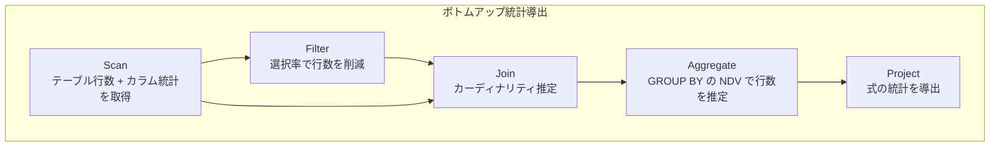
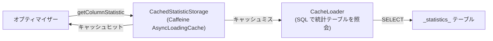
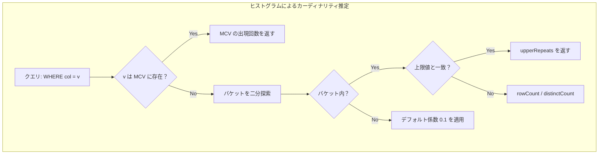

# 第8章 コストモデルと統計情報

> **本章で読むソース**
>
> - [`fe/fe-core/src/main/java/com/starrocks/sql/optimizer/statistics/ColumnStatistic.java`](https://github.com/StarRocks/starrocks/blob/4.1.1/fe/fe-core/src/main/java/com/starrocks/sql/optimizer/statistics/ColumnStatistic.java)
> - [`fe/fe-core/src/main/java/com/starrocks/sql/optimizer/statistics/Statistics.java`](https://github.com/StarRocks/starrocks/blob/4.1.1/fe/fe-core/src/main/java/com/starrocks/sql/optimizer/statistics/Statistics.java)
> - [`fe/fe-core/src/main/java/com/starrocks/sql/optimizer/statistics/StatisticsCalculator.java`](https://github.com/StarRocks/starrocks/blob/4.1.1/fe/fe-core/src/main/java/com/starrocks/sql/optimizer/statistics/StatisticsCalculator.java)
> - [`fe/fe-core/src/main/java/com/starrocks/sql/optimizer/statistics/Histogram.java`](https://github.com/StarRocks/starrocks/blob/4.1.1/fe/fe-core/src/main/java/com/starrocks/sql/optimizer/statistics/Histogram.java)
> - [`fe/fe-core/src/main/java/com/starrocks/sql/optimizer/statistics/Bucket.java`](https://github.com/StarRocks/starrocks/blob/4.1.1/fe/fe-core/src/main/java/com/starrocks/sql/optimizer/statistics/Bucket.java)
> - [`fe/fe-core/src/main/java/com/starrocks/sql/optimizer/cost/CostModel.java`](https://github.com/StarRocks/starrocks/blob/4.1.1/fe/fe-core/src/main/java/com/starrocks/sql/optimizer/cost/CostModel.java)
> - [`fe/fe-core/src/main/java/com/starrocks/sql/optimizer/cost/CostEstimate.java`](https://github.com/StarRocks/starrocks/blob/4.1.1/fe/fe-core/src/main/java/com/starrocks/sql/optimizer/cost/CostEstimate.java)
> - [`fe/fe-core/src/main/java/com/starrocks/sql/optimizer/statistics/StatisticStorage.java`](https://github.com/StarRocks/starrocks/blob/4.1.1/fe/fe-core/src/main/java/com/starrocks/sql/optimizer/statistics/StatisticStorage.java)
> - [`fe/fe-core/src/main/java/com/starrocks/sql/optimizer/statistics/CachedStatisticStorage.java`](https://github.com/StarRocks/starrocks/blob/4.1.1/fe/fe-core/src/main/java/com/starrocks/sql/optimizer/statistics/CachedStatisticStorage.java)
> - [`fe/fe-core/src/main/java/com/starrocks/sql/optimizer/statistics/StatisticsEstimateCoefficient.java`](https://github.com/StarRocks/starrocks/blob/4.1.1/fe/fe-core/src/main/java/com/starrocks/sql/optimizer/statistics/StatisticsEstimateCoefficient.java)
> - [`fe/fe-core/src/main/java/com/starrocks/statistic/StatisticsCollectJobFactory.java`](https://github.com/StarRocks/starrocks/blob/4.1.1/fe/fe-core/src/main/java/com/starrocks/statistic/StatisticsCollectJobFactory.java)

## この章の狙い

Cascades オプティマイザーが物理プランを選択するとき、各オペレーターのコストを見積もり、合計コストが最小のプランを採用する。
コストの精度は統計情報の品質に直結する。
本章では、カラムレベルの統計がどのように表現され、ボトムアップに導出され、最終的にコスト値へ変換されるかを追う。

## 前提

第7章で見た Cascades フレームワークは、GroupExpression ごとにコストを計算し、最良プランを Group に記録する。
コスト計算には `CostModel.calculateCost` が呼ばれ、統計導出には `StatisticsCalculator.estimatorStats` が呼ばれる。
本章はこの二つのクラスを中心に読む。

## 8.1 ColumnStatistic の構造

**ColumnStatistic** は、1つのカラムに対する統計情報を保持する不変オブジェクトである。

[`ColumnStatistic.java L39-L46`](https://github.com/StarRocks/starrocks/blob/4.1.1/fe/fe-core/src/main/java/com/starrocks/sql/optimizer/statistics/ColumnStatistic.java#L39-L46)

```java
    private final double minValue;
    private final double maxValue;
    private final double nullsFraction;
    private final double averageRowSize;
    private final double distinctValuesCount;
    private final Histogram histogram;
    private final StatisticType type;

```

フィールドの意味は以下のとおりである。

- **minValue / maxValue**：カラムの値域。日付型もタイムスタンプとして double に変換される。
- **nullsFraction**：NULL の割合（0.0 から 1.0）。
- **averageRowSize**：1行あたりの平均バイト数。出力サイズの見積もりに使う。
- **distinctValuesCount**（以下 NDV）：カラム内のユニーク値の数。選択率計算の基盤となる。
- **histogram**：値の分布をバケットと MCV（Most Common Values）で表す。後述する。
- **type**：`UNKNOWN`（統計未取得）か `ESTIMATE`（有効な統計あり）の二値。

統計が未取得のカラムには `UNKNOWN` インスタンスが使われる。

[`ColumnStatistic.java L32-L33`](https://github.com/StarRocks/starrocks/blob/4.1.1/fe/fe-core/src/main/java/com/starrocks/sql/optimizer/statistics/ColumnStatistic.java#L32-L33)

```java
    private static final ColumnStatistic UNKNOWN =
            new ColumnStatistic(NEGATIVE_INFINITY, POSITIVE_INFINITY, 0, 1, 1, null, StatisticType.UNKNOWN);
```

`UNKNOWN` は NDV = 1, averageRowSize = 1 というデフォルト値を持つ。
オプティマイザーは `isUnknown()` でこの状態を判別し、統計のないカラムに対してはヒューリスティクスに切り替える。

## 8.2 Statistics クラスによるリレーション全体の統計集約

**Statistics** はリレーション（オペレーターの出力）全体の統計を表す。

[`Statistics.java L35-L43`](https://github.com/StarRocks/starrocks/blob/4.1.1/fe/fe-core/src/main/java/com/starrocks/sql/optimizer/statistics/Statistics.java#L35-L43)

```java
    private final double outputRowCount;
    private final Map<ColumnRefOperator, ColumnStatistic> columnStatistics;
    // This flag set true if get table row count from GlobalStateMgr LE 1
    // Table row count in FE depends on BE reporting，but FE may not get report from BE which just started，
    // this causes the table row count stored in FE to be inaccurate.
    private final boolean tableRowCountMayInaccurate;
    private final Collection<ColumnRefOperator> shadowColumns;

    private final Map<Set<ColumnRefOperator>, MultiColumnCombinedStats> multiColumnCombinedStats;
```

中心となるのは `outputRowCount`（出力行数の推定値）と、各カラムの `ColumnStatistic` を格納する `columnStatistics` マップである。
`tableRowCountMayInaccurate` は、BE からの行数レポートが未到着の場合に true になるフラグで、コストモデルのペナルティ判定に使われる。

出力データサイズの計算には、各カラムの `averageRowSize` を合計して行数に掛ける。

[`Statistics.java L114-L128`](https://github.com/StarRocks/starrocks/blob/4.1.1/fe/fe-core/src/main/java/com/starrocks/sql/optimizer/statistics/Statistics.java#L114-L128)

```java
    public double getAvgRowSize() {
        // Make it at least 1 byte, otherwise the cost model would propagate estimate error
        double totalSize = 0;
        for (Map.Entry<ColumnRefOperator, ColumnStatistic> entry : columnStatistics.entrySet()) {
            if (shadowColumns.contains(entry.getKey())) {
                continue;
            }
            if (!entry.getValue().isUnknown()) {
                totalSize += entry.getValue().getAverageRowSize();
            } else {
                totalSize += entry.getKey().getType().getTypeSize();
            }
        }
        return Math.max(totalSize, 1.0);
    }
```

統計不明のカラムには型サイズをフォールバックとして使い、最低 1 バイトを保証する。

## 8.3 StatisticsCalculator によるボトムアップ統計導出

**StatisticsCalculator** は `OperatorVisitor` を継承し、プランツリーの各オペレーターに対してボトムアップに統計を導出する。
各 visit メソッドが子の Statistics を受け取り、自オペレーターの出力 Statistics を計算して `ExpressionContext` にセットする。



### 8.3.1 Scan：テーブル統計からの初期値

OlapScan の統計導出では、まずテーブルの行数を `GlobalStateMgr` から取得し、次にカラム統計を `StatisticStorage` から読み込む。

[`StatisticsCalculator.java L384-L402`](https://github.com/StarRocks/starrocks/blob/4.1.1/fe/fe-core/src/main/java/com/starrocks/sql/optimizer/statistics/StatisticsCalculator.java#L384-L403)

```java
    private Void computeOlapScanNode(Operator node, ExpressionContext context, Table table,
                                     Collection<Long> selectedPartitionIds,
                                     Map<ColumnRefOperator, Column> colRefToColumnMetaMap) {
        Preconditions.checkState(context.arity() == 0);
        // ... (中略) ...
        // 1. get table row count
        long tableRowCount = StatisticsCalcUtils.getTableRowCount(table, node, optimizerContext);
        // 2. get required columns statistics
        Statistics.Builder builder = StatisticsCalcUtils.estimateScanColumns(table, colRefToColumnMetaMap, optimizerContext);
        if (tableRowCount <= 1) {
            builder.setTableRowCountMayInaccurate(true);
        }

```

パーティションプルーニングが行われた場合、パーティションカラムの min/max と NDV をプルーニング後の範囲に合わせて補正する。
これにより、後段の述語選択率の推定精度が向上する。

### 8.3.2 Filter：選択率の推定

述語による行数の削減は `estimateStatistics` メソッドで行われる。

[`StatisticsCalculator.java L1976-L1991`](https://github.com/StarRocks/starrocks/blob/4.1.1/fe/fe-core/src/main/java/com/starrocks/sql/optimizer/statistics/StatisticsCalculator.java#L1976-L1991)

```java
    public Statistics estimateStatistics(List<ScalarOperator> predicateList, Statistics statistics) {
        if (predicateList.isEmpty()) {
            return statistics;
        }

        Statistics result = statistics;
        for (ScalarOperator predicate : predicateList) {
            result = PredicateStatisticsCalculator.statisticsCalculate(predicate, statistics);
        }

        // avoid sample statistics filter all data, save one rows least
        if (statistics.getOutputRowCount() > 0 && result.getOutputRowCount() == 0) {
            return result.withOutputRowCount(1);
        }
        return result;
    }
```

各述語は `PredicateStatisticsCalculator` に委譲され、述語の種類に応じた選択率が適用される。
統計不明の場合はデフォルトの選択率係数が使われる。

[`StatisticsEstimateCoefficient.java L31`](https://github.com/StarRocks/starrocks/blob/4.1.1/fe/fe-core/src/main/java/com/starrocks/sql/optimizer/statistics/StatisticsEstimateCoefficient.java#L31)

```java
    public static final double PREDICATE_UNKNOWN_FILTER_COEFFICIENT = 0.25;
```

統計不明のカラムに対する述語は、一律 25% の選択率（4行に1行が残る想定）として扱われる。

### 8.3.3 Join：カーディナリティの推定

Join の統計導出は `computeJoinNode` で行われる。
まず左右のカラム統計を統合したクロス結合の統計を構築し、等価結合述語で行数を削減する。

結合カーディナリティの推定には二つの戦略がある。

**相関仮定方式**（Presto 由来）：等価結合条件のうち、最も行数を削減する「駆動述語」を選び、残りには弱い補助フィルタ係数（0.9）を掛ける。

[`StatisticsCalculator.java L1727-L1752`](https://github.com/StarRocks/starrocks/blob/4.1.1/fe/fe-core/src/main/java/com/starrocks/sql/optimizer/statistics/StatisticsCalculator.java#L1727-L1753)

```java
    private Statistics estimatedInnerJoinStatisticsAssumeCorrelated(Statistics statistics,
                                                                    List<BinaryPredicateOperator> eqOnPredicates) {
        // ... (中略) ...
        double auxiliaryCoeffPow = pow(StatisticsEstimateCoefficient.UNKNOWN_AUXILIARY_FILTER_COEFFICIENT, predicateNum - 1);

        double bestRowCount = statistics.getOutputRowCount();
        Statistics bestDrivingStats = null;
        for (BinaryPredicateOperator drivingPredicate : eqOnPredicates) {
            Statistics drivingStats = estimateStatistics(ImmutableList.of(drivingPredicate), statistics);
            double candidateRowCount = drivingStats.getOutputRowCount() * auxiliaryCoeffPow;
            if (candidateRowCount < bestRowCount) {
                bestRowCount = candidateRowCount;
                bestDrivingStats = drivingStats;
            }
        }
        // ... (中略) ...
    }

```

**中間地点方式**（ORCA 由来、デフォルト）：同一テーブルペアに属する述語群にはダンピング（sqrt を累乗的に適用）して相関を考慮し、異なるテーブルペアの述語は独立と仮定する。

[`StatisticsCalculator.java L1776-L1798`](https://github.com/StarRocks/starrocks/blob/4.1.1/fe/fe-core/src/main/java/com/starrocks/sql/optimizer/statistics/StatisticsCalculator.java#L1776-L1799)

```java
    private double estimateInnerRowCountMiddleGround(Statistics statistics,
                                                     List<BinaryPredicateOperator> eqOnPredicates) {
        // ... (中略) ...
        for (Map.Entry<Pair<Integer, Integer>, List<Pair<BinaryPredicateOperator, Double>>> entry :
                tablePairToPredicateWithSelectivity.entrySet()) {
            entry.getValue().sort((o1, o2) -> ((int) (o2.second - o1.second)));
            for (int index = 0; index < entry.getValue().size(); ++index) {
                double selectivity = entry.getValue().get(index).second;
                double sqrtNum = pow(2, index);
                cumulativeSelectivity = cumulativeSelectivity * pow(selectivity, 1 / sqrtNum);
            }
        }
        // ... (中略) ...
    }

```

具体的には、同一テーブルペアの述語を選択率の高い順に並べ、i 番目の述語の選択率に `1 / 2^i` 乗を適用して累積する。
たとえば選択率 0.5 と 0.3 の2述語なら、`0.5 * sqrt(0.3) ≈ 0.274` となり、完全独立仮定の `0.5 * 0.3 = 0.15` より大きくなる。

Join 種別によるカーディナリティの補正も行われる。
LEFT OUTER JOIN では内部結合の行数と左テーブル行数の大きい方が出力行数となり、ANTI JOIN では `max(左行数 * 0.4, 左行数 - 内部結合行数)` が使われる。

### 8.3.4 Aggregate：GROUP BY の行数推定

`computeGroupByStatistics` は GROUP BY カラムの NDV の積からグループ数を推定する。

[`StatisticsCalculator.java L1076-L1163`](https://github.com/StarRocks/starrocks/blob/4.1.1/fe/fe-core/src/main/java/com/starrocks/sql/optimizer/statistics/StatisticsCalculator.java#L1076-L1165)

```java
    public static double computeGroupByStatistics(List<ColumnRefOperator> groupBys, Statistics inputStatistics,
                                                  Map<ColumnRefOperator, ColumnStatistic> groupStatisticsMap) {
        // ... (中略) ...
        // Use multi-column combined statistics for more accurate row count estimation
        double rowCount = 1;
        // ... (中略) ...
            // Use column statistics for precise estimation
            for (int i = 0; i < columnsWithoutMultiColStats.size(); i++) {
                ColumnRefOperator column = columnsWithoutMultiColStats.get(i);
                ColumnStatistic columnStats = inputStatistics.getColumnStatistic(column);
                double cardinality = columnStats.getDistinctValuesCount() +
                        ((columnStats.getNullsFraction() == 0.0) ? 0 : 1);

                if (columnsWithMultiColStats.isEmpty() && i == 0) {
                    rowCount *= cardinality;
                } else {
                    // Adjust cardinality using correlation factor
                    double correlationFactor = Math.pow(
                            StatisticsEstimateCoefficient.UNKNOWN_GROUP_BY_CORRELATION_COEFFICIENT, i + 1D);
                    rowCount *= Math.max(1, cardinality * correlationFactor);
                // ... (中略) ...
                    }
                }
        return Math.min(Math.max(1, rowCount), inputStatistics.getOutputRowCount());
    }

```

1カラム目は NDV をそのまま行数とし、2カラム目以降は相関係数 0.75 を累乗的に掛けてカーディナリティの爆発を抑える。
マルチカラム統計（複数カラムの結合 NDV）が存在する場合は、それを優先して使う。

統計が不明な場合は、入力行数にデフォルト係数 0.5 を掛け、追加カラムごとに 1.05 倍する別のロジックが走る。

## 8.4 CostModel のコスト計算

**CostModel** は `CostEstimate`（CPU, メモリ, ネットワークの三次元コスト）を算出し、重み付き加算でスカラーコストに変換する。

### 8.4.1 CostEstimate の構造

[`CostEstimate.java L21-L28`](https://github.com/StarRocks/starrocks/blob/4.1.1/fe/fe-core/src/main/java/com/starrocks/sql/optimizer/cost/CostEstimate.java#L21-L28)

```java
    private static final CostEstimate ZERO = new CostEstimate(0, 0, 0);
    private static final CostEstimate INFINITE =
            new CostEstimate(POSITIVE_INFINITY, POSITIVE_INFINITY, POSITIVE_INFINITY);

    private final double cpuCost;
    private final double memoryCost;
    private final double networkCost;

```

三次元の分離により、たとえばネットワーク転送の重さとメモリ消費の重さを独立に調整できる。

### 8.4.2 スカラーコストへの変換

`getRealCost` がこの三次元を一つのスカラー値に畳み込む。

[`CostModel.java L129-L136`](https://github.com/StarRocks/starrocks/blob/4.1.1/fe/fe-core/src/main/java/com/starrocks/sql/optimizer/cost/CostModel.java#L129-L136)

```java
    public static double getRealCost(CostEstimate costEstimate) {
        double cpuCostWeight = 0.5;
        double memoryCostWeight = 2;
        double networkCostWeight = 1.5;
        return costEstimate.getCpuCost() * cpuCostWeight +
                costEstimate.getMemoryCost() * memoryCostWeight +
                costEstimate.getNetworkCost() * networkCostWeight;
    }
```

メモリコストの重みが CPU の4倍、ネットワークが CPU の3倍であり、オプティマイザーはメモリ消費の大きいプラン（大規模 Broadcast Join など）を避ける傾向を持つ。

### 8.4.3 オペレーター別のコスト計算

`CostEstimator`（`CostModel` の内部クラス）が各物理オペレーターのコストを計算する。
以下に代表的なオペレーターのコスト式をまとめる。

| オペレーター | CPU | メモリ | ネットワーク |
|---|---|---|---|
| OlapScan | computeSize | 0 | 0 |
| Project | computeSize | 0 | 0 |
| HashAggregate | inputComputeSize * factor | outputComputeSize * factor | 0 |
| HashJoin | HashJoinCostModel で算出 | HashJoinCostModel で算出 | 0 |
| Distribution(SHUFFLE) | outputSize * factor | 0 | outputSize * factor |
| Distribution(BROADCAST) | outputSize * beNum | outputSize * beNum | outputSize * beNum |

`computeSize` は `Statistics.getComputeSize()`（平均行サイズ * 行数）の値である。

Scan のコスト計算はシンプルだが、マテリアライズドビュー（MV）からの Scan には追加のコスト調整がある。

[`CostModel.java L171-L186`](https://github.com/StarRocks/starrocks/blob/4.1.1/fe/fe-core/src/main/java/com/starrocks/sql/optimizer/cost/CostModel.java#L171-L186)

```java
        public CostEstimate visitPhysicalOlapScan(PhysicalOlapScanOperator node, ExpressionContext context) {
            Statistics statistics = context.getStatistics();
            Preconditions.checkNotNull(statistics);
            if (node.getTable().isMaterializedView()) {
                Statistics groupStatistics = context.getGroupStatistics();
                Statistics mvStatistics = context.getStatistics();
                // only adjust cost for mv scan operator when group statistics is unknown and mv group expression
                // statistics is not unknown
                if (groupStatistics != null && groupStatistics.getColumnStatistics().values().stream().
                        anyMatch(ColumnStatistic::isUnknown) && mvStatistics.getColumnStatistics().values().stream().
                        noneMatch(ColumnStatistic::isUnknown)) {
                    return adjustCostForMV(context);
                }
            }
            return CostEstimate.of(statistics.getComputeSize(), 0, 0);
        }
```

Group 内の通常テーブル Scan に統計がなく MV Scan に統計がある場合、MV の行数をコストとして使い、Group 内の最小コストを超えないように調整する。
これにより、統計のある MV が優先的に選ばれやすくなる。

Broadcast 分散のコストには、出力サイズが `maxExecMemByte` を超えたときにペナルティ係数（1000倍）が掛かる。

[`CostModel.java L427-L429`](https://github.com/StarRocks/starrocks/blob/4.1.1/fe/fe-core/src/main/java/com/starrocks/sql/optimizer/cost/CostModel.java#L427-L429)

```java
                    if (outputSize > sessionVariable.getMaxExecMemByte()) {
                        result = result.multiplyBy(StatisticsEstimateCoefficient.BROADCAST_JOIN_MEM_EXCEED_PENALTY);
                    }
```

この仕組みにより、右テーブルが大きすぎる場合に Broadcast Join が選ばれることを防ぐ。

## 8.5 統計の収集と管理

### 8.5.1 StatisticStorage インターフェースと CachedStatisticStorage

**StatisticStorage** は統計の読み書きを抽象化するインターフェースである。

[`StatisticStorage.java L29`](https://github.com/StarRocks/starrocks/blob/4.1.1/fe/fe-core/src/main/java/com/starrocks/sql/optimizer/statistics/StatisticStorage.java#L29)

```java
public interface StatisticStorage {
```

テーブル行数、カラム統計、ヒストグラム、マルチカラム統計の取得と更新を定義する。

実装クラスの **CachedStatisticStorage** は、Caffeine ライブラリの `AsyncLoadingCache` で統計をキャッシュする。

[`CachedStatisticStorage.java L64-L84`](https://github.com/StarRocks/starrocks/blob/4.1.1/fe/fe-core/src/main/java/com/starrocks/sql/optimizer/statistics/CachedStatisticStorage.java#L65-L85)

```java
    AsyncLoadingCache<TableStatsCacheKey, Optional<Long>> tableStatsCache =
            createAsyncLoadingCache(new TableStatsCacheLoader());

    AsyncLoadingCache<ColumnStatsCacheKey, Optional<ColumnStatistic>> columnStatistics =
            createAsyncLoadingCache(new ColumnBasicStatsCacheLoader());

    // ... (中略) ...

    AsyncLoadingCache<ColumnStatsCacheKey, Optional<Histogram>> histogramCache =
            createAsyncLoadingCache(new ColumnHistogramStatsCacheLoader());

    // ... (中略) ...

    AsyncLoadingCache<Long, Optional<MultiColumnCombinedStatistics>> multiColumnStats =
            createAsyncLoadingCache(new MultiColumnCombinedStatsCacheLoader());

```

キャッシュは以下のように構成される。

[`CachedStatisticStorage.java L734-L746`](https://github.com/StarRocks/starrocks/blob/4.1.1/fe/fe-core/src/main/java/com/starrocks/sql/optimizer/statistics/CachedStatisticStorage.java#L734-L746)

```java
    private <K, V> AsyncLoadingCache<K, V> createAsyncLoadingCache(AsyncCacheLoader<K, V> cacheLoader) {
        Caffeine<Object, Object> cacheBuilder = Caffeine.newBuilder()
                .expireAfterWrite(Config.statistic_update_interval_sec * 2, TimeUnit.SECONDS)
                .maximumSize(Config.statistic_cache_columns)
                .executor(statsCacheRefresherExecutor);

        // Only enable refreshAfterWrite if the config is enabled
        if (Config.enable_statistic_cache_refresh_after_write) {
            cacheBuilder.refreshAfterWrite(Config.statistic_update_interval_sec, TimeUnit.SECONDS);
        }

        return cacheBuilder.buildAsync(cacheLoader);
    }
```

TTL は `statistic_update_interval_sec` の2倍に設定され、`refreshAfterWrite` でバックグラウンドリフレッシュが有効化される。
`getColumnStatistic` の呼び出しはまずキャッシュを参照し、キャッシュミスの場合は非同期でロードする。
ロード完了前に別のクエリが同じカラムの統計を要求した場合は `ColumnStatistic.unknown()` を返す。



### 8.5.2 統計収集ジョブ

`ANALYZE TABLE` 文を実行すると、**StatisticsCollectJobFactory** が収集ジョブを生成する。
収集方式には FULL, SAMPLE, HISTOGRAM の3種がある。

[`StatisticsCollectJobFactory.java L138-L159`](https://github.com/StarRocks/starrocks/blob/4.1.1/fe/fe-core/src/main/java/com/starrocks/statistic/StatisticsCollectJobFactory.java#L138-L159)

```java
        if (analyzeType.equals(StatsConstants.AnalyzeType.SAMPLE) && statisticsTypes.isEmpty()) {
            if (Config.statistic_use_meta_statistics) {
                return new HyperStatisticsCollectJob(db, table, partitionIdList, columnNames, columnTypes,
                        StatsConstants.AnalyzeType.SAMPLE, scheduleType, properties, isManualJob);
            } else {
                return new SampleStatisticsCollectJob(db, table, columnNames, columnTypes,
                        StatsConstants.AnalyzeType.SAMPLE, scheduleType, properties);
            }
        } else if (analyzeType.equals(StatsConstants.AnalyzeType.HISTOGRAM)) {
            return new HistogramStatisticsCollectJob(db, table, columnNames, columnTypes, scheduleType, properties);
        } else if (analyzeType.equals(StatsConstants.AnalyzeType.FULL) && statisticsTypes.isEmpty()) {
            if (Config.statistic_use_meta_statistics) {
                return new HyperStatisticsCollectJob(db, table, partitionIdList, columnNames, columnTypes,
                        StatsConstants.AnalyzeType.FULL, scheduleType, properties, isManualJob);
            } else {
                return new FullStatisticsCollectJob(db, table, partitionIdList, columnNames, columnTypes,
                        StatsConstants.AnalyzeType.FULL, scheduleType, properties);
            }
        } else {
            return new MultiColumnHyperStatisticsCollectJob(db, table, partitionIdList, columnNames, columnTypes,
                    analyzeType, scheduleType, properties, statisticsTypes, columnGroup);
        }
```

`statistic_use_meta_statistics` が有効な場合は `HyperStatisticsCollectJob` が使われ、メタデータからの高速な統計推定が行われる。

### 8.5.3 自動収集のスケジューリング

自動収集ジョブは、テーブルの「健全度」（healthy）に基づいて実行の要否を判定する。

[`StatisticsCollectJobFactory.java L544-L553`](https://github.com/StarRocks/starrocks/blob/4.1.1/fe/fe-core/src/main/java/com/starrocks/statistic/StatisticsCollectJobFactory.java#L544-L553)

```java
            double statisticAutoCollectRatio =
                    PropertyUtil.propertyAsDouble(jobProperties, StatsConstants.STATISTIC_AUTO_COLLECT_RATIO,
                            Config.statistic_auto_collect_ratio);

            healthy = basicStatsMeta.getHealthy();
            if (!needRecollectPredicateColumnsOnUnpartitioned && healthy > statisticAutoCollectRatio) {
                LOG.debug("statistics job doesn't work on health table: {}, healthy: {}, collect healthy limit: <{}",
                        table.getName(), healthy, statisticAutoCollectRatio);
                return;
            }
```

健全度が閾値（`statistic_auto_collect_ratio`）を超えている場合は再収集をスキップする。
大規模テーブルで健全度が低い場合は、FULL ではなく SAMPLE 収集にフォールバックして収集コストを抑える。

さらに、述語カラム（Predicate Columns）戦略が有効な場合、過去のクエリで述語に使われたカラムのみを優先的に収集する。
カラム数が `statistic_auto_collect_predicate_columns_threshold` を超えるテーブルで、この戦略が自動的に適用される。

## 8.6 最適化の工夫：ヒストグラムによる非一様分布のカーディナリティ推定

NDV と min/max だけでは値の分布が一様と仮定するしかない。
実際のデータでは特定の値に偏りがあることが多く、一様仮定は選択率の推定を大きく外す。
StarRocks はヒストグラムと MCV（Most Common Values）を組み合わせてこの問題に対処している。

### 8.6.1 Histogram と Bucket の構造

**Histogram** はソート済みの `Bucket` リストと `MCV` マップを保持する。

[`Histogram.java L27-L33`](https://github.com/StarRocks/starrocks/blob/4.1.1/fe/fe-core/src/main/java/com/starrocks/sql/optimizer/statistics/Histogram.java#L27-L33)

```java
    private final List<Bucket> buckets;
    private final Map<String, Long> mcv;

    public Histogram(List<Bucket> buckets, Map<String, Long> mcv) {
        this.buckets = buckets;
        this.mcv = mcv;

```

**Bucket** は等深度ヒストグラムのバケットを表す。

[`Bucket.java L20-L25`](https://github.com/StarRocks/starrocks/blob/4.1.1/fe/fe-core/src/main/java/com/starrocks/sql/optimizer/statistics/Bucket.java#L20-L25)

```java
public class Bucket {
    private final double lower;
    private final double upper;
    private final Long count;
    private final Long upperRepeats;
    private final Optional<Long> distinctCount;
```

各フィールドの意味は以下のとおりである。

- **lower / upper**：バケットの値域
- **count**：このバケットまでの累積行数
- **upperRepeats**：上限値と一致する行数
- **distinctCount**：バケット内のユニーク値数（取得できた場合）

`MCV` は頻出値とその出現回数のマップである。
頻出値はバケットの外で別管理されるため、頻出値の選択率推定がバケットの一様仮定に埋もれない。

### 8.6.2 バケット内のカーディナリティ推定

特定の値がヒストグラムのどのバケットに含まれるかを二分探索で特定し、バケット内の行数を推定する。

[`Histogram.java L76-L102`](https://github.com/StarRocks/starrocks/blob/4.1.1/fe/fe-core/src/main/java/com/starrocks/sql/optimizer/statistics/Histogram.java#L76-L102)

```java
    public Optional<Long> getRowCountInBucket(double value, double distinctValuesCount, boolean useFixedPointEstimation) {
        int left = 0;
        int right = buckets.size() - 1;
        while (left <= right) {
            int mid = (left + right) / 2;
            Bucket bucket = buckets.get(mid);

            long prevRowCount = 0;
            if (mid > 0) {
                prevRowCount = buckets.get(mid - 1).getCount();
            }

            Optional<Long> rowCountOfBucket = bucket.getRowCountInBucket(value, prevRowCount,
                    distinctValuesCount / buckets.size(), useFixedPointEstimation);
            // ... (中略) ...
        }

        return Optional.empty();
    }

```

バケット内の行数推定では、上限値と一致する場合は `upperRepeats` を返す。
それ以外の値に対しては、バケット内の行数をユニーク値数で割って1値あたりの平均行数を求める。

[`Bucket.java L59-L77`](https://github.com/StarRocks/starrocks/blob/4.1.1/fe/fe-core/src/main/java/com/starrocks/sql/optimizer/statistics/Bucket.java#L59-L77)

```java
    public Optional<Long> getRowCountInBucket(double value, Long previousBucketCount, double distinctValuesCount,
                                              boolean useFixedPointEstimation) {
        if (lower <= value && value < upper) {
            long rowCount = count - previousBucketCount - upperRepeats;

            if (distinctCount.isPresent()) {
                distinctValuesCount = (double) distinctCount.get() - 1;
            } else if (useFixedPointEstimation) {
                distinctValuesCount = upper - lower;
            }

            rowCount = (long) Math.ceil(Math.max(1, rowCount / Math.max(1, distinctValuesCount)));
            return Optional.of(rowCount);
        } else if (upper == value) {
            return Optional.of(upperRepeats);
        }

        return Optional.empty();
    }
```

`distinctCount` がバケットに記録されている場合はそれを使い、整数型の場合は `upper - lower` で近似する。
この仕組みにより、値が密集しているバケット（データの偏り）では高い行数を、疎なバケットでは低い行数を推定でき、一様分布仮定よりも実データに近い推定が可能になる。

ヒストグラムに存在しない値に対しては、デフォルト係数 0.1 が適用される。

[`StatisticsEstimateCoefficient.java L69`](https://github.com/StarRocks/starrocks/blob/4.1.1/fe/fe-core/src/main/java/com/starrocks/sql/optimizer/statistics/StatisticsEstimateCoefficient.java#L69)

```java
    public static final double HISTOGRAM_UNREPRESENTED_VALUE_COEFFICIENT = 0.1;
```



## まとめ

StarRocks のコストベースオプティマイザーは、カラムレベルの統計情報をボトムアップに導出し、CPU, メモリ, ネットワークの三次元コストに変換して最適プランを選択する。
統計情報は Caffeine の非同期キャッシュで管理され、キャッシュミス時もクエリをブロックせずに `UNKNOWN` 統計で進行する。
Join カーディナリティの推定では、述語間の相関を考慮するダンピング戦略により、独立仮定と完全相関仮定の中間を取る。
ヒストグラムと MCV による非一様分布の推定は、一様仮定では大きく外れるスキューしたデータに対して推定精度を高める。

## 関連する章

- 第7章：Cascades フレームワークにおけるコスト計算の呼び出し元
- 第9章以降：物理プランの生成とプラン Fragment への変換
