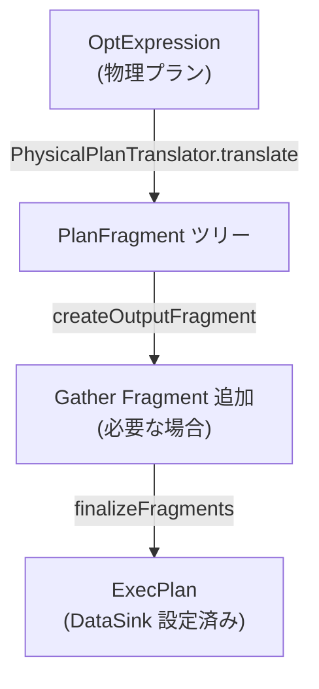
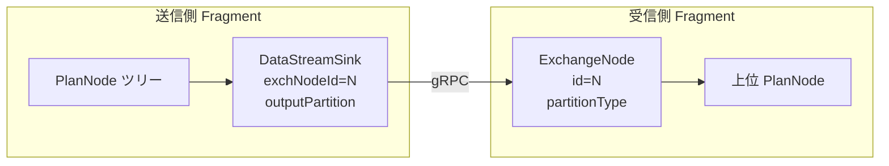
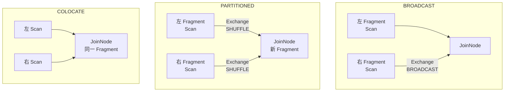
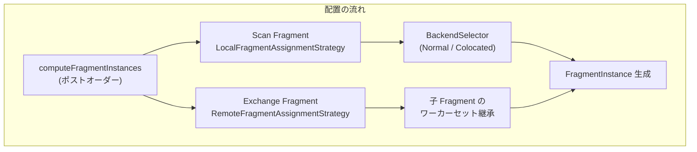
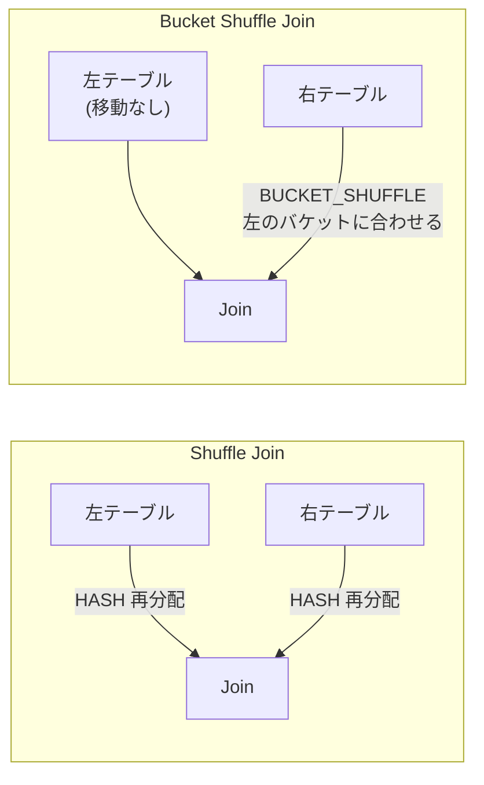

# 第9章 分散プランと Fragment

> **本章で読むソース**
>
> - [`fe/fe-core/src/main/java/com/starrocks/sql/plan/PlanFragmentBuilder.java`](https://github.com/StarRocks/starrocks/blob/4.1.1/fe/fe-core/src/main/java/com/starrocks/sql/plan/PlanFragmentBuilder.java)
> - [`fe/fe-core/src/main/java/com/starrocks/sql/plan/ExecPlan.java`](https://github.com/StarRocks/starrocks/blob/4.1.1/fe/fe-core/src/main/java/com/starrocks/sql/plan/ExecPlan.java)
> - [`fe/fe-core/src/main/java/com/starrocks/planner/PlanFragment.java`](https://github.com/StarRocks/starrocks/blob/4.1.1/fe/fe-core/src/main/java/com/starrocks/planner/PlanFragment.java)
> - [`fe/fe-core/src/main/java/com/starrocks/planner/ExchangeNode.java`](https://github.com/StarRocks/starrocks/blob/4.1.1/fe/fe-core/src/main/java/com/starrocks/planner/ExchangeNode.java)
> - [`fe/fe-core/src/main/java/com/starrocks/planner/DataSink.java`](https://github.com/StarRocks/starrocks/blob/4.1.1/fe/fe-core/src/main/java/com/starrocks/planner/DataSink.java)
> - [`fe/fe-core/src/main/java/com/starrocks/planner/DataStreamSink.java`](https://github.com/StarRocks/starrocks/blob/4.1.1/fe/fe-core/src/main/java/com/starrocks/planner/DataStreamSink.java)
> - [`fe/fe-core/src/main/java/com/starrocks/planner/DataPartition.java`](https://github.com/StarRocks/starrocks/blob/4.1.1/fe/fe-core/src/main/java/com/starrocks/planner/DataPartition.java)
> - [`fe/fe-core/src/main/java/com/starrocks/planner/OlapScanNode.java`](https://github.com/StarRocks/starrocks/blob/4.1.1/fe/fe-core/src/main/java/com/starrocks/planner/OlapScanNode.java)
> - [`fe/fe-core/src/main/java/com/starrocks/sql/optimizer/ChildOutputPropertyGuarantor.java`](https://github.com/StarRocks/starrocks/blob/4.1.1/fe/fe-core/src/main/java/com/starrocks/sql/optimizer/ChildOutputPropertyGuarantor.java)
> - [`fe/fe-core/src/main/java/com/starrocks/qe/CoordinatorPreprocessor.java`](https://github.com/StarRocks/starrocks/blob/4.1.1/fe/fe-core/src/main/java/com/starrocks/qe/CoordinatorPreprocessor.java)
> - [`fe/fe-core/src/main/java/com/starrocks/qe/scheduler/assignment/LocalFragmentAssignmentStrategy.java`](https://github.com/StarRocks/starrocks/blob/4.1.1/fe/fe-core/src/main/java/com/starrocks/qe/scheduler/assignment/LocalFragmentAssignmentStrategy.java)

## この章の狙い

Cascades オプティマイザが生成した物理プランは、単一のオペレーターツリーである。
MPP データベースでは、このツリーを複数の BE に分散して並列実行する必要がある。
StarRocks はツリーを **Fragment** と呼ばれる単位に分割し、Fragment 間を **ExchangeNode** と **DataStreamSink** で接続してネットワーク越しのデータ転送を表現する。
本章では、物理プランから Fragment への変換、データ分配方式の選択、Coordinator による BE への Fragment 割り当てまでの一連の仕組みを追う。

## 前提

第8章までで扱った Cascades オプティマイザの物理プラン出力(`OptExpression` ツリー)の構造を理解していること。
`DistributionSpec`(SHUFFLE, BROADCAST, GATHER など)の概念を知っていること。

## ExecPlan と PlanFragment の構造

物理プランから Fragment への変換結果を保持するコンテナが **ExecPlan** である。
ExecPlan は Fragment のリスト、ScanNode の一覧、出力式、記述子テーブルなどを一つにまとめる。

[`fe/fe-core/src/main/java/com/starrocks/sql/plan/ExecPlan.java` L48-L71](https://github.com/StarRocks/starrocks/blob/4.1.1/fe/fe-core/src/main/java/com/starrocks/sql/plan/ExecPlan.java#L48-L71)

```java
public class ExecPlan {
    private final ConnectContext connectContext;
    private final List<String> colNames;
    private final List<ScanNode> scanNodes = new ArrayList<>();
    private final List<Expr> outputExprs = new ArrayList<>();
    private final DescriptorTable descTbl = new DescriptorTable();
    private final Map<ColumnRefOperator, Expr> colRefToExpr = new HashMap<>();
    private final ArrayList<PlanFragment> fragments = new ArrayList<>();
    // ... (中略) ...
    private final IdGenerator<PlanNodeId> nodeIdGenerator = PlanNodeId.createGenerator();
    private final IdGenerator<PlanFragmentId> fragmentIdGenerator = PlanFragmentId.createGenerator();

```

`fragments` リストの先頭要素が結果を返すルート Fragment であり、`getTopFragment()` で取得できる。
`nodeIdGenerator` と `fragmentIdGenerator` により、PlanNode と Fragment の ID が一意に採番される。

**PlanFragment** は `TreeNode<PlanFragment>` を継承しており、Fragment 同士が親子関係のツリーを構成する。
各 Fragment は、実行する PlanNode ツリーのルート(`planRoot`)、出力先の ExchangeNode(`destNode`)、データの入力分配方式(`dataPartition`)、出力分配方式(`outputPartition`)、そしてデータの送出先を記述する `DataSink` を持つ。

[`fe/fe-core/src/main/java/com/starrocks/planner/PlanFragment.java` L117-L141](https://github.com/StarRocks/starrocks/blob/4.1.1/fe/fe-core/src/main/java/com/starrocks/planner/PlanFragment.java#L117-L141)

```java
public class PlanFragment extends TreeNode<PlanFragment> {
    // id for this plan fragment
    protected final PlanFragmentId fragmentId;

    // root of plan tree executed by this fragment
    protected PlanNode planRoot;

    // exchange node to which this fragment sends its output
    private ExchangeNode destNode;

    // if null, outputs the entire row produced by planRoot
    protected ArrayList<Expr> outputExprs;

    // created in finalize() or set in setSink()
    protected DataSink sink;

    // specification of the partition of the input of this fragment;
    // an UNPARTITIONED fragment is executed on only a single node
    // TODO: improve this comment, "input" is a bit misleading
    protected final DataPartition dataPartition;

    // specification of how the output of this fragment is partitioned (i.e., how
    // it's sent to its destination);
    // if the output is UNPARTITIONED, it is being broadcast
    protected DataPartition outputPartition;
```

Fragment の境界は ExchangeNode で表現される。
`setFragmentInPlanTree` メソッドは PlanNode ツリーを再帰走査して各ノードにフラグメントを登録するが、ExchangeNode に到達すると走査を停止する。
ExchangeNode の子はすでに別の Fragment に属しているためである。

[`fe/fe-core/src/main/java/com/starrocks/planner/PlanFragment.java` L225-L236](https://github.com/StarRocks/starrocks/blob/4.1.1/fe/fe-core/src/main/java/com/starrocks/planner/PlanFragment.java#L225-L236)

```java
    private void setFragmentInPlanTree(PlanNode node) {
        if (node == null) {
            return;
        }
        node.setFragment(this);
        if (node instanceof ExchangeNode) {
            return;
        }
        for (PlanNode child : node.getChildren()) {
            setFragmentInPlanTree(child);
        }
    }
```

## PlanFragmentBuilder による Fragment 構築

### エントリポイントと全体の流れ

物理プランから ExecPlan への変換は `PlanFragmentBuilder.createPhysicalPlan` で始まる。

[`fe/fe-core/src/main/java/com/starrocks/sql/plan/PlanFragmentBuilder.java` L278-L289](https://github.com/StarRocks/starrocks/blob/4.1.1/fe/fe-core/src/main/java/com/starrocks/sql/plan/PlanFragmentBuilder.java#L278-L289)

```java
    public static ExecPlan createPhysicalPlan(OptExpression plan, ConnectContext connectContext,
                                              List<ColumnRefOperator> outputColumns, ColumnRefFactory columnRefFactory,
                                              List<String> colNames,
                                              TResultSinkType resultSinkType,
                                              boolean hasOutputFragment, boolean isShortCircuit) {
        UKFKConstraintsCollector.collectColumnConstraints(plan);
        ExecPlan execPlan = new ExecPlan(connectContext, colNames, plan, outputColumns, isShortCircuit);
        createOutputFragment(new PhysicalPlanTranslator(columnRefFactory).translate(plan, execPlan), execPlan,
                outputColumns, hasOutputFragment);
        execPlan.setPlanCount(plan.getPlanCount());
        return finalizeFragments(execPlan, resultSinkType);
    }
```

処理は3段階に分かれる。

1. `PhysicalPlanTranslator.translate` が `OptExpression` ツリーをポストオーダーで走査し、PlanNode と PlanFragment を生成する
2. `createOutputFragment` がトップ Fragment にパーティションが残っていれば、結果を集約する Gather 用 Fragment を追加する
3. `finalizeFragments` が全 Fragment に DataSink を設定し、Fragment リストを実行順序(リーフ先頭)に反転する



### Visitor パターンによるオペレーター別変換

**PhysicalPlanTranslator** は `OptExpressionVisitor<PlanFragment, ExecPlan>` を継承した内部クラスである。
各物理オペレーターに対応する `visitXxx` メソッドが定義されており、オペレーターの `accept` メソッドで適切な visit メソッドにディスパッチされる。

[`fe/fe-core/src/main/java/com/starrocks/sql/plan/PlanFragmentBuilder.java` L475-L495](https://github.com/StarRocks/starrocks/blob/4.1.1/fe/fe-core/src/main/java/com/starrocks/sql/plan/PlanFragmentBuilder.java#L475-L495)

```java
    private static class PhysicalPlanTranslator extends OptExpressionVisitor<PlanFragment, ExecPlan> {
        private final ColumnRefFactory columnRefFactory;
        // ... (中略) ...
        public PlanFragment translate(OptExpression optExpression, ExecPlan context) {
            PlanFragment fragment = visit(optExpression, context);
            computeFragmentCost(context, fragment);
            // ... (中略) ...
            return fragment;
        }

```

`visit` メソッドは子を先に再帰処理するポストオーダー走査である。
各 `visitXxx` は PlanFragment を返す。

スキャンノード(OlapScan, HiveScan など)は常に新しい Fragment を `DataPartition.RANDOM` で生成する。

[`fe/fe-core/src/main/java/com/starrocks/sql/plan/PlanFragmentBuilder.java` L1090-L1091](https://github.com/StarRocks/starrocks/blob/4.1.1/fe/fe-core/src/main/java/com/starrocks/sql/plan/PlanFragmentBuilder.java#L1090-L1091)

```java
            PlanFragment fragment =
                    new PlanFragment(context.getNextFragmentId(), scanNode, DataPartition.RANDOM);
```

集約やフィルタのような中間オペレーターは、入力 Fragment の `planRoot` を差し替えるだけで、新しい Fragment は作らない。

`PhysicalDistributionOperator` だけが Fragment の境界を生む。
この visitor メソッドが ExchangeNode を生成し、新しい Fragment を作成して、子 Fragment との間にデータ転送経路を設定する。

## ExchangeNode と DataStreamSink によるデータ転送

### PhysicalDistribution の変換

`visitPhysicalDistribution` が Fragment 境界の主要な生成箇所である。

[`fe/fe-core/src/main/java/com/starrocks/sql/plan/PlanFragmentBuilder.java` L2637-L2661](https://github.com/StarRocks/starrocks/blob/4.1.1/fe/fe-core/src/main/java/com/starrocks/sql/plan/PlanFragmentBuilder.java#L2637-L2661)

```java
        public PlanFragment visitPhysicalDistribution(OptExpression optExpr, ExecPlan context) {
            // ... (中略) ...
            PhysicalDistributionOperator distribution = (PhysicalDistributionOperator) optExpr.getOp();
            ExchangeNode exchangeNode = new ExchangeNode(context.getNextNodeId(),
                    inputFragment.getPlanRoot(), distribution.getDistributionSpec().getType());
            DataPartition dataPartition =
                    translateDistributionToDataPartition(distribution.getDistributionSpec(), context);
            exchangeNode.setDataPartition(dataPartition);

            PlanFragment fragment =
                    new PlanFragment(context.getNextFragmentId(), exchangeNode, dataPartition);
            // ... (中略) ...
            inputFragment.setDestination(exchangeNode);
            inputFragment.setOutputPartition(dataPartition);

            context.getFragments().add(fragment);
            return fragment;
        }

```

この処理は次の手順で Fragment の接続を確立する。

1. ExchangeNode を生成し、受信側 Fragment のルートに据える
2. `inputFragment.setDestination(exchangeNode)` で送信側 Fragment の出力先を登録する
3. `inputFragment.setOutputPartition(dataPartition)` で送信側のデータ分配方式を指定する

### ExchangeNode の構造

**ExchangeNode** は PlanNode を継承し、1:N のデータストリームの受信側を表す。
`mergeInfo` フィールドにソート情報を設定すると、ソート済みストリームのマージを行う MERGING-EXCHANGE として機能する。

[`fe/fe-core/src/main/java/com/starrocks/planner/ExchangeNode.java` L75-L94](https://github.com/StarRocks/starrocks/blob/4.1.1/fe/fe-core/src/main/java/com/starrocks/planner/ExchangeNode.java#L75-L94)

```java
public class ExchangeNode extends PlanNode {
    // The parameters based on which sorted input streams are merged by this
    // exchange node. Null if this exchange does not merge sorted streams
    private SortInfo mergeInfo;

    // Offset after which the exchange begins returning rows. Currently valid
    // only if mergeInfo_ is non-null, i.e. this is a merging exchange node.
    private long offset;
    // partitionType is used for BE's exchange source node to specify the input partition type
    // exchange source then decide whether local shuffle is needed
    // to be set in ExecutionDAG::connectXXXFragmentToDestFragments
    private TPartitionType partitionType;
    // this is the same as input fragment's output dataPartition, right now only used for explain
    private DataPartition dataPartition;
    // distributionType is used for plan fragment builder to decide join's DistributionMode(broadcast,colocate,etc)
    private DistributionSpec.DistributionType distributionType;
    // Specify the columns which need to send, work on CTE, and keep empty in other sense
    private List<Integer> receiveColumns;

    private boolean useParallelMerge = true;
```

### DataSink と DataStreamSink

**DataSink** は Fragment の出力行の宛先を記述する抽象クラスである。
宛先がリモートの別 Fragment であれば `DataStreamSink`、クエリ結果の返却であれば `ResultSink` が使われる。

[`fe/fe-core/src/main/java/com/starrocks/planner/DataSink.java` L53-L55](https://github.com/StarRocks/starrocks/blob/4.1.1/fe/fe-core/src/main/java/com/starrocks/planner/DataSink.java#L53-L55)

```java
public abstract class DataSink {
    // Fragment that this DataSink belongs to. Set by the PlanFragment enclosing this sink.
    protected PlanFragment fragment_;
```

**DataStreamSink** は DataSink の具象クラスで、対応する ExchangeNode の ID(`exchNodeId`)と出力パーティション(`outputPartition`)を保持する。
送信側 Fragment の DataStreamSink と受信側 Fragment の ExchangeNode が同じ `exchNodeId` を持つことで、データ転送のペアが成立する。

[`fe/fe-core/src/main/java/com/starrocks/planner/DataStreamSink.java` L47-L65](https://github.com/StarRocks/starrocks/blob/4.1.1/fe/fe-core/src/main/java/com/starrocks/planner/DataStreamSink.java#L47-L65)

```java
public class DataStreamSink extends DataSink {
    private final PlanNodeId exchNodeId;
    private int exchDop;
    private DataPartition outputPartition;
    private boolean isMerge;
    // ... (中略) ...
    public DataStreamSink(PlanNodeId exchNodeId) {
        this.exchNodeId = exchNodeId;
        this.limit = -1;
    }

```

DataSink の生成は `finalizeFragments` 内の `PlanFragment.createDataSink` で行われる。
`destNode` が設定されていれば DataStreamSink を、設定されていなければ(ルート Fragment)ResultSink を生成する。

[`fe/fe-core/src/main/java/com/starrocks/planner/PlanFragment.java` L443-L470](https://github.com/StarRocks/starrocks/blob/4.1.1/fe/fe-core/src/main/java/com/starrocks/planner/PlanFragment.java#L443-L470)

```java
    public void createDataSink(TResultSinkType resultSinkType, ExecPlan execPlan) {
        if (sink != null) {
            return;
        }
        if (destNode != null) {
            DataStreamSink streamSink = new DataStreamSink(destNode.getId());
            streamSink.setPartition(outputPartition);
            streamSink.setMerge(destNode.isMerge());
            streamSink.setFragment(this);
            sink = streamSink;
        } else {
            // ... (中略) ...
                sink = new ResultSink(planRoot.getId(), resultSinkType);
            }
        }

```



## データ分配方式

### DataPartition の種類

**DataPartition** は Fragment の入出力データがどのように分配されるかを表す。
`TPartitionType` 列挙型で種別を指定し、ハッシュパーティションの場合は分配キーとなる式リスト(`partitionExprs`)を伴う。

[`fe/fe-core/src/main/java/com/starrocks/planner/DataPartition.java` L62-L74](https://github.com/StarRocks/starrocks/blob/4.1.1/fe/fe-core/src/main/java/com/starrocks/planner/DataPartition.java#L62-L74)

```java
public class DataPartition {
    public static final DataPartition UNPARTITIONED = new DataPartition(TPartitionType.UNPARTITIONED);
    public static final DataPartition RANDOM = new DataPartition(TPartitionType.RANDOM);
    // ... (中略) ...
    private final TPartitionType type;
    private ImmutableList<Expr> partitionExprs;

```

主要な分配方式は次のとおりである。

- **UNPARTITIONED**：データを1箇所に集約する。Gather や Broadcast の受信側で使われる
- **RANDOM**：ラウンドロビンで分散する。スキャン Fragment のデフォルト
- **HASH_PARTITIONED**：指定キーのハッシュ値で分散する。Shuffle Join や Shuffle Aggregation に使われる
- **BUCKET_SHUFFLE_HASH_PARTITIONED**：テーブルのバケット構造に合わせて分散する。Bucket Shuffle Join に使われる

### DistributionSpec から DataPartition への変換

`translateDistributionToDataPartition` がオプティマイザの `DistributionSpec` を実行レイヤーの `DataPartition` に変換する。

[`fe/fe-core/src/main/java/com/starrocks/sql/plan/PlanFragmentBuilder.java` L4485-L4510](https://github.com/StarRocks/starrocks/blob/4.1.1/fe/fe-core/src/main/java/com/starrocks/sql/plan/PlanFragmentBuilder.java#L4485-L4510)

```java
        private DataPartition translateDistributionToDataPartition(DistributionSpec distributionSpec,
                                                                   ExecPlan context) {
            DataPartition dataPartition;
            if (DistributionSpec.DistributionType.GATHER.equals(distributionSpec.getType())) {
                dataPartition = DataPartition.UNPARTITIONED;
            } else if (DistributionSpec.DistributionType.BROADCAST
                    .equals(distributionSpec.getType())) {
                dataPartition = DataPartition.UNPARTITIONED;
            } else if (DistributionSpec.DistributionType.SHUFFLE.equals(distributionSpec.getType())) {
                // ... (中略) ...
                dataPartition = DataPartition.hashPartitioned(distributeExpressions);
            } else if (DistributionSpec.DistributionType.ROUND_ROBIN.equals(
                    distributionSpec.getType())) {
                dataPartition = DataPartition.RANDOM;
            } else {
                throw new StarRocksPlannerException("Unsupport exchange type : "
                        + distributionSpec.getType(), INTERNAL_ERROR);
            }
            return dataPartition;
        }

```

GATHER と BROADCAST はいずれも `UNPARTITIONED` に変換される。
違いはセマンティクスにある。GATHER は複数ソースから1つの受信先へ集約し、BROADCAST は1つのソースから複数の受信先へ複製する。

## Join の分配モードと Fragment 構築

### 分配モードの推論

`inferDistributionMode` が ExchangeNode の有無と `RequiredProperties` の種別から、Join のデータ分配方式を判定する。

[`fe/fe-core/src/main/java/com/starrocks/sql/plan/PlanFragmentBuilder.java` L4125-L4155](https://github.com/StarRocks/starrocks/blob/4.1.1/fe/fe-core/src/main/java/com/starrocks/sql/plan/PlanFragmentBuilder.java#L4125-L4155)

```java
        private JoinNode.DistributionMode inferDistributionMode(OptExpression optExpr, PlanNode leftFragmentPlanRoot,
                                                                PlanNode rightFragmentPlanRoot) {
            JoinNode.DistributionMode distributionMode;
            if (isExchangeWithDistributionType(leftFragmentPlanRoot, DistributionSpec.DistributionType.SHUFFLE) &&
                    isExchangeWithDistributionType(rightFragmentPlanRoot,
                            DistributionSpec.DistributionType.SHUFFLE)) {
                distributionMode = JoinNode.DistributionMode.PARTITIONED;
            } else if (isExchangeWithDistributionType(rightFragmentPlanRoot,
                    DistributionSpec.DistributionType.BROADCAST)) {
                distributionMode = JoinNode.DistributionMode.BROADCAST;
            } else if (!(leftFragmentPlanRoot instanceof ExchangeNode) &&
                    !(rightFragmentPlanRoot instanceof ExchangeNode)) {
                if (isColocateJoin(optExpr)) {
                    distributionMode = HashJoinNode.DistributionMode.COLOCATE;
                } else if (ConnectContext.get().getSessionVariable().isEnableReplicationJoin() &&
                        rightFragmentPlanRoot.canDoReplicatedJoin()) {
                    distributionMode = JoinNode.DistributionMode.REPLICATED;
                } else if (isShuffleJoin(optExpr)) {
                    distributionMode = JoinNode.DistributionMode.SHUFFLE_HASH_BUCKET;
                } else {
                    // ... (中略) ...
                }
            } else if (isShuffleJoin(optExpr)) {
                distributionMode = JoinNode.DistributionMode.SHUFFLE_HASH_BUCKET;
            } else {
                distributionMode = JoinNode.DistributionMode.LOCAL_HASH_BUCKET;
            }
            return distributionMode;
        }

```

判定ロジックの概要は次のとおりである。

- 左右とも SHUFFLE 型の ExchangeNode → **PARTITIONED**(両側シャッフル)
- 右側のみ BROADCAST 型の ExchangeNode → **BROADCAST**(右側を全ノードに複製)
- 両側とも ExchangeNode でない場合 → **COLOCATE**(コロケート配置)または **REPLICATED**(レプリカ結合)
- 片側のみ ExchangeNode でシャッフル → **SHUFFLE_HASH_BUCKET** または **LOCAL_HASH_BUCKET**(バケット単位のシャッフル)

### 分配モード別の Fragment 組み立て

`buildJoinFragment` が分配モードに応じて Fragment を組み立てる。

[`fe/fe-core/src/main/java/com/starrocks/sql/plan/PlanFragmentBuilder.java` L4030-L4122](https://github.com/StarRocks/starrocks/blob/4.1.1/fe/fe-core/src/main/java/com/starrocks/sql/plan/PlanFragmentBuilder.java#L4030-L4122)

```java
        private PlanFragment buildJoinFragment(ExecPlan context, PlanFragment leftFragment, PlanFragment rightFragment,
                                               JoinNode.DistributionMode distributionMode, JoinNode joinNode) {
            if (distributionMode.equals(JoinNode.DistributionMode.BROADCAST)) {
                setJoinPushDown(joinNode);

                // Connect parent and child fragment
                rightFragment.getPlanRoot().setFragment(leftFragment);

                // Currently, we always generate new fragment for PhysicalDistribution.
                // So we need to remove exchange node only fragment for Join.
                context.getFragments().remove(rightFragment);

                // Move leftFragment to end, it depends on all of its children
                context.getFragments().remove(leftFragment);
                context.getFragments().add(leftFragment);
                leftFragment.setPlanRoot(joinNode);
                leftFragment.addChildren(rightFragment.getChildren());
                leftFragment.mergeQueryGlobalDicts(rightFragment.getQueryGlobalDicts());
                leftFragment.mergeQueryDictExprs(rightFragment.getQueryGlobalDictExprs());
                return leftFragment;
            } else if (distributionMode.equals(JoinNode.DistributionMode.PARTITIONED)) {
                PlanFragment joinFragment = new PlanFragment(context.getNextFragmentId(),
                        joinNode, leftFragment.getChild(0).getOutputPartition());
                // Currently, we always generate new fragment for PhysicalDistribution.
                // So we need to remove exchange node only fragment for Join.
                mergeChildFragmentsIntoParent(joinFragment, Lists.newArrayList(leftFragment, rightFragment), context);

                context.getFragments().add(joinFragment);

                return joinFragment;
            } else if (distributionMode.equals(JoinNode.DistributionMode.COLOCATE) ||
                    distributionMode.equals(JoinNode.DistributionMode.REPLICATED)) {
                if (distributionMode.equals(JoinNode.DistributionMode.COLOCATE)) {
                    joinNode.setColocate(true, "");
                } else {
                    joinNode.setReplicated(true);
                }
                setJoinPushDown(joinNode);

                joinNode.setChild(0, leftFragment.getPlanRoot());
                joinNode.setChild(1, rightFragment.getPlanRoot());
                leftFragment.setPlanRoot(joinNode);
                leftFragment.addChildren(rightFragment.getChildren());
                context.getFragments().remove(rightFragment);

                context.getFragments().remove(leftFragment);
                context.getFragments().add(leftFragment);
                leftFragment.mergeQueryGlobalDicts(rightFragment.getQueryGlobalDicts());
                leftFragment.mergeQueryDictExprs(rightFragment.getQueryGlobalDictExprs());

                return leftFragment;
            } else if (distributionMode.equals(JoinNode.DistributionMode.SHUFFLE_HASH_BUCKET)) {
                setJoinPushDown(joinNode);

                // distributionMode is SHUFFLE_HASH_BUCKET
                if (!(leftFragment.getPlanRoot() instanceof ExchangeNode) &&
                        !(rightFragment.getPlanRoot() instanceof ExchangeNode)) {
                    joinNode.setChild(0, leftFragment.getPlanRoot());
                    joinNode.setChild(1, rightFragment.getPlanRoot());
                    leftFragment.setPlanRoot(joinNode);
                    leftFragment.addChildren(rightFragment.getChildren());
                    context.getFragments().remove(rightFragment);

                    context.getFragments().remove(leftFragment);
                    context.getFragments().add(leftFragment);

                    leftFragment.mergeQueryGlobalDicts(rightFragment.getQueryGlobalDicts());
                    leftFragment.mergeQueryDictExprs(rightFragment.getQueryGlobalDictExprs());
                    return leftFragment;
                } else if (leftFragment.getPlanRoot() instanceof ExchangeNode &&
                        !(rightFragment.getPlanRoot() instanceof ExchangeNode)) {
                    return computeShuffleHashBucketPlanFragment(context, rightFragment,
                            leftFragment, joinNode);
                } else {
                    return computeShuffleHashBucketPlanFragment(context, leftFragment,
                            rightFragment, joinNode);
                }
            } else {
                setJoinPushDown(joinNode);

                // distributionMode is BUCKET_SHUFFLE
                if (leftFragment.getPlanRoot() instanceof ExchangeNode &&
                        !(rightFragment.getPlanRoot() instanceof ExchangeNode)) {
                    leftFragment = computeBucketShufflePlanFragment(context, rightFragment,
                            leftFragment, joinNode);
                } else {
                    leftFragment = computeBucketShufflePlanFragment(context, leftFragment,
                            rightFragment, joinNode);
                }

                return leftFragment;
            }
        }
```

BROADCAST モードでは、右側 Fragment の PlanNode を左側 Fragment に取り込み、右側 Fragment 自体は除去する。
ExchangeNode のみで構成された中間 Fragment は不要なため、この時点で `context.getFragments()` から取り除かれる。

PARTITIONED モードでは新しい Join Fragment が作られ、左右の子 Fragment がその子として接続される。
両側のデータは ExchangeNode を経由してシャッフルされた上で Join Fragment に到着する。

COLOCATE モードでは左右を同一 Fragment に統合する。
両テーブルのデータが同一ノードに配置済みであるため、ネットワーク転送は発生しない。



## 物理プロパティの Enforcer 挿入

### ChildOutputPropertyGuarantor の役割

Cascades オプティマイザが最適な物理プランを選択した後、子オペレーターの出力分配が親オペレーターの要求を満たすかを検証するのが **ChildOutputPropertyGuarantor** である。
要求を満たさない場合、`PhysicalDistributionOperator`(Exchange の論理的な表現)を Memo に挿入して分配を修正する。

[`fe/fe-core/src/main/java/com/starrocks/sql/optimizer/ChildOutputPropertyGuarantor.java` L50-L84](https://github.com/StarRocks/starrocks/blob/4.1.1/fe/fe-core/src/main/java/com/starrocks/sql/optimizer/ChildOutputPropertyGuarantor.java#L50-L84)

```java
public class ChildOutputPropertyGuarantor extends PropertyDeriverBase<Void, ExpressionContext> {
    private final OptimizerContext context;
    private final GroupExpression groupExpression;
    private final PhysicalPropertySet requirements;
    private final List<GroupExpression> childrenBestExprList;
    private final List<PhysicalPropertySet> requiredChildrenProperties;
    private final List<PhysicalPropertySet> childrenOutputProperties;
    private double curTotalCost;

    // ... (中略) ...
    public double enforceLegalChildOutputProperty() {
        groupExpression.getOp().accept(this, new ExpressionContext(groupExpression));
        return this.curTotalCost;
    }

```

### Join での判定フロー

`visitPhysicalJoin` は Join の左右の子の出力分配プロパティを検査し、必要に応じて Exchange Enforcer を挿入する。

[`fe/fe-core/src/main/java/com/starrocks/sql/optimizer/ChildOutputPropertyGuarantor.java` L517-L643](https://github.com/StarRocks/starrocks/blob/4.1.1/fe/fe-core/src/main/java/com/starrocks/sql/optimizer/ChildOutputPropertyGuarantor.java#L517-L643)

判定は次の順序で行われる。

1. 右側が BROADCAST または GATHER であれば、追加の Exchange は不要
2. 左右とも LOCAL(テーブルのバケット分配)であれば、コロケート Join を試みる。コロケートできなければ Bucket Shuffle に降格する
3. 左側が LOCAL で右側が SHUFFLE であれば、右側を Bucket Shuffle に変換する
4. 左右とも SHUFFLE であれば、シャッフルキーの列順序の整合性を検証し、不一致であれば右側に再シャッフルの Enforcer を挿入する

Enforcer の挿入は `enforceChildDistribution` で行われる。
新しい `GroupExpression` を Memo に登録し、コストを再計算する。

[`fe/fe-core/src/main/java/com/starrocks/sql/optimizer/ChildOutputPropertyGuarantor.java` L337-L369](https://github.com/StarRocks/starrocks/blob/4.1.1/fe/fe-core/src/main/java/com/starrocks/sql/optimizer/ChildOutputPropertyGuarantor.java#L337-L369)

```java
    private Pair<GroupExpression, PhysicalPropertySet> enforceChildDistribution(DistributionSpec distributionSpec,
                                                                                GroupExpression child,
                                                                                PhysicalPropertySet childOutputProperty) {
        double childCosts = child.getCost(childOutputProperty);
        Group childGroup = child.getGroup();
        DistributionProperty newDistributionProperty = DistributionProperty.createProperty(distributionSpec);
        // ... (中略) ...
            GroupExpression enforcer = newDistributionProperty.appendEnforcers(childGroup);
        // ... (中略) ...
            }

```

ここで挿入された `PhysicalDistributionOperator` は、後続の `PlanFragmentBuilder` フェーズで ExchangeNode に変換される。

## Coordinator による Fragment の BE への配置

### 配置の全体フロー

Fragment の BE への配置は FE のスケジューラが担う。
`CoordinatorPreprocessor.computeFragmentInstances` がポストオーダー(リーフ Fragment 先頭)で全 Fragment を走査し、各 Fragment にワーカー(BE/CN)を割り当てる。

[`fe/fe-core/src/main/java/com/starrocks/qe/CoordinatorPreprocessor.java` L269-L284](https://github.com/StarRocks/starrocks/blob/4.1.1/fe/fe-core/src/main/java/com/starrocks/qe/CoordinatorPreprocessor.java#L269-L284)

```java
    void computeFragmentInstances() throws StarRocksException {
        for (ExecutionFragment execFragment : executionDAG.getFragmentsInPostorder()) {
            fragmentAssignmentStrategyFactory.create(execFragment, lazyWorkerProvider.get()).assignFragmentToWorker(execFragment);
        }
        // ... (中略) ...
        executionDAG.finalizeDAG();
    }

```

ポストオーダーで走査する理由は、Exchange Fragment(スキャンノードを持たない Fragment)のワーカーセットが子 Fragment の割り当て結果に依存するためである。

### スキャン Fragment の配置

最左ノードが ScanNode である Fragment は `LocalFragmentAssignmentStrategy` が担当する。

[`fe/fe-core/src/main/java/com/starrocks/qe/scheduler/assignment/LocalFragmentAssignmentStrategy.java` L74-L100](https://github.com/StarRocks/starrocks/blob/4.1.1/fe/fe-core/src/main/java/com/starrocks/qe/scheduler/assignment/LocalFragmentAssignmentStrategy.java#L74-L100)

```java
    public void assignFragmentToWorker(ExecutionFragment execFragment) throws StarRocksException {
        for (ScanNode scanNode : execFragment.getScanNodes()) {
            assignScanRangesToWorker(execFragment, scanNode);
        }
        assignScanRangesToFragmentInstancePerWorker(execFragment);
        // ... (中略) ...
    }

```

配置の流れは次のとおりである。

1. `BackendSelectorFactory` がスキャンノードの種類と Join 方式に応じて BackendSelector を生成する
2. BackendSelector が Tablet 単位でレプリカの中から最適な BE を選択し、`FragmentScanRangeAssignment` に登録する
3. 各 BE に割り当てられたスキャン範囲が Fragment Instance として具体化される

OlapScanNode の場合、通常は `NormalBackendSelector` が使われる。
各 Tablet のレプリカ候補の中から、現時点で割り当て行数が最も少ない BE を貪欲に選択して負荷を分散する。

コロケート Join や Bucket Shuffle Join の場合は `ColocatedBackendSelector` が使われ、バケット単位で BE が固定される。

### Exchange Fragment の配置

最左ノードが ExchangeNode である Fragment は `RemoteFragmentAssignmentStrategy` が担当する。
子 Fragment のうち最も並列度の高いものからワーカーセットを継承し、推定カーディナリティに基づいてワーカー数を調整する。



## 最適化の工夫：Bucket Shuffle Join

### 通常の Shuffle Join との違い

2つのテーブルを Join キーでシャッフルする場合、通常の Shuffle Join では左右両方のデータを全ノードにハッシュ再分配する。
一方、左側テーブルのバケット分配キーが Join キーと一致している場合、左側のデータはすでに適切なノードに配置されている。
**Bucket Shuffle Join** は右側のデータだけをバケット構造に合わせてシャッフルし、左側のデータ移動を省略する。

この最適化は `computeBucketShufflePlanFragment` で実装されている。

[`fe/fe-core/src/main/java/com/starrocks/sql/plan/PlanFragmentBuilder.java` L3217-L3241](https://github.com/StarRocks/starrocks/blob/4.1.1/fe/fe-core/src/main/java/com/starrocks/sql/plan/PlanFragmentBuilder.java#L3217-L3241)

```java
        public PlanFragment computeBucketShufflePlanFragment(ExecPlan context,
                                                             PlanFragment stayFragment,
                                                             PlanFragment removeFragment, JoinNode hashJoinNode) {
            hashJoinNode.setLocalHashBucket(true);
            hashJoinNode.setPartitionExprs(removeFragment.getDataPartition().getPartitionExprs());

            Optional<List<BucketProperty>> extractBucketProperties = stayFragment.extractBucketProperties();
            removeFragment.getChild(0)
                    .setOutputPartition(new DataPartition(TPartitionType.BUCKET_SHUFFLE_HASH_PARTITIONED,
                            removeFragment.getDataPartition().getPartitionExprs(), extractBucketProperties));
            // ... (中略) ...
            stayFragment.setPlanRoot(hashJoinNode);
            stayFragment.addChildren(removeFragment.getChildren());
            return stayFragment;
        }

```

`stayFragment`(左側)はデータ移動せずそのまま残り、`removeFragment`(右側)の出力パーティションを `BUCKET_SHUFFLE_HASH_PARTITIONED` に変更する。
BE はバケットプロパティに基づいて右側データを左側の該当バケットが存在するノードへ直接送信する。

### ChildOutputPropertyGuarantor での Bucket Shuffle 選択

ChildOutputPropertyGuarantor は左側が LOCAL 分配を持つ場合に Bucket Shuffle Join への変換を試みる。

[`fe/fe-core/src/main/java/com/starrocks/sql/optimizer/ChildOutputPropertyGuarantor.java` L297-L336](https://github.com/StarRocks/starrocks/blob/4.1.1/fe/fe-core/src/main/java/com/starrocks/sql/optimizer/ChildOutputPropertyGuarantor.java#L297-L336)

```java
    private void transToBucketShuffleJoin(HashDistributionSpec leftLocalDistributionSpec,
                                          List<DistributionCol> leftShuffleColumns,
                                          List<DistributionCol> rightShuffleColumns) {
        transToBucketShuffle(leftLocalDistributionSpec, leftShuffleColumns, rightShuffleColumns, 1);
    }
    private void transToBucketShuffle(HashDistributionSpec leftLocalDistributionSpec,
                                          List<DistributionCol> leftShuffleColumns,
                                          List<DistributionCol> rightShuffleColumns, int childIdx) {
        List<DistributionCol> bucketShuffleColumns = Lists.newArrayList();
        // ... (中略) ...
        DistributionSpec rightDistributionSpec =
                DistributionSpec.createHashDistributionSpec(new HashDistributionDesc(bucketShuffleColumns,
                        HashDistributionDesc.SourceType.BUCKET));
        // ... (中略) ...
    }

```

左側テーブルのバケット分配列と Join キーの対応関係を照合し、右側の Enforcer に BUCKET 型の分配を設定する。
コロケート Join(左右が完全に同一配置)が成立しない場合の次善策として機能し、ネットワーク転送量を半減させる。



## finalizeFragments による後処理

Fragment 構築の最終段階で、`finalizeFragments` が次の処理を行う。

[`fe/fe-core/src/main/java/com/starrocks/sql/plan/PlanFragmentBuilder.java` L408-L462](https://github.com/StarRocks/starrocks/blob/4.1.1/fe/fe-core/src/main/java/com/starrocks/sql/plan/PlanFragmentBuilder.java#L408-L462)

```java
    private static ExecPlan finalizeFragments(ExecPlan execPlan, TResultSinkType resultSinkType) {
        ExecPlan.assignOperatorIds(execPlan.getPhysicalPlan());
        List<PlanFragment> fragments = execPlan.getFragments();
        for (PlanFragment fragment : fragments) {
            fragment.createDataSink(resultSinkType, execPlan);
            // ... (中略) ...
        }
        Collections.reverse(fragments);
        // ... (中略) ...
    }

```

1. 全 Fragment に DataSink を生成する。中間 Fragment には DataStreamSink、ルート Fragment には ResultSink が設定される
2. Fragment リストを反転して実行順序(リーフ先頭)に並べる。EXPLAIN 出力の Fragment 番号はこの順序に対応する
3. RuntimeFilter の build/probe 情報を収集し、ローカル RF の待機セットを計算する
4. 適応 DOP が有効な場合は、対応する Fragment の DOP を2のべき乗に丸めて設定する

## まとめ

物理プランから Fragment への変換は3段階で進む。
まず `PhysicalPlanTranslator` が Visitor パターンで OptExpression ツリーをポストオーダー走査し、PlanNode と Fragment を生成する。
PhysicalDistributionOperator が Fragment 境界となり、ExchangeNode と DataStreamSink のペアでデータ転送経路が表現される。
次に `finalizeFragments` が DataSink の設定とリスト反転を行い、実行可能な Fragment 群を完成させる。
最後に Coordinator のスケジューラが各 Fragment にワーカーを割り当て、スキャン範囲を分配して Fragment Instance を生成する。

データ分配方式は UNPARTITIONED, HASH_PARTITIONED, RANDOM, BUCKET_SHUFFLE_HASH_PARTITIONED の4種類を使い分ける。
Bucket Shuffle Join は左テーブルのバケット配置を活かして右側のみをシャッフルすることで、ネットワーク転送量を削減する。

## 関連する章

- 第8章「コストモデルと統計情報」：ChildOutputPropertyGuarantor が参照するコストモデル
- 第10章「Pipeline 実行モデル」：BE 上での Fragment Instance の実行
- 第12章「Join と RuntimeFilter」：Join の実行と RuntimeFilter の詳細
