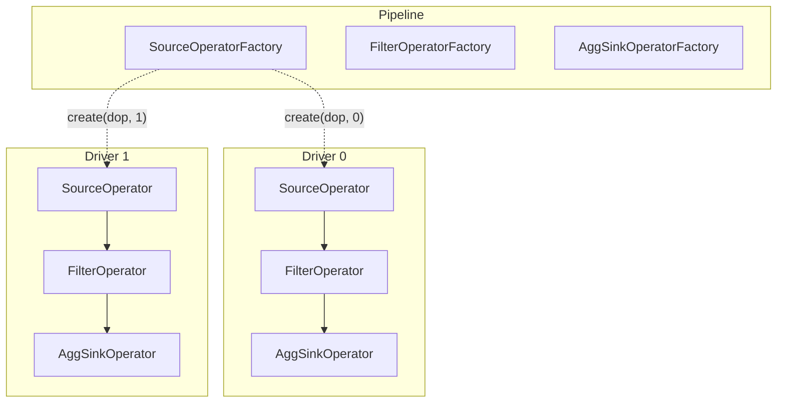
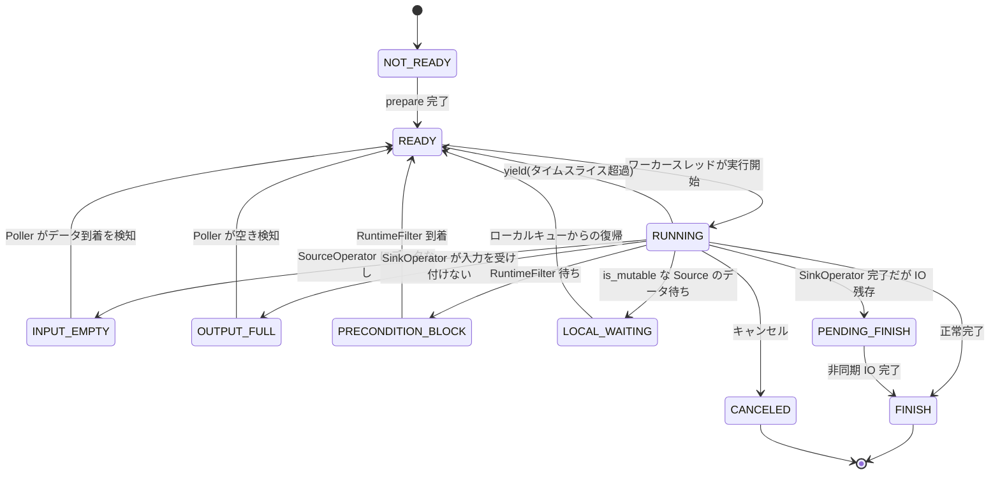
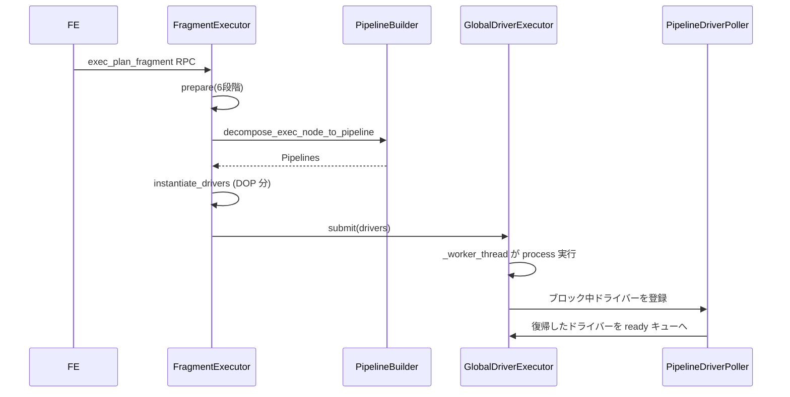

# 第10章 Pipeline 実行モデル

> **本章で読むソース**
>
> - [`be/src/exec/pipeline/operator.h`](https://github.com/StarRocks/starrocks/blob/4.1.1/be/src/exec/pipeline/operator.h)
> - [`be/src/exec/pipeline/source_operator.h`](https://github.com/StarRocks/starrocks/blob/4.1.1/be/src/exec/pipeline/source_operator.h)
> - [`be/src/exec/pipeline/pipeline.h`](https://github.com/StarRocks/starrocks/blob/4.1.1/be/src/exec/pipeline/pipeline.h)
> - [`be/src/exec/pipeline/pipeline_builder.h`](https://github.com/StarRocks/starrocks/blob/4.1.1/be/src/exec/pipeline/pipeline_builder.h)
> - [`be/src/exec/pipeline/pipeline_driver.h`](https://github.com/StarRocks/starrocks/blob/4.1.1/be/src/exec/pipeline/pipeline_driver.h)
> - [`be/src/exec/pipeline/pipeline_driver.cpp`](https://github.com/StarRocks/starrocks/blob/4.1.1/be/src/exec/pipeline/pipeline_driver.cpp)
> - [`be/src/exec/pipeline/pipeline_driver_executor.h`](https://github.com/StarRocks/starrocks/blob/4.1.1/be/src/exec/pipeline/pipeline_driver_executor.h)
> - [`be/src/exec/pipeline/pipeline_driver_executor.cpp`](https://github.com/StarRocks/starrocks/blob/4.1.1/be/src/exec/pipeline/pipeline_driver_executor.cpp)
> - [`be/src/exec/pipeline/pipeline_driver_poller.h`](https://github.com/StarRocks/starrocks/blob/4.1.1/be/src/exec/pipeline/pipeline_driver_poller.h)
> - [`be/src/exec/pipeline/pipeline_driver_poller.cpp`](https://github.com/StarRocks/starrocks/blob/4.1.1/be/src/exec/pipeline/pipeline_driver_poller.cpp)
> - [`be/src/exec/pipeline/pipeline_driver_queue.h`](https://github.com/StarRocks/starrocks/blob/4.1.1/be/src/exec/pipeline/pipeline_driver_queue.h)
> - [`be/src/exec/pipeline/fragment_executor.h`](https://github.com/StarRocks/starrocks/blob/4.1.1/be/src/exec/pipeline/fragment_executor.h)
> - [`be/src/exec/pipeline/fragment_executor.cpp`](https://github.com/StarRocks/starrocks/blob/4.1.1/be/src/exec/pipeline/fragment_executor.cpp)
> - [`be/src/exec/pipeline/scan/morsel.h`](https://github.com/StarRocks/starrocks/blob/4.1.1/be/src/exec/pipeline/scan/morsel.h)

## この章の狙い

第9章で FE が生成した分散プラン(Fragment)は、各 BE 上で実際に実行される必要がある。
StarRocks の BE は、Morsel-Driven Parallelism[^morsel]に基づくパイプライン実行モデルを採用している。
本章では、Fragment がパイプラインとオペレーターのチェーンに変換される過程、PipelineDriver のイベントループによる push/pull 実行、スレッドプールによるスケジューリング、ブロック中ドライバーの監視機構を追う。

[^morsel]: V. Leis et al., "Morsel-Driven Parallelism: A NUMA-Aware Query Evaluation Framework for the Many-Core Age," SIGMOD 2014.

## 前提

第9章までで扱った Fragment の構造と、FE から BE への `exec_plan_fragment` RPC を理解していること。
Chunk(列指向バッチ)の概念を知っていること(第14章で詳述)。

## Operator の基底インタフェース

パイプライン実行の最小単位は **Operator** である。
すべてのオペレーターは `Operator` 基底クラスを継承し、以下のインタフェースを実装する。

[`be/src/exec/pipeline/operator.h` L99-L126](https://github.com/StarRocks/starrocks/blob/4.1.1/be/src/exec/pipeline/operator.h#L99-L126)

```cpp
// Whether we could pull chunk from this operator
virtual bool has_output() const = 0;

// Whether we could push chunk to this operator
virtual bool need_input() const = 0;

// Is this operator completely finished processing and no more
// output chunks will be produced
virtual bool is_finished() const = 0;

// Pull chunk from this operator
virtual StatusOr<ChunkPtr> pull_chunk(RuntimeState* state) = 0;

// Push chunk to this operator
virtual Status push_chunk(RuntimeState* state, const ChunkPtr& chunk) = 0;

```

`has_output` と `need_input` はデータの流れを制御するゲートである。
PipelineDriver はこの2つのメソッドを隣接するオペレーター間で確認し、データを移動してよいか判断する。

ライフサイクルは `prepare` から始まり、`set_finishing`(入力終了通知)、`set_finished`(完全停止)、`set_cancelled`(キャンセル)、`close`(後処理)の順に進む。
各ステージの遷移はコメントに記載されたとおりである。

[`be/src/exec/pipeline/operator.h` L53-L97](https://github.com/StarRocks/starrocks/blob/4.1.1/be/src/exec/pipeline/operator.h#L53-L97)

```cpp
// prepare is used to do the initialization work
// It's one of the stages of the operator life cycle
// (prepare -> finishing -> finished -> [cancelled] -> closed)
virtual Status prepare(RuntimeState* state);

// Notifies the operator that no more input chunk will be added.
virtual Status set_finishing(RuntimeState* state) { return Status::OK(); }

// set_finished is used to shutdown both input and output stream
virtual Status set_finished(RuntimeState* state) { return Status::OK(); }

// When the fragment exits abnormally, CANCELLED stage appears
virtual Status set_cancelled(RuntimeState* state) { return Status::OK(); }

// close is used to do the cleanup work
virtual void close(RuntimeState* state);

```

`pending_finish` は非同期 IO が残っているかを示す。
SinkOperator が完了しても SourceOperator に非同期 IO タスクが残っている場合、ドライバーは即座に FINISH にならず PENDING_FINISH 状態で IO の完了を待つ。

[`be/src/exec/pipeline/operator.h` L117](https://github.com/StarRocks/starrocks/blob/4.1.1/be/src/exec/pipeline/operator.h#L117)

```cpp
virtual bool pending_finish() const { return false; }

```

**SourceOperator** は `Operator` を継承した特殊なオペレーターである。
`need_input` は常に `false` を返し、`push_chunk` はエラーを返す。
SourceOperator はデータの入口であり、外部(MorselQueue, ExchangeSource など)からデータを取得して `pull_chunk` で供給する。

[`be/src/exec/pipeline/source_operator.h` L143-L168](https://github.com/StarRocks/starrocks/blob/4.1.1/be/src/exec/pipeline/source_operator.h#L143-L168)

```cpp
class SourceOperator : public Operator {
public:
    // ... (中略) ...
    bool need_input() const override { return false; }

    Status push_chunk(RuntimeState* state, const ChunkPtr& chunk) override {
        return Status::InternalError("Shouldn't push chunk to source operator");
    }

    virtual void add_morsel_queue(MorselQueue* morsel_queue) { _morsel_queue = morsel_queue; };

```

`is_mutable` は、`has_output` の結果が頻繁に true/false を行き来するオペレーターを示す。
このフラグが true のとき、ドライバーは INPUT_EMPTY としてブロックキューに移るのではなく LOCAL_WAITING としてワーカースレッドのローカルキューにとどまる。
ready キューとブロックキューを頻繁に往復する高コストなスケジューリングを回避するための仕組みである。

## Pipeline の構造

**Pipeline** はオペレーターファクトリ(`OpFactories`)のチェーンを保持するコンテナである。
先頭が SourceOperatorFactory、末尾が SinkOperatorFactory であり、その間に中間オペレーターが並ぶ。

[`be/src/exec/pipeline/pipeline.h` L33-L46](https://github.com/StarRocks/starrocks/blob/4.1.1/be/src/exec/pipeline/pipeline.h#L33-L46)

```cpp
class Pipeline {
public:
    Pipeline() = delete;
    Pipeline(uint32_t id, OpFactories op_factories, ExecutionGroupRawPtr execution_group);

    Operators create_operators(int32_t degree_of_parallelism, int32_t i) {
        Operators operators;
        for (const auto& factory : _op_factories) {
            operators.emplace_back(factory->create(degree_of_parallelism, i));
        }
        return operators;
    }
    void instantiate_drivers(RuntimeState* state);

```

`create_operators` は並列度(DOP)と並列インデックス `i` を受け取り、ファクトリからオペレーターインスタンスを生成する。
`instantiate_drivers` は DOP の数だけ PipelineDriver を生成し、各ドライバーにオペレーターチェーンと MorselQueue を割り当てる。

Pipeline と PipelineDriver の関係を図に示す。



## PipelineDriver のイベントループ

**PipelineDriver** はパイプラインの実行単位である。
1つの PipelineDriver が1つのオペレーターチェーンを保持し、ワーカースレッドから `process` メソッドが呼ばれるたびに、データをオペレーター間で移動する。

### 状態遷移

ドライバーは以下の状態を持つ。

[`be/src/exec/pipeline/pipeline_driver.h` L60-L81](https://github.com/StarRocks/starrocks/blob/4.1.1/be/src/exec/pipeline/pipeline_driver.h#L60-L81)

```cpp
enum DriverState : uint32_t {
    NOT_READY = 0,
    READY = 1,
    RUNNING = 2,
    INPUT_EMPTY = 3,
    OUTPUT_FULL = 4,
    PRECONDITION_BLOCK = 5,
    FINISH = 6,
    CANCELED = 7,
    INTERNAL_ERROR = 8,
    PENDING_FINISH = 9,
    EPOCH_PENDING_FINISH = 10,
    EPOCH_FINISH = 11,
    LOCAL_WAITING = 12
};

```

状態遷移を図に示す。



### process メソッドの実行ループ

`process` はドライバーの核となるメソッドである。
状態を RUNNING に設定した後、オペレーターチェーンを走査してデータを移動する。

[`be/src/exec/pipeline/pipeline_driver.cpp` L270-L276](https://github.com/StarRocks/starrocks/blob/4.1.1/be/src/exec/pipeline/pipeline_driver.cpp#L270-L276)

```cpp
StatusOr<DriverState> PipelineDriver::process(RuntimeState* runtime_state, int worker_id) {
    COUNTER_UPDATE(_schedule_counter, 1);
    SCOPED_TIMER(_active_timer);
    QUERY_TRACE_SCOPED("process", _driver_name);
    DCHECK(_local_prepare_is_done);
    set_driver_state(DriverState::RUNNING);
    size_t total_chunks_moved = 0;

```

内部のループは、隣接するオペレーターのペア `(curr_op, next_op)` を順に調べ、`curr_op->has_output()` かつ `next_op->need_input()` のとき `pull_chunk` と `push_chunk` でデータを転送する。

[`be/src/exec/pipeline/pipeline_driver.cpp` L311-L340](https://github.com/StarRocks/starrocks/blob/4.1.1/be/src/exec/pipeline/pipeline_driver.cpp#L311-L340)

```cpp
for (size_t i = _first_unfinished; i < num_operators - 1; ++i) {
    {
        SCOPED_RAW_TIMER(&time_spent);
        auto& curr_op = _operators[i];
        auto& next_op = _operators[i + 1];

        // Check curr_op finished firstly
        if (curr_op->is_finished()) {
            // ... (中略: 後続オペレーターに finishing を通知) ...
            new_first_unfinished = i + 1;
            continue;
        }

        _try_to_release_buffer(runtime_state, curr_op);
        // try successive operator pairs
        if (!curr_op->has_output() || !next_op->need_input()) {
            continue;
        }
        // ... (中略: pull_chunk → push_chunk) ...
    }

```

`curr_op` が完了すると `next_op` に `set_finishing` を呼び、`_first_unfinished` を更新して完了したオペレーターをスキップする。
この仕組みにより、チェーンの途中でオペレーターが完了しても残りのオペレーターだけを処理できる。

### タイムスライスと yield

ドライバーは1回の `process` 呼び出しでCPUを独占し続けるわけではない。
以下の定数で yield(CPU の明け渡し)が制御される。

[`be/src/exec/pipeline/pipeline_driver.h` L582-L587](https://github.com/StarRocks/starrocks/blob/4.1.1/be/src/exec/pipeline/pipeline_driver.h#L582-L587)

```cpp
// Yield PipelineDriver when maximum time in nano-seconds has spent
static constexpr int64_t YIELD_MAX_TIME_SPENT_NS = 100'000'000L;
// Yield PipelineDriver when it runs in the worker thread owned by other workgroup
static constexpr int64_t YIELD_PREEMPT_MAX_TIME_SPENT_NS = 5'000'000L;
// Execution time exceed this is considered overloaded
static constexpr int64_t OVERLOADED_MAX_TIME_SPEND_NS = 150'000'000L;

```

通常は 100ms で yield する。
ドライバーが属する WorkGroup と異なる WorkGroup のワーカースレッドで実行されている場合は、5ms でプリエンプトされる。
150ms を超えると overloaded としてメトリクスに記録される。

[`be/src/exec/pipeline/pipeline_driver.cpp` L447-L460](https://github.com/StarRocks/starrocks/blob/4.1.1/be/src/exec/pipeline/pipeline_driver.cpp#L447-L460)

```cpp
if (time_spent >= YIELD_MAX_TIME_SPENT_NS ||
    driver_acct().get_accumulated_local_wait_time_spent() >= YIELD_MAX_TIME_SPENT_NS) {
    should_yield = true;
    COUNTER_UPDATE(_yield_by_time_limit_counter, 1);
    break;
}
if (_workgroup != nullptr &&
    (time_spent >= YIELD_PREEMPT_MAX_TIME_SPENT_NS ||
     driver_acct().get_accumulated_local_wait_time_spent() > YIELD_PREEMPT_MAX_TIME_SPENT_NS) &&
    _workgroup->driver_sched_entity()->in_queue()->should_yield(this, time_spent)) {
    should_yield = true;
    COUNTER_UPDATE(_yield_by_preempt_counter, 1);
    break;
}

```

### process 終了後の状態決定

ループを抜けた後、`num_chunks_moved == 0`(データを移動できなかった)または `should_yield`(時間切れ)のいずれかで、次の状態を決定する。

[`be/src/exec/pipeline/pipeline_driver.cpp` L479-L498](https://github.com/StarRocks/starrocks/blob/4.1.1/be/src/exec/pipeline/pipeline_driver.cpp#L479-L498)

```cpp
if (num_chunks_moved == 0 || should_yield) {
    if (is_precondition_block()) {
        set_driver_state(DriverState::PRECONDITION_BLOCK);
    } else if (!sink_operator()->is_finished() && !sink_operator()->need_input()) {
        set_driver_state(DriverState::OUTPUT_FULL);
    } else if (!source_operator()->is_finished() && !source_operator()->has_output()) {
        if (source_operator()->is_mutable()) {
            set_driver_state(DriverState::LOCAL_WAITING);
        } else {
            set_driver_state(DriverState::INPUT_EMPTY);
        }
    } else {
        set_driver_state(DriverState::READY);
    }
    return _state;
}

```

データを一つも移動できず、かつ SinkOperator がまだ入力を受け付けない場合は OUTPUT_FULL となる。
SourceOperator に出力がない場合は INPUT_EMPTY(通常)または LOCAL_WAITING(`is_mutable` が true の場合)となる。
いずれにも該当せずタイムスライス超過だけなら READY に戻り、すぐに再スケジュールされる。

## GlobalDriverExecutor のスレッドプール実行

**GlobalDriverExecutor** はドライバーを実行するスレッドプールである。
初期化時に指定された数のワーカースレッドを起動し、各スレッドが `_worker_thread` を実行する。

[`be/src/exec/pipeline/pipeline_driver_executor.cpp` L58-L64](https://github.com/StarRocks/starrocks/blob/4.1.1/be/src/exec/pipeline/pipeline_driver_executor.cpp#L58-L64)

```cpp
void GlobalDriverExecutor::initialize(int num_threads) {
    _blocked_driver_poller->start();
    _num_threads_setter.set_actual_num(num_threads);
    for (auto i = 0; i < num_threads; ++i) {
        (void)_thread_pool->submit_func([this]() { this->_worker_thread(); });
    }
}

```

### ワーカースレッドのメインループ

ワーカースレッドはキューからドライバーを取り出し、`process` を呼び、返された状態に応じてドライバーの行き先を決める。

[`be/src/exec/pipeline/pipeline_driver_executor.cpp` L83-L251](https://github.com/StarRocks/starrocks/blob/4.1.1/be/src/exec/pipeline/pipeline_driver_executor.cpp#L83-L251)

```cpp
void GlobalDriverExecutor::_worker_thread() {
    // ... (中略) ...
    while (true) {
        // ... (中略: TLS リセット、キューから取得) ...
        auto maybe_driver = _get_next_driver(local_driver_queue);
        // ... (中略: canceled / finished チェック) ...
        maybe_state = driver->process(runtime_state, worker_id);
        // ... (中略: エラー処理) ...
        auto driver_state = maybe_state.value();
        switch (driver_state) {
        case READY:
        case RUNNING: {
            driver->driver_acct().clean_local_queue_infos();
            this->_driver_queue->put_back_from_executor(driver);
            break;
        }
        case LOCAL_WAITING: {
            driver->driver_acct().update_enter_local_queue_timestamp();
            local_driver_queue.push(driver);
            break;
        }
        case FINISH:
        case CANCELED:
        case INTERNAL_ERROR: {
            _finalize_driver(driver, runtime_state, driver_state);
            break;
        }
        case INPUT_EMPTY:
        case OUTPUT_FULL:
        case PENDING_FINISH:
        case PRECONDITION_BLOCK: {
            _blocked_driver_poller->add_blocked_driver(driver);
            break;
        }
        // ... (中略) ...
        }
    }
}

```

READY/RUNNING のドライバーは `_driver_queue` に戻されて即座に再実行の候補となる。
LOCAL_WAITING のドライバーはワーカースレッドのローカルキューに入り、グローバルキューへの移動を遅延させる。
INPUT_EMPTY, OUTPUT_FULL, PENDING_FINISH, PRECONDITION_BLOCK のドライバーは PipelineDriverPoller のブロックキューに移る。

### ローカルキューの挙動

ワーカースレッドはグローバルキューからドライバーを取得する前に、ローカルキューを確認する。
ローカルキューのドライバーについて `source_operator()->has_output()` を調べ、データが到着していればそのドライバーを即座に実行する。

[`be/src/exec/pipeline/pipeline_driver_executor.cpp` L253-L278](https://github.com/StarRocks/starrocks/blob/4.1.1/be/src/exec/pipeline/pipeline_driver_executor.cpp#L253-L278)

```cpp
StatusOr<DriverRawPtr> GlobalDriverExecutor::_get_next_driver(
        std::queue<DriverRawPtr>& local_driver_queue) {
    DriverRawPtr driver = nullptr;
    if (!local_driver_queue.empty()) {
        const size_t local_driver_num = local_driver_queue.size();
        for (size_t i = 0; i < local_driver_num; i++) {
            driver = local_driver_queue.front();
            local_driver_queue.pop();
            if (driver->source_operator()->has_output()) {
                return driver;
            } else {
                if (driver->driver_acct().get_local_queue_time_spent()
                        > LOCAL_MAX_WAIT_TIME_SPENT_NS) {
                    driver->set_driver_state(DriverState::INPUT_EMPTY);
                    _blocked_driver_poller->add_blocked_driver(driver);
                } else {
                    local_driver_queue.push(driver);
                }
                driver = nullptr;
            }
        }
    }
    const bool need_block = local_driver_queue.empty();
    return this->_driver_queue->take(need_block);
}

```

ローカルキューに `LOCAL_MAX_WAIT_TIME_SPENT_NS`(1ms)以上滞在したドライバーは INPUT_EMPTY としてブロックキューに移される。
ローカルキューが空でないときはグローバルキューの `take` をノンブロッキングで呼び、ワーカースレッドがブロックしてローカルキューのドライバーが放置されることを防ぐ。

### マルチレベルフィードバックキュー

GlobalDriverExecutor が使うドライバーキューは、Resource Group が有効なら `WorkGroupDriverQueue`、無効なら `QuerySharedDriverQueue` が選択される。

[`be/src/exec/pipeline/pipeline_driver_executor.cpp` L37-L50](https://github.com/StarRocks/starrocks/blob/4.1.1/be/src/exec/pipeline/pipeline_driver_executor.cpp#L37-L50)

```cpp
GlobalDriverExecutor::GlobalDriverExecutor(/* ... */)
        : Base("pip_exec_" + name),
          _driver_queue(enable_resource_group
                  ? std::unique_ptr<DriverQueue>(
                            std::make_unique<WorkGroupDriverQueue>(/* ... */))
                  : std::make_unique<QuerySharedDriverQueue>(/* ... */)),

```

`QuerySharedDriverQueue` は8段階のマルチレベルフィードバックキュー(MLFQ)を実装している。
ドライバーの累積実行時間に応じてレベルが決まり、レベルが上がるほど優先度が下がる。

[`be/src/exec/pipeline/pipeline_driver_queue.h` L105-L151](https://github.com/StarRocks/starrocks/blob/4.1.1/be/src/exec/pipeline/pipeline_driver_queue.h#L105-L151)

```cpp
class QuerySharedDriverQueue : public FactoryMethod<DriverQueue, QuerySharedDriverQueue> {
    // ... (中略) ...
    static constexpr size_t QUEUE_SIZE = 8;

private:
    // The time slice of the i-th level is (i+1)*LEVEL_TIME_SLICE_BASE ns,
    // so when a driver's execution time exceeds 0.2s, 0.6s, 1.2s, 2.0s, 3.0s,
    // 4.2s, 5.6s, 7.4s, it will move to next level.
    const int64_t LEVEL_TIME_SLICE_BASE_NS =
        config::pipeline_driver_queue_level_time_slice_base_ns;
    const double RATIO_OF_ADJACENT_QUEUE = ratio_of_adjacent_queue();

    SubQuerySharedDriverQueue _queues[QUEUE_SIZE];
    int64_t _level_time_slices[QUEUE_SIZE];

```

レベルの計算は `DriverAcct::get_level` で行われる。
スケジュール回数の対数をとることで、実行回数が増えるほど低優先度のキューに移る。

[`be/src/exec/pipeline/pipeline_driver.h` L125-L126](https://github.com/StarRocks/starrocks/blob/4.1.1/be/src/exec/pipeline/pipeline_driver.h#L125-L126)

```cpp
int get_level() { return Bits::Log2Floor64(schedule_times + 1); }

```

`WorkGroupDriverQueue` は2階層の構造を持つ。
第1階層で WorkGroup 間の仮想実行時間(vruntime)に基づく公平スケジューリングを行い、第2階層で各 WorkGroup 内のドライバーをFIFOで処理する。
vruntime が最小の WorkGroup から優先的にドライバーが取り出される。

[`be/src/exec/pipeline/pipeline_driver_queue.h` L153-L199](https://github.com/StarRocks/starrocks/blob/4.1.1/be/src/exec/pipeline/pipeline_driver_queue.h#L153-L199)

```cpp
class WorkGroupDriverQueue : public FactoryMethod<DriverQueue, WorkGroupDriverQueue> {
    // ... (中略) ...
    // Firstly, select the work group with the minimum vruntime.
    // Secondly, select the proper driver from the driver queue of this work group.
    StatusOr<DriverRawPtr> take(const bool block) override;
    // ... (中略) ...
    static constexpr int64_t SCHEDULE_PERIOD_PER_WG_NS = 100'000'000;
    WorkgroupSet _wg_entities;

```

## PipelineDriverPoller によるブロック中ドライバーの監視

INPUT_EMPTY, OUTPUT_FULL, PRECONDITION_BLOCK, PENDING_FINISH のいずれかの状態になったドライバーは、**PipelineDriverPoller** の管理下に置かれる。
Poller は専用のポーリングスレッドを1本持ち、ブロック中のドライバーを周期的に走査して、実行可能になったドライバーを ready キューに戻す。

[`be/src/exec/pipeline/pipeline_driver_poller.cpp` L47-L191](https://github.com/StarRocks/starrocks/blob/4.1.1/be/src/exec/pipeline/pipeline_driver_poller.cpp#L47-L191)

```cpp
void PipelineDriverPoller::run_internal() {
    // ... (中略) ...
    while (!_is_shutdown.load(std::memory_order_acquire)) {
        // ... (中略: _blocked_drivers から tmp にスプライス) ...
        {
            std::unique_lock write_lock(_local_mutex);
            // ... (中略) ...
            auto driver_it = _local_blocked_drivers.begin();
            while (driver_it != _local_blocked_drivers.end()) {
                auto* driver = *driver_it;
                // ... (中略: タイムアウト、キャンセルチェック) ...
                } else {
                    auto status_or_is_not_blocked = driver->is_not_blocked();
                    // ... (中略) ...
                    if (status_or_is_not_blocked.value()) {
                        driver->set_driver_state(DriverState::READY);
                        remove_blocked_driver(_local_blocked_drivers, driver_it);
                        ready_drivers.emplace_back(driver);
                    } else {
                        ++driver_it;
                    }
                }
            }
        }
        // ... (中略) ...
        if (ready_drivers.empty()) {
            spin_count += 1;
        } else {
            spin_count = 0;
            _driver_queue->put_back(ready_drivers);
            ready_drivers.clear();
        }

```

Poller の走査ロジックを整理する。

1. クエリのタイムアウトを検知したドライバーは、Fragment をキャンセルして CANCELED に遷移させる
2. Fragment がキャンセル済みのドライバーは、オペレーターのキャンセル処理を実行する
3. PENDING_FINISH のドライバーは `is_still_pending_finish` で IO 完了を確認し、完了なら FINISH に遷移させる
4. それ以外のドライバーは `is_not_blocked` で実行可能かを判定し、可能なら READY に戻す

`is_not_blocked` の内部では、SinkOperator の `need_input` と SourceOperator の `has_output` を確認して OUTPUT_FULL と INPUT_EMPTY を判定する。

[`be/src/exec/pipeline/pipeline_driver.h` L430-L468](https://github.com/StarRocks/starrocks/blob/4.1.1/be/src/exec/pipeline/pipeline_driver.h#L430-L468)

```cpp
StatusOr<bool> is_not_blocked() {
    if (sink_operator()->is_finished()) {
        return true;
    }
    // PRECONDITION_BLOCK
    if (_state == DriverState::PRECONDITION_BLOCK) {
        if (is_precondition_block()) {
            return false;
        }
        mark_precondition_ready();
        RETURN_IF_ERROR(check_short_circuit());
        // ... (中略) ...
    }
    // OUTPUT_FULL
    if (!sink_operator()->need_input()) {
        set_driver_state(DriverState::OUTPUT_FULL);
        return false;
    }
    // INPUT_EMPTY
    if (!source_operator()->is_finished() && !source_operator()->has_output()) {
        set_driver_state(DriverState::INPUT_EMPTY);
        return false;
    }
    return true;
}

```

ブロック解除されたドライバーは `_driver_queue->put_back(ready_drivers)` でまとめて ready キューに投入される。
Poller にドライバーがない場合は条件変数で最大10msスリープし、CPU の無駄な消費を抑える。

## FragmentExecutor による Fragment からパイプラインへの変換

BE が FE から `exec_plan_fragment` RPC を受信すると、**FragmentExecutor** が呼ばれる。
`prepare` メソッドは6段階で Fragment の実行準備を行う。

[`be/src/exec/pipeline/fragment_executor.h` L133-L147](https://github.com/StarRocks/starrocks/blob/4.1.1/be/src/exec/pipeline/fragment_executor.h#L133-L147)

```cpp
// Several steps of prepare a fragment
// 1. query context
// 2. fragment context
// 3. workgroup
// 4. runtime state
// 5. exec plan
// 6. pipeline driver
Status _prepare_query_ctx(ExecEnv* exec_env, const UnifiedExecPlanFragmentParams& request);
Status _prepare_fragment_ctx(const UnifiedExecPlanFragmentParams& request);
Status _prepare_workgroup(const UnifiedExecPlanFragmentParams& request);
Status _prepare_runtime_state(ExecEnv* exec_env, const UnifiedExecPlanFragmentParams& request);
Status _prepare_exec_plan(ExecEnv* exec_env, const UnifiedExecPlanFragmentParams& request);
Status _prepare_pipeline_driver(ExecEnv* exec_env, const UnifiedExecPlanFragmentParams& request);

```

パイプラインの構築は `_prepare_pipeline_driver` 内で行われる。
`PipelineBuilder` が ExecNode ツリーをパイプラインに分解する。

[`be/src/exec/pipeline/fragment_executor.cpp` L725-L760](https://github.com/StarRocks/starrocks/blob/4.1.1/be/src/exec/pipeline/fragment_executor.cpp#L725-L760)

```cpp
Status FragmentExecutor::_prepare_pipeline_driver(
        ExecEnv* exec_env, const UnifiedExecPlanFragmentParams& request) {
    const auto degree_of_parallelism = _calc_dop(exec_env, request);
    // ... (中略) ...
    // Build pipelines
    PipelineBuilderContext context(
        _fragment_ctx.get(), degree_of_parallelism, sink_dop, is_stream_pipeline);
    context.init_colocate_groups(std::move(_colocate_exec_groups));
    PipelineBuilder builder(context);
    auto exec_ops = builder.decompose_exec_node_to_pipeline(*_fragment_ctx, plan);
    // Set up sink if required
    // ... (中略) ...
    auto [exec_groups, pipelines] = builder.build();
    _fragment_ctx->set_pipelines(std::move(exec_groups), std::move(pipelines));

```

`PipelineBuilder::decompose_exec_node_to_pipeline` は ExecNode ツリーを再帰的に走査し、ブロッキング境界(HashJoinBuild, AggSink など)でパイプラインを分割する。
パイプライン間のデータ受け渡しには LocalExchange が挿入される。

`execute` メソッドは、構築済みのドライバーを WorkGroup の DriverExecutor に投入して実行を開始する。

[`be/src/exec/pipeline/fragment_executor.cpp` L971-L998](https://github.com/StarRocks/starrocks/blob/4.1.1/be/src/exec/pipeline/fragment_executor.cpp#L971-L998)

```cpp
Status FragmentExecutor::execute(ExecEnv* exec_env) {
    // ... (中略) ...
    _fragment_ctx->acquire_runtime_filters();
    RETURN_IF_ERROR(_fragment_ctx->prepare_active_drivers());
    // ... (中略) ...
    auto* executor = _wg->executors()->driver_executor();
    RETURN_IF_ERROR(_fragment_ctx->submit_active_drivers(executor));
    // ... (中略) ...
}

```

Fragment から実行開始までの全体の流れを図に示す。



## Morsel-Driven による動的並列度調整

StarRocks のパイプライン実行モデルにおける主要な最適化が **Morsel-Driven Parallelism** である。
この設計は、スキャン対象のデータを **Morsel** と呼ばれる小さな作業単位に分割し、各 PipelineDriver が MorselQueue から動的に Morsel を取得して処理する方式をとる。

[`be/src/exec/pipeline/scan/morsel.h` L55-L59](https://github.com/StarRocks/starrocks/blob/4.1.1/be/src/exec/pipeline/scan/morsel.h#L55-L59)

```cpp
class ScanMorsel;
using Morsel = ScanMorsel;
using MorselPtr = std::unique_ptr<Morsel>;
using Morsels = std::vector<MorselPtr>;

```

`ScanMorsel` は1つの `TScanRange`(Tablet のスキャン範囲)をラップする。
ScanOperator は `MorselQueue` から Morsel を取得するたびに、対応する Tablet の読み取りを開始する。

[`be/src/exec/pipeline/scan/morsel.h` L136-L154](https://github.com/StarRocks/starrocks/blob/4.1.1/be/src/exec/pipeline/scan/morsel.h#L136-L154)

```cpp
class ScanMorsel : public ScanMorselX {
public:
    ScanMorsel(int32_t plan_node_id, const TScanRange& scan_range)
            : ScanMorselX(plan_node_id),
              _scan_range(std::make_unique<TScanRange>(scan_range)) {
        if (_scan_range->__isset.internal_scan_range) {
            _owner_id = _scan_range->internal_scan_range.tablet_id;
            // ... (中略) ...
        }
    }

```

この方式が従来の静的分割(Tablet をドライバーに固定割り当て)に対して持つ利点は、Tablet 間のデータ量の偏りを動的に吸収できることである。
データが少ない Tablet を担当するドライバーは先に処理を終えて次の Morsel を取得するため、全ドライバーの負荷が自然に平準化される。

FE から送られる DOP(並列度)は `FragmentExecutor::_calc_dop` で決定され、SourceOperatorFactory の `degree_of_parallelism` に設定される。
この値がパイプライン単位のドライバー数を決める。

[`be/src/exec/pipeline/source_operator.h` L45-L48](https://github.com/StarRocks/starrocks/blob/4.1.1/be/src/exec/pipeline/source_operator.h#L45-L48)

```cpp
void set_degree_of_parallelism(size_t degree_of_parallelism) {
    _degree_of_parallelism = degree_of_parallelism;
}
void adjust_max_dop(size_t new_dop) {
    _degree_of_parallelism = std::min(new_dop, _degree_of_parallelism);
}

```

さらに、WorkGroupDriverQueue の `should_yield` と vruntime ベースのスケジューリングにより、Resource Group 間での CPU 時間の公平な分配が実現される。
WorkGroup ごとの CPU ウェイトに応じた `ideal_runtime` を基準に vruntime を更新するため、高ウェイトのグループほど多くの CPU 時間を獲得する。

## まとめ

StarRocks の BE は、Fragment を Morsel-Driven なパイプライン実行モデルで処理する。
Operator の `has_output`/`need_input` による push/pull ハイブリッドなデータフロー制御、PipelineDriver のタイムスライス付きイベントループ、MLFQ と WorkGroup による公平スケジューリング、PipelineDriverPoller によるブロック中ドライバーの非同期監視が、高い並行性と低レイテンシを両立させている。

## 関連する章

- 第9章(分散プランと Fragment): FE 側の Fragment 生成。本章で扱った BE 側のパイプライン変換の入力となる
- 第11章(Scan オペレーターとデータアクセス): ScanOperator と MorselQueue の詳細な実装
- 第14章(Column と Chunk): パイプライン間を流れるデータ表現
- 第25章(Resource Group と Warehouse): WorkGroupDriverQueue の Resource Group レベルのスケジューリング
