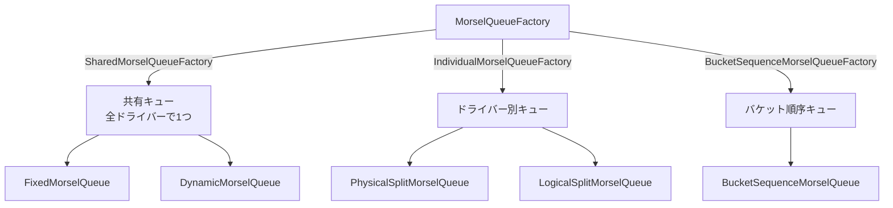
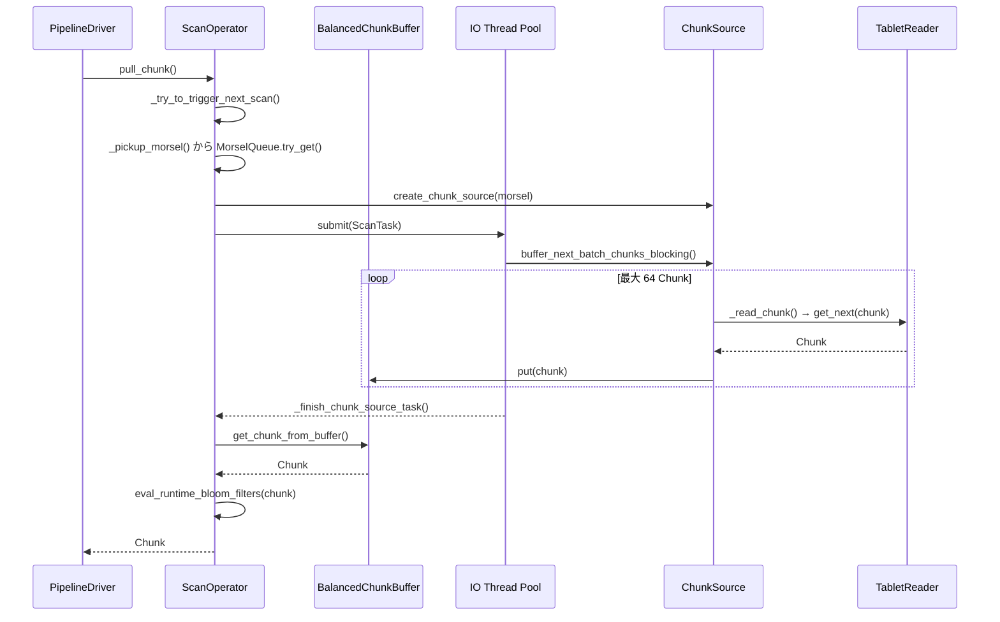

# 第11章 Scan オペレーターとデータアクセス

> **本章で読むソース**
>
> - [`be/src/exec/pipeline/scan/scan_operator.h`](https://github.com/StarRocks/starrocks/blob/4.1.1/be/src/exec/pipeline/scan/scan_operator.h)
> - [`be/src/exec/pipeline/scan/scan_operator.cpp`](https://github.com/StarRocks/starrocks/blob/4.1.1/be/src/exec/pipeline/scan/scan_operator.cpp)
> - [`be/src/exec/pipeline/scan/chunk_source.h`](https://github.com/StarRocks/starrocks/blob/4.1.1/be/src/exec/pipeline/scan/chunk_source.h)
> - [`be/src/exec/pipeline/scan/chunk_source.cpp`](https://github.com/StarRocks/starrocks/blob/4.1.1/be/src/exec/pipeline/scan/chunk_source.cpp)
> - [`be/src/exec/pipeline/scan/olap_scan_operator.h`](https://github.com/StarRocks/starrocks/blob/4.1.1/be/src/exec/pipeline/scan/olap_scan_operator.h)
> - [`be/src/exec/pipeline/scan/olap_scan_operator.cpp`](https://github.com/StarRocks/starrocks/blob/4.1.1/be/src/exec/pipeline/scan/olap_scan_operator.cpp)
> - [`be/src/exec/pipeline/scan/olap_chunk_source.h`](https://github.com/StarRocks/starrocks/blob/4.1.1/be/src/exec/pipeline/scan/olap_chunk_source.h)
> - [`be/src/exec/pipeline/scan/olap_chunk_source.cpp`](https://github.com/StarRocks/starrocks/blob/4.1.1/be/src/exec/pipeline/scan/olap_chunk_source.cpp)
> - [`be/src/exec/pipeline/scan/connector_scan_operator.h`](https://github.com/StarRocks/starrocks/blob/4.1.1/be/src/exec/pipeline/scan/connector_scan_operator.h)
> - [`be/src/exec/pipeline/scan/morsel.h`](https://github.com/StarRocks/starrocks/blob/4.1.1/be/src/exec/pipeline/scan/morsel.h)
> - [`be/src/exec/pipeline/scan/balanced_chunk_buffer.h`](https://github.com/StarRocks/starrocks/blob/4.1.1/be/src/exec/pipeline/scan/balanced_chunk_buffer.h)
> - [`be/src/storage/tablet_reader.h`](https://github.com/StarRocks/starrocks/blob/4.1.1/be/src/storage/tablet_reader.h)

## この章の狙い

パイプライン実行エンジンにおいて、ストレージからデータを読み出す最初の段階が Scan オペレーターである。
本章では `ScanOperator` の基底設計から OLAP テーブル読み出し、外部データソース読み出しまでの全体構造を追う。
IO スレッドプールへのタスク投入と Morsel 単位のワークバランシングが、パイプラインをブロックさせずに高スループットを実現する仕組みに焦点を当てる。

## 前提

StarRocks のパイプライン実行エンジンでは、各 Fragment がオペレーターの連鎖(パイプライン)として表現される。
パイプラインの先頭に位置する **SourceOperator** がデータを供給し、後続のオペレーターに Chunk を渡す。
Scan オペレーターは SourceOperator のサブクラスであり、ストレージ層から Chunk を読み出してパイプラインに供給する役割を持つ。

FE が生成した実行計画では、各 Scan ノードに対してスキャン範囲(`TScanRange`)が割り当てられる。
BE のパイプラインビルダーは、この範囲を **Morsel**(モーゼル)と呼ばれる作業単位に変換し、MorselQueue に格納する。
Scan オペレーターは MorselQueue から Morsel を取り出し、IO スレッドプール上で非同期にデータを読み出す。

## ScanOperator の基底設計

### クラス階層

`ScanOperator` は `SourceOperator` を継承し、非同期 IO 統合のためのフレームワークを提供する。

```text

SourceOperator
  └── ScanOperator              ← 非同期 IO の共通フレームワーク
        ├── OlapScanOperator     ← OLAP テーブル用
        └── ConnectorScanOperator← 外部データソース用

```

コンストラクターでは、`_io_tasks_per_scan_operator` の数だけ `ChunkSource` スロットを確保する。
各スロットは独立した IO タスクを並行して走らせることができる。

[`be/src/exec/pipeline/scan/scan_operator.cpp` L41-L55](https://github.com/StarRocks/starrocks/blob/4.1.1/be/src/exec/pipeline/scan/scan_operator.cpp#L41-L55)

```cpp
ScanOperator::ScanOperator(OperatorFactory* factory, int32_t id, int32_t driver_sequence, int32_t dop,
                           ScanNode* scan_node)
        : SourceOperator(factory, id, scan_node->name(), scan_node->id(), false, driver_sequence),
          _scan_node(scan_node),
          _dop(dop),
          _output_chunk_by_bucket(scan_node->output_chunk_by_bucket()),
          _io_tasks_per_scan_operator(scan_node->io_tasks_per_scan_operator()),
          _is_asc(scan_node->is_asc_hint()),
          _chunk_source_profiles(_io_tasks_per_scan_operator),
          _is_io_task_running(_io_tasks_per_scan_operator),
          _chunk_sources(_io_tasks_per_scan_operator) {
    for (auto i = 0; i < _io_tasks_per_scan_operator; i++) {
        _chunk_source_profiles[i] = std::make_shared<RuntimeProfile>(strings::Substitute("ChunkSource$0", i));
    }
}
```

サブクラスは次の3つの仮想メソッドを実装する。

- `do_prepare` / `do_close`: サブクラス固有の初期化と終了処理
- `create_chunk_source`: Morsel を受け取り、対応する `ChunkSource` を生成する

[`be/src/exec/pipeline/scan/scan_operator.h` L75-L77](https://github.com/StarRocks/starrocks/blob/4.1.1/be/src/exec/pipeline/scan/scan_operator.h#L75-L77)

```cpp
    virtual Status do_prepare(RuntimeState* state) = 0;
    virtual void do_close(RuntimeState* state) = 0;
    virtual ChunkSourcePtr create_chunk_source(MorselPtr morsel, int32_t chunk_source_index) = 0;
```

### has_output と Unplug アルゴリズム

`has_output()` はドライバースケジューラーが「このオペレーターから Chunk を取り出せるか」を判定するために呼び出す。
単純にバッファが空でなければ true を返す方式だと、1 Chunk 生成するたびにスケジューリングが起き、オーバーヘッドが増大する。
StarRocks は Linux のブロック IO スケジューラーの Unplug アルゴリズムを参考にした方式でこの問題を解決している。

[`be/src/exec/pipeline/scan/scan_operator.cpp` L149-L212](https://github.com/StarRocks/starrocks/blob/4.1.1/be/src/exec/pipeline/scan/scan_operator.cpp#L149-L212)

```cpp
bool ScanOperator::has_output() const {
    // ... (中略: エラーチェック、TopN RuntimeFilter バックプレッシャー) ...

    size_t chunk_number = num_buffered_chunks();
    if (_unpluging) {
        if (chunk_number > 0) {
            return true;
        }
        _unpluging = false;
    }
    if (chunk_number >= _buffer_unplug_threshold()) {
        _unpluging = true;
        return true;
    }

    DCHECK(!_unpluging);
    bool buffer_full = is_buffer_full();
    if (buffer_full) {
        return chunk_number > 0;
    }

    if (is_running_all_io_tasks()) {
        return false;
    }
    // ... (中略) ...
}

```

全体の戦略は次のとおりである。

1. バッファに十分な Chunk が溜まったら(閾値 = `BufferCapacity / DOP / 2`)、Unplug モードに入り Chunk を返す
2. Unplug モード中はバッファが空になるまで Chunk を返し続ける
3. バッファが足りないがフルであれば、Chunk があるなら返す
4. IO タスクが上限まで走っていれば、完了を待つ(false を返す)
5. まだ IO タスクを投入できる余地があれば、新たなタスクを投入するために true を返す

### pull_chunk: データの取り出し

`pull_chunk()` はドライバーが呼び出すデータ取り出しメソッドである。
バッファから Chunk を1つ取り出し、RuntimeFilter の評価を適用してから返す。

[`be/src/exec/pipeline/scan/scan_operator.cpp` L285-L308](https://github.com/StarRocks/starrocks/blob/4.1.1/be/src/exec/pipeline/scan/scan_operator.cpp#L285-L308)

```cpp
StatusOr<ChunkPtr> ScanOperator::pull_chunk(RuntimeState* state) {
    RACE_DETECT(race_pull_chunk);
    RETURN_IF_ERROR(_get_scan_status());
    auto defer = scan_defer_notify(this);
    // ... (中略: バッファサイズカウンター更新) ...

    RETURN_IF_ERROR(_try_to_trigger_next_scan(state));
    ChunkPtr res = get_chunk_from_buffer();
    if (res != nullptr) {
        begin_pull_chunk(res);
        // for query cache mechanism, we should emit EOS chunk when we receive the last chunk.
        auto [owner_id, is_eos] = _should_emit_eos(res);
        evaluate_topn_runtime_filters(res.get());
        eval_runtime_bloom_filters(res.get());
        res->owner_info().set_owner_id(owner_id, is_eos);
    }
    // ... (中略) ...
    return res;
}

```

`pull_chunk` は最初に `_try_to_trigger_next_scan` を呼び出す。
これにより、次の IO タスクが必要であれば投入される。
データ取り出しとタスク投入が同一の `pull_chunk` 呼び出しの中で行われるため、パイプラインドライバーの1回のスケジューリングで IO とデータ消費の両方が進行する。

## ChunkSource: 非同期データ読み出しの抽象

**ChunkSource** は、Morsel 1つ分のデータを IO スレッド上で読み出すための抽象クラスである。
サブクラスは `_read_chunk()` を実装してデータソース固有の読み出しロジックを提供する。

[`be/src/exec/pipeline/scan/chunk_source.h` L37-L114](https://github.com/StarRocks/starrocks/blob/4.1.1/be/src/exec/pipeline/scan/chunk_source.h#L37-L114)

```cpp
class ChunkSource {
public:
    ChunkSource(ScanOperator* op, RuntimeProfile* runtime_profile, MorselPtr&& morsel,
                BalancedChunkBuffer& chunk_buffer);
    // ... (中略) ...
    Status buffer_next_batch_chunks_blocking(RuntimeState* state, size_t batch_size,
                                             const workgroup::WorkGroup* running_wg);
protected:
    virtual Status _read_chunk(RuntimeState* state, ChunkPtr* chunk) = 0;
    // ... (中略) ...
};

```

### IO タスクのバッチ実行

`buffer_next_batch_chunks_blocking()` は IO スレッド上で実行され、最大 `batch_size` 個(デフォルト 64)の Chunk をまとめて読み出す。
読み出した Chunk は `BalancedChunkBuffer` に格納される。

[`be/src/exec/pipeline/scan/chunk_source.cpp` L52-L125](https://github.com/StarRocks/starrocks/blob/4.1.1/be/src/exec/pipeline/scan/chunk_source.cpp#L52-L125)

```cpp
Status ChunkSource::buffer_next_batch_chunks_blocking(RuntimeState* state, size_t batch_size,
                                                      const workgroup::WorkGroup* running_wg) {
    // ... (中略) ...
    for (size_t i = 0; i < batch_size && !state->is_cancelled(); ++i) {
        {
            SCOPED_RAW_TIMER(&time_spent_ns);

            // TODO: process when buffer full
            if (_chunk_token == nullptr && (_chunk_token = _chunk_buffer.limiter()->pin(1)) == nullptr) {
                break;
            }

            ChunkPtr chunk;
            _status = _read_chunk(state, &chunk);
            // ... (中略: エラー処理、EOS 処理) ...
            _chunk_buffer.put(_scan_operator_seq, std::move(chunk), std::move(_chunk_token));
            // ... (中略) ...
        }

        if (time_spent_ns >= workgroup::WorkGroup::YIELD_MAX_TIME_SPENT) {
            break;
        }
        // ... (中略) ...
    }
    return _status;
}

```

ループの終了条件は3つある。

- `batch_size` 個の Chunk を読み出した
- `YIELD_MAX_TIME_SPENT` を超過した(Resource Group によるプリエンプション)
- バッファの空きトークンが取得できなかった(バックプレッシャー)

この設計により、1回の IO タスクが長時間スレッドを占有することを防ぎつつ、バッチ処理で IO オーバーヘッドを償却している。

## IO タスクの投入とライフサイクル

### _trigger_next_scan: IO スレッドプールへの投入

`_trigger_next_scan()` は ChunkSource を IO スレッドプール(`ScanExecutor`)に投入する。
投入先のワーカースレッドでは `buffer_next_batch_chunks_blocking()` が呼ばれ、Chunk がバッファに蓄積される。

[`be/src/exec/pipeline/scan/scan_operator.cpp` L425-L532](https://github.com/StarRocks/starrocks/blob/4.1.1/be/src/exec/pipeline/scan/scan_operator.cpp#L425-L532)

```cpp
Status ScanOperator::_trigger_next_scan(RuntimeState* state, int chunk_source_index) {
    ChunkBufferTokenPtr buffer_token;
    if (buffer_token = pin_chunk(1); buffer_token == nullptr) {
        return Status::OK();
    }

    COUNTER_UPDATE(_submit_task_counter, 1);
    _chunk_sources[chunk_source_index]->pin_chunk_token(std::move(buffer_token));
    _num_running_io_tasks++;
    _is_io_task_running[chunk_source_index] = true;
    // ... (中略: トレースコンテキストの設定) ...

    workgroup::ScanTask task;
    task.workgroup = _workgroup;
    // TODO: consider more factors, such as scan bytes and i/o time.
    task.priority = OlapScanNode::compute_priority(COUNTER_VALUE(_submit_task_counter));
    // ... (中略) ...
    task.work_function = [wp = _query_ctx, this, state, chunk_source_index, query_trace_ctx, driver_id,
                          io_task_start_nano](auto& ctx) {
        if (auto sp = wp.lock()) {
            // ... (中略: スレッドローカル設定、タイマー) ...
            auto chunk_source = _chunk_sources[chunk_source_index];
            // ... (中略: chunk_source の開始処理) ...
            if (start_status.ok()) {
                status = chunk_source->buffer_next_batch_chunks_blocking(state, kIOTaskBatchSize, _workgroup.get());
            }
            // ... (中略: エラーハンドリング) ...
            _finish_chunk_source_task(state, chunk_source_index, delta_cpu_time,
                                      chunk_source->get_scan_rows() - prev_scan_rows,
                                      chunk_source->get_scan_bytes() - prev_scan_bytes);
            // ... (中略) ...
        }
    };
    // ... (中略) ...

    bool submit_success;
    {
        SCOPED_TIMER(_submit_io_task_timer);
        submit_success = _scan_executor->submit(std::move(task));
    }
    // ... (中略) ...
}

```

IO タスクの投入時にバッファトークンを1つ確保する。
トークンが取得できなければ投入を見送る。
これが上流のバックプレッシャー機構として機能し、メモリ使用量の暴走を防止する。

### _pickup_morsel: 新しい Morsel の取得

1つの Morsel の読み出しが完了すると、`_pickup_morsel()` が MorselQueue から次の Morsel を取得し、新たな ChunkSource を生成する。

[`be/src/exec/pipeline/scan/scan_operator.cpp` L534-L620](https://github.com/StarRocks/starrocks/blob/4.1.1/be/src/exec/pipeline/scan/scan_operator.cpp#L534-L620)

```cpp
Status ScanOperator::_pickup_morsel(RuntimeState* state, int chunk_source_index) {
    DCHECK(_morsel_queue != nullptr);
    _close_chunk_source(state, chunk_source_index);

    // NOTE: attach an active source before really creating it, to avoid the race condition
    bool need_detach = true;
    attach_chunk_source(chunk_source_index);
    DeferOp defer([&]() {
        if (need_detach) {
            detach_chunk_source(chunk_source_index);
        }
    });

    // if current morsel not ready for get next. we should wait current bucket finish. just return directly
    ASSIGN_OR_RETURN(auto ready, _morsel_queue->ready_for_next());
    RETURN_IF(!ready, Status::OK());

    ASSIGN_OR_RETURN(auto morsel, _morsel_queue->try_get());

    if (_lane_arbiter != nullptr) {
        while (morsel != nullptr) {
            auto [lane_owner, version] = morsel->get_lane_owner_and_version();
            auto acquire_result = _lane_arbiter->try_acquire_lane(lane_owner);
            if (acquire_result == query_cache::AR_BUSY) {
                _morsel_queue->unget(std::move(morsel));
                return Status::OK();
            } else if (acquire_result == query_cache::AR_PROBE) {
                auto hit = _cache_operator->probe_cache(lane_owner, version);
                RETURN_IF_ERROR(_cache_operator->reset_lane(state, lane_owner));
                if (!hit) {
                    break;
                }
                auto [delta_version, delta_rowsets] = _cache_operator->delta_version_and_rowsets(lane_owner);
                if (!delta_rowsets.empty()) {
                    // We must reset rowsets of Morsel to captured delta rowsets, because TabletReader now
                    // created from rowsets passed in to itself instead of capturing it from TabletManager again.
                    morsel->set_from_version(delta_version);

                    std::vector<BaseRowsetSharedPtr> drs;
                    for (auto& rs : delta_rowsets) {
                        drs.emplace_back(rs);
                    }
                    morsel->set_delta_rowsets(std::move(drs));
                    break;
                } else {
                    ASSIGN_OR_RETURN(morsel, _morsel_queue->try_get());
                }
            } else if (acquire_result == query_cache::AR_SKIP) {
                ASSIGN_OR_RETURN(morsel, _morsel_queue->try_get());
            } else if (acquire_result == query_cache::AR_IO) {
                // When both intra-tablet parallelism and multi-version cache mechanisms take effects, we must
                // use delta rowsets instead of the ensemble of rowsets to fetch rows from disk for all of the
                // morsels originated from the identical tablet.
                auto [delta_verrsion, delta_rowsets] = _cache_operator->delta_version_and_rowsets(lane_owner);
                if (!delta_rowsets.empty()) {
                    morsel->set_from_version(delta_verrsion);
                    std::vector<BaseRowsetSharedPtr> drs;
                    for (auto& rs : delta_rowsets) {
                        drs.emplace_back(rs);
                    }
                    morsel->set_delta_rowsets(std::move(drs));
                }
                break;
            }
        }
    }

    if (morsel != nullptr) {
        COUNTER_UPDATE(_morsels_counter, 1);

        {
            SCOPED_TIMER(_prepare_chunk_source_timer);
            _chunk_sources[chunk_source_index] = create_chunk_source(std::move(morsel), chunk_source_index);
            auto status = _chunk_sources[chunk_source_index]->prepare(state);
            if (!status.ok()) {
                _chunk_sources[chunk_source_index] = nullptr;
                static_cast<void>(set_finishing(state));
                return status;
            }
        }

        need_detach = false;
        RETURN_IF_ERROR(_trigger_next_scan(state, chunk_source_index));
    }

    return Status::OK();
}
```

Morsel を取得して ChunkSource を生成したら、即座に `_trigger_next_scan` で IO タスクを投入する。
この一連の流れにより、Morsel 消費と IO タスク投入がシームレスにつながる。

## Morsel: 作業分割の単位

**Morsel** はスキャン作業を分割する単位であり、`ScanMorsel` クラスが基本実装を提供する。
FE が生成した `TScanRange` を内部に保持し、対象 Tablet の ID、バージョン、パーティション ID を抽出する。

[`be/src/exec/pipeline/scan/morsel.h` L136-L200](https://github.com/StarRocks/starrocks/blob/4.1.1/be/src/exec/pipeline/scan/morsel.h#L136-L200)

```cpp
class ScanMorsel : public ScanMorselX {
public:
    ScanMorsel(int32_t plan_node_id, const TScanRange& scan_range)
            : ScanMorselX(plan_node_id), _scan_range(std::make_unique<TScanRange>(scan_range)) {
        if (_scan_range->__isset.internal_scan_range) {
            _owner_id = _scan_range->internal_scan_range.tablet_id;
            auto str_version = _scan_range->internal_scan_range.version;
            _version = strtol(str_version.c_str(), nullptr, 10);
            // ... (中略) ...
        }
    }
    // ... (中略) ...
};

```

### MorselQueue の種類

`MorselQueue` にはデータ分散方式に応じた複数の実装がある。

[`be/src/exec/pipeline/scan/morsel.h` L348-L355](https://github.com/StarRocks/starrocks/blob/4.1.1/be/src/exec/pipeline/scan/morsel.h#L348-L355)

```cpp
    enum Type {
        FIXED,
        DYNAMIC,
        SPLIT,
        LOGICAL_SPLIT,
        PHYSICAL_SPLIT,
        BUCKET_SEQUENCE,
    };
```

- **FixedMorselQueue**: FE が割り当てた Morsel をそのまま順に返す。最も単純な実装
- **DynamicMorselQueue**: 実行中に Morsel を追加でき、FE からのスキャン範囲の遅延配信に対応する
- **PhysicalSplitMorselQueue**: 1つの Tablet を Rowid 範囲で細かく分割し、並列度を向上させる。Segment 内の行範囲を `_splitted_scan_rows` 行ずつ切り出す
- **LogicalSplitMorselQueue**: Short Key Index のブロック境界で論理的に分割する。物理分割と異なり、ソートキーの範囲を使って分割する
- **BucketSequenceMorselQueue**: バケット順序を維持しながら Morsel を返す。Colocate Join などバケットシャッフルが必要な場合に使用する



`MorselQueueFactory` は共有モード(`SharedMorselQueueFactory`)と個別モード(`IndividualMorselQueueFactory`)のどちらかを選択する。
共有モードでは全ドライバーが1つのキューを競合して取得するため、ワークスティーリングに近い効果が得られる。
個別モードではドライバーごとにキューが割り当てられ、バケット順序の維持やスプリット並列化に用いられる。

## OlapScanOperator のフロー

`OlapScanOperator` は OLAP テーブルのスキャンに特化したオペレーターである。
`OlapScanContext` を共有コンテキストとして持ち、同じ Tablet に対するスキャンの設定(述語、キー範囲など)を複数ドライバーで共有する。

### OlapScanContext による共有スキャン

`OlapScanContextFactory` はドライバーの `driver_sequence` に対して `OlapScanContext` を生成(または既存を返す)する。
Shared Scan が有効な場合は、全ドライバーが同一の `OlapScanContext` を共有する。

[`be/src/exec/pipeline/scan/olap_scan_operator.cpp` L46-L49](https://github.com/StarRocks/starrocks/blob/4.1.1/be/src/exec/pipeline/scan/olap_scan_operator.cpp#L46-L49)

```cpp
OperatorPtr OlapScanOperatorFactory::do_create(int32_t dop, int32_t driver_sequence) {
    return std::make_shared<OlapScanOperator>(this, _id, driver_sequence, dop, _scan_node,
                                              _ctx_factory->get_or_create(driver_sequence));
}
```

### ChunkSource の生成

`OlapScanOperator::create_chunk_source()` は `OlapChunkSource` を生成する。
Morsel と OlapScanContext を渡し、内部で TabletReader の初期化まで行う。

[`be/src/exec/pipeline/scan/olap_scan_operator.cpp` L105-L109](https://github.com/StarRocks/starrocks/blob/4.1.1/be/src/exec/pipeline/scan/olap_scan_operator.cpp#L105-L109)

```cpp
ChunkSourcePtr OlapScanOperator::create_chunk_source(MorselPtr morsel, int32_t chunk_source_index) {
    auto* olap_scan_node = down_cast<OlapScanNode*>(_scan_node);
    return std::make_shared<OlapChunkSource>(this, _chunk_source_profiles[chunk_source_index].get(), std::move(morsel),
                                             olap_scan_node, _ctx.get());
}
```

### BalancedChunkBuffer

読み出された Chunk は `BalancedChunkBuffer` に格納される。
このバッファは `kDirect`(直接配送)と `kRoundRobin`(ラウンドロビン配送)の2つの戦略を持つ。

[`be/src/exec/pipeline/scan/balanced_chunk_buffer.h` L26-L77](https://github.com/StarRocks/starrocks/blob/4.1.1/be/src/exec/pipeline/scan/balanced_chunk_buffer.h#L26-L77)

```cpp
enum BalanceStrategy {
    kDirect,     // Assign chunks from input operator to output operator directly
    kRoundRobin, // Assign chunks from input operator to output with round-robin strategy
};

class BalancedChunkBuffer {
public:
    BalancedChunkBuffer(BalanceStrategy strategy, int output_operators, ChunkBufferLimiterPtr limiter);
    // ... (中略) ...
    bool try_get(int buffer_index, ChunkPtr* output_chunk);
    bool put(int buffer_index, ChunkPtr chunk, ChunkBufferTokenPtr chunk_token);
    // ... (中略) ...
};

```

`kDirect` モードでは IO タスクが生成した Chunk はそのタスクを投入したドライバーのバッファに入る。
`kRoundRobin` モードでは Shared Scan 時に Chunk を各ドライバーに順に配布し、負荷を均等化する。

## OlapChunkSource の実装

`OlapChunkSource` は OLAP テーブルに対する具体的な読み出しロジックを実装する。
`prepare()` の中で TabletReader の初期化までを完了させる。

### 初期化の流れ

`_init_olap_reader()` が初期化の中核を担う。
処理は以下の順で進む。

1. Morsel の `TInternalScanRange` から Tablet を取得する
2. タブレットスキーマを決定する(FE から渡されたカラム記述があればそれを優先)
3. 述語をプッシュダウン可能なものと不可能なものに分離する
4. スキャナーカラムとリーダーカラムを決定する
5. TabletReader を生成し、Rowset を渡して初期化する

[`be/src/exec/pipeline/scan/olap_chunk_source.cpp` L661-L750](https://github.com/StarRocks/starrocks/blob/4.1.1/be/src/exec/pipeline/scan/olap_chunk_source.cpp#L661-L750)

```cpp
Status OlapChunkSource::_init_olap_reader(RuntimeState* runtime_state) {
    // ... (中略) ...
    RETURN_IF_ERROR(_get_tablet(_scan_range));
    // ... (中略: スキーマ決定) ...
    RETURN_IF_ERROR(_init_reader_params(_scan_ctx->key_ranges()));
    RETURN_IF_ERROR(_init_scanner_columns(scanner_columns, reader_columns));

    // schema is new object, but fields not
    starrocks::Schema child_schema = ChunkHelper::convert_schema(_tablet_schema, reader_columns);
    // ... (中略) ...

    _reader = std::make_shared<TabletReader>(_tablet, Version(_morsel->from_version(), _version),
                                             std::move(child_schema), std::move(rowsets), &_tablet_schema);
    // ... (中略) ...
    RETURN_IF_ERROR(_reader->prepare());
    RETURN_IF_ERROR(_reader->open(_params));

    return Status::OK();
}

```

### 述語のプッシュダウン

`_init_reader_params()` で述語ツリーをストレージ層にプッシュダウンできるものと、実行層で評価するものに分割する。

[`be/src/exec/pipeline/scan/olap_chunk_source.cpp` L306-L312](https://github.com/StarRocks/starrocks/blob/4.1.1/be/src/exec/pipeline/scan/olap_chunk_source.cpp#L306-L312)

```cpp
    PredicateAndNode pushdown_pred_root;
    PredicateAndNode non_pushdown_pred_root;
    pred_tree.root().partition_copy([parser](const auto& node) { return parser->can_pushdown(node); },
                                    &pushdown_pred_root, &non_pushdown_pred_root);

    _params.pred_tree = PredicateTree::create(std::move(pushdown_pred_root));
    _non_pushdown_pred_tree = PredicateTree::create(std::move(non_pushdown_pred_root));
```

`OlapPredicateParser::can_pushdown()` がストレージ層のカラム述語として表現できるかどうかを判定する。
プッシュダウンされた述語は、ZoneMap フィルター、Bloom filter、ビットマップインデックスなどの段階で行の読み飛ばしに利用される。
プッシュダウンできなかった述語は、Chunk 読み出し後に `_read_chunk_from_storage()` 内で評価される。

### _read_chunk_from_storage: データ読み出しのメインループ

`_read_chunk_from_storage()` は `_prj_iter->get_next(chunk)` で TabletReader からデータを取得し、プッシュダウンできなかった述語を適用する。
結果が空なら再度読み出しを繰り返す。

[`be/src/exec/pipeline/scan/olap_chunk_source.cpp` L789-L836](https://github.com/StarRocks/starrocks/blob/4.1.1/be/src/exec/pipeline/scan/olap_chunk_source.cpp#L789-L836)

```cpp
Status OlapChunkSource::_read_chunk_from_storage(RuntimeState* state, Chunk* chunk) {
    if (state->is_cancelled()) {
        return Status::Cancelled("canceled state");
    }

    do {
        RETURN_IF_ERROR(state->check_mem_limit("read chunk from storage"));
        Status status = _prj_iter->get_next(chunk);
        // update counter when eof or error
        if (UNLIKELY(!status.ok())) {
            _update_realtime_counter(chunk);
            return status;
        }
        // ... (中略: スロット ID マッピング) ...

        if (!_non_pushdown_pred_tree.empty()) {
            SCOPED_TIMER(_expr_filter_timer);
            size_t nrows = chunk->num_rows();
            _selection.resize(nrows);
            RETURN_IF_ERROR(_non_pushdown_pred_tree.evaluate(chunk, _selection.data(), 0, nrows));
            size_t after_rows = chunk->filter(_selection);
            DCHECK_CHUNK(chunk);
            COUNTER_UPDATE(_expr_filter_counter, nrows - after_rows);
        }
        // ... (中略) ...
    } while (chunk->num_rows() == 0);
    // ... (中略) ...
    return Status::OK();
}

```

## ConnectorScanOperator: 外部データソースの読み出し

**ConnectorScanOperator** は Hive、Iceberg、Hudi などの外部データソースを読み出すためのオペレーターである。
`ScanOperator` の基底フレームワークを再利用しつつ、メモリ管理に独自の仕組みを追加している。

### メモリ管理アービトレーター

外部データソースのスキャンでは、データソースごとのメモリ使用量が大きく異なる。
`ConnectorScanOperatorMemShareArbitrator` がクエリ全体のメモリ上限をスキャンノード間で比例配分する。

[`be/src/exec/pipeline/scan/connector_scan_operator.h` L32-L46](https://github.com/StarRocks/starrocks/blob/4.1.1/be/src/exec/pipeline/scan/connector_scan_operator.h#L32-L46)

```cpp
struct ConnectorScanOperatorMemShareArbitrator {
    static constexpr double kChunkBufferMemRatio = 0.5;
    int64_t query_mem_limit = 0;
    int64_t scan_mem_limit = 0;
    std::atomic<int64_t> total_chunk_source_mem_bytes = 0;

    ConnectorScanOperatorMemShareArbitrator(int64_t query_mem_limit, int connector_scan_node_number);

    int64_t set_scan_mem_ratio(double mem_ratio) {
        scan_mem_limit = std::max<int64_t>(1, query_mem_limit * mem_ratio);
        return scan_mem_limit;
    }

    int64_t update_chunk_source_mem_bytes(int64_t old_value, int64_t new_value);
};
```

各 ChunkSource が実際に消費したメモリ量を `update_chunk_source_mem_bytes()` で報告し、アービトレーターはその比率に応じて各スキャンノードのメモリ上限を動的に調整する。
この仕組みにより、Parquet の大きなページを読むスキャンと CSV の小さな行を読むスキャンが同一クエリに存在しても、メモリが公平に配分される。

### IO タスク数の適応的制御

`ConnectorScanOperator` は `available_pickup_morsel_count()` をオーバーライドし、メモリ状況に応じて同時実行する IO タスク数を動的に調整する。
`ConnectorScanOperatorIOTasksMemLimiter` がスキャンメモリ上限と ChunkSource あたりのメモリ使用量から、最大並行 ChunkSource 数を算出する。

## TabletReader の概要

**TabletReader** は `ChunkIterator` インターフェースを実装し、Tablet のデータを Chunk 単位で読み出すストレージ層のエントリポイントである。

[`be/src/storage/tablet_reader.h` L35-L121](https://github.com/StarRocks/starrocks/blob/4.1.1/be/src/storage/tablet_reader.h#L35-L121)

```cpp
class TabletReader final : public ChunkIterator {
public:
    TabletReader(TabletSharedPtr tablet, const Version& version, Schema schema,
                 std::vector<RowsetSharedPtr> captured_rowsets, const TabletSchemaCSPtr* tablet_schema = nullptr);
    // ... (中略) ...
    Status prepare();
    Status open(const TabletReaderParams& read_params);
    void close() override;

    Status get_segment_iterators(const TabletReaderParams& params, std::vector<ChunkIteratorPtr>* iters);
    // ... (中略) ...
public:
    Status do_get_next(Chunk* chunk) override;
};

```

TabletReader は以下の処理を行う。

1. `prepare()` で Rowset のメタデータを読み込む
2. `open()` で `TabletReaderParams` に基づき述語の初期化、削除述語の初期化、Segment イテレーターの構築を行う
3. `do_get_next()` で内部の `_collect_iter`(マージイテレーター)から次の Chunk を取得する

TabletReader の内部では、Rowset ごとに Segment イテレーターが生成され、必要に応じてマージされる。
Segment 読み出しの詳細(ZoneMap フィルタリング、カラムデータの展開、遅延マテリアライズなど)は第16章で扱う。

## 全体のデータフロー

Scan オペレーターからストレージ層までのデータフローを以下の図にまとめる。



## 最適化の工夫: IO タスクの非同期実行と Morsel 単位のワークバランシング

StarRocks の Scan オペレーターには、パイプライン実行のスループットを最大化するための工夫が2つある。

### 非同期 IO とパイプラインの分離

パイプラインドライバーのスレッドと IO スレッドプールを分離することで、ストレージ IO がパイプラインの実行をブロックしない。
ScanOperator は IO タスクを `ScanExecutor` に投入し、IO スレッドが Chunk をバッファに書き込む。
パイプラインドライバーはバッファから Chunk を取り出すだけで済む。

IO タスクの優先度は投入回数に基づいて計算される。

[`be/src/exec/pipeline/scan/scan_operator.cpp` L443](https://github.com/StarRocks/starrocks/blob/4.1.1/be/src/exec/pipeline/scan/scan_operator.cpp#L443)

```cpp
    task.priority = OlapScanNode::compute_priority(COUNTER_VALUE(_submit_task_counter));
```

投入回数が少ない(まだあまり実行されていない)タスクほど高い優先度を得るため、各 Scan オペレーター間の公平性が維持される。

さらに、Resource Group を用いた場合は `YIELD_PREEMPT_MAX_TIME_SPENT` の経過時間でプリエンプションが発生する。
IO スレッドが1つのクエリに独占されることを防ぎ、マルチテナント環境での応答性を確保する。

### Morsel 単位のワークバランシング

Tablet を Morsel という小さな作業単位に分割することで、ドライバー間のワークスティーリングに近い効果を実現している。
SharedMorselQueueFactory を使用すると、全ドライバーが1つの MorselQueue から競合して Morsel を取得する。
処理速度の速いドライバーがより多くの Morsel を消費するため、Tablet のサイズが不均等でも自然に負荷が分散される。

SplitMorselQueue(PhysicalSplitMorselQueue、LogicalSplitMorselQueue)は、1つの大きな Tablet を行範囲やキー範囲で細分化する。
Tablet 内の並列度が DOP(degree of parallelism)に制約されず、大きな Tablet がボトルネックになることを防ぐ。

Unplug アルゴリズムはこのワークバランシングを補完する。
Chunk が1つ生成されるたびにスケジューリングすると、コンテキストスイッチのオーバーヘッドが大きくなる。
閾値まで Chunk を溜めてからまとめて消費する Unplug 方式により、スケジューリングのオーバーヘッドを削減している。

## まとめ

ScanOperator は IO スレッドプールへの非同期タスク投入、BalancedChunkBuffer によるバッファリング、Morsel 単位のワーク分割を組み合わせて、パイプラインをブロックさせない高効率なデータ読み出しを実現している。
OlapChunkSource は述語のプッシュダウンを通じて不要な行の読み飛ばしを最大化し、TabletReader 以下のストレージ層に処理を委譲する。
ConnectorScanOperator は同じフレームワークを外部データソースに適用し、メモリアービトレーターによる適応的なリソース制御を追加している。

## 関連する章

- 第10章(パイプライン実行エンジン): PipelineDriver がオペレーターを駆動する仕組み
- 第12章(Exchange オペレーター): ネットワーク越しのデータ交換
- 第16章(Segment とカラム読み出し): TabletReader の内部で行われる Segment レベルの読み出し詳細
