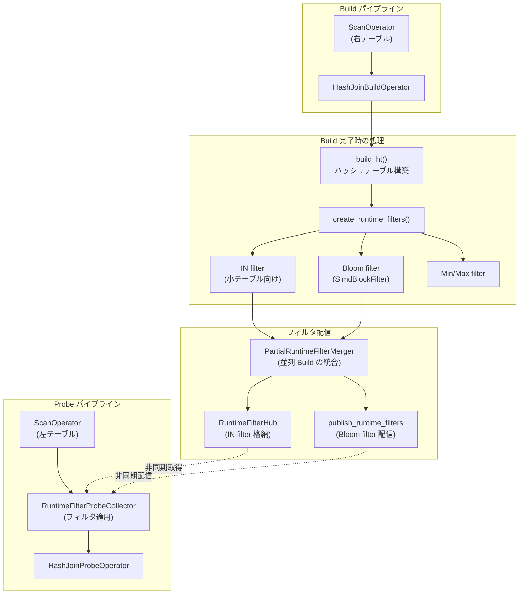

# 第12章 Join と RuntimeFilter

> **本章で読むソース**
>
> - [`be/src/exec/pipeline/hashjoin/hash_join_build_operator.h`](https://github.com/StarRocks/starrocks/blob/4.1.1/be/src/exec/pipeline/hashjoin/hash_join_build_operator.h)
> - [`be/src/exec/pipeline/hashjoin/hash_join_build_operator.cpp`](https://github.com/StarRocks/starrocks/blob/4.1.1/be/src/exec/pipeline/hashjoin/hash_join_build_operator.cpp)
> - [`be/src/exec/pipeline/hashjoin/hash_join_probe_operator.h`](https://github.com/StarRocks/starrocks/blob/4.1.1/be/src/exec/pipeline/hashjoin/hash_join_probe_operator.h)
> - [`be/src/exec/pipeline/hashjoin/hash_join_probe_operator.cpp`](https://github.com/StarRocks/starrocks/blob/4.1.1/be/src/exec/pipeline/hashjoin/hash_join_probe_operator.cpp)
> - [`be/src/exec/hash_joiner.h`](https://github.com/StarRocks/starrocks/blob/4.1.1/be/src/exec/hash_joiner.h)
> - [`be/src/exec/hash_joiner.cpp`](https://github.com/StarRocks/starrocks/blob/4.1.1/be/src/exec/hash_joiner.cpp)
> - [`be/src/exec/pipeline/hashjoin/hash_joiner_factory.h`](https://github.com/StarRocks/starrocks/blob/4.1.1/be/src/exec/pipeline/hashjoin/hash_joiner_factory.h)
> - [`be/src/exec/hash_join_components.h`](https://github.com/StarRocks/starrocks/blob/4.1.1/be/src/exec/hash_join_components.h)
> - [`be/src/exec/join/join_hash_table.h`](https://github.com/StarRocks/starrocks/blob/4.1.1/be/src/exec/join/join_hash_table.h)
> - [`be/src/exec/join/join_hash_table_descriptor.h`](https://github.com/StarRocks/starrocks/blob/4.1.1/be/src/exec/join/join_hash_table_descriptor.h)
> - [`be/src/exec/join/join_hash_map_method.h`](https://github.com/StarRocks/starrocks/blob/4.1.1/be/src/exec/join/join_hash_map_method.h)
> - [`be/src/exprs/runtime_filter.h`](https://github.com/StarRocks/starrocks/blob/4.1.1/be/src/exprs/runtime_filter.h)
> - [`be/src/exprs/runtime_filter_bank.h`](https://github.com/StarRocks/starrocks/blob/4.1.1/be/src/exprs/runtime_filter_bank.h)

## この章の狙い

分散分析データベースにおいて、Join は最もコストの高い演算の一つである。
StarRocks のパイプライン実行エンジンは、HashJoin を Build と Probe の2つのオペレーターに分割し、それぞれを独立したパイプラインで並行実行する。
本章では、この分割の仕組みと4フェーズの状態遷移、ハッシュテーブルの内部構造を読む。
さらに、Build 側で生成した **RuntimeFilter** を Scan オペレーターへプッシュすることで、Probe 側に流れるデータを事前に削減する最適化の機構を追う。

## 前提

第10章で述べたとおり、StarRocks のパイプライン実行エンジンは各 Fragment をオペレーターの連鎖(パイプライン)として表現する。
Scan オペレーターが Chunk 単位でデータを供給し、後続のオペレーターが変換や集約を行う。
HashJoin では右入力(Build 側)のデータでハッシュテーブルを構築してから、左入力(Probe 側)のデータを突き合わせる。
パイプラインモデルでは、Build と Probe を別々のパイプラインに分割し、Build 完了を待ってから Probe パイプラインが動き出す。

Chunk の構造(列指向の列ベクトルの集合)については第14章を参照されたい。

## HashJoin のパイプライン分割

### HashJoinerFactory によるインスタンス生成

**HashJoinerFactory** は、Build 側と Probe 側の `HashJoiner` インスタンスを生成するファクトリである。

[`be/src/exec/pipeline/hashjoin/hash_joiner_factory.h` L30-L56](https://github.com/StarRocks/starrocks/blob/4.1.1/be/src/exec/pipeline/hashjoin/hash_joiner_factory.h#L30-L56)

```cpp
class HashJoinerFactory {
public:
    HashJoinerFactory(starrocks::HashJoinerParam& param) : _param(param) {}

    Status prepare(RuntimeState* state);
    void close(RuntimeState* state);

    /// We must guarantee that:
    /// 1. All the builders must be created earlier than prober.
    /// 2. prober_dop is a multiple of builder_dop.
    HashJoinerPtr create_builder(int32_t builder_dop, int32_t builder_driver_seq);
    HashJoinerPtr create_prober(int32_t prober_dop, int32_t prober_driver_seq);
    HashJoinerPtr get_builder(int32_t prober_dop, int32_t prober_driver_seq);

    // ... (中略) ...

private:
    HashJoinerPtr _create_joiner(HashJoinerMap& joiner_map, int32_t driver_sequence);

    HashJoinerParam _param;
    HashJoinerMap _builder_map;
    HashJoinerMap _prober_map;

    int32_t _builder_dop = 0;
    int32_t _prober_dop = 0;
};

```

コメントにある制約が設計の核心を表している。
すべての Builder が Prober より先に生成されなければならず、Prober の並列度(DOP)は Builder の DOP の倍数でなければならない。
Broadcast Join の場合、Builder は1つだけ生成され、複数の Prober がそのハッシュテーブルを読み取り専用で参照する。

`HashJoinBuildOperatorFactory::create` は `create_builder` を呼び、`HashJoinProbeOperatorFactory::create` は `create_prober` と `get_builder` を呼ぶ。

[`be/src/exec/pipeline/hashjoin/hash_join_build_operator.cpp` L245-L253](https://github.com/StarRocks/starrocks/blob/4.1.1/be/src/exec/pipeline/hashjoin/hash_join_build_operator.cpp#L245-L253)

```cpp
OperatorPtr HashJoinBuildOperatorFactory::create(int32_t dop, int32_t driver_sequence) {
    if (_string_key_columns.empty()) {
        _string_key_columns.resize(dop);
    }

    return std::make_shared<HashJoinBuildOperator>(this, _id, _name, _plan_node_id, driver_sequence,
                                                   _hash_joiner_factory->create_builder(dop, driver_sequence),
                                                   _partial_rf_merger.get(), _distribution_mode);
}
```

[`be/src/exec/pipeline/hashjoin/hash_join_probe_operator.cpp` L155-L159](https://github.com/StarRocks/starrocks/blob/4.1.1/be/src/exec/pipeline/hashjoin/hash_join_probe_operator.cpp#L155-L159)

```cpp
OperatorPtr HashJoinProbeOperatorFactory::create(int32_t dop, int32_t driver_sequence) {
    return std::make_shared<HashJoinProbeOperator>(this, _id, _name, _plan_node_id, driver_sequence,
                                                   _hash_joiner_factory->create_prober(dop, driver_sequence),
                                                   _hash_joiner_factory->get_builder(dop, driver_sequence));
}
```

Probe オペレーターは、自身の `_join_prober` に加えて `_join_builder` への参照も保持する。
Non-Broadcast Join では両者は同一のオブジェクトを指すが、Broadcast Join では別オブジェクトになる。

### 4フェーズの状態遷移

**HashJoiner** は4つの連続するフェーズで動作する。

[`be/src/exec/hash_joiner.h` L60-L65](https://github.com/StarRocks/starrocks/blob/4.1.1/be/src/exec/hash_joiner.h#L60-L65)

```cpp
enum HashJoinPhase {
    BUILD = 0,
    PROBE = 1,
    POST_PROBE = 2,
    EOS = 4,
};
```

各フェーズの役割は次のとおりである。

- **BUILD**: 右入力から Chunk を受け取り、ハッシュテーブルを構築する。右入力の終了(EOS)でハッシュテーブルを確定させる
- **PROBE**: ハッシュテーブル構築が完了し、左入力から Chunk を受け取って突き合わせる。左入力の終了で PROBE フェーズが終わる
- **POST_PROBE**: RIGHT OUTER JOIN, RIGHT ANTI JOIN, FULL OUTER JOIN の場合に、Probe でマッチしなかった Build 側の行を出力する
- **EOS**: すべての入力ストリームの処理が完了した状態

フェーズ遷移は `std::atomic<HashJoinPhase>` で管理され、`compare_exchange_strong` によるロックフリーな遷移を行う。

[`be/src/exec/hash_joiner.h` L210-L223](https://github.com/StarRocks/starrocks/blob/4.1.1/be/src/exec/hash_joiner.h#L210-L223)

```cpp
    void enter_probe_phase() {
        _short_circuit_break();

        auto old_phase = HashJoinPhase::BUILD;
        _phase.compare_exchange_strong(old_phase, HashJoinPhase::PROBE);
    }
    void enter_post_probe_phase() {
        HashJoinPhase old_phase = HashJoinPhase::PROBE;
        if (!_phase.compare_exchange_strong(old_phase, HashJoinPhase::POST_PROBE)) {
            old_phase = HashJoinPhase::BUILD;
            // HashJoinProbeOperator finishes prematurely on runtime error or fragment's cancellation.
            _phase.compare_exchange_strong(old_phase, HashJoinPhase::EOS);
        }
    }
```

`enter_probe_phase` の先頭で `_short_circuit_break` を呼び出している点に注目されたい。
Build 側が空の場合に Probe フェーズをスキップして直接 EOS へ遷移する、ショートサーキット最適化がここで発動する。

## HashJoinBuildOperator によるハッシュテーブル構築

### push_chunk: Build 側データの蓄積

`HashJoinBuildOperator` の `push_chunk` は、受け取った Chunk をそのまま `HashJoiner` の `append_chunk_to_ht` に委譲する。

[`be/src/exec/pipeline/hashjoin/hash_join_build_operator.cpp` L40-L42](https://github.com/StarRocks/starrocks/blob/4.1.1/be/src/exec/pipeline/hashjoin/hash_join_build_operator.cpp#L40-L42)

```cpp
Status HashJoinBuildOperator::push_chunk(RuntimeState* state, const ChunkPtr& chunk) {
    return _join_builder->append_chunk_to_ht(state, chunk);
}
```

`append_chunk_to_ht` は BUILD フェーズであることを確認し、行数を更新してからハッシュテーブルビルダーに Chunk を追加する。

[`be/src/exec/hash_joiner.cpp` L210-L220](https://github.com/StarRocks/starrocks/blob/4.1.1/be/src/exec/hash_joiner.cpp#L210-L220)

```cpp
Status HashJoiner::append_chunk_to_ht(RuntimeState* state, const ChunkPtr& chunk) {
    if (_phase != HashJoinPhase::BUILD) {
        return Status::OK();
    }
    if (!chunk || chunk->is_empty()) {
        return Status::OK();
    }

    update_build_rows(chunk->num_rows());
    return _hash_join_builder->append_chunk(state, chunk);
}
```

この段階では Chunk を内部バッファに蓄積するだけで、ハッシュテーブルの構築自体はまだ行わない。

### set_finishing: ハッシュテーブル確定と RuntimeFilter 生成

Build 側パイプラインの EOS に達すると `set_finishing` が呼ばれる。
この関数が HashJoin の Build フェーズで最も処理の重い箇所であり、ハッシュテーブルの確定、「RuntimeFilter」の生成、Probe フェーズへの遷移を一連の流れで実行する。

[`be/src/exec/pipeline/hashjoin/hash_join_build_operator.cpp` L85-L101](https://github.com/StarRocks/starrocks/blob/4.1.1/be/src/exec/pipeline/hashjoin/hash_join_build_operator.cpp#L85-L101)

```cpp
Status HashJoinBuildOperator::set_finishing(RuntimeState* state) {
    ONCE_DETECT(_set_finishing_once);
    // notify probe side
    auto notify = _join_builder->defer_notify_probe();
    DeferOp op([this]() { _is_finished = true; });

    if (state->is_cancelled()) {
        return Status::Cancelled("runtime state is cancelled");
    }
    RETURN_IF_ERROR(_join_builder->build_ht(state));

    size_t merger_index = _driver_sequence;
    // Broadcast Join only has one build operator.
    DCHECK(_distribution_mode != TJoinDistributionMode::BROADCAST || _driver_sequence == 0);
    {
        SCOPED_TIMER(_join_builder->build_metrics().build_runtime_filter_timer);
        RETURN_IF_ERROR(_join_builder->create_runtime_filters(state));
```

`defer_notify_probe` は RAII パターンで、関数の終了時に Probe 側のオブザーバーへ通知を送る。
この通知を受けて Probe パイプラインのドライバースケジューラーが起動する。

`build_ht` は蓄積した Chunk からハッシュテーブルを構築する。

[`be/src/exec/hash_joiner.cpp` L245-L259](https://github.com/StarRocks/starrocks/blob/4.1.1/be/src/exec/hash_joiner.cpp#L245-L259)

```cpp
Status HashJoiner::build_ht(RuntimeState* state) {
    if (_phase == HashJoinPhase::BUILD) {
        RETURN_IF_ERROR(_hash_join_builder->build(state));

        size_t bucket_size = 0;
        float avg_keys_per_bucket = 0;
        std::string hash_map_type;
        _hash_join_builder->get_build_info(&bucket_size, &avg_keys_per_bucket, &hash_map_type);
        COUNTER_SET(build_metrics().build_buckets_counter, static_cast<int64_t>(bucket_size));
        COUNTER_SET(build_metrics().build_keys_per_bucket, static_cast<int64_t>(100 * avg_keys_per_bucket));
        *(build_metrics().hash_map_type_info) = std::move(hash_map_type);
    }

    return Status::OK();
}
```

Build が完了すると、バケット数やバケットあたりの平均キー数がプロファイルメトリクスに記録される。
続いて `create_runtime_filters` が「RuntimeFilter」を生成し(後述)、`set_finishing` の末尾で `enter_probe_phase` を呼んで PROBE フェーズへ遷移する。

[`be/src/exec/pipeline/hashjoin/hash_join_build_operator.cpp` L216](https://github.com/StarRocks/starrocks/blob/4.1.1/be/src/exec/pipeline/hashjoin/hash_join_build_operator.cpp#L216)

```cpp
    _join_builder->enter_probe_phase();
```

### PartialRuntimeFilterMerger によるフィルタ統合

並列 Build(Shuffle Join)の場合、各 Build オペレーターが部分的な「RuntimeFilter」を生成する。
`set_finishing` の後半で、これらの部分フィルタを **PartialRuntimeFilterMerger** に登録し、全 Build オペレーターが完了した時点で統合する。

[`be/src/exec/pipeline/hashjoin/hash_join_build_operator.cpp` L179-L215](https://github.com/StarRocks/starrocks/blob/4.1.1/be/src/exec/pipeline/hashjoin/hash_join_build_operator.cpp#L179-L215)

```cpp
            auto&& in_filters = _partial_rf_merger->get_total_in_filters();
            auto&& bloom_filters = _partial_rf_merger->get_total_bloom_filters();

        // ... (中略) ...

            // publish runtime bloom
            if (is_skew_broadcast_join) {
            // ... (中略) ...
                } else {
                state->runtime_filter_port()->publish_runtime_filters(bloom_filters);
            }

            RETURN_IF_ERROR(RuntimeFilterCollector::prepare_runtime_in_filters(state, in_filters));
            // move runtime filters into RuntimeFilterHub.
            runtime_filter_hub()->set_collector(_plan_node_id,
                                                std::make_unique<RuntimeFilterCollector>(std::move(in_filters)));

```

統合された Bloom filter は `publish_runtime_filters` でリモートノードを含む全 Probe 側に配信される。
IN filter は `RuntimeFilterHub` に格納され、ローカルの Probe パイプラインから参照される。

## HashJoinProbeOperator によるプローブ

### Build 完了の待機

`HashJoinProbeOperator` は `OperatorWithDependency` を継承し、`is_ready` メソッドで Build 側の完了を待つ。

[`be/src/exec/pipeline/hashjoin/hash_join_probe_operator.cpp` L75-L77](https://github.com/StarRocks/starrocks/blob/4.1.1/be/src/exec/pipeline/hashjoin/hash_join_probe_operator.cpp#L75-L77)

```cpp
bool HashJoinProbeOperator::is_ready() const {
    return _join_builder->is_build_done();
}
```

`is_build_done` は `_phase != HashJoinPhase::BUILD` を返すだけであり、Build 側が `enter_probe_phase` を呼んだ時点で true になる。
パイプラインドライバーは `is_ready` が false の間、このオペレーターをスケジュールしない。

### ハッシュテーブル参照

Build 完了後、最初の `push_chunk` または `pull_chunk` で Builder のハッシュテーブルを参照する。

[`be/src/exec/pipeline/hashjoin/hash_join_probe_operator.cpp` L104-L117](https://github.com/StarRocks/starrocks/blob/4.1.1/be/src/exec/pipeline/hashjoin/hash_join_probe_operator.cpp#L104-L117)

```cpp
Status HashJoinProbeOperator::_reference_builder_hash_table_once() {
    if (!is_ready()) {
        return Status::OK();
    }

    if (_join_prober->has_referenced_hash_table()) {
        return Status::OK();
    }

    TRY_CATCH_ALLOC_SCOPE_START()
    _join_prober->reference_hash_table(_join_builder.get());
    TRY_CATCH_ALLOC_SCOPE_END()
    return Status::OK();
}
```

Broadcast Join の場合、`reference_hash_table` は Builder のハッシュテーブルを読み取り専用でクローンする。
Non-Broadcast Join では Prober と Builder が同一オブジェクトなので、単に自身のハッシュテーブルに Prober をアタッチする。

[`be/src/exec/hash_joiner.cpp` L362-L381](https://github.com/StarRocks/starrocks/blob/4.1.1/be/src/exec/hash_joiner.cpp#L362-L381)

```cpp
void HashJoiner::reference_hash_table(HashJoiner* src_join_builder_cntl) {
    if (this == src_join_builder_cntl) {
        _hash_join_prober->attach(src_join_builder_cntl->hash_join_builder(), probe_metrics());
    } else {
        src_join_builder_cntl->hash_join_builder()->clone_readable(this->hash_join_builder());
        _hash_join_prober->attach(this->hash_join_builder(), probe_metrics());
        _hash_table_param = src_join_builder_cntl->hash_table_param();

        // _hash_table_build_rows is root truth, it used to by _short_circuit_break().
        _hash_table_build_rows = src_join_builder_cntl->_hash_table_build_rows;
        // ... (中略) ...

        // _phase may be EOS.
        auto old_phase = HashJoinPhase::BUILD;
        _phase.compare_exchange_strong(old_phase, src_join_builder_cntl->_phase.load());
    }
    _has_referenced_hash_table = true;
}

```

### push_chunk と pull_chunk

Probe 側のデータフローは `push_chunk` と `pull_chunk` を通じて行われる。

[`be/src/exec/pipeline/hashjoin/hash_join_probe_operator.cpp` L79-L88](https://github.com/StarRocks/starrocks/blob/4.1.1/be/src/exec/pipeline/hashjoin/hash_join_probe_operator.cpp#L79-L88)

```cpp
Status HashJoinProbeOperator::push_chunk(RuntimeState* state, const ChunkPtr& chunk) {
    RETURN_IF_ERROR(_reference_builder_hash_table_once());
    RETURN_IF_ERROR(_join_prober->push_chunk(state, std::move(const_cast<ChunkPtr&>(chunk))));
    return Status::OK();
}

StatusOr<ChunkPtr> HashJoinProbeOperator::pull_chunk(RuntimeState* state) {
    RETURN_IF_ERROR(_reference_builder_hash_table_once());
    return _join_prober->pull_chunk(state);
}
```

`push_chunk` は入力 Chunk をプローブバッファに格納し、`pull_chunk` がハッシュテーブルとの突き合わせ結果を Chunk として返す。
内部では `HashJoiner::_pull_probe_output_chunk` がフェーズに応じた処理を行う。

[`be/src/exec/hash_joiner.cpp` L299-L327](https://github.com/StarRocks/starrocks/blob/4.1.1/be/src/exec/hash_joiner.cpp#L299-L327)

```cpp
StatusOr<ChunkPtr> HashJoiner::_pull_probe_output_chunk(RuntimeState* state) {
    DCHECK(_phase != HashJoinPhase::BUILD);

    auto chunk = std::make_shared<Chunk>();

    if (_phase == HashJoinPhase::PROBE || !_hash_join_prober->probe_chunk_empty()) {
        ASSIGN_OR_RETURN(chunk, _hash_join_prober->probe_chunk(state))
        RETURN_IF_ERROR(chunk->capacity_limit_reached());
        return chunk;
    }

    if (_phase == HashJoinPhase::POST_PROBE) {
        if (!_need_post_probe()) {
            enter_eos_phase();
            return chunk;
        }

        bool has_remain = false;
        ASSIGN_OR_RETURN(chunk, _hash_join_prober->probe_remain(state, &has_remain))

        if (!has_remain) {
            enter_eos_phase();
        }

        return chunk;
    }

    return chunk;
}
```

PROBE フェーズでは `probe_chunk` がハッシュテーブルを検索して結果 Chunk を生成する。
POST_PROBE フェーズでは `probe_remain` が、Build 側でマッチしなかった行を出力する。

### set_finishing: POST_PROBE フェーズへの遷移

Probe 側の入力が終了すると `set_finishing` が POST_PROBE フェーズへ遷移させる。

[`be/src/exec/pipeline/hashjoin/hash_join_probe_operator.cpp` L90-L96](https://github.com/StarRocks/starrocks/blob/4.1.1/be/src/exec/pipeline/hashjoin/hash_join_probe_operator.cpp#L90-L96)

```cpp
Status HashJoinProbeOperator::set_finishing(RuntimeState* state) {
    // TODO: notify one will be ok
    auto notify = _join_builder->defer_notify_build();
    RETURN_IF_ERROR(_join_prober->probe_input_finished(state));
    _join_prober->enter_post_probe_phase();
    return Status::OK();
}
```

## JoinHashTable の内部構造

### JoinHashTableItems: バケットチェーン連結リスト

ハッシュテーブルの核となるデータ構造は **JoinHashTableItems** である。
`first` 配列と `next` 配列でバケットチェーン連結リストを構成する。

[`be/src/exec/join/join_hash_table_descriptor.h` L104-L205](https://github.com/StarRocks/starrocks/blob/4.1.1/be/src/exec/join/join_hash_table_descriptor.h#L104-L205)

```cpp
struct JoinHashTableItems {
    //TODO: memory continues problem?
    ChunkPtr build_chunk = nullptr;
    Columns key_columns;
    std::vector<HashTableSlotDescriptor> build_slots;
    std::vector<HashTableSlotDescriptor> probe_slots;
    // A hash value is the bucket index of the hash map. "JoinHashTableItems.first" is the
    // buckets of the hash map, and it holds the index of the first key value saved in each bucket,
    // while other keys can be found by following the indices saved in
    // "JoinHashTableItems.next". "JoinHashTableItems.next[0]" represents the end of
    // the list of keys in a bucket.
    Buffer<uint32_t> first;
    Buffer<uint32_t> next;
    Buffer<uint8_t> fps;

    // ... (中略) ...

    uint32_t bucket_size = 0;
    uint32_t log_bucket_size = 0;
    uint32_t row_count = 0; // real row count
    size_t build_column_count = 0;
    size_t output_build_column_count = 0;
    // ... (中略) ...
};

```

`first[bucket]` はそのバケットの先頭行インデックスを格納し、`next[row]` は同じバケットに属する次の行インデックスを格納する。
`next[0]` はリストの終端を表す番兵値として予約されている。
`fps` 配列はフィンガープリント(後述)を格納する。

### BucketChainedJoinHashMap と LinearChainedJoinHashMap

ハッシュマップの実装は型に応じて複数のバリアントが用意されている。
代表的な2つを見る。

**BucketChainedJoinHashMap** は、ハッシュ値から `first` 配列の位置を直接決定する方式である。

[`be/src/exec/join/join_hash_map_method.h` L52-L69](https://github.com/StarRocks/starrocks/blob/4.1.1/be/src/exec/join/join_hash_map_method.h#L52-L69)

```cpp
template <LogicalType LT>
class BucketChainedJoinHashMap {
public:
    using CppType = typename RunTimeTypeTraits<LT>::CppType;
    using ColumnType = typename RunTimeTypeTraits<LT>::ColumnType;

    static constexpr bool AreKeysInChainIdentical = false;

    static void build_prepare(RuntimeState* state, JoinHashTableItems* table_items);
    static void construct_hash_table(JoinHashTableItems* table_items, const ImmBuffer<CppType>& keys,
                                     const std::optional<ImmBuffer<uint8_t>> is_nulls);

    static void lookup_init(const JoinHashTableItems& table_items, HashTableProbeState* probe_state,
                            const ImmBuffer<CppType>& build_keys, const ImmBuffer<CppType>& probe_keys,
                            std::optional<ImmBuffer<uint8_t>> is_nulls);

    static bool equal(const CppType& x, const CppType& y) { return x == y; }
};
```

`AreKeysInChainIdentical` が `false` であるため、同じバケットに異なるキーが混在する。
Probe 時にはチェーンをたどりながらキーの等値比較が必要になる。

**LinearChainedJoinHashMap** は、線形探索(オープンアドレッシング)とチェーンを組み合わせた方式であり、フィンガープリントによる高速な不一致判定が特徴である。

[`be/src/exec/join/join_hash_map_method.h` L117-L149](https://github.com/StarRocks/starrocks/blob/4.1.1/be/src/exec/join/join_hash_map_method.h#L117-L149)

```cpp
template <LogicalType LT, bool NeedBuildChained = true>
class TLinearChainedJoinHashMap {
public:
    using CppType = typename RunTimeTypeTraits<LT>::CppType;
    using ColumnType = typename RunTimeTypeTraits<LT>::ColumnType;

    static constexpr bool AreKeysInChainIdentical = true;

    // ... (中略) ...

    static bool equal(const CppType& x, const CppType& y) { return true; }

    static uint32_t max_supported_bucket_size() { return DATA_MASK; }

private:
    static constexpr uint32_t FP_BITS = 8;
    static constexpr uint32_t FP_MASK = 0xFF00'0000ul;
    static constexpr uint32_t DATA_MASK = 0x00FF'FFFFul;

    static uint32_t _combine_data_fp(const uint32_t data, const uint32_t fp) { return fp | data; }
    static uint32_t _extract_data(const uint32_t v) { return v & DATA_MASK; }
    static uint32_t _extract_fp(const uint32_t v) { return v & FP_MASK; }

    static uint32_t _get_bucket_num_from_hash(const uint32_t hash) { return hash >> FP_BITS; }
    static uint32_t _get_fp_from_hash(const uint32_t hash) { return hash << (32 - FP_BITS); }
};

```

`first` 配列の各エントリは上位8ビットがフィンガープリント、下位24ビットが Build 行インデックスという構造である。
`AreKeysInChainIdentical` が `true` であるため、同じバケット位置に配置された行は同じキー値を持ち、`equal` は常に `true` を返す。
線形探索でバケットを見つける際、フィンガープリントの一致を先に確認することで、キー本体の比較を省略できる。
バケットサイズの上限は `DATA_MASK`(0x00FFFFFF、約1,600万)である。

### JoinHashMapVariant: 型特殊化による分岐

`JoinHashTable` は内部に `JoinHashMapVariant` を `std::variant` として保持する。

[`be/src/exec/join/join_hash_table.h` L131-L140](https://github.com/StarRocks/starrocks/blob/4.1.1/be/src/exec/join/join_hash_table.h#L131-L140)

```cpp
    using JoinHashMapVariant = std::variant<std::unique_ptr<JoinHashMapForEmpty>,
                                            JoinHashMapForSmallKey(DIRECT_MAPPING),                //
                                            JoinHashMapForNonSmallKey(BUCKET_CHAINED),             //
                                            JoinHashMapForNonSmallKey(LINEAR_CHAINED),             //
                                            JoinHashMapForNonSmallKey(LINEAR_CHAINED_SET),         //
                                            JoinHashMapForNonSmallKey(LINEAR_CHAINED_ASOF),        //
                                            JoinHashMapForIntBigintKey(RANGE_DIRECT_MAPPING),      //
                                            JoinHashMapForIntBigintKey(RANGE_DIRECT_MAPPING_SET),  //
                                            JoinHashMapForIntBigintKey(DENSE_RANGE_DIRECT_MAPPING) //
                                            >;
```

キーの型(BOOLEAN, TINYINT, SMALLINT, INT, BIGINT, VARCHAR など)とマップ方式の組み合わせごとに、コンパイル時に特殊化されたテンプレートインスタンスが生成される。
`std::visit` でディスパッチすることにより、Probe 時に仮想関数呼び出しのオーバーヘッドを排除している。

## Join 種別のサポート

### サポートする Join タイプ

StarRocks の HashJoin は多数の Join タイプをサポートする。

- INNER JOIN
- LEFT OUTER JOIN, RIGHT OUTER JOIN, FULL OUTER JOIN
- LEFT SEMI JOIN, RIGHT SEMI JOIN
- LEFT ANTI JOIN, RIGHT ANTI JOIN
- NULL_AWARE_LEFT_ANTI JOIN(`NOT IN` のリライト結果)
- CROSS JOIN
- ASOF JOIN(時系列データ用の近似 Join)

### ショートサーキット: Build 側が空の場合

Build 側のハッシュテーブルが空の場合、Join タイプによっては結果が自明に空になる。
`could_short_circuit` がこの判定を担う。

[`be/src/exec/hash_joiner.h` L135-L139](https://github.com/StarRocks/starrocks/blob/4.1.1/be/src/exec/hash_joiner.h#L135-L139)

```cpp
inline bool could_short_circuit(TJoinOp::type join_type) {
    return join_type == TJoinOp::INNER_JOIN || join_type == TJoinOp::LEFT_SEMI_JOIN ||
           join_type == TJoinOp::RIGHT_SEMI_JOIN || join_type == TJoinOp::RIGHT_ANTI_JOIN ||
           join_type == TJoinOp::RIGHT_OUTER_JOIN;
}
```

INNER JOIN では、右テーブルが空なら結果は必ず空になる。
LEFT SEMI JOIN も右テーブルにマッチする行がなければ結果は空である。
これらの場合、`_short_circuit_break` が Probe フェーズをスキップして直接 EOS に遷移させる。

[`be/src/exec/hash_joiner.h` L399-L423](https://github.com/StarRocks/starrocks/blob/4.1.1/be/src/exec/hash_joiner.h#L399-L423)

```cpp
    void _short_circuit_break() {
        if (_phase == HashJoinPhase::EOS) {
            return;
        }
        size_t row_count = _hash_table_build_rows;

        // special cases of short-circuit break.
        if (row_count == 0 && could_short_circuit(_join_type)) {
            _phase = HashJoinPhase::EOS;
            return;
        }

        if (row_count > 0) {
            if (_join_type == TJoinOp::NULL_AWARE_LEFT_ANTI_JOIN &&
                _hash_join_builder->anti_join_key_column_has_null() && _other_join_conjunct_ctxs.empty()) {
                // The current implementation of HashTable will reserve a row for judging the end of the linked list.
                // When performing expression calculations (such as cast string to int),
                // it is possible that this reserved row will generate Null,
                // so Column::has_null() cannot be used to judge whether there is Null in the right table.
                // TODO: This reserved field will be removed in the implementation mechanism in the future.
                // at that time, you can directly use Column::has_null() to judge
                _phase = HashJoinPhase::EOS;
            }
        }
    }
```

NULL_AWARE_LEFT_ANTI_JOIN の場合、Build 側のキー列に NULL が含まれ、かつ追加の結合条件がなければ、全行が除外されるため EOS に遷移する。

### POST_PROBE フェーズ: 右側未マッチ行の出力

RIGHT OUTER JOIN, RIGHT ANTI JOIN, FULL OUTER JOIN では、Probe フェーズで Build 側の全行がマッチしたかを追跡する必要がある。
`has_post_probe` がこの判定を行う。

[`be/src/exec/hash_joiner.h` L141-L144](https://github.com/StarRocks/starrocks/blob/4.1.1/be/src/exec/hash_joiner.h#L141-L144)

```cpp
inline bool has_post_probe(TJoinOp::type join_type) {
    return join_type == TJoinOp::RIGHT_OUTER_JOIN || join_type == TJoinOp::RIGHT_ANTI_JOIN ||
           join_type == TJoinOp::FULL_OUTER_JOIN;
}
```

POST_PROBE フェーズでは `probe_remain` がハッシュテーブルを走査し、Probe でヒットしなかった Build 行を出力する。
RIGHT OUTER JOIN と FULL OUTER JOIN では NULL パディングされた Probe 側列とともに出力し、RIGHT ANTI JOIN ではマッチしなかった Build 行のみを出力する。

### other_conjunct の処理

等値条件以外の結合条件(`ON a.x = b.x AND a.y > b.y` の `a.y > b.y` 部分)は、ハッシュテーブルの Probe 後に `_process_other_conjunct` で評価される。

[`be/src/exec/hash_joiner.cpp` L529-L551](https://github.com/StarRocks/starrocks/blob/4.1.1/be/src/exec/hash_joiner.cpp#L529-L551)

```cpp
Status HashJoiner::_process_other_conjunct(ChunkPtr* chunk, JoinHashTable& hash_table) {
    SCOPED_TIMER(probe_metrics().other_join_conjunct_evaluate_timer);
    switch (_join_type) {
    case TJoinOp::LEFT_OUTER_JOIN:
    case TJoinOp::FULL_OUTER_JOIN:
    case TJoinOp::ASOF_LEFT_OUTER_JOIN:
        return _process_outer_join_with_other_conjunct(chunk, _output_probe_column_count, _output_build_column_count,
                                                       hash_table);
    case TJoinOp::RIGHT_OUTER_JOIN:
    case TJoinOp::LEFT_SEMI_JOIN:
    case TJoinOp::LEFT_ANTI_JOIN:
    case TJoinOp::NULL_AWARE_LEFT_ANTI_JOIN:
    case TJoinOp::RIGHT_SEMI_JOIN:
        return _process_semi_join_with_other_conjunct(chunk, hash_table);
    case TJoinOp::RIGHT_ANTI_JOIN:
        return _process_right_anti_join_with_other_conjunct(chunk, hash_table);
    default:
        // the other join conjunct for inner join will be convert to other predicate
        // so can't reach here
        RETURN_IF_ERROR(ExecNode::eval_conjuncts(_other_join_conjunct_ctxs, (*chunk).get()));
    }
    return Status::OK();
}
```

Join タイプごとに処理が分岐する理由は、OUTER JOIN では条件不成立の行を除外するのではなく NULL パディングに置き換える必要があり、SEMI/ANTI JOIN では重複を除去する必要があるためである。

## RuntimeFilter の生成と適用

### create_runtime_filters: フィルタ種別の決定

Build 側のハッシュテーブル構築が完了した直後に、`create_runtime_filters` が呼ばれる。
ハッシュテーブルの行数に応じて、IN filter と Bloom filter のどちらを生成するかを決定する。

[`be/src/exec/hash_joiner.cpp` L334-L360](https://github.com/StarRocks/starrocks/blob/4.1.1/be/src/exec/hash_joiner.cpp#L334-L360)

```cpp
Status HashJoiner::create_runtime_filters(RuntimeState* state) {
    if (_phase != HashJoinPhase::BUILD) {
        return Status::OK();
    }

    uint64_t runtime_join_filter_pushdown_limit = runtime_bloom_filter_row_limit();
    size_t ht_row_count = _hash_join_builder->hash_table_row_count();

    if (_is_push_down) {
        if (_probe_node_type == TPlanNodeType::EXCHANGE_NODE && _build_node_type == TPlanNodeType::EXCHANGE_NODE) {
            _is_push_down = false;
        } else if (ht_row_count > runtime_join_filter_pushdown_limit) {
            _is_push_down = false;
        }

        if (_is_push_down || !_build_conjunct_ctxs_is_empty) {
            // In filter could be used to fast compute segment row range in storage engine
            RETURN_IF_ERROR(_create_runtime_in_filters(state));
        }
    }

    // it's quite critical to put publish runtime filters before short-circuit of
    // "inner-join with empty right table". because for global runtime filter
    // merge node is waiting for all partitioned runtime filter, so even hash row count is zero
    // we still have to build it.
    return _create_runtime_bloom_filters(state, runtime_join_filter_pushdown_limit);
}
```

Push-down の条件判定で、Probe 側と Build 側の双方が `EXCHANGE_NODE` の場合は push-down を無効にする。
ネットワーク越しにシャッフルされたデータ同士の Join では、「RuntimeFilter」による事前フィルタリングの効果が薄いためである。
行数が `runtime_join_filter_pushdown_limit`(デフォルト 1,024,000)を超える場合も、IN filter の push-down を無効にする。

コメントにあるとおり、Bloom filter の生成は Build 側が空の場合でも実行しなければならない。
Global RuntimeFilter のマージノードが全パーティションからのフィルタを待っているためである。

### IN filter の生成

IN filter はハッシュテーブルのキー列の値を `VectorizedInConstPredicate` に格納した述語である。

[`be/src/exec/hash_joiner.cpp` L560-L607](https://github.com/StarRocks/starrocks/blob/4.1.1/be/src/exec/hash_joiner.cpp#L560-L607)

```cpp
Status HashJoiner::_create_runtime_in_filters(RuntimeState* state) {
    SCOPED_TIMER(build_metrics().build_runtime_filter_timer);
    size_t ht_row_count = get_ht_row_count();

    // Use FE session variable if set, otherwise fall back to BE config
    size_t max_conditions = config::max_pushdown_conditions_per_column;
    if (state->query_options().__isset.max_pushdown_conditions_per_column) {
        max_conditions = state->query_options().max_pushdown_conditions_per_column;
    }

    if (ht_row_count > max_conditions) {
        return Status::OK();
    }

    std::vector<JoinHashTable*> hash_tables;
    _hash_join_builder->visitHt([&hash_tables](JoinHashTable* ht) { hash_tables.push_back(ht); });

    if (ht_row_count > 0) {
        size_t size = _build_expr_ctxs.size();
        for (size_t i = 0; i < size; i++) {
            Expr* probe_expr = _probe_expr_ctxs[i]->root();
            DCHECK(probe_expr->is_slotref());
            // create and fill runtime in filter.
            VectorizedInConstPredicateBuilder builder(state, _pool, probe_expr);
            builder.set_eq_null(_is_null_safes[i]);
            builder.use_as_join_runtime_filter();
            Status st = builder.create();
            if (!st.ok()) {
                _runtime_in_filters.push_back(nullptr);
                continue;
            }

            for (auto* ht : hash_tables) {
                ColumnPtr column = ht->get_key_columns()[i];
                // ... (中略) ...
                builder.add_values(column, kHashJoinKeyColumnOffset);
            }

            _runtime_in_filters.push_back(builder.get_in_const_predicate());
        }
    }

    COUNTER_UPDATE(build_metrics().runtime_filter_num, static_cast<int64_t>(_runtime_in_filters.size()));
    return Status::OK();
}

```

`max_pushdown_conditions_per_column` を超える行数の場合、IN filter は生成されない。
小さなテーブルの Join でのみ効果的であり、値が多すぎると IN 述語の評価コストがフィルタリングの利得を上回るためである。

各 Join キー列について、ハッシュテーブルのキー列からすべての値を収集し、`VectorizedInConstPredicateBuilder` に追加する。
生成された IN 述語は Probe 側の Scan オペレーターにプッシュされ、ストレージ層でのセグメント行範囲の高速計算に利用される。

### Bloom filter の生成: SimdBlockFilter

行数が多い場合は、IN filter の代わりに **Bloom filter** が生成される。
StarRocks は **SimdBlockFilter** と呼ばれる SIMD 最適化された Bloom filter を使用する。

[`be/src/exec/hash_joiner.cpp` L608-L660](https://github.com/StarRocks/starrocks/blob/4.1.1/be/src/exec/hash_joiner.cpp#L608-L660)

```cpp
Status HashJoiner::_create_runtime_bloom_filters(RuntimeState* state, int64_t limit) {
    SCOPED_TIMER(build_metrics().build_runtime_filter_timer);
    size_t ht_row_count = get_ht_row_count();
    std::vector<JoinHashTable*> hash_tables;
    _hash_join_builder->visitHt([&hash_tables](JoinHashTable* ht) { hash_tables.emplace_back(ht); });

    for (auto* rf_desc : _build_runtime_filters) {
        rf_desc->set_is_pipeline(true);
        // skip if it does not have consumer.
        if (!rf_desc->has_consumer()) {
            _runtime_bloom_filter_build_params.emplace_back();
            continue;
        }
        if (!rf_desc->has_remote_targets() && ht_row_count > limit) {
            _runtime_bloom_filter_build_params.emplace_back();
            continue;
        }

        int expr_order = rf_desc->build_expr_order();
        bool eq_null = _is_null_safes[expr_order];
        // ... (中略) ...

        TypeDescriptor type_descriptor = _build_expr_ctxs[expr_order]->root()->type();

        MutableRuntimeFilterPtr filter = nullptr;
        auto multi_partitioned = rf_desc->layout().pipeline_level_multi_partitioned();
        multi_partitioned |= rf_desc->num_colocate_partition() > 0;
        if (multi_partitioned) {
            LogicalType build_type = rf_desc->build_expr_type();
            filter = std::shared_ptr<RuntimeFilter>(
                    RuntimeFilterHelper::create_runtime_bloom_filter(nullptr, build_type, rf_desc->join_mode()));
            // ... (中略) ...
            filter->get_membership_filter()->init(ht_row_count);
            RETURN_IF_ERROR(RuntimeFilterHelper::fill_runtime_filter(columns, build_type, filter.get(),
                                                                     kHashJoinKeyColumnOffset, eq_null));
        }

        _runtime_bloom_filter_build_params.emplace_back(pipeline::RuntimeMembershipFilterBuildParam(
                multi_partitioned, eq_null, is_empty, std::move(columns), std::move(filter), type_descriptor));
    }
    return Status::OK();
}

```

FE が計画時に決定した `_build_runtime_filters`(RuntimeFilterBuildDescriptor のリスト)を走査し、コンシューマが存在するフィルタについてのみ Bloom filter を生成する。
ローカルフィルタの場合、行数が `limit` を超えると生成をスキップする。
リモートフィルタ(Global RuntimeFilter)の場合は、行数によらず生成する。

## 最適化の工夫: SimdBlockFilter による SIMD Bloom filter

「RuntimeFilter」の中核を担う `SimdBlockFilter` は、論文 "Cache-, Hash- and Space-Efficient Bloom Filters" に基づくブロック型 Bloom filter の SIMD 実装である[^1]。

[^1]: ソースコードのコメント(`be/src/exprs/runtime_filter.h` L78-L79)に、FastFilter プロジェクトの実装を改変した旨と論文名が記されている。

[`be/src/exprs/runtime_filter.h` L80-L86](https://github.com/StarRocks/starrocks/blob/4.1.1/be/src/exprs/runtime_filter.h#L80-L86)

```cpp
class SimdBlockFilter {
public:
    // The filter is divided up into Buckets:
    static constexpr int BITS_SET_PER_BLOCK = 8;
    using Bucket = uint32_t[BITS_SET_PER_BLOCK];
    static constexpr size_t MINIMUM_ELEMENT_NUM = 1UL;

```

1つの「Bucket」は 32 バイト(uint32_t x 8)であり、AVX2 の 256 ビットレジスタ1本にちょうど収まる。
各 Bucket に対して8つのハッシュビットを設定する。

挿入操作は、ハッシュ値の下位ビットでバケットを選択し、上位ビットからマスクを生成してビット OR で書き込む。

[`be/src/exprs/runtime_filter.h` L98-L120](https://github.com/StarRocks/starrocks/blob/4.1.1/be/src/exprs/runtime_filter.h#L98-L120)

```cpp
    void insert_hash(const uint64_t hash) noexcept {
        const uint32_t bucket_idx = hash & _directory_mask;
#ifdef __AVX2__
        const __m256i mask = make_mask(hash >> _log_num_buckets);
        __m256i* const bucket = &reinterpret_cast<__m256i*>(_directory)[bucket_idx];
        _mm256_store_si256(bucket, _mm256_or_si256(*bucket, mask));
#elif defined(__ARM_NEON)
        uint32x4_t masks[2];
        make_mask(hash >> _log_num_buckets, masks);
        uint32x4_t directory_1 = vld1q_u32(&_directory[bucket_idx][0]);
        uint32x4_t directory_2 = vld1q_u32(&_directory[bucket_idx][4]);
        directory_1 = vorrq_u32(directory_1, masks[0]);
        directory_2 = vorrq_u32(directory_2, masks[1]);
        vst1q_u32(&_directory[bucket_idx][0], directory_1);
        vst1q_u32(&_directory[bucket_idx][4], directory_2);
#else
        uint32_t masks[BITS_SET_PER_BLOCK];
        make_mask(hash >> _log_num_buckets, masks);
        for (int i = 0; i < BITS_SET_PER_BLOCK; ++i) {
            _directory[bucket_idx][i] |= masks[i];
        }
#endif
    }
```

AVX2 パスでは、`_mm256_or_si256` 一命令で 32 バイト分のビット OR を実行する。
NEON パスでは 128 ビットレジスタ2本(`vorrq_u32`)で同等の処理を行う。
フォールバックのスカラーパスでは8回のループになる。

検査操作も同様に SIMD 命令で一括判定する。

[`be/src/exprs/runtime_filter.h` L122-L163](https://github.com/StarRocks/starrocks/blob/4.1.1/be/src/exprs/runtime_filter.h#L122-L163)

```cpp
    bool test_hash(const uint64_t hash) const noexcept {
        if (UNLIKELY(_directory == nullptr)) {
            DCHECK(false) << "unexpected test_hash on cleared bf";
            return true;
        }

        const uint32_t bucket_idx = hash & _directory_mask;
#ifdef __AVX2__
        const __m256i mask = make_mask(hash >> _log_num_buckets);
        const __m256i bucket = reinterpret_cast<__m256i*>(_directory)[bucket_idx];
        // We should return true if 'bucket' has a one wherever 'mask' does. _mm256_testc_si256
        // takes the negation of its first argument and ands that with its second argument. In
        // our case, the result is zero everywhere iff there is a one in 'bucket' wherever
        // 'mask' is one. testc returns 1 if the result is 0 everywhere and returns 0 otherwise.
        return _mm256_testc_si256(bucket, mask);
#elif defined(__ARM_NEON)
        // ... (中略) ...
#else
        uint32_t masks[BITS_SET_PER_BLOCK];
        make_mask(hash >> _log_num_buckets, masks);
        for (int i = 0; i < BITS_SET_PER_BLOCK; ++i) {
            if ((_directory[bucket_idx][i] & masks[i]) == 0) {
                return false;
            }
        }
        return true;
#endif
    }

```

AVX2 パスの `_mm256_testc_si256(bucket, mask)` は、`(~bucket) & mask` が全ゼロかどうかを1命令で判定する。
mask のビットが立っているすべての位置で bucket にもビットが立っていれば true を返す。

`make_mask` 関数は8つの異なる奇数定数(SALT)との乗算シフトハッシュで、1つの入力ハッシュから8つの独立したビット位置を生成する。

[`be/src/exprs/runtime_filter.h` L208-L221](https://github.com/StarRocks/starrocks/blob/4.1.1/be/src/exprs/runtime_filter.h#L208-L221)

```cpp
    __m256i make_mask(const uint32_t hash) const noexcept {
        // Load hash into a YMM register, repeated eight times
        __m256i hash_data = _mm256_set1_epi32(hash);
        // Multiply-shift hashing ala Dietzfelbinger et al.: multiply 'hash' by eight different
        // odd constants, then keep the 5 most significant bits from each product.
        const __m256i rehash = _mm256_setr_epi32(0x47b6137bU, 0x44974d91U, 0x8824ad5bU, 0xa2b7289dU, 0x705495c7U,
                                                 0x2df1424bU, 0x9efc4947U, 0x5c6bfb31U);
        hash_data = _mm256_mullo_epi32(rehash, hash_data);
        hash_data = _mm256_srli_epi32(hash_data, 27);
        const __m256i ones = _mm256_set1_epi32(1);
        // Use these 5 bits to shift a single bit to a location in each 32-bit lane
        return _mm256_sllv_epi32(ones, hash_data);
    }
#endif
```

8つの奇数定数と入力ハッシュを `_mm256_mullo_epi32` で並列乗算し、上位5ビットを取り出す。
この5ビット(0から31の範囲)が、各 uint32_t レーン内のビット位置を決定する。
`_mm256_sllv_epi32` で1をそのビット位置にシフトし、8つのビットマスクを一度に生成する。

この設計により、挿入も検査もバケットあたり1回のメモリアクセスで完結する。
従来の Bloom filter が k 個のハッシュ関数ごとに別々のメモリ位置にアクセスするのに対し、「SimdBlockFilter」は1つの 32 バイトブロック内で8ビットを操作するため、キャッシュミスが発生しにくい。
分析ワークロードではハッシュテーブルが大きくなりがちであり、この局所性の高さが性能に直結する。

## RuntimeFilterBank とライフサイクル管理

### RuntimeFilterBuildDescriptor

**RuntimeFilterBuildDescriptor** は、個々の「RuntimeFilter」の Build 側メタデータを保持する。
FE が計画時に `TRuntimeFilterDescription` として送信し、BE 側でこのクラスに変換される。

[`be/src/exprs/runtime_filter_bank.h` L99-L151](https://github.com/StarRocks/starrocks/blob/4.1.1/be/src/exprs/runtime_filter_bank.h#L99-L151)

```cpp
class RuntimeFilterBuildDescriptor : public WithLayoutMixin {
public:
    RuntimeFilterBuildDescriptor() = default;
    Status init(ObjectPool* pool, const TRuntimeFilterDescription& desc, RuntimeState* state);
    int32_t filter_id() const { return _filter_id; }
    ExprContext* build_expr_ctx() { return _build_expr_ctx; }
    LogicalType build_expr_type() const { return _build_expr_ctx->root()->type().type; }
    int build_expr_order() const { return _build_expr_order; }
    const TUniqueId& sender_finst_id() const { return _sender_finst_id; }
    // ... (中略) ...
    bool has_remote_targets() const { return _has_remote_targets; }
    bool has_consumer() const { return _has_consumer; }
    // ... (中略) ...
    void set_runtime_filter(RuntimeFilter* rf) { _runtime_filter = rf; }
    RuntimeFilter* runtime_filter() { return _runtime_filter; }

```

`filter_id` は FE が割り当てるグローバルに一意な識別子である。
`build_expr_order` は Join キー式の中での序数であり、ハッシュテーブルのキー列配列のインデックスに対応する。
`has_remote_targets` が true の場合、このフィルタは他の BE ノードへネットワーク経由で配信される Global RuntimeFilter である。

### RuntimeFilterProbeDescriptor と RuntimeFilterProbeCollector

Probe 側では **RuntimeFilterProbeDescriptor** と **RuntimeFilterProbeCollector** がフィルタの適用を担う。

[`be/src/exprs/runtime_filter_bank.h` L182-L238](https://github.com/StarRocks/starrocks/blob/4.1.1/be/src/exprs/runtime_filter_bank.h#L182-L238)

```cpp
class RuntimeFilterProbeDescriptor : public WithLayoutMixin {
public:
    // ... (中略) ...
    int32_t filter_id() const { return _filter_id; }
    bool skip_wait() const { return _skip_wait; }
    ExprContext* probe_expr_ctx() { return _probe_expr_ctx; }
    // ... (中略) ...
    bool can_push_down_runtime_filter() { return _partition_by_exprs_contexts.empty() && !_is_group_colocate_rf; }
    // ... (中略) ...

    const RuntimeFilter* runtime_filter(int32_t driver_sequence) const {
        auto runtime_filter = _runtime_filter.load();
        if (runtime_filter != nullptr && runtime_filter->is_group_colocate_filter()) {
            DCHECK(_is_group_colocate_rf);
            DCHECK_GE(driver_sequence, 0);
            DCHECK_LT(driver_sequence, runtime_filter->group_colocate_filter().size());
            return runtime_filter->group_colocate_filter()[driver_sequence];
        }
        return runtime_filter;
    }
    void set_runtime_filter(const RuntimeFilter* rf);

```

`_runtime_filter` は `std::atomic<const RuntimeFilter*>` であり、Build 側が非同期にフィルタを公開する。
Probe 側は `runtime_filter()` でアトミックにロードし、null でなければ適用する。

`RuntimeFilterProbeCollector` は複数の「RuntimeFilterProbeDescriptor」をまとめて管理し、選択率に基づく適用順序の最適化を行う。

[`be/src/exprs/runtime_filter_bank.h` L303-L360](https://github.com/StarRocks/starrocks/blob/4.1.1/be/src/exprs/runtime_filter_bank.h#L303-L360)

```cpp
class RuntimeFilterProbeCollector {
public:
    RuntimeFilterProbeCollector();
    // ... (中略) ...
    void evaluate(Chunk* chunk, RuntimeMembershipFilterEvalContext& eval_context);
    // ... (中略) ...
    void push_down(const RuntimeState* state, TPlanNodeId target_plan_node_id, RuntimeFilterProbeCollector* parent,
                   const std::vector<TupleId>& tuple_ids, std::set<TPlanNodeId>& rf_waiting_set);
    // ... (中略) ...
private:
    void update_selectivity(Chunk* chunk, RuntimeMembershipFilterEvalContext& eval_context);
    void do_evaluate(Chunk* chunk, RuntimeMembershipFilterEvalContext& eval_context);
    std::map<int32_t, RuntimeFilterProbeDescriptor*> _descriptors;
    // ... (中略) ...
    double _early_return_selectivity = 0.05;

```

`evaluate` は Chunk に対してすべてのフィルタを適用する。
`update_selectivity` がフィルタごとの選択率を計測し、選択率の低い(除外率の高い)フィルタから先に適用することで、後続フィルタの評価対象行数を削減する。
選択率が `_early_return_selectivity`(5%)を下回る場合は早期リターンし、残りのフィルタ評価をスキップする。

### MinMaxRuntimeFilter

「SimdBlockFilter」に加えて、**MinMaxRuntimeFilter** も生成される。
Build 側キー列の最小値と最大値を保持し、範囲外の値を高速に除外する。

[`be/src/exprs/runtime_filter.h` L584-L609](https://github.com/StarRocks/starrocks/blob/4.1.1/be/src/exprs/runtime_filter.h#L584-L609)

```cpp
template <LogicalType Type>
class MinMaxRuntimeFilter final : public RuntimeFilter {
public:
    using CppType = RunTimeCppType<Type>;
    using ColumnType = RunTimeColumnType<Type>;
    using ContainerType = RunTimeProxyContainerType<Type>;

    MinMaxRuntimeFilter() { _init_min_max(); }
    // ... (中略) ...

    const RuntimeFilter* get_min_max_filter() const override { return this; }

    RuntimeFilter* create_empty(ObjectPool* pool) override {
        auto* p = pool->add(new MinMaxRuntimeFilter());
        return p;
    }

```

「MinMaxRuntimeFilter」はストレージ層で Segment のゾーンマップ(各列の最小値と最大値を記録したメタデータ)と組み合わせて使われる。
フィルタの最小値がゾーンマップの最大値を超えている場合、そのセグメント全体をスキップできる。

## Build から Scan へのプッシュダウンの全体像

以上の要素を組み合わせた「RuntimeFilter」プッシュダウンの全体像を図にまとめる。



Build パイプラインがハッシュテーブルを構築し終えると、キー列の値から IN filter, Bloom filter, Min/Max filter を生成する。
これらは「PartialRuntimeFilterMerger」で統合された後、Probe パイプラインの Scan オペレーターに配信される。
Scan オペレーターは「RuntimeFilterProbeCollector」を通じてフィルタを適用し、マッチしない行をストレージ層で除外する。

この仕組みにより、Probe パイプラインに流入するデータ量が大幅に削減される。
たとえば、小さなディメンションテーブルと大きなファクトテーブルの Join において、ディメンションテーブルのキー値で Bloom filter を構築し、ファクトテーブルの Scan 時に適用すれば、Join 対象外の行がストレージ読み出しの段階で除外される。
ネットワーク転送量、メモリ使用量、Probe のハッシュ探索コストがすべて削減される。

## まとめ

StarRocks の HashJoin は、Build と Probe を別パイプラインに分割し、4フェーズの状態遷移で制御する。
ハッシュテーブルは `JoinHashMapVariant` による型特殊化で、キーの型ごとに最適なデータ構造とハッシュ方式を選択する。
「LinearChainedJoinHashMap」のフィンガープリントは、上位8ビットをハッシュ値から生成してバケットエントリに埋め込むことで、キー比較を省略する。

Build 完了時に生成される「RuntimeFilter」(IN filter, Bloom filter, Min/Max filter)は、Probe 側の Scan オペレーターにプッシュされ、ストレージ層でデータを事前にフィルタリングする。
「SimdBlockFilter」は32バイトのブロック内で8ビットを AVX2/NEON の SIMD 命令で一括操作し、キャッシュ局所性の高い Bloom filter 検査を実現する。

Build 側が空の場合のショートサーキット、Join タイプごとの other_conjunct 処理の分岐、「PartialRuntimeFilterMerger」による並列 Build のフィルタ統合など、実行エンジンとしての網羅性と性能の両立が読み取れる。

## 関連する章

- [第10章 Pipeline 実行モデル](10-pipeline-execution-model.md): パイプライン分割とドライバースケジューラーの仕組み
- [第11章 Scan オペレーターとデータアクセス](11-scan-operators.md): RuntimeFilter が適用される Scan オペレーターの構造
- [第13章 Aggregate、Sort、Exchange](13-aggregate-sort-exchange.md): Join と並ぶ主要オペレーターの実行方式
- [第14章 Column と Chunk](../part04-data/14-column-and-chunk.md): Chunk の内部構造と列指向データモデル
- [第9章 分散プランと Fragment](../part02-planning/09-distributed-plan-and-fragment.md): RuntimeFilter の配置を決定する分散プランニング
