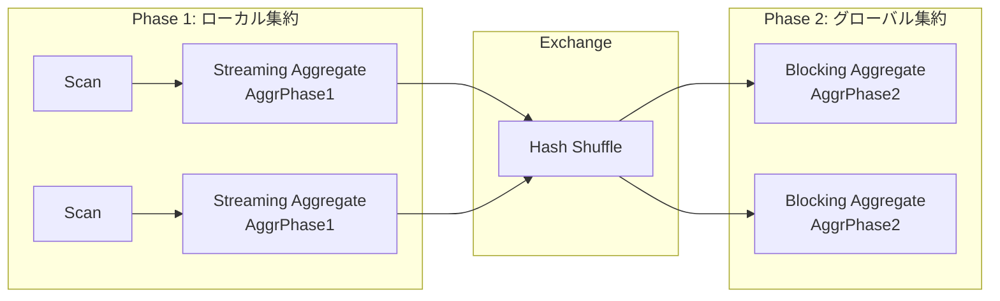
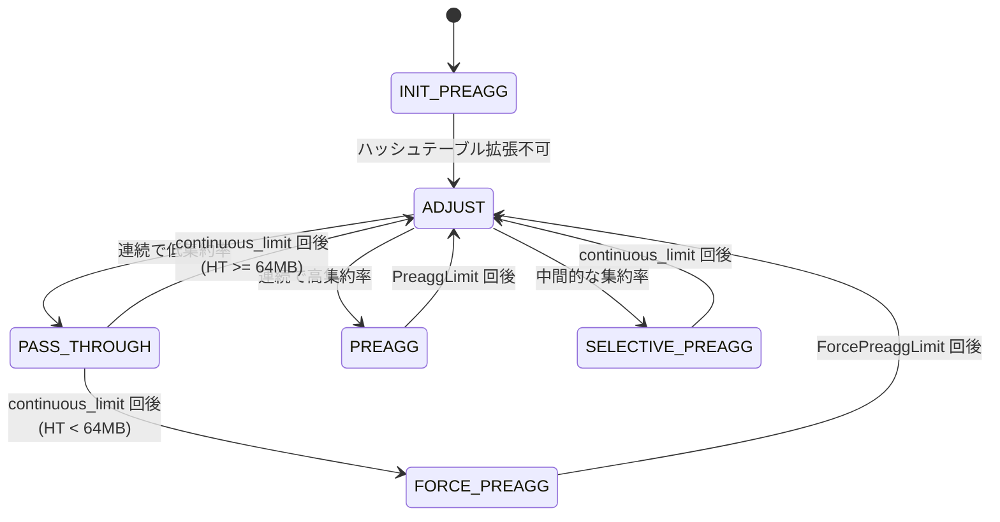
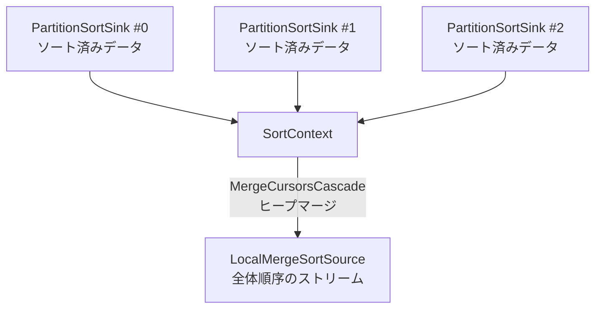
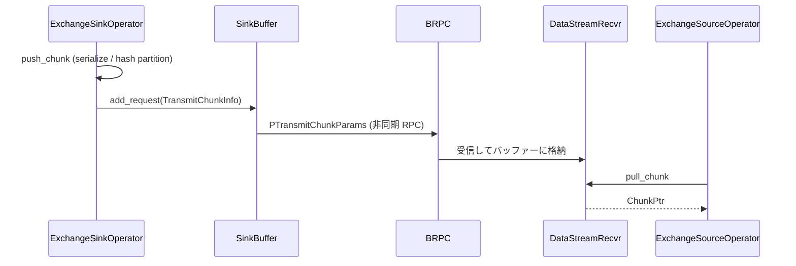
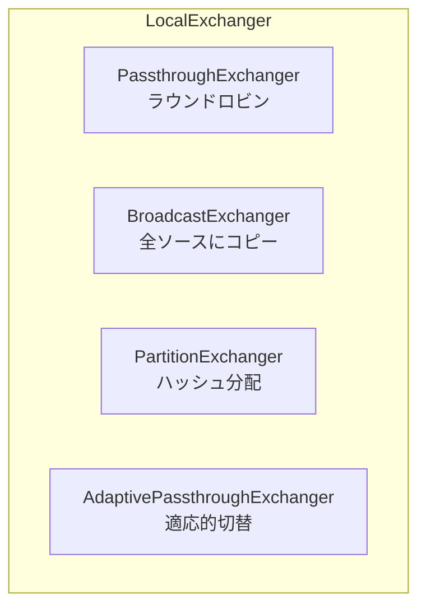

# 第13章 Aggregate, Sort, Exchange

> **本章で読むソース**
>
> - [`be/src/exec/aggregator.h`](https://github.com/StarRocks/starrocks/blob/4.1.1/be/src/exec/aggregator.h)
> - [`be/src/exec/pipeline/aggregate/aggregate_blocking_sink_operator.h`](https://github.com/StarRocks/starrocks/blob/4.1.1/be/src/exec/pipeline/aggregate/aggregate_blocking_sink_operator.h)
> - [`be/src/exec/pipeline/aggregate/aggregate_blocking_source_operator.h`](https://github.com/StarRocks/starrocks/blob/4.1.1/be/src/exec/pipeline/aggregate/aggregate_blocking_source_operator.h)
> - [`be/src/exec/pipeline/aggregate/aggregate_streaming_sink_operator.h`](https://github.com/StarRocks/starrocks/blob/4.1.1/be/src/exec/pipeline/aggregate/aggregate_streaming_sink_operator.h)
> - [`be/src/exec/pipeline/aggregate/aggregate_streaming_sink_operator.cpp`](https://github.com/StarRocks/starrocks/blob/4.1.1/be/src/exec/pipeline/aggregate/aggregate_streaming_sink_operator.cpp)
> - [`be/src/exec/pipeline/aggregate/aggregate_blocking_sink_operator.cpp`](https://github.com/StarRocks/starrocks/blob/4.1.1/be/src/exec/pipeline/aggregate/aggregate_blocking_sink_operator.cpp)
> - [`be/src/exec/pipeline/aggregate/sorted_aggregate_streaming_sink_operator.h`](https://github.com/StarRocks/starrocks/blob/4.1.1/be/src/exec/pipeline/aggregate/sorted_aggregate_streaming_sink_operator.h)
> - [`be/src/exec/pipeline/sort/partition_sort_sink_operator.h`](https://github.com/StarRocks/starrocks/blob/4.1.1/be/src/exec/pipeline/sort/partition_sort_sink_operator.h)
> - [`be/src/exec/pipeline/sort/local_merge_sort_source_operator.h`](https://github.com/StarRocks/starrocks/blob/4.1.1/be/src/exec/pipeline/sort/local_merge_sort_source_operator.h)
> - [`be/src/exec/pipeline/sort/sort_context.h`](https://github.com/StarRocks/starrocks/blob/4.1.1/be/src/exec/pipeline/sort/sort_context.h)
> - [`be/src/exec/sorting/sorting.h`](https://github.com/StarRocks/starrocks/blob/4.1.1/be/src/exec/sorting/sorting.h)
> - [`be/src/exec/pipeline/exchange/exchange_sink_operator.h`](https://github.com/StarRocks/starrocks/blob/4.1.1/be/src/exec/pipeline/exchange/exchange_sink_operator.h)
> - [`be/src/exec/pipeline/exchange/exchange_source_operator.h`](https://github.com/StarRocks/starrocks/blob/4.1.1/be/src/exec/pipeline/exchange/exchange_source_operator.h)
> - [`be/src/exec/pipeline/exchange/local_exchange.h`](https://github.com/StarRocks/starrocks/blob/4.1.1/be/src/exec/pipeline/exchange/local_exchange.h)
> - [`be/src/exec/pipeline/exchange/sink_buffer.h`](https://github.com/StarRocks/starrocks/blob/4.1.1/be/src/exec/pipeline/exchange/sink_buffer.h)
> - [`be/src/runtime/data_stream_sender.h`](https://github.com/StarRocks/starrocks/blob/4.1.1/be/src/runtime/data_stream_sender.h)

## この章の狙い

パイプライン実行エンジンにおいて、Aggregate, Sort, Exchange は SQL 処理の基盤となるオペレーターである。
本章では、集約の2フェーズ実行と Streaming/Blocking の使い分け、ソートのパーティション分割とマージ、ノード間データ転送とノード内データ分配の実装を読む。
最適化の工夫として、Streaming Aggregate による適応的なメモリ削減を取り上げる。

## 前提

第11章で扱ったパイプライン実行モデル(Driver, Operator, Chunk)の基本構造を理解していること。
第9章の Fragment と Exchange の概念(分散プランの分割と接続)を把握していること。

## Aggregate の2フェーズ実行

StarRocks の集約処理は、2フェーズで実行される。
第1フェーズ(ローカル集約)では、各 BE が手元のデータをグループキーごとに集約して中間状態を生成する。
第2フェーズ(グローバル集約)では、同一グループキーのデータを Exchange でシャッフルし、中間状態をマージして最終結果を出す。

この設計により、ネットワーク転送量が削減される。
ローカル集約でデータ量が大幅に減るケース(カーディナリティが低い GROUP BY)では、シャッフル前にデータ量が一桁以上減ることもある。



フェーズの区別はオペレーター生成時に `set_aggr_phase` で設定される。
Blocking Aggregate のコンストラクターでは `AggrPhase2` が設定される。

[`be/src/exec/pipeline/aggregate/aggregate_blocking_sink_operator.h` L36](https://github.com/StarRocks/starrocks/blob/4.1.1/be/src/exec/pipeline/aggregate/aggregate_blocking_sink_operator.h#L36)

```cpp
        _aggregator->set_aggr_phase(AggrPhase2);
```

Streaming Aggregate のコンストラクターでは `AggrPhase1` が設定される。

[`be/src/exec/pipeline/aggregate/aggregate_streaming_sink_operator.h` L34](https://github.com/StarRocks/starrocks/blob/4.1.1/be/src/exec/pipeline/aggregate/aggregate_streaming_sink_operator.h#L34)

```cpp
        _aggregator->set_aggr_phase(AggrPhase1);
```

## Blocking Aggregate

**Blocking Aggregate** は、全入力を受け取り終えてから結果を出力するオペレーターである。
Sink と Source の2つのオペレーターに分かれ、`Aggregator` オブジェクトを共有する。

### Sink 側の処理

`AggregateBlockingSinkOperator::push_chunk` では、入力 Chunk のグループキー式を評価し、ハッシュマップへの挿入と集約関数の状態更新を行う。

[`be/src/exec/pipeline/aggregate/aggregate_blocking_sink_operator.cpp` L101-L136](https://github.com/StarRocks/starrocks/blob/4.1.1/be/src/exec/pipeline/aggregate/aggregate_blocking_sink_operator.cpp#L101-L136)

```cpp
Status AggregateBlockingSinkOperator::push_chunk(RuntimeState* state, const ChunkPtr& chunk) {
    RETURN_IF_ERROR(_aggregator->evaluate_groupby_exprs(chunk.get()));

    const auto chunk_size = chunk->num_rows();
    // ... (中略) ...
    // try to build hash table if has group by keys
    if (!_aggregator->is_none_group_by_exprs()) {
        _aggregator->build_hash_map(chunk_size, _shared_limit_countdown, _agg_group_by_with_limit);
        _aggregator->try_convert_to_two_level_map();
    }

    // batch compute aggregate states
    if (_aggregator->is_none_group_by_exprs()) {
        RETURN_IF_ERROR(_aggregator->compute_single_agg_state(chunk.get(), chunk_size));
    } else {
        // ... (中略) ...
                RETURN_IF_ERROR(_aggregator->compute_batch_agg_states(chunk.get(), chunk_size));
            }
    // ...
        }

```

処理の流れは3段階である。
まず `evaluate_groupby_exprs` でグループキー列を評価する。
次に `build_hash_map` でキーをハッシュマップに挿入し、各行の集約状態ポインターを確保する。
最後に `compute_batch_agg_states` で各行の集約関数を更新する。

ハッシュマップのサイズが大きくなると `try_convert_to_two_level_map` が呼ばれ、単一レベルのハッシュマップを2レベルハッシュマップに変換する。
2レベル構造は大規模データセットでのキャッシュ効率を改善する。

### Source 側の処理

`AggregateBlockingSourceOperator` は、Sink の完了後にハッシュマップを走査して結果 Chunk を出力する。
Sink と Source で同一の `Aggregator` を参照カウントで共有しており、`sink_complete` が呼ばれるまで Source は出力を行わない。

[`be/src/exec/pipeline/aggregate/aggregate_blocking_source_operator.h` L47-L53](https://github.com/StarRocks/starrocks/blob/4.1.1/be/src/exec/pipeline/aggregate/aggregate_blocking_source_operator.h#L47-L53)

```cpp
protected:
    // It is used to perform aggregation algorithms shared by
    // AggregateBlockingSinkOperator. It is
    // - prepared at SinkOperator::prepare(),
    // - reffed at constructor() of both sink and source operator,
    // - unreffed at close() of both sink and source operator.
    AggregatorPtr _aggregator = nullptr;
```

### GROUP BY with LIMIT の最適化

Blocking Aggregate には、GROUP BY と LIMIT が同時に指定されている場合の最適化がある。
HAVING 句がなく `AggrPhase2` であるとき、`_agg_group_by_with_limit` フラグが立つ。

[`be/src/exec/pipeline/aggregate/aggregate_blocking_sink_operator.cpp` L42-L46](https://github.com/StarRocks/starrocks/blob/4.1.1/be/src/exec/pipeline/aggregate/aggregate_blocking_sink_operator.cpp#L42-L46)

```cpp
    _agg_group_by_with_limit = (!_aggregator->is_none_group_by_exprs() &&     // has group by keys
                                _aggregator->limit() != -1 &&                 // has limit
                                _aggregator->conjunct_ctxs().empty() &&       // no 'having' clause
                                _aggregator->get_aggr_phase() == AggrPhase2); // phase 2, keep it to make things safe
    return Status::OK();
```

このフラグが有効な場合、`_shared_limit_countdown` により並列に動作する複数の Sink オペレーター間で共有のカウントダウンを行う。
LIMIT 数に達した後は新規グループの挿入をスキップし、既存グループのみを更新する。

## Streaming Aggregate

**Streaming Aggregate** は、入力をすべて蓄積せずに中間結果を逐次出力するオペレーターである。
第1フェーズのローカル集約で使用され、ハッシュマップの肥大化を防ぐ。

### 事前集約モードの選択

`push_chunk` では `TStreamingPreaggregationMode` に応じて処理を分岐する。

[`be/src/exec/pipeline/aggregate/aggregate_streaming_sink_operator.cpp` L80-L102](https://github.com/StarRocks/starrocks/blob/4.1.1/be/src/exec/pipeline/aggregate/aggregate_streaming_sink_operator.cpp#L80-L102)

```cpp
Status AggregateStreamingSinkOperator::push_chunk(RuntimeState* state, const ChunkPtr& chunk) {
    // ... (中略) ...
    RETURN_IF_ERROR(_aggregator->evaluate_groupby_exprs(chunk.get()));
    if (_aggregator->streaming_preaggregation_mode() == TStreamingPreaggregationMode::FORCE_STREAMING) {
        RETURN_IF_ERROR(_push_chunk_by_force_streaming(chunk));
    } else if (_aggregator->streaming_preaggregation_mode() == TStreamingPreaggregationMode::FORCE_PREAGGREGATION) {
        RETURN_IF_ERROR(_push_chunk_by_force_preaggregation(state, chunk, chunk_size));
    } else if (_aggregator->streaming_preaggregation_mode() == TStreamingPreaggregationMode::LIMITED_MEM) {
        RETURN_IF_ERROR(_push_chunk_by_limited_memory(state, chunk, chunk_size));
    } else {
        RETURN_IF_ERROR(_push_chunk_by_auto(state, chunk, chunk_size));
    }
    // ...
}

```

4つのモードがある。

- **FORCE_STREAMING**: ハッシュマップを使わず、入力をそのまま中間形式に変換して出力する
- **FORCE_PREAGGREGATION**: 常にハッシュマップで事前集約を行う(Blocking Aggregate と同等の動作)
- **LIMITED_MEM**: メモリ上限に達するまでは AUTO モードで動作し、上限超過後はストリーミングに切り替える
- **AUTO**: 実行時の集約効率(reduction rate)に応じて適応的にモードを切り替える

### AUTO モードの状態機械

AUTO モードは `AggrAutoState` で定義される6状態の状態機械で動作する。

[`be/src/exec/aggregator.h` L166](https://github.com/StarRocks/starrocks/blob/4.1.1/be/src/exec/aggregator.h#L166)

```cpp
enum AggrAutoState { INIT_PREAGG = 0, ADJUST, PASS_THROUGH, FORCE_PREAGG, PREAGG, SELECTIVE_PREAGG };
```



初期状態 `INIT_PREAGG` では、通常の事前集約を行う。
ハッシュテーブルの拡張が不要か、集約率に基づき拡張が妥当な間はこの状態にとどまる。
拡張が不可になると `ADJUST` 状態に遷移する。

`ADJUST` 状態では `build_hash_map_with_selection` を呼び出し、各行がハッシュテーブルに存在するかを判定する。
ヒット率に基づいて3方向に分岐する。

- 連続で低集約率(`LowReduction = 0.2`)を観測すると `PASS_THROUGH` に遷移する
- 連続で高集約率(`HighReduction = 0.9`)を観測すると `PREAGG` に遷移する
- どちらでもない場合は `SELECTIVE_PREAGG` に遷移する

`SELECTIVE_PREAGG` は、ハッシュテーブルに存在する行のみ集約し、存在しない行はストリーミング出力する。

[`be/src/exec/pipeline/aggregate/aggregate_streaming_sink_operator.cpp` L173-L211](https://github.com/StarRocks/starrocks/blob/4.1.1/be/src/exec/pipeline/aggregate/aggregate_streaming_sink_operator.cpp#L173-L211)

```cpp
Status AggregateStreamingSinkOperator::_push_chunk_by_selective_preaggregation(const ChunkPtr& chunk,
                                                                               const size_t chunk_size,
                                                                               bool need_build) {
    // ... (中略) ...
    size_t zero_count = SIMD::count_zero(_aggregator->streaming_selection());
    // very poor aggregation
    if (zero_count == 0) {
        // ... (中略) ...
    }
    // very high aggregation
    else if (zero_count == _aggregator->streaming_selection().size()) {
        // ... (中略) ...
    } else {
        // middle cases, first aggregate locally and output by stream
        // ... (中略) ...
    }
    // ... (中略) ...
}

```

この判定には SIMD 命令(`SIMD::count_zero`)が利用されており、selection ビットマスクの集計を高速に行う。

### Streaming Aggregate のメモリ削減効果(最適化の工夫)

Streaming Aggregate の設計目的は、第1フェーズのハッシュテーブルがメモリを際限なく消費する事態を防ぐことにある。

Blocking Aggregate をそのまま第1フェーズに使うと、カーディナリティが高い GROUP BY ではハッシュテーブルがデータ量に比例して膨張する。
Streaming Aggregate は、ハッシュテーブルが一定サイズに達した時点で新規キーの挿入を止め、未集約の行をそのまま下流に流す。
この結果、ハッシュテーブルのサイズは `MaxHtSize`(64MB)以下に抑えられる。

[`be/src/exec/aggregator.h` L175](https://github.com/StarRocks/starrocks/blob/4.1.1/be/src/exec/aggregator.h#L175)

```cpp
    static constexpr size_t MaxHtSize = 64 * 1024 * 1024; // 64 MB
```

さらに、`PASS_THROUGH` 状態から `FORCE_PREAGG` への遷移は、既存のハッシュテーブルを「鮮度更新(freshen)」する役割がある。
新しい入力行でハッシュテーブルの内容を更新することで、古いグループの中間状態が最新のデータを反映し続ける。

`LIMITED_MEM` モードでは、`streaming_agg_limited_memory_size` の設定値をメモリ上限として使用し、上限到達後はハッシュテーブルの全状態をストリーミング出力する。

[`be/src/exec/pipeline/aggregate/aggregate_streaming_sink_operator.cpp` L362-L372](https://github.com/StarRocks/starrocks/blob/4.1.1/be/src/exec/pipeline/aggregate/aggregate_streaming_sink_operator.cpp#L362-L372)

```cpp
Status AggregateStreamingSinkOperator::_push_chunk_by_limited_memory(RuntimeState* state, const ChunkPtr& chunk,
                                                                     const size_t chunk_size) {
    if (_limited_mem_state.has_limited(*_aggregator)) {
        RETURN_IF_ERROR(_push_chunk_by_force_streaming(chunk));
        auto notify = _aggregator->defer_notify_source();
        _aggregator->set_streaming_all_states(true);
    } else {
        RETURN_IF_ERROR(_push_chunk_by_auto(state, chunk, chunk_size));
    }
    return Status::OK();
}
```

## Aggregator の内部構造

`Aggregator` クラスは Blocking/Streaming の両オペレーターから共有される、集約ロジックの本体である。
ハッシュマップ、集約関数の状態、グループキーの評価式をまとめて管理する。

### ハッシュマップと集約状態

グループキーとしてハッシュマップ(`AggHashMapVariant`)を使用する場合と、GROUP BY のみで集約関数がない場合のハッシュセット(`AggHashSetVariant`)を使用する場合がある。

[`be/src/exec/aggregator.h` L286-L290](https://github.com/StarRocks/starrocks/blob/4.1.1/be/src/exec/aggregator.h#L286-L290)

```cpp

    bool is_hash_set() const { return _is_only_group_by_columns; }
    const int64_t hash_map_memory_usage() const { return _hash_map_variant.reserved_memory_usage(mem_pool()); }
    const int64_t hash_set_memory_usage() const { return _hash_set_variant.reserved_memory_usage(mem_pool()); }
    const int64_t agg_state_memory_usage() const { return _agg_state_mem_usage; }
```

集約関数の状態は `HashTableKeyAllocator` がバッチ単位(1024エントリー)で確保する。
メモリアラインメントは16バイト境界で行われ、SIMD 演算の効率を確保する。

[`be/src/exec/aggregator.h` L64-L102](https://github.com/StarRocks/starrocks/blob/4.1.1/be/src/exec/aggregator.h#L64-L102)

```cpp
struct HashTableKeyAllocator {
    // number of states allocated consecutively in a single alloc
    static auto constexpr alloc_batch_size = 1024;
    // memory aligned when allocate
    static size_t constexpr aligned = 16;

    int aggregate_key_size = 0;
    std::vector<std::pair<void*, int>> vecs;
    MemPool* pool = nullptr;
    // ... (中略) ...
    AggDataPtr allocate() {
        if (vecs.empty() || vecs.back().second == alloc_batch_size) {
            uint8_t* mem = pool->allocate_aligned(alloc_batch_size * aggregate_key_size, aligned);
            // ...
            vecs.emplace_back(mem, 0);
        }
        return static_cast<AggDataPtr>(vecs.back().first) + aggregate_key_size * vecs.back().second++;
    }
    // ...
};

```

バッチ確保により、行ごとにメモリアロケーターを呼び出すオーバーヘッドを回避している。

### Chunk バッファー

Streaming Aggregate では、Sink と Source の間に `LimitedPipelineChunkBuffer` を介してデータを受け渡す。
`need_input` の判定で `is_chunk_buffer_full` をチェックしており、バッファーが満杯になると Sink は入力の受付を一時停止する。

[`be/src/exec/pipeline/aggregate/aggregate_streaming_sink_operator.h` L40-L42](https://github.com/StarRocks/starrocks/blob/4.1.1/be/src/exec/pipeline/aggregate/aggregate_streaming_sink_operator.h#L40-L42)

```cpp
    bool need_input() const override {
        return !is_finished() && !_aggregator->is_streaming_all_states() && !_aggregator->is_chunk_buffer_full();
    }
```

## Sort のパイプライン実装

### PartitionSortSinkOperator

**PartitionSortSinkOperator** は、パイプラインの並列度(DOP)に応じて複数インスタンスが生成され、各インスタンスが担当するデータのパーティションをローカルにソートする。

[`be/src/exec/pipeline/sort/partition_sort_sink_operator.h` L42-L45](https://github.com/StarRocks/starrocks/blob/4.1.1/be/src/exec/pipeline/sort/partition_sort_sink_operator.h#L42-L45)

```cpp
 * Partiton Sort Operator is almost like Sort Operator,
 * except that it is used to sort for partial data,
 * thus through multiple instances to provide data parallelism.
 */
```

各インスタンスは `ChunksSorter` と `SortContext` を保持する。
`ChunksSorter` がパーティション内のソート処理を担い、`SortContext` が複数パーティションの結果を集約する役割を持つ。

`set_finishing` が呼ばれると、`SortContext::finish_partition` を通じてソート完了を通知する。
全パーティションの完了を `_num_partition_finished` のアトミックカウンターで追跡する。

### LocalMergeSortSourceOperator

**LocalMergeSortSourceOperator** は、複数の `PartitionSortSinkOperator` が生成したソート済みデータをマージして全体順序を保ったストリームを出力する。
単一インスタンスで動作する。

[`be/src/exec/pipeline/sort/local_merge_sort_source_operator.h` L28-L31](https://github.com/StarRocks/starrocks/blob/4.1.1/be/src/exec/pipeline/sort/local_merge_sort_source_operator.h#L28-L31)

```cpp
 * LocalMergeSortSourceOperator is used to merge multiple sorted datas from partion sort sink operator.
 * It is one instance and Execute in single threaded mode,
 * It completely depends on SortContext with a heap to Dynamically filter out the smallest or largest data.
 */
```

`pull_chunk` は `SortContext::pull_chunk` に委譲される。

[`be/src/exec/pipeline/sort/local_merge_sort_source_operator.cpp` L34-L36](https://github.com/StarRocks/starrocks/blob/4.1.1/be/src/exec/pipeline/sort/local_merge_sort_source_operator.cpp#L34-L36)

```cpp
StatusOr<ChunkPtr> LocalMergeSortSourceOperator::pull_chunk(RuntimeState* state) {
    return _sort_context->pull_chunk();
}
```

`has_output` は、全パーティションのソートが完了し、かつまだ出力すべきデータが残っている場合に true を返す。

[`be/src/exec/pipeline/sort/local_merge_sort_source_operator.cpp` L49-L52](https://github.com/StarRocks/starrocks/blob/4.1.1/be/src/exec/pipeline/sort/local_merge_sort_source_operator.cpp#L49-L52)

```cpp
bool LocalMergeSortSourceOperator::has_output() const {
    return _sort_context->is_partition_sort_finished() && !_sort_context->is_output_finished() &&
           _sort_context->is_partition_ready();
}
```

### SortContext のマージ機構

`SortContext` は各パーティションの `ChunksSorter` をカーソル(`SimpleChunkSortCursor`)で参照し、`MergeCursorsCascade` によるヒープベースのマージを行う。

[`be/src/exec/pipeline/sort/sort_context.h` L100-L104](https://github.com/StarRocks/starrocks/blob/4.1.1/be/src/exec/pipeline/sort/sort_context.h#L100-L104)

```cpp

    std::vector<std::shared_ptr<ChunksSorter>> _chunks_sorter_partitions; // Partial sorters
    std::vector<std::unique_ptr<SimpleChunkSortCursor>> _partial_cursors;
    MergeCursorsCascade _merger;
    ChunkSlice _current_chunk;
```

`_is_merging` フラグが true の場合、全パーティションの結果を1つのマージストリームに統合する。
false の場合は各パーティションの出力を独立して扱い、Analytic 関数の PARTITION BY のようなケースで使用される。



### ソートユーティリティ

`sorting.h` は列指向のソートアルゴリズムを提供する。
`sort_and_tie_column` は1列ずつインクリメンタルにソートし、同値の行に「tie(同順位)」マークを付けて次の列のソートに引き継ぐ。

[`be/src/exec/sorting/sorting.h` L37-L39](https://github.com/StarRocks/starrocks/blob/4.1.1/be/src/exec/sorting/sorting.h#L37-L39)

```cpp
Status sort_and_tie_column(const std::atomic<bool>& cancel, ColumnPtr& column, const SortDesc& sort_desc,
                           SmallPermutation& permutation, Tie& tie, std::pair<int, int> range, const bool build_tie,
                           const SortDescs* sort_descs = nullptr);
```

この列単位のソートは、行単位の比較に対してキャッシュ効率がよい。
列指向ストレージのデータをそのまま処理でき、行をまたいだメモリアクセスが発生しないためである。

`SortDesc` はソート方向と NULL の扱いを指定する。

[`be/src/exec/sorting/sorting.h` L93-L108](https://github.com/StarRocks/starrocks/blob/4.1.1/be/src/exec/sorting/sorting.h#L93-L108)

```cpp
struct SortDesc {
    int sort_order;
    int null_first;

    SortDesc() = default;
    SortDesc(bool is_asc, bool inull_first) {
        sort_order = is_asc ? 1 : -1;
        null_first = (inull_first ? -1 : 1) * sort_order;
    }
    SortDesc(int order, int null) : sort_order(order), null_first(null) {}

    // Discard sort_order effect on the null_first
    int nan_direction() const { return null_first * sort_order; }
    bool is_null_first() const { return (null_first * sort_order) == -1; }
    bool asc_order() const { return sort_order == 1; }
};
```

## Exchange の実装

### リモート Exchange のデータフロー

リモート Exchange は、Fragment 間のデータ転送を担う。
送信側の `ExchangeSinkOperator` が Chunk をシリアライズして BRPC で送出し、受信側の `ExchangeSourceOperator` が `DataStreamRecvr` を通じてデータを受け取る。



### ExchangeSinkOperator の分配方式

`push_chunk` では `TPartitionType` に応じて3つの分配方式が使い分けられる。

[`be/src/exec/pipeline/exchange/exchange_sink_operator.cpp` L506-L662](https://github.com/StarRocks/starrocks/blob/4.1.1/be/src/exec/pipeline/exchange/exchange_sink_operator.cpp#L506-L662)

```cpp
Status ExchangeSinkOperator::push_chunk(RuntimeState* state, const ChunkPtr& chunk) {
    // ... (中略) ...
    if (_part_type == TPartitionType::UNPARTITIONED || _num_shuffles == 1) {
        // ... (中略) ...
    } else if (_part_type == TPartitionType::RANDOM) {
        // ... (中略) ...
    } else if (_part_type == TPartitionType::HASH_PARTITIONED ||
               _part_type == TPartitionType::BUCKET_SHUFFLE_HASH_PARTITIONED) {
        // ... (中略) ...
    }
    return Status::OK();
}

```

**UNPARTITIONED(Broadcast)** では、Chunk を1回だけシリアライズし、全チャネルに同一データを送信する。
pass-through が可能なローカルチャネルには、シリアライズなしで直接 Chunk を渡す。

**RANDOM** では、ラウンドロビンでチャネルを選択する。
ローカルチャネルがある場合はそちらを優先する。

**HASH_PARTITIONED** では、パーティション式を評価してハッシュ値を計算し、行ごとにチャネルを決定する。
ハッシュ関数は `fnv_hash`(デフォルト)と `xxh3_hash`(バージョン1)の2種類がある。
行インデックスをチャネルごとに整列し、`add_rows_selective` でチャネルごとの Chunk にコピーする。

[`be/src/exec/pipeline/exchange/exchange_sink_operator.cpp` L583-L658](https://github.com/StarRocks/starrocks/blob/4.1.1/be/src/exec/pipeline/exchange/exchange_sink_operator.cpp#L583-L658)

```cpp
    } else if (_part_type == TPartitionType::HASH_PARTITIONED ||
               _part_type == TPartitionType::BUCKET_SHUFFLE_HASH_PARTITIONED) {
        // hash-partition batch's rows across channels
        {
            SCOPED_TIMER(_shuffle_hash_timer);
            for (size_t i = 0; i < _partitions_columns.size(); ++i) {
                ASSIGN_OR_RETURN(_partitions_columns[i], _partition_expr_ctxs[i]->evaluate(chunk.get()))
                DCHECK(_partitions_columns[i] != nullptr);
            }

            // Compute hash for each partition column
            if (_part_type == TPartitionType::HASH_PARTITIONED) {
                if (_exchange_hash_function_version == 1) {
                    // Use xxh3_hash for better performance
                    _hash_values.assign(num_rows, HashUtil::XXH3_SEED_32);
                    for (const ColumnPtr& column : _partitions_columns) {
                        column->xxh3_hash(&_hash_values[0], 0, num_rows);
                    }
                } else {
                    // Default: use fnv_hash for backward compatibility
                    _hash_values.assign(num_rows, HashUtil::FNV_SEED);
                    for (const ColumnPtr& column : _partitions_columns) {
                        column->fnv_hash(&_hash_values[0], 0, num_rows);
                    }
                }
            } else if (_bucket_properties.empty()) {
                // The data distribution was calculated using CRC32_HASH,
                // and bucket shuffle need to use the same hash function when sending data
                _hash_values.assign(num_rows, 0);
                for (const ColumnPtr& column : _partitions_columns) {
                    column->crc32_hash(&_hash_values[0], 0, num_rows);
                }
            } else {
                _calc_hash_values_and_bucket_ids();
            }

            // Compute row indexes for each channel's each shuffle
            _channel_row_idx_start_points.assign(_num_shuffles + 1, 0);
            _shuffler->exchange_shuffle(_shuffle_channel_ids, _hash_values, _bucket_ids, num_rows);

            for (size_t i = 0; i < num_rows; ++i) {
                _channel_row_idx_start_points[_shuffle_channel_ids[i]]++;
            }
            // NOTE:
            // we make the last item equal with number of rows of this chunk
            for (int32_t i = 1; i <= _num_shuffles; ++i) {
                _channel_row_idx_start_points[i] += _channel_row_idx_start_points[i - 1];
            }

            for (int32_t i = num_rows - 1; i >= 0; --i) {
                _row_indexes[_channel_row_idx_start_points[_shuffle_channel_ids[i]] - 1] = i;
                _channel_row_idx_start_points[_shuffle_channel_ids[i]]--;
            }
        }

        for (int32_t channel_id : _channel_indices) {
            if (_channels[channel_id]->get_fragment_instance_id().lo == -1) {
                // dest bucket is no used, continue
                continue;
            }

            for (int32_t i = 0; i < _num_shuffles_per_channel; ++i) {
                int shuffle_id = channel_id * _num_shuffles_per_channel + i;
                int driver_sequence = _driver_sequence_per_shuffle[shuffle_id];

                size_t from = _channel_row_idx_start_points[shuffle_id];
                size_t size = _channel_row_idx_start_points[shuffle_id + 1] - from;
                if (size == 0) {
                    // no data for this channel continue;
                    continue;
                }

                RETURN_IF_ERROR(_channels[channel_id]->add_rows_selective(send_chunk, driver_sequence,
                                                                          _row_indexes.data(), from, size, state));
            }
        }
```

### Pipeline Level Shuffle

`ExchangeSinkOperator` はパイプラインレベルシャッフルをサポートする。
受信側のパイプラインが `ExchangeSourceOperator` から `AggregateBlockingSinkOperator`(GROUP BY あり)の構成である場合、送信側でさらに受信側の DOP に応じた細粒度のシャッフルを行う。
これにより、受信側の各ドライバーが担当するグループキーの範囲が重複しにくくなり、グローバル集約の効率が向上する。

[`be/src/exec/pipeline/exchange/exchange_sink_operator.h` L113-L116](https://github.com/StarRocks/starrocks/blob/4.1.1/be/src/exec/pipeline/exchange/exchange_sink_operator.h#L113-L116)

```cpp
    const std::vector<TPlanFragmentDestination> _destinations;
    // If the pipeline of dest be is ExchangeSourceOperator -> AggregateBlockingSinkOperator(with group by)
    // then we shuffle for different parallelism at sender side(ExchangeSinkOperator) if _is_pipeline_level_shuffle is true
    bool _is_pipeline_level_shuffle;
```

### SinkBuffer と非同期送信

`SinkBuffer` は複数の `ExchangeSinkOperator` から共有され、BRPC の非同期送信を管理する。
送信先ごとにキューを持ち、シーケンス番号で応答の順序を管理する。

[`be/src/exec/pipeline/exchange/sink_buffer.h` L155-L183](https://github.com/StarRocks/starrocks/blob/4.1.1/be/src/exec/pipeline/exchange/sink_buffer.h#L155-L183)

```cpp
    struct SinkContext {
        int64_t num_sinker;
        int64_t request_seq;
        // ... (中略) ...
        int64_t max_continuous_acked_seqs;
        std::unordered_set<int64_t> discontinuous_acked_seqs;
        PUniqueId finst_id;
        std::queue<TransmitChunkInfo, std::list<TransmitChunkInfo>> buffer;
        // ... (中略) ...
        std::atomic_size_t num_in_flight_rpcs;
        TimeTrace network_time;
        // ...
    };

```

応答が順序通りに返らない場合(例: リクエスト 1, 3, 2 の順に応答)、`_max_continuous_acked_seqs` と `_discontinuous_acked_seqs` で連続確認済みシーケンスを追跡する。
この仕組みにより、キューの解放とフロー制御を正しく行える。

### ExchangeSourceOperator

`ExchangeSourceOperator` は `DataStreamRecvr` を通じてリモートからのデータを受信する。
`pull_chunk` で受信済みの Chunk を取得する。

[`be/src/exec/pipeline/exchange/exchange_source_operator.h` L25-L50](https://github.com/StarRocks/starrocks/blob/4.1.1/be/src/exec/pipeline/exchange/exchange_source_operator.h#L25-L50)

```cpp
class ExchangeSourceOperator : public SourceOperator {
public:
    ExchangeSourceOperator(OperatorFactory* factory, int32_t id, int32_t plan_node_id, int32_t driver_sequence)
            : SourceOperator(factory, id, "exchange_source", plan_node_id, false, driver_sequence) {}

    // ... (中略) ...
    StatusOr<ChunkPtr> pull_chunk(RuntimeState* state) override;

private:
    std::shared_ptr<DataStreamRecvr> _stream_recvr = nullptr;
    std::atomic<bool> _is_finishing = false;
};

```

`DataStreamRecvr` は `DataStreamMgr` で管理されており、Fragment Instance ID と宛先ノード ID の組み合わせで一意に特定される。

### Pass-Through 最適化

送信先が同一 BE 上にある場合、シリアライズと BRPC を経由せずに Chunk を直接渡す pass-through 最適化が適用される。
`Channel::_check_use_pass_through` でホスト名とポートを比較し、ローカルであれば pass-through を有効にする。

[`be/src/exec/pipeline/exchange/exchange_sink_operator.cpp` L149-L154](https://github.com/StarRocks/starrocks/blob/4.1.1/be/src/exec/pipeline/exchange/exchange_sink_operator.cpp#L149-L154)

```cpp
bool ExchangeSinkOperator::Channel::_check_use_pass_through() {
    if (!_enable_exchange_pass_through) {
        return false;
    }
    return is_local();
}
```

## LocalExchange によるパイプライン間のデータ分配

**LocalExchange** は、同一 BE 内のパイプライン間でデータを再分配する仕組みである。
リモート Exchange と異なりシリアライズは不要で、Chunk オブジェクトを直接受け渡す。
`LocalExchanger` 基底クラスから派生した複数の Exchanger が分配方式を実装する。

[`be/src/exec/pipeline/exchange/local_exchange.h` L110-L116](https://github.com/StarRocks/starrocks/blob/4.1.1/be/src/exec/pipeline/exchange/local_exchange.h#L110-L116)

```cpp
class LocalExchanger {
public:
    explicit LocalExchanger(std::string name, std::shared_ptr<ChunkBufferMemoryManager> memory_manager,
                            LocalExchangeSourceOperatorFactory* source)
            : _name(std::move(name)), _memory_manager(std::move(memory_manager)), _source(source) {
        source->set_exchanger(this);
    }
```

### 分配方式



**PassthroughExchanger** は、入力 Chunk をラウンドロビンでソースオペレーターに配る。

[`be/src/exec/pipeline/exchange/local_exchange.cpp` L411-L417](https://github.com/StarRocks/starrocks/blob/4.1.1/be/src/exec/pipeline/exchange/local_exchange.cpp#L411-L417)

```cpp
Status PassthroughExchanger::accept(const ChunkPtr& chunk, const int32_t sink_driver_sequence) {
    size_t sources_num = _source->get_sources().size();
    if (sources_num == 1) {
        _source->get_sources()[0]->add_chunk(chunk);
    } else {
        _source->get_sources()[(_next_accept_source++) % sources_num]->add_chunk(chunk);
    }
```

**BroadcastExchanger** は、全ソースオペレーターに同一の Chunk を配る。

[`be/src/exec/pipeline/exchange/local_exchange.cpp` L404-L409](https://github.com/StarRocks/starrocks/blob/4.1.1/be/src/exec/pipeline/exchange/local_exchange.cpp#L404-L409)

```cpp
Status BroadcastExchanger::accept(const ChunkPtr& chunk, const int32_t sink_driver_sequence) {
    for (auto* source : _source->get_sources()) {
        source->add_chunk(chunk);
    }
    return Status::OK();
}
```

**PartitionExchanger** は、パーティション式を評価してハッシュ値を計算し、行単位でソースオペレーターに振り分ける。
`ShufflePartitioner` が `partition_chunk` でハッシュ分配のインデックスを計算し、`send_chunk` で各ソースに行を渡す。

[`be/src/exec/pipeline/exchange/local_exchange.cpp` L190-L208](https://github.com/StarRocks/starrocks/blob/4.1.1/be/src/exec/pipeline/exchange/local_exchange.cpp#L190-L208)

```cpp
Status PartitionExchanger::accept(const ChunkPtr& chunk, const int32_t sink_driver_sequence) {
    // ... (中略) ...
    size_t num_partitions = _source->get_sources().size();
    auto& partitioner = _partitioners[sink_driver_sequence];
    std::shared_ptr<std::vector<uint32_t>> partition_row_indexes = std::make_shared<std::vector<uint32_t>>(num_rows);
    RETURN_IF_ERROR(partitioner->partition_chunk(chunk, num_partitions, *partition_row_indexes));
    RETURN_IF_ERROR(partitioner->send_chunk(chunk, std::move(partition_row_indexes)));
    return Status::OK();
}

```

**AdaptivePassthroughExchanger** は、受信した Chunk の総数がソース数を超えるまでは行単位のランダム分配を行い、超えた後は Chunk 単位の passthrough に切り替える。
少量データでは行単位の分散で負荷を均等にし、大量データでは Chunk コピーのオーバーヘッドを削減する。

### メモリ管理

`LocalExchanger` は `ChunkBufferMemoryManager` を共有し、バッファーの合計メモリ使用量を監視する。
`need_input` は `memory_manager` の状態を参照して、バッファーが満杯であれば Sink の入力受付を停止する。

[`be/src/exec/pipeline/exchange/local_exchange.h` L161-L163](https://github.com/StarRocks/starrocks/blob/4.1.1/be/src/exec/pipeline/exchange/local_exchange.h#L161-L163)

```cpp
    size_t get_memory_usage() const { return _memory_manager->get_memory_usage(); }
    size_t get_peak_memory_usage() const { return _memory_manager->get_peak_memory_usage(); }
    size_t get_peak_num_rows() const { return _memory_manager->get_peak_num_rows(); }
```

## まとめ

Aggregate, Sort, Exchange の3オペレーター群は、SQL の GROUP BY, ORDER BY, 分散シャッフルをパイプライン実行モデル上で実現する。

- Aggregate は2フェーズ(ローカル集約 + グローバル集約)で処理し、Streaming Aggregate が適応的にメモリ使用量を制御する
- Sort は PartitionSortSink で並列ソートし、LocalMergeSortSource でヒープマージによる全体順序を生成する
- Exchange はリモート(BRPC 経由)とローカル(Chunk 直接受け渡し)の2層があり、Broadcast, Hash Partition, Passthrough の分配方式を提供する
- Streaming Aggregate の AUTO モードは6状態の状態機械で集約効率を監視し、ハッシュテーブルのサイズを 64MB 以下に抑える

## 関連する章

- 第9章: 分散プランと Fragment(Exchange の設計意図と Fragment 分割)
- 第11章: パイプライン実行エンジン(Operator, Driver の基本モデル)
- 第12章: Scan と I/O(Aggregate の入力となるデータの読み出し)
