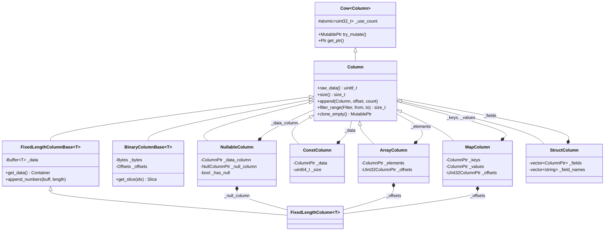
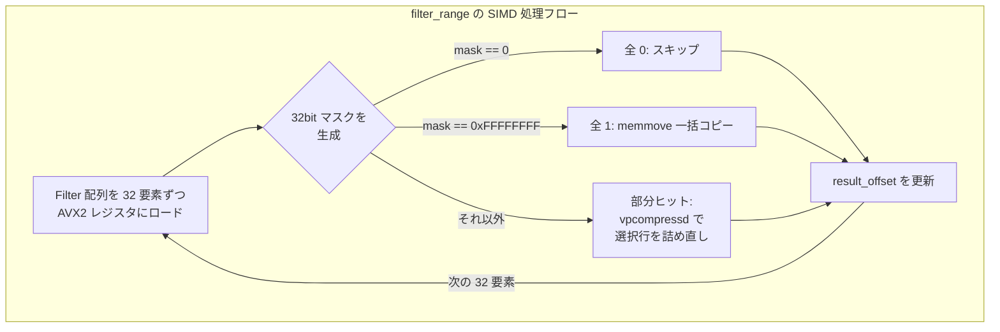

# 第14章 Column と Chunk

> **本章で読むソース**
>
> - [`be/src/column/column.h`](https://github.com/StarRocks/starrocks/blob/4.1.1/be/src/column/column.h)
> - [`be/src/column/fixed_length_column.h`](https://github.com/StarRocks/starrocks/blob/4.1.1/be/src/column/fixed_length_column.h)
> - [`be/src/column/fixed_length_column_base.h`](https://github.com/StarRocks/starrocks/blob/4.1.1/be/src/column/fixed_length_column_base.h)
> - [`be/src/column/fixed_length_column_base.cpp`](https://github.com/StarRocks/starrocks/blob/4.1.1/be/src/column/fixed_length_column_base.cpp)
> - [`be/src/column/binary_column.h`](https://github.com/StarRocks/starrocks/blob/4.1.1/be/src/column/binary_column.h)
> - [`be/src/column/nullable_column.h`](https://github.com/StarRocks/starrocks/blob/4.1.1/be/src/column/nullable_column.h)
> - [`be/src/column/const_column.h`](https://github.com/StarRocks/starrocks/blob/4.1.1/be/src/column/const_column.h)
> - [`be/src/column/array_column.h`](https://github.com/StarRocks/starrocks/blob/4.1.1/be/src/column/array_column.h)
> - [`be/src/column/map_column.h`](https://github.com/StarRocks/starrocks/blob/4.1.1/be/src/column/map_column.h)
> - [`be/src/column/struct_column.h`](https://github.com/StarRocks/starrocks/blob/4.1.1/be/src/column/struct_column.h)
> - [`be/src/column/chunk.h`](https://github.com/StarRocks/starrocks/blob/4.1.1/be/src/column/chunk.h)
> - [`be/src/column/chunk.cpp`](https://github.com/StarRocks/starrocks/blob/4.1.1/be/src/column/chunk.cpp)
> - [`be/src/column/schema.h`](https://github.com/StarRocks/starrocks/blob/4.1.1/be/src/column/schema.h)
> - [`be/src/column/datum.h`](https://github.com/StarRocks/starrocks/blob/4.1.1/be/src/column/datum.h)
> - [`be/src/column/vectorized_fwd.h`](https://github.com/StarRocks/starrocks/blob/4.1.1/be/src/column/vectorized_fwd.h)
> - [`be/src/common/cow.h`](https://github.com/StarRocks/starrocks/blob/4.1.1/be/src/common/cow.h)
> - [`be/src/simd/gather.h`](https://github.com/StarRocks/starrocks/blob/4.1.1/be/src/simd/gather.h)
> - [`be/src/column/column_helper.cpp`](https://github.com/StarRocks/starrocks/blob/4.1.1/be/src/column/column_helper.cpp)

## この章の狙い

StarRocks BE の実行エンジンはすべてのデータを **Column** と **Chunk** という2つのデータ構造で運搬する。
Column は1列ぶんのデータを型ごとに特化した配列で保持し、Chunk は複数の Column をまとめて行指向のレコード集合として扱えるようにする。
本章では Column 階層全体の設計と主要な派生型の内部構造を読み、データがメモリ上でどのように配置され、どのような操作で変換されるかを把握する。

## 前提

StarRocks の BE では、パイプライン実行エンジンが Chunk 単位でオペレーター間にデータを受け渡す。
ストレージ層から読み出したデータは Column 形式で Chunk に詰められ、Filter, Join, Aggregate といった各オペレーターで加工される。
Column の設計は Apache ClickHouse のベクトル化エンジンに影響を受けており、列指向の連続メモリ配置と Copy-On-Write(COW)セマンティクスを中心に据えている。

## Copy-On-Write テンプレート

Column 階層を読む前に、その基盤となる `Cow<Column>` テンプレートを理解する必要がある。
`Cow` は ClickHouse と Rust の COW スマートポインタに着想を得たクラスで、Column オブジェクトの共有と変更を安全に管理する。

[`be/src/common/cow.h` L34-L41](https://github.com/StarRocks/starrocks/blob/4.1.1/be/src/common/cow.h#L34-L41)

```cpp
template <typename Derived>
class Cow {
protected:
    virtual ~Cow() = default;

    Cow() : _use_count(0) {}
    Cow(Cow const&) : _use_count(0) {}
    Cow& operator=(Cow const&) { return *this; }

```

`Cow` はアトミックな参照カウント `_use_count` を持ち、3種類のスマートポインタを定義する。

| ポインタ型 | クラス名 | 意味 |
|-----------|---------|------|
| `MutablePtr` | `MutPtr<Derived>` | 書き込み可能。コピー不可、ムーブのみ |
| `Ptr` | `ImmutPtr<Derived>` | 読み取り専用。複数箇所で共有可能 |
| `WrappedPtr` | `ChameleonPtr<Derived>` | const なら Ptr、非 const なら MutablePtr として振る舞う |

変更が必要になったとき、`try_mutate()` が参照カウントを確認する。
カウントが1なら自身をそのまま返し(シャドウクローン)、2以上なら深いコピーを行う。

[`be/src/common/cow.h` L252-L263](https://github.com/StarRocks/starrocks/blob/4.1.1/be/src/common/cow.h#L252-L263)

```cpp
    MutablePtr try_mutate() const {
        uint32_t ref_count = this->use_count();
        // ... (中略) ...
        if (ref_count > 1) {
            return derived()->clone();
        } else {
            return as_mutable_ptr();
        }
    }

```

この仕組みにより、複数のオペレーターが同じ Column を参照している間はコピーが発生せず、書き込みが必要になった時点で初めてコピーが行われる。

## Column 基底クラス

`Column` は `Cow<Column>` を継承し、すべての列型が実装すべきインタフェースを定義する。

[`be/src/column/column.h` L43-L45](https://github.com/StarRocks/starrocks/blob/4.1.1/be/src/column/column.h#L43-L45)

```cpp
class Column : public Cow<Column> {
public:
    friend class Cow<Column>;

```

主要な仮想メソッドは以下の4群に分類できる。

**型判定メソッド群**: `is_nullable()`, `is_numeric()`, `is_binary()`, `is_constant()`, `is_array()`, `is_map()`, `is_struct()` など。
派生型の識別に使う。

**データアクセス群**: `raw_data()` は Column 内部の生バイトポインタを返す。
`size()` は行数、`byte_size()` はメモリ占有量を返す。

**変更操作群**: `append()`, `append_datum()`, `append_selective()`, `resize()`, `filter_range()`, `update_rows()` など。
これらは Column の中身を変更するため、COW の文脈では MutablePtr 経由で呼ぶ必要がある。

**シリアライズ群**: `serialize()`, `deserialize_and_append()`, `serialize_batch()` など。
Shuffle やスピルでのデータ転送に使う。

`filter_range` は述語評価後のフィルタリングに使われる中核的な操作である。
Filter(= `Buffer<uint8_t>`)の各要素が0か1かで、対応する行を残すかどうかを決める。

[`be/src/column/column.h` L352-L356](https://github.com/StarRocks/starrocks/blob/4.1.1/be/src/column/column.h#L352-L356)

```cpp
    inline size_t filter(const Filter& filter) {
        DCHECK_EQ(size(), filter.size());
        return filter_range(filter, 0, filter.size());
    }

```

## FixedLengthColumn: 固定長列

`FixedLengthColumn<T>` は Int, Float, Date, Timestamp などの固定長型を格納する。
内部データは `Buffer<T>`(= `std::vector<T, ColumnAllocator<T>>`)に保持される。

[`be/src/column/fixed_length_column_base.h` L50-L54](https://github.com/StarRocks/starrocks/blob/4.1.1/be/src/column/fixed_length_column_base.h#L50-L54)

```cpp
template <typename T>
class FixedLengthColumnBase : public Column {
public:
    using ValueType = T;
    using Container = Buffer<ValueType>;

```

`vectorized_fwd.h` で具体的な型エイリアスが定義されている。

[`be/src/column/vectorized_fwd.h` L73-L93](https://github.com/StarRocks/starrocks/blob/4.1.1/be/src/column/vectorized_fwd.h#L73-L93)

```cpp
using Int8Column = FixedLengthColumn<int8_t>;
using UInt8Column = FixedLengthColumn<uint8_t>;
using BooleanColumn = UInt8Column;
using Int16Column = FixedLengthColumn<int16_t>;
// ... (中略) ...
using DoubleColumn = FixedLengthColumn<double>;
using FloatColumn = FixedLengthColumn<float>;
using DateColumn = FixedLengthColumn<DateValue>;
using TimestampColumn = FixedLengthColumn<TimestampValue>;

```

固定長列のデータは型 `T` の値が連続して並ぶため、`raw_data()` が返すポインタから直接 SIMD 命令でアクセスできる。

[`be/src/column/fixed_length_column_base.h` L81-L82](https://github.com/StarRocks/starrocks/blob/4.1.1/be/src/column/fixed_length_column_base.h#L81-L82)

```cpp
    const uint8_t* raw_data() const override { return reinterpret_cast<const uint8_t*>(immutable_data().data()); }

```

`append_numbers` はバイト列を直接 `memcpy` で流し込む。
`sizeof(T)` で割り切れる長さが前提であり、整数のバッチ挿入を高速に行える。

[`be/src/column/fixed_length_column_base.h` L162-L171](https://github.com/StarRocks/starrocks/blob/4.1.1/be/src/column/fixed_length_column_base.h#L162-L171)

```cpp
    size_t append_numbers(const void* buff, size_t length) override {
        DCHECK(length % sizeof(ValueType) == 0);
        const size_t count = length / sizeof(ValueType);
        auto& datas = this->get_data();
        size_t dst_offset = datas.size();
        raw::stl_vector_resize_uninitialized(&datas, datas.size() + count);
        T* dst = datas.data() + dst_offset;
        memcpy(dst, buff, length);
        return count;
    }

```

### SIMD を活用した filter と gather

FixedLengthColumn の `filter_range` は `ColumnHelper::t_filter_range` に委譲する。
この関数は AVX2/AVX-512 命令を使い、Filter 配列を32要素ずつ処理する。

[`be/src/column/column_helper.cpp` L647-L718](https://github.com/StarRocks/starrocks/blob/4.1.1/be/src/column/column_helper.cpp#L647-L718)

```cpp
size_t ColumnHelper::t_filter_range(const Filter& filter, T* dst_data, const T* src_data, size_t from, size_t to) {
    auto start_offset = from;
    auto result_offset = from;

#ifdef __AVX2__
    const uint8_t* f_data = filter.data();
    constexpr size_t data_type_size = sizeof(T);

    constexpr size_t kBatchNums = 256 / (8 * sizeof(uint8_t));
    const __m256i all0 = _mm256_setzero_si256();

    while (start_offset + kBatchNums <= to) {
        __m256i f = _mm256_loadu_si256(reinterpret_cast<const __m256i*>(f_data + start_offset));
        uint32_t mask = _mm256_movemask_epi8(_mm256_cmpgt_epi8(f, all0));

        if (mask == 0) {
            // all no hit, pass
        } else if (mask == 0xffffffff) {
            // all hit, copy all
            memmove(dst_data + result_offset, src_data + start_offset, kBatchNums * data_type_size);
            result_offset += kBatchNums;
        } else {
            // ... AVX-512 vpcompressd で選択的コピー ...
        }
        start_offset += kBatchNums;
    }

```

処理は3段階に分かれる。

1. Filter の32要素を `_mm256_loadu_si256` で一括ロードし、`_mm256_movemask_epi8` で32ビットマスクに変換する
2. マスクが全0なら全行スキップ、全1なら `memmove` で一括コピーする
3. 部分的にヒットした場合、AVX-512 の `vpcompressd` 命令で選択行だけを詰め直す

`append_selective` は `SIMDGather::gather` を使い、インデックス配列に従って元データからバッチコピーを行う。

[`be/src/column/fixed_length_column_base.cpp` L52-L65](https://github.com/StarRocks/starrocks/blob/4.1.1/be/src/column/fixed_length_column_base.cpp#L52-L65)

```cpp
template <typename T>
void FixedLengthColumnBase<T>::append_selective(const Column& src, const uint32_t* indexes, uint32_t from,
                                                uint32_t size) {
    DCHECK(this != &src);

    indexes += from;
    auto& datas = get_data();
    const size_t orig_size = datas.size();
    raw::stl_vector_resize_uninitialized(&datas, orig_size + size);
    auto* dest_data = datas.data() + orig_size;

    const T* src_data = reinterpret_cast<const T*>(src.raw_data());
    SIMDGather::gather(dest_data, src_data, indexes, size);
}

```

`SIMDGather::gather` は SIMD レジスタ幅に合わせたバッチサイズで要素を集約する。
AVX2 環境で `int32_t` なら8要素ずつ、`int64_t` なら4要素ずつ処理する。
16ビット値に対しては `_mm256_i32gather_epi32` 命令を使い、8要素を1命令でギャザーする。

[`be/src/simd/gather.h` L40-L67](https://github.com/StarRocks/starrocks/blob/4.1.1/be/src/simd/gather.h#L40-L67)

```cpp
#ifdef __AVX2__
        if (buckets < max_process_size) {
            __m256i mask = _mm256_set1_epi32(0xFFFF);
            for (; i + 8 <= num_rows; i += 8) {
                __m256i loaded = _mm256_loadu_si256(reinterpret_cast<const __m256i*>(c));
                __m256i gathered = _mm256_i32gather_epi32((int32_t*)a, loaded, 2);
                gathered = _mm256_and_si256(gathered, mask);
                _mm256_storeu_si256(reinterpret_cast<__m256i*>(b), gathered);
                c += 8;
                b += 8;
            }
            _mm256_zeroupper();
        }
#endif

```

## BinaryColumn: 可変長列

文字列やバイナリデータを格納する `BinaryColumnBase<T>` は、offsets 配列と bytes 配列の2本で可変長データを表現する。
`T` は `uint32_t`(BinaryColumn)または `uint64_t`(LargeBinaryColumn)である。

[`be/src/column/binary_column.h` L36-L41](https://github.com/StarRocks/starrocks/blob/4.1.1/be/src/column/binary_column.h#L36-L41)

```cpp
    using Offset = T;
    using Offsets = Buffer<T>;
    using Byte = uint8_t;
    using Bytes = starrocks::raw::RawVectorPad16<uint8_t, ColumnAllocator<uint8_t>>;

```

N 個の文字列に対して offsets は N+1 個の要素を持つ。
i 番目の文字列は `bytes[offsets[i]]` から `offsets[i+1] - offsets[i]` バイトの範囲に格納される。

```text

文字列 "I", "love", "you" の場合:
bytes:   [I, l, o, v, e, y, o, u]
offsets: [0, 1, 5, 8]

```

`get_slice` メソッドはこの2配列から i 番目の文字列の `Slice`(ポインタと長さ)を返す。

[`be/src/column/binary_column.h` L164-L168](https://github.com/StarRocks/starrocks/blob/4.1.1/be/src/column/binary_column.h#L164-L168)

```cpp
    Slice get_slice(size_t idx) const {
        const uint8_t* base = _data_base();
        return Slice(base + _offsets[idx], _offsets[idx + 1] - _offsets[idx]);
    }

```

`size()` は offsets の要素数から1を引いた値であり、bytes のサイズではない。

[`be/src/column/binary_column.h` L146](https://github.com/StarRocks/starrocks/blob/4.1.1/be/src/column/binary_column.h#L146)

```cpp
    size_t size() const override { return _offsets.size() - 1; }

```

BinaryColumn は `ContainerResource` 経由でページキャッシュからのゼロコピー読み出しにも対応する。
`_resource` が空でなければ、データは外部メモリを参照しており `_bytes` は空のままとなる。

[`be/src/column/binary_column.h` L433-L436](https://github.com/StarRocks/starrocks/blob/4.1.1/be/src/column/binary_column.h#L433-L436)

```cpp
    ALWAYS_INLINE const uint8_t* _data_base() const {
        return _resource.empty() ? _bytes.data() : reinterpret_cast<const uint8_t*>(_resource.data());
    }

```

## NullableColumn: NULL 対応列

`NullableColumn` はデータ列と null フラグ列を合成するラッパーである。

[`be/src/column/nullable_column.h` L33-L34](https://github.com/StarRocks/starrocks/blob/4.1.1/be/src/column/nullable_column.h#L33-L34)

```cpp
class NullableColumn : public CowFactory<ColumnFactory<Column, NullableColumn>, NullableColumn> {
    friend class CowFactory<ColumnFactory<Column, NullableColumn>, NullableColumn>;

```

内部では3つのメンバーを持つ。

[`be/src/column/nullable_column.h` L359-L361](https://github.com/StarRocks/starrocks/blob/4.1.1/be/src/column/nullable_column.h#L359-L361)

```cpp
    Column::WrappedPtr _data_column;
    NullColumn::WrappedPtr _null_column;
    mutable bool _has_null;

```

`_data_column` は任意の Column 型を保持し、`_null_column` は `FixedLengthColumn<uint8_t>` で、各行が NULL かどうかを 0/1 で示す。
`_has_null` は null 行が1つでも存在するかを示すキャッシュフラグである。

`is_null` は `_has_null` を先にチェックすることで、NULL が存在しない場合に null 配列へのアクセスを省略する。

[`be/src/column/nullable_column.h` L109-L112](https://github.com/StarRocks/starrocks/blob/4.1.1/be/src/column/nullable_column.h#L109-L112)

```cpp
    bool is_null(size_t index) const override {
        DCHECK_EQ(_null_column->size(), _data_column->size());
        return _has_null && immutable_null_column_data()[index];
    }

```

`append_default` は `append_nulls(1)` に委譲される。
NullableColumn のデフォルト値は NULL である。

[`be/src/column/nullable_column.h` L186](https://github.com/StarRocks/starrocks/blob/4.1.1/be/src/column/nullable_column.h#L186)

```cpp
    void append_default() override { append_nulls(1); }

```

`wrap_if_necessary` は非 Nullable な Column を NullableColumn で包む静的ヘルパーである。
既に Nullable であればそのまま返す。

[`be/src/column/nullable_column.h` L39-L45](https://github.com/StarRocks/starrocks/blob/4.1.1/be/src/column/nullable_column.h#L39-L45)

```cpp
    inline static MutableColumnPtr wrap_if_necessary(ColumnPtr&& column) {
        if (column->is_nullable()) {
            return std::move(*column).mutate();
        }
        auto null = NullColumn::create(column->size(), 0);
        return NullableColumn::create(std::move(*column).mutate(), std::move(null));
    }

```

## ConstColumn: 定数列

`ConstColumn` は全行が同一値の列を、1つの値と行数だけで表現する。

[`be/src/column/const_column.h` L25-L26](https://github.com/StarRocks/starrocks/blob/4.1.1/be/src/column/const_column.h#L25-L26)

```cpp
class ConstColumn final : public CowFactory<ColumnFactory<Column, ConstColumn>, ConstColumn> {
    friend class CowFactory<ColumnFactory<Column, ConstColumn>, ConstColumn>;

```

内部は1要素だけを持つ Column(`_data`)とサイズ(`_size`)の2つである。

[`be/src/column/const_column.h` L284-L285](https://github.com/StarRocks/starrocks/blob/4.1.1/be/src/column/const_column.h#L284-L285)

```cpp
    Column::WrappedPtr _data;
    uint64_t _size;

```

`get` はどのインデックスが渡されても `_data->get(0)` を返す。

[`be/src/column/const_column.h` L226](https://github.com/StarRocks/starrocks/blob/4.1.1/be/src/column/const_column.h#L226)

```cpp
    Datum get(size_t n __attribute__((unused))) const override { return _data->get(0); }

```

`resize` はサイズ値を書き換えるだけであり、メモリ確保は発生しない。

[`be/src/column/const_column.h` L87-L92](https://github.com/StarRocks/starrocks/blob/4.1.1/be/src/column/const_column.h#L87-L92)

```cpp
    void resize(size_t n) override {
        if (_size == 0) {
            _data->resize(1);
        }
        _size = n;
    }

```

ConstColumn は `WHERE 1=1` のような定数条件の評価結果や、`SELECT 42` のような定数式で生成される。
100万行のテーブルに対して定数を返す場合でも、メモリ消費は1要素ぶんで済む。

## 複合型列

### ArrayColumn

`ArrayColumn` は要素列(`_elements`)とオフセット列(`_offsets`)の組で配列型を表現する。

[`be/src/column/array_column.h` L236-L242](https://github.com/StarRocks/starrocks/blob/4.1.1/be/src/column/array_column.h#L236-L242)

```cpp
    // Elements must be NullableColumn to facilitate handling nested types.
    Column::WrappedPtr _elements;
    // Offsets column will store the start position of every array element.
    // Offsets store more one data to indicate the end position.
    // For example, [1, 2, 3], [4, 5, 6].
    // The two element array has three offsets(0, 3, 6)
    UInt32Column::WrappedPtr _offsets;

```

要素列は NullableColumn であり、配列の個々の要素が NULL になりうる。
配列全体が NULL になる場合は、ArrayColumn の外側を NullableColumn で包む。

[`be/src/column/array_column.h` L26-L35](https://github.com/StarRocks/starrocks/blob/4.1.1/be/src/column/array_column.h#L26-L35)

```cpp
/// If an ArrayColumn is nullable, it will be nested as follows:
/// NullableColumn( ArrayColumn(data_column=NullableColumn, offsets_column=UInt32Column ) ).
/// eg. (null, [1,2,3], [4, null, 6])
/// NullableColumn
///     - null_column: (1, 0, 0)
///     - data_column (ArrayColumn):
///         - data_column (NullableColumn):
///             - null_column: (0, 0, 0, 0, 1, 0)
///             - data_column: (1, 2, 3, 4, <default>, 6)
///         - offsets_column: (0, 0, 3, 6)

```

この構造は BinaryColumn の offsets + bytes パターンと同じ発想であり、可変長の配列をフラットな配列として格納する。

### MapColumn

`MapColumn` はキー列(`_keys`)、値列(`_values`)、オフセット列(`_offsets`)の3本で構成される。

[`be/src/column/map_column.h` L227-L237](https://github.com/StarRocks/starrocks/blob/4.1.1/be/src/column/map_column.h#L227-L237)

```cpp
    // Keys must be NullableColumn to facilitate handling nested types.
    Column::WrappedPtr _keys;
    // Values must be NullableColumn to facilitate handling nested types.
    Column::WrappedPtr _values;
    // Offsets column will store the start position of every map element.
    // Offsets store more one data to indicate the end position.
    // For example, map Column: m1keys [k1, k2, k3], m2keys [k4, k5, k6]
    //                          m1vals [v1, v2, v3], m2vals [v4, v5, v6]
    // The two element array has three offsets(0, 3, 6)
    UInt32Column::WrappedPtr _offsets;

```

キーと値はそれぞれフラットな配列として並べられ、offsets がマップの境界を示す。
`remove_duplicated_keys` メソッドで重複キーの除去も可能である。

### StructColumn

`StructColumn` はフィールド列の配列(`_fields`)とフィールド名の配列(`_field_names`)で構成される。

[`be/src/column/struct_column.h` L192-L199](https://github.com/StarRocks/starrocks/blob/4.1.1/be/src/column/struct_column.h#L192-L199)

```cpp
    // A collection that contains StructType's subfield column.
    std::vector<Column::WrappedPtr> _fields;

    // A collection that contains each struct subfield name.
    // _fields and _field_names should have the same size (_fields.size() == _field_names.size()).
    // _field_names will not participate in serialization because it is created based on meta information
    // must be nullable column
    std::vector<std::string> _field_names;

```

ArrayColumn や MapColumn と異なりオフセット列を持たない。
すべてのフィールドが同じ行数を持ち、i 番目の構造体は各フィールド列の i 番目の要素を集めたものである。

### Column 階層の全体像

以下の図に Column の型階層とネスト関係を示す。



## Datum: 型安全な値表現

`Datum` は `std::variant` ベースの型安全なスカラー値コンテナである。
Column の `get(n)` メソッドが返す型であり、int8 から int256、Slice、DatumArray、DatumMap まで多様な型を格納できる。

[`be/src/column/datum.h` L53-L61](https://github.com/StarRocks/starrocks/blob/4.1.1/be/src/column/datum.h#L53-L61)

```cpp
class Datum {
public:
    Datum() = default;

    template <typename T>
    Datum(T value) {
        static_assert(!std::is_same_v<std::string, T>, "should use the Slice as parameter instead of std::string");
        set(value);
    }

```

NULL は `std::monostate` で表現される。
`is_null()` は variant のインデックスが0かどうかで判定する。

[`be/src/column/datum.h` L153-L155](https://github.com/StarRocks/starrocks/blob/4.1.1/be/src/column/datum.h#L153-L155)

```cpp
    bool is_null() const { return _value.index() == 0; }

    void set_null() { _value = std::monostate(); }

```

Datum はバッチ処理には向かない。
列単位の操作は Column のメソッドを直接使い、Datum は単一値の取得や比較など、行単位の操作で使う。

## Chunk: Column の集合

`Chunk` は複数の Column をまとめ、行指向のレコード集合として扱う。
パイプライン実行エンジンにおけるオペレーター間のデータ受け渡し単位である。

[`be/src/column/chunk.h` L57-L69](https://github.com/StarRocks/starrocks/blob/4.1.1/be/src/column/chunk.h#L57-L69)

```cpp
class Chunk {
public:
    enum RESERVED_COLUMN_SLOT_ID {
        HASH_JOIN_SPILL_HASH_SLOT_ID = -1,
        SORT_ORDINAL_COLUMN_SLOT_ID = -2,
        HASH_JOIN_BUILD_INDEX_SLOT_ID = -3,
        HASH_JOIN_PROBE_INDEX_SLOT_ID = -4,
        HASH_AGG_SPILL_HASH_SLOT_ID = -5
    };

    using ChunkPtr = std::shared_ptr<Chunk>;
    using SlotHashMap = phmap::flat_hash_map<SlotId, size_t, StdHash<SlotId>>;
    using ColumnIdHashMap = phmap::flat_hash_map<ColumnId, size_t, StdHash<SlotId>>;

```

Chunk は内部に以下のメンバーを持つ。

[`be/src/column/chunk.h` L349-L361](https://github.com/StarRocks/starrocks/blob/4.1.1/be/src/column/chunk.h#L349-L361)

```cpp
    Columns _columns;
    std::shared_ptr<Schema> _schema;
    ColumnIdHashMap _cid_to_index;
    // For compatibility
    SlotHashMap _slot_id_to_index;
    DelCondSatisfied _delete_state = DEL_NOT_SATISFIED;
    query_cache::owner_info _owner_info;
    ChunkExtraDataPtr _extra_data;
    // Chunk's columns should be unique, so we need to track the column ptrs to avoid duplicates.
    std::unordered_map<const Column*, size_t> _column_ptr_set;

```

Column へのアクセスには4つのルックアップ方式がある。

| メソッド | キー | 用途 |
|---------|------|------|
| `get_column_by_index(idx)` | 位置インデックス | 汎用 |
| `get_column_by_slot_id(id)` | SlotId | FE の実行計画で割り当てた論理 ID |
| `get_column_by_id(cid)` | ColumnId | ストレージ層のスキーマ ID |
| `get_column_by_name(name)` | 列名 | Schema 経由 |

Chunk はコピーが禁止されている。

[`be/src/column/chunk.h` L91](https://github.com/StarRocks/starrocks/blob/4.1.1/be/src/column/chunk.h#L91)

```cpp
    Chunk(const Chunk& other) = delete;

```

データの移動は `append`, `append_selective`, `filter` などのメソッドで行い、Column の COW セマンティクスを活用して不要なコピーを避ける。

### Schema: 列のメタデータ

`Schema` は `Fields`(= `std::vector<FieldPtr>`)の集合であり、各フィールドは列名、型、キー属性などのメタ情報を保持する。

[`be/src/column/schema.h` L31-L35](https://github.com/StarRocks/starrocks/blob/4.1.1/be/src/column/schema.h#L31-L35)

```cpp
class Schema {
public:
    Schema() = default;
    Schema(Schema&&) = default;
    Schema& operator=(Schema&&) = default;

```

`_name_to_index` を `shared_ptr` で保持し、Schema のコピー時に名前逆引きマップを共有する。
追加フィールドは `_name_to_index_append_buffer` に書き込むことで、共有元の Schema を壊さずに列を追加できる。

[`be/src/column/schema.h` L146-L162](https://github.com/StarRocks/starrocks/blob/4.1.1/be/src/column/schema.h#L146-L162)

```cpp
    std::shared_ptr<std::unordered_map<std::string_view, size_t>> _name_to_index;
    // ... (中略) ...
    std::shared_ptr<std::unordered_map<std::string_view, size_t>> _name_to_index_append_buffer;
    mutable bool _share_name_to_index = false;

```

## 高速化の工夫: 連続メモリ配置と SIMD 最適化

FixedLengthColumn の設計には、列指向データベースの性能を引き出すための工夫が複数組み込まれている。

**連続メモリ配置**: `Buffer<T>`(= `std::vector<T>`)に型 `T` の値が隙間なく並ぶ。
この配置により、CPU キャッシュラインに複数の値が載り、プリフェッチが有効に機能する。
`raw_data()` が返すポインタからの連続アクセスは、行指向ストレージのランダムアクセスと比較してキャッシュミス率が大幅に低い。

**SIMD filter (AVX2/AVX-512)**: `ColumnHelper::t_filter_range` は Filter 配列を AVX2 レジスタ(256ビット)に32要素ずつロードし、全ヒットなら `memmove` 一発、全ミスならスキップと分岐する。
部分ヒットの場合、4バイト型に対しては AVX-512 の `vpcompressd` 命令を使い、マスクに従って選択行だけをレジスタ内で詰め直す。
分岐予測ミスによるパイプラインストールを回避しつつ、メモリコピー量も最小化する設計である。

**SIMD gather**: `SIMDGather::gather` はインデックス配列に従ったギャザー操作を SIMD 幅単位でバッチ処理する。
Shuffle やインデックス付き参照で使われ、スカラーループと比較して数倍のスループットを達成する。

**ゼロコピー読み出し**: FixedLengthColumn と BinaryColumn は `ContainerResource` を介してストレージ層のページキャッシュから直接データを参照できる。
データのコピーを遅延させ、書き込みが発生するまでメモリ消費を抑える。



## まとめ

StarRocks BE のデータ表現は、Column 基底クラスの仮想インタフェースと COW セマンティクスの上に成り立っている。
FixedLengthColumn は連続メモリ配置で SIMD 演算との親和性を確保し、BinaryColumn は offsets + bytes の2配列構造で可変長データを効率的に格納する。
NullableColumn はデータ列と null フラグ列の合成により NULL を透過的に扱い、ConstColumn は1値とサイズだけで定数列を表現することでメモリを節約する。
ArrayColumn, MapColumn, StructColumn はこれらの基本型を再帰的に組み合わせて複合型を実現する。
Chunk はこれらの Column を束ねてオペレーター間のデータ受け渡し単位を形成し、SlotId や ColumnId による高速ルックアップを提供する。

## 関連する章

- 第11章: Scan オペレーターが Chunk を生成してパイプラインに供給する流れ
- 第13章: Aggregate, Sort, Exchange オペレーターが Chunk を消費する流れ
- 第15章(予定): ストレージ層が Column にデータを書き込む Segment/Page の構造
