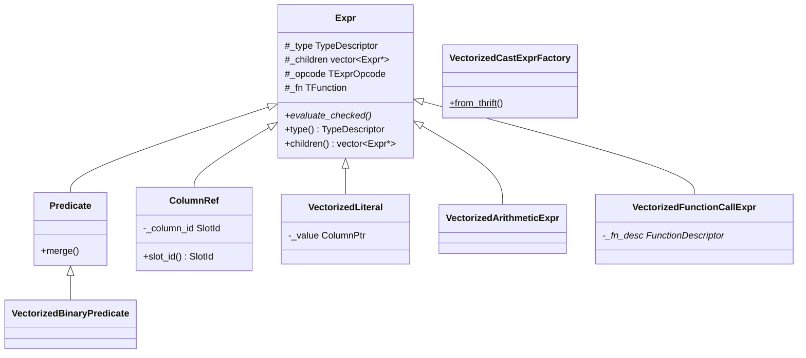
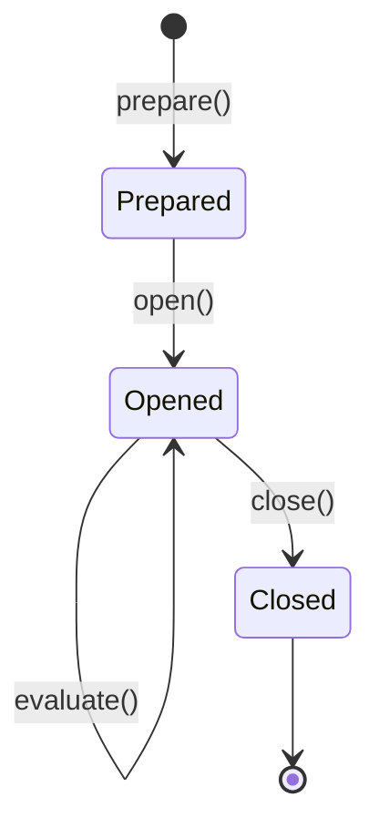
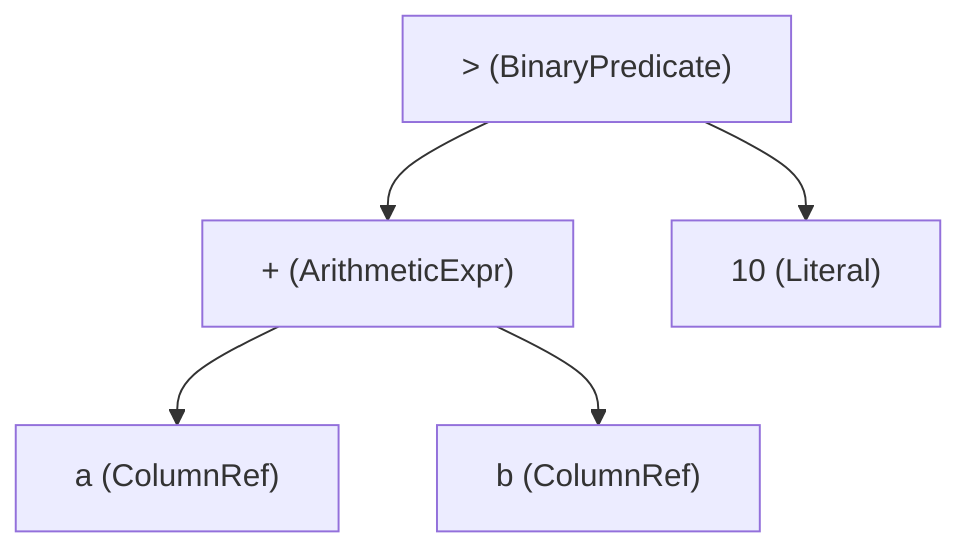
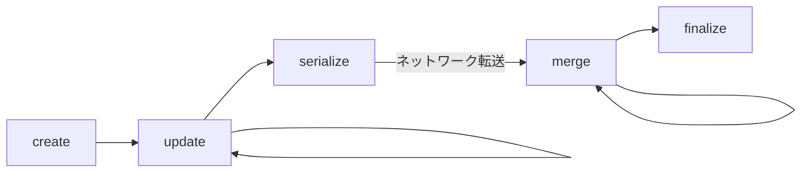
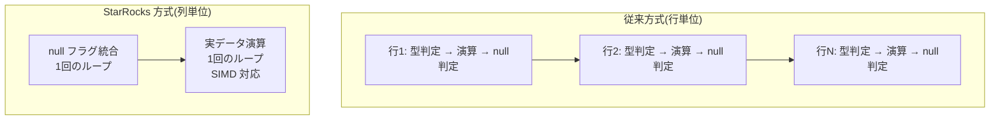

# 第15章 式評価と関数

> **本章で読むソース**
>
> - [`be/src/exprs/expr.h`](https://github.com/StarRocks/starrocks/blob/4.1.1/be/src/exprs/expr.h)
> - [`be/src/exprs/expr_context.h`](https://github.com/StarRocks/starrocks/blob/4.1.1/be/src/exprs/expr_context.h)
> - [`be/src/exprs/column_ref.h`](https://github.com/StarRocks/starrocks/blob/4.1.1/be/src/exprs/column_ref.h)
> - [`be/src/exprs/literal.h`](https://github.com/StarRocks/starrocks/blob/4.1.1/be/src/exprs/literal.h)
> - [`be/src/exprs/binary_predicate.h`](https://github.com/StarRocks/starrocks/blob/4.1.1/be/src/exprs/binary_predicate.h)
> - [`be/src/exprs/arithmetic_expr.h`](https://github.com/StarRocks/starrocks/blob/4.1.1/be/src/exprs/arithmetic_expr.h)
> - [`be/src/exprs/cast_expr.h`](https://github.com/StarRocks/starrocks/blob/4.1.1/be/src/exprs/cast_expr.h)
> - [`be/src/exprs/function_call_expr.h`](https://github.com/StarRocks/starrocks/blob/4.1.1/be/src/exprs/function_call_expr.h)
> - [`be/src/exprs/builtin_functions.h`](https://github.com/StarRocks/starrocks/blob/4.1.1/be/src/exprs/builtin_functions.h)
> - [`be/src/exprs/function_helper.h`](https://github.com/StarRocks/starrocks/blob/4.1.1/be/src/exprs/function_helper.h)
> - [`be/src/exprs/agg/aggregate.h`](https://github.com/StarRocks/starrocks/blob/4.1.1/be/src/exprs/agg/aggregate.h)
> - [`be/src/exprs/agg/aggregate_factory.h`](https://github.com/StarRocks/starrocks/blob/4.1.1/be/src/exprs/agg/aggregate_factory.h)
> - [`be/src/types/logical_type.h`](https://github.com/StarRocks/starrocks/blob/4.1.1/be/src/types/logical_type.h)

## この章の狙い

SQL 文のなかで `WHERE a > 10` や `SELECT price * quantity` のように現れる式は、BE 上では `Expr` クラスのツリーとして表現される。
本章では、この式ツリーの構造、ベクトル化された評価の仕組み、スカラー関数と集約関数の登録と呼び出し、型システムを読む。
最適化の工夫として、式のベクトル化評価がループ内分岐を排除してキャッシュ効率と SIMD 自動ベクトル化を両立させる設計を取り上げる。

## 前提

第10章で扱ったパイプライン実行モデルと Chunk の構造を理解していること。
Chunk が列指向のデータバッチであり、各列が `Column` オブジェクトとして保持される点を把握していること。

## Expr クラス階層

**Expr** は式評価ノードの基底クラスである。
FE が生成した Thrift 形式の式ツリー(`TExpr`)を BE が受け取り、`Expr::create_tree_from_thrift` で C++ の `Expr` ツリーに変換する。
各 `Expr` は型情報(`TypeDescriptor`)、子ノードのリスト(`_children`)、オペコード(`_opcode`)、関数定義(`_fn`)を保持する。

[`be/src/exprs/expr.h` L72-L103](https://github.com/StarRocks/starrocks/blob/4.1.1/be/src/exprs/expr.h#L72-L103)

```cpp
class Expr {
public:
    virtual ~Expr();
    Expr(const Expr& expr);
    virtual Expr* clone(ObjectPool* pool) const = 0;
    // ... (中略) ...
    void add_child(Expr* expr) { _children.push_back(expr); }
    Expr* get_child(int i) const { return _children[i]; }
    int get_num_children() const { return _children.size(); }

    const TypeDescriptor& type() const { return _type; }
    const std::vector<Expr*>& children() const { return _children; }
    TExprOpcode::type op() const { return _opcode; }
    TExprNodeType::type node_type() const { return _node_type; }
    const TFunction& fn() const { return _fn; }

```

ベクトル化エンジンの中心となるメソッドは `evaluate_checked` である。
入力として `ExprContext` と `Chunk` を受け取り、戻り値として `ColumnPtr`(列データ)を返す。

[`be/src/exprs/expr.h` L213](https://github.com/StarRocks/starrocks/blob/4.1.1/be/src/exprs/expr.h#L213)

```cpp
    virtual StatusOr<ColumnPtr> evaluate_checked(ExprContext* context, Chunk* ptr) = 0;

```

`Expr` を継承する主要なサブクラスは以下のとおりである。



### Thrift から Expr ツリーへの変換

`Expr::create_vectorized_expr` は、Thrift ノードの `node_type` に応じてファクトリメソッドを呼び分け、具体的な `Expr` サブクラスを生成する。

[`be/src/exprs/expr.cpp` L331-L392](https://github.com/StarRocks/starrocks/blob/4.1.1/be/src/exprs/expr.cpp#L331-L392)

```cpp
Status Expr::create_vectorized_expr(ObjectPool* pool, const TExprNode& texpr_node,
                                    Expr** expr, RuntimeState* state) {
    switch (texpr_node.node_type) {
    case TExprNodeType::BOOL_LITERAL:
    case TExprNodeType::INT_LITERAL:
    // ... (中略) ...
    case TExprNodeType::NULL_LITERAL: {
        *expr = pool->add(new VectorizedLiteral(texpr_node));
        break;
    }
    case TExprNodeType::BINARY_PRED: {
        *expr = pool->add(VectorizedBinaryPredicateFactory::from_thrift(texpr_node));
        break;
    }
    case TExprNodeType::ARITHMETIC_EXPR: {
        if (texpr_node.opcode != TExprOpcode::INVALID_OPCODE) {
            *expr = pool->add(VectorizedArithmeticExprFactory::from_thrift(texpr_node));
            break;
        }
        // ...
    }
    case TExprNodeType::CAST_EXPR: {
        // ...
        *expr = pool->add(VectorizedCastExprFactory::from_thrift(pool, texpr_node, ...));
        break;
    }
    case TExprNodeType::FUNCTION_CALL: {
        // ...
        *expr = pool->add(new VectorizedFunctionCallExpr(texpr_node));
        break;
    }
    // ...
    }
}

```

リテラル、述語、算術式、キャスト式、関数呼び出しが、すべてこの switch 文から生成される。
生成後は `create_tree_from_thrift` が深さ優先で再帰し、親子関係を組み立てる。

## ColumnRef と VectorizedLiteral

### ColumnRef

**ColumnRef** は式ツリーの葉ノードであり、Chunk 内の特定の列を参照する。
`_column_id`(SlotId)で列を特定し、`evaluate_checked` では Chunk から対応する列を直接取り出して返す。

[`be/src/exprs/column_ref.cpp` L53-L61](https://github.com/StarRocks/starrocks/blob/4.1.1/be/src/exprs/column_ref.cpp#L53-L61)

```cpp
StatusOr<ColumnPtr> ColumnRef::evaluate_checked(ExprContext* context, Chunk* ptr) {
    return get_column(this, ptr);
}

ColumnPtr& ColumnRef::get_column(Expr* expr, Chunk* chunk) {
    auto* ref = (ColumnRef*)expr;
    ColumnPtr& column = (chunk)->get_column_by_slot_id(ref->slot_id());
    return column;
}

```

コピーもメモリ確保も行わず、Chunk 内の列ポインタをそのまま返す。
式評価のなかで最も軽い操作であり、列参照のコストはポインタ取得だけである。

### VectorizedLiteral

**VectorizedLiteral** は定数値を表す葉ノードである。
コンストラクターで `_value` に定数を保持し、`evaluate_checked` では `_value` を複製して Chunk の行数分に拡張する。

[`be/src/exprs/literal.cpp` L166-L173](https://github.com/StarRocks/starrocks/blob/4.1.1/be/src/exprs/literal.cpp#L166-L173)

```cpp
StatusOr<ColumnPtr> VectorizedLiteral::evaluate_checked(ExprContext* context, Chunk* ptr) {
    MutableColumnPtr column = _value->clone_empty();
    column->append(*_value, 0, 1);
    if (ptr != nullptr) {
        column->resize(ptr->num_rows());
    }
    return column;
}

```

`resize` は ConstColumn の場合にはメタデータの更新だけで済むため、大量の行に対しても効率的に動作する。

## ExprContext によるライフサイクル管理

**ExprContext** は `Expr` ツリーの実行状態を管理するラッパーである。
式ツリー本体(`_root`)に加え、関数が必要とする `FunctionContext` の配列を保持する。

[`be/src/exprs/expr_context.h` L65-L108](https://github.com/StarRocks/starrocks/blob/4.1.1/be/src/exprs/expr_context.h#L65-L108)

```cpp
class ExprContext {
public:
    ExprContext(Expr* root);
    ~ExprContext();

    Status prepare(RuntimeState* state);
    Status open(RuntimeState* state);
    Status clone(RuntimeState* state, ObjectPool* pool, ExprContext** new_context);
    void close(RuntimeState* state);

    int register_func(RuntimeState* state, const FunctionContext::TypeDesc& return_type,
                      const std::vector<FunctionContext::TypeDesc>& arg_types);
    FunctionContext* fn_context(int i) {
        return _fn_contexts[i];
    }

    Expr* root() { return _root; }
    StatusOr<ColumnPtr> evaluate(Chunk* chunk, uint8_t* filter = nullptr);

```

ライフサイクルは `prepare` -> `open` -> `evaluate`(繰り返し) -> `close` の順で進む。



`prepare` フェーズでは、式ツリーを再帰的に走査し、各 `Expr` が必要とする `FunctionContext` を登録する。
`open` フェーズでは、定数列の事前評価や関数固有の初期化を行う。
`evaluate` は `_root` の `evaluate_checked` に委譲する。

[`be/src/exprs/expr_context.cpp` L163-L165](https://github.com/StarRocks/starrocks/blob/4.1.1/be/src/exprs/expr_context.cpp#L163-L165)

```cpp
StatusOr<ColumnPtr> ExprContext::evaluate(Chunk* chunk, uint8_t* filter) {
    return evaluate(_root, chunk, filter);
}

```

マルチスレッド環境では、同一の式ツリーを複数の Driver が同時に評価する必要がある。
`ExprContext` はスレッドごとに `clone` して使うことで、`FunctionContext` の状態を分離する。
`_closed` フィールドが `std::atomic<bool>` である理由は、パイプライン実行モデルで `close` が並行に呼ばれる場合があるためである。

## ベクトル化式評価

### 評価の流れ

ベクトル化式評価では、`evaluate_checked` が Column 単位で入出力する。
行ごとのループ内で仮想関数を呼ぶのではなく、1回の `evaluate_checked` 呼び出しで Chunk 内の全行を一括処理する。

具体例として、`a + b > 10` という式を考える。
この式は以下のツリーで表現される。



評価は葉から根に向かって進む。

1. `ColumnRef(a)` が Chunk から列 a の `ColumnPtr` を返す
2. `ColumnRef(b)` が Chunk から列 b の `ColumnPtr` を返す
3. `ArithmeticExpr(+)` が列 a と列 b を受け取り、全行の加算結果を格納した新しい Column を返す
4. `VectorizedLiteral(10)` が定数 10 を Chunk の行数分に拡張した Column を返す
5. `BinaryPredicate(>)` が加算結果と定数 10 を受け取り、全行の比較結果(boolean Column)を返す

各ステップが Column を入出力するため、行ごとの分岐やスカラー処理が発生しない。

### VectorizedBinaryPredicate の evaluate

二項述語の評価は、C++ の標準比較ファンクターをテンプレートで注入し、列全体をループ処理する。

[`be/src/exprs/binary_predicate.cpp` L130-L141](https://github.com/StarRocks/starrocks/blob/4.1.1/be/src/exprs/binary_predicate.cpp#L130-L141)

```cpp
template <LogicalType Type, typename OP>
class VectorizedBinaryPredicate final : public Predicate {
public:
    explicit VectorizedBinaryPredicate(const TExprNode& node) : Predicate(node) {}

    StatusOr<ColumnPtr> evaluate_checked(ExprContext* context, Chunk* ptr) override {
        ASSIGN_OR_RETURN(auto l, _children[0]->evaluate_checked(context, ptr));
        ASSIGN_OR_RETURN(auto r, _children[1]->evaluate_checked(context, ptr));
        return VectorizedStrictBinaryFunction<OP>::template evaluate<Type, TYPE_BOOLEAN>(l, r);
    }

```

`VectorizedStrictBinaryFunction` は `UnionNullableColumnBinaryFunction<UnpackConstColumnBinaryFunction<OP>>` の型エイリアスであり、ConstColumn の展開と Nullable の伝播を自動的に処理する。
内部の `BaseBinaryFunction::vector_vector` では、入力列の生データポインタを取得し、単純な for ループで全行を処理する。

[`be/src/exprs/binary_function.h` L47-L76](https://github.com/StarRocks/starrocks/blob/4.1.1/be/src/exprs/binary_function.h#L47-L76)

```cpp
template <typename OP>
class BaseBinaryFunction {
public:
    template <LogicalType LType, LogicalType RType, LogicalType ResultType>
    static ColumnPtr vector_vector(const ColumnPtr& v1, const ColumnPtr& v2) {
        // ... (中略) ...
        auto* data1 = ColumnHelper::cast_to_raw<LType>(v1)->immutable_data().data();
        auto* data2 = ColumnHelper::cast_to_raw<RType>(v2)->immutable_data().data();
        for (int i = 0; i < s; ++i) {
            data3[i] = OP::template apply<LCppType, RCppType, ResultCppType>(data1[i], data2[i]);
        }
        return result;
    }

```

このループは生データ配列への連続アクセスであり、コンパイラーによる SIMD 自動ベクトル化が期待できる。

### VectorizedArithmeticExpr の evaluate

算術式も同様の設計である。
`evaluate_checked` は子ノードを評価して2つの Column を取得し、`VectorizedStrictBinaryFunction` に渡す。

[`be/src/exprs/arithmetic_expr.cpp` L105-L167](https://github.com/StarRocks/starrocks/blob/4.1.1/be/src/exprs/arithmetic_expr.cpp#L105-L167)

```cpp
template <LogicalType Type, typename OP>
class VectorizedArithmeticExpr final : public Expr {
public:
    // ... (中略) ...
    StatusOr<ColumnPtr> evaluate_checked(ExprContext* context, Chunk* ptr) override {
        ASSIGN_OR_RETURN(auto l, _children[0]->evaluate_checked(context, ptr));
        ASSIGN_OR_RETURN(auto r, _children[1]->evaluate_checked(context, ptr));
        if constexpr (lt_is_decimal<Type>) {
            // ... decimal の場合はオーバーフロー制御付き ...
        } else {
            using ArithmeticOp = ArithmeticBinaryOperator<OP, Type>;
            return VectorizedStrictBinaryFunction<ArithmeticOp>::template evaluate<Type>(l, r);
        }
    }

```

`LogicalType` と演算子 `OP` がテンプレートパラメーターであるため、型ごと、演算子ごとに特殊化されたコードがコンパイル時に生成される。
実行時にはループ内で型チェックや演算子の分岐が発生しない。

## FunctionCallExpr と関数登録

### BuiltinFunctions

**BuiltinFunctions** は、組み込み関数を `uint64_t` の関数 ID から引く静的ハッシュマップである。

[`be/src/exprs/builtin_functions.h` L73-L97](https://github.com/StarRocks/starrocks/blob/4.1.1/be/src/exprs/builtin_functions.h#L73-L97)

```cpp
class BuiltinFunctions {
    using FunctionTables = std::unordered_map<uint64_t, FunctionDescriptor>;

public:
    static const FunctionDescriptor* find_builtin_function(uint64_t id) {
        if (auto iter = fn_tables().find(id); iter != fn_tables().end()) {
            return &iter->second;
        }
        return nullptr;
    };

    template <class... Args>
    static void emplace_builtin_function(uint64_t id, Args&&... args) {
        fn_tables().emplace(id, FunctionDescriptor(std::forward<Args>(args)...));
    }

```

各関数は **FunctionDescriptor** として登録される。
`FunctionDescriptor` は、スカラー関数本体(`scalar_function`)に加え、`prepare_function` と `close_function` のフックを持つ。

[`be/src/exprs/builtin_functions.h` L30-L41](https://github.com/StarRocks/starrocks/blob/4.1.1/be/src/exprs/builtin_functions.h#L30-L41)

```cpp
struct FunctionDescriptor {
    std::string name;
    uint8_t args_nums;
    ScalarFunction scalar_function;
    PrepareFunction prepare_function;
    CloseFunction close_function;
    bool exception_safe;
    bool check_overflow;
    const char* return_type;
    std::vector<const char*> arg_types;

```

`ScalarFunction` の型は `std::function<StatusOr<ColumnPtr>(FunctionContext*, const Columns&)>` である。
引数も戻り値も Column 単位であり、ベクトル化式評価の規約に従っている。

### VectorizedFunctionCallExpr の評価

**VectorizedFunctionCallExpr** は、`prepare` で関数 ID から `FunctionDescriptor` を検索し、`evaluate_checked` で `scalar_function` を呼ぶ。

[`be/src/exprs/function_call_expr.cpp` L86-L129](https://github.com/StarRocks/starrocks/blob/4.1.1/be/src/exprs/function_call_expr.cpp#L86-L129)

```cpp
Status VectorizedFunctionCallExpr::prepare(RuntimeState* state, ExprContext* context) {
    RETURN_IF_ERROR(Expr::prepare(state, context));
    // ... (中略) ...
    _fn_desc = _get_function(_fn, args_types, return_type, arg_nullblaes);
    if (_fn_desc == nullptr || _fn_desc->scalar_function == nullptr) {
        return Status::InternalError("Vectorized engine doesn't implement function " +
                                     _fn.name.function_name);
    }
    // ...
    _fn_context_index = context->register_func(state, return_type, args_types);
    return Status::OK();
}

```

`evaluate_checked` では、子ノードを評価して引数列を収集し、`scalar_function` に渡す。

[`be/src/exprs/function_call_expr.cpp` L183-L230](https://github.com/StarRocks/starrocks/blob/4.1.1/be/src/exprs/function_call_expr.cpp#L183-L230)

```cpp
StatusOr<ColumnPtr> VectorizedFunctionCallExpr::evaluate_checked(ExprContext* context, Chunk* ptr) {
    FunctionContext* fn_ctx = context->fn_context(_fn_context_index);

    Columns args;
    args.reserve(_children.size());
    for (Expr* child : _children) {
        ASSIGN_OR_RETURN(ColumnPtr column, context->evaluate(child, ptr));
        args.emplace_back(column);
    }
    // ... (中略) ...
    StatusOr<ColumnPtr> result;
    if (_fn_desc->exception_safe) {
        result = _fn_desc->scalar_function(fn_ctx, args);
    } else {
        SCOPED_SET_CATCHED(false);
        result = _fn_desc->scalar_function(fn_ctx, args);
    }
    // ...
    return result;
}

```

`exception_safe` フラグにより、例外安全でない関数に対しては `SCOPED_SET_CATCHED(false)` で例外キャッチを無効化する。
この切り替えは `FunctionDescriptor` 登録時に関数ごとに設定される。

### FunctionHelper

**FunctionHelper** は、関数実装が Nullable 列や Const 列を扱う際のユーティリティを提供する。

[`be/src/exprs/function_helper.h` L28-L81](https://github.com/StarRocks/starrocks/blob/4.1.1/be/src/exprs/function_helper.h#L28-L81)

```cpp
class FunctionHelper {
public:
    static inline ColumnPtr get_data_column_of_nullable(const ColumnPtr& ptr) {
        if (ptr->is_nullable()) {
            return down_cast<const NullableColumn*>(ptr.get())->data_column();
        }
        return ptr;
    }

    static inline ColumnPtr get_data_column_of_const(const ColumnPtr& ptr) {
        if (ptr->is_constant()) {
            return down_cast<const ConstColumn*>(ptr.get())->data_column();
        }
        return ptr;
    }
    // ...
    static NullColumn::MutablePtr union_nullable_column(const ColumnPtr& v1, const ColumnPtr& v2);

```

`get_data_column_of_nullable` は NullableColumn から実データ列を取り出す。
`get_data_column_of_const` は ConstColumn を展開する。
`union_nullable_column` は2つの列の null フラグを OR で統合する。

関数実装者はこれらのヘルパーを使い、入力列の Nullable/Const をはがしてから実データに対して処理を行う。
この分離により、関数の本体ロジックは null 処理や定数処理を意識せずに書ける。

## AggregateFunction の設計

集約関数は、スカラー関数とは異なるインターフェースを持つ。
**AggregateFunction** は集約状態の管理メソッドと集約演算メソッドを定義する抽象クラスである。

[`be/src/exprs/agg/aggregate.h` L64-L129](https://github.com/StarRocks/starrocks/blob/4.1.1/be/src/exprs/agg/aggregate.h#L64-L129)

```cpp
class AggregateFunction {
public:
    virtual ~AggregateFunction() = default;

    virtual void reset(FunctionContext* ctx, const Columns& args, AggDataPtr __restrict state) const {}

    virtual void update(FunctionContext* ctx, const Column** columns, AggDataPtr __restrict state,
                        size_t row_num) const = 0;

    virtual void merge(FunctionContext* ctx, const Column* column, AggDataPtr __restrict state,
                       size_t row_num) const = 0;

    virtual void serialize_to_column(FunctionContext* ctx, ConstAggDataPtr __restrict state,
                                     Column* to) const = 0;

    virtual void finalize_to_column(FunctionContext* ctx, ConstAggDataPtr __restrict state,
                                    Column* to) const = 0;
    // ...
    virtual size_t size() const = 0;
    virtual size_t alignof_size() const = 0;
    virtual void create(FunctionContext* ctx, AggDataPtr __restrict ptr) const = 0;
    virtual void destroy(FunctionContext* ctx, AggDataPtr __restrict ptr) const = 0;

```

集約関数のライフサイクルは5つの操作で構成される。



- **create**: 集約状態のメモリを初期化する
- **update**: 入力行を集約状態に反映する
- **serialize**: 集約状態をバイト列に変換する(ネットワーク転送用)
- **merge**: 別ノードの集約状態を統合する
- **finalize**: 集約状態から最終結果を生成する

`AggDataPtr` は `uint8_t*` の型エイリアスであり、集約状態を型なしのバイト領域として扱う。
各集約関数の実装は `AggregateFunctionStateHelper<State>` を継承し、テンプレートパラメーターで状態の型を指定する。

[`be/src/exprs/agg/aggregate.h` L345-L362](https://github.com/StarRocks/starrocks/blob/4.1.1/be/src/exprs/agg/aggregate.h#L345-L362)

```cpp
template <typename State>
class AggregateFunctionStateHelper : public AggregateFunction {
protected:
    static State& data(AggDataPtr __restrict place) { return *reinterpret_cast<State*>(place); }
    static const State& data(ConstAggDataPtr __restrict place) {
        return *reinterpret_cast<const State*>(place);
    }

public:
    void create(FunctionContext* ctx, AggDataPtr __restrict ptr) const override { new (ptr) State; }
    void destroy(FunctionContext* ctx, AggDataPtr __restrict ptr) const override { data(ptr).~State(); }
    size_t size() const override { return sizeof(State); }
    size_t alignof_size() const override { return alignof(State); }
    bool is_pod_state() const override { return pod_state(); }
};

```

### バッチ処理による仮想関数呼び出しの削減

`AggregateFunctionBatchHelper` は、行ごとの `update` を Chunk 全体に対してまとめて呼ぶバッチインターフェースを提供する。

[`be/src/exprs/agg/aggregate.h` L407-L412](https://github.com/StarRocks/starrocks/blob/4.1.1/be/src/exprs/agg/aggregate.h#L407-L412)

```cpp
    void update_batch(FunctionContext* ctx, size_t chunk_size, size_t state_offset,
                      const Column** columns, AggDataPtr* states) const override {
        for (size_t i = 0; i < chunk_size; ++i) {
            static_cast<const Derived*>(this)->update(ctx, columns, states[i] + state_offset, i);
        }
    }

```

`static_cast<const Derived*>(this)->update(...)` は CRTP(Curiously Recurring Template Pattern)による静的ディスパッチである。
ループ内で仮想関数テーブルの間接呼び出しが発生せず、コンパイラーがインライン展開できる。

`AggDataPtr` には `__restrict` 修飾子が付与されている。
これはポインタエイリアシングの不在をコンパイラーに伝え、自動ベクトル化を促進する。
ソースコード中のコメントがベンチマーク URL を挙げて、この効果を示している[^restrict]。

[^restrict]: `be/src/exprs/agg/aggregate.h` L56-L63 のコメントに、`__restrict` の有無によるパフォーマンス比較のベンチマークリンクが記載されている。

### 集約関数の検索

`get_aggregate_function` は、関数名、引数型、戻り値型、null 許容フラグから集約関数インスタンスを検索する。

[`be/src/exprs/agg/aggregate_factory.h` L22-L25](https://github.com/StarRocks/starrocks/blob/4.1.1/be/src/exprs/agg/aggregate_factory.h#L22-L25)

```cpp
const AggregateFunction* get_aggregate_function(const std::string& name, LogicalType arg_type,
                                                LogicalType return_type, bool is_null,
                                                TFunctionBinaryType::type binary_type = TFunctionBinaryType::BUILTIN,
                                                int func_version = 1);

```

集約関数のインスタンスは状態を持たない。
集約状態は `AggDataPtr` として外部のハッシュマップに格納されるため、1つの `AggregateFunction` インスタンスを複数のグループキーで共有できる。

## LogicalType(型システム)

**LogicalType** は StarRocks の論理型を表す列挙体である。

[`be/src/types/logical_type.h` L27-L80](https://github.com/StarRocks/starrocks/blob/4.1.1/be/src/types/logical_type.h#L27-L80)

```cpp
enum LogicalType {
    TYPE_UNKNOWN = 0,
    TYPE_TINYINT = 1,
    TYPE_SMALLINT = 3,
    TYPE_INT = 5,
    TYPE_BIGINT = 7,
    TYPE_LARGEINT = 9,
    TYPE_FLOAT = 10,
    TYPE_DOUBLE = 11,
    TYPE_CHAR = 13,
    TYPE_VARCHAR = 17,
    TYPE_STRUCT = 18,
    TYPE_ARRAY = 19,
    TYPE_MAP = 20,
    TYPE_BOOLEAN = 24,
    // ... (中略) ...
    TYPE_DECIMAL32 = 47,
    TYPE_DECIMAL64 = 48,
    TYPE_DECIMAL128 = 49,
    TYPE_DATE = 50,
    TYPE_DATETIME = 51,
    TYPE_JSON = 54,
    TYPE_VARIANT = 55,
    TYPE_MAX_VALUE = 56
};

```

スカラー型、複合型(ARRAY, MAP, STRUCT)、半構造化型(JSON, VARIANT)、特殊な集約用型(HLL, OBJECT, PERCENTILE)をカバーする。
`LogicalType` はテンプレートパラメーターとして式評価の各段階で使われる。
型ごとに特殊化された評価コードがコンパイル時に生成されるため、実行時の型判定が不要になる。

型の分類にはガード関数群が用意されている。

[`be/src/types/logical_type.h` L122-L133](https://github.com/StarRocks/starrocks/blob/4.1.1/be/src/types/logical_type.h#L122-L133)

```cpp
inline bool is_integer_type(LogicalType type) {
    return type == TYPE_TINYINT || type == TYPE_SMALLINT || type == TYPE_INT ||
           type == TYPE_BIGINT || type == TYPE_LARGEINT;
}

inline bool is_float_type(LogicalType type) {
    return type == TYPE_FLOAT || type == TYPE_DOUBLE;
}

constexpr bool is_string_type(LogicalType type) {
    return type == LogicalType::TYPE_CHAR || type == LogicalType::TYPE_VARCHAR;
}

```

`VALUE_GUARD` マクロで定義されるコンパイル時ガード(例: `lt_is_integer`, `lt_is_decimal`)は、`if constexpr` と組み合わせて型ごとの分岐をコンパイル時に解決する。
これにより、実行時の switch 文が除去される。

## CastExpr による型変換

**VectorizedCastExprFactory** は、変換元と変換先の `LogicalType` の組み合わせに応じてキャスト式を生成する。

[`be/src/exprs/cast_expr.h` L34-L58](https://github.com/StarRocks/starrocks/blob/4.1.1/be/src/exprs/cast_expr.h#L34-L58)

```cpp
class VectorizedCastExprFactory {
public:
    static Expr* from_thrift(ObjectPool* pool, const TExprNode& node,
                             bool exception_if_failed = false);

    static Expr* from_type(const TypeDescriptor& from, const TypeDescriptor& to, Expr* child,
                           ObjectPool* pool, bool exception_if_failed = false);

private:
    static StatusOr<Expr*> create_cast_expr(ObjectPool* pool, const TypeDescriptor& from_type,
                                            const TypeDescriptor& cast_type,
                                            bool allow_throw_exception, bool cast_by_name = false);

```

プリミティブ型間の変換は `CastFn<FromType, ToType>` テンプレートで実装される。
各変換の `cast_fn` は `VectorizedStrictUnaryFunction` を使い、列全体を一括変換する。

[`be/src/exprs/cast_expr.cpp` L80-L98](https://github.com/StarRocks/starrocks/blob/4.1.1/be/src/exprs/cast_expr.cpp#L80-L98)

```cpp
template <LogicalType FromType, LogicalType ToType, bool AllowThrowException = false>
struct CastFn {
    static ColumnPtr cast_fn(ColumnPtr&& column);
};

#define SELF_CAST(FROM_TYPE)                                                    \
    template <bool AllowThrowException>                                         \
    struct CastFn<FROM_TYPE, FROM_TYPE, AllowThrowException> {                  \
        static ColumnPtr cast_fn(ColumnPtr&& column) {                          \
            return Column::mutate(std::move(column));                           \
        }                                                                       \
    };

#define UNARY_FN_CAST(FROM_TYPE, TO_TYPE, UNARY_IMPL)                           \
    template <bool AllowThrowException>                                         \
    struct CastFn<FROM_TYPE, TO_TYPE, AllowThrowException> {                    \
        static ColumnPtr cast_fn(ColumnPtr&& column) {                          \
            return VectorizedStrictUnaryFunction<UNARY_IMPL>::                  \
                template evaluate<FROM_TYPE, TO_TYPE>(column);                  \
        }                                                                       \
    };

```

同一型のキャストは `SELF_CAST` マクロで定義され、`Column::mutate` でムーブするだけで済む。
範囲チェックが必要な変換(例: BIGINT -> TINYINT)には `UNARY_FN_CAST_VALID` が使われ、オーバーフロー時に null を返すか例外を投げるかを `AllowThrowException` で制御する。

複合型のキャストには専用のクラスが用意されている。
`CastStringToArray`, `CastJsonToArray`, `CastArrayExpr`, `CastMapExpr`, `CastStructExpr` などが、要素単位の再帰的な型変換を行う。

## 最適化の工夫: ベクトル化評価によるループ内分岐の排除

StarRocks の式評価エンジンは、3つの設計上の選択により、ベクトル化評価の効率を高めている。

**第1に、テンプレートによる型と演算子の特殊化である。**
`VectorizedBinaryPredicate<Type, OP>` や `VectorizedArithmeticExpr<Type, OP>` のように、`LogicalType` と演算子をテンプレートパラメーターにする。
コンパイラーは型ごと、演算子ごとに別のコードを生成するため、ループ内に型判定や演算子分岐が残らない。
生成されるループは、連続メモリ上の固定長データに対する単純な算術操作の繰り返しとなり、SIMD 命令への変換が容易になる。

**第2に、Column の Nullable/Const の分離処理である。**
`VectorizedStrictBinaryFunction` は、Nullable 列の null フラグ処理と ConstColumn の展開を、実データの演算ループとは別のレイヤーで行う。
`UnpackConstColumnBinaryFunction` が ConstColumn を処理し、`UnionNullableColumnBinaryFunction` が null フラグを OR で統合する。
演算本体のループはこれらの前処理の後に実行されるため、ループ内に null チェックの分岐が入らない。

**第3に、`__restrict` とバッチ処理による集約の高速化である。**
集約関数の `AggDataPtr __restrict state` は、ポインタエイリアシングがないことをコンパイラーに伝える。
これにより、コンパイラーは集約状態の読み書きをレジスターに保持したまま最適化できる。
`AggregateFunctionBatchHelper` が CRTP で仮想関数呼び出しを排除し、ループ全体がインライン化される。



行単位の方式では、行ごとに型判定、null チェック、演算の3つの分岐が発生する。
StarRocks の列単位の方式では、null フラグの統合と実データの演算が別のループに分離される。
実データのループには分岐がなく、連続メモリへの単純な読み書きだけで構成されるため、CPU のパイプラインストールを回避し、キャッシュラインを効率的に利用できる。

## まとめ

式評価エンジンは、`Expr` を基底とするツリー構造で SQL 式を表現する。
各ノードの `evaluate_checked` は Column を入出力とするベクトル化インターフェースに統一されている。
スカラー関数は `BuiltinFunctions` に `FunctionDescriptor` として登録され、`VectorizedFunctionCallExpr` から呼ばれる。
集約関数は `AggregateFunction` インターフェースに従い、create, update, merge, serialize, finalize のライフサイクルで動作する。
テンプレート特殊化、Nullable/Const の分離処理、CRTP と `__restrict` によるバッチ処理が、ベクトル化評価の高速化を支えている。

## 関連する章

- 第10章(パイプライン実行モデル): Chunk と Column の基本構造
- 第13章(Aggregate, Sort, Exchange): 集約オペレーターが `AggregateFunction` を使う流れ
- 第12章(Join と RuntimeFilter): 述語評価が RuntimeFilter に使われる場面
