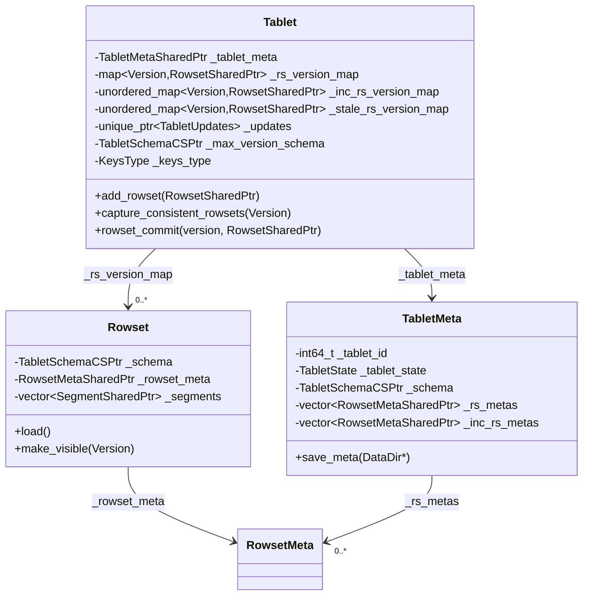
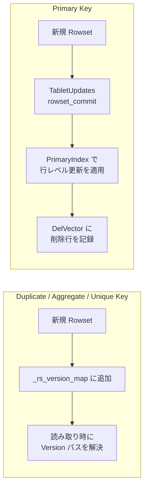
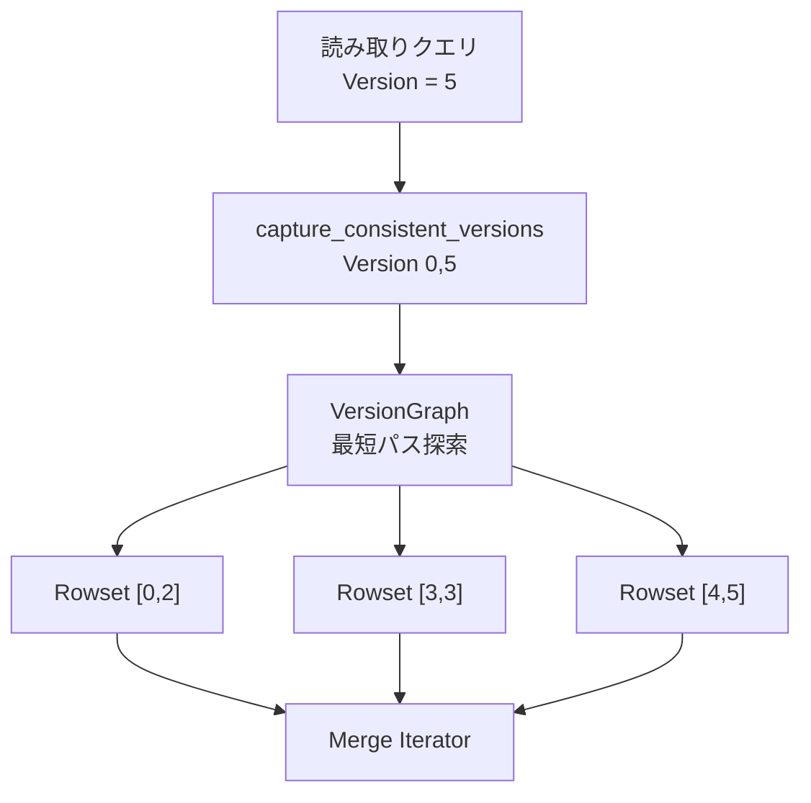
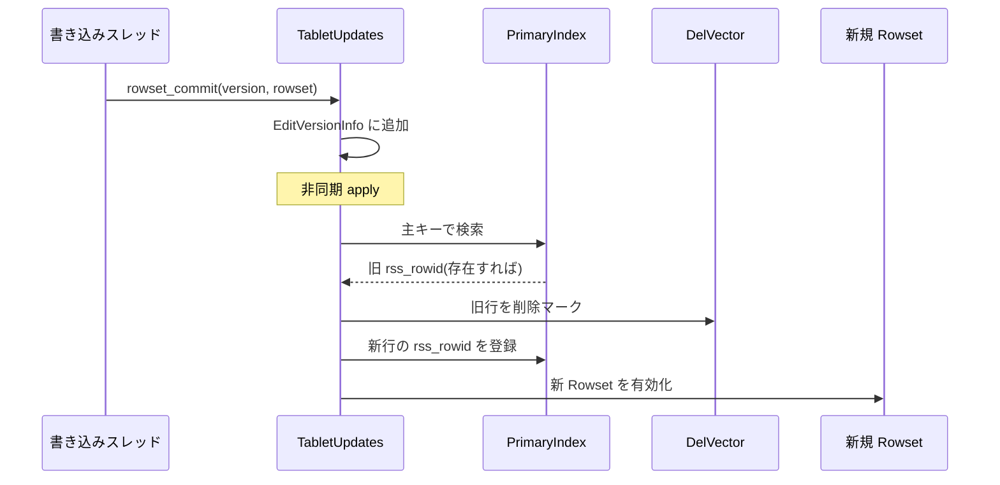

# 第16章 Tablet, Rowset とデータモデル

> **本章で読むソース**
>
> - [`be/src/storage/tablet.h`](https://github.com/StarRocks/starrocks/blob/4.1.1/be/src/storage/tablet.h)
> - [`be/src/storage/tablet.cpp`](https://github.com/StarRocks/starrocks/blob/4.1.1/be/src/storage/tablet.cpp)
> - [`be/src/storage/tablet_meta.h`](https://github.com/StarRocks/starrocks/blob/4.1.1/be/src/storage/tablet_meta.h)
> - [`be/src/storage/rowset/rowset.h`](https://github.com/StarRocks/starrocks/blob/4.1.1/be/src/storage/rowset/rowset.h)
> - [`be/src/storage/rowset/rowset.cpp`](https://github.com/StarRocks/starrocks/blob/4.1.1/be/src/storage/rowset/rowset.cpp)
> - [`be/src/storage/rowset/rowset_meta.h`](https://github.com/StarRocks/starrocks/blob/4.1.1/be/src/storage/rowset/rowset_meta.h)
> - [`be/src/storage/tablet_schema.h`](https://github.com/StarRocks/starrocks/blob/4.1.1/be/src/storage/tablet_schema.h)
> - [`be/src/storage/tablet_manager.h`](https://github.com/StarRocks/starrocks/blob/4.1.1/be/src/storage/tablet_manager.h)
> - [`be/src/storage/tablet_updates.h`](https://github.com/StarRocks/starrocks/blob/4.1.1/be/src/storage/tablet_updates.h)
> - [`be/src/storage/data_dir.h`](https://github.com/StarRocks/starrocks/blob/4.1.1/be/src/storage/data_dir.h)

## この章の狙い

StarRocks BE のストレージ層は、FE から受け取ったデータを **Tablet** と **Rowset** という二層の構造で管理する。
Tablet はパーティションをバケット分割した物理的な管理単位であり、Rowset はその中に積み重なる不変のデータ断片である。
本章では、Tablet, Rowset, TabletSchema の内部構造を読み、4種のテーブルモデル(Duplicate Key, Aggregate Key, Unique Key, Primary Key)が BE 側でどのように実装されているかを把握する。

## 前提

StarRocks のテーブルは FE 側で論理的にパーティションとバケットに分割される。
各バケットが BE 上の1つの Tablet に対応し、Tablet は1つの DataDir(ディスク上のストレージルート)に配置される。
データの書き込みはトランザクション単位で行われ、書き込みが完了するたびに新しい Rowset が生成されて Tablet に追加される。
Compaction によって複数の Rowset が統合されるが、個々の Rowset は不変(イミュータブル)であり、読み取り中の Rowset が変更されることはない。

## Tablet の構造

`Tablet` は `BaseTablet` を継承し、Rowset 群のバージョン管理とメタデータの永続化を担う。

[`be/src/storage/tablet.h` L82-L93](https://github.com/StarRocks/starrocks/blob/4.1.1/be/src/storage/tablet.h#L82-L93)

```cpp
class Tablet : public BaseTablet {
public:
    static TabletSharedPtr create_tablet_from_meta(const TabletMetaSharedPtr& tablet_meta, DataDir* data_dir = nullptr);

    Tablet(const TabletMetaSharedPtr& tablet_meta, DataDir* data_dir);

    Tablet() = delete;
    Tablet(const Tablet&) = delete;
    const Tablet& operator=(const Tablet&) = delete;

    // for ut
    Tablet(KeysType keys_type);

```

Tablet は `TabletMetaSharedPtr` と `DataDir*` を受け取って構築される。
コピーは禁止されており、常に `shared_ptr<Tablet>` として管理される。

Tablet は内部に3つの Rowset マップを保持する。

[`be/src/storage/tablet.h` L423-L438](https://github.com/StarRocks/starrocks/blob/4.1.1/be/src/storage/tablet.h#L423-L438)

```cpp
    // A new load job will produce a new rowset, which will be inserted into both _rs_version_map
    // and _inc_rs_version_map. Only the most recent rowsets are kept in _inc_rs_version_map to
    // reduce the amount of data that needs to be copied during the clone task.
    // NOTE: Not all incremental-rowsets are in _rs_version_map. Because after some rowsets
    // are compacted, they will be remove from _rs_version_map, but it may not be deleted from
    // _inc_rs_version_map.
    // ...
    std::map<Version, RowsetSharedPtr> _rs_version_map;
    std::unordered_map<Version, RowsetSharedPtr, HashOfVersion> _inc_rs_version_map;
    // This variable _stale_rs_version_map is used to record these rowsets which are be compacted.
    // These _stale rowsets are been removed when rowsets' pathVersion is expired,
    // this policy is judged and computed by TimestampedVersionTracker.
    std::unordered_map<Version, RowsetSharedPtr, HashOfVersion> _stale_rs_version_map;

```

この3つのマップの役割を整理する。

- **`_rs_version_map`**：現在有効な Rowset を Version で引くためのマップ。読み取りクエリはこのマップからバージョンに対応する Rowset 群を取得する。
- **`_inc_rs_version_map`**：最近追加された増分 Rowset を保持する。クローンタスクがコピーすべきデータ量を減らすために使われる。Compaction 後も一定期間残り、`inc_rowset_expired_sec` の設定に基づいて定期的に削除される。
- **`_stale_rs_version_map`**：Compaction によって置き換えられた旧 Rowset を一時的に保持する。進行中の読み取りが旧 Rowset を参照している可能性があるため、即座には削除されない。

Primary Key テーブルの場合、これらのマップの代わりに `TabletUpdates` が Rowset を管理する。

[`be/src/storage/tablet.h` L449-L450](https://github.com/StarRocks/starrocks/blob/4.1.1/be/src/storage/tablet.h#L449-L450)

```cpp
    // States used for updatable tablets only
    std::unique_ptr<TabletUpdates> _updates;

```

初期化時に `keys_type()` が `PRIMARY_KEYS` であれば `TabletUpdates` が生成される。

[`be/src/storage/tablet.cpp` L113-L118](https://github.com/StarRocks/starrocks/blob/4.1.1/be/src/storage/tablet.cpp#L113-L118)

```cpp
    if (keys_type() == PRIMARY_KEYS) {
        _updates = std::make_unique<TabletUpdates>(*this);
        Status st = _updates->init();
        LOG_IF(WARNING, !st.ok()) << "Fail to init updates: " << st;
        return st;
    }

```

以下の図は Tablet, TabletMeta, Rowset の関係を示す。



## TabletMeta とライフサイクル

**TabletMeta** は Tablet のメタデータを保持するクラスである。
テーブル ID, パーティション ID, Tablet ID, スキーマ, Rowset メタ一覧など、Tablet の永続的な情報をすべて格納する。

[`be/src/storage/tablet_meta.h` L94-L114](https://github.com/StarRocks/starrocks/blob/4.1.1/be/src/storage/tablet_meta.h#L94-L114)

```cpp
class TabletMeta {
public:
    static Status create(const TCreateTabletReq& request, const TabletUid& tablet_uid, uint64_t shard_id,
                         uint32_t next_unique_id,
                         const std::unordered_map<uint32_t, uint32_t>& col_ordinal_to_unique_id,
                         TabletMetaSharedPtr* tablet_meta);
    // ... (中略) ...
    explicit TabletMeta();
    TabletMeta(int64_t table_id, int64_t partition_id, int64_t tablet_id, int32_t schema_hash, uint64_t shard_id,
               const TTabletSchema& tablet_schema, uint32_t next_unique_id, bool enable_persistent_index,
               const std::unordered_map<uint32_t, uint32_t>& col_ordinal_to_unique_id, const TabletUid& tablet_uid,
               TTabletType::type tabletType, TCompressionType::type compression_type,
               int32_t primary_index_cache_expire_sec, TStorageType::type storage_type, int compression_level);

```

TabletMeta は Rowset のメタデータ一覧を3つのベクタで管理する。

[`be/src/storage/tablet_meta.h` L276-L281](https://github.com/StarRocks/starrocks/blob/4.1.1/be/src/storage/tablet_meta.h#L276-L281)

```cpp
    std::vector<RowsetMetaSharedPtr> _rs_metas;
    std::vector<RowsetMetaSharedPtr> _inc_rs_metas;
    // This variable _stale_rs_metas is used to record these rowsets' meta which are be compacted.
    // These stale rowsets meta are been removed when rowsets' pathVersion is expired,
    // this policy is judged and computed by TimestampedVersionTracker.
    std::vector<RowsetMetaSharedPtr> _stale_rs_metas;

```

Tablet のライフサイクルは `TabletState` で管理される。

[`be/src/storage/tablet_meta.h` L67-L83](https://github.com/StarRocks/starrocks/blob/4.1.1/be/src/storage/tablet_meta.h#L67-L83)

```cpp
enum TabletState {
    // Tablet is under alter table, rollup, clone
    TABLET_NOTREADY,

    TABLET_RUNNING,

    // Tablet integrity has been violated, such as missing versions.
    // In this state, tablet will not accept any incoming request.
    // Report this state to FE, scheduling BE to drop tablet.
    TABLET_TOMBSTONED,

    // Tablet is shutting down, files in disk still remained.
    TABLET_STOPPED,

    // Files have been removed, tablet has been shutdown completely.
    TABLET_SHUTDOWN
};

```

遷移は `NOTREADY -> RUNNING -> TOMBSTONED -> STOPPED -> SHUTDOWN` の方向に進む。
`NOTREADY` は Alter Table やクローン中の状態であり、`RUNNING` に遷移して初めてクエリを受け付ける。

## Rowset の構造

**Rowset** は不変のデータ断片であり、1回の書き込みトランザクションまたは Compaction の出力に対応する。
内部に複数の Segment ファイルを保持する。

[`be/src/storage/rowset/rowset.h` L143-L149](https://github.com/StarRocks/starrocks/blob/4.1.1/be/src/storage/rowset/rowset.h#L143-L149)

```cpp
class Rowset : public std::enable_shared_from_this<Rowset>, public BaseRowset {
public:
    Rowset(const TabletSchemaCSPtr&, std::string rowset_path, RowsetMetaSharedPtr rowset_meta, KVStore* kvstore);
    Rowset(const Rowset&) = delete;
    const Rowset& operator=(const Rowset&) = delete;
    // ... (中略) ...

```

Rowset は `_segments` ベクタに Segment オブジェクトを保持する。

[`be/src/storage/rowset/rowset.h` L458](https://github.com/StarRocks/starrocks/blob/4.1.1/be/src/storage/rowset/rowset.h#L458)

```cpp
    std::vector<SegmentSharedPtr> _segments;

```

Rowset には3つの状態がある。

[`be/src/storage/rowset/rowset.h` L79-L86](https://github.com/StarRocks/starrocks/blob/4.1.1/be/src/storage/rowset/rowset.h#L79-L86)

```cpp
enum RowsetState {
    // state for new created rowset
    ROWSET_UNLOADED,
    // state after load() called
    ROWSET_LOADED,
    // state for closed() called but owned by some readers
    ROWSET_UNLOADING
};

```

`ROWSET_UNLOADED` は初期状態で、`load()` が呼ばれると `ROWSET_LOADED` に遷移し、Segment ファイルのメタデータがメモリに読み込まれる。
`close()` が呼ばれたとき、リーダーが参照中であれば `ROWSET_UNLOADING` に遷移し、全リーダーが解放された時点で `ROWSET_UNLOADED` に戻る。

Rowset が公開される(クエリから見えるようになる)際には `make_visible()` が呼ばれる。

[`be/src/storage/rowset/rowset.cpp` L112-L124](https://github.com/StarRocks/starrocks/blob/4.1.1/be/src/storage/rowset/rowset.cpp#L112-L124)

```cpp
void Rowset::make_visible(Version version) {
    _rowset_meta->set_version(version);
    _rowset_meta->set_rowset_state(VISIBLE);
    // update create time to the visible time,
    // it's used to skip recently published version during compaction
    _rowset_meta->set_creation_time(UnixSeconds());

    if (_rowset_meta->has_delete_predicate()) {
        _rowset_meta->mutable_delete_predicate()->set_version(version.first);
        return;
    }
    make_visible_extra(version);
}

```

`make_visible()` は Version を設定し、RowsetMeta の状態を `VISIBLE` に変更する。
作成時刻を公開時刻に更新することで、直後の Compaction 対象から除外する効果もある。

リーダーの参照管理は `acquire()` / `release()` で行われる。

[`be/src/storage/rowset/rowset.h` L336-L358](https://github.com/StarRocks/starrocks/blob/4.1.1/be/src/storage/rowset/rowset.h#L336-L358)

```cpp
    void acquire() { ++_refs_by_reader; }

    void release() {
        uint64_t current_refs = --_refs_by_reader;
        if (current_refs == 0) {
            {
                std::lock_guard<std::mutex> release_lock(_lock);
                if (_refs_by_reader == 0 && _rowset_state_machine.rowset_state() == ROWSET_UNLOADING) {
                    do_close();
                    WARN_IF_ERROR(_rowset_state_machine.on_release(),
                                  // ... (中略) ...
                                  );
                }
            }
            // ... (中略) ...
        }
    }

```

`_refs_by_reader` はアトミックカウンターであり、読み取り中のリーダー数を追跡する。
カウンターが0になり、かつ状態が `ROWSET_UNLOADING` であればリソースを解放する。

## RowsetMeta

**RowsetMeta** は Rowset の永続メタデータを Protobuf (`RowsetMetaPB`) で保持する。

[`be/src/storage/rowset/rowset_meta.h` L56-L68](https://github.com/StarRocks/starrocks/blob/4.1.1/be/src/storage/rowset/rowset_meta.h#L56-L68)

```cpp
class RowsetMeta {
public:
    RowsetMeta() = delete;

    explicit RowsetMeta(const RowsetMetaPB& rowset_meta_pb);
    explicit RowsetMeta(std::unique_ptr<RowsetMetaPB>& rowset_meta_pb);
    RowsetMeta(std::string_view pb_rowset_meta, bool* parse_ok);

    ~RowsetMeta();

    RowsetId rowset_id() const { return _rowset_id; }

    int64_t tablet_id() const { return _rowset_meta_pb->tablet_id(); }

```

RowsetMeta は Version(開始バージョンと終了バージョン)、行数、ディスクサイズ、Segment 数などの情報を提供する。
Segment 間の重複判定も RowsetMeta が担う。

[`be/src/storage/rowset/rowset_meta.h` L197-L199](https://github.com/StarRocks/starrocks/blob/4.1.1/be/src/storage/rowset/rowset_meta.h#L197-L199)

```cpp
    bool is_segments_overlapping() const {
        return num_segments() > 1 && is_singleton_delta() && segments_overlap() != NONOVERLAPPING;
    }

```

Segment が重複しているかどうかは、Compaction スコアの計算に使われる。
重複がある場合はスコアが Segment 数に等しくなり、重複がない場合は1になる。

メモリ効率のため、RowsetMeta は `tablet_schema_pb` をメモリ上には保持しない。
`_init()` で Protobuf からスキーマを読み出した後、Protobuf 内のスキーマフィールドをクリアし、必要なときだけ `get_full_meta_pb()` で再構築する。

[`be/src/storage/rowset/rowset_meta.h` L311-L325](https://github.com/StarRocks/starrocks/blob/4.1.1/be/src/storage/rowset/rowset_meta.h#L311-L325)

```cpp
    void _init() {
        // ... (中略) ...
        _has_tablet_schema_pb = _rowset_meta_pb->has_tablet_schema();
        // clear does not release memory but only set it to default value, so we need to copy a new _rowset_meta_pb
        _rowset_meta_pb->clear_tablet_schema();
        std::unique_ptr<RowsetMetaPB> ptr = std::make_unique<RowsetMetaPB>(*_rowset_meta_pb);
        _rowset_meta_pb = std::move(ptr);
    }

```

## TabletSchema

**TabletSchema** はテーブルのカラム定義、キー型、ソートキーの情報を保持する。

[`be/src/storage/tablet_schema.h` L273-L278](https://github.com/StarRocks/starrocks/blob/4.1.1/be/src/storage/tablet_schema.h#L273-L278)

```cpp
class TabletSchema {
public:
    using SchemaId = int64_t;
    using TabletSchemaSPtr = std::shared_ptr<TabletSchema>;
    using TabletSchemaCSPtr = std::shared_ptr<const TabletSchema>;

```

TabletSchema の主要なフィールドは以下の通りである。

[`be/src/storage/tablet_schema.h` L396-L428](https://github.com/StarRocks/starrocks/blob/4.1.1/be/src/storage/tablet_schema.h#L396-L428)

```cpp
    SchemaId _id = invalid_id();
    // ... (中略) ...
    std::vector<TabletColumn> _cols;
    size_t _num_rows_per_row_block = 0;
    size_t _next_column_unique_id = 0;

    mutable uint32_t _num_columns = 0;
    mutable uint16_t _num_key_columns = 0;
    uint16_t _num_short_key_columns = 0;
    std::vector<ColumnId> _sort_key_idxes;
    // ... (中略) ...
    uint8_t _keys_type = static_cast<uint8_t>(DUP_KEYS);

```

`_keys_type` はテーブルモデルの種別を表し、`DUP_KEYS`(Duplicate Key), `UNIQUE_KEYS`(Unique Key), `AGG_KEYS`(Aggregate Key), `PRIMARY_KEYS`(Primary Key)のいずれかである。
`_sort_key_idxes` はソートキーとして使用するカラムのインデックスを保持し、キーカラムとは独立に設定できる。

[`be/src/storage/tablet_schema.h` L363](https://github.com/StarRocks/starrocks/blob/4.1.1/be/src/storage/tablet_schema.h#L363)

```cpp
    bool has_separate_sort_key() const;

```

`has_separate_sort_key()` はキーカラムとソートキーが異なるかどうかを判定する。
Primary Key テーブルはキーとソートキーを分離できるため、ポイントルックアップとレンジスキャンを独立に最適化できる。

各カラムの情報は **TabletColumn** が保持する。

[`be/src/storage/tablet_schema.h` L73-L96](https://github.com/StarRocks/starrocks/blob/4.1.1/be/src/storage/tablet_schema.h#L73-L96)

```cpp
class TabletColumn {
    struct ExtraFields {
        std::string default_value;
        std::vector<TabletColumn> sub_columns;
        bool has_default_value = false;
    };

public:
    using ColumnName = CString;
    using ColumnUID = int32_t;
    using ColumnLength = int32_t;
    using ColumnIndexLength = uint8_t;
    using ColumnPrecision = uint8_t;
    using ColumnScale = uint8_t;

    TabletColumn();
    TabletColumn(const ColumnPB& column);
    TabletColumn(const TColumn& column);
    TabletColumn(StorageAggregateType agg, LogicalType type);
    // ... (中略) ...

```

TabletColumn はカラム名、一意 ID、型、集約関数、キーフラグ、ソートキーフラグなどを保持する。
フラグ類はビットフィールド `_flags` に詰め込まれ、メモリ使用量を最小化している。

[`be/src/storage/tablet_schema.h` L217-L224](https://github.com/StarRocks/starrocks/blob/4.1.1/be/src/storage/tablet_schema.h#L217-L224)

```cpp
    constexpr static uint8_t kIsKeyShift = 0;
    constexpr static uint8_t kIsNullableShift = 1;
    constexpr static uint8_t kIsBfColumnShift = 2;
    constexpr static uint8_t kHasBitmapIndexShift = 3;
    constexpr static uint8_t kHasPrecisionShift = 4;
    constexpr static uint8_t kHasScaleShift = 5;
    constexpr static uint8_t kHasAutoIncrementShift = 6;
    constexpr static uint8_t kIsSortKey = 7;

```

`ExtraFields`(デフォルト値やサブカラム)は必要な場合にのみヒープに割り当てられる。
大半のカラムはこれらを持たないため、この遅延割り当ては Tablet が数千カラムを持つ場合のメモリ削減に寄与する。

## 4種テーブルモデルの BE 側の違い

StarRocks は4種のテーブルモデルを提供する。
BE 側ではキー型 `KeysType` によってデータの書き込み、読み取り、Compaction の挙動が切り替わる。

[`gensrc/proto/tablet_schema.proto` L45-L50](https://github.com/StarRocks/starrocks/blob/4.1.1/gensrc/proto/tablet_schema.proto#L45-L50)

```protobuf
enum KeysType {
    DUP_KEYS = 0;
    UNIQUE_KEYS = 1;
    AGG_KEYS = 2;
    PRIMARY_KEYS = 10;
}

```

### Duplicate Key テーブル

`DUP_KEYS` は最も単純なモデルである。
同一キーの行が複数存在してもそのまま保持され、集約や上書きは行われない。
書き込みは追記のみであり、Compaction は Segment の統合だけを行う。
カラムに集約関数が指定されないため、`StorageAggregateType` は `STORAGE_AGGREGATE_NONE` となる。

### Aggregate Key テーブル

`AGG_KEYS` は同一キーの行に対して集約関数(SUM, MIN, MAX, REPLACE, HLL_UNION, BITMAP_UNION など)を適用する。
集約関数は TabletColumn の `_aggregation` フィールドに格納される。

[`be/src/storage/aggregate_type.h` L21-L35](https://github.com/StarRocks/starrocks/blob/4.1.1/be/src/storage/aggregate_type.h#L21-L35)

```cpp
enum StorageAggregateType {
    STORAGE_AGGREGATE_NONE = 0,
    STORAGE_AGGREGATE_SUM = 1,
    STORAGE_AGGREGATE_MIN = 2,
    STORAGE_AGGREGATE_MAX = 3,
    STORAGE_AGGREGATE_REPLACE = 4,
    STORAGE_AGGREGATE_HLL_UNION = 5,
    STORAGE_AGGREGATE_UNKNOWN = 6,
    STORAGE_AGGREGATE_BITMAP_UNION = 7,
    STORAGE_AGGREGATE_REPLACE_IF_NOT_NULL = 8,
    STORAGE_AGGREGATE_PERCENTILE_UNION = 9,
    STORAGE_AGGREGATE_AGG_STATE_UNION = 10
};

```

Compaction 時にキーが一致する行同士を集約関数で畳み込み、読み取り時にも Merge イテレーターが同一キーの集約を行う。

### Unique Key テーブル

`UNIQUE_KEYS` は同一キーの行に対して後勝ち上書き(REPLACE)を行う。
BE 側の実装は Aggregate Key テーブルに `STORAGE_AGGREGATE_REPLACE` を設定したものと等価であり、Compaction や読み取り時のマージ処理で最新の行だけが残る。
Merge-on-Read(MoR)方式であるため、読み取り時にマージコストが発生する。

### Primary Key テーブル

`PRIMARY_KEYS` は StarRocks 固有のモデルであり、リアルタイム更新(Upsert, Delete)を行レベルで高速に処理する。
Unique Key テーブルとの決定的な違いは、読み取り時にマージを行わない Merge-on-Write(MoW)方式を採用している点にある。
Primary Key テーブルでは `TabletUpdates` が全バージョンの Rowset 管理と更新適用を一手に引き受ける。



## TabletManager による Tablet の管理

**TabletManager** は BE 上の全 Tablet を管理し、Tablet の作成、検索、削除を提供する。

[`be/src/storage/tablet_manager.h` L98-L101](https://github.com/StarRocks/starrocks/blob/4.1.1/be/src/storage/tablet_manager.h#L98-L101)

```cpp
class TabletManager {
public:
    explicit TabletManager(int64_t tablet_map_lock_shard_size);
    ~TabletManager() = default;

```

内部では Tablet を **シャード化されたハッシュマップ** で管理する。

[`be/src/storage/tablet_manager.h` L209-L216](https://github.com/StarRocks/starrocks/blob/4.1.1/be/src/storage/tablet_manager.h#L209-L216)

```cpp
    using TabletMap = std::unordered_map<int64_t, TabletSharedPtr>;
    using TabletSet = std::unordered_set<int64_t>;

    struct TabletsShard {
        mutable std::shared_mutex lock;
        TabletMap tablet_map;
        TabletSet tablets_under_clone;
    };

```

`_tablets_shards` はベクタであり、`tablet_id & _tablets_shards_mask` でシャードを決定する。

[`be/src/storage/tablet_manager.h` L275-L276](https://github.com/StarRocks/starrocks/blob/4.1.1/be/src/storage/tablet_manager.h#L275-L276)

```cpp
    int64_t _get_tablets_shard_idx(TTabletId tabletId) const { return tabletId & _tablets_shards_mask; }

```

シャードごとに `shared_mutex` を持つため、異なるシャードの Tablet 操作は互いにロック競合しない。
これにより、数万の Tablet を管理する場合でもロック競合を低減できる。

`get_tablet()` は Tablet ID を受け取り、対応するシャードの `tablet_map` から Tablet を検索する。

[`be/src/storage/tablet_manager.h` L122](https://github.com/StarRocks/starrocks/blob/4.1.1/be/src/storage/tablet_manager.h#L122)

```cpp
    TabletSharedPtr get_tablet(TTabletId tablet_id, bool include_deleted = false, std::string* err = nullptr);

```

パーティション単位の Tablet 一覧も別途管理されている。

[`be/src/storage/tablet_manager.h` L298](https://github.com/StarRocks/starrocks/blob/4.1.1/be/src/storage/tablet_manager.h#L298)

```cpp
    std::map<int64_t, std::set<TabletInfo>> _partition_tablet_map;

```

## バージョンとスナップショット分離

StarRocks は Rowset のバージョンを使って MVCC を実現する。
各 Rowset は `Version(first, second)` というバージョン範囲を持つ。

[`be/src/storage/olap_common.h` L166-L171](https://github.com/StarRocks/starrocks/blob/4.1.1/be/src/storage/olap_common.h#L166-L171)

```cpp
struct Version {
    int64_t first{0};
    int64_t second{0};

    Version(int64_t first_, int64_t second_) : first(first_), second(second_) {}

```

新規ロード時の Rowset は `[v, v]` のような単一バージョンを持ち、Compaction によって `[v1, v2]` のようにバージョン範囲が拡大する。

読み取りクエリは `capture_consistent_rowsets()` を呼び出して、指定バージョンまでの一貫した Rowset 集合を取得する。

[`be/src/storage/tablet.cpp` L860-L871](https://github.com/StarRocks/starrocks/blob/4.1.1/be/src/storage/tablet.cpp#L860-L871)

```cpp
Status Tablet::capture_consistent_rowsets(const Version& spec_version, std::vector<RowsetSharedPtr>* rowsets) const {
    FAIL_POINT_TRIGGER_RETURN_ERROR(random_error);
    if (_updates != nullptr && spec_version.first == 0 && spec_version.second >= spec_version.first) {
        return _updates->get_applied_rowsets(spec_version.second, rowsets);
    } else if (_updates != nullptr) {
        return Status::InvalidArgument("invalid version");
    }
    std::vector<Version> version_path;
    RETURN_IF_ERROR(capture_consistent_versions(spec_version, &version_path));
    RETURN_IF_ERROR(_capture_consistent_rowsets_unlocked(version_path, rowsets));
    return Status::OK();
}

```

非 Primary Key テーブルでは `TimestampedVersionTracker` がバージョングラフを構築し、`[0, target_version]` を覆う最短パス(Rowset の組み合わせ)を探索する。
Primary Key テーブルでは `TabletUpdates::get_applied_rowsets()` が適用済みバージョンの Rowset 集合を直接返す。

Compaction によって旧 Rowset が置き換えられても、読み取り中のリーダーは `_stale_rs_version_map` を通じて旧 Rowset にアクセスできる。
旧 Rowset は `_refs_by_reader` が0になり、かつ一定時間が経過した後にはじめて削除される。
この仕組みにより、Compaction と読み取りクエリが互いにブロックせずに共存できる。



## Primary Key テーブルの行レベル更新

Primary Key テーブルの更新管理は **TabletUpdates** が担う。

[`be/src/storage/tablet_updates.h` L108-L118](https://github.com/StarRocks/starrocks/blob/4.1.1/be/src/storage/tablet_updates.h#L108-L118)

```cpp
// maintain all states for updatable tablets
class TabletUpdates {
public:
    friend class LocalPrimaryKeyRecover;
    using segment_rowid_t = uint32_t;
    using DeletesMap = std::unordered_map<uint32_t, vector<segment_rowid_t>>;

    // ... (中略) ...
    explicit TabletUpdates(Tablet& tablet);
    ~TabletUpdates();

```

TabletUpdates は **EditVersion** で管理される。
EditVersion は `(major, minor)` のペアであり、major は公開バージョン、minor は Compaction などの内部操作を区別する。

[`be/src/storage/edit_version.h` L23-L31](https://github.com/StarRocks/starrocks/blob/4.1.1/be/src/storage/edit_version.h#L23-L31)

```cpp
struct EditVersion {
    unsigned __int128 value = 0;
    EditVersion() = default;
    EditVersion(const EditVersionPB& pb) : EditVersion(pb.major_number(), pb.minor_number()) {}
    EditVersion(int64_t major, int64_t minor) { value = (((unsigned __int128)major) << 64) | minor; }
    int64_t major_number() const { return (int64_t)(value >> 64); }
    int64_t minor_number() const { return (int64_t)(value & 0xffffffffUL); }

```

`__int128` を使って major と minor を1つの値に詰め込み、比較を単一の整数比較で実行できるようにしている。

各バージョンの状態は **EditVersionInfo** に記録される。

[`be/src/storage/tablet_updates.h` L81-L105](https://github.com/StarRocks/starrocks/blob/4.1.1/be/src/storage/tablet_updates.h#L81-L105)

```cpp
struct EditVersionInfo {
    EditVersion version;
    int64_t creation_time;
    int64_t gtid = 0;
    std::vector<uint32_t> rowsets;
    // used for rowset commit
    std::vector<uint32_t> deltas;
    // used for compaction commit
    std::unique_ptr<CompactionInfo> compaction;
    // ... (中略) ...
};

```

`rowsets` はそのバージョン時点で有効な全 Rowset の ID リストであり、`deltas` は今回のコミットで追加された Rowset の ID リストである。
Compaction の場合は `CompactionInfo` に入力と出力の Rowset ID が記録される。

TabletUpdates の Rowset 管理は `_rowsets` マップで行われる。

[`be/src/storage/tablet_updates.h` L553-L554](https://github.com/StarRocks/starrocks/blob/4.1.1/be/src/storage/tablet_updates.h#L553-L554)

```cpp
    mutable std::mutex _rowsets_lock;
    std::unordered_map<uint32_t, RowsetSharedPtr> _rowsets;

```

非 Primary Key テーブルの `_rs_version_map` が `Version` をキーとするのに対し、TabletUpdates は Rowset の内部 ID(`uint32_t`)をキーとする。
バージョンに対応する Rowset 群は `EditVersionInfo::rowsets` から間接的に参照される。

### 行レベルインデックスによるポイント更新の高速化

Primary Key テーブルの核心的な最適化は **PrimaryIndex** による行レベルのポイント更新である。
PrimaryIndex は主キーから「Rowset セグメント ID + 行 ID」(rss_rowid)への写像を保持するインメモリハッシュインデックスである。

[`be/src/storage/tablet_updates.h` L313-L314](https://github.com/StarRocks/starrocks/blob/4.1.1/be/src/storage/tablet_updates.h#L313-L314)

```cpp
    Status get_rss_rowids_by_pk(Tablet* tablet, const Column& keys, EditVersion* read_version,
                                std::vector<uint64_t>* rss_rowids, int64_t timeout_ms = 0);

```

Upsert 時の流れは以下の通りである。

1. 新しい Rowset が `rowset_commit()` で TabletUpdates にコミットされる
2. 非同期の apply スレッドが `_apply_normal_rowset_commit()` を実行する
3. PrimaryIndex で新しい行の主キーを検索し、既存の行が見つかった場合はその行を **DelVector**(削除ベクタ)に記録する
4. 新しい行の主キーを PrimaryIndex に登録する

この方式では、更新時に旧 Rowset のデータを物理的に書き換える必要がない。
旧行を DelVector で論理削除し、新行を新しい Rowset に書き込むだけで済む。
読み取り時には DelVector に記録された行をスキップするため、マージ処理が不要になる。
これが Merge-on-Write 方式の本質であり、Unique Key テーブルの Merge-on-Read 方式と比較して読み取り性能を大幅に向上させる。

PrimaryIndex は永続化もサポートしている。

[`be/src/storage/tablet_meta.h` L209-L210](https://github.com/StarRocks/starrocks/blob/4.1.1/be/src/storage/tablet_meta.h#L209-L210)

```cpp
    bool get_enable_persistent_index() const { return _enable_persistent_index; }

```

`enable_persistent_index` が有効な場合、PrimaryIndex はディスクにも永続化される。
BE の再起動時にインデックスをゼロから再構築する必要がなくなり、起動時間が短縮される。



## DataDir

**DataDir** は BE 上のストレージルートパスを管理するクラスである。

[`be/src/storage/data_dir.h` L68-L71](https://github.com/StarRocks/starrocks/blob/4.1.1/be/src/storage/data_dir.h#L68-L71)

```cpp
class DataDir {
public:
    explicit DataDir(const std::string& path, TStorageMedium::type storage_medium = TStorageMedium::HDD,
                     TabletManager* tablet_manager = nullptr, TxnManager* txn_manager = nullptr);

```

DataDir はディスク容量の監視、メタデータストア(RocksDB ベースの KVStore)の管理、ガベージコレクションを行う。
各 Tablet は1つの DataDir に属し、`register_tablet()` / `deregister_tablet()` で登録と解除が行われる。

[`be/src/storage/data_dir.h` L118-L119](https://github.com/StarRocks/starrocks/blob/4.1.1/be/src/storage/data_dir.h#L118-L119)

```cpp
    void register_tablet(Tablet* tablet);
    void deregister_tablet(Tablet* tablet);

```

ディスク上のデータは `{storage_root_path}/data/{shard_id}/{tablet_id}/{schema_hash}/` というディレクトリ構造で配置される。
Shard は最大1024個に分割され、ディレクトリあたりのファイル数を制限してファイルシステムの性能劣化を防ぐ。

[`be/src/storage/data_dir.h` L203](https://github.com/StarRocks/starrocks/blob/4.1.1/be/src/storage/data_dir.h#L203)

```cpp
    static const uint32_t MAX_SHARD_NUM = 1024;

```

## まとめ

Tablet はパーティションのバケットに対応する物理的な管理単位であり、内部にバージョン管理された Rowset 群を保持する。
Rowset は不変のデータ断片であり、リーダーの参照カウントによって読み取り中の安全性を保証する。
TabletSchema がカラム定義とキー型を保持し、4種のテーブルモデルに応じて書き込みと読み取りの挙動が切り替わる。
Primary Key テーブルは PrimaryIndex による行レベルの Merge-on-Write を採用し、読み取り時のマージコストを排除することで、リアルタイム更新と高速な読み取りを両立させている。

## 関連する章

- 第14章「Column と Chunk」(ストレージ層から読み出されたデータの列指向表現)
- 第17章以降で扱う Segment ファイルの内部構造、Compaction の詳細
