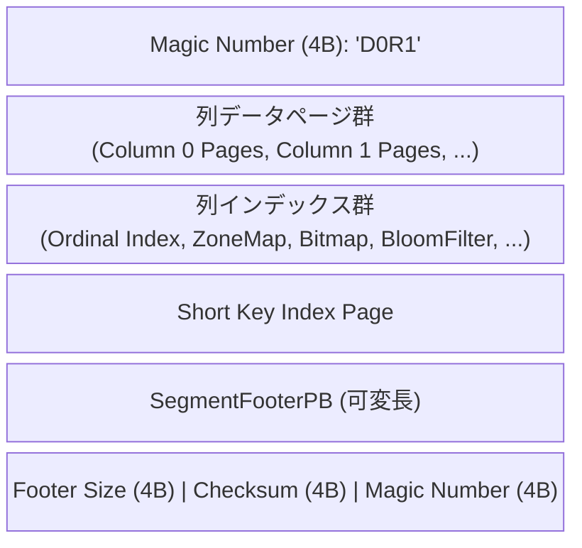
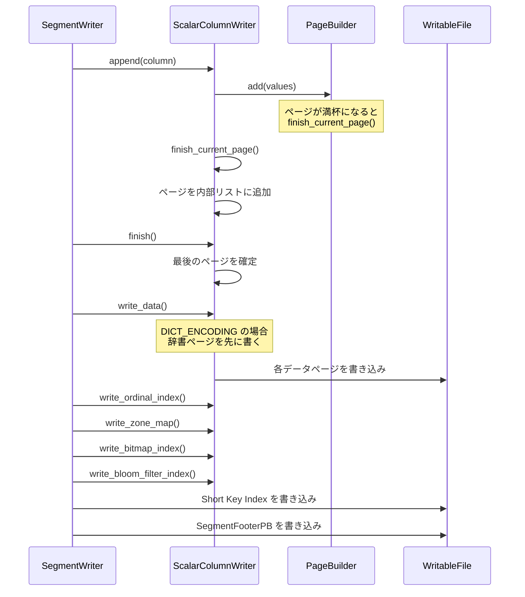
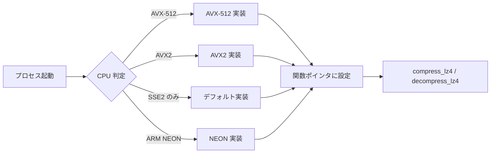

# 第17章 Segment ファイルフォーマット

> **本章で読むソース**
>
> - [`be/src/storage/rowset/segment.h`](https://github.com/StarRocks/starrocks/blob/4.1.1/be/src/storage/rowset/segment.h)
> - [`be/src/storage/rowset/segment.cpp`](https://github.com/StarRocks/starrocks/blob/4.1.1/be/src/storage/rowset/segment.cpp)
> - [`be/src/storage/rowset/segment_writer.h`](https://github.com/StarRocks/starrocks/blob/4.1.1/be/src/storage/rowset/segment_writer.h)
> - [`be/src/storage/rowset/segment_writer.cpp`](https://github.com/StarRocks/starrocks/blob/4.1.1/be/src/storage/rowset/segment_writer.cpp)
> - [`be/src/storage/rowset/column_writer.h`](https://github.com/StarRocks/starrocks/blob/4.1.1/be/src/storage/rowset/column_writer.h)
> - [`be/src/storage/rowset/column_reader.h`](https://github.com/StarRocks/starrocks/blob/4.1.1/be/src/storage/rowset/column_reader.h)
> - [`be/src/storage/rowset/column_reader.cpp`](https://github.com/StarRocks/starrocks/blob/4.1.1/be/src/storage/rowset/column_reader.cpp)
> - [`be/src/storage/rowset/page_handle.h`](https://github.com/StarRocks/starrocks/blob/4.1.1/be/src/storage/rowset/page_handle.h)
> - [`be/src/storage/rowset/encoding_info.h`](https://github.com/StarRocks/starrocks/blob/4.1.1/be/src/storage/rowset/encoding_info.h)
> - [`be/src/storage/rowset/binary_plain_page.h`](https://github.com/StarRocks/starrocks/blob/4.1.1/be/src/storage/rowset/binary_plain_page.h)
> - [`be/src/storage/rowset/bitshuffle_page.h`](https://github.com/StarRocks/starrocks/blob/4.1.1/be/src/storage/rowset/bitshuffle_page.h)
> - [`be/src/storage/rowset/bitshuffle_wrapper.cpp`](https://github.com/StarRocks/starrocks/blob/4.1.1/be/src/storage/rowset/bitshuffle_wrapper.cpp)
> - [`be/src/storage/rowset/page_io.h`](https://github.com/StarRocks/starrocks/blob/4.1.1/be/src/storage/rowset/page_io.h)
> - [`gensrc/proto/segment.proto`](https://github.com/StarRocks/starrocks/blob/4.1.1/gensrc/proto/segment.proto)

## この章の狙い

StarRocks の Tablet は複数の Rowset から構成され、各 Rowset は1つ以上の **Segment ファイル** を持つ。
Segment ファイルは列指向のストレージフォーマットであり、列ごとにエンコードされたデータページとインデックスを一つのファイルに詰め込む。
本章では Segment ファイルの物理レイアウト、メタデータ構造、書き込みフロー、読み出しフロー、エンコーディング方式、圧縮、ページキャッシュ統合を一通り読む。
最適化の工夫として、BitShuffle エンコーディングにおける SIMD ランタイムディスパッチを取り上げる。

## 前提

StarRocks の BE はデータを Tablet 単位で管理する。
Tablet は複数の Rowset を持ち、各 Rowset は複数の Segment ファイルから構成される。
書き込み時には SegmentWriter が Chunk(行の集合)を受け取り、列ごとに ColumnWriter を通じてデータページを生成する。
読み出し時には Segment がファイルを開き、列ごとの ColumnReader を生成して ColumnIterator 経由でデータを返す。

## Segment ファイルの物理レイアウト

Segment ファイルは先頭にマジックナンバー「`D0R1`」を持ち(append 時に書き込まれる)、末尾に固定長のトレーラーを持つ構造になっている。



マジックナンバーとトレーラーの定義は `segment_writer.cpp` にある。

[`be/src/storage/rowset/segment_writer.cpp` L65-L66](https://github.com/StarRocks/starrocks/blob/4.1.1/be/src/storage/rowset/segment_writer.cpp#L65-L66)

```cpp
const char* const k_segment_magic = "D0R1";
const uint32_t k_segment_magic_length = 4;
```

ファイル末尾の12バイトは固定フォーマットであり、フッターを末尾から逆向きに読み取るためのアンカーとして機能する。
この設計により、ファイル先頭のシークが不要になる。

[`be/src/storage/rowset/segment_writer.cpp` L418-L443](https://github.com/StarRocks/starrocks/blob/4.1.1/be/src/storage/rowset/segment_writer.cpp#L418-L443)

```cpp
Status SegmentWriter::_write_footer() {
    _footer.set_version(2);
    _footer.set_num_rows(_num_rows);
    // ... (中略) ...
    // Footer := SegmentFooterPB, FooterPBSize(4), FooterPBChecksum(4), MagicNumber(4)
    std::string footer_buf;
    if (!_footer.SerializeToString(&footer_buf)) {
        return Status::InternalError("failed to serialize segment footer");
    }

    faststring fixed_buf;
    // footer's size
    put_fixed32_le(&fixed_buf, footer_buf.size());
    // footer's checksum
    uint32_t checksum = crc32c::Value(footer_buf.data(), footer_buf.size());
    put_fixed32_le(&fixed_buf, checksum);
    // Append magic number. we don't write magic number in the header because
    // that will need an extra seek when reading
    fixed_buf.append(k_segment_magic, k_segment_magic_length);
    // ... (中略) ...
}

```

## SegmentFooterPB: Segment のメタデータ

Segment ファイルのメタデータは Protocol Buffers で定義された `SegmentFooterPB` に格納される。

[`gensrc/proto/segment.proto` L204-L217](https://github.com/StarRocks/starrocks/blob/4.1.1/gensrc/proto/segment.proto#L204-L217)

```protobuf
message SegmentFooterPB {
    optional uint32 version = 1 [default = 1]; // file version
    repeated ColumnMetaPB columns = 2;         // tablet schema
    optional uint32 num_rows = 3;              // number of values
    optional uint64 index_footprint = 4;       // Deprecated
    optional uint64 data_footprint = 5;        // Deprecated
    optional uint64 raw_data_footprint = 6;    // Deprecated

    optional CompressionTypePB compress_type = 7 [default = LZ4_FRAME]; // Deprecated
    repeated MetadataPairPB file_meta_datas = 8;                        // Deprecated

    // Short key index's page
    optional PagePointerPB short_key_index_page = 9;
}
```

`SegmentFooterPB` は列ごとの `ColumnMetaPB` を保持する。
`ColumnMetaPB` には列の型、エンコーディング、圧縮方式、各種インデックスのメタデータ、辞書ページへのポインタが含まれる。

[`gensrc/proto/segment.proto` L172-L203](https://github.com/StarRocks/starrocks/blob/4.1.1/gensrc/proto/segment.proto#L172-L203)

```protobuf
message ColumnMetaPB {
    optional uint32 column_id = 1;
    optional uint32 unique_id = 2;
    optional int32 type = 3;
    optional int32 length = 4;
    optional EncodingTypePB encoding = 5;
    optional CompressionTypePB compression = 6;
    optional bool is_nullable = 7;
    repeated ColumnIndexMetaPB indexes = 8;
    optional PagePointerPB dict_page = 9;
    repeated ColumnMetaPB children_columns = 10;
    // ... (中略) ...
    optional bool all_dict_encoded = 30;
    optional uint64 total_mem_footprint = 31;
    optional JsonMetaPB json_meta = 32;
    optional bytes name = 33;
}

```

フッター読み取り時には、ファイル末尾からヒントサイズ(デフォルト4096バイト)を一度に読み込み、フッターがその範囲に収まればI/Oは1回で済む。
収まらない場合のみ2回目の読み込みが発生する。
この最適化は `parse_segment_footer_internal` で実装されている。

[`be/src/storage/rowset/segment.cpp` L100-L190](https://github.com/StarRocks/starrocks/blob/4.1.1/be/src/storage/rowset/segment.cpp#L100-L190)

```cpp
StatusOr<size_t> parse_segment_footer_internal(RandomAccessFile* read_file, SegmentFooterPB* footer,
                                               size_t* footer_length_hint,
                                               const FooterPointerPB* partial_rowset_footer) {
    // Footer := SegmentFooterPB, FooterPBSize(4), FooterPBChecksum(4), MagicNumber(4)
    ASSIGN_OR_RETURN(auto file_size, read_file->get_size());
    // ... (中略) ...
    size_t hint_size = footer_length_hint ? *footer_length_hint : 4096;
    size_t footer_read_size = std::min<size_t>(hint_size, file_size);
    // ... (中略) ...
}

```

ヒントサイズが不足した場合には、次回のために128バイトの余裕を加えて更新する。

[`be/src/storage/rowset/segment.cpp` L138-L140](https://github.com/StarRocks/starrocks/blob/4.1.1/be/src/storage/rowset/segment.cpp#L138-L140)

```cpp
    if (footer_length_hint != nullptr && footer_length > *footer_length_hint) {
        *footer_length_hint = footer_length + 128 /* allocate slightly more bytes next time*/;
    }
```

## ページの構造

データページ、インデックスページ、辞書ページ、Short Key ページの4種類のページがあり、いずれも同じ汎用レイアウトに従う。

[`be/src/storage/rowset/page_io.h` L77-L83](https://github.com/StarRocks/starrocks/blob/4.1.1/be/src/storage/rowset/page_io.h#L77-L83)

```cpp
//     Page := PageBody, PageFooter, FooterSize(4), Checksum(4)
//     - PageBody is defined by page type and may be compressed
//     - PageFooter is serialized PageFooterPB. It contains page_type, uncompressed_body_size,
//       and other custom metadata. PageBody is not compressed when its size is equal to
//       uncompressed_body_size
//     - FooterSize stores the size of PageFooter
//     - Checksum is the crc32c checksum of all previous part
```

`PageFooterPB` はページ種別に応じたサブメッセージを持つ。

[`gensrc/proto/segment.proto` L131-L145](https://github.com/StarRocks/starrocks/blob/4.1.1/gensrc/proto/segment.proto#L131-L145)

```protobuf
message PageFooterPB {
    // required: indicates which of the *_footer fields is set
    optional PageTypePB type = 1;
    // required: page body size before compression (exclude footer and crc).
    // page body is uncompressed when it's equal to page body size
    optional uint32 uncompressed_size = 2;
    // present only when type == DATA_PAGE
    optional DataPageFooterPB data_page_footer = 7;
    // present only when type == INDEX_PAGE
    optional IndexPageFooterPB index_page_footer = 8;
    // present only when type == DICTIONARY_PAGE
    optional DictPageFooterPB dict_page_footer = 9;
    // present only when type == SHORT_KEY_PAGE
    optional ShortKeyFooterPB short_key_page_footer = 10;
}
```

データページのフッターには先頭行の ordinal、行数、null マップのサイズ、フォーマットバージョンが記録される。

[`gensrc/proto/segment.proto` L74-L97](https://github.com/StarRocks/starrocks/blob/4.1.1/gensrc/proto/segment.proto#L74-L97)

```protobuf
message DataPageFooterPB {
    optional uint64 first_ordinal = 1;
    optional uint64 num_values = 2;
    optional uint32 nullmap_size = 3;
    // ... (中略) ...
    optional uint32 format_version = 20;
    optional NullEncodingPB null_encoding = 21;
}

```

## ColumnWriter による書き込みフロー

SegmentWriter は列ごとに `ColumnWriter` を生成し、Chunk のデータを列単位で書き込む。
スカラー列は `ScalarColumnWriter` が担当する。

書き込みの全体フローは以下のとおりである。



### ColumnWriter の生成

SegmentWriter の `init` メソッドで、各列に対して `ColumnWriter::create` が呼ばれる。
この時点でエンコーディング、圧縮方式、ZoneMap や Bloom filter の要否が決定される。

[`be/src/storage/rowset/segment_writer.cpp` L155-L158](https://github.com/StarRocks/starrocks/blob/4.1.1/be/src/storage/rowset/segment_writer.cpp#L155-L158)

```cpp
        ColumnWriterOptions opts;
        opts.page_format = 2;
        opts.meta = _footer.add_columns();

```

ZoneMap はキー列、ソートキー列、Primary Key モデルの値列、Duplicate Key モデルのゾーンマップ対応型の列に対して作成される。

[`be/src/storage/rowset/segment_writer.cpp` L169-L174](https://github.com/StarRocks/starrocks/blob/4.1.1/be/src/storage/rowset/segment_writer.cpp#L169-L174)

```cpp
        const bool enable_pk_zone_map = config::enable_pk_value_column_zonemap &&
                                        _tablet_schema->keys_type() == KeysType::PRIMARY_KEYS &&
                                        is_zone_map_key_type(column.type());
        const bool enable_dup_zone_map =
                _tablet_schema->keys_type() == KeysType::DUP_KEYS && is_zone_map_key_type(column.type());
        opts.need_zone_map = column.is_key() || enable_pk_zone_map || enable_dup_zone_map || column.is_sort_key();
```

### Chunk の書き込み

`SegmentWriter::append_chunk` は Chunk 内の各列を対応する ColumnWriter に渡す。
同時に、ソートキーの最小値と最大値を追跡し、Short Key Index のエントリを `num_rows_per_block`(デフォルト1024行)ごとに生成する。

[`be/src/storage/rowset/segment_writer.cpp` L449-L508](https://github.com/StarRocks/starrocks/blob/4.1.1/be/src/storage/rowset/segment_writer.cpp#L449-L508)

```cpp
Status SegmentWriter::append_chunk(const Chunk& chunk) {
    size_t chunk_num_rows = chunk.num_rows();
    size_t chunk_num_columns = chunk.num_columns();
    for (size_t i = 0; i < chunk_num_columns; ++i) {
        const Column* col = chunk.get_column_raw_ptr_by_index(i);
        RETURN_IF_ERROR(_column_writers[i]->append(*col));
    }
    // ... (中略) ...
    if (_has_key) {
        // ... (中略) ...
        for (size_t i = 0; i < chunk_num_rows; i++) {
            if ((_num_rows_written % _opts.num_rows_per_block) == 0) {
                size_t keys = _tablet_schema->num_short_key_columns();
                SeekTuple tuple(*chunk.schema(), chunk.get(i).datums());
                std::string encoded_key;
                encoded_key = tuple.short_key_encode(keys, _sort_column_indexes, 0);
                RETURN_IF_ERROR(_index_builder->add_item(encoded_key));
            }
            ++_num_rows_written;
        }
    }
    // ... (中略) ...
}

```

### データとインデックスの確定

`finalize_columns` で各 ColumnWriter の `finish` と `write_data` が呼ばれる。
データページの書き込みが完了した後、ordinal index、ZoneMap、bitmap index、Bloom filter index の順にインデックスが書き込まれる。

[`be/src/storage/rowset/segment_writer.cpp` L346-L397](https://github.com/StarRocks/starrocks/blob/4.1.1/be/src/storage/rowset/segment_writer.cpp#L346-L397)

```cpp
Status SegmentWriter::finalize_columns(uint64_t* index_size) {
    // ... (中略) ...
    for (size_t i = 0; i < _column_indexes.size(); ++i) {
        // ... (中略) ...
        auto& column_writer = _column_writers[i];
        RETURN_IF_ERROR(column_writer->finish());
        // write data
        RETURN_IF_ERROR(column_writer->write_data());
        // write index
        uint64_t index_offset = _wfile->size();
        RETURN_IF_ERROR(column_writer->write_ordinal_index());
        RETURN_IF_ERROR(column_writer->write_zone_map());
        RETURN_IF_ERROR(column_writer->write_bitmap_index());
        RETURN_IF_ERROR(column_writer->write_bloom_filter_index());
        RETURN_IF_ERROR(column_writer->write_inverted_index());
        // ... (中略) ...
    }
    // ... (中略) ...
}

```

DICT_ENCODING が使われている場合、データページより先に辞書ページが書き込まれる。
読み出し時に辞書を先にロードする必要があるためである。

[`be/src/storage/rowset/column_writer.cpp` L489-L526](https://github.com/StarRocks/starrocks/blob/4.1.1/be/src/storage/rowset/column_writer.cpp#L489-L526)

```cpp
Status ScalarColumnWriter::write_data() {
    // dict will be load before data,
    // so write column dict first
    if (_encoding_info->encoding() == DICT_ENCODING) {
        faststring* dict_body = _page_builder->get_dictionary_page();
        // ... (中略) ...
        PagePointer dict_pp;
        std::vector<Slice> body{Slice(*dict_body)};
        RETURN_IF_ERROR(PageIO::compress_and_write_page(_compress_codec, _opts.compression_min_space_saving, _wfile,
                                                        body, footer, &dict_pp));
        dict_pp.to_proto(_opts.meta->mutable_dict_page());
    }
    // ... (中略) ...
}

```

## ColumnReader による読み出しフロー

### Segment のオープン

`Segment::open` はファイル末尾からフッターを読み取り、`_create_column_readers` で列ごとの `ColumnReader` を生成する。

[`be/src/storage/rowset/segment.cpp` L267-L286](https://github.com/StarRocks/starrocks/blob/4.1.1/be/src/storage/rowset/segment.cpp#L267-L286)

```cpp
Status Segment::_open(size_t* footer_length_hint, const FooterPointerPB* partial_rowset_footer,
                      const LakeIOOptions& lake_io_opts) {
    SegmentFooterPB footer;
    // ... (中略) ...
    ASSIGN_OR_RETURN(auto read_file, _fs->new_random_access_file_with_bundling(opts, _segment_file_info));
    RETURN_IF_ERROR(Segment::parse_segment_footer(read_file.get(), &footer, footer_length_hint, partial_rowset_footer));
    RETURN_IF_ERROR(_create_column_readers(&footer));
    _num_rows = footer.num_rows();
    _short_key_index_page = PagePointer(footer.short_key_index_page());
    return Status::OK();
}

```

`_create_column_readers` は `ColumnMetaPB` と `TabletSchema` の列情報を突合し、unique_id をキーに `ColumnReader` を登録する。

[`be/src/storage/rowset/segment.cpp` L432-L448](https://github.com/StarRocks/starrocks/blob/4.1.1/be/src/storage/rowset/segment.cpp#L432-L448)

```cpp
Status Segment::_create_column_readers(SegmentFooterPB* footer) {
    std::unordered_map<uint32_t, uint32_t> column_id_to_footer_ordinal;
    RETURN_IF_ERROR(_check_column_unique_id_uniqueness(footer, column_id_to_footer_ordinal));
    for (uint32_t ordinal = 0, sz = _tablet_schema->num_columns(); ordinal < sz; ++ordinal) {
        const auto& column = _tablet_schema->column(ordinal);
        auto iter = column_id_to_footer_ordinal.find(column.unique_id());
        if (iter == column_id_to_footer_ordinal.end()) {
            continue;
        }

        auto res = ColumnReader::create(footer->mutable_columns(iter->second), this, &column);
        if (!res.ok()) {
            return res.status();
        }
        _column_readers.emplace(column.unique_id(), std::move(res).value());
    }
    return Status::OK();
```

### ColumnReader の初期化

`ColumnReader::_init` は `ColumnMetaPB` からエンコーディング情報と圧縮コーデックを取得し、各種インデックスのメタデータを解析する。

[`be/src/storage/rowset/column_reader.cpp` L131-L355](https://github.com/StarRocks/starrocks/blob/4.1.1/be/src/storage/rowset/column_reader.cpp#L131-L355)

```cpp
Status ColumnReader::_init(ColumnMetaPB* meta, const TabletColumn* column) {
    _column_type = static_cast<LogicalType>(meta->type());
    _column_length = meta->length();
    _dict_page_pointer = PagePointer(meta->dict_page());
    // ... (中略) ...
    if (is_scalar_field_type(delegate_type(_column_type))) {
        RETURN_IF_ERROR(EncodingInfo::get(delegate_type(_column_type), meta->encoding(), &_encoding_info));
        RETURN_IF_ERROR(get_block_compression_codec(meta->compression(), &_compress_codec));

        for (int i = 0; i < meta->indexes_size(); i++) {
            auto* index_meta = meta->mutable_indexes(i);
            switch (index_meta->type()) {
            case ORDINAL_INDEX:
                _ordinal_index_meta.reset(index_meta->release_ordinal_index());
                // ... (中略) ...
                _ordinal_index = std::make_unique<OrdinalIndexReader>();
                break;
            case ZONE_MAP_INDEX:
                // ... (中略) ...
                break;
            case BITMAP_INDEX:
                // ... (中略) ...
                break;
            case BLOOM_FILTER_INDEX:
                // ... (中略) ...
                break;
            }
        }
    }
    // ... (中略) ...
}

```

インデックスのメタデータ(Protobuf オブジェクト)は `ColumnMetaPB` から `release_xxx()` で所有権を移す。
これにより、フッター全体を保持し続ける必要がなくなり、メモリ消費が抑えられる。

### データページの読み出し

`ColumnReader::read_page` は `PageIO::read_and_decompress_page` を呼び出して、ファイルからページを読み取り、解凍する。

[`be/src/storage/rowset/column_reader.cpp` L362-L375](https://github.com/StarRocks/starrocks/blob/4.1.1/be/src/storage/rowset/column_reader.cpp#L362-L375)

```cpp
Status ColumnReader::read_page(const ColumnIteratorOptions& iter_opts, const PagePointer& pp, PageHandle* handle,
                               Slice* page_body, PageFooterPB* footer) {
    iter_opts.sanity_check();
    PageReadOptions opts;
    opts.read_file = iter_opts.read_file;
    opts.page_pointer = pp;
    opts.codec = _compress_codec;
    opts.stats = iter_opts.stats;
    opts.verify_checksum = true;
    opts.use_page_cache = iter_opts.use_page_cache;
    opts.encoding_type = _encoding_info->encoding();

    return PageIO::read_and_decompress_page(opts, handle, page_body, footer);
}
```

Ordinal index を使ってページ単位でのシークも可能である。
ordinal に対応するページを見つけてから、ページ内で目的の行に移動する2段階のシークが行われる。

### Segment 内のインデックス

各列には複数のインデックスが付与される。
以下にインデックスの種別と用途を整理する。

| インデックス種別 | 説明 |
|----------------|------|
| Ordinal Index | 各データページの先頭 ordinal を記録し、ordinal によるページ特定を可能にする |
| ZoneMap Index | ページごとの最小値と最大値を記録し、述語によるページスキップを可能にする |
| Bitmap Index | 各値に対する Roaring Bitmap を保持し、等値述語のフィルタリングに使う |
| Bloom Filter Index | ページごとの Bloom filter を保持し、等値述語の偽陽性ベースのスキップに使う |
| Short Key Index | Segment 全体に1つ存在し、ソートキーのプレフィックスで行ブロックを特定する |

インデックスの読み込みは遅延ロード方式である。
たとえば ordinal index は `ColumnReader::load_ordinal_index` で初めてロードされ、ロード後にメタデータ用の Protobuf を解放してメモリを節約する。

[`be/src/storage/rowset/column_reader.cpp` L482-L496](https://github.com/StarRocks/starrocks/blob/4.1.1/be/src/storage/rowset/column_reader.cpp#L482-L496)

```cpp
Status ColumnReader::load_ordinal_index(const IndexReadOptions& opts) {
    if (_ordinal_index == nullptr || _ordinal_index->loaded()) return Status::OK();
    SCOPED_THREAD_LOCAL_CHECK_MEM_LIMIT_SETTER(false);
    auto meta = _ordinal_index_meta.get();
    ASSIGN_OR_RETURN(auto first_load, _ordinal_index->load(opts, *meta, num_rows()));
    if (UNLIKELY(first_load)) {
        MEM_TRACKER_SAFE_RELEASE(GlobalEnv::GetInstance()->ordinal_index_mem_tracker(),
                                 _ordinal_index_meta->SpaceUsedLong());
        _meta_mem_usage.fetch_sub(_ordinal_index_meta->SpaceUsedLong(), std::memory_order_relaxed);
        _meta_mem_usage.fetch_add(_ordinal_index->mem_usage(), std::memory_order_relaxed);
        _ordinal_index_meta.reset();
        _segment->update_cache_size();
    }
    return Status::OK();
}
```

## エンコーディング方式

StarRocks は列の型に応じて複数のエンコーディング方式を使い分ける。
`EncodingInfo` クラスがデータ型とエンコーディング型の組み合わせから PageBuilder / PageDecoder を生成する。

[`gensrc/proto/segment.proto` L49-L58](https://github.com/StarRocks/starrocks/blob/4.1.1/gensrc/proto/segment.proto#L49-L58)

```protobuf
enum EncodingTypePB {
    UNKNOWN_ENCODING = 0;
    DEFAULT_ENCODING = 1;
    PLAIN_ENCODING = 2;
    PREFIX_ENCODING = 3;
    RLE = 4;
    DICT_ENCODING = 5;
    BIT_SHUFFLE = 6;
    FOR_ENCODING = 7; // Frame-Of-Reference
}
```

型とデフォルトエンコーディングの対応は以下のとおりである。

| データ型 | デフォルトエンコーディング | 値シーク最適化時 |
|---------|----------------------|---------------|
| TINYINT, SMALLINT, INT, BIGINT, FLOAT, DOUBLE 等 | BIT_SHUFFLE | FOR_ENCODING |
| CHAR, VARCHAR | DICT_ENCODING | PREFIX_ENCODING |
| BOOLEAN | RLE | RLE |
| DATE, DATETIME | BIT_SHUFFLE | FOR_ENCODING |
| DECIMAL | BIT_SHUFFLE | FOR_ENCODING |

`EncodingInfo::get_default_encoding` でデフォルトが決定される。
数値型は辞書エンコーディングの設定比率 (`dictionary_encoding_ratio_for_non_string_column`) が非ゼロであれば DICT_ENCODING が使われる場合もある。

[`be/src/storage/rowset/encoding_info.cpp` L188-L199](https://github.com/StarRocks/starrocks/blob/4.1.1/be/src/storage/rowset/encoding_info.cpp#L188-L199)

```cpp
    EncodingTypePB get_default_encoding(LogicalType type, bool optimize_value_seek) const {
        if (enable_non_string_column_dict_encoding() && numeric_types_support_dict_encoding(delegate_type(type)) &&
            !optimize_value_seek) {
            return DICT_ENCODING;
        }
        auto& encoding_map = optimize_value_seek ? _value_seek_encoding_map : _default_encoding_type_map;
        auto it = encoding_map.find(delegate_type(type));
        if (it != encoding_map.end()) {
            return it->second;
        }
        return UNKNOWN_ENCODING;
    }
```

### Plain エンコーディング

`BinaryPlainPageBuilder` は可変長文字列向けの単純なエンコーディングである。
文字列データを連続して格納し、末尾にオフセット配列と要素数を付加する。

[`be/src/storage/rowset/binary_plain_page.h` L36-L45](https://github.com/StarRocks/starrocks/blob/4.1.1/be/src/storage/rowset/binary_plain_page.h#L36-L45)

```text
//
// The page consists of:
// Strings:
//   raw strings that were written
// Trailer
//  Offsets:
//    offsets pointing to the beginning of each string
//  num_elems (32-bit fixed)
//

```

書き込み時、各文字列はバッファに追記され、そのオフセットが記録される。

[`be/src/storage/rowset/binary_plain_page.h` L94-L106](https://github.com/StarRocks/starrocks/blob/4.1.1/be/src/storage/rowset/binary_plain_page.h#L94-L106)

```cpp
    bool add_slice(const Slice& s) {
        if (is_page_full()) {
            return false;
        }
        DCHECK_EQ(_buffer.size(), _reserved_head_size + _next_offset);
        _offsets.push_back(_next_offset);
        _buffer.append(s.data, s.size);

        _next_offset += s.size;
        _size_estimate += s.size;
        _size_estimate += sizeof(uint32_t);
        return true;
    }
```

### BitShuffle エンコーディング

`BitshufflePageBuilder` は固定長数値型向けのエンコーディングである。
bitshuffle アルゴリズムでビット列を転置した後に LZ4 で圧縮する。

ページフォーマットは16バイトのヘッダーと圧縮データで構成される。

[`be/src/storage/rowset/bitshuffle_page.h` L69-L100](https://github.com/StarRocks/starrocks/blob/4.1.1/be/src/storage/rowset/bitshuffle_page.h#L69-L100)

```text
// The page format is as follows:
//
// 1. Header: (16 bytes total)
//
//    <num_elements> [32-bit]
//      The number of elements encoded in the page.
//
//    <compressed_size> [32-bit]
//      The post-compression size of the page, including this header.
//
//    <padded_num_elements> [32-bit]
//      Padding is needed to meet the requirements of the bitshuffle
//      library such that the input/output is a multiple of 8. Some
//      ignored elements are appended to the end of the page if necessary
//      to meet this requirement.
//
//      This header field is the post-padding element count.
//
//    <elem_size_bytes> [32-bit]
//      The size of the elements, in bytes, as actually encoded. In the
//      case that all of the data in a page can fit into a smaller
//      integer type, then we may choose to encode that smaller type
//      to save CPU costs.
//
//      This is currently only implemented in the UINT32 page type.
//
//   NOTE: all on-disk ints are encoded little-endian
//
// 2. Element data
//
//    The header is followed by the bitshuffle-compressed element data.
//
```

ヘッダーの `BITSHUFFLE_PAGE_HEADER_SIZE` は16バイトに定義されている。

書き込み処理では、入力要素を8の倍数にパディングしてから bitshuffle + LZ4 圧縮を行う。

[`be/src/storage/rowset/bitshuffle_page.h` L201-L229](https://github.com/StarRocks/starrocks/blob/4.1.1/be/src/storage/rowset/bitshuffle_page.h#L201-L229)

```cpp
    faststring* _finish() {
        // Do padding so that the input num of element is multiple of 8.
        int num_elems_after_padding = ALIGN_UP(_count, 8U);
        int padding_elems = num_elems_after_padding - _count;
        int padding_bytes = padding_elems * SIZE_OF_TYPE;
        for (int i = 0; i < padding_bytes; i++) {
            _data.push_back(0);
        }

        _compressed_data.resize(_reserved_head_size + BITSHUFFLE_PAGE_HEADER_SIZE +
                                bitshuffle::compress_lz4_bound(num_elems_after_padding, SIZE_OF_TYPE, 0));

        uint8_t* compressed_data = _compressed_data.data() + _reserved_head_size;
        uint8_t* uncompressed_data = _data.data();

        int64_t bytes = bitshuffle::compress_lz4(uncompressed_data, &compressed_data[BITSHUFFLE_PAGE_HEADER_SIZE],
                                                 num_elems_after_padding, SIZE_OF_TYPE, 0);
        CHECK_GE(bytes, 0) << "Fail to bitshuffle compress, " << bitshuffle_error_msg(bytes);
        // update header
        encode_fixed32_le(&compressed_data[0], _count);
        encode_fixed32_le(&compressed_data[4], BITSHUFFLE_PAGE_HEADER_SIZE + bytes);
        encode_fixed32_le(&compressed_data[8], num_elems_after_padding);
        encode_fixed32_le(&compressed_data[12], SIZE_OF_TYPE);
        // ... (中略) ...
    }

```

デコード側では、ヘッダーからメタ情報を復元し、展開済みデータにゼロコピーでアクセスする。
`next_batch` ではデータポインタを直接 Column に渡すことで、メモリコピーを回避している。

[`be/src/storage/rowset/bitshuffle_page.h` L391-L421](https://github.com/StarRocks/starrocks/blob/4.1.1/be/src/storage/rowset/bitshuffle_page.h#L391-L421)

```cpp
template <LogicalType Type>
inline Status BitShufflePageDecoder<Type>::next_batch(const SparseRange<>& range, Column* dst) {
    DCHECK(_parsed);
    // ... (中略) ...
    SparseRangeIterator<> iter = range.new_iterator();
    while (to_read > 0) {
        _cur_index = iter.begin();
        Range<> r = iter.next(to_read);
        ContainerResource container(_page_handle, get_data(_cur_index * SIZE_OF_TYPE), r.span_size() * SIZE_OF_TYPE);
        int n = dst->append_numbers(container);
        DCHECK_EQ(r.span_size(), n);
        _cur_index += r.span_size();
        to_read -= r.span_size();
    }
    return Status::OK();
}

```

## PageHandle によるキャッシュ統合

ページデータは PageCache に格納される場合と、キャッシュを経由せずに直接メモリに保持される場合がある。
`PageHandleTmpl` がこの2つのケースを統一的に扱う。

[`be/src/storage/rowset/page_handle.h` L47-L116](https://github.com/StarRocks/starrocks/blob/4.1.1/be/src/storage/rowset/page_handle.h#L47-L116)

```cpp
template <class PageType>
class PageHandleTmpl {
public:
    PageHandleTmpl() = default;

    // This class will take the ownership of input data's memory. It will
    // free it when deconstructs.
    explicit PageHandleTmpl(PageType* data) : _is_data_owner(true), _data(data) {}

    // This class will take the content of cache data, and will make input
    // cache_data to an invalid cache handle.
    explicit PageHandleTmpl(PageCacheHandle&& cache_data) : _cache_data(std::move(cache_data)) {}

    // ... (中略) ...

    const PageType* data() const {
        if (_is_data_owner) {
            return _data;
        } else {
            return reinterpret_cast<const PageType*>(_cache_data.data());
        }
    }

    int64_t mem_usage() const {
        if (_is_data_owner) {
            return _data->size();
        } else {
            return 0;
        }
    }
    // ... (中略) ...
private:
    bool _is_data_owner = false;
    PageType* _data = nullptr;
    PageCacheHandle _cache_data;
};

```

`_is_data_owner` が `true` の場合、PageHandle がデータのメモリを所有し、デストラクタで解放する。
`false` の場合、`PageCacheHandle` がキャッシュエントリの参照を保持し、キャッシュの LRU ポリシーに従って管理される。
`mem_usage()` はキャッシュ経由の場合に0を返す。
キャッシュ側がメモリ管理を担当しているため、二重カウントを避ける設計である。

## 圧縮

StarRocks はページレベルの圧縮をサポートする。
圧縮方式は CREATE TABLE 文で指定でき、列のメタデータ(`ColumnMetaPB::compression`)に記録される。

圧縮の適用は `PageIO::compress_and_write_page` で行われる。
圧縮後のサイズが元のサイズに対して `compression_min_space_saving`(デフォルト10%)以上の削減にならない場合、圧縮は適用されず非圧縮のまま書き込まれる。

[`be/src/storage/rowset/page_io.h` L99-L109](https://github.com/StarRocks/starrocks/blob/4.1.1/be/src/storage/rowset/page_io.h#L99-L109)

```cpp
    static Status compress_and_write_page(const BlockCompressionCodec* codec, double min_space_saving,
                                          WritableFile* wfile, const std::vector<Slice>& body,
                                          const PageFooterPB& footer, PagePointer* result) {
        DCHECK_EQ(footer.uncompressed_size(), Slice::compute_total_size(body));
        faststring compressed_body;
        RETURN_IF_ERROR(compress_page_body(codec, min_space_saving, body, &compressed_body));
        if (compressed_body.size() == 0) { // uncompressed
            return write_page(wfile, body, footer, result);
        }
        return write_page(wfile, {Slice(compressed_body)}, footer, result);
    }
```

ページフッターの `uncompressed_size` と実際のページボディサイズを比較することで、読み出し時に圧縮の有無を判定する。
両者が等しければ非圧縮である。

サポートされる圧縮コーデックは LZ4, ZSTD, Snappy, ZLIB 等であり、`get_block_compression_codec` で取得される。
BitShuffle エンコーディングの場合、bitshuffle 自身が LZ4 圧縮を内蔵しているため、ページレベル圧縮とは独立に動作する。

## 高速化の工夫: BitShuffle の SIMD ランタイムディスパッチ

BitShuffle エンコーディングは StarRocks の数値型列で広く使われるエンコーディングである。
このエンコーディングが高速に動作する理由の一つは、bitshuffle ライブラリのランタイム SIMD ディスパッチにある。

`bitshuffle_wrapper.cpp` はプロセス起動時にCPU命令セットを検出し、利用可能な最速の実装を関数ポインタに設定する。

[`be/src/storage/rowset/bitshuffle_wrapper.cpp` L90-L115](https://github.com/StarRocks/starrocks/blob/4.1.1/be/src/storage/rowset/bitshuffle_wrapper.cpp#L90-L115)

```cpp
__attribute__((constructor)) void SelectBitshuffleFunctions() {
#if (defined(__i386) || defined(__x86_64__))
    if (CPU().has_avx512f() && CPU().has_avx512bw()) {
        g_bshuf_compress_lz4_bound = bshuf_compress_lz4_bound_avx512;
        g_bshuf_compress_lz4 = bshuf_compress_lz4_avx512;
        g_bshuf_decompress_lz4 = bshuf_decompress_lz4_avx512;
    } else if (CPU().has_avx2()) {
        g_bshuf_compress_lz4_bound = bshuf_compress_lz4_bound_avx2;
        g_bshuf_compress_lz4 = bshuf_compress_lz4_avx2;
        g_bshuf_decompress_lz4 = bshuf_decompress_lz4_avx2;
    } else {
        g_bshuf_compress_lz4_bound = bshuf_compress_lz4_bound;
        g_bshuf_compress_lz4 = bshuf_compress_lz4;
        g_bshuf_decompress_lz4 = bshuf_decompress_lz4;
    }
#elif defined(__ARM_NEON) && defined(__aarch64__)
    g_bshuf_compress_lz4_bound = bshuf_compress_lz4_bound_neon;
    g_bshuf_compress_lz4 = bshuf_compress_lz4_neon;
    g_bshuf_decompress_lz4 = bshuf_decompress_lz4_neon;
#else
    // ... (中略) ...
#endif
}

```

x86_64 環境では AVX-512、AVX2、SSE2(デフォルト)の3段階、ARM 環境では NEON が選択される。
`__attribute__((constructor))` により、`main` 関数より前に関数ポインタが設定されるため、ホットパスでの `cpuid` 呼び出しが不要になる。

bitshuffle の圧縮と展開は、この関数ポインタ経由で呼び出される。

[`be/src/storage/rowset/bitshuffle_wrapper.cpp` L116-L124](https://github.com/StarRocks/starrocks/blob/4.1.1/be/src/storage/rowset/bitshuffle_wrapper.cpp#L116-L124)

```cpp
int64_t compress_lz4(void* in, void* out, size_t size, size_t elem_size, size_t block_size) {
    return g_bshuf_compress_lz4(in, out, size, elem_size, block_size);
}
int64_t decompress_lz4(void* in, void* out, size_t size, size_t elem_size, size_t block_size) {
    return g_bshuf_decompress_lz4(in, out, size, elem_size, block_size);
}
size_t compress_lz4_bound(size_t size, size_t elem_size, size_t block_size) {
    return g_bshuf_compress_lz4_bound(size, elem_size, block_size);
}
```

bitshuffle はビット単位の転置処理を行うため、SIMD 命令の恩恵が大きい。
たとえば32ビット整数の配列では、同じビット位置のビットを連続させてから LZ4 で圧縮するため、値の分布が偏っているデータでは高い圧縮率が得られる。
AVX2 では256ビット幅のレジスタを使い、AVX-512 では512ビット幅で処理するため、ビット転置のスループットが大幅に向上する。



## まとめ

Segment ファイルは末尾に固定長トレーラーと可変長の `SegmentFooterPB` を持つ列指向フォーマットである。
列データは PageBuilder でエンコードされたデータページとして書き込まれ、ordinal index、ZoneMap、Bloom filter 等のインデックスがページ単位で付与される。
読み出し時には Segment がフッターを解析して ColumnReader を生成し、ColumnReader は遅延ロード方式でインデックスをロードする。
エンコーディングは型に応じて BitShuffle(数値型)、DICT_ENCODING(文字列型)、RLE(真偽値型)が選択され、BitShuffle はランタイム SIMD ディスパッチにより AVX-512 / AVX2 / NEON の最適な実装が自動的に使用される。

## 関連する章

- 第14章「Column と Chunk」: Segment から読み出したデータを格納する Column と Chunk の内部構造
- 第16章「Tablet と Rowset」: Segment を束ねる Rowset と、それを管理する Tablet の構造
- 第18章「列インデックスと述語フィルタリング」: ZoneMap、Bloom filter、Bitmap index を使ったスキャン最適化
