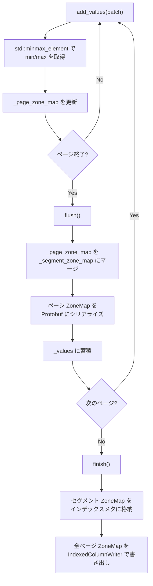
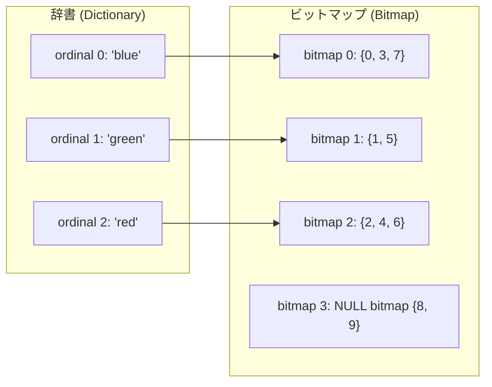
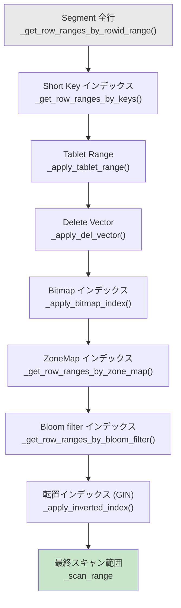

# 第18章 インデックスサブシステム

> **本章で読むソース**
>
> - [`be/src/storage/zone_map_detail.h`](https://github.com/StarRocks/starrocks/blob/4.1.1/be/src/storage/zone_map_detail.h)
> - [`be/src/storage/rowset/zone_map_index.h`](https://github.com/StarRocks/starrocks/blob/4.1.1/be/src/storage/rowset/zone_map_index.h)
> - [`be/src/storage/rowset/zone_map_index.cpp`](https://github.com/StarRocks/starrocks/blob/4.1.1/be/src/storage/rowset/zone_map_index.cpp)
> - [`be/src/storage/short_key_index.h`](https://github.com/StarRocks/starrocks/blob/4.1.1/be/src/storage/short_key_index.h)
> - [`be/src/util/bloom_filter.h`](https://github.com/StarRocks/starrocks/blob/4.1.1/be/src/util/bloom_filter.h)
> - [`be/src/storage/rowset/bloom_filter_index_writer.h`](https://github.com/StarRocks/starrocks/blob/4.1.1/be/src/storage/rowset/bloom_filter_index_writer.h)
> - [`be/src/storage/rowset/bloom_filter_index_writer.cpp`](https://github.com/StarRocks/starrocks/blob/4.1.1/be/src/storage/rowset/bloom_filter_index_writer.cpp)
> - [`be/src/storage/rowset/bloom_filter_index_reader.h`](https://github.com/StarRocks/starrocks/blob/4.1.1/be/src/storage/rowset/bloom_filter_index_reader.h)
> - [`be/src/storage/rowset/bloom_filter_index_reader.cpp`](https://github.com/StarRocks/starrocks/blob/4.1.1/be/src/storage/rowset/bloom_filter_index_reader.cpp)
> - [`be/src/storage/rowset/bitmap_index_writer.h`](https://github.com/StarRocks/starrocks/blob/4.1.1/be/src/storage/rowset/bitmap_index_writer.h)
> - [`be/src/storage/rowset/bitmap_index_reader.h`](https://github.com/StarRocks/starrocks/blob/4.1.1/be/src/storage/rowset/bitmap_index_reader.h)
> - [`be/src/storage/rowset/ordinal_page_index.h`](https://github.com/StarRocks/starrocks/blob/4.1.1/be/src/storage/rowset/ordinal_page_index.h)
> - [`be/src/storage/rowset/ordinal_page_index.cpp`](https://github.com/StarRocks/starrocks/blob/4.1.1/be/src/storage/rowset/ordinal_page_index.cpp)
> - [`be/src/storage/rowset/segment_iterator.cpp`](https://github.com/StarRocks/starrocks/blob/4.1.1/be/src/storage/rowset/segment_iterator.cpp)

## この章の狙い

列指向ストレージでは、クエリが必要とする行だけを効率よく特定することが性能を左右する。
StarRocks は Segment 内に複数種のインデックスを埋め込み、述語に該当しないデータページを読み出し前にスキップする仕組みを備えている。
本章では ZoneMap, Short Key, Bloom filter, Bitmap, Ordinal の5種のインデックスについて、書き込みと読み出しの両方の実装を読む。
最後に `SegmentIterator` がこれらのインデックスをどの順序で適用し、段階的にスキャン範囲を狭めていくかを追う。

## 前提

StarRocks のストレージ層は Tablet を Rowset の集合として管理し、各 Rowset は1つ以上の Segment ファイルから構成される。
Segment 内部では、各 Column のデータが複数のデータページに分割されて格納されている。
各データページは行番号(Ordinal)で範囲づけられ、ページ単位での読み飛ばしがスキャン性能に直結する。
本章で扱うインデックスはすべて Column 単位で構築され、Segment ファイル内に永続化される。

## ZoneMap インデックス

### ZoneMapDetail: 実行時の統計表現

**ZoneMapDetail** は、あるゾーン(ページまたは Segment 全体)の最小値、最大値、NULL の有無を保持するクラスである。

[`be/src/storage/zone_map_detail.h` L23-L57](https://github.com/StarRocks/starrocks/blob/4.1.1/be/src/storage/zone_map_detail.h#L23-L57)

```cpp
class ZoneMapDetail {
public:
    ZoneMapDetail() = default;
    ZoneMapDetail(const Datum& min_or_null_value, Datum max_value)
            : _has_null(min_or_null_value.is_null()),
              _min_value(min_or_null_value),
              _max_value(std::move(max_value)),
              _num_rows(0) {}
    // ...
    bool has_null() const { return _has_null; }
    bool has_not_null() const { return !_min_value.is_null() || !_max_value.is_null(); }
    const Datum& min_or_null_value() const {
        if (_has_null) return _null_value;
        return _min_value;
    }
    void set_num_rows(const size_t num_rows) { _num_rows = num_rows; }

private:
    bool _has_null;
    Datum _null_value;
    Datum _min_value;
    Datum _max_value;
    size_t _num_rows;
};

```

`has_null()` と `has_not_null()` の2つのフラグで、そのゾーンの NULL 状態を4通りに区別できる。
両方とも false なら行が存在しない。
`has_null` だけが true なら全行が NULL。
両方 true なら NULL と非 NULL が混在している。
このクラスは述語評価の段階で、Column イテレーターがページごとの ZoneMap を呼び出し側に返すために使われる。

### 書き込み: ページレベルとセグメントレベルの統計収集

**ZoneMapIndexWriter** は Column ごとに1つ作成され、データ書き込み時にページ単位の min/max 統計を収集する。
内部実装の `ZoneMapIndexWriterImpl` は `LogicalType` でテンプレート化されている。

書き込みの流れは3段階で構成される。

1. `add_values()` でページ内の値を受け取り、ページ単位の ZoneMap (`_page_zone_map`) を更新する
2. `flush()` でページの ZoneMap を確定し、セグメント単位の ZoneMap (`_segment_zone_map`) にマージする
3. `finish()` ですべてのページ ZoneMap を IndexedColumnWriter 経由でファイルに書き出す

`add_values()` では `std::minmax_element` で一括して最小値と最大値を求め、既存のページ ZoneMap と比較して更新する。

[`be/src/storage/rowset/zone_map_index.cpp` L256-L282](https://github.com/StarRocks/starrocks/blob/4.1.1/be/src/storage/rowset/zone_map_index.cpp#L256-L282)

```cpp
template <LogicalType type>
void ZoneMapIndexWriterImpl<type>::add_values(const void* values, size_t count) {
    if (count > 0) {
        const auto* vals = reinterpret_cast<const CppType*>(values);
        auto [pmin, pmax] = std::minmax_element(vals, vals + count);

        if (_page_zone_map.has_not_null) {
            if (unaligned_load<CppType>(pmin) < _page_zone_map.min_value.value) {
                _page_zone_map.min_value.resize_container_for_fit(_type_info, pmin);
                _type_info->direct_copy(&_page_zone_map.min_value.value, pmin);
                _truncate_string_minmax_if_needed(&_page_zone_map);
            }
            if (unaligned_load<CppType>(pmax) > _page_zone_map.max_value.value) {
                _page_zone_map.max_value.resize_container_for_fit(_type_info, pmax);
                _type_info->direct_copy(&_page_zone_map.max_value.value, pmax);
                _truncate_string_minmax_if_needed(&_page_zone_map);
            }
        } else {
            // 初回: min/max を直接コピー
            _page_zone_map.min_value.resize_container_for_fit(_type_info, pmin);
            _type_info->direct_copy(&_page_zone_map.min_value.value, pmin);
            _page_zone_map.max_value.resize_container_for_fit(_type_info, pmax);
            _type_info->direct_copy(&_page_zone_map.max_value.value, pmax);
            _truncate_string_minmax_if_needed(&_page_zone_map);
        }
        _page_zone_map.has_not_null = true;
    }
}

```

構造化バインディング `auto [pmin, pmax]` で最小値と最大値のポインタを同時に取得し、ページ ZoneMap の既存値と比較して更新するか初回設定するかを `has_not_null` で分岐している。

`flush()` ではページ ZoneMap をセグメント ZoneMap にマージし、Protobuf にシリアライズしてから `_values` ベクタに蓄積する。

[`be/src/storage/rowset/zone_map_index.cpp` L285-L326](https://github.com/StarRocks/starrocks/blob/4.1.1/be/src/storage/rowset/zone_map_index.cpp#L285-L326)

```cpp
template <LogicalType type>
Status ZoneMapIndexWriterImpl<type>::flush() {
    // Update segment zone map.
    if (_page_zone_map.has_not_null) {
        if (_segment_zone_map.has_not_null) {
            if (_page_zone_map.min_value.value < _segment_zone_map.min_value.value) {
                // ... ページ min がセグメント min より小さければ更新
            }
            if (_page_zone_map.max_value.value > _segment_zone_map.max_value.value) {
                // ... ページ max がセグメント max より大きければ更新
            }
        } else {
            // セグメント ZoneMap の初回設定
            // ...
        }
        _segment_zone_map.has_not_null = true;
    }
    if (_page_zone_map.has_null) {
        _segment_zone_map.has_null = true;
    }

    ZoneMapPB zone_map_pb;
    _page_zone_map.to_proto(&zone_map_pb, _type_info);
    _reset_zone_map(&_page_zone_map);

    std::string serialized_zone_map;
    bool ret = zone_map_pb.SerializeToString(&serialized_zone_map);
    // ...
    _values.push_back(std::move(serialized_zone_map));
    return Status::OK();
}

```

`finish()` ではセグメント ZoneMap をインデックスメタに書き込み、蓄積した全ページ ZoneMap を IndexedColumnWriter で永続化する。
セグメント ZoneMap はメタデータに直接格納されるため、ページを一切読まずに Segment 全体のスキップ判定ができる。

[`be/src/storage/rowset/zone_map_index.cpp` L352-L374](https://github.com/StarRocks/starrocks/blob/4.1.1/be/src/storage/rowset/zone_map_index.cpp#L352-L374)

```cpp
template <LogicalType type>
Status ZoneMapIndexWriterImpl<type>::finish(WritableFile* wfile, ColumnIndexMetaPB* index_meta) {
    index_meta->set_type(ZONE_MAP_INDEX);
    ZoneMapIndexPB* meta = index_meta->mutable_zone_map_index();
    // store segment zone map
    _segment_zone_map.to_proto(meta->mutable_segment_zone_map(), _type_info);

    // write out zone map for each data pages
    TypeInfoPtr typeinfo = get_type_info(TYPE_OBJECT);
    IndexedColumnWriterOptions options;
    options.write_ordinal_index = true;
    options.write_value_index = false;
    // ...
    IndexedColumnWriter writer(options, typeinfo, wfile);
    RETURN_IF_ERROR(writer.init());
    for (auto& value : _values) {
        Slice value_slice(value);
        RETURN_IF_ERROR(writer.add(&value_slice));
    }
    return writer.finish(meta->mutable_page_zone_maps());
}

```

以下の図は ZoneMap の書き込みフローをまとめたものである。



### 読み出しとページプルーニング

**ZoneMapIndexReader** は `load()` で全ページの ZoneMap をメモリに読み込み、`_page_zone_maps` ベクタとしてキャッシュする。

[`be/src/storage/rowset/zone_map_index.cpp` L397-L433](https://github.com/StarRocks/starrocks/blob/4.1.1/be/src/storage/rowset/zone_map_index.cpp#L397-L433)

```cpp
Status ZoneMapIndexReader::_do_load(const IndexReadOptions& opts, const ZoneMapIndexPB& meta) {
    IndexedColumnReader reader(meta.page_zone_maps());
    RETURN_IF_ERROR(reader.load(opts));
    std::unique_ptr<IndexedColumnIterator> iter;
    RETURN_IF_ERROR(reader.new_iterator(opts, &iter));

    _page_zone_maps.resize(reader.num_values());

    // read and cache all page zone maps
    for (int i = 0; i < reader.num_values(); ++i) {
        RETURN_IF_ERROR(iter->seek_to_ordinal(i));
        size_t num_to_read = 1;
        size_t num_read = num_to_read;
        RETURN_IF_ERROR(iter->next_batch(&num_read, column.get()));
        // ... ParseFromArray でデシリアライズ
    }
    return Status::OK();
}

```

`load()` は `OnceFlag` で保護されており、複数スレッドが同時に呼び出しても最初の1回だけが実際にロードを行い、残りは完了を待つ。
ロード後は `page_zone_maps()` で全ページの ZoneMap を取得でき、述語のチェックに使われる。

古いバージョンの Segment ファイルでは、全行 NULL の VARCHAR 列でも長い ZoneMap 文字列が書き込まれていることがある。
Reader はこの問題に対処するため、`has_not_null` が false のページでは min/max 文字列を解放してメモリ消費を抑える。

[`be/src/storage/rowset/zone_map_index.cpp` L426-L429](https://github.com/StarRocks/starrocks/blob/4.1.1/be/src/storage/rowset/zone_map_index.cpp#L426-L429)

```cpp
        if (_page_zone_maps[i].has_has_not_null() && !_page_zone_maps[i].has_not_null()) {
            delete _page_zone_maps[i].release_min();
            delete _page_zone_maps[i].release_max();
        }

```

### 文字列の接頭辞切り詰め最適化

文字列型の ZoneMap は、値が長い場合にメタデータサイズが膨れ上がる。
`_truncate_string_minmax_if_needed()` はこの問題を回避するために、min/max を接頭辞で切り詰める。

[`be/src/storage/rowset/zone_map_index.cpp` L236-L253](https://github.com/StarRocks/starrocks/blob/4.1.1/be/src/storage/rowset/zone_map_index.cpp#L236-L253)

```cpp
template <LogicalType LT>
void ZoneMapIndexWriterImpl<LT>::_truncate_string_minmax_if_needed(ZoneMap<LT>* zm) {
    if (!_truncate_string) {
        return;
    }
    const size_t kPrefixLen = std::max<int32_t>(8, config::string_prefix_zonemap_prefix_len);
    if constexpr (is_string_type(LT) || is_binary_type(LT)) {
        auto& min_slice = zm->min_value.value;
        auto& max_slice = zm->max_value.value;
        if (min_slice.size > kPrefixLen) {
            min_slice.size = kPrefixLen;
        }
        if (max_slice.size > kPrefixLen) {
            max_slice.data[kPrefixLen] = static_cast<char>(0xFF);
            max_slice.size = kPrefixLen + 1;
        }
    }
}

```

切り詰めの接頭辞長は `max(8, config::string_prefix_zonemap_prefix_len)` で決まる。
min 値は単純に接頭辞で切ればよい。
接頭辞は元の文字列以下であることが保証されるためである。
一方、max 値を単純に切ると上界が小さくなり、本来該当するページを誤ってスキップする可能性がある。
そこで max 値には接頭辞の直後に `0xFF` を付加し、元の文字列以上であることを保証している。

### ZoneMap 品質判定

文字列列の ZoneMap はデータの分布次第で効果が薄いことがある。
**ZoneMapIndexQualityJudger** は、サンプリングしたページ ZoneMap 間の重複率を計算し、インデックス作成の価値を判定する。

[`be/src/storage/rowset/zone_map_index.cpp` L504-L530](https://github.com/StarRocks/starrocks/blob/4.1.1/be/src/storage/rowset/zone_map_index.cpp#L504-L530)

```cpp
template <LogicalType type>
CreateIndexDecision ZoneMapIndexQualityJudgerImpl<type>::make_decision() const {
    if (_page_zone_maps.size() < static_cast<size_t>(_sample_pages)) {
        return CreateIndexDecision::Unknown;
    }
    // ...
    double total_overlap = 0.0;
    for (size_t i = 0; i < parsed_zonemap.size(); ++i) {
        for (size_t j = i + 1; j < parsed_zonemap.size(); ++j) {
            if (parsed_zonemap[i].is_overlap_with(parsed_zonemap[j])) {
                total_overlap += 1.0;
            }
        }
    }
    double overlap_ratio = total_overlap / (parsed_zonemap.size() * (parsed_zonemap.size() - 1) / 2.0);
    if (overlap_ratio <= _overlap_threshold) {
        return CreateIndexDecision::Good;
    } else {
        return CreateIndexDecision::Bad;
    }
}

```

サンプリングした n ページの全ペア C(n, 2) に対して重複の有無を調べ、重複率が閾値以下なら `Good`(インデックス作成の価値あり)と判定する。
NULL を含むページは他のすべてのページと重複するとみなされる。
データがソート済みで各ページの範囲が分離していれば重複率はほぼ 0 になり、逆にランダムな文字列列では大半のページが重複して `Bad` 判定になる。

## Short Key インデックス

### エンコーディングとマーカー

**Short Key インデックス** はテーブルの先頭キー列(短縮キー)をエンコードし、行ブロック単位でインデックスエントリを作成する。
キーのエンコーディングには5種類のマーカーバイトが使われる。

[`be/src/storage/short_key_index.h` L62-L70](https://github.com/StarRocks/starrocks/blob/4.1.1/be/src/storage/short_key_index.h#L62-L70)

```cpp
constexpr uint8_t KEY_MINIMAL_MARKER = 0x00;
constexpr uint8_t KEY_NULL_FIRST_MARKER = 0x01;
constexpr uint8_t KEY_NORMAL_MARKER = 0x02;
constexpr uint8_t KEY_NULL_LAST_MARKER = 0xFE;
constexpr uint8_t KEY_MAXIMAL_MARKER = 0xFF;

```

- `KEY_MINIMAL_MARKER` (0x00)：そのフィールドの最小値を表す。`a >= 1` のような条件で接頭辞キーの終端に付加すると、1 以上のすべてのキーにマッチする
- `KEY_NULL_FIRST_MARKER` (0x01)：NULL 値を表す(NULL を最小として扱う順序)
- `KEY_NORMAL_MARKER` (0x02)：通常の値。このマーカーの後にエンコードされた値本体が続く
- `KEY_NULL_LAST_MARKER` (0xFE)：NULL 値を表す(NULL を最大として扱う順序)
- `KEY_MAXIMAL_MARKER` (0xFF)：そのフィールドの最大値を表す。`a > 1` のような条件で接頭辞キーの終端に付加すると、1 より大きいすべてのキーにマッチする

たとえば `a > 1` という条件は `1|0xFF` とエンコードされ、`a >= 1` は `1|0x00` とエンコードされる。
マーカーのバイト値の大小関係(0x00 < 0x01 < 0x02 < 0xFE < 0xFF)がそのまま辞書順比較に利用される設計である。

### 書き込みと読み出し

**ShortKeyIndexBuilder** は Segment 書き込み時に、一定行数ごとにエンコードされた短縮キーを蓄積する。
ページ本体のフォーマットは `KeyContent^NumEntry, KeyOffset(vint)^NumEntry` で、キーの連結データの後にオフセット配列が続く。

[`be/src/storage/short_key_index.h` L88-L106](https://github.com/StarRocks/starrocks/blob/4.1.1/be/src/storage/short_key_index.h#L88-L106)

```cpp
class ShortKeyIndexBuilder {
public:
    ShortKeyIndexBuilder(uint32_t segment_id, uint32_t num_rows_per_block)
            : _segment_id(segment_id), _num_rows_per_block(num_rows_per_block) {}

    Status add_item(const Slice& key);
    uint64_t size() { return _key_buf.size() + _offset_buf.size(); }
    Status finalize(uint32_t num_rows, std::vector<Slice>* body, PageFooterPB* footer);

private:
    uint32_t _segment_id;
    uint32_t _num_rows_per_block;
    uint32_t _num_items{0};
    faststring _key_buf;
    faststring _offset_buf;
};

```

**ShortKeyIndexDecoder** は読み出し側である。
`parse()` でページ本体をデコードし、`lower_bound()` と `upper_bound()` で二分探索を提供する。

[`be/src/storage/short_key_index.h` L224-L232](https://github.com/StarRocks/starrocks/blob/4.1.1/be/src/storage/short_key_index.h#L224-L232)

```cpp
    template <bool lower_bound>
    ShortKeyIndexIterator seek(const Slice& key) const {
        auto comparator = [](const Slice& lhs, const Slice& rhs) { return lhs.compare(rhs) < 0; };
        if (lower_bound) {
            return std::lower_bound(begin(), end(), key, comparator);
        } else {
            return std::upper_bound(begin(), end(), key, comparator);
        }
    }

```

`ShortKeyIndexIterator` はランダムアクセスイテレーターとして実装されている。
`operator*()` で Slice を返し、`operator-()` でイテレーター間の距離を計算できるため、`std::lower_bound` と `std::upper_bound` がそのまま適用できる。

### _lookup_ordinal による行位置の特定

`SegmentIterator::_lookup_ordinal()` は Short Key インデックスを使って、指定されたキーに対応する行番号を特定する。
処理は2段階に分かれている。

[`be/src/storage/rowset/segment_iterator.cpp` L1766-L1822](https://github.com/StarRocks/starrocks/blob/4.1.1/be/src/storage/rowset/segment_iterator.cpp#L1766-L1822)

```cpp
Status SegmentIterator::_lookup_ordinal(const SeekTuple& key, bool lower, rowid_t end, rowid_t* rowid) {
    std::string index_key;
    index_key = lower ? key.short_key_encode(_segment->num_short_keys(), KEY_MINIMAL_MARKER)
                      : key.short_key_encode(_segment->num_short_keys(), KEY_MAXIMAL_MARKER);

    uint32_t start_block_id;
    auto start_iter = _segment->lower_bound(index_key);
    if (start_iter.valid()) {
        start_block_id = start_iter.ordinal();
        if (start_block_id > 0) {
            start_block_id--;
        }
    } else {
        start_block_id = _segment->last_block();
    }
    rowid_t start = start_block_id * _segment->num_rows_per_block();

    auto end_iter = _segment->upper_bound(index_key);
    if (end_iter.valid()) {
        end = end_iter.ordinal() * _segment->num_rows_per_block();
    }

    // binary search to find the exact key
    ChunkPtr chunk = ChunkHelper::new_chunk(key.schema(), 1);
    if (lower) {
        while (start < end) {
            chunk->reset();
            rowid_t mid = start + (end - start) / 2;
            RETURN_IF_ERROR(_seek_columns(key.schema(), mid));
            RETURN_IF_ERROR(_read_columns(key.schema(), chunk.get(), 1));
            if (compare(key, *chunk) > 0) {
                start = mid + 1;
            } else {
                end = mid;
            }
        }
    }
    // ...
    *rowid = start;
    return Status::OK();
}

```

第1段階では Short Key インデックスの `lower_bound` と `upper_bound` でキーが含まれうるブロック範囲を絞り込む。
前のブロックにもキーが存在する可能性があるため、`start_block_id` を1つ手前に戻している。
第2段階では、絞り込んだ範囲内で実データを1行ずつ読みながら二分探索を行い、正確な行番号を特定する。
Short Key インデックスによる粗い絞り込みがなければ、Segment 全体に対して二分探索を行うことになるため、この2段階構成は探索回数の削減に直結する。

## Bloom filter インデックス

### BloomFilter のデータ構造

**BloomFilter** クラスは、期待される要素数 n と偽陽性率 fpp からビット数を自動計算し、ハッシュベースのメンバーシップテストを提供する。

[`be/src/util/bloom_filter.h` L120-L150](https://github.com/StarRocks/starrocks/blob/4.1.1/be/src/util/bloom_filter.h#L120-L150)

```cpp
class BloomFilter {
public:
    static const uint32_t DEFAULT_SEED = 1575457558;
    static const uint32_t MINIMUM_BYTES = 32;
    static const uint32_t MAXIMUM_BYTES = 128 * 1024 * 1024;

    Status init(uint64_t n, double fpp, Hasher::HashStrategy strategy, int seed) {
        _hasher = HasherFactory::create(strategy, seed);
        _num_bytes = _optimal_bit_num(n, fpp) / 8;
        DCHECK((_num_bytes & (_num_bytes - 1)) == 0);
        _size = _num_bytes + 1;
        // reserve last byte for null flag
        _data = new char[_size];
        memset(_data, 0, _size);
        _has_null = (bool*)(_data + _num_bytes);
        *_has_null = false;
        return Status::OK();
    }

```

ビット数は `m = -n * ln(fpp) / (ln 2)^2` で計算され、結果は2のべき乗に切り上げられる。
データ領域は最適バイト数に加えて1バイトの NULL フラグ領域を持つ。
NULL 値の追加は `add_bytes(nullptr, ...)` として扱われ、`_has_null` フラグだけが設定される。

[`be/src/util/bloom_filter.h` L193-L208](https://github.com/StarRocks/starrocks/blob/4.1.1/be/src/util/bloom_filter.h#L193-L208)

```cpp
    void add_bytes(const char* buf, uint32_t size) {
        if (buf == nullptr) {
            *_has_null = true;
            return;
        }
        uint64_t code = hash(buf, size);
        add_hash(code);
    }

    bool test_bytes(const char* buf, uint32_t size) const {
        if (buf == nullptr) {
            return *_has_null;
        }
        uint64_t code = hash(buf, size);
        return test_hash(code);
    }

```

ハッシュ戦略はデフォルトで MurmurHash3 (64-bit) が使われる。
`BloomFilterOptions` でデフォルト偽陽性率は 0.05(5%)に設定されている。

### 書き込み: ページ単位の distinct 値収集

**BloomFilterIndexWriter** はページごとに Bloom filter を構築する。
内部実装の `OriginalBloomFilterIndexWriterImpl` は、ページ内の全 distinct 値を `ValueDict`(= `std::set`)に蓄積する。

[`be/src/storage/rowset/bloom_filter_index_writer.cpp` L110-L144](https://github.com/StarRocks/starrocks/blob/4.1.1/be/src/storage/rowset/bloom_filter_index_writer.cpp#L110-L144)

```cpp
template <LogicalType field_type>
class OriginalBloomFilterIndexWriterImpl : public BloomFilterIndexWriter {
public:
    using CppType = typename CppTypeTraits<field_type>::CppType;
    using ValueDict = typename BloomFilterTraits<CppType>::ValueDict;

    void add_values(const void* values, size_t count) override {
        const auto* v = (const CppType*)values;
        for (int i = 0; i < count; ++i) {
            if (_values.find(unaligned_load<CppType>(v)) == _values.end()) {
                _values.insert(get_value<field_type>(v, _typeinfo, &_pool));
            }
            ++v;
        }
    }

    Status flush() override {
        std::unique_ptr<BloomFilter> bf;
        RETURN_IF_ERROR(BloomFilter::create(BLOCK_BLOOM_FILTER, &bf));
        RETURN_IF_ERROR(bf->init(_values.size(), _bf_options.fpp, _bf_options.strategy));
        bf->set_has_null(_has_null);
        for (auto& v : _values) {
            update_bf<field_type>(bf.get(), v);
        }
        _bf_buffer_size += bf->size();
        _bfs.push_back(std::move(bf));
        _values.clear();
        return Status::OK();
    }

```

`flush()` 時に `_values.size()` を BloomFilter の `init()` に渡すことで、そのページの実際の distinct 数に基づいた最適なビット数が計算される。
distinct 数が少ないページでは Bloom filter のサイズが小さくなり、メモリと I/O の両方で効率的になる。

`finish()` では蓄積した全 Bloom filter を IndexedColumnWriter で書き出す。

[`be/src/storage/rowset/bloom_filter_index_writer.cpp` L145-L168](https://github.com/StarRocks/starrocks/blob/4.1.1/be/src/storage/rowset/bloom_filter_index_writer.cpp#L145-L168)

```cpp
    Status finish(WritableFile* wfile, ColumnIndexMetaPB* index_meta) override {
        // ...
        index_meta->set_type(BLOOM_FILTER_INDEX);
        BloomFilterIndexPB* meta = index_meta->mutable_bloom_filter_index();
        meta->set_hash_strategy(_bf_options.strategy);
        meta->set_algorithm(BLOCK_BLOOM_FILTER);

        IndexedColumnWriterOptions options;
        options.write_ordinal_index = true;
        options.write_value_index = false;
        options.encoding = PLAIN_ENCODING;
        IndexedColumnWriter bf_writer(options, bf_typeinfo, wfile);
        RETURN_IF_ERROR(bf_writer.init());
        for (auto& bf : _bfs) {
            Slice data(bf->data(), bf->size());
            RETURN_IF_ERROR(bf_writer.add(&data));
        }
        RETURN_IF_ERROR(bf_writer.finish(meta->mutable_bloom_filter()));
        return Status::OK();
    }

```

### 読み出しと述語評価

**BloomFilterIndexReader** はメタデータから Bloom filter データの IndexedColumnReader を初期化し、`BloomFilterIndexIterator` を生成する。

[`be/src/storage/rowset/bloom_filter_index_reader.cpp` L73-L81](https://github.com/StarRocks/starrocks/blob/4.1.1/be/src/storage/rowset/bloom_filter_index_reader.cpp#L73-L81)

```cpp
Status BloomFilterIndexReader::_do_load(const IndexReadOptions& opts, const BloomFilterIndexPB& meta) {
    _typeinfo = get_type_info(TYPE_VARCHAR);
    _algorithm = meta.algorithm();
    _hash_strategy = meta.hash_strategy();
    const IndexedColumnMetaPB& bf_index_meta = meta.bloom_filter();
    _bloom_filter_reader = std::make_unique<IndexedColumnReader>(bf_index_meta);
    RETURN_IF_ERROR(_bloom_filter_reader->load(opts));
    return Status::OK();
}

```

「BloomFilterIndexIterator」の `read_bloom_filter()` は、指定された Ordinal の Bloom filter をファイルから読み出して BloomFilter オブジェクトを構築する。

[`be/src/storage/rowset/bloom_filter_index_reader.cpp` L98-L113](https://github.com/StarRocks/starrocks/blob/4.1.1/be/src/storage/rowset/bloom_filter_index_reader.cpp#L98-L113)

```cpp
Status BloomFilterIndexIterator::read_bloom_filter(rowid_t ordinal, std::unique_ptr<BloomFilter>* bf) {
    auto column = ChunkHelper::column_from_field_type(TYPE_VARCHAR, false);
    RETURN_IF_ERROR(_bloom_filter_iter->seek_to_ordinal(ordinal));
    size_t num_to_read = 1;
    size_t num_read = num_to_read;
    RETURN_IF_ERROR(_bloom_filter_iter->next_batch(&num_read, column.get()));

    ColumnViewer<TYPE_VARCHAR> viewer(std::move(column));
    auto value = viewer.value(0);
    RETURN_IF_ERROR(BloomFilter::create(_reader->_algorithm, bf));
    RETURN_IF_ERROR((*bf)->init(value.data, value.size, _reader->_hash_strategy));
    return Status::OK();
}

```

`SegmentIterator` は `_get_row_ranges_by_bloom_filter()` で述語ツリーを走査し、各ページの Bloom filter に問い合わせて該当しないページをスキャン範囲から除外する。

### N-gram Bloom filter

文字列の部分一致検索(LIKE '%pattern%')を高速化するために、**N-gram Bloom filter** が用意されている。
`NgramBloomFilterIndexWriterImpl` は文字列値を N-gram に分割し、各 N-gram を個別に Bloom filter に登録する。

[`be/src/storage/rowset/bloom_filter_index_writer.cpp` L210-L239](https://github.com/StarRocks/starrocks/blob/4.1.1/be/src/storage/rowset/bloom_filter_index_writer.cpp#L210-L239)

```cpp
    void add_values(const void* values, size_t count) override {
        size_t gram_num = this->_bf_options.gram_num;
        const auto* cur_slice = reinterpret_cast<const Slice*>(values);
        for (int i = 0; i < count; ++i) {
            std::vector<size_t> index;
            size_t slice_gram_num = get_utf8_index(*cur_slice, &index);

            size_t j;
            for (j = 0; j + gram_num <= slice_gram_num; j++) {
                size_t cur_ngram_length = j + gram_num < slice_gram_num
                    ? index[j + gram_num] - index[j]
                    : cur_slice->get_size() - index[j];
                Slice cur_ngram = Slice(cur_slice->data + index[j], cur_ngram_length);
                // add this ngram into set
                if (_values.find(unaligned_load<CppType>(&cur_ngram)) == _values.end()) {
                    if (this->_bf_options.case_sensitive) {
                        _values.insert(get_value<field_type>(&cur_ngram, this->_typeinfo, &this->_pool));
                    } else {
                        std::string lower_ngram;
                        Slice lower_ngram_slice = cur_ngram.tolower(lower_ngram);
                        _values.insert(get_value<field_type>(&lower_ngram_slice, this->_typeinfo, &this->_pool));
                    }
                }
            }
            ++cur_slice;
        }
    }

```

`get_utf8_index()` で UTF-8 の文字境界を取得し、文字単位で N-gram を切り出す。
大文字小文字を区別しない設定(`case_sensitive = false`)では、N-gram を小文字に変換してから登録する。
検索時は検索パターンを同じ N-gram に分割し、すべての N-gram が Bloom filter に含まれるかを確認する。
1つでも含まれない N-gram があればそのページをスキップできる。

## Bitmap インデックス

### 辞書とビットマップの二層構造

**Bitmap インデックス** は、値の種類が限られた列(低カーディナリティ列)に対して、値ごとの行集合を Roaring Bitmap で持つインデックスである。
内部は辞書(dictionary)とビットマップ(bitmap)の二層構造で構成される。

`BitmapIndexReader` はこの二層構造に対応する4つの IndexedColumnReader を保持する。

[`be/src/storage/rowset/bitmap_index_reader.h` L122-L126](https://github.com/StarRocks/starrocks/blob/4.1.1/be/src/storage/rowset/bitmap_index_reader.h#L122-L126)

```cpp
    std::unique_ptr<IndexedColumnReader> _dict_column_reader;
    std::unique_ptr<IndexedColumnReader> _bitmap_column_reader;
    std::unique_ptr<IndexedColumnReader> _ngram_dict_column_reader;
    std::unique_ptr<IndexedColumnReader> _ngram_bitmap_column_reader;
    bool _has_null = false;

```

`_dict_column_reader` はソート済みの値辞書を保持し、`_bitmap_column_reader` は辞書内の各値に対応する Roaring Bitmap を保持する。
N-gram 対応のフィールド(`_ngram_dict_column_reader`, `_ngram_bitmap_column_reader`)は N-gram Bitmap インデックスが有効な場合にのみ使用される。
辞書の圧縮にはデフォルトで LZ4 が使われる。

[`be/src/storage/rowset/bitmap_index_writer.h` L71-L74](https://github.com/StarRocks/starrocks/blob/4.1.1/be/src/storage/rowset/bitmap_index_writer.h#L71-L74)

```cpp
    void set_dictionary_compression(CompressionTypePB compression) { _dictionary_compression = compression; }

protected:
    CompressionTypePB _dictionary_compression = LZ4;

```

以下の図は Bitmap インデックスの論理構造を示す。



NULL ビットマップは常にビットマップ配列の末尾に格納される。

### BitmapIndexIterator の検索操作

**BitmapIndexIterator** は辞書の二分探索とビットマップの読み出しの両方を提供する。

[`be/src/storage/rowset/bitmap_index_reader.h` L162-L188](https://github.com/StarRocks/starrocks/blob/4.1.1/be/src/storage/rowset/bitmap_index_reader.h#L162-L188)

```cpp
    // 辞書を二分探索して、指定値以上の最初のエントリを見つける
    Status seek_dictionary(const void* value, bool* exact_match);

    // 指定 ordinal のビットマップを読み出す
    Status read_bitmap(rowid_t ordinal, Roaring* result);

    // NULL ビットマップを読み出す(常に末尾に格納)
    Status read_null_bitmap(Roaring* result) {
        if (has_null_bitmap()) {
            return read_bitmap(bitmap_nums() - 1, result);
        }
        return Status::OK();
    }

    // 範囲 [from, to) のビットマップを和集合として読み出す
    Status read_union_bitmap(rowid_t from, rowid_t to, Roaring* result);

```

等値述語(`column = 'red'`)の評価では、まず `seek_dictionary()` で辞書を二分探索し、値が見つかればその ordinal で `read_bitmap()` を呼んで該当行の集合を取得する。
範囲述語(`column IN ('red', 'blue')`)では `read_union_bitmap()` で複数のビットマップを和集合として取得する。

### BitmapIndexEvaluator による述語評価

`SegmentIterator::_apply_bitmap_index()` は述語ツリーを走査し、Bitmap インデックスが適用可能な述語を評価する。

[`be/src/storage/rowset/segment_iterator.cpp` L3198-L3244](https://github.com/StarRocks/starrocks/blob/4.1.1/be/src/storage/rowset/segment_iterator.cpp#L3198-L3244)

```cpp
Status SegmentIterator::_apply_bitmap_index() {
    RETURN_IF(!config::enable_index_bitmap_filter, Status::OK());
    RETURN_IF(_scan_range.empty(), Status::OK());

    {
        SCOPED_RAW_TIMER(&_opts.stats->bitmap_index_iterator_init_ns);
        RETURN_IF_ERROR(_bitmap_index_evaluator.init([&cid_2_ucid, this](ColumnId cid)
            -> StatusOr<BitmapIndexIterator*> {
            // ... BitmapIndexIterator の初期化
        }));
        RETURN_IF(!_bitmap_index_evaluator.has_bitmap_index(), Status::OK());
    }

    {
        SCOPED_RAW_TIMER(&_opts.stats->bitmap_index_filter_timer);
        const auto input_rows = _scan_range.span_size();
        RETURN_IF_ERROR(_bitmap_index_evaluator.evaluate(_scan_range, _opts.pred_tree));
        _opts.stats->rows_bitmap_index_filtered += input_rows - _scan_range.span_size();
    }
    return Status::OK();
}

```

初期化フェーズでは各 Column に対して `BitmapIndexIterator` を生成し、評価フェーズでは `_bitmap_index_evaluator.evaluate()` がスキャン範囲を直接書き換える。
Bitmap インデックスで評価済みの述語は述語ツリーから除去され、後続のデータ読み出し時に二重評価されない。

## Ordinal インデックス

### 行番号からページへの変換

**Ordinal インデックス** は行番号(Ordinal)からデータページへの対応を管理する。
各 Column のデータは複数のページに分割されており、特定の行を読むにはまずその行がどのページに含まれるかを知る必要がある。

`OrdinalIndexWriter` はデータページの書き込み時に、各ページの先頭 Ordinal とファイル内のページポインタ(オフセットとサイズ)を記録する。

[`be/src/storage/rowset/ordinal_page_index.cpp` L48-L53](https://github.com/StarRocks/starrocks/blob/4.1.1/be/src/storage/rowset/ordinal_page_index.cpp#L48-L53)

```cpp
void OrdinalIndexWriter::append_entry(ordinal_t ordinal, const PagePointer& data_pp) {
    std::string key;
    KeyCoderTraits<TYPE_UNSIGNED_BIGINT>::full_encode_ascending(&ordinal, &key);
    _page_builder->add(key, data_pp);
    _last_pp = data_pp;
}

```

`OrdinalIndexReader` は読み出し時に全エントリをメモリ上の配列(`_ordinals[]` と `_pages[]`)に展開する。
`seek_at_or_before(ordinal)` は `_ordinals[]` に対する二分探索で、指定された Ordinal 以下の先頭を持つページを特定する。

[`be/src/storage/rowset/ordinal_page_index.cpp` L156-L175](https://github.com/StarRocks/starrocks/blob/4.1.1/be/src/storage/rowset/ordinal_page_index.cpp#L156-L175)

```cpp
OrdinalPageIndexIterator OrdinalIndexReader::seek_at_or_before(ordinal_t ordinal) {
    int32_t left = 0;
    int32_t right = _num_pages - 1;
    while (left < right) {
        int32_t mid = (left + right + 1) / 2;
        if (_ordinals[mid] < ordinal) {
            left = mid;
        } else if (_ordinals[mid] > ordinal) {
            right = mid - 1;
        } else {
            left = mid;
            break;
        }
    }
    if (_ordinals[left] > ordinal) {
        return {this, _num_pages};
    }
    return {this, left};
}

```

### 単一ページの最適化

データページが1つしかない Column では、インデックスページ自体が不要になる。
`OrdinalIndexWriter::finish()` はこの場合を検出し、インデックスページを書かずにメタデータにデータページのポインタを直接記録する。

[`be/src/storage/rowset/ordinal_page_index.cpp` L55-L77](https://github.com/StarRocks/starrocks/blob/4.1.1/be/src/storage/rowset/ordinal_page_index.cpp#L55-L77)

```cpp
Status OrdinalIndexWriter::finish(WritableFile* wfile, ColumnIndexMetaPB* meta) {
    meta->set_type(ORDINAL_INDEX);
    BTreeMetaPB* root_page_meta = meta->mutable_ordinal_index()->mutable_root_page();

    if (_page_builder->count() <= 1) {
        // only one data page, no need to write index page
        root_page_meta->set_is_root_data_page(true);
        _last_pp.to_proto(root_page_meta->mutable_root_page());
    } else {
        OwnedSlice page_body;
        PageFooterPB page_footer;
        _page_builder->finish(&page_body, &page_footer);

        PagePointer pp;
        RETURN_IF_ERROR(PageIO::write_page(wfile, {page_body.slice()}, page_footer, &pp));

        root_page_meta->set_is_root_data_page(false);
        pp.to_proto(root_page_meta->mutable_root_page());
    }
    return Status::OK();
}

```

読み出し側の `_do_load()` でも `is_root_data_page()` をチェックし、単一ページの場合はインデックスページの読み込みをスキップしてメタデータから直接ページ位置を取得する。

[`be/src/storage/rowset/ordinal_page_index.cpp` L101-L114](https://github.com/StarRocks/starrocks/blob/4.1.1/be/src/storage/rowset/ordinal_page_index.cpp#L101-L114)

```cpp
Status OrdinalIndexReader::_do_load(const IndexReadOptions& opts, const OrdinalIndexPB& meta, ordinal_t num_values) {
    if (meta.root_page().is_root_data_page()) {
        // only one data page, no index page
        _num_pages = 1;
        _ordinals = std::make_unique<ordinal_t[]>(2);
        _ordinals[0] = 0;
        _ordinals[1] = num_values;
        _pages = std::make_unique<uint64_t[]>(2);
        _pages[0] = meta.root_page().root_page().offset();
        _pages[1] = meta.root_page().root_page().offset() + meta.root_page().root_page().size();
        return Status::OK();
    }
    // ... 通常のインデックスページ読み込み

```

小さな Column(数百行程度の Segment など)ではデータが1ページに収まることが多く、この最適化によりインデックスページの I/O が完全に不要になる。

## SegmentIterator での複合インデックス活用フロー

`SegmentIterator::_init_internal()` はインデックスによるフィルタリングを固定の順序で適用する。
各ステップの結果は `_scan_range`(SparseRange)の積集合として蓄積され、後段に進むほどスキャン範囲が狭くなる。

[`be/src/storage/rowset/segment_iterator.cpp` L882-L893](https://github.com/StarRocks/starrocks/blob/4.1.1/be/src/storage/rowset/segment_iterator.cpp#L882-L893)

```cpp
    // filter by index stage
    RETURN_IF_ERROR(_get_row_ranges_by_rowid_range());
    RETURN_IF_ERROR(_get_row_ranges_by_keys());
    RETURN_IF_ERROR(_apply_tablet_range());
    // ...
    RETURN_IF_ERROR(_apply_bitmap_index());
    RETURN_IF_ERROR(_get_row_ranges_by_zone_map());
    RETURN_IF_ERROR(_get_row_ranges_by_bloom_filter());
    RETURN_IF_ERROR(_apply_inverted_index());

```

以下の図はフィルタリングパイプラインの全体像を示す。



この順序にはコスト構造に基づく根拠がある。

Short Key インデックスはキー範囲の絞り込みに特化しており、メタデータのみで判定できるため最初に適用される。
Bitmap インデックスは行単位の精密なフィルタリングが可能だが、ビットマップの読み出しに I/O を伴うため、Short Key で範囲が絞られた後に適用する方が効率的である。
ZoneMap インデックスはページ単位の粗いフィルタリングであり、ページの min/max とクエリ述語の比較だけで判定できる。
Bloom filter インデックスはページごとに Bloom filter を読み出して述語の値をテストするため、ZoneMap で除外できなかったページに対してのみ適用するのが合理的である。

`_get_row_ranges_by_zone_map()` は述語ツリーを `ZoneMapFilterEvaluator` で走査する。
AND ノードでは子の結果の積集合を取り、OR ノードでは和集合を取る。

[`be/src/storage/rowset/segment_iterator.cpp` L1747-L1757](https://github.com/StarRocks/starrocks/blob/4.1.1/be/src/storage/rowset/segment_iterator.cpp#L1747-L1757)

```cpp
    ASSIGN_OR_RETURN(auto hit_row_ranges, _opts.pred_tree_for_zone_map.visit(ZoneMapFilterEvaluator{
                                                  _opts.pred_tree_for_zone_map, _column_iterators, _del_predicates,
                                                  del_columns, Range<>{_scan_range.begin(), _scan_range.end()}}));
    if (hit_row_ranges.has_value()) {
        zm_range &= hit_row_ranges.value();
    }

    size_t prev_size = _scan_range.span_size();
    _scan_range = _scan_range.intersection(zm_range);
    _opts.stats->rows_stats_filtered += (prev_size - _scan_range.span_size());

```

`_get_row_ranges_by_bloom_filter()` も同様に述語ツリーを走査する。
まず `BloomFilterSupportChecker` でサポート対象の述語があるかを確認し、あれば `BloomFilterEvaluator` で実際の評価を行う。

[`be/src/storage/rowset/segment_iterator.cpp` L3451-L3468](https://github.com/StarRocks/starrocks/blob/4.1.1/be/src/storage/rowset/segment_iterator.cpp#L3451-L3468)

```cpp
Status SegmentIterator::_get_row_ranges_by_bloom_filter() {
    RETURN_IF(!config::enable_index_bloom_filter, Status::OK());
    RETURN_IF(_scan_range.empty(), Status::OK());
    RETURN_IF(_opts.pred_tree.empty(), Status::OK());

    SCOPED_RAW_TIMER(&_opts.stats->bf_filter_ns);

    std::unordered_set<const PredicateBaseNode*> used_nodes;
    const bool support = _opts.pred_tree.visit(BloomFilterSupportChecker{_column_iterators, used_nodes});
    RETURN_IF(!support, Status::OK());

    const size_t prev_size = _scan_range.span_size();
    RETURN_IF_ERROR(
            _opts.pred_tree.visit(BloomFilterEvaluator{_opts.pred_tree, _column_iterators, used_nodes}, _scan_range));
    _opts.stats->rows_bf_filtered += prev_size - _scan_range.span_size();
    return Status::OK();
}

```

## 高速化の工夫: 多段フィルタリングによる早期スキップ

StarRocks のインデックスサブシステムが採用している多段フィルタリングは、各インデックスの特性を活かした段階的な絞り込みである。
以下にその仕組みを整理する。

**コストの安いインデックスを先に適用する**。
Short Key インデックスと ZoneMap インデックスはメタデータの比較だけで判定でき、データページの読み出しを伴わない。
これらを先に適用してスキャン範囲を大幅に絞り込み、後段の Bloom filter や Bitmap インデックスが処理するページ数を減らす。

**各段階の結果を積集合で蓄積する**。
`_scan_range` は SparseRange として管理され、各インデックスの評価結果と積集合を取ることで単調にスキャン範囲が縮小する。
あるインデックスが効かない述語(たとえば ZoneMap で除外できないが Bloom filter で除外できるもの)があっても、別のインデックスが補完できる。

**ZoneMap の文字列切り詰め**。
文字列型の min/max を接頭辞で切り詰めることで、ZoneMap メタデータのサイズを抑えている。
切り詰めはフィルタリング精度をわずかに下げるが、メタデータの I/O コストとメモリ消費を大幅に削減する。

**Bloom filter の distinct 数に基づくサイズ調整**。
Bloom filter はページごとの実際の distinct 値数に基づいてビット数を計算するため、distinct 数の少ないページでは小さな Bloom filter が生成される。
全ページで固定サイズの Bloom filter を使う方式と比べて、ストレージと I/O の両方で効率的である。

**Ordinal インデックスの単一ページ最適化**。
データが1ページしかない Column ではインデックスページの書き出しと読み込みを完全にスキップする。
小さな Segment が多数存在する環境では、この最適化の累積効果が大きくなる。

## まとめ

StarRocks の Segment 内には5種のインデックスが埋め込まれている。
ZoneMap はページとセグメントの min/max/null 統計で述語に該当しないデータ範囲を除外する。
Short Key はテーブルのキー列に対する粗い位置検索を提供し、二分探索の探索空間を限定する。
Bloom filter はページ単位で値の存在判定を行い、等値述語に該当しないページをスキップする。
Bitmap は低カーディナリティ列に対して値ごとの行集合を Roaring Bitmap で持ち、行単位の精密なフィルタリングを実現する。
Ordinal は行番号とデータページの対応を管理する基盤的なインデックスである。

`SegmentIterator` はこれらのインデックスを固定の順序で適用し、各段階でスキャン範囲の積集合を取ることで、実際にデータページを読み出す範囲を最小化する。

## 関連する章

- 第16章(Tablet, Rowset とデータモデル)：Segment の構造と Rowset の管理を扱う。本章のインデックスはすべて Segment 内に格納される。
- 第17章(Segment の読み書き)：Segment の書き込み時にインデックスがどのように構築され、読み出し時にどのようにロードされるかの全体フローを扱う。
- 第11章(スキャンオペレーター)：SegmentIterator を呼び出すスキャンオペレーターの実装を扱う。本章のフィルタリングパイプラインはスキャンオペレーターから起動される。
