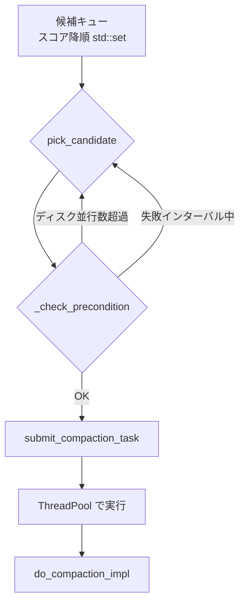
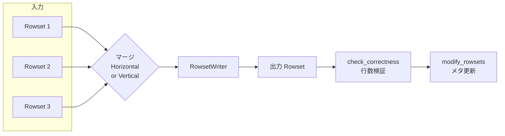
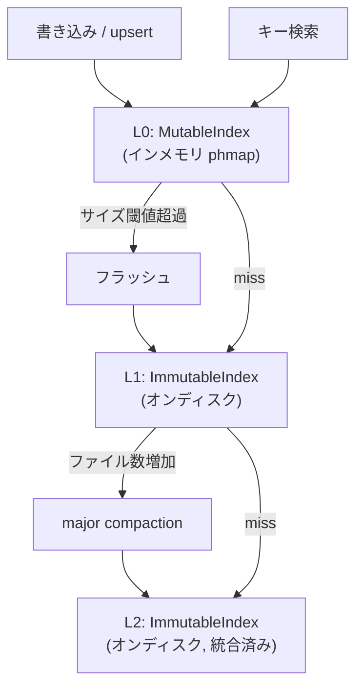

# 第19章 Compaction と Primary Key 更新

> **本章で読むソース**
>
> - [`be/src/storage/compaction.h`](https://github.com/StarRocks/starrocks/blob/4.1.1/be/src/storage/compaction.h)
> - [`be/src/storage/compaction.cpp`](https://github.com/StarRocks/starrocks/blob/4.1.1/be/src/storage/compaction.cpp)
> - [`be/src/storage/base_compaction.cpp`](https://github.com/StarRocks/starrocks/blob/4.1.1/be/src/storage/base_compaction.cpp)
> - [`be/src/storage/cumulative_compaction.cpp`](https://github.com/StarRocks/starrocks/blob/4.1.1/be/src/storage/cumulative_compaction.cpp)
> - [`be/src/storage/compaction_candidate.h`](https://github.com/StarRocks/starrocks/blob/4.1.1/be/src/storage/compaction_candidate.h)
> - [`be/src/storage/compaction_manager.h`](https://github.com/StarRocks/starrocks/blob/4.1.1/be/src/storage/compaction_manager.h)
> - [`be/src/storage/compaction_manager.cpp`](https://github.com/StarRocks/starrocks/blob/4.1.1/be/src/storage/compaction_manager.cpp)
> - [`be/src/storage/compaction_task.h`](https://github.com/StarRocks/starrocks/blob/4.1.1/be/src/storage/compaction_task.h)
> - [`be/src/storage/tablet_updates.h`](https://github.com/StarRocks/starrocks/blob/4.1.1/be/src/storage/tablet_updates.h)
> - [`be/src/storage/tablet_updates.cpp`](https://github.com/StarRocks/starrocks/blob/4.1.1/be/src/storage/tablet_updates.cpp)
> - [`be/src/storage/delta_column_group.h`](https://github.com/StarRocks/starrocks/blob/4.1.1/be/src/storage/delta_column_group.h)
> - [`be/src/storage/persistent_index.h`](https://github.com/StarRocks/starrocks/blob/4.1.1/be/src/storage/persistent_index.h)

## この章の狙い

書き込みのたびに Rowset が追加されるストレージ層では、Rowset の増加に伴い読み出し性能が劣化する。
Compaction は複数の Rowset をマージして1つにまとめ、読み出し時の走査コストを削減する。
本章ではまず non-PK テーブルの BaseCompaction と CumulativeCompaction を読み、次に Primary Key テーブル固有の更新管理と Compaction を追う。
最後に PersistentIndex のハッシュインデックスによる O(1) ポイント更新の仕組みを解説する。

## 前提

第16章で読んだとおり、Tablet は内部にバージョン管理された Rowset 群を保持する。
non-PK テーブル(Duplicate Key, Aggregate Key, Unique Key)では `_rs_version_map` で Rowset を管理し、Primary Key テーブルでは `TabletUpdates` が Rowset と PrimaryIndex を管理する。
Rowset は不変であり、Compaction は入力 Rowset 群のデータをマージして新しい Rowset を生成し、旧 Rowset を置き換える操作である。

## Compaction の目的

Rowset が増え続けると、読み出しクエリは大量の Segment を横断して走査しなければならない。
Compaction はこの断片化を解消する。
具体的には、複数の Rowset を1つにマージすることで Segment 数を減らし、走査コストを削減する。
削除済みデータの物理的な除去も同時に行い、ストレージ使用量を回収する。
Aggregate Key テーブルでは同一キーの値を集約し、Unique Key テーブルでは旧バージョンの行を除去する役割も持つ。

## BaseCompaction と CumulativeCompaction

non-PK テーブルでは2種類の Compaction を使い分ける。

### CumulativeCompaction

**CumulativeCompaction** は `cumulative_layer_point` 以降の小さな Rowset をマージする軽量な Compaction である。
`cumulative_layer_point` はバージョン空間の境界を示し、この値より小さいバージョンの Rowset は BaseCompaction の領域に属する。

候補 Rowset の選択は `pick_rowsets_to_compact()` で行われる。

[`be/src/storage/cumulative_compaction.cpp` L95-L235](https://github.com/StarRocks/starrocks/blob/4.1.1/be/src/storage/cumulative_compaction.cpp#L95-L235)

```cpp
Status CumulativeCompaction::pick_rowsets_to_compact() {
    // ... (中略) ...
    int64_t cumulative_point = _tablet->cumulative_layer_point();
    // ... (中略) ...
    for (auto& rowset : candidate_rowsets) {
        // ... (中略) ...
    }
    // ... (中略) ...
}

```

選択ロジックの流れを整理する。

1. `cumulative_layer_point` より大きいバージョンの Rowset を候補として収集する(L115)
2. delete version を持つ Rowset に遭遇すると、そこで候補列を区切る(L132-L152)
3. すでに Compaction 済み(non-overlapping)の Rowset にも同様の区切りを入れる(L155-L171)
4. 候補数が `min_cumulative_compaction_num_singleton_deltas` 以上であれば実行対象とする(L84, L120, L184)

実行可否の判定は `fit_compaction_condition()` で行われる。

[`be/src/storage/cumulative_compaction.cpp` L81-L93](https://github.com/StarRocks/starrocks/blob/4.1.1/be/src/storage/cumulative_compaction.cpp#L81-L93)

```cpp
bool CumulativeCompaction::fit_compaction_condition(const std::vector<RowsetSharedPtr>& rowsets, int64_t compaction_score) {
    // ... (中略) ...
    if (compaction_score >= config::min_cumulative_compaction_num_singleton_deltas) {
        return true;
    }
    // ... (中略) ...
}

```

`compaction_score` が閾値に達していなくても、候補 Rowset の合計サイズが一定以上であれば実行する分岐も存在する。
delete version で区切る理由は、delete predicate がバージョン境界をまたぐマージでは正しく適用できないためである。

### BaseCompaction

**BaseCompaction** は base rowset(バージョン0起点)とその上の cumulative rowset をまとめる大規模な Compaction である。
「CumulativeCompaction」で十分にまとめられた Rowset 群をさらに統合し、断片化を根本的に解消する。

[`be/src/storage/base_compaction.cpp` L75-L159](https://github.com/StarRocks/starrocks/blob/4.1.1/be/src/storage/base_compaction.cpp#L75-L159)

```cpp
Status BaseCompaction::pick_rowsets_to_compact() {
    // ... (中略) ...
}

```

「BaseCompaction」の `pick_rowsets_to_compact()` は3つのトリガー条件を順に評価する。

1. **スコア閾値**(L109-L114)：cumulative rowset の compaction score が閾値を超えている
2. **累積/base サイズ比**(L116-L141)：cumulative rowset の合計サイズが base rowset のサイズに対して一定比率を超えている
3. **前回からの経過時間**(L143-L152)：前回の「BaseCompaction」から一定時間が経過している

いずれかの条件を満たせば実行対象となる。

入力 Rowset はすべて non-overlapping であることが要求される。

[`be/src/storage/base_compaction.cpp` L161-L168](https://github.com/StarRocks/starrocks/blob/4.1.1/be/src/storage/base_compaction.cpp#L161-L168)

```cpp
Status BaseCompaction::_check_rowset_overlapping(const vector<RowsetSharedPtr>& rowsets) {
    // ... (中略) ...
}

```

Segment が重複している Rowset を「BaseCompaction」に含めると、マージ時のキー順序保証が複雑化する。
そのため `_check_rowset_overlapping()` で事前に検証し、重複があれば「BaseCompaction」を中止する。

## CompactionManager によるスケジューリング

「Compaction」の候補管理と実行制御は `CompactionManager` が担う。

### 候補の管理

**CompactionCandidate** は Tablet, Compaction 種別, スコアを保持する構造体である。

[`be/src/storage/compaction_candidate.h` L27-L76](https://github.com/StarRocks/starrocks/blob/4.1.1/be/src/storage/compaction_candidate.h#L27-L76)

```cpp
struct CompactionCandidate {
    // ... (中略) ...
};

```

候補はスコア降順でソートされた `std::set` に格納される。

[`be/src/storage/compaction_candidate.h` L81-L87](https://github.com/StarRocks/starrocks/blob/4.1.1/be/src/storage/compaction_candidate.h#L81-L87)

```cpp
struct CompactionCandidateComparator {
    bool operator()(const CompactionCandidate& a, const CompactionCandidate& b) const {
        // ... (中略) ...
    }
};

```

`CompactionCandidateComparator` はスコアが高い候補を先頭に配置する。
`CompactionManager` はこの `std::set` を `_compaction_candidates` として保持する(compaction_manager.h L169)。

### スケジューリングループ

[`be/src/storage/compaction_manager.cpp` L71-L86](https://github.com/StarRocks/starrocks/blob/4.1.1/be/src/storage/compaction_manager.cpp#L71-L86)

```cpp
void CompactionManager::_schedule() {
    // ... (中略) ...
}

```

`_schedule()` はループで候補キューからスコア最大の候補を取り出し、`submit_compaction_task()` で ThreadPool に投入する。
投入前に `_check_precondition()` で実行可否を検証する。

[`be/src/storage/compaction_manager.cpp` L247-L315](https://github.com/StarRocks/starrocks/blob/4.1.1/be/src/storage/compaction_manager.cpp#L247-L315)

```cpp
bool CompactionManager::_check_precondition(const CompactionCandidate& candidate) {
    // ... (中略) ...
}

```

`_check_precondition()` は2つの制約を検証する。

- **ディスクごとの並行数制限**(L268-L276, L284-L290)：「CumulativeCompaction」と「BaseCompaction」のそれぞれについて、同一ディスク上で同時に実行できるタスク数を制限する。ディスク I/O の飽和を防ぐための設計である。
- **失敗後のインターバル**(L294-L312)：直前の Compaction が失敗した Tablet に対して、一定時間の再試行間隔を設ける。連続失敗によるリソース浪費を回避する。

候補の取り出しは `pick_candidate()` が行う。

[`be/src/storage/compaction_manager.cpp` L317-L344](https://github.com/StarRocks/starrocks/blob/4.1.1/be/src/storage/compaction_manager.cpp#L317-L344)

```cpp
CompactionCandidate CompactionManager::pick_candidate() {
    // ... (中略) ...
}

```

スコア降順の `std::set` から先頭の候補を取り出し、前提条件をチェックする。
条件を満たさなければ次の候補に進む。



## Compaction の実行フロー (non-PK)

候補が ThreadPool に投入されると、`do_compaction_impl()` が呼ばれる。

[`be/src/storage/compaction.cpp` L58-L160](https://github.com/StarRocks/starrocks/blob/4.1.1/be/src/storage/compaction.cpp#L58-L160)

```cpp
Status Compaction::do_compaction_impl() {
    // ... (中略) ...
}

```

処理は5つの段階に分かれる。

**1. 入力 Rowset の集計**(L61-L70)：入力 Rowset のサイズと行数を合算し、出力 Rowset の整合性チェックに使う。

**2. アルゴリズム選択**(L88-L93)：列数と Segment 数の積が閾値を超える場合は Vertical マージを選択する。
Horizontal マージは全列を同時に読み出すのに対し、Vertical マージは列グループごとに分けて読み出す。
列数が多いテーブルではメモリ消費を抑えるために Vertical マージが有利である。

**3. マージ実行**(L112-L121)：選択したアルゴリズムで入力 Rowset を読み出し、出力用の RowsetWriter に書き込む。

[`be/src/storage/compaction.h` L96-L99](https://github.com/StarRocks/starrocks/blob/4.1.1/be/src/storage/compaction.h#L96-L99)

```cpp
    Status _merge_rowsets_horizontally(size_t segment_iterator_num, Statistics* stats_output);
    StatusOr<int32_t> _merge_rowsets_horizontally_cloud(size_t segment_iterator_num, Statistics* stats_output);
    Status _merge_rowsets_vertically(size_t segment_iterator_num, Statistics* stats_output);
    StatusOr<int32_t> _merge_rowsets_vertically_cloud(size_t segment_iterator_num, Statistics* stats_output);

```

Horizontal マージは `_merge_rowsets_horizontally()` を、Vertical マージは `_merge_rowsets_vertically()` を使う。
いずれも SegmentIterator で入力を読み出し、HeapMerge でキー順にマージして RowsetWriter に出力する。

**4. 出力 Rowset のビルド**(L127-L133)：RowsetWriter から最終的な Rowset オブジェクトを生成する。

**5. 行数整合性チェックと入れ替え**(L135-L138)：`check_correctness()` で入力の合計行数と出力の行数が一致するかを検証し、`modify_rowsets()` で Tablet のメタデータを更新する。

[`be/src/storage/compaction.cpp` L355-L370](https://github.com/StarRocks/starrocks/blob/4.1.1/be/src/storage/compaction.cpp#L355-L370)

```cpp
Status Compaction::modify_rowsets() {
    // ... (中略) ...
}

```

`modify_rowsets()` は Tablet のロックを取得し、入力 Rowset 群を出力 Rowset に置換する。
入力 Rowset は `_stale_rs_version_map` に移動し、進行中の読み取りが完了するまで保持される。

[`be/src/storage/compaction.cpp` L388-L399](https://github.com/StarRocks/starrocks/blob/4.1.1/be/src/storage/compaction.cpp#L388-L399)

```cpp
Status Compaction::check_correctness(const Statistics& stats) {
    // ... (中略) ...
}

```

`check_correctness()` は入力と出力の行数を比較し、不一致があればエラーを返す。
Aggregate Key テーブルでは集約により行数が減るため、出力行数が入力行数以下であることだけを検証する。



## Primary Key テーブルの更新管理 (TabletUpdates)

Primary Key テーブルでは `TabletUpdates` がバージョン管理と PrimaryIndex の更新を一元的に担う。

[`be/src/storage/tablet_updates.h` L108](https://github.com/StarRocks/starrocks/blob/4.1.1/be/src/storage/tablet_updates.h#L108)

```cpp
class TabletUpdates {

```

### EditVersionInfo によるバージョン管理

**EditVersionInfo** はバージョンごとの Rowset 一覧と DelVector を保持する。

[`be/src/storage/tablet_updates.h` L81-L105](https://github.com/StarRocks/starrocks/blob/4.1.1/be/src/storage/tablet_updates.h#L81-L105)

```cpp
struct EditVersionInfo {
    // ... (中略) ...
};

```

新しい書き込みが到着するたびに新しい「EditVersionInfo」が作成され、「TabletUpdates」のバージョン履歴に追加される。
Compaction も新しいバージョンを生成するため、通常の書き込みと Compaction は同じバージョン管理の枠組みで扱われる。

### 通常の書き込み (_apply_normal_rowset_commit)

[`be/src/storage/tablet_updates.cpp` L1341-L1410](https://github.com/StarRocks/starrocks/blob/4.1.1/be/src/storage/tablet_updates.cpp#L1341-L1410)

```cpp
void TabletUpdates::_apply_normal_rowset_commit(const EditVersionInfo& version_info, ...) {
    // ... (中略) ...
}

```

通常の Rowset コミットでは PrimaryIndex に対して upsert と delete を実行する。
新しい行のキーを PrimaryIndex に挿入し、同じキーの旧行が存在すれば DelVector に記録して論理削除する。
この Merge-on-Write 方式により、読み取り時のマージが不要になる。

### 列モード部分更新 (_apply_column_partial_update_commit)

[`be/src/storage/tablet_updates.cpp` L1128-L1199](https://github.com/StarRocks/starrocks/blob/4.1.1/be/src/storage/tablet_updates.cpp#L1128-L1199)

```cpp
void TabletUpdates::_apply_column_partial_update_commit(const EditVersionInfo& version_info, ...) {
    // ... (中略) ...
}

```

列モード部分更新では、変更対象の列だけを Delta Column Group として別ファイルに書き出す。
全列を書き直す必要がないため、少数列の更新が高速になる。

## Delta Column Group

**Delta Column Group** は列モード部分更新で変更された列だけを記録する構造体である。

[`be/src/storage/delta_column_group.h` L35-L120](https://github.com/StarRocks/starrocks/blob/4.1.1/be/src/storage/delta_column_group.h#L35-L120)

```cpp
class DeltaColumnGroup {
    // ... (中略) ...
};

```

内部には2つの主要なフィールドがある。

- `_column_uids`(L115)：更新された列の UID 一覧
- `_column_files`(L116)：データファイル名。`$rowsetid_$segid_$version_$seq.cols` という命名規則に従う

読み出し時には `get_column_idx()` で ColumnUID からファイル内のインデックスを解決する。

[`be/src/storage/delta_column_group.h` L51-L62](https://github.com/StarRocks/starrocks/blob/4.1.1/be/src/storage/delta_column_group.h#L51-L62)

```cpp
    int32_t get_column_idx(int32_t cid) const {
        // ... (中略) ...
    }

```

「Delta Column Group」は Compaction で統合される。
Compaction が実行されると、元の Segment データと「Delta Column Group」がマージされ、全列を含む新しい Segment が生成される。
これにより読み出し時の「Delta Column Group」参照コストが解消される。

## Primary Key Compaction

Primary Key テーブルの Compaction は `TabletUpdates` を経由して実行される。
non-PK テーブルとは異なり、PrimaryIndex の整合性を維持しながらマージを行う必要がある。

### 候補選択 (compaction)

[`be/src/storage/tablet_updates.cpp` L2977-L3104](https://github.com/StarRocks/starrocks/blob/4.1.1/be/src/storage/tablet_updates.cpp#L2977-L3104)

```cpp
Status TabletUpdates::compaction(MemTracker* mem_tracker) {
    // ... (中略) ...
}

```

候補選択は貪欲法で行う。

[`be/src/storage/tablet_updates.cpp` L2954-L2963](https://github.com/StarRocks/starrocks/blob/4.1.1/be/src/storage/tablet_updates.cpp#L2954-L2963)

```cpp
struct CompactionEntry {
    // ... (中略) ...
};

```

各 Rowset の `score_per_row` を計算し、スコアが高い順にソートする(L2954-L2963)。
スコアが高い Rowset から貪欲に選択し、合計サイズが上限に達するまで候補に追加する(L3052-L3076)。

### スコア計算 (_calc_compaction_score)

[`be/src/storage/tablet_updates.cpp` L3605-L3618](https://github.com/StarRocks/starrocks/blob/4.1.1/be/src/storage/tablet_updates.cpp#L3605-L3618)

```cpp
int64_t TabletUpdates::_calc_compaction_score(RowsetStats* stats) {
    // ... (中略) ...
}

```

スコアの計算式は次のとおりである(L3615-L3617)。

```text
score = size_threshold * (segments - 1) + (read_cost + write_cost) * delete_bytes - write_cost * total_bytes

```

Segment 数が多いほどスコアが高くなり、削除データが多いほど Compaction の効果が大きいため優先される。
一方、合計バイト数が大きい Rowset はコストが高いため、スコアを下げて過度な Compaction を避ける。

### レベル計算 (_calc_compaction_level)

[`be/src/storage/tablet_updates.cpp` L3581-L3603](https://github.com/StarRocks/starrocks/blob/4.1.1/be/src/storage/tablet_updates.cpp#L3581-L3603)

```cpp
size_t TabletUpdates::_calc_compaction_level(RowsetStats* stats) {
    // ... (中略) ...
}

```

Size-tiered compaction の考え方で、Rowset のバイト数からレベルを算出する(L3588-L3602)。
同じレベルの Rowset 同士をマージ候補にすることで、書き込み増幅を抑制する。

### マージ実行 (_do_compaction)

[`be/src/storage/tablet_updates.cpp` L2043-L2148](https://github.com/StarRocks/starrocks/blob/4.1.1/be/src/storage/tablet_updates.cpp#L2043-L2148)

```cpp
void TabletUpdates::_do_compaction(std::unique_ptr<CompactionInfo> info) {
    // ... (中略) ...
}

```

`_do_compaction()` は入力 Rowset をマージして出力 Rowset を生成し、`_commit_compaction()` でバージョンを進める。
RowsetWriter の構成(L2084-L2107)、マージの実行と出力 Rowset のビルド(L2112-L2134)、コミット(L2137)の順に進む。

### コミットと PrimaryIndex 更新 (_commit_compaction, _apply_compaction_commit)

[`be/src/storage/tablet_updates.cpp` L2197-L2331](https://github.com/StarRocks/starrocks/blob/4.1.1/be/src/storage/tablet_updates.cpp#L2197-L2331)

```cpp
Status TabletUpdates::_commit_compaction(const CompactionInfo& info, ...) {
    // ... (中略) ...
}

```

`_commit_compaction()` は新しい「EditVersionInfo」を作成し、バージョン履歴に追加する。

[`be/src/storage/tablet_updates.cpp` L2356-L2520](https://github.com/StarRocks/starrocks/blob/4.1.1/be/src/storage/tablet_updates.cpp#L2356-L2520)

```cpp
void TabletUpdates::_apply_compaction_commit(const EditVersionInfo& version_info, ...) {
    // ... (中略) ...
}

```

`_apply_compaction_commit()` は PrimaryIndex を使って、出力 Rowset のキーで旧エントリを置き換える。
処理の要点は次のとおりである。

1. PrimaryIndex をロードする(L2384-L2409)
2. 入力 Rowset の最大 rssid(`max_src_rssid`)を計算する(L2475-L2483)
3. 出力 Rowset のキーで `try_replace()` を呼ぶ(L2485-L2520)

`try_replace()` は PrimaryIndex 内の既存エントリの rssid が `max_src_rssid` 以下である場合にのみ置き換えを行う。
rssid が `max_src_rssid` より大きいエントリは、Compaction の実行中に到着した新しい書き込みに由来する。
このエントリを上書きすると新しいデータが失われるため、`max_src_rssid` による比較で保護する。
これが Primary Key Compaction と並行書き込みの整合性を保証する仕組みである。

### 列モード部分更新との競合検出

[`be/src/storage/tablet_updates.cpp` L2156-L2195](https://github.com/StarRocks/starrocks/blob/4.1.1/be/src/storage/tablet_updates.cpp#L2156-L2195)

```cpp
Status TabletUpdates::_check_conflict_with_partial_update(const CompactionInfo& info) {
    // ... (中略) ...
}

```

列モード部分更新と Compaction が同じ Rowset を対象にすると、「Delta Column Group」が不整合を起こす可能性がある。
`_check_conflict_with_partial_update()` は Compaction の入力 Rowset が部分更新中でないかを検証し、競合があれば Compaction をキャンセルする。

## PersistentIndex のハッシュインデックスによるポイント更新 O(1) 化

Primary Key テーブルの性能を支える中核が **PersistentIndex** である。
PrimaryIndex をディスクに永続化しつつ、キーの upsert と検索を O(1) で実行する。

### 階層構造

[`be/src/storage/persistent_index.h` L674-L961](https://github.com/StarRocks/starrocks/blob/4.1.1/be/src/storage/persistent_index.h#L674-L961)

```cpp
class PersistentIndex {
    // ... (中略) ...
};

```

「PersistentIndex」は3層の階層で構成される。

- **L0** (`_l0`, ShardByLengthMutableIndex, L922)：インメモリのハッシュテーブル。書き込みはまず L0 に入る。
- **L1** (`_l1_vec`, ImmutableIndex, L928)：L0 がフラッシュされて生成されるオンディスクのインデックスファイル。
- **L2** (`_l2_vec`, ImmutableIndex, L938)：L1 が増えすぎた場合に major compaction で統合されるオンディスクファイル。

### IndexValue の構造

[`be/src/storage/persistent_index.h` L118-L128](https://github.com/StarRocks/starrocks/blob/4.1.1/be/src/storage/persistent_index.h#L118-L128)

```cpp
struct IndexValue {
    // ... (中略) ...
};

```

**IndexValue** は8バイトの値で、上位32ビットに rssid(Rowset Segment ID)、下位32ビットに rowid を格納する。
この構造により、キーからデータの物理位置を1回のハッシュ探索で特定できる。

### MutableIndex (L0)

[`be/src/storage/persistent_index.h` L185-L298](https://github.com/StarRocks/starrocks/blob/4.1.1/be/src/storage/persistent_index.h#L185-L298)

```cpp
class MutableIndex {
    // ... (中略) ...
};

```

**MutableIndex** は phmap(parallel hashmap)ベースのハッシュテーブルを内部に持つ。
phmap は Google の `absl::flat_hash_map` と同等の SIMD 最適化されたオープンアドレッシングハッシュテーブルであり、upsert, get, erase が平均 O(1) で動作する。
Primary Key の更新や検索が高速な理由は、この L0 のインメモリハッシュテーブルにある。

### L0 から L1 へのフラッシュと major compaction

L0 のサイズが閾値に達すると、ハッシュテーブルの内容がディスクにフラッシュされて L1 の ImmutableIndex ファイルになる。
L1 ファイルが増えすぎると `major_compaction()` で統合され、L2 ファイルが生成される。

[`be/src/storage/persistent_index.h` L787-L788](https://github.com/StarRocks/starrocks/blob/4.1.1/be/src/storage/persistent_index.h#L787-L788)

```cpp
    Status major_compaction(DataDir* data_dir);

```

[`be/src/storage/persistent_index.h` L792](https://github.com/StarRocks/starrocks/blob/4.1.1/be/src/storage/persistent_index.h#L792)

```cpp
    double major_compaction_score(const std::vector<std::shared_ptr<ImmutableIndex>>& immu_indexes);

```

`major_compaction_score()` は L2 ファイルの書き込み増幅度を返す。
スコアが高いほど統合の効果が大きいことを示し、閾値を超えると PK Index の major compaction が実行される。

[`be/src/storage/tablet_updates.cpp` L4829-L4863](https://github.com/StarRocks/starrocks/blob/4.1.1/be/src/storage/tablet_updates.cpp#L4829-L4863)

```cpp
Status TabletUpdates::pk_index_major_compaction(DataDir* data_dir) {
    // ... (中略) ...
}

```

`pk_index_major_compaction()` は「PersistentIndex」の major compaction を呼び出し、L1/L2 ファイルを統合する。



キー検索時は L0 を最初に参照し、ヒットしなければ L1、L2 の順に探索する。
L0 はインメモリであるため、書き込み直後のキーは L0 へのハッシュ探索1回で解決する。
この階層構造は LSM-Tree と類似しているが、ポイント検索に特化したハッシュベースの設計により、B-Tree のような範囲スキャンではなく O(1) の更新と検索を実現している。

## まとめ

non-PK テーブルでは「CumulativeCompaction」が小さな Rowset を頻繁にまとめ、「BaseCompaction」が累積した Rowset を根本的に統合する。
CompactionManager がスコア降順の候補キューとディスクごとの並行数制限でスケジューリングを行い、過負荷を防ぐ。

Primary Key テーブルでは「TabletUpdates」が PrimaryIndex を使った Merge-on-Write と Compaction を統合的に管理する。
Compaction 中の新しい書き込みは `max_src_rssid` による比較で保護され、データの整合性が保証される。
列モード部分更新では「Delta Column Group」が変更列だけを記録し、全列の書き直しを回避する。

「PersistentIndex」の phmap ベースのハッシュテーブルが、Primary Key の upsert と検索を O(1) で実行する。
L0(インメモリ), L1, L2 の階層構造により、ディスク永続化と高速なポイント更新を両立させている。

## 関連する章

- 第16章「Tablet, Rowset とデータモデル」(Tablet と Rowset の構造、Primary Key テーブルの基本設計)
- 第17章「Segment ファイルフォーマット」(Compaction の入出力となる Segment の内部構造)
- 第18章「インデックスサブシステム」(Segment 内のインデックスと検索最適化)
