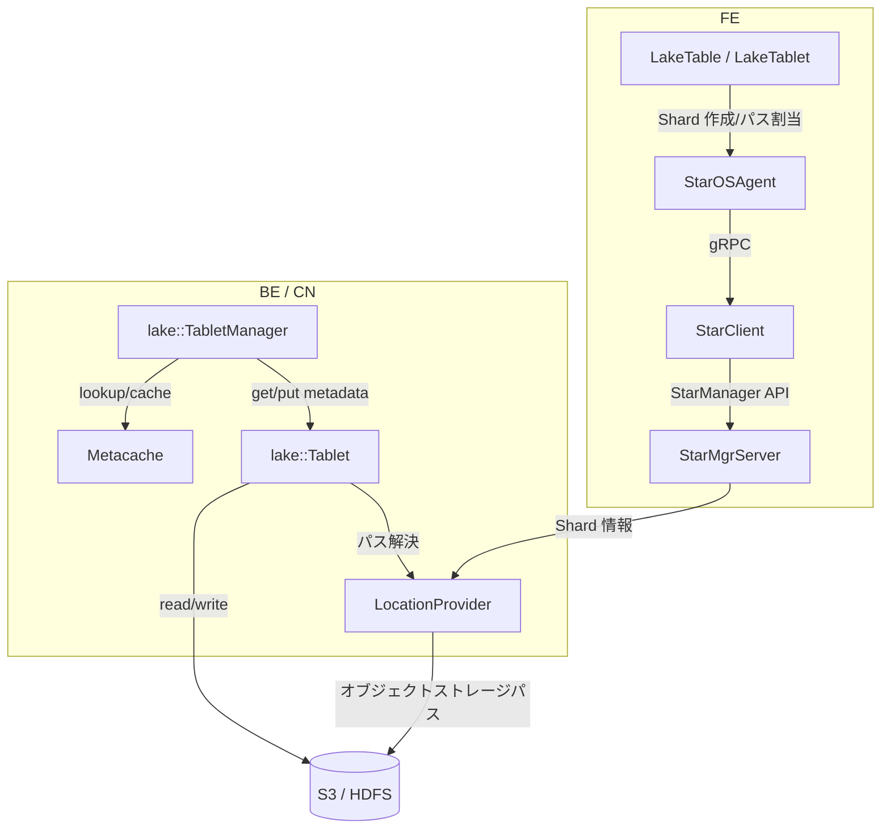
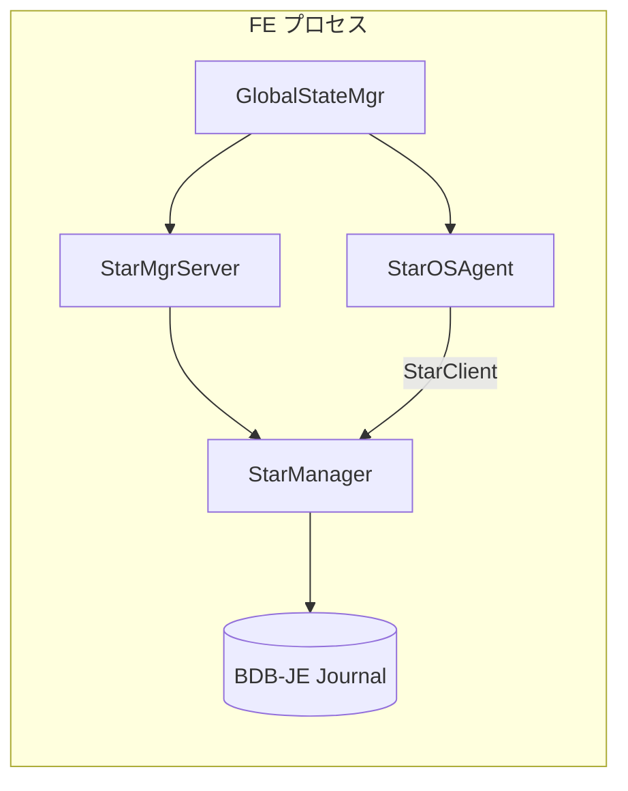
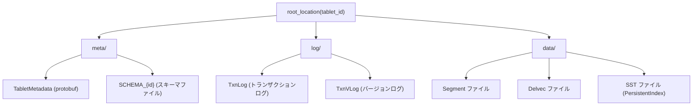

# 第20章 Lake モードと StarOS 連携

> **本章で読むソース**
>
> - [`fe/fe-core/src/main/java/com/starrocks/lake/LakeTable.java`](https://github.com/StarRocks/starrocks/blob/4.1.1/fe/fe-core/src/main/java/com/starrocks/lake/LakeTable.java)
> - [`fe/fe-core/src/main/java/com/starrocks/lake/LakeTablet.java`](https://github.com/StarRocks/starrocks/blob/4.1.1/fe/fe-core/src/main/java/com/starrocks/lake/LakeTablet.java)
> - [`fe/fe-core/src/main/java/com/starrocks/lake/StarOSAgent.java`](https://github.com/StarRocks/starrocks/blob/4.1.1/fe/fe-core/src/main/java/com/starrocks/lake/StarOSAgent.java)
> - [`fe/fe-core/src/main/java/com/starrocks/staros/StarMgrServer.java`](https://github.com/StarRocks/starrocks/blob/4.1.1/fe/fe-core/src/main/java/com/starrocks/staros/StarMgrServer.java)
> - [`be/src/storage/lake/tablet.h`](https://github.com/StarRocks/starrocks/blob/4.1.1/be/src/storage/lake/tablet.h)
> - [`be/src/storage/lake/tablet.cpp`](https://github.com/StarRocks/starrocks/blob/4.1.1/be/src/storage/lake/tablet.cpp)
> - [`be/src/storage/lake/tablet_manager.h`](https://github.com/StarRocks/starrocks/blob/4.1.1/be/src/storage/lake/tablet_manager.h)
> - [`be/src/storage/lake/tablet_manager.cpp`](https://github.com/StarRocks/starrocks/blob/4.1.1/be/src/storage/lake/tablet_manager.cpp)
> - [`be/src/storage/lake/location_provider.h`](https://github.com/StarRocks/starrocks/blob/4.1.1/be/src/storage/lake/location_provider.h)
> - [`be/src/storage/lake/meta_file.h`](https://github.com/StarRocks/starrocks/blob/4.1.1/be/src/storage/lake/meta_file.h)
> - [`be/src/storage/lake/metacache.h`](https://github.com/StarRocks/starrocks/blob/4.1.1/be/src/storage/lake/metacache.h)

## この章の狙い

StarRocks は従来の Shared-Nothing 構成に加え、ストレージとコンピュートを分離する **Shared-Data** 構成(Lake モード)を提供する。
Lake モードでは、データの実体を S3 や HDFS などのオブジェクトストレージに配置し、計算ノード(CN)はステートレスに保つ。
本章では、FE 側の `LakeTable`、`LakeTablet`、`StarOSAgent`、`StarMgrServer` と、BE/CN 側の `lake::Tablet`、`lake::TabletManager`、`LocationProvider`、`Metacache` を読み、Shared-Data アーキテクチャの全体構造を理解する。

## 前提

第16章で読んだとおり、Shared-Nothing モードでは `OlapTable` が Tablet を管理し、各 BE がローカルディスクにデータを保持する。
レプリカの配置やバランシングは FE の TabletScheduler が担当する。
Lake モードではこの構造を置き換え、StarOS(内蔵 StarMgr)がストレージリソースの管理を引き受ける。

## 共有データアーキテクチャの概要

Shared-Nothing 構成では各 BE がデータの実体をローカルディスクに持つため、ノードの追加や削除にはデータの再配置(リバランシング)が必要になる。
Shared-Data 構成では、データの実体はオブジェクトストレージに一元的に保管される。
計算ノード(CN)はデータを持たず、クエリ実行時にオブジェクトストレージからデータを読み出して処理する。
ノードの追加や削除によるデータ移動は発生しない。

FE と BE/CN の役割分担は次のように変わる。

- FE: `LakeTable`、`LakeTablet` で Lake テーブルのメタデータを管理し、StarOSAgent を介してストレージパスの割り当てや Shard の作成を StarMgr に委譲する
- BE/CN: `lake::TabletManager` がリモートストレージ上のメタデータやデータファイルの読み書きを担当し、`Metacache` でキャッシュする



## FE 側: LakeTable と LakeTablet

### LakeTable

**LakeTable** は `OlapTable` を継承し、`TableType.CLOUD_NATIVE` として生成される。

[`fe/fe-core/src/main/java/com/starrocks/lake/LakeTable.java` L58-L64](https://github.com/StarRocks/starrocks/blob/4.1.1/fe/fe-core/src/main/java/com/starrocks/lake/LakeTable.java#L58-L64)

```java
public class LakeTable extends OlapTable {

    private static final Logger LOG = LogManager.getLogger(LakeTable.class);

    public LakeTable() {
        super(TableType.CLOUD_NATIVE);
    }
```

「LakeTable」は従来の OlapTable と同じテーブルモデル(Duplicate Key, Aggregate Key, Unique Key, Primary Key)をサポートする。
差分は、ストレージ管理を StarOS に委譲する点にある。

パーティション単位のデータキャッシュ設定は `getPartitionFileCacheInfo()` で取得する。
パーティション固有の設定がなければ、テーブルプロパティから取得する。

[`fe/fe-core/src/main/java/com/starrocks/lake/LakeTable.java` L77-L86](https://github.com/StarRocks/starrocks/blob/4.1.1/fe/fe-core/src/main/java/com/starrocks/lake/LakeTable.java#L77-L86)

```java
    public FileCacheInfo getPartitionFileCacheInfo(long partitionId) {
        FileCacheInfo cacheInfo = null;
        DataCacheInfo dataCacheInfo = partitionInfo.getDataCacheInfo(partitionId);
        if (dataCacheInfo == null) {
            cacheInfo = tableProperty.getStorageInfo().getCacheInfo();
        } else {
            cacheInfo = dataCacheInfo.getCacheInfo();
        }
        return cacheInfo;
    }
```

テーブルの削除や Alter 操作は `LakeTableHelper` に委譲し、Shared-Nothing の `OlapTable` とは異なる実装を経由する。

### LakeTablet

**LakeTablet** は FE 側の Tablet メタデータを表す。
クラスのコメントが設計意図を要約している。

[`fe/fe-core/src/main/java/com/starrocks/lake/LakeTablet.java` L37-L42](https://github.com/StarRocks/starrocks/blob/4.1.1/fe/fe-core/src/main/java/com/starrocks/lake/LakeTablet.java#L37-L42)

```java
 * This class represents the StarRocks lake tablet related metadata.
 * LakeTablet is based on cloud object storage, such as S3, OSS.
 * Data replicas are managed by object storage and compute replicas are managed by StarOS through Shard.
 * Tablet id is same as StarOS Shard id.
 */
public class LakeTablet extends Tablet {
```

この設計の要点は2つある。

1. **Tablet ID と Shard ID の同一性**: `getShardId()` は単に `getId()` を返す(L76-L78)。StarOS の Shard と FE の Tablet が1対1対応するため、ID を共通化して変換のオーバーヘッドをなくしている。
2. **レプリカの動的生成**: Shared-Nothing モードの `LocalTablet` はレプリカの一覧を永続化して保持するが、「LakeTablet」は `getQueryableReplicas()` の呼び出し時に WarehouseManager から計算ノードの割り当てを取得し、その場で `Replica` オブジェクトを生成する。

[`fe/fe-core/src/main/java/com/starrocks/lake/LakeTablet.java` L146-L183](https://github.com/StarRocks/starrocks/blob/4.1.1/fe/fe-core/src/main/java/com/starrocks/lake/LakeTablet.java#L146-L183)

```java
    @Override
    public void getQueryableReplicas(List<Replica> allQuerableReplicas, List<Replica> localReplicas,
                                     long visibleVersion, long localBeId, int schemaHash,
                                     ComputeResource computeResource, List<Long> locations) {
        List<Long> computeNodeIds = locations;
        if (computeNodeIds == null) { // initial location hint is null, grab the info from warehouse manager.
            final WarehouseManager warehouseManager = GlobalStateMgr.getCurrentState().getWarehouseMgr();
            computeNodeIds = warehouseManager.getAllComputeNodeIdsAssignToTablet(computeResource, getId());
        }
        if (computeNodeIds == null) {
            return;
        }
        for (long backendId : computeNodeIds) {
            Replica replica = new Replica(getId(), backendId, visibleVersion, schemaHash, getDataSize(true),
                    getRowCount(visibleVersion), NORMAL, -1, visibleVersion);
            allQuerableReplicas.add(replica);
            // ... (中略) ...
        }
    }

```

データの実体はオブジェクトストレージにあるため、どの CN からでもアクセスできる。
FE はクエリスケジューリング時に、どの CN にどの Tablet の処理を割り当てるかを WarehouseManager の情報に基づいて決定する。

## StarOSAgent と StarMgrServer

### StarOSAgent

**StarOSAgent** は FE から StarOS へのブリッジとして機能する。
StarClient を内包し、Shard の作成、ファイルパスの割り当て、ワーカーの登録など、ストレージ管理操作を StarMgr に委譲する。

[`fe/fe-core/src/main/java/com/starrocks/lake/StarOSAgent.java` L78-L93](https://github.com/StarRocks/starrocks/blob/4.1.1/fe/fe-core/src/main/java/com/starrocks/lake/StarOSAgent.java#L78-L93)

```java
public class StarOSAgent {
    private static final Logger LOG = LogManager.getLogger(StarOSAgent.class);

    public static final String SERVICE_NAME = "starrocks";

    // warehouse -> worker_group
    //  index -> worker_group_id
    public static final long DEFAULT_WORKER_GROUP_ID = 0L;

    protected StarClient client;
    protected String serviceId;
    protected Map<String, Long> workerToId;
    // The value of this map is the id of backends or compute nodes
    protected Map<Long, Long> workerToNode;
    protected ReentrantReadWriteLock rwLock;

```

`workerToId` は StarOS 上のワーカーアドレス(IP:Port)からワーカー ID へのマッピング、`workerToNode` はワーカー ID から StarRocks の BE/CN ノード ID へのマッピングである。
この二重マッピングにより、StarOS のワーカー管理と StarRocks のノード管理を橋渡しする。

#### ファイルパスの割り当て

テーブル作成時、「StarOSAgent」は StarMgr にファイルパスの割り当てを要求する。
パスは `db{dbId}/{tableId}` の形式で構築される。

[`fe/fe-core/src/main/java/com/starrocks/lake/StarOSAgent.java` L238-L256](https://github.com/StarRocks/starrocks/blob/4.1.1/fe/fe-core/src/main/java/com/starrocks/lake/StarOSAgent.java#L238-L256)

```java
    private static String constructTablePath(long dbId, long tableId) {
        return String.format("db%d/%d", dbId, tableId);
    }

    public FilePathInfo allocateFilePath(long dbId, long tableId) throws DdlException {
        prepare();
        try {
            FileStoreType fsType = getFileStoreType(Config.cloud_native_storage_type);
            if (fsType == null || fsType == FileStoreType.INVALID) {
                throw new DdlException("Invalid cloud native storage type: " + Config.cloud_native_storage_type);
            }
            String suffix = constructTablePath(dbId, tableId);
            FilePathInfo pathInfo = client.allocateFilePath(serviceId, fsType, suffix);
            LOG.debug("Allocate file path from starmgr: {}", pathInfo);
            return pathInfo;
        } catch (StarClientException e) {
            throw new DdlException("Failed to allocate file path from StarMgr, error: " + e.getMessage());
        }
    }
```

パーティション単位のパス割り当ては `allocatePartitionFilePathInfo()` で行われる。
`physicalPartitionId` のハッシュ値をサブディレクトリに使い、オブジェクトストレージ上のプレフィックスを分散させる。

[`fe/fe-core/src/main/java/com/starrocks/lake/StarOSAgent.java` L1183-L1186](https://github.com/StarRocks/starrocks/blob/4.1.1/fe/fe-core/src/main/java/com/starrocks/lake/StarOSAgent.java#L1183-L1186)

```java
    public static FilePathInfo allocatePartitionFilePathInfo(FilePathInfo tableFilePathInfo, long physicalPartitionId) {
        String allocPath = StarClient.allocateFilePath(tableFilePathInfo, Long.hashCode(physicalPartitionId));
        return tableFilePathInfo.toBuilder().setFullPath(String.format("%s/%d", allocPath, physicalPartitionId)).build();
    }
```

#### Shard の作成

Tablet(Shard)の作成は `createShards()` で行う。
1つの Shard はレプリカ数1で作成される。
データの冗長性はオブジェクトストレージ側の仕組み(S3 のマルチ AZ レプリケーションなど)に委ねるため、StarRocks 側では1レプリカで十分である。

[`fe/fe-core/src/main/java/com/starrocks/lake/StarOSAgent.java` L577-L623](https://github.com/StarRocks/starrocks/blob/4.1.1/fe/fe-core/src/main/java/com/starrocks/lake/StarOSAgent.java#L577-L623)

```java
    public List<Long> createShards(int numShards, FilePathInfo pathInfo, FileCacheInfo cacheInfo,
                                   List<Long> groupIds, @Nullable List<Long> matchShardIds,
                                   @NotNull Map<String, String> properties,
                                   ComputeResource computeResource)
        throws DdlException {
        // ... (中略) ...
            CreateShardInfo.Builder builder = CreateShardInfo.newBuilder();
            builder.setReplicaCount(1)
                    .addAllGroupIds(groupIds)
                    .setPathInfo(pathInfo)
                    .setCacheInfo(cacheInfo)
                    .putAllShardProperties(properties)
                    .setScheduleToWorkerGroup(workerGroupId);

            for (int i = 0; i < numShards; ++i) {
                builder.setShardId(GlobalStateMgr.getCurrentState().getNextId());
                // ... (中略) ...
                createShardInfoList.add(builder.build());
            }
            shardInfos = client.createShard(serviceId, createShardInfoList);
        // ... (中略) ...
        return shardInfos.stream().map(ShardInfo::getShardId).collect(Collectors.toList());
    }

```

#### ワーカーの登録

BE/CN が起動すると、FE は `addWorker()` を呼んで StarMgr にワーカーを登録する。
同一ノード ID の以前のワーカーが存在すれば、先に削除してから新規登録する。

[`fe/fe-core/src/main/java/com/starrocks/lake/StarOSAgent.java` L377-L414](https://github.com/StarRocks/starrocks/blob/4.1.1/fe/fe-core/src/main/java/com/starrocks/lake/StarOSAgent.java#L377-L414)

```java
    public void addWorker(long nodeId, String workerIpPort, long workerGroupId) {
        prepare();
        try (LockCloseable lock = new LockCloseable(rwLock.writeLock())) {
            // ... (中略) ...
            long workerId = -1;
            try {
                workerId = client.addWorker(serviceId, workerIpPort, workerGroupId);
            } catch (StarClientException e) {
                if (e.getCode() != StatusCode.ALREADY_EXIST) {
                    LOG.warn("Failed to addWorker. Error: {}", e.getMessage());
                    return;
                } else {
                    // ... (中略) ...
                }
            }
            tryRemovePreviousWorker(nodeId);
            workerToId.put(workerIpPort, workerId);
            workerToNode.put(workerId, nodeId);
            LOG.info("add worker {} success, nodeId is {}", workerId, nodeId);
        }
    }

```

### StarMgrServer

**StarMgrServer** は FE プロセス内に StarManager を組み込むためのラッパーである。
StarRocks は外部の StarOS サーバーを別途立てることなく、FE 自身が StarMgr を内蔵する設計を採用している。

[`fe/fe-core/src/main/java/com/starrocks/staros/StarMgrServer.java` L49-L50](https://github.com/StarRocks/starrocks/blob/4.1.1/fe/fe-core/src/main/java/com/starrocks/staros/StarMgrServer.java#L49-L50)

```java
public class StarMgrServer {
    public static final String IMAGE_SUBDIR = "/starmgr"; // do not change this string!
```

シングルトンパターンで実装され、チェックポイントスレッドからのアクセス時には専用のインスタンスを返す(L76-L87)。

初期化処理 `initializeImpl()` では、BDB-JE のジャーナルシステム、StarMgr の gRPC サーバー、StarOSAgent の設定を一括で行う。

[`fe/fe-core/src/main/java/com/starrocks/staros/StarMgrServer.java` L143-L220](https://github.com/StarRocks/starrocks/blob/4.1.1/fe/fe-core/src/main/java/com/starrocks/staros/StarMgrServer.java#L143-L220)

```java
    private void initializeImpl(StarOSBDBJEJournalSystem bdbJournalSystem, String baseImageDir) throws IOException {
        this.journalSystem = bdbJournalSystem;
        // ... (中略) ...
        // start rpc server
        starMgrServer = new StarManagerServer(journalSystem);
        starMgrServer.start(FrontendOptions.getLocalHostAddress(), com.staros.util.Config.STARMGR_RPC_PORT, grpcExecutor);
        // ... (中略) ...
        StarOSAgent starOsAgent = GlobalStateMgr.getCurrentState().getStarOSAgent();
        if (starOsAgent != null && !starOsAgent.init(starMgrServer)) {
            LOG.error("init star os agent failed.");
            System.exit(-1);
        }

        // load meta
        loadImage(imageDir);
    }

```

StarMgr のメタデータは FE の BDB-JE ジャーナルを共有し、リーダー選出やフェイルオーバーも FE の HA メカニズムに乗る。
gRPC サーバーのスレッドプール(`grpcExecutor`)は設定 `starmgr_grpc_server_max_worker_threads` で制御され、動的に調整可能である(L170-L186)。



## BE 側: lake::Tablet と lake::TabletManager

### lake::Tablet

BE/CN 側の **`lake::Tablet`** は `BaseTablet` を継承し、リモートストレージ上の Tablet を操作するインターフェースを提供する。

[`be/src/storage/lake/tablet.h` L51-L57](https://github.com/StarRocks/starrocks/blob/4.1.1/be/src/storage/lake/tablet.h#L51-L57)

```cpp
class Tablet : public BaseTablet {
public:
    explicit Tablet(TabletManager* mgr, int64_t id) : _mgr(mgr), _id(id) {
        if (_mgr != nullptr) {
            _location_provider = _mgr->location_provider();
        }
    }
```

Shared-Nothing モードの `Tablet`(第16章)がローカルディスク上の Rowset やメタデータを直接管理するのに対し、「lake::Tablet」は操作のほぼ全てを `TabletManager` に委譲する。
たとえば `get_metadata()` や `put_metadata()` は TabletManager の対応メソッドを呼ぶだけである。

[`be/src/storage/lake/tablet.cpp` L35-L45](https://github.com/StarRocks/starrocks/blob/4.1.1/be/src/storage/lake/tablet.cpp#L35-L45)

```cpp
Status Tablet::put_metadata(const TabletMetadata& metadata) {
    return _mgr->put_tablet_metadata(metadata);
}

Status Tablet::put_metadata(const TabletMetadataPtr& metadata) {
    return _mgr->put_tablet_metadata(metadata);
}

StatusOr<TabletMetadataPtr> Tablet::get_metadata(int64_t version) {
    return _mgr->get_tablet_metadata(_id, version);
}
```

`belonged_to_cloud_native()` は `true` を返し(L186)、Shared-Nothing の Tablet と区別できる。

#### version_hint による IO 削減

Tablet スキーマの取得やメタデータの読み出しでは、対象バージョンがわからない場合にオブジェクトストレージ上のディレクトリをリストする必要がある。
このリスト操作は S3 等ではレイテンシが大きい。
`version_hint` はキャッシュヒットの手掛かりとなるバージョン番号を保持し、直接そのバージョンのメタデータを読みにいくことでリスト操作を回避する。

[`be/src/storage/lake/tablet.h` L170-L178](https://github.com/StarRocks/starrocks/blob/4.1.1/be/src/storage/lake/tablet.h#L170-L178)

```cpp
    // Many tablet operations need to fetch the tablet schema information
    // stored in the object storage, if the cache does not hit. In order to
    // reduce the costly listDirectory/listObject operations, you can specify
    // an existing tablet metadata version, so you can directly obtain the schema
    // information by reading the metadata of that version, without listObject.
    //
    // NOTE: set this value to a non-positive value means clear the version hint.
    // NOTE: Some methods of Tablet will internally update this value automatically.
    void set_version_hint(int64_t version_hint) { _version_hint = version_hint; }
```

### lake::TabletManager

**`lake::TabletManager`** は Lake モードの Tablet 管理の中核である。
`LocationProvider`、`Metacache`、`CompactionScheduler`、`UpdateManager` を内部に保持する。

[`be/src/storage/lake/tablet_manager.cpp` L96-L104](https://github.com/StarRocks/starrocks/blob/4.1.1/be/src/storage/lake/tablet_manager.cpp#L96-L104)

```cpp
TabletManager::TabletManager(std::shared_ptr<LocationProvider> location_provider, UpdateManager* update_mgr,
                             int64_t cache_capacity)
        : _location_provider(std::move(location_provider)),
          _metacache(std::make_unique<Metacache>(cache_capacity)),
          _compaction_scheduler(std::make_unique<CompactionScheduler>(this)),
          _update_mgr(update_mgr),
          _table_schema_service(std::make_unique<TableSchemaService>(this)) {
    _update_mgr->set_tablet_mgr(this);
}
```

#### Tablet の作成

`create_tablet()` はメタデータの protobuf を組み立て、オブジェクトストレージに書き出す。
ローカルディスクにファイルを作成するのではなく、`put_tablet_metadata()` を経由してリモートストレージに protobuf ファイルを永続化する。

[`be/src/storage/lake/tablet_manager.cpp` L209-L276](https://github.com/StarRocks/starrocks/blob/4.1.1/be/src/storage/lake/tablet_manager.cpp#L209-L276)

```cpp
Status TabletManager::create_tablet(const TCreateTabletReq& req) {
    // generate tablet metadata pb
    auto tablet_metadata_pb = std::make_shared<TabletMetadataPB>();
    tablet_metadata_pb->set_id(req.tablet_id);
    tablet_metadata_pb->set_version(kInitialVersion);
    tablet_metadata_pb->set_next_rowset_id(1);
    // ... (中略) ...
    if (req.enable_tablet_creation_optimization) {
        return put_tablet_metadata(std::move(tablet_metadata_pb), tablet_initial_metadata_location(req.tablet_id));
    }

    return put_tablet_metadata(std::move(tablet_metadata_pb));
}

```

#### メタデータの読み書きとキャッシュ

メタデータの書き込み `put_tablet_metadata()` は、protobuf をリモートストレージに保存した後、`Metacache` にもキャッシュする。
メタデータのパスとは別に、`tablet_latest_metadata_cache_key` としても登録することで、最新バージョンのメタデータをキー1つで取得できるようにしている。

[`be/src/storage/lake/tablet_manager.cpp` L307-L328](https://github.com/StarRocks/starrocks/blob/4.1.1/be/src/storage/lake/tablet_manager.cpp#L307-L328)

```cpp
Status TabletManager::put_tablet_metadata(const TabletMetadataPtr& metadata, const std::string& metadata_location) {
    TEST_ERROR_POINT("TabletManager::put_tablet_metadata");
    // write metadata file
    auto t0 = butil::gettimeofday_us();

    ProtobufFile file(metadata_location);
    RETURN_IF_ERROR(file.save(*metadata));

    _metacache->cache_tablet_metadata(metadata_location, metadata);
    // ... (中略) ...
    _metacache->cache_tablet_metadata(tablet_latest_metadata_cache_key(metadata->id()), metadata);

    auto t1 = butil::gettimeofday_us();
    g_put_tablet_metadata_latency << (t1 - t0);
    TRACE("end write tablet metadata");
    return Status::OK();
}

```

メタデータの読み出しでは、まず Metacache を確認し、ヒットしなければリモートストレージから読み込む。
バンドルメタデータ(同一パーティション内の複数 Tablet のメタデータを1ファイルにまとめたもの)にも対応しており、IO 回数の削減を図っている。

#### スキーマの多段キャッシュ

`get_tablet_schema()` はスキーマの取得に多段のフォールバックを用いる。

[`be/src/storage/lake/tablet_manager.cpp` L1030-L1094](https://github.com/StarRocks/starrocks/blob/4.1.1/be/src/storage/lake/tablet_manager.cpp#L1030-L1094)

```cpp
StatusOr<TabletSchemaPtr> TabletManager::get_tablet_schema(int64_t tablet_id, int64_t* version_hint) {
    // 1. direct lookup in cache, if there is schema info for the tablet
    auto cache_key = tablet_schema_cache_key(tablet_id);
    auto ptr = _metacache->lookup_tablet_schema(cache_key);
    RETURN_IF(ptr != nullptr, ptr);

    // Cache miss, load tablet metadata from remote storage use the hint version
#if defined(USE_STAROS) && !defined(BUILD_FORMAT_LIB)
    // 2. leverage `indexId` to lookup the global_schema from cache and if missing from file.
    if (g_worker != nullptr) {
        // ... (中略) ...
    }
#endif // USE_STAROS

    // 3. use version_hint to look from cache, and if miss, load from file
    TabletMetadataPtr metadata;
    if (version_hint != nullptr && *version_hint > 0) {
        if (auto res = get_tablet_metadata(tablet_id, *version_hint); res.ok()) {
            metadata = std::move(res).value();
        }
    }

    // 4. version hint not works, get tablet metadata by list directory. The most expensive way!
    if (metadata == nullptr) {
        ASSIGN_OR_RETURN(TabletMetadataIter metadata_iter, list_tablet_metadata(tablet_id));
        // ... (中略) ...
    }

    auto [schema, inserted] = GlobalTabletSchemaMap::Instance()->emplace(metadata->schema());
    // ... (中略) ...
    _metacache->cache_tablet_schema(cache_key, schema, cache_size);

    return schema;
}

```

処理の優先順位は次のとおりである。

1. Metacache のタブレットスキーマキャッシュから直接取得する(最速)
2. StarOS の Shard 情報に含まれる `indexId` を使い、グローバルスキーマキャッシュまたはスキーマファイルから取得する
3. `version_hint` が指すメタデータからスキーマを抽出する
4. ディレクトリのリスト操作でメタデータを探索する(最も遅い)

コストの低い方法から順に試行し、キャッシュミスが連鎖した場合にのみディレクトリリストに到達する設計になっている。

## LocationProvider によるパスの解決

**LocationProvider** はオブジェクトストレージ上のファイルパスを構築する抽象クラスである。
Tablet のルートディレクトリの下に、`meta/`、`log/`、`data/` の3つのサブディレクトリを配置する。

[`be/src/storage/lake/location_provider.h` L28-L31](https://github.com/StarRocks/starrocks/blob/4.1.1/be/src/storage/lake/location_provider.h#L28-L31)

```cpp
static const char* const kMetadataDirectoryName = "meta";
static const char* const kTxnLogDirectoryName = "log";
static const char* const kSegmentDirectoryName = "data";
// Legacy load_spill layout: <root>/load_spill/<load_id_uuid>/. Written by BE versions
```

[`be/src/storage/lake/location_provider.h` L62-L72](https://github.com/StarRocks/starrocks/blob/4.1.1/be/src/storage/lake/location_provider.h#L62-L72)

```cpp
    std::string metadata_root_location(int64_t tablet_id) const {
        return join_path(root_location(tablet_id), kMetadataDirectoryName);
    }

    std::string txn_log_root_location(int64_t tablet_id) const {
        return join_path(root_location(tablet_id), kTxnLogDirectoryName);
    }

    std::string segment_root_location(int64_t tablet_id) const {
        return join_path(root_location(tablet_id), kSegmentDirectoryName);
    }
```

各ファイルのパスは `root_location(tablet_id)` を起点にファイル名を連結して生成する。
`root_location()` の実装は `LocationProvider` のサブクラスが提供し、StarOS の Shard 情報から取得したパスを返す。



`real_location()` メソッドは仮想パスを実際のオブジェクトストレージパスに変換する。
StarOS のシャード管理では、同一の物理オブジェクトに対して異なる仮想パスが割り当てられることがある。
「Metacache」のキャッシュキーに仮想パスをそのまま使うとヒット率が下がるため、`real_location()` で取得した実パスをキーにしてキャッシュヒット率を高めている。

[`be/src/storage/lake/location_provider.h` L49-L60](https://github.com/StarRocks/starrocks/blob/4.1.1/be/src/storage/lake/location_provider.h#L49-L60)

```cpp
    // In the share data mode, we use the virtual path of staros to access objects on remote storage.
    // When the same object is accessed by different Tablet, the path used may be different (this is
    // bad, we should use the real path), which will reduce the cache hit rate when using the virtual
    // path as the in-memory cache key. The purpose of this method is to obtain the real path as the
    // cache key and improve the cache hit rate.
    //
    // NOTE: This method returns a path instead of a URI, so it does not contain schemes like "s3://"
    //
    // NOTE: you should *NOT* use the real path to read and write objects, otherwise reading and writing
    // may fail or the behavior does not meet expectations (I know this sounds strange, but this is the
    // truth).
    virtual StatusOr<std::string> real_location(const std::string& virtual_path) const { return virtual_path; };
```

## MetaFile と MetaCache

### MetaFileBuilder

**MetaFileBuilder** は Tablet のメタデータファイルを構築するクラスである。
トランザクションログ(TxnLog)の適用、Delvec の追記、Delta Column Group の管理を行い、最終的に `finalize()` でリモートストレージに書き出す。

[`be/src/storage/lake/meta_file.h` L49-L51](https://github.com/StarRocks/starrocks/blob/4.1.1/be/src/storage/lake/meta_file.h#L49-L51)

```cpp
class MetaFileBuilder {
public:
    explicit MetaFileBuilder(const Tablet& tablet, std::shared_ptr<TabletMetadata> metadata_ptr);
```

`apply_opwrite()` はデータ書き込み操作を、`apply_opcompaction()` は Compaction 操作をメタデータに反映する。
バッチ処理(`batch_apply_opwrite()`)にも対応し、複数の書き込み操作をまとめて1つの Rowset に統合する機能も備える。

### Metacache

**Metacache** は LRU キャッシュであり、リモートストレージへのアクセスを削減する。
キャッシュ対象は `std::variant` で型安全に管理されている。

[`be/src/storage/lake/metacache.h` L37-L39](https://github.com/StarRocks/starrocks/blob/4.1.1/be/src/storage/lake/metacache.h#L37-L39)

```cpp
using CacheValue = std::variant<std::shared_ptr<const TabletMetadataPB>, std::shared_ptr<const TxnLogPB>,
                                std::shared_ptr<const TabletSchema>, std::shared_ptr<const DelVector>,
                                std::shared_ptr<Segment>, std::shared_ptr<const CombinedTxnLogPB>, bool>;
```

キャッシュ対象は次の6種類である。

- **TabletMetadata**: Tablet のバージョン情報と Rowset 一覧
- **TxnLog**: トランザクションログ
- **CombinedTxnLog**: 複数 Tablet のトランザクションログをまとめたもの
- **TabletSchema**: Tablet のスキーマ定義
- **Segment**: データファイルのセグメント
- **DelVector**: 削除ベクトル(Primary Key テーブルで使用)

各型に対して `lookup_*` と `cache_*` のメソッドペアが提供される。

[`be/src/storage/lake/metacache.h` L49-L72](https://github.com/StarRocks/starrocks/blob/4.1.1/be/src/storage/lake/metacache.h#L49-L72)

```cpp
    std::shared_ptr<const TabletMetadataPB> lookup_tablet_metadata(std::string_view key);
    std::shared_ptr<const TxnLogPB> lookup_txn_log(std::string_view key);
    std::shared_ptr<const CombinedTxnLogPB> lookup_combined_txn_log(std::string_view key);
    std::shared_ptr<const TabletSchema> lookup_tablet_schema(std::string_view key);
    std::shared_ptr<Segment> lookup_segment(std::string_view key);
    std::shared_ptr<const DelVector> lookup_delvec(std::string_view key);
    // ... (中略) ...
    void cache_tablet_metadata(std::string_view key, std::shared_ptr<const TabletMetadataPB> metadata);
    void cache_tablet_schema(std::string_view key, std::shared_ptr<const TabletSchema> schema, size_t size);
    void cache_txn_log(std::string_view key, std::shared_ptr<const TxnLogPB> log);
    void cache_combined_txn_log(std::string_view key, std::shared_ptr<const CombinedTxnLogPB> log);
    void cache_segment(std::string_view key, std::shared_ptr<Segment> segment);

```

Segment のキャッシュは特殊で、`cache_segment_if_absent()` を使って「なければ登録、あれば既存のものを返す」というアトミックな操作を提供する。
複数スレッドが同じ Segment を同時にロードする場合に、重複するオブジェクト生成を防ぐ。

## CN(Compute Node)の役割

Lake モードでの計算ノード(CN)は、データを永続的に保持しないステートレスなノードである。
FE は WarehouseManager を通じて CN に Tablet を割り当て、CN は割り当てられた Tablet のデータをオブジェクトストレージから読み出して処理する。

CN がステートレスであるため、次の利点が得られる。

- CN の追加や削除が即時に反映される。データの再配置(リバランシング)が不要である。
- 障害が発生した CN を別の CN で即座に置き換えられる。データはオブジェクトストレージに安全に保持されているため、データ損失のリスクがない。
- 負荷に応じて CN 数をスケールアウト/インできる。

ただし、CN はローカルにデータキャッシュを持つことができる(DataCache 機能)。
頻繁にアクセスされるデータをローカル SSD にキャッシュすることで、オブジェクトストレージへのアクセス頻度を下げ、クエリレイテンシを改善する。
このキャッシュは `LakeTable` の `datacache.enable` プロパティで制御される。

## 最適化の工夫: Metacache による頻出メタデータのローカルキャッシュ

Lake モードでは、メタデータもデータファイルもリモートストレージ上にある。
リモートストレージへの1回のアクセスは、ローカルディスクの数十倍から数百倍のレイテンシがかかる。
Metacache はこの問題を LRU キャッシュで緩和する。

キャッシュ戦略で特に工夫されている点を3つ挙げる。

### 二重キーでのメタデータキャッシュ

`put_tablet_metadata()` では、パスベースのキーと最新バージョンキー(`tablet_latest_metadata_cache_key`)の2つでメタデータを登録する。
パスベースのキーはバージョン指定の取得で使われ、最新バージョンキーは `get_tablet()` で最新のキャッシュ済みメタデータを素早く見つけるために使われる。

### 仮想パスから実パスへの変換によるキャッシュヒット率向上

StarOS の仮想パスでは、同一オブジェクトに異なるパスが割り当てられることがある。
バンドルメタデータの読み出しでは、`real_location()` で変換した実パスを `singleflight::Group` のキーに使い、複数 Tablet からの同時アクセスをバッチ化して実際のリモート IO を1回に抑える。

[`be/src/storage/lake/tablet_manager.cpp` L692-L698](https://github.com/StarRocks/starrocks/blob/4.1.1/be/src/storage/lake/tablet_manager.cpp#L692-L698)

```cpp
    // use real path as key, so that every tablet can share a same path of bundle tablet meta.
    ASSIGN_OR_RETURN(auto serialized_string,
                     _bundle_tablet_metadata_group.Do(real_path, [&]() -> StatusOr<std::string> {
                         g_read_bundle_tablet_meta_real_access_cnt << 1;
                         ASSIGN_OR_RETURN(auto input_file, file_system->new_random_access_file(opts, path));
                         return input_file->read_all();
                     }));
```

### スキーマの多段キャッシュとシングルフライト

`get_tablet_schema()` は4段階のフォールバックでスキーマを取得し、`GlobalTabletSchemaMap` と Metacache の両方にキャッシュする。
スキーマファイルの読み出しには `singleflight::Group`(`_schema_group`)を使い、同一スキーマ ID への並行リクエストを1回のリモート IO にまとめる。

これらの工夫により、Lake モードのメタデータアクセスはキャッシュヒット時にはローカルメモリ参照のみで完了し、リモート IO はキャッシュミス時の初回アクセスに限定される。

## まとめ

Lake モードは Shared-Data アーキテクチャを実現するために、FE と BE/CN の両側に専用のクラス群を導入する。
FE 側では `LakeTable`、`LakeTablet` が OlapTable の拡張として機能し、StarOSAgent と StarMgrServer がストレージリソース管理を担う。
BE/CN 側では `lake::TabletManager` がリモートストレージ上のメタデータとデータの読み書きを管理し、`LocationProvider` がパスを解決し、`Metacache` がリモート IO を LRU キャッシュで削減する。
全体として、データの永続化をオブジェクトストレージに委ね、計算ノードをステートレスに保つことで、弾力的なスケーリングと高い耐障害性を実現している。

## 関連する章

- 第16章(Tablet, Rowset とデータモデル): Shared-Nothing モードの Tablet 管理。Lake モードはこの構造を拡張し、ストレージをリモートに移す。
- 第19章(Compaction と Primary Key 更新): Lake モードの Compaction は `lake::TabletManager::compact()` が担当し、リモートストレージ上で実行される。
