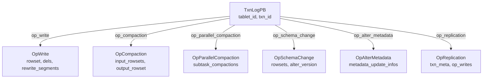
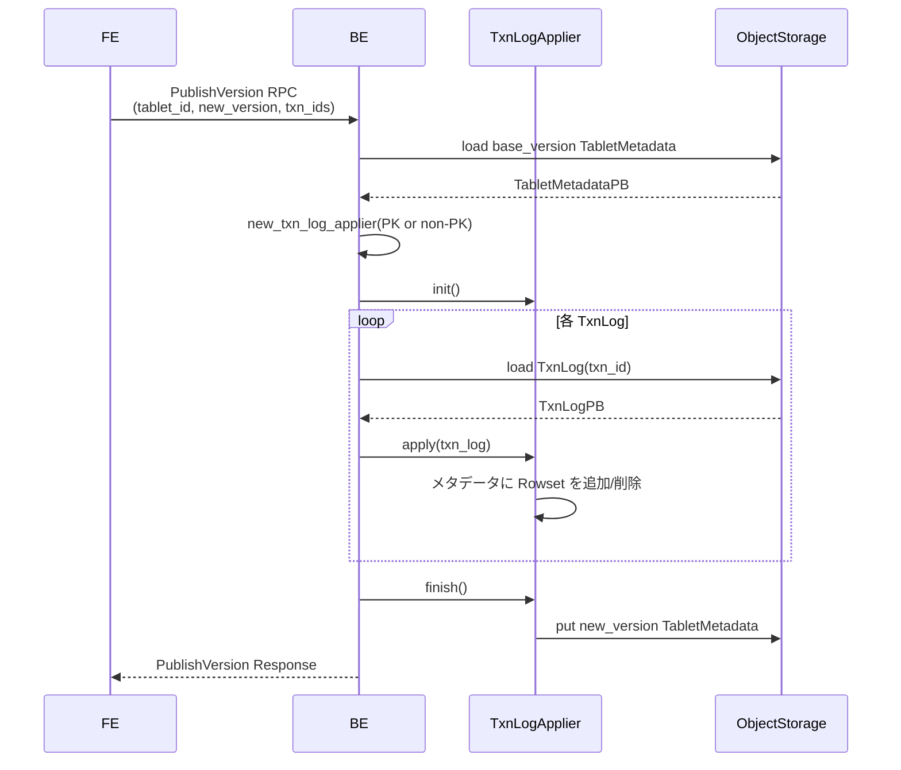
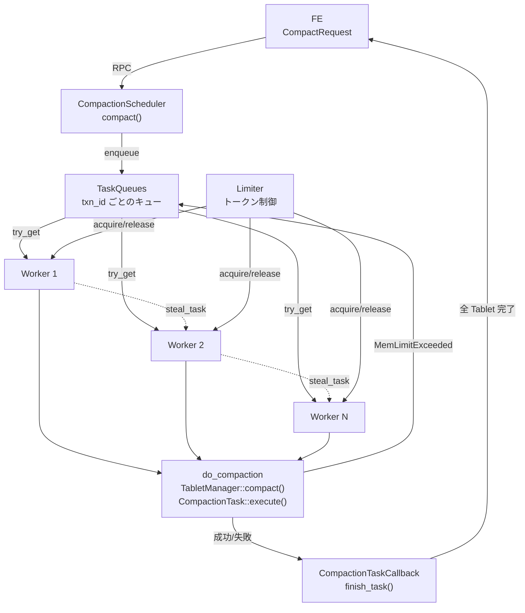

# 第21章 Lake トランザクションと Compaction

> **本章で読むソース**
>
> - [`gensrc/proto/lake_types.proto`](https://github.com/StarRocks/starrocks/blob/4.1.1/gensrc/proto/lake_types.proto)
> - [`be/src/storage/lake/txn_log.h`](https://github.com/StarRocks/starrocks/blob/4.1.1/be/src/storage/lake/txn_log.h)
> - [`be/src/storage/lake/txn_log_applier.h`](https://github.com/StarRocks/starrocks/blob/4.1.1/be/src/storage/lake/txn_log_applier.h)
> - [`be/src/storage/lake/txn_log_applier.cpp`](https://github.com/StarRocks/starrocks/blob/4.1.1/be/src/storage/lake/txn_log_applier.cpp)
> - [`be/src/storage/lake/compaction_policy.h`](https://github.com/StarRocks/starrocks/blob/4.1.1/be/src/storage/lake/compaction_policy.h)
> - [`be/src/storage/lake/compaction_policy.cpp`](https://github.com/StarRocks/starrocks/blob/4.1.1/be/src/storage/lake/compaction_policy.cpp)
> - [`be/src/storage/lake/compaction_task.h`](https://github.com/StarRocks/starrocks/blob/4.1.1/be/src/storage/lake/compaction_task.h)
> - [`be/src/storage/lake/compaction_task.cpp`](https://github.com/StarRocks/starrocks/blob/4.1.1/be/src/storage/lake/compaction_task.cpp)
> - [`be/src/storage/lake/compaction_scheduler.h`](https://github.com/StarRocks/starrocks/blob/4.1.1/be/src/storage/lake/compaction_scheduler.h)
> - [`be/src/storage/lake/versioned_tablet.h`](https://github.com/StarRocks/starrocks/blob/4.1.1/be/src/storage/lake/versioned_tablet.h)
> - [`be/src/storage/lake/update_manager.h`](https://github.com/StarRocks/starrocks/blob/4.1.1/be/src/storage/lake/update_manager.h)

## この章の狙い

Lake モード(存算分離)の Tablet は、メタデータをオブジェクトストレージに永続化する。
書き込みトランザクションは TxnLog として追記記録され、Publish 時にメタデータへ反映される。
本章では TxnLog の構造から TxnLogApplier によるメタデータ更新、VersionedTablet によるバージョン指定アクセス、そして Lake Compaction のポリシーとスケジューラまでを読む。

## 前提

第16章で Tablet と Rowset の基本構造を、第19章で shared-nothing モードの Compaction を読んだ。
Lake モードの Tablet メタデータは Protobuf (`TabletMetadataPB`) としてオブジェクトストレージに格納される。
第20章で Lake モードのメタデータ管理と StarOS 連携を読んだことを前提とする。

## 1. TxnLog の Protobuf 定義

**TxnLogPB** は Lake モードにおけるトランザクションの操作ログを表現する Protobuf メッセージである。
1つの TxnLog は1つの操作種別を記録する。
書き込み(`OpWrite`)、Compaction(`OpCompaction`)、並列 Compaction(`OpParallelCompaction`)、スキーマ変更(`OpSchemaChange`)、メタデータ変更(`OpAlterMetadata`)、レプリケーション(`OpReplication`)の6種類が定義されている。

トップレベルのフィールドは `tablet_id` と `txn_id` で操作対象を特定し、各操作に対応する optional フィールドを1つだけ持つ。

[`gensrc/proto/lake_types.proto` L373-L383](https://github.com/StarRocks/starrocks/blob/4.1.1/gensrc/proto/lake_types.proto#L373-L383)

```protobuf
    optional int64 tablet_id = 1;
    optional int64 txn_id = 2;
    optional OpWrite op_write = 3;
    optional OpCompaction op_compaction = 4;
    optional OpSchemaChange op_schema_change = 5;
    optional OpAlterMetadata op_alter_metadata = 6;
    optional OpReplication op_replication = 7;
    optional int64 partition_id = 8;
    optional PUniqueId load_id = 9;
    optional OpParallelCompaction op_parallel_compaction = 10;

```

### OpWrite

**OpWrite** は書き込み操作の詳細を保持する。
`rowset` フィールドに追加する Rowset のメタデータが入り、`dels` に削除ファイルのパスが列挙される。
Partial Update の場合は `rewrite_segments` に書き換え対象のセグメント名を記録し、GC による誤削除を防ぐ。

[`gensrc/proto/lake_types.proto` L265-L282](https://github.com/StarRocks/starrocks/blob/4.1.1/gensrc/proto/lake_types.proto#L265-L282)

```protobuf
    message OpWrite {
        optional RowsetMetadataPB rowset = 1;
        // some txn semantic information bind to this rowset
        optional RowsetTxnMetaPB txn_meta = 2;
        repeated string dels = 3;
        // for partial update, record dest rewrite segment names to avoid gc
        repeated string rewrite_segments = 4;
        repeated bytes del_encryption_metas = 5;
        repeated FileMetaPB ssts = 6;
        repeated PersistentIndexSstableRangePB sst_ranges = 7;
        // The specific table schema used to generate this rowset
        optional TableSchemaKeyPB schema_key = 8;
        // ... (中略) ...
        repeated bool shared_dels = 9;
    }

```

### OpCompaction

**OpCompaction** は Compaction 操作の入出力を記録する。
`input_rowsets` にマージ元の Rowset ID 群、`output_rowset` にマージ結果の Rowset メタデータが入る。
`compact_version` は Compaction 開始時のベースバージョンであり、Partial Update との競合検出に使われる。
`lcrm_file` フィールドは並列 PK インデックス処理で使用するマッパーファイルのメタデータを保持する。

[`gensrc/proto/lake_types.proto` L284-L319](https://github.com/StarRocks/starrocks/blob/4.1.1/gensrc/proto/lake_types.proto#L284-L319)

```protobuf
    message OpCompaction {
        repeated uint32 input_rowsets = 1;
        optional RowsetMetadataPB output_rowset = 2;
        repeated PersistentIndexSstablePB input_sstables = 3;
        optional PersistentIndexSstablePB output_sstable = 4;
        // Base version of compaction task, used for conflict check with partial update
        optional int64 compact_version = 5;
        // ... (中略) ...
        optional int32 new_segment_offset = 6;
        optional int32 new_segment_count = 7;
        repeated FileMetaPB ssts = 8;
        repeated PersistentIndexSstableRangePB sst_ranges = 9;
        repeated PersistentIndexSstablePB output_sstables = 10;
        // Lake Compaction Rows Mapper file metadata (.lcrm on remote storage)
        // ... (中略) ...
        optional FileMetaPB lcrm_file = 11;
        optional int32 subtask_id = 12;
        optional int32 segment_range_start = 13;
        optional int32 segment_range_end = 14;
    }

```

以下の図は `TxnLogPB` の操作バリアント構造を示す。



各 TxnLog は append-only かつ不変である。
書き込みフェーズでは各トランザクションが独立に TxnLog をオブジェクトストレージへ書き出すため、トランザクション間のロック競合は発生しない。
競合解決は Publish フェーズで TxnLog をメタデータに順次適用する時点まで遅延される。

## 2. TxnLog の型エイリアス

`txn_log.h` は Protobuf 生成クラスに対する型エイリアスのみを定義する薄いヘッダである。

[`be/src/storage/lake/txn_log.h` L23-L29](https://github.com/StarRocks/starrocks/blob/4.1.1/be/src/storage/lake/txn_log.h#L23-L29)

```cpp
using TxnLog = TxnLogPB;
using TxnLogPtr = std::shared_ptr<const TxnLog>;
using MutableTxnLogPtr = std::shared_ptr<TxnLog>;
using CombinedTxnLog = CombinedTxnLogPB;
using CombinedTxnLogPtr = std::shared_ptr<const CombinedTxnLog>;
using TxnLogVector = std::vector<TxnLogPtr>;
using TxnLogVectorPtr = std::shared_ptr<TxnLogVector>;

```

**TxnLog** は `TxnLogPB` そのものであり、`TxnLogPtr` は読み取り専用の shared_ptr、**MutableTxnLogPtr** は変更可能な shared_ptr である。
**CombinedTxnLog** は複数の TxnLog をまとめて保持する `CombinedTxnLogPB` のエイリアスで、バッチ操作に使われる。
`TxnLogVector` は Publish 時に複数の TxnLog を順次適用する場面で用いられる。

## 3. TxnLogApplier によるメタデータ更新

### TxnLogApplier インターフェース

**TxnLogApplier** は TxnLog をメタデータに適用する抽象基底クラスである。
`init()` で初期化し、`apply()` で TxnLog を1件ずつまたはバッチで適用し、`finish()` で新バージョンのメタデータをオブジェクトストレージに書き出す。

[`be/src/storage/lake/txn_log_applier.h` L33-L54](https://github.com/StarRocks/starrocks/blob/4.1.1/be/src/storage/lake/txn_log_applier.h#L33-L54)

```cpp
class TxnLogApplier {
public:
    virtual ~TxnLogApplier() = default;

    virtual Status init() { return Status::OK(); }

    virtual Status apply(const TxnLogPB& txn_log) = 0;

    virtual Status apply(const TxnLogVector& txn_logs) = 0;

    virtual Status finish() = 0;

    void observe_empty_compaction() { _has_empty_compaction = true; }

protected:
    bool _has_empty_compaction = false;
    bool _skip_write_tablet_metadata = false;
};

std::unique_ptr<TxnLogApplier> new_txn_log_applier(const Tablet& tablet, MutableTabletMetadataPtr metadata,
                                                   int64_t new_version, bool rebuild_pindex,
                                                   bool skip_write_tablet_metadata);

```

### ファクトリ関数

`new_txn_log_applier` はスキーマの `keys_type` に応じて2つの実装を使い分ける。

[`be/src/storage/lake/txn_log_applier.cpp` L1344-L1353](https://github.com/StarRocks/starrocks/blob/4.1.1/be/src/storage/lake/txn_log_applier.cpp#L1344-L1353)

```cpp
std::unique_ptr<TxnLogApplier> new_txn_log_applier(const Tablet& tablet, MutableTabletMetadataPtr metadata,
                                                   int64_t new_version, bool rebuild_pindex,
                                                   bool skip_write_tablet_metadata) {
    if (metadata->schema().keys_type() == PRIMARY_KEYS) {
        return std::make_unique<PrimaryKeyTxnLogApplier>(tablet, std::move(metadata), new_version,
                                                         rebuild_pindex, skip_write_tablet_metadata);
    }
    return std::make_unique<NonPrimaryKeyTxnLogApplier>(tablet, std::move(metadata), new_version,
                                                        skip_write_tablet_metadata);
}

```

`PRIMARY_KEYS` テーブルには **PrimaryKeyTxnLogApplier** が、それ以外のテーブルには **NonPrimaryKeyTxnLogApplier** が使われる。
PK テーブルでは適用時に PrimaryIndex の更新が必要となるため、処理が大幅に複雑になる。

### PrimaryKeyTxnLogApplier

`PrimaryKeyTxnLogApplier` は PK テーブル向けの実装であり、コンストラクタでベースバージョンを記録し、メタデータのバージョンを新バージョンに設定する。

[`be/src/storage/lake/txn_log_applier.cpp` L233-L245](https://github.com/StarRocks/starrocks/blob/4.1.1/be/src/storage/lake/txn_log_applier.cpp#L233-L245)

```cpp
class PrimaryKeyTxnLogApplier : public TxnLogApplier {
public:
    PrimaryKeyTxnLogApplier(const Tablet& tablet, MutableTabletMetadataPtr metadata, int64_t new_version,
                            bool rebuild_pindex, bool skip_write_tablet_metadata)
            : _tablet(tablet),
              _metadata(std::move(metadata)),
              _base_version(_metadata->version()),
              _new_version(new_version),
              _builder(_tablet, _metadata),
              _rebuild_pindex(rebuild_pindex) {
        _metadata->set_version(_new_version);
        _skip_write_tablet_metadata = skip_write_tablet_metadata;
    }

```

`apply()` メソッドは TxnLog の操作種別に応じてディスパッチする。
PK テーブルでは各操作の前に `check_and_recover` でインデックスの整合性を検証し、障害時にはインデックスを再構築する。

[`be/src/storage/lake/txn_log_applier.cpp` L292-L331](https://github.com/StarRocks/starrocks/blob/4.1.1/be/src/storage/lake/txn_log_applier.cpp#L292-L331)

```cpp
    Status apply(const TxnLogPB& log) override {
        // Tablet id check for cross publish
        if (log.tablet_id() != _metadata->id()) {
            return Status::InternalError("Tablet id in txn log and metadata are not the same");
        }

        SCOPED_THREAD_LOCAL_CHECK_MEM_LIMIT_SETTER(true);
        // ... (中略) ...
        _max_txn_id = std::max(_max_txn_id, log.txn_id());
        // ... (中略) ...
        RETURN_IF_ERROR(check_rebuild_index());
        if (log.has_op_write()) {
            // ... (中略) ...
            RETURN_IF_ERROR(check_and_recover([&]() { return apply_write_log(log.op_write(), log.txn_id()); }));
        }
        if (log.has_op_compaction()) {
            RETURN_IF_ERROR(
                    check_and_recover([&]() { return apply_compaction_log(log.op_compaction(), log.txn_id()); }));
        }
        if (log.has_op_parallel_compaction()) {
            RETURN_IF_ERROR(check_and_recover(
                    [&]() { return apply_parallel_compaction_log(log.op_parallel_compaction(), log.txn_id()); }));
        }
        // ... (中略) ...
        return Status::OK();
    }

```

PK テーブルの `apply_write_log` は `UpdateManager` を経由して PrimaryIndex を更新する。
カラムモード Partial Update の場合は `publish_column_mode_partial_update` を、通常の書き込みでは `publish_primary_key_tablet` を呼び出す。

### NonPrimaryKeyTxnLogApplier

`NonPrimaryKeyTxnLogApplier` は non-PK テーブル向けの実装である。
PrimaryIndex の管理が不要なため、メタデータの Rowset 操作のみで処理が完結する。

`apply()` は操作種別ごとに対応するメソッドを呼び出す。

[`be/src/storage/lake/txn_log_applier.cpp` L828-L853](https://github.com/StarRocks/starrocks/blob/4.1.1/be/src/storage/lake/txn_log_applier.cpp#L828-L853)

```cpp
    Status apply(const TxnLogPB& log) override {
        // Tablet id check for cross publish
        if (log.tablet_id() != _metadata->id()) {
            return Status::InternalError("Tablet id in txn log and metadata are not the same");
        }

        if (log.has_op_write()) {
            RETURN_IF_ERROR(apply_write_log(log.op_write(), log.txn_id()));
        }
        if (log.has_op_compaction()) {
            RETURN_IF_ERROR(apply_compaction_log(log.op_compaction()));
        }
        if (log.has_op_parallel_compaction()) {
            RETURN_IF_ERROR(apply_parallel_compaction_log(log.op_parallel_compaction()));
        }
        // ... (中略) ...
        return Status::OK();
    }

```

### apply_write_log (non-PK)

non-PK テーブルの書き込みログ適用は単純である。
OpWrite の Rowset を `TabletMetadataPB` の `rowsets` リストに追加し、新しい ID を割り当ててバージョンを設定し、`next_rowset_id` を進める。

[`be/src/storage/lake/txn_log_applier.cpp` L1043-L1063](https://github.com/StarRocks/starrocks/blob/4.1.1/be/src/storage/lake/txn_log_applier.cpp#L1043-L1063)

```cpp
    Status apply_write_log(const TxnLogPB_OpWrite& op_write, int64_t txn_id) {
        TEST_ERROR_POINT("NonPrimaryKeyTxnLogApplier::apply_write_log");
        RETURN_IF_ERROR(update_metadata_schema(op_write, txn_id, _metadata, _tablet.tablet_mgr()));
        if (op_write.has_rowset() && (op_write.rowset().num_rows() > 0 || op_write.rowset().has_delete_predicate())) {
            auto rowset = _metadata->add_rowsets();
            rowset->CopyFrom(op_write.rowset());
            rowset->set_id(_metadata->next_rowset_id());
            rowset->set_version(_new_version);
            _metadata->set_next_rowset_id(_metadata->next_rowset_id() + get_rowset_id_step(*rowset));
            if (!_metadata->rowset_to_schema().empty()) {
                auto schema_id = _metadata->schema().id();
                (*_metadata->mutable_rowset_to_schema())[rowset->id()] = schema_id;
                // first rowset of latest schema
                if (_metadata->historical_schemas().count(schema_id) <= 0) {
                    auto& item = (*_metadata->mutable_historical_schemas())[schema_id];
                    item.CopyFrom(_metadata->schema());
                }
            }
        }
        return Status::OK();
    }

```

処理手順を整理する。

1. `update_metadata_schema` でスキーマの互換性を確認する
2. Rowset に行データまたは delete predicate がある場合のみメタデータに追加する
3. `CopyFrom` で OpWrite の Rowset メタデータをコピーする
4. `next_rowset_id` から新しい ID を割り当て、バージョンを設定する(L1049-L1051)
5. スキーマ変更が行われている場合、`rowset_to_schema` マップを更新する(L1052-L1059)

### apply_compaction_log_single_output (non-PK)

Compaction ログの適用は入力 Rowset の除去と出力 Rowset の挿入を行う。

[`be/src/storage/lake/txn_log_applier.cpp` L1098-L1170](https://github.com/StarRocks/starrocks/blob/4.1.1/be/src/storage/lake/txn_log_applier.cpp#L1098-L1170)

```cpp
    Status apply_compaction_log_single_output(const TxnLogPB_OpCompaction& op_compaction) {
        // It's ok to have a compaction log without input rowset and output rowset.
        if (op_compaction.input_rowsets().empty()) {
            DCHECK(!op_compaction.has_output_rowset() || op_compaction.output_rowset().num_rows() == 0);
            return Status::OK();
        }

        struct Finder {
            int64_t id;
            bool operator()(const RowsetMetadata& r) const { return r.id() == id; }
        };

        auto input_id = op_compaction.input_rowsets(0);
        auto first_input_pos = std::find_if(_metadata->mutable_rowsets()->begin(), _metadata->mutable_rowsets()->end(),
                                            Finder{input_id});
        if (UNLIKELY(first_input_pos == _metadata->mutable_rowsets()->end())) {
            LOG(INFO) << "input rowset not found";
            return Status::InternalError(fmt::format("input rowset {} not found", input_id));
        }

        // Safety check:
        // 1. All input rowsets must exist in |_metadata->rowsets()|
        // 2. Position of the input rowsets must be adjacent.
        auto pre_input_pos = first_input_pos;
        for (int i = 1, sz = op_compaction.input_rowsets_size(); i < sz; i++) {
            input_id = op_compaction.input_rowsets(i);
            auto it = std::find_if(pre_input_pos + 1, _metadata->mutable_rowsets()->end(), Finder{input_id});
            // ... (中略) ...
        }

        // ... (中略) ...
        // replace first input rowset with output rowset
        if (op_compaction.has_output_rowset() && op_compaction.output_rowset().num_rows() > 0) {
            auto output_rowset = _metadata->mutable_rowsets(first_idx);
            output_rowset->CopyFrom(op_compaction.output_rowset());
            output_rowset->set_id(_metadata->next_rowset_id());
            output_rowset->set_version(_new_version);
            _metadata->set_next_rowset_id(_metadata->next_rowset_id() + get_rowset_id_step(*output_rowset));
            ++first_input_pos;
            // ... (中略) ...
        }
        // Erase input rowsets from _metadata
        _metadata->mutable_rowsets()->erase(first_input_pos, end_input_pos);
        // ... (中略) ...
    }

```

この処理の流れは以下のとおりである。

1. 入力 Rowset の先頭 ID からメタデータ内の位置を検索する(L1110-L1116)
2. すべての入力 Rowset がメタデータ内で隣接していることを検証する(L1121-L1132)
3. 入力 Rowset を `compaction_inputs` に移動して GC 対象として記録する(L1145-L1152)
4. 先頭の入力 Rowset を出力 Rowset で上書きし、新しい ID とバージョンを設定する(L1157-L1167)
5. 残りの入力 Rowset をメタデータから削除する(L1169)

隣接性の検証は、Compaction の入力 Rowset が連続した範囲に並んでいることを保証する。
並んでいなければメタデータの不整合を意味するため、`InternalError` を返す。

### finish (non-PK)

[`be/src/storage/lake/txn_log_applier.cpp` L1033-L1040](https://github.com/StarRocks/starrocks/blob/4.1.1/be/src/storage/lake/txn_log_applier.cpp#L1033-L1040)

```cpp
    Status finish() override {
        _metadata->GetReflection()->MutableUnknownFields(_metadata.get())->Clear();
        _metadata->set_version(_new_version);
        if (_skip_write_tablet_metadata) {
            return ExecEnv::GetInstance()->lake_tablet_manager()->cache_tablet_metadata(_metadata);
        }
        return _tablet.put_metadata(_metadata);
    }

```

`finish()` は最終バージョンを設定し、メタデータをオブジェクトストレージに永続化する。
`_skip_write_tablet_metadata` が有効な場合はキャッシュに保持するのみで、書き出しを省略する。

### Publish フロー

以下の図は PublishVersion RPC の処理フローを示す。



## 4. VersionedTablet: バージョン指定アクセス

**VersionedTablet** は特定バージョンの Tablet を表す軽量なハンドルである。
`TabletManager` のポインタと不変の `TabletMetadataPtr` を保持し、そのバージョンの Rowset やスキーマへのアクセスを提供する。

[`be/src/storage/lake/versioned_tablet.h` L41-L96](https://github.com/StarRocks/starrocks/blob/4.1.1/be/src/storage/lake/versioned_tablet.h#L41-L96)

```cpp
// A tablet contains shards of data. There can be multiple versions of the same
// tablet. This class represents a specific version of a tablet.
class VersionedTablet {
    using RowsetPtr = std::shared_ptr<Rowset>;
    using RowsetList = std::vector<RowsetPtr>;
    using TabletMetadataPtr = std::shared_ptr<const TabletMetadataPB>;
    using TabletSchemaPtr = std::shared_ptr<const TabletSchema>;

public:
    // Default constructor. After construction, valid() is false
    VersionedTablet() : _tablet_mgr(nullptr), _metadata() {}

    // |tablet_mgr| cannot be nullptr and must outlive this VersionedTablet.
    // |metadata| cannot be nullptr.
    explicit VersionedTablet(TabletManager* tablet_mgr, TabletMetadataPtr metadata)
            : _tablet_mgr(tablet_mgr), _metadata(std::move(metadata)) {}

    bool valid() const { return _metadata != nullptr; }

    // Same as metadata()->id()
    int64_t id() const;

    // Same as metadata()->version()
    int64_t version() const;

    const TabletMetadataPtr& metadata() const { return _metadata; }

    TabletSchemaPtr get_schema() const;

    // Prerequisite: valid() == true
    RowsetList get_rowsets() const;

    // ... (中略) ...

    StatusOr<std::unique_ptr<TabletWriter>> new_writer(WriterType type, int64_t txn_id,
                                                       uint32_t max_rows_per_segment = 0,
                                                       ThreadPool* flush_pool = nullptr, bool is_compaction = false);

    StatusOr<std::unique_ptr<TabletReader>> new_reader(Schema schema);

    // ... (中略) ...

    TabletManager* tablet_manager() const { return _tablet_mgr; }

    // ... (中略) ...

private:
    TabletManager* _tablet_mgr;
    TabletMetadataPtr _metadata;
};

```

コンストラクタは `TabletManager*` と `TabletMetadataPtr` を受け取る(L53-L54)。
`TabletMetadataPtr` は `shared_ptr<const TabletMetadataPB>` であり、メタデータは不変のスナップショットとして共有される。
`id()` と `version()` はメタデータの対応するフィールドへの委譲メソッドである(L59-L62)。

「VersionedTablet」は `new_writer()` や `new_reader()` を通じて TabletWriter や TabletReader を生成する。
Compaction タスクは `VersionedTablet` を通じて入力 Rowset にアクセスし、出力を書き込む。

shared-nothing モードの `Tablet` が `TabletManager` から直接 Rowset を取得するのに対し、Lake モードの「VersionedTablet」はバージョン固定のメタデータスナップショットを保持する。
これにより、読み出しと書き込みが同じ Tablet に対して並行して実行されても、互いのメタデータに干渉しない。

## 5. Lake Compaction ポリシー

### CompactionPolicy インターフェース

**CompactionPolicy** は Lake モードの Compaction 対象 Rowset を選択する抽象基底クラスである。
`pick_rowsets()` が選択ロジックの本体であり、`choose_compaction_algorithm()` が水平マージと垂直マージを切り替える。

[`be/src/storage/lake/compaction_policy.h` L35-L62](https://github.com/StarRocks/starrocks/blob/4.1.1/be/src/storage/lake/compaction_policy.h#L35-L62)

```cpp
class CompactionPolicy {
public:
    virtual ~CompactionPolicy();

    virtual StatusOr<std::vector<RowsetPtr>> pick_rowsets() = 0;

    virtual StatusOr<CompactionAlgorithm> choose_compaction_algorithm(const std::vector<RowsetPtr>& rowsets);

    static StatusOr<CompactionPolicyPtr> create(TabletManager* tablet_mgr,
                                                std::shared_ptr<const TabletMetadataPB> tablet_metadata,
                                                bool force_base_compaction);

    // ... (中略) ...

protected:
    explicit CompactionPolicy(TabletManager* tablet_mgr, std::shared_ptr<const TabletMetadataPB> tablet_metadata,
                              bool force_base_compaction)
            : _tablet_mgr(tablet_mgr),
              _tablet_metadata(std::move(tablet_metadata)),
              _force_base_compaction(force_base_compaction) {
        CHECK(_tablet_mgr != nullptr) << "tablet_mgr is null";
        CHECK(_tablet_metadata != nullptr) << "tablet metadata is null";
    }

    TabletManager* _tablet_mgr;
    std::shared_ptr<const TabletMetadataPB> _tablet_metadata;
    bool _force_base_compaction;
};

```

### ファクトリメソッド

`CompactionPolicy::create` はテーブルのキー種別と設定に応じて3つの実装を使い分ける。

[`be/src/storage/lake/compaction_policy.cpp` L600-L612](https://github.com/StarRocks/starrocks/blob/4.1.1/be/src/storage/lake/compaction_policy.cpp#L600-L612)

```cpp
StatusOr<CompactionPolicyPtr> CompactionPolicy::create(TabletManager* tablet_mgr,
                                                       std::shared_ptr<const TabletMetadataPB> tablet_metadata,
                                                       bool force_base_compaction) {
    if (tablet_metadata->schema().keys_type() == PRIMARY_KEYS) {
        return std::make_shared<PrimaryCompactionPolicy>(tablet_mgr, std::move(tablet_metadata), force_base_compaction);
    } else if (config::enable_size_tiered_compaction_strategy) {
        return std::make_shared<SizeTieredCompactionPolicy>(tablet_mgr, std::move(tablet_metadata),
                                                            force_base_compaction);
    } else {
        return std::make_shared<BaseAndCumulativeCompactionPolicy>(tablet_mgr, std::move(tablet_metadata),
                                                                   force_base_compaction);
    }
}

```

分岐条件は以下の3つである。

1. **PrimaryCompactionPolicy**: `PRIMARY_KEYS` テーブルに使用される
2. **SizeTieredCompactionPolicy**: `enable_size_tiered_compaction_strategy` が有効な non-PK テーブルに使用される
3. **BaseAndCumulativeCompactionPolicy**: それ以外の non-PK テーブルに使用される(第19章で読んだ shared-nothing モードと同等の Base/Cumulative 方式)

### SizeTieredCompactionPolicy

**SizeTieredCompactionPolicy** はデータサイズに基づいてレベル分けし、同じレベル内の Rowset をマージする方式である。

[`be/src/storage/lake/compaction_policy.cpp` L125-L134](https://github.com/StarRocks/starrocks/blob/4.1.1/be/src/storage/lake/compaction_policy.cpp#L125-L134)

```cpp
struct SizeTieredLevel {
    SizeTieredLevel(std::vector<int> r, int64_t s, int64_t l, int64_t t, double sc)
            : rowsets(std::move(r)), segment_num(s), level_size(l), total_size(t), score(sc) {}

    std::vector<int> rowsets;
    int64_t segment_num;
    int64_t level_size;
    int64_t total_size;
    double score;
};

```

**SizeTieredLevel** は1つのレベルに属する Rowset のインデックス群、セグメント数、基準サイズ、合計サイズ、スコアを保持する。

### Compaction スコア計算

`cal_compaction_score` はレベルごとの Compaction 優先度を算出する。

[`be/src/storage/lake/compaction_policy.cpp` L322-L356](https://github.com/StarRocks/starrocks/blob/4.1.1/be/src/storage/lake/compaction_policy.cpp#L322-L356)

```cpp
double SizeTieredCompactionPolicy::cal_compaction_score(int64_t segment_num, int64_t level_size, int64_t total_size,
                                                        int64_t max_level_size, KeysType keys_type,
                                                        bool reached_max_version) {
    // base score is segment num
    double score = segment_num;

    // data bonus
    double data_bonus = 0;
    if (keys_type == KeysType::DUP_KEYS) {
        // duplicate keys only has write amplification, so that we use more aggressive size-tiered strategy
        data_bonus = ((double)(total_size - level_size) / level_size) * 2;
    } else {
        // agg/unique key also has read amplification, segment num occupies a greater weight
        data_bonus = (segment_num - 1) * 2 + ((double)(total_size - level_size) / level_size);
    }
    // Normalized score, max data bonus limit to triple size_tiered_level_multiple
    data_bonus = std::min((double)config::size_tiered_level_multiple * 3, data_bonus);
    score += data_bonus;

    // level bonus: The lower the level means the smaller the data volume of the compaction,
    // the higher the execution priority
    int64_t level_bonus = 0;
    for (int64_t v = level_size; v < max_level_size && level_bonus <= 7; ++level_bonus) {
        v = v * config::size_tiered_level_multiple;
    }
    score += level_bonus;

    // version limit bonus: The version num of the tablet is about to exceed the limit,
    // we let it perform compaction faster and reduce the version num
    if (reached_max_version) {
        score *= 2;
    }

    return score;
}

```

スコアは4つの要素から構成される。

1. **ベーススコア**: セグメント数そのもの。セグメントが多いほどマージの効果が大きい
2. **データボーナス**: DUP_KEYS テーブルでは書き込み増幅のみを考慮し、サイズ比に基づく攻撃的なスコアを付与する。AGG/UNIQUE テーブルでは読み出し増幅も考慮し、セグメント数をより重く評価する
3. **レベルボーナス**: 小さなレベルほど Compaction コストが低いため、優先度を上げる。最大7まで加算される
4. **バージョン上限ボーナス**: Rowset 数が `tablet_max_versions` の 90% を超えた場合、スコアを2倍にして Compaction を加速する

### pick_max_level

`pick_max_level` は Rowset 群をサイズベースでレベルに分割し、最もスコアの高いレベルを返す。

[`be/src/storage/lake/compaction_policy.cpp` L358-L400](https://github.com/StarRocks/starrocks/blob/4.1.1/be/src/storage/lake/compaction_policy.cpp#L358-L400)

```cpp
StatusOr<std::unique_ptr<SizeTieredLevel>> SizeTieredCompactionPolicy::pick_max_level(const TabletMetadataPB& metadata,
                                                                                      bool force_base_compaction) {
    int64_t max_level_size =
            config::size_tiered_min_level_size * pow(config::size_tiered_level_multiple, config::size_tiered_level_num);
    const auto& rowsets = metadata.rowsets();

    if (rowsets.empty() || (rowsets.size() == 1 && !rowsets[0].overlapped())) {
        return nullptr;
    }

    // too many delete version will incur read overhead
    size_t num_delete_rowsets = 0;
    for (auto& rowset : rowsets) {
        if (rowset.has_delete_predicate()) {
            ++num_delete_rowsets;
        }
    }
    force_base_compaction = force_base_compaction || (num_delete_rowsets >= config::tablet_max_versions / 10);

    // check reach max version
    bool reached_max_version = (rowsets.size() > config::tablet_max_versions / 10 * 9);
    // ... (中略) ...
    std::vector<std::unique_ptr<SizeTieredLevel>> order_levels;
    std::set<SizeTieredLevel*, LevelReverseOrderComparator> priority_levels;
    std::vector<int> transient_rowsets;
    size_t segment_num = 0;
    int64_t level_multiple = config::size_tiered_level_multiple;
    auto keys_type = metadata.schema().keys_type();
    auto min_compaction_segment_num =
            std::max<int64_t>(2, std::min(config::min_cumulative_compaction_num_singleton_deltas, level_multiple));
    int64_t level_size = -1;
    int64_t total_size = 0;
    for (int i = 0, size = rowsets.size(); i < size; ++i) {
        const auto& rowset = rowsets[i];
        int64_t rowset_size = rowset.data_size() > 0 ? rowset.data_size() : 1;
        if (level_size == -1) {
            level_size = rowset_size < max_level_size ? rowset_size : max_level_size;
            total_size = 0;
        }
        // ... (中略) ...
    }
    // ... (中略) ...
}

```

レベル分割のロジックは以下の手順で進む。

1. `max_level_size` を `size_tiered_min_level_size * level_multiple^level_num` で計算する(L360-L361)
2. delete Rowset が `tablet_max_versions / 10` 以上であれば Base Compaction を強制する(L375)
3. 各 Rowset を順に走査し、サイズが `level_size * level_multiple` を超えたら新しいレベルに区切る
4. 各レベルの `cal_compaction_score` を計算し、`LevelReverseOrderComparator` でスコア降順にソートする
5. 最もスコアの高いレベルを返す

### Compaction スコアの算出

トップレベルの `compaction_score` 関数はテーブル種別に応じてスコア計算をディスパッチする。

[`be/src/storage/lake/compaction_policy.cpp` L614-L622](https://github.com/StarRocks/starrocks/blob/4.1.1/be/src/storage/lake/compaction_policy.cpp#L614-L622)

```cpp
double compaction_score(TabletManager* tablet_mgr, const std::shared_ptr<const TabletMetadataPB>& metadata) {
    if (is_primary_key(*metadata)) {
        return primary_compaction_score(tablet_mgr, metadata);
    }
    if (config::enable_size_tiered_compaction_strategy) {
        return size_tiered_compaction_score(metadata);
    }
    return std::max(base_compaction_score(metadata), cumulative_compaction_score(metadata));
}

```

PK テーブルは `primary_compaction_score` を使い、size-tiered が有効なら `size_tiered_compaction_score` を使い、それ以外は Base と Cumulative の大きい方を返す。
FE はこのスコアを用いて Compaction 対象の Tablet を優先順位付けする。

## 6. CompactionTask の実行

### CompactionTask クラス

**CompactionTask** は Compaction の1回の実行を表す抽象基底クラスである。
`VersionedTablet` と入力 Rowset 群を保持し、サブクラスが `execute()` を実装する。

[`be/src/storage/lake/compaction_task.h` L38-L95](https://github.com/StarRocks/starrocks/blob/4.1.1/be/src/storage/lake/compaction_task.h#L38-L95)

```cpp
class CompactionTask {
public:
    // CancelFunc is a function that used to tell the compaction task whether the task
    // should be cancelled.
    using CancelFunc = std::function<Status()>;

    explicit CompactionTask(VersionedTablet tablet, std::vector<std::shared_ptr<Rowset>> input_rowsets,
                            CompactionTaskContext* context, std::shared_ptr<const TabletSchema> tablet_schema);
    virtual ~CompactionTask() = default;

    virtual Status execute(CancelFunc cancel_func, ThreadPool* flush_pool = nullptr) = 0;

    // ... (中略) ...

protected:
    int64_t _txn_id;
    VersionedTablet _tablet;
    std::vector<std::shared_ptr<Rowset>> _input_rowsets;
    std::unique_ptr<MemTracker> _mem_tracker = nullptr;
    CompactionTaskContext* _context;
    std::shared_ptr<const TabletSchema> _tablet_schema;
    // ... (中略) ...
};

```

**CancelFunc** はタスク実行中にキャンセルの要否を問い合わせるコールバックである(L42)。
FE 側でトランザクションが無効化された場合、`CancelFunc` が `Status::Aborted` を返すことでタスクを早期終了させる。

### コンストラクタ

[`be/src/storage/lake/compaction_task.cpp` L25-L34](https://github.com/StarRocks/starrocks/blob/4.1.1/be/src/storage/lake/compaction_task.cpp#L25-L34)

```cpp
CompactionTask::CompactionTask(VersionedTablet tablet, std::vector<std::shared_ptr<Rowset>> input_rowsets,
                               CompactionTaskContext* context, std::shared_ptr<const TabletSchema> tablet_schema)
        : _txn_id(context->txn_id),
          _tablet(std::move(tablet)),
          _input_rowsets(std::move(input_rowsets)),
          _mem_tracker(std::make_unique<MemTracker>(MemTrackerType::COMPACTION_TASK, -1,
                                                    "Compaction-" + std::to_string(_tablet.metadata()->id()),
                                                    GlobalEnv::GetInstance()->compaction_mem_tracker())),
          _context(context),
          _tablet_schema(std::move(tablet_schema)) {}

```

`MemTracker` は `compaction_mem_tracker()` の子として作成され、Compaction 中のメモリ使用量を追跡する。
メモリ上限を超えた場合は `Status::MemoryLimitExceeded` が返り、スケジューラが並列度を下げる契機となる。

### fill_compaction_segment_info

`fill_compaction_segment_info` は Compaction 結果のセグメント情報を `OpCompaction` に記録する。

[`be/src/storage/lake/compaction_task.cpp` L63-L100](https://github.com/StarRocks/starrocks/blob/4.1.1/be/src/storage/lake/compaction_task.cpp#L63-L100)

```cpp
Status CompactionTask::fill_compaction_segment_info(TxnLogPB_OpCompaction* op_compaction, TabletWriter* writer) {
    for (auto& rowset : _input_rowsets) {
        op_compaction->add_input_rowsets(rowset->id());
    }

    // check last rowset whether this is a partial compaction
    if (_tablet_schema->keys_type() != KeysType::PRIMARY_KEYS && _input_rowsets.size() > 0 &&
        _input_rowsets.back()->partial_segments_compaction()) {
        // ... (中略) ... partial compaction handling
    } else {
        op_compaction->set_new_segment_offset(0);
        for (const auto& file : writer->segments()) {
            uint32_t segment_idx = op_compaction->output_rowset().segments_size();
            op_compaction->mutable_output_rowset()->add_segments(file.path);
            op_compaction->mutable_output_rowset()->add_segment_size(file.size.value());
            op_compaction->mutable_output_rowset()->add_segment_encryption_metas(file.encryption_meta);
            auto* segment_meta = op_compaction->mutable_output_rowset()->add_segment_metas();
            file.write_sort_key_fields_to(segment_meta);
            segment_meta->set_num_rows(file.num_rows);
            segment_meta->set_segment_idx(segment_idx);
        }
        op_compaction->set_new_segment_count(writer->segments().size());
        op_compaction->mutable_output_rowset()->set_num_rows(writer->num_rows());
        op_compaction->mutable_output_rowset()->set_data_size(writer->data_size());
        op_compaction->mutable_output_rowset()->set_overlapped(false);
        // ... (中略) ...
    }
    return Status::OK();
}

```

通常の Compaction では、Writer が出力したセグメントファイルのパス、サイズ、暗号化メタデータ、行数を `OpCompaction` の `output_rowset` に記録する(L80-L89)。
出力 Rowset は `overlapped(false)` に設定され、セグメント間のキー範囲が重複しないことを示す。
Partial Compaction の場合は、コンパクト済みセグメントと未コンパクトセグメントを混在させた出力を生成する。

## 7. CompactionScheduler のスケジューリング

### Limiter による並列度制御

**CompactionScheduler** は FE からの CompactRequest を受け付け、ワーカースレッドに分配するスケジューラである。
内部クラスの **Limiter** がメモリ使用量に応じた適応的な並列度制御を提供する。

[`be/src/storage/lake/compaction_scheduler.h` L127-L156](https://github.com/StarRocks/starrocks/blob/4.1.1/be/src/storage/lake/compaction_scheduler.h#L127-L156)

```cpp
    class Limiter {
    public:
        constexpr const static int16_t kConcurrencyRestoreTimes = 2;

        explicit Limiter(int16_t total) : _total(total), _free(total), _reserved(0), _success(0) {}

        // Acquire a token for doing compaction task. returns true on success and false otherwise.
        // No new compaction task should be scheduled to run if the method returned false.
        bool acquire();

        // Compaction task finished without Status::MemoryLimitExceeded error.
        void no_memory_limit_exceeded();

        // Compaction task finished with Status::MemoryLimitExceeded error.
        void memory_limit_exceeded();

        int16_t concurrency() const;

        void adapt_to_task_queue_size(int16_t new_val);

    private:
        mutable std::mutex _mtx;
        int16_t _total;
        // The number of tokens can be assigned to compaction tasks.
        int64_t _free;
        // The number of reserved tokens. reserved tokens cannot be assigned to compaction task.
        int16_t _reserved;
        // The number of tasks that didn't encounter the Status::MemoryLimitExceeded error.
        int64_t _success;
    };

```

「Limiter」はトークンベースの並列度制御を行う。
初期状態では `_total` 個(= `compact_threads` の設定値)のトークンが利用可能である。
`acquire()` でトークンを取得し、タスク完了時に `no_memory_limit_exceeded()` または `memory_limit_exceeded()` でトークンを返却する。

[`be/src/storage/lake/compaction_scheduler.h` L267-L275](https://github.com/StarRocks/starrocks/blob/4.1.1/be/src/storage/lake/compaction_scheduler.h#L267-L275)

```cpp
inline bool CompactionScheduler::Limiter::acquire() {
    std::lock_guard l(_mtx);
    if (_free > 0) {
        _free--;
        return true;
    } else {
        return false;
    }
}

```

`acquire()` は `_free` が正であればトークンを1つ消費して `true` を返す。
トークンが枯渇していればタスクを開始せず、ワーカースレッドは短時間スリープする。

[`be/src/storage/lake/compaction_scheduler.h` L289-L297](https://github.com/StarRocks/starrocks/blob/4.1.1/be/src/storage/lake/compaction_scheduler.h#L289-L297)

```cpp
inline void CompactionScheduler::Limiter::memory_limit_exceeded() {
    std::lock_guard l(_mtx);
    _success = 0;
    if (_reserved + 1 < _total) { // Cannot reduce the concurrency to zero.
        _reserved++;
        LOG(INFO) << "Decreased maximum compaction concurrency to " << (_total - _reserved);
    } else {
        _free++;
    }
}

```

`memory_limit_exceeded()` が呼ばれると、`_reserved` を1増やして最大並列度を下げる。
ただし並列度が0にならないよう `_reserved + 1 < _total` でガードしている。
`_success` カウンタをリセットするため、回復には連続 `kConcurrencyRestoreTimes`(= 2)回の成功が必要になる。

### compact エントリポイント

[`be/src/storage/lake/compaction_scheduler.cpp` L263-L325](https://github.com/StarRocks/starrocks/blob/4.1.1/be/src/storage/lake/compaction_scheduler.cpp#L263-L325)

```cpp
void CompactionScheduler::compact(::google::protobuf::RpcController* controller, const CompactRequest* request,
                                  CompactResponse* response, ::google::protobuf::Closure* done) {
    brpc::ClosureGuard guard(done);
    // ... (中略) ...

    auto cb = std::make_shared<CompactionTaskCallback>(this, request, response, done);

    std::vector<std::unique_ptr<CompactionTaskContext>> contexts_vec;
    for (auto tablet_id : request->tablet_ids()) {
        auto context = std::make_unique<CompactionTaskContext>(request->txn_id(), tablet_id, request->version(),
                                                               request->force_base_compaction(),
                                                               request->skip_write_txnlog(), cb);
        contexts_vec.push_back(std::move(context));
    }

    // initialize last check time, compact request is received right after FE sends it, so consider it valid now
    cb->set_last_check_time(time(nullptr));

    // ... (中略) ...

    // Original non-parallel mode
    {
        std::lock_guard l(_contexts_lock);
        for (auto& ctx : contexts_vec) {
            _contexts.Append(ctx.get());
        }
    }
    _task_queues.put_by_txn_id(request->txn_id(), contexts_vec);
    guard.release();
    // ... (中略) ...
}

```

`compact()` は CompactRequest RPC のハンドラである。
1つのリクエストに含まれる全 Tablet の `CompactionTaskContext` を生成し、`_task_queues` にトランザクション ID ごとにまとめて投入する。
**CompactionTaskCallback** は全 Tablet の完了を追跡し、最後の1つが完了した時点で FE にレスポンスを返す。

### ワーカースレッド

[`be/src/storage/lake/compaction_scheduler.cpp` L476-L502](https://github.com/StarRocks/starrocks/blob/4.1.1/be/src/storage/lake/compaction_scheduler.cpp#L476-L502)

```cpp
void CompactionScheduler::thread_task(int id) {
    while (!_stopped.load(std::memory_order_acquire)) {
        if (reschedule_task_if_needed(id)) {
            break;
        }
        if (!_limiter.acquire()) {
            nap_sleep(1, [&] { return _stopped.load(); });
            continue;
        }

        CompactionContextPtr context;
        if (!_task_queues.try_get(id, &context)) {
            _task_queues.steal_task(id + 1, &context);
        }

        if (context != nullptr) {
            auto st = do_compaction(std::move(context));
            if (st.is_mem_limit_exceeded()) {
                _limiter.memory_limit_exceeded();
            } else {
                _limiter.no_memory_limit_exceeded();
            }
        } else {
            _limiter.no_memory_limit_exceeded();
            nap_sleep(1, [&] { return _stopped.load(); });
        }
    }
}

```

各ワーカースレッドのループは以下の手順で動作する。

1. `_limiter.acquire()` でトークンを取得する。取得できなければ1秒スリープして再試行する(L481-L484)
2. 自分のキュー(`id`)からタスクを取得する(L487)
3. 自分のキューが空であれば、他のキューからタスクを奪取する(`steal_task`)(L488)
4. タスクがあれば `do_compaction()` を呼ぶ(L492)
5. 結果に応じて「Limiter」の並列度を調整する(L493-L496)

### do_compaction

[`be/src/storage/lake/compaction_scheduler.cpp` L509-L570](https://github.com/StarRocks/starrocks/blob/4.1.1/be/src/storage/lake/compaction_scheduler.cpp#L509-L570)

```cpp
Status CompactionScheduler::do_compaction(std::unique_ptr<CompactionTaskContext> context) {
    const auto start_time = ::time(nullptr);
    const auto tablet_id = context->tablet_id;
    const auto txn_id = context->txn_id;
    const auto version = context->version;

    // ... (中略) ...
    context->runs.fetch_add(1, std::memory_order_relaxed);

    auto status = Status::OK();
    auto task_or = _tablet_mgr->compact(context.get());
    if (task_or.ok()) {
        auto should_cancel = [&]() { return compaction_should_cancel(context.get()); };
        // ... (中略) ...
        status.update(task_or.value()->execute(std::move(should_cancel), flush_pool));
    } else {
        status.update(task_or.status());
    }

    // ... (中略) ...
    // Task failure due to memory limitations allows for retries, more threads allow for more retries.
    if (!context->callback->allow_partial_success() && status.is_mem_limit_exceeded() &&
        context->runs.load(std::memory_order_relaxed) < _task_queues.task_queue_size() + 1) {
        LOG(WARNING) << "Memory limit exceeded, will retry later. tablet_id=" << tablet_id
                     // ... (中略) ...
        context->progress.update(0);
        _task_queues.put_by_txn_id(context->txn_id, context);
    } else {
        // ... (中略) ...
        context->status = status;
        context->finish_time.store(finish_time, std::memory_order_release);

        auto cb = context->callback;
        cb->finish_task(std::move(context));
    }

    return status;
}

```

`do_compaction()` の処理の流れを整理する。

1. `_tablet_mgr->compact()` で `CompactionTask` を生成する(L521)
2. `CancelFunc` を設定し、`task->execute()` で Compaction を実行する(L523-L533)
3. `MemoryLimitExceeded` の場合、リトライ回数が上限未満であればキューに再投入する(L543-L550)
4. 成功または回復不能な失敗の場合、`cb->finish_task()` で結果を通知する(L565-L566)

リトライ上限は `task_queue_size() + 1` である。
ワーカースレッド数分までリトライを許容し、並列度を段階的に下げながら再試行することで、一時的なメモリ逼迫を乗り越える設計になっている。

以下の図はスケジューラのアーキテクチャを示す。



## 8. 最適化: TxnLog の append-only 設計と適応的並列度

Lake トランザクション層には、ロックフリーな並行処理を実現する設計上の工夫がある。

### append-only による書き込みフェーズの独立性

TxnLog は append-only かつ不変であり、各トランザクションは他のトランザクションと調整することなく独立に TxnLog を書き出す。
書き込みフェーズではロックが不要である。
競合解決は Publish 時に TxnLog をメタデータに順次適用する時点まで遅延される。
この設計により、書き込みの並行性はストレージの帯域幅にのみ制約され、トランザクション間のロック待ちによる性能劣化が発生しない。

### Limiter の適応的並列度

「CompactionScheduler」の「Limiter」はメモリ使用量に基づいて並列度を動的に調整する。

`memory_limit_exceeded()` が呼ばれると `_reserved` を1つ増やして最大並列度を下げる。
逆に `no_memory_limit_exceeded()` が `kConcurrencyRestoreTimes`(= 2)回連続で呼ばれると `_reserved` を1つ減らして並列度を回復する。

[`be/src/storage/lake/compaction_scheduler.h` L277-L286](https://github.com/StarRocks/starrocks/blob/4.1.1/be/src/storage/lake/compaction_scheduler.h#L277-L286)

```cpp
inline void CompactionScheduler::Limiter::no_memory_limit_exceeded() {
    std::lock_guard l(_mtx);
    _free++;
    if (_reserved > 0 && ++_success == kConcurrencyRestoreTimes) {
        --_reserved;
        ++_free;
        _success = 0;
        LOG(INFO) << "Increased maximum compaction concurrency to " << (_total - _reserved);
    }
}

```

OOM 発生時は並列度を即座に下げ、安定動作が確認されてから段階的に回復する。
この非対称な制御により、メモリ不足のリスクを抑えつつ、利用可能なリソースを最大限活用する。

### ワークスティーリング

ワーカースレッドは自分のキューが空の場合、他のスレッドのキューからタスクを奪取する(`steal_task`)。
中央のキューディスパッチャを介さずにワーカー間で負荷を分散するため、キュー操作のボトルネックが発生しにくい。
同一トランザクションのタスクは同一キューに投入されるが、アイドルなワーカーが奪取することで、大量の Tablet を含むリクエストの完了時間を短縮する。

## まとめ

本章では Lake モードのトランザクション管理と Compaction を読んだ。

- `TxnLogPB` は書き込み、Compaction、スキーマ変更などの操作を append-only のログとして記録する。トランザクション間のロック競合を排除する設計である
- `TxnLogApplier` は PK テーブルと non-PK テーブルで実装が分かれる。non-PK テーブルではメタデータの Rowset 追加と削除のみで処理が完結する。PK テーブルでは PrimaryIndex の更新が追加される
- `VersionedTablet` はバージョン固定のメタデータスナップショットを保持する軽量ハンドルであり、読み出しと書き込みの並行性を保証する
- `CompactionPolicy` は PrimaryCompactionPolicy、SizeTieredCompactionPolicy、BaseAndCumulativeCompactionPolicy の3種を提供する。SizeTiered 方式ではセグメント数、データサイズ比、レベル、バージョン上限の4要素からスコアを計算する
- `CompactionScheduler` はトークンベースの「Limiter」で並列度を制御し、ワークスティーリングで負荷を分散する。メモリ不足時は並列度を即座に下げ、安定後に段階的に回復する適応的な制御を行う

## 関連する章

- 第16章: Tablet と Rowset のデータモデル
- 第19章: Compaction と Primary Key 更新
- 第20章: Lake モードと StarOS 連携
