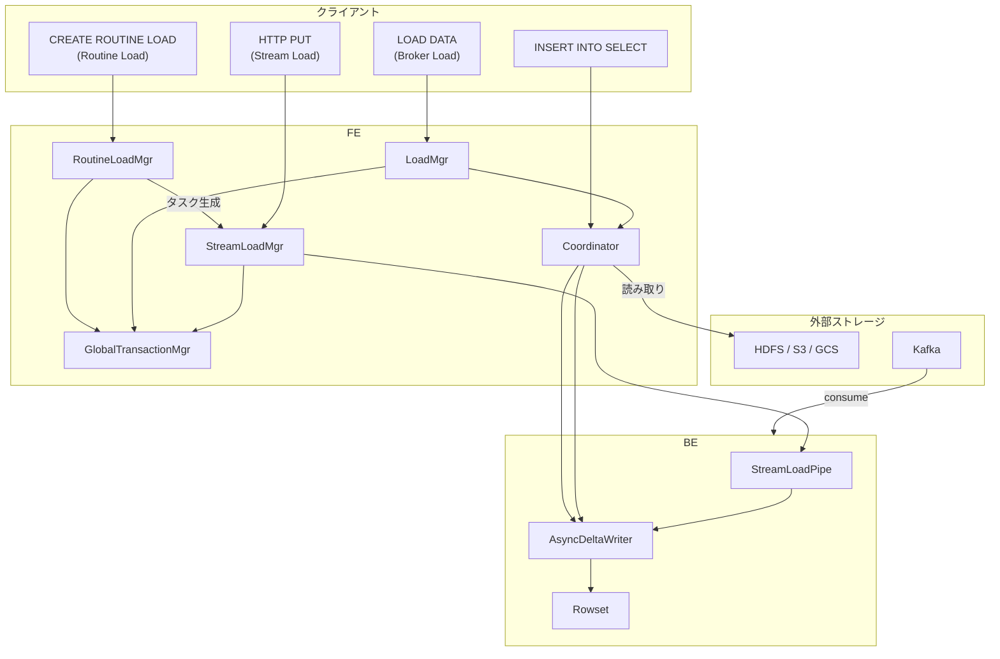
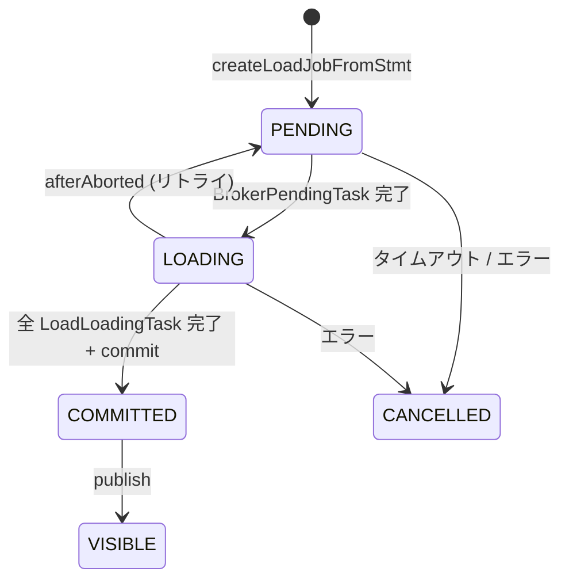
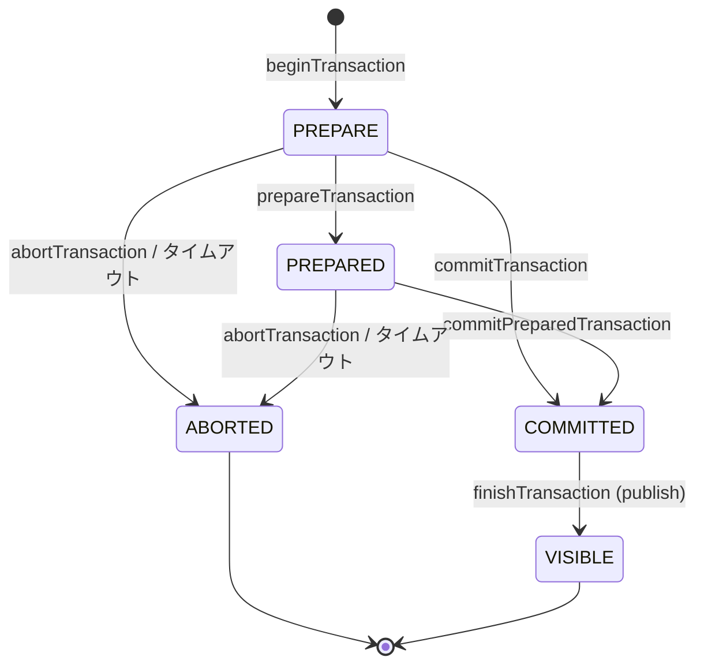
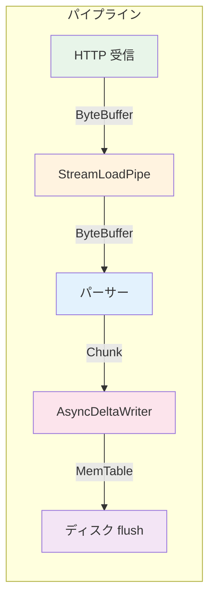

# 第22章 ロードパス

> **本章で読むソース**
>
> - [`fe/fe-core/src/main/java/com/starrocks/load/streamload/StreamLoadMgr.java`](https://github.com/StarRocks/starrocks/blob/4.1.1/fe/fe-core/src/main/java/com/starrocks/load/streamload/StreamLoadMgr.java)
> - [`fe/fe-core/src/main/java/com/starrocks/load/streamload/StreamLoadInfo.java`](https://github.com/StarRocks/starrocks/blob/4.1.1/fe/fe-core/src/main/java/com/starrocks/load/streamload/StreamLoadInfo.java)
> - [`fe/fe-core/src/main/java/com/starrocks/load/loadv2/LoadMgr.java`](https://github.com/StarRocks/starrocks/blob/4.1.1/fe/fe-core/src/main/java/com/starrocks/load/loadv2/LoadMgr.java)
> - [`fe/fe-core/src/main/java/com/starrocks/load/loadv2/BrokerLoadJob.java`](https://github.com/StarRocks/starrocks/blob/4.1.1/fe/fe-core/src/main/java/com/starrocks/load/loadv2/BrokerLoadJob.java)
> - [`fe/fe-core/src/main/java/com/starrocks/load/routineload/RoutineLoadMgr.java`](https://github.com/StarRocks/starrocks/blob/4.1.1/fe/fe-core/src/main/java/com/starrocks/load/routineload/RoutineLoadMgr.java)
> - [`fe/fe-core/src/main/java/com/starrocks/load/routineload/KafkaRoutineLoadJob.java`](https://github.com/StarRocks/starrocks/blob/4.1.1/fe/fe-core/src/main/java/com/starrocks/load/routineload/KafkaRoutineLoadJob.java)
> - [`fe/fe-core/src/main/java/com/starrocks/transaction/GlobalTransactionMgr.java`](https://github.com/StarRocks/starrocks/blob/4.1.1/fe/fe-core/src/main/java/com/starrocks/transaction/GlobalTransactionMgr.java)
> - [`fe/fe-core/src/main/java/com/starrocks/transaction/DatabaseTransactionMgr.java`](https://github.com/StarRocks/starrocks/blob/4.1.1/fe/fe-core/src/main/java/com/starrocks/transaction/DatabaseTransactionMgr.java)
> - [`be/src/runtime/stream_load/stream_load_pipe.h`](https://github.com/StarRocks/starrocks/blob/4.1.1/be/src/runtime/stream_load/stream_load_pipe.h)
> - [`be/src/storage/async_delta_writer.h`](https://github.com/StarRocks/starrocks/blob/4.1.1/be/src/storage/async_delta_writer.h)

## この章の狙い

StarRocks にデータを取り込む経路は複数ある。
リアルタイムの小バッチ書き込みに使う **Stream Load**、外部ストレージからの大量一括取り込みに使う **Broker Load**、Kafka からの継続的な取り込みに使う **Routine Load**、そして SQL 文による **INSERT INTO** である。
本章では、これら4つのロードパスが FE と BE でどのように実装されているかを読み、ロードのライフサイクルを支えるトランザクション管理の仕組みを把握する。

## 前提

StarRocks へのデータ書き込みはすべてトランザクションで保護される。
FE の `GlobalTransactionMgr` がトランザクションの begin, commit, abort を管理し、BE 側の `DeltaWriter` がデータを MemTable に蓄積して Rowset としてディスクに書き出す。
ロード方式によって FE と BE の役割分担は異なるが、最終的にはトランザクションの commit によってデータが可視化される点は共通である。

## ロードパスの全体像

以下の図は、4つのロードパスがどのように FE と BE を経由してデータを取り込むかを示す。



Stream Load はクライアントが HTTP PUT でデータを直接 BE に送信し、BE 内の `StreamLoadPipe` を経由して `DeltaWriter` に書き込む。
Broker Load は FE が実行計画を生成し、BE が外部ストレージからデータを読み取って `DeltaWriter` に書き込む。
Routine Load は FE が定期的にタスクを生成し、BE が Kafka からデータを消費して Stream Load と同じ経路で書き込む。
INSERT INTO は通常の SQL 実行パスを経由し、`Coordinator` が Fragment を BE に配布して書き込む。

## Stream Load の詳細フロー

Stream Load は HTTP PUT リクエストによる低レイテンシの書き込み方式である。
クライアントはデータを直接 BE に送信し、FE はトランザクション管理とメタデータの検証を担当する。

### StreamLoadMgr によるタスク管理

`StreamLoadMgr` は Stream Load タスクのライフサイクルを管理する。
タスクは `label` をキーとして `idToStreamLoadTask` マップに格納される。

[`fe/fe-core/src/main/java/com/starrocks/load/streamload/StreamLoadMgr.java` L69-L90](https://github.com/StarRocks/starrocks/blob/4.1.1/fe/fe-core/src/main/java/com/starrocks/load/streamload/StreamLoadMgr.java#L69-L90)

```java
public class StreamLoadMgr implements MemoryTrackable {
    private static final Logger LOG = LogManager.getLogger(StreamLoadMgr.class);

    // Task types that need to be persisted to the image file.
    // The order matters: it determines the serialization/deserialization order in save() and load().
    private static final List<Class<? extends AbstractStreamLoadTask>> PERSISTENT_TASK_TYPES =
            Arrays.asList(StreamLoadTask.class, StreamLoadMultiStmtTask.class);

    // label -> AbstractStreamLoadTask (unified management)
    private Map<String, AbstractStreamLoadTask> idToStreamLoadTask;

    // Only used for sync stream load
    // txnId -> StreamLoadTask (only StreamLoadTask can be sync)
    private Map<Long, StreamLoadTask> txnIdToSyncStreamLoadTasks;

    private Map<Long, Map<String, AbstractStreamLoadTask>> dbToLabelToStreamLoadTask;
    // ... (中略) ...
    private ReentrantReadWriteLock lock;

```

`idToStreamLoadTask` は label でタスクを引くメインのマップである。
`txnIdToSyncStreamLoadTasks` は同期的な Stream Load(BE が直接開始するもの)をトランザクション ID で引くための補助マップである。
`dbToLabelToStreamLoadTask` はデータベースごとにタスクを分類し、特定の DB に属するタスクを列挙する際に使う。

### タスク生成と二重チェックロック

BE からの Stream Load リクエストを受けると、`beginLoadTaskFromBackend` がタスクを生成する。

[`fe/fe-core/src/main/java/com/starrocks/load/streamload/StreamLoadMgr.java` L218-L242](https://github.com/StarRocks/starrocks/blob/4.1.1/fe/fe-core/src/main/java/com/starrocks/load/streamload/StreamLoadMgr.java#L218-L242)

```java
    // for sync stream load task
    public void beginLoadTaskFromBackend(String dbName, String tableName, String label, TUniqueId requestId,
                                         String user, String clientIp, long timeoutMillis,
                                         TransactionResult resp, boolean isRoutineLoad,
                                         ComputeResource computeResource, long backendId)
            throws StarRocksException {
        AbstractStreamLoadTask task = null;
        Database db = checkDbName(dbName);
        long dbId = db.getId();
        Table table = checkMeta(db, tableName);

        writeLock();
        try {
            task = createLoadTaskWithoutLock(db, table, label, user, clientIp, timeoutMillis, isRoutineLoad,
                    computeResource);
            // ... (中略) ...
            task.beginTxnFromBackend(requestId, clientIp, backendId, resp);
            addLoadTask(task);
        } finally {
            writeUnlock();
        }
    }

```

FE からの Stream Load リクエスト(`beginLoadTaskFromFrontend`)では、read lock で既存タスクの有無を確認してから write lock でタスクを生成する二重チェックロックが使われている。

[`fe/fe-core/src/main/java/com/starrocks/load/streamload/StreamLoadMgr.java` L172-L217](https://github.com/StarRocks/starrocks/blob/4.1.1/fe/fe-core/src/main/java/com/starrocks/load/streamload/StreamLoadMgr.java#L172-L217)

```java
    public void beginLoadTaskFromFrontend(String dbName, String tableName, String label, String user,
                                          String clientIp, long timeoutMillis, int channelNum, int channelId,
                                          TransactionResult resp, ComputeResource computeResource) throws StarRocksException {
        AbstractStreamLoadTask task = null;
        Database db = checkDbName(dbName);
        long dbId = db.getId();
        // if task is already created, return directly
        readLock();
        try {
            task = idToStreamLoadTask.get(label);
            if (task != null) {
                task.beginTxnFromFrontend(channelId, channelNum, resp);
                return;
            }
        } finally {
            readUnlock();
        }
        // ... (中略) ...
        writeLock();
        try {
            // double check here
            task = idToStreamLoadTask.get(label);
            if (task != null) {
                task.beginTxnFromFrontend(channelId, channelNum, resp);
                return;
            }
            task = createLoadTaskWithoutLock(db, table, label, user, clientIp, timeoutMillis, channelNum, channelId,
                    computeResource);
            // ... (中略) ...
        } finally {
            writeUnlock();
        }
    }

```

同じ label のリクエストが同時に複数到着した場合、read lock で先にチェックすることで write lock の競合を減らしている。

### タスクの登録とコールバック

`addLoadTask` はタスクを3つのマップに登録し、トランザクション状態変更のコールバックを登録する。

[`fe/fe-core/src/main/java/com/starrocks/load/streamload/StreamLoadMgr.java` L333-L365](https://github.com/StarRocks/starrocks/blob/4.1.1/fe/fe-core/src/main/java/com/starrocks/load/streamload/StreamLoadMgr.java#L333-L365)

```java
    public void addLoadTask(AbstractStreamLoadTask task, boolean addTxnCallback) {
        if (task instanceof StreamLoadTask && ((StreamLoadTask) task).isSyncStreamLoad()) {
            txnIdToSyncStreamLoadTasks.put(task.getTxnId(), (StreamLoadTask) task);
        }

        // Clear the stream load tasks manually
        if (idToStreamLoadTask.size() > Config.stream_load_task_keep_max_num) {
            LOG.info("trigger cleanSyncStreamLoadTasks when add load task label:{}", task.getLabel());
            cleanSyncStreamLoadTasks();
            // ... (中略) ...
        }

        long dbId = task.getDBId();
        String label = task.getLabel();
        // ... (中略) ...
        labelToStreamLoadTask.put(label, task);
        idToStreamLoadTask.put(label, task);

        // register txn state listener
        if (addTxnCallback) {
            GlobalStateMgr.getCurrentState().getGlobalTransactionMgr().getCallbackFactory().addCallback(task);
        }
    }

```

タスク数が `stream_load_task_keep_max_num` を超えると、完了済みの同期タスクを優先的に削除し、それでも足りなければ古いタスクを強制削除する。
この自動クリーニングにより、大量の Stream Load リクエストが続いてもメモリが際限なく増加しない。

### StreamLoadInfo によるパラメーター解析

`StreamLoadInfo` は HTTP ヘッダーや Thrift リクエストから取り込みパラメーターを抽出し、一つのオブジェクトにまとめる。

[`fe/fe-core/src/main/java/com/starrocks/load/streamload/StreamLoadInfo.java` L53-L94](https://github.com/StarRocks/starrocks/blob/4.1.1/fe/fe-core/src/main/java/com/starrocks/load/streamload/StreamLoadInfo.java#L53-L94)

```java
public class StreamLoadInfo {
    // ... (中略) ...
    private TUniqueId id;
    private long txnId;
    private TFileType fileType;
    private TFileFormatType formatType;
    private boolean stripOuterArray;
    private String jsonPaths;
    private String jsonRoot;

    // optional
    private List<ImportColumnDesc> columnExprDescs = Lists.newArrayList();
    private Expr whereExpr;
    // ... (中略) ...
    private boolean strictMode = false; // default is false
    private String timezone = TimeUtils.DEFAULT_TIME_ZONE;
    private int timeout = Config.stream_load_default_timeout_second;
    // ... (中略) ...
    private TCompressionType compressionType = TCompressionType.NO_COMPRESSION;
    private TCompressionType payloadCompressionType = TCompressionType.NO_COMPRESSION;

```

CSV, JSON, Avro 形式に対応し、カラムマッピング、WHERE フィルタ、パーティション指定、圧縮方式などを保持する。
Routine Load からの利用時には `fromRoutineLoadJob` ファクトリメソッドで `RoutineLoadJob` のパラメーターを `StreamLoadInfo` に変換する。

[`fe/fe-core/src/main/java/com/starrocks/load/streamload/StreamLoadInfo.java` L394-L410](https://github.com/StarRocks/starrocks/blob/4.1.1/fe/fe-core/src/main/java/com/starrocks/load/streamload/StreamLoadInfo.java#L394-L410)

```java
    public static StreamLoadInfo fromRoutineLoadJob(RoutineLoadJob routineLoadJob) throws StarRocksException {
        TUniqueId dummyId = new TUniqueId();
        TFileFormatType fileFormatType = TFileFormatType.FORMAT_CSV_PLAIN;
        if (routineLoadJob.getFormat().equals("json")) {
            fileFormatType = TFileFormatType.FORMAT_JSON;
        }
        if (routineLoadJob.getFormat().equals("avro")) {
            fileFormatType = TFileFormatType.FORMAT_AVRO;
        }
        StreamLoadInfo streamLoadInfo = new StreamLoadInfo(dummyId, -1L /* dummy txn id */,
                TFileType.FILE_STREAM, fileFormatType);
        streamLoadInfo.setOptionalFromRoutineLoadJob(routineLoadJob);
        // ... (中略) ...
        return streamLoadInfo;
    }

```

Routine Load が内部的に Stream Load と同じパラメーター体系を再利用していることがわかる。

### BE 側の StreamLoadPipe

BE では `StreamLoadPipe` が HTTP Chunked Transfer のデータを受け取り、パース処理に供給する。
`StreamLoadPipe` は producer(HTTP 受信スレッド)と consumer(パーサースレッド)をつなぐブロッキングキューとして機能する。

[`be/src/runtime/stream_load/stream_load_pipe.h` L53-L135](https://github.com/StarRocks/starrocks/blob/4.1.1/be/src/runtime/stream_load/stream_load_pipe.h#L53-L135)

```cpp
// StreamLoadPipe use to transfer data from producer to consumer
// Data in pip is stored in chunks.
class StreamLoadPipe : public MessageBodySink {
public:
    StreamLoadPipe(size_t max_buffered_bytes = DEFAULT_STREAM_LOAD_PIPE_BUFFERED_BYTES,
                   size_t min_chunk_size = DEFAULT_STREAM_LOAD_PIPE_CHUNK_SIZE)
            : StreamLoadPipe(false, -1, max_buffered_bytes, min_chunk_size) {}
    // ... (中略) ...
    Status append(ByteBufferPtr&& buf) override;
    Status append(const char* data, size_t size) override;
    virtual StatusOr<ByteBufferPtr> read();
    // ... (中略) ...
private:
    std::mutex _lock;
    size_t _buffered_bytes{0};
    // ... (中略) ...
    size_t _max_buffered_bytes;
    size_t _min_chunk_size;
    std::deque<ByteBufferPtr> _buf_queue;
    std::condition_variable _put_cond;
    std::condition_variable _get_cond;
    // ... (中略) ...
    bool _finished{false};
    bool _cancelled{false};

```

`_buf_queue` がデータチャンクのキューであり、`_put_cond` と `_get_cond` の2つの条件変数で producer と consumer を同期する。
`_max_buffered_bytes`(デフォルト 1MB)がバッファ上限であり、producer はバッファが満杯なら `_put_cond` で待機し、consumer がデータを読み取ると通知する。
この設計により、HTTP の受信とデータのパース処理がパイプライン化される。

### AsyncDeltaWriter による非同期書き込み

パースされたデータは `AsyncDeltaWriter` を通じて Tablet に書き込まれる。
`AsyncDeltaWriter` は `DeltaWriter` のラッパーであり、bthread の `ExecutionQueue` を使って書き込みタスクを FIFO 順に非同期実行する。

[`be/src/storage/async_delta_writer.h` L43-L87](https://github.com/StarRocks/starrocks/blob/4.1.1/be/src/storage/async_delta_writer.h#L43-L87)

```cpp
// AsyncDeltaWriter is a wrapper on DeltaWriter to support non-blocking async write.
// All submitted tasks will be executed in the FIFO order.
class AsyncDeltaWriter {
    // ... (中略) ...
public:
    // Create a new transaction in TxnManager and return a AsyncDeltaWriter for write.
    static StatusOr<std::unique_ptr<AsyncDeltaWriter>> open(const DeltaWriterOptions& opt, MemTracker* mem_tracker);

    // [thread-safe and wait-free]
    void write(const AsyncDeltaWriterRequest& req, AsyncDeltaWriterCallback* cb);

    // [thread-safe and wait-free]
    void write_segment(const AsyncDeltaWriterSegmentRequest& req);

    // This method will flush all the records in memtable to disk.
    // [thread-safe and wait-free]
    void flush();

    // [thread-safe and wait-free]
    void commit(AsyncDeltaWriterCallback* cb);

    // [thread-safe and wait-free]
    void abort(bool with_log = true);

```

`write`, `commit`, `abort` はすべて thread-safe かつ wait-free であり、呼び出し側のスレッドはブロックされない。
内部では `Task` 構造体がキューに投入され、`_execute` 関数が bthread 上で順番に処理する。

[`be/src/storage/async_delta_writer.h` L114-L127](https://github.com/StarRocks/starrocks/blob/4.1.1/be/src/storage/async_delta_writer.h#L114-L127)

```cpp
    struct Task {
        Task() : create_time_ns(MonotonicNanos()) {}

        // If chunk == nullptr, this is a commit task
        Chunk* chunk = nullptr;
        const uint32_t* indexes = nullptr;
        AsyncDeltaWriterCallback* write_cb = nullptr;
        uint32_t indexes_size = 0;
        bool commit_after_write = false;
        bool abort = false;
        bool abort_with_log = false;
        bool flush_after_write = false;
        int64_t create_time_ns;
    };
```

`chunk == nullptr` のとき commit タスクとして扱われる。
`commit_after_write` フラグが立っていれば、書き込みと commit を一度のタスク実行で完了できる。

コールバックの `run` メソッドは、書き込みの成否と commit 結果の Rowset 情報を通知する。

[`be/src/storage/async_delta_writer.h` L170-L178](https://github.com/StarRocks/starrocks/blob/4.1.1/be/src/storage/async_delta_writer.h#L170-L178)

```cpp
class AsyncDeltaWriterCallback {
public:
    virtual ~AsyncDeltaWriterCallback() = default;

    // st != Status::OK means either the writes or the commit failed.
    // st == Status::OK && info != nullptr means commit succeeded.
    // st == Status::OK && info == nullptr means the writes succeeded with no commit.
    virtual void run(const Status& st, const CommittedRowsetInfo* info, const FailedRowsetInfo* failed_info) = 0;
};
```

## Broker Load の設計

Broker Load は `LOAD DATA` 文で HDFS, S3, GCS などの外部ストレージからデータを一括取り込む方式である。
FE が実行計画を生成し、BE がスキャンと書き込みの両方を行う。

### LoadMgr によるジョブ管理

`LoadMgr` は Broker Load と Spark Load のジョブを管理する。

[`fe/fe-core/src/main/java/com/starrocks/load/loadv2/LoadMgr.java` L107-L122](https://github.com/StarRocks/starrocks/blob/4.1.1/fe/fe-core/src/main/java/com/starrocks/load/loadv2/LoadMgr.java#L107-L122)

```java
public class LoadMgr implements MemoryTrackable {
    private static final Logger LOG = LogManager.getLogger(LoadMgr.class);

    private final Map<Long, LoadJob> idToLoadJob = Maps.newConcurrentMap();
    private final Map<Long, Map<String, List<LoadJob>>> dbIdToLabelToLoadJobs = Maps.newConcurrentMap();
    private final LoadJobScheduler loadJobScheduler;

    private final ReentrantReadWriteLock lock = new ReentrantReadWriteLock();
    // ... (中略) ...
    public LoadMgr(LoadJobScheduler loadJobScheduler) {
        this.loadJobScheduler = loadJobScheduler;
    }

```

`idToLoadJob` はジョブ ID をキーとするマップ、`dbIdToLabelToLoadJobs` は DB ID と label の二段マップである。
Stream Load と異なり、同じ label で複数のジョブが存在しうる(過去の CANCELLED なジョブが残る)ため、value は `List<LoadJob>` になっている。

ジョブの作成は `createLoadJobFromStmt` で行われる。

[`fe/fe-core/src/main/java/com/starrocks/load/loadv2/LoadMgr.java` L129-L154](https://github.com/StarRocks/starrocks/blob/4.1.1/fe/fe-core/src/main/java/com/starrocks/load/loadv2/LoadMgr.java#L129-L154)

```java
    public void createLoadJobFromStmt(LoadStmt stmt, ConnectContext context) throws DdlException {
        Database database = checkDb(stmt.getLabel().getDbName());
        long dbId = database.getId();
        // LoadJob must be created outside LoadMgr's lock because the database lock will be held in fromLoadStmt().
        // In other functions, such as LeaderImpl.finishRealtimePush, the locking sequence is: db Lock => LoadMgr Lock.
        LoadJob loadJob = BulkLoadJob.fromLoadStmt(stmt, context);
        writeLock();
        try {
            checkLabelUsed(dbId, stmt.getLabel().getLabelName());
            if (stmt.getBrokerDesc() == null && stmt.getResourceDesc() == null) {
                throw new DdlException("LoadManager only support the broker and spark load.");
            }
            if (loadJobScheduler.isQueueFull()) {
                throw new DdlException(
                        "There are more than " + Config.desired_max_waiting_jobs + " load jobs in waiting queue, "
                                + "please retry later.");
            }
            GlobalStateMgr.getCurrentState().getEditLog().logCreateLoadJob(loadJob, wal -> createLoadJob((LoadJob) wal));
        } finally {
            writeUnlock();
        }

        // The job must be submitted after edit log.
        // It guarantee that load job has not been changed before edit log.
        loadJobScheduler.submitJob(loadJob);
    }
```

ジョブ生成の流れは次のとおりである。

1. `BulkLoadJob.fromLoadStmt` で `LoadStmt` から `LoadJob` オブジェクトを構築する(DB ロック内)
2. write lock を取って label の重複を検査し、待機キューの容量を確認する
3. EditLog に永続化した後、`loadJobScheduler` にジョブを投入する

EditLog への永続化後にスケジューラーへ投入する順序が守られている。
この順序により、FE がクラッシュしても永続化済みのジョブはリプレイ時に復元される。

### BrokerLoadJob の3ステップ実行

`BrokerLoadJob` は3つのステップで実行される。

[`fe/fe-core/src/main/java/com/starrocks/load/loadv2/BrokerLoadJob.java` L96-L101](https://github.com/StarRocks/starrocks/blob/4.1.1/fe/fe-core/src/main/java/com/starrocks/load/loadv2/BrokerLoadJob.java#L96-L101)

```java
 * There are 3 steps in BrokerLoadJob: BrokerPendingTask, LoadLoadingTask, CommitAndPublishTxn.
 * Step1: BrokerPendingTask will be created on method of unprotectedExecuteJob.
 * Step2: LoadLoadingTasks will be created by the method of onTaskFinished when BrokerPendingTask is finished.
 * Step3: CommitAndPublicTxn will be called by the method of onTaskFinished when all of LoadLoadingTasks are finished.
 */
public class BrokerLoadJob extends BulkLoadJob {
```

ステップ1の `BrokerPendingTask` は、外部ストレージのファイル一覧を取得してロード対象を確定する。

[`fe/fe-core/src/main/java/com/starrocks/load/loadv2/BrokerLoadJob.java` L181-L187](https://github.com/StarRocks/starrocks/blob/4.1.1/fe/fe-core/src/main/java/com/starrocks/load/loadv2/BrokerLoadJob.java#L181-L187)

```java
    protected void unprotectedExecuteJob() throws LoadException {
        LoadTask task = new BrokerLoadPendingTask(this, fileGroupAggInfo.getAggKeyToFileGroups(),
                brokerPersistInfo == null ? null :
                        new BrokerDesc(brokerPersistInfo.getName(), brokerPersistInfo.getProperties()));
        idToTasks.put(task.getSignature(), task);
        submitTask(GlobalStateMgr.getCurrentState().getPendingLoadTaskScheduler(), task);
    }
```

ステップ2では、`onPendingTaskFinished` が呼ばれてテーブルごとに `LoadLoadingTask` が生成される。
各タスクはスキャンプランを内包し、BE 上で `Coordinator` を通じて実行される。

トランザクションの開始は `beginTxn` で行われる。

[`fe/fe-core/src/main/java/com/starrocks/load/loadv2/BrokerLoadJob.java` L135-L143](https://github.com/StarRocks/starrocks/blob/4.1.1/fe/fe-core/src/main/java/com/starrocks/load/loadv2/BrokerLoadJob.java#L135-L143)

```java
    public void beginTxn()
            throws LabelAlreadyUsedException, RunningTxnExceedException, AnalysisException, DuplicatedRequestException {
        MetricRepo.COUNTER_LOAD_ADD.increase(1L);
        transactionId = GlobalStateMgr.getCurrentState().getGlobalTransactionMgr()
                .beginTransaction(dbId, Lists.newArrayList(fileGroupAggInfo.getAllTableIds()), label, null,
                        new TxnCoordinator(TxnSourceType.FE, FrontendOptions.getLocalHostAddress()),
                        TransactionState.LoadJobSourceType.BATCH_LOAD_JOB, id,
                        timeoutSecond, computeResource);
    }
```

ステップ3では、すべての `LoadLoadingTask` が完了した後、データ品質をチェックしてからトランザクションを commit する。
commit 時に `CommitRateExceededException` が発生した場合はスリープしてリトライする。

[`fe/fe-core/src/main/java/com/starrocks/load/loadv2/BrokerLoadJob.java` L508-L519](https://github.com/StarRocks/starrocks/blob/4.1.1/fe/fe-core/src/main/java/com/starrocks/load/loadv2/BrokerLoadJob.java#L508-L519)

```java
        while (true) {
            try {
                commitTransactionUnderDatabaseLock(db);
                break;
            } catch (CommitRateExceededException e) {
                // Sleep and retry.
                ThreadUtil.sleepAtLeastIgnoreInterrupts(Math.max(e.getAllowCommitTime() - System.currentTimeMillis(), 0));
            } catch (StarRocksException e) {
                cancelJobWithoutCheck(new FailMsg(FailMsg.CancelType.LOAD_RUN_FAIL, e.getMessage()), true, true);
                break;
            }
        }
```

以下の図は BrokerLoadJob の状態遷移を示す。



`afterAborted` でリトライが発動すると、状態が LOADING から PENDING に戻り、新しいトランザクションで再実行される。

## Routine Load の設計

Routine Load は Kafka や Pulsar からデータを継続的に取り込む方式である。
FE が定期的にタスクを生成し、各タスクは小バッチの Stream Load として BE 上で実行される。

### RoutineLoadMgr によるジョブとスロット管理

`RoutineLoadMgr` はジョブの管理に加え、BE ノードごとのタスクスロットを管理する。

[`fe/fe-core/src/main/java/com/starrocks/load/routineload/RoutineLoadMgr.java` L97-L110](https://github.com/StarRocks/starrocks/blob/4.1.1/fe/fe-core/src/main/java/com/starrocks/load/routineload/RoutineLoadMgr.java#L97-L110)

```java
public class RoutineLoadMgr implements Writable, MemoryTrackable {
    // ... (中略) ...
    // warehouse ==> {be : running tasks num}
    private Map<Long, Map<Long, Integer>> warehouseNodeTasksNum = Maps.newHashMap();
    private ReentrantLock slotLock = new ReentrantLock();

    // warehouse ==> {nodeId : {jobId}}
    private Map<Long, Map<Long, Set<Long>>> warehouseNodeToJobs = Maps.newHashMap();

    // routine load job meta
    private Map<Long, RoutineLoadJob> idToRoutineLoadJob = Maps.newConcurrentMap();
    private Map<Long, Map<String, List<RoutineLoadJob>>> dbToNameToRoutineLoadJob = Maps.newConcurrentMap();

```

`warehouseNodeTasksNum` は Warehouse ごと、ノードごとの実行中タスク数を記録する。
タスクの割り当て時には `takeBeTaskSlot` でタスク数が最も少ないノードを選択する。

[`fe/fe-core/src/main/java/com/starrocks/load/routineload/RoutineLoadMgr.java` L137-L179](https://github.com/StarRocks/starrocks/blob/4.1.1/fe/fe-core/src/main/java/com/starrocks/load/routineload/RoutineLoadMgr.java#L137-L179)

```java
    // returns -1 if there is no available be
    // find the node with the fewest tasks
    public long takeBeTaskSlot(long warehouseId, long jobId) {
        slotLock.lock();
        try {
            long nodeId = -1L;
            int minTasksNum = Integer.MAX_VALUE;
            Map<Long, Integer> nodeMap = warehouseNodeTasksNum.get(warehouseId);
            Map<Long, Set<Long>> nodeToJobs = warehouseNodeToJobs.get(warehouseId);
            if (nodeMap != null && nodeToJobs != null) {
                // find the node with the fewest tasks and does not contain the job
                for (Map.Entry<Long, Integer> entry : nodeMap.entrySet()) {
                    if (entry.getValue() < Config.max_routine_load_task_num_per_be
                            && entry.getValue() < minTasksNum
                            && (nodeToJobs.get(entry.getKey()) == null
                            || !nodeToJobs.get(entry.getKey()).contains(jobId))) {
                        nodeId = entry.getKey();
                        minTasksNum = entry.getValue();
                    }
                }
                // ... (中略) ...
            }
            return nodeId;
        } finally {
            slotLock.unlock();
        }
    }

```

このスロット管理により、特定のノードにタスクが偏ることを防いでいる。
`max_routine_load_task_num_per_be` の設定値を超えるタスクは割り当てられない。

ジョブの作成時には、現在のスロット使用量と新規ジョブのタスク数を合算し、全体の容量を超えないことを検証する。

[`fe/fe-core/src/main/java/com/starrocks/load/routineload/RoutineLoadMgr.java` L335-L349](https://github.com/StarRocks/starrocks/blob/4.1.1/fe/fe-core/src/main/java/com/starrocks/load/routineload/RoutineLoadMgr.java#L335-L349)

```java
            long maxConcurrentTasks = nodeNum * Config.max_routine_load_task_num_per_be;
            // When calculating the used slots, we only consider Jobs in the NEED_SCHEDULE and RUNNING states.
            List<RoutineLoadJob> jobs = getRoutineLoadJobByState(Sets.newHashSet(RoutineLoadJob.JobState.NEED_SCHEDULE,
                    RoutineLoadJob.JobState.RUNNING));
            long curTaskNum = 0;
            for (RoutineLoadJob job : jobs) {
                curTaskNum += job.calculateCurrentConcurrentTaskNum();
            }
            int newTaskNum = routineLoadJob.calculateCurrentConcurrentTaskNum();
            if (curTaskNum + newTaskNum > maxConcurrentTasks) {
                throw new DdlException("Current routine load tasks is " + curTaskNum + ". "
                        + "The new job need " + newTaskNum + " tasks. "
                        + "But we only support " + nodeNum + "*" + Config.max_routine_load_task_num_per_be + " tasks."
                        + "Please modify FE config max_routine_load_task_num_per_be if you want more job");
            }
```

### KafkaRoutineLoadJob のパーティション分割

`KafkaRoutineLoadJob` は Kafka トピックのパーティションを複数のタスクに分配する。

[`fe/fe-core/src/main/java/com/starrocks/load/routineload/KafkaRoutineLoadJob.java` L276-L313](https://github.com/StarRocks/starrocks/blob/4.1.1/fe/fe-core/src/main/java/com/starrocks/load/routineload/KafkaRoutineLoadJob.java#L276-L313)

```java
    @Override
    public void divideRoutineLoadJob(int currentConcurrentTaskNum) throws StarRocksException {
        List<RoutineLoadTaskInfo> result = new ArrayList<>();
        writeLock();
        try {
            if (state == JobState.NEED_SCHEDULE) {
                // divide kafkaPartitions into tasks
                for (int i = 0; i < currentConcurrentTaskNum; i++) {
                    Map<Integer, Long> taskKafkaProgress = Maps.newHashMap();
                    for (int j = 0; j < currentKafkaPartitions.size(); j++) {
                        if (j % currentConcurrentTaskNum == i) {
                            int kafkaPartition = currentKafkaPartitions.get(j);
                            taskKafkaProgress.put(kafkaPartition,
                                    ((KafkaProgress) progress).getOffsetByPartition(kafkaPartition));
                        }
                    }
                    // ... (中略) ...
                    KafkaTaskInfo kafkaTaskInfo = new KafkaTaskInfo(UUIDUtil.genUUID(), this,
                            taskSchedIntervalS * 1000,
                            timeToExecuteMs, taskKafkaProgress, taskTimeoutSecond * 1000);
                    // ... (中略) ...
                    routineLoadTaskInfoList.add(kafkaTaskInfo);
                    result.add(kafkaTaskInfo);
                }
                // change job state to running
                if (result.size() != 0) {
                    unprotectUpdateState(JobState.RUNNING, null);
                }
            }
            // ... (中略) ...
            GlobalStateMgr.getCurrentState().getRoutineLoadTaskScheduler().addTasksInQueue(result);
        } finally {
            writeUnlock();
        }
    }

```

パーティションの分配はラウンドロビン方式(`j % currentConcurrentTaskNum == i`)で行われる。
各タスクには担当するパーティションとその開始オフセットが割り当てられ、タスクは `RoutineLoadTaskScheduler` のキューに投入される。

並行タスク数は、Kafka パーティション数、ユーザー指定の `desireTaskConcurrentNum`、生存ノード数、`max_routine_load_task_concurrent_num` の最小値で決まる。

[`fe/fe-core/src/main/java/com/starrocks/load/routineload/KafkaRoutineLoadJob.java` L351-L353](https://github.com/StarRocks/starrocks/blob/4.1.1/fe/fe-core/src/main/java/com/starrocks/load/routineload/KafkaRoutineLoadJob.java#L351-L353)

```java
        currentTaskConcurrentNum = Math.min(Math.min(partitionNum, Math.min(desireTaskConcurrentNum, aliveNodeNum)),
                Config.max_routine_load_task_concurrent_num);
        return currentTaskConcurrentNum;
```

### トランザクションの成否によるオフセット管理

Kafka Routine Load では、トランザクションの成否に応じてオフセットの更新を制御する。

[`fe/fe-core/src/main/java/com/starrocks/load/routineload/KafkaRoutineLoadJob.java` L357-L389](https://github.com/StarRocks/starrocks/blob/4.1.1/fe/fe-core/src/main/java/com/starrocks/load/routineload/KafkaRoutineLoadJob.java#L357-L389)

```java
    @Override
    protected boolean checkCommitInfo(RLTaskTxnCommitAttachment rlTaskTxnCommitAttachment,
                                      TransactionState txnState,
                                      TxnStatusChangeReason txnStatusChangeReason) {
        if (txnState.getTransactionStatus() == TransactionStatus.COMMITTED) {
            // For committed txn, update the progress.
            return true;
        }

        // For compatible reason, the default behavior of empty load is still returning
        // "No rows were imported from upstream" and abort transaction.
        // In this situation, we also need update commit info.
        if (txnStatusChangeReason != null &&
                txnStatusChangeReason == TxnStatusChangeReason.NO_ROWS_IMPORTED) {
            // ... (中略) ...
            Preconditions.checkState(txnState.getTransactionStatus() == TransactionStatus.ABORTED,
                    txnState.getTransactionStatus());
            return true;
        }
        // ... (中略) ...
        return false;
    }

```

トランザクションが COMMITTED の場合はオフセットを進める。
ABORTED であっても理由が `NO_ROWS_IMPORTED`(データが空だった場合)であればオフセットを進め、同じ空データを繰り返し消費することを防ぐ。
それ以外のエラーで ABORTED になった場合はオフセットを更新せず、次回のタスクで同じデータを再消費する。

## トランザクション管理

### GlobalTransactionMgr の構造

`GlobalTransactionMgr` はすべてのデータベースのトランザクションを統括する。
データベースごとに `DatabaseTransactionMgr` を保持し、トランザクションの begin, commit, abort を委譲する。

[`fe/fe-core/src/main/java/com/starrocks/transaction/GlobalTransactionMgr.java` L92-L103](https://github.com/StarRocks/starrocks/blob/4.1.1/fe/fe-core/src/main/java/com/starrocks/transaction/GlobalTransactionMgr.java#L92-L103)

```java
public class GlobalTransactionMgr implements MemoryTrackable {
    private static final Logger LOG = LogManager.getLogger(GlobalTransactionMgr.class);

    private final Map<Long, DatabaseTransactionMgr> dbIdToDatabaseTransactionMgrs = Maps.newConcurrentMap();

    private TransactionIdGenerator idGenerator = new TransactionIdGenerator();
    private final TxnStateCallbackFactory callbackFactory = new TxnStateCallbackFactory();

    // Explicit transaction in a session. The temporary state generated by multiple statements in a transaction is recorded in
    // ExplicitTxnStateItem, and the transaction state is recorded in TransactionState.
    private final Map<Long, ExplicitTxnState> explicitTxnStateMap = Maps.newConcurrentMap();

```

`callbackFactory` はトランザクション状態変更のコールバックを管理する。
Stream Load, Broker Load, Routine Load のすべてのロードジョブがこのファクトリにコールバックを登録し、トランザクションの commit や abort の通知を受け取る。

### beginTransaction の処理

`beginTransaction` はソースタイプに応じてタイムアウトの検証を行い、`DatabaseTransactionMgr` に処理を委譲する。

[`fe/fe-core/src/main/java/com/starrocks/transaction/GlobalTransactionMgr.java` L188-L225](https://github.com/StarRocks/starrocks/blob/4.1.1/fe/fe-core/src/main/java/com/starrocks/transaction/GlobalTransactionMgr.java#L188-L225)

```java
    public long beginTransaction(long dbId, List<Long> tableIdList, String label, TUniqueId requestId,
                                 TxnCoordinator coordinator, LoadJobSourceType sourceType, long listenerId,
                                 long timeoutSecond,
                                 ComputeResource computeResource)
            throws LabelAlreadyUsedException, RunningTxnExceedException, DuplicatedRequestException, AnalysisException {

        if (Config.disable_load_job) {
            throw ErrorReportException.report(ErrorCode.ERR_BEGIN_TXN_FAILED,
                    "disable_load_job is set to true, all load jobs are rejected");
        }
        // ... (中略) ...
        switch (sourceType) {
            case BACKEND_STREAMING:
                checkValidTimeoutSecond(timeoutSecond, Config.max_stream_load_timeout_second, Config.min_load_timeout_second);
                break;
            case LAKE_COMPACTION:
            case REPLICATION:
                // skip transaction timeout range check for lake compaction and replication
                break;
            default:
                checkValidTimeoutSecond(timeoutSecond, Config.max_load_timeout_second, Config.min_load_timeout_second);
        }

        DatabaseTransactionMgr dbTransactionMgr = getDatabaseTransactionMgr(dbId);
        return dbTransactionMgr.beginTransaction(tableIdList, label, requestId, coordinator, sourceType, listenerId,
                timeoutSecond, computeResource);
    }

```

`BACKEND_STREAMING`(Stream Load)は `max_stream_load_timeout_second` を上限に、それ以外のロードは `max_load_timeout_second` を上限にタイムアウトを検証する。

### DatabaseTransactionMgr のトランザクション状態管理

`DatabaseTransactionMgr` はデータベースレベルでトランザクションの状態を管理する。

[`fe/fe-core/src/main/java/com/starrocks/transaction/DatabaseTransactionMgr.java` L118-L159](https://github.com/StarRocks/starrocks/blob/4.1.1/fe/fe-core/src/main/java/com/starrocks/transaction/DatabaseTransactionMgr.java#L118-L159)

```java
public class DatabaseTransactionMgr {
    // ... (中略) ...
    private final long dbId;
    // ... (中略) ...
    private final ReentrantReadWriteLock transactionLock = new ReentrantReadWriteLock(true);

    // count the number of running transactions of database, except for shapeless.the routine load txn
    private int runningTxnNums = 0;

    // count only the number of running routine load transactions of database
    private int runningRoutineLoadTxnNums = 0;

    // ... (中略) ...
    private final Map<Long, TransactionState> idToRunningTransactionState = Maps.newHashMap();
    private final Map<Long, TransactionState> idToFinalStatusTransactionState = Maps.newHashMap();
    private final ArrayDeque<TransactionState> finalStatusTransactionStateDeque = new ArrayDeque<>();

    // store committed transactions' dependency relationships
    private final TransactionGraph transactionGraph = new TransactionGraph();

    /*
     * `labelToTxnIds` is used for checking if label already used. map label to transaction id
     * One label may correspond to multiple transactions, and only one is success.
     */
    private final Map<String, Set<Long>> labelToTxnIds = Maps.newHashMap();
    private long maxCommitTs = 0;

```

実行中のトランザクションは `idToRunningTransactionState` に、完了したトランザクションは `idToFinalStatusTransactionState` と `finalStatusTransactionStateDeque` に格納される。
`runningTxnNums` と `runningRoutineLoadTxnNums` はそれぞれの上限(`max_running_txn_num_per_db`, `max_running_routine_load_task_num_per_be`)の検査に使われ、上限を超えると `RunningTxnExceedException` がスローされる。

`transactionGraph` は committed 状態のトランザクション間の依存関係を管理し、publish 順序の制御に使われる。
同じパーティションに対する複数のトランザクションは順序が保証される必要があるため、依存グラフで管理している。

`beginTransaction` はラベルの重複チェック、実行中トランザクション数の上限チェックを行い、`TransactionState` を生成して登録する。

[`fe/fe-core/src/main/java/com/starrocks/transaction/DatabaseTransactionMgr.java` L177-L260](https://github.com/StarRocks/starrocks/blob/4.1.1/fe/fe-core/src/main/java/com/starrocks/transaction/DatabaseTransactionMgr.java#L177-L260)

```java
    public long beginTransaction(List<Long> tableIdList, String label, TUniqueId requestId,
                                 TransactionState.TxnCoordinator coordinator,
                                 TransactionState.LoadJobSourceType sourceType,
                                 long callbackId,
                                 long timeoutSecond,
                                 ComputeResource computeResource)
            throws DuplicatedRequestException, LabelAlreadyUsedException, RunningTxnExceedException, AnalysisException {
        checkDatabaseDataQuota();
        // ... (中略) ...
        long tid = globalStateMgr.getGlobalTransactionMgr().getTransactionIDGenerator().getNextTransactionId();
        // ... (中略) ...
        TransactionState transactionState = new TransactionState(dbId, tableIdList, tid, label, requestId, sourceType,
                coordinator, callbackId, timeoutSecond * 1000);

        transactionState.setPrepareTime(System.currentTimeMillis());
        transactionState.setComputeResource(computeResource);
        // ... (中略) ...
        transactionState.writeLock();
        try {
            writeLock();
            try {
                // ... (中略) ...
                Set<Long> existingTxnIds = unprotectedGetTxnIdsByLabel(label);
                if (existingTxnIds != null && !existingTxnIds.isEmpty()) {
                    // ... (中略) ...
                }

                checkRunningTxnExceedLimit(sourceType);

                unprotectUpsertTransactionState(transactionState);
                // ... (中略) ...
            } catch (DuplicatedRequestException e) {
                throw e;
            } catch (Exception e) {
                // ... (中略) ...
                throw e;
            } finally {
                writeUnlock();
            }
            persistTxnStateInTxnLevelLock(transactionState);
            return tid;
        } finally {
            transactionState.writeUnlock();
        }
    }

```

同じ label で PREPARE 状態のトランザクションが存在し、かつ `requestId` が一致する場合は `DuplicatedRequestException` を返す。
これはクライアントのリトライリクエストを冪等に処理するための仕組みである。

### commitTransaction とレート制限

`commitTransaction` はトランザクションを COMMITTED 状態に遷移させる。
commit レートが高すぎる場合は `CommitRateExceededException` がスローされ、呼び出し側がスリープしてリトライする。

[`fe/fe-core/src/main/java/com/starrocks/transaction/GlobalTransactionMgr.java` L469-L488](https://github.com/StarRocks/starrocks/blob/4.1.1/fe/fe-core/src/main/java/com/starrocks/transaction/GlobalTransactionMgr.java#L469-L488)

```java
    public VisibleStateWaiter retryCommitOnRateLimitExceeded(
            @NotNull Database db, long transactionId, @NotNull List<TabletCommitInfo> tabletCommitInfos,
            @NotNull List<TabletFailInfo> tabletFailInfos,
            @Nullable TxnCommitAttachment txnCommitAttachment,
            long timeoutMs) throws StarRocksException, LockTimeoutException {
        long startTime = System.currentTimeMillis();
        while (true) {
            try {
                return commitTransactionUnderDatabaseWLock(db, transactionId, tabletCommitInfos, tabletFailInfos,
                        txnCommitAttachment, timeoutMs);
            } catch (CommitRateExceededException e) {
                throttleCommitOnRateExceed(e, startTime, timeoutMs);
            } catch (LockTimeoutException e) {
                throw e;
            } catch (Exception e) {
                LOG.warn("fail to commit", e);
                throw new StarRocksException("fail to execute commit task: " + e.getMessage(), e);
            }
        }
    }
```

`commitTransactionUnderDatabaseWLock` はデータベースの write lock を取得してから `commitTransaction` を呼ぶ。
呼び出し側が既にデータベースロックを保持している場合はデッドロックになるため、ロックの取得順序に注意が必要である[^1]。

[^1]: `GlobalTransactionMgr` のクラスコメントには「db lock -> txn manager lock」の順序が規定されている。

### トランザクションの状態遷移

以下の図はトランザクションの状態遷移を示す。



PREPARE はトランザクションが開始された状態で、BE がデータを書き込んでいる段階である。
PREPARED は Stream Load の Transaction API で使われる中間状態で、データの書き込みは完了したが commit はまだ行われていない。
COMMITTED はすべてのレプリカにデータが書き込まれた状態で、publish 処理によって VISIBLE に遷移する。
VISIBLE になるとデータがクエリから参照可能になる。

## 最適化の工夫: Stream Load の HTTP Chunked Transfer による低レイテンシ書き込み

Stream Load の設計上の工夫は、HTTP Chunked Transfer Encoding と `StreamLoadPipe` を組み合わせたパイプライン処理にある。

従来のアプローチでは、クライアントが送信したデータ全体をファイルに保存し、その後でパースと書き込みを行う。
この方式ではデータの受信完了を待つ必要があり、レイテンシが増大する。

StarRocks の Stream Load では、HTTP Chunked Transfer でデータを受信しながら、`StreamLoadPipe` を介してリアルタイムにパース処理に供給する。
`StreamLoadPipe` の `_max_buffered_bytes`(デフォルト 1MB)がバックプレッシャーの閾値として機能し、パース処理が遅い場合は受信を一時停止する。

[`be/src/runtime/stream_load/stream_load_pipe.h` L50-L51](https://github.com/StarRocks/starrocks/blob/4.1.1/be/src/runtime/stream_load/stream_load_pipe.h#L50-L51)

```cpp
static constexpr size_t DEFAULT_STREAM_LOAD_PIPE_BUFFERED_BYTES = 1024 * 1024;
static constexpr size_t DEFAULT_STREAM_LOAD_PIPE_CHUNK_SIZE = 64 * 1024;
```

さらに、`AsyncDeltaWriter` の非同期書き込みにより、パース処理と Rowset 生成が並列化される。
パースされた Chunk は `write` メソッドで `ExecutionQueue` に投入され、bthread 上で順次処理される。
呼び出し側のパーサースレッドは書き込み完了を待たずに次のデータのパースを開始できる。

この結果、「HTTP 受信」「データパース」「MemTable への書き込み」「ディスクへのフラッシュ」という4つのステージがパイプライン化され、各ステージが並行して動作する。
データ全体の受信を待たずに書き込みが進行するため、大量データの Stream Load でもレイテンシが抑制される。



## まとめ

StarRocks は4つのロードパスを提供し、それぞれ異なるユースケースに対応する。

- **Stream Load**：`StreamLoadMgr` がタスクを管理し、BE 上の `StreamLoadPipe` と `AsyncDeltaWriter` でパイプライン化された書き込みを行う。低レイテンシのリアルタイム書き込みに適する。
- **Broker Load**：`LoadMgr` がジョブを管理し、`BrokerLoadJob` が3ステップ(PendingTask, LoadingTask, CommitTxn)で外部ストレージからの一括取り込みを行う。
- **Routine Load**：`RoutineLoadMgr` がジョブとスロットを管理し、`KafkaRoutineLoadJob` が Kafka パーティションをタスクに分配して継続的に取り込む。内部的には Stream Load の経路を再利用する。
- **INSERT INTO**：SQL 実行パスの `Coordinator` を経由し、`DeltaWriter` でデータを書き込む。

すべてのロードパスは `GlobalTransactionMgr` と `DatabaseTransactionMgr` によるトランザクション管理の上に成り立っている。
ラベルの冪等性、実行中トランザクション数の上限制御、commit レートの制限、リトライ処理など、信頼性を確保する仕組みが多層的に組み込まれている。

## 関連する章

- 第16章では、ロードの書き込み先である Tablet と Rowset の構造を扱った。
- 第19章では、ロードによって生成された Rowset を統合する Compaction の仕組みを扱った。
