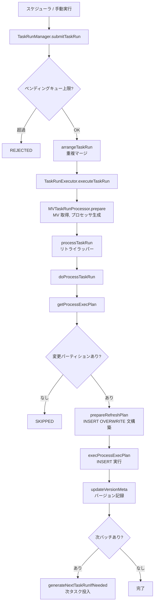
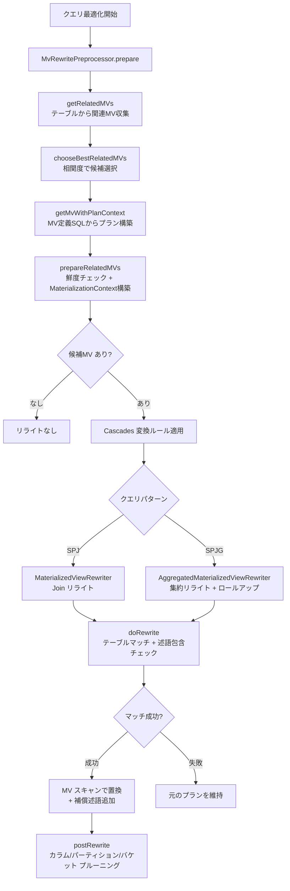

# 第23章 マテリアライズドビューとクエリリライト

> **本章で読むソース**
>
> - [`fe/fe-core/src/main/java/com/starrocks/catalog/MaterializedView.java`](https://github.com/StarRocks/starrocks/blob/4.1.1/fe/fe-core/src/main/java/com/starrocks/catalog/MaterializedView.java)
> - [`fe/fe-core/src/main/java/com/starrocks/scheduler/MVTaskRunProcessor.java`](https://github.com/StarRocks/starrocks/blob/4.1.1/fe/fe-core/src/main/java/com/starrocks/scheduler/MVTaskRunProcessor.java)
> - [`fe/fe-core/src/main/java/com/starrocks/scheduler/TaskRunManager.java`](https://github.com/StarRocks/starrocks/blob/4.1.1/fe/fe-core/src/main/java/com/starrocks/scheduler/TaskRunManager.java)
> - [`fe/fe-core/src/main/java/com/starrocks/scheduler/mv/MVRefreshProcessor.java`](https://github.com/StarRocks/starrocks/blob/4.1.1/fe/fe-core/src/main/java/com/starrocks/scheduler/mv/MVRefreshProcessor.java)
> - [`fe/fe-core/src/main/java/com/starrocks/scheduler/mv/pct/MVPCTRefreshProcessor.java`](https://github.com/StarRocks/starrocks/blob/4.1.1/fe/fe-core/src/main/java/com/starrocks/scheduler/mv/pct/MVPCTRefreshProcessor.java)
> - [`fe/fe-core/src/main/java/com/starrocks/sql/optimizer/MvRewritePreprocessor.java`](https://github.com/StarRocks/starrocks/blob/4.1.1/fe/fe-core/src/main/java/com/starrocks/sql/optimizer/MvRewritePreprocessor.java)
> - [`fe/fe-core/src/main/java/com/starrocks/sql/optimizer/MaterializationContext.java`](https://github.com/StarRocks/starrocks/blob/4.1.1/fe/fe-core/src/main/java/com/starrocks/sql/optimizer/MaterializationContext.java)
> - [`fe/fe-core/src/main/java/com/starrocks/sql/optimizer/MaterializedViewOptimizer.java`](https://github.com/StarRocks/starrocks/blob/4.1.1/fe/fe-core/src/main/java/com/starrocks/sql/optimizer/MaterializedViewOptimizer.java)
> - [`fe/fe-core/src/main/java/com/starrocks/sql/optimizer/rule/transformation/materialization/MaterializedViewRewriter.java`](https://github.com/StarRocks/starrocks/blob/4.1.1/fe/fe-core/src/main/java/com/starrocks/sql/optimizer/rule/transformation/materialization/MaterializedViewRewriter.java)
> - [`fe/fe-core/src/main/java/com/starrocks/sql/optimizer/rule/transformation/materialization/AggregatedMaterializedViewRewriter.java`](https://github.com/StarRocks/starrocks/blob/4.1.1/fe/fe-core/src/main/java/com/starrocks/sql/optimizer/rule/transformation/materialization/AggregatedMaterializedViewRewriter.java)

## この章の狙い

**マテリアライズドビュー**(MV)は、クエリの結果を実体テーブルとして永続化し、同じパターンのクエリを MV のスキャンで代替する機構である。
StarRocks はリフレッシュ方式の異なる複数の MV タイプを提供し、さらにクエリ最適化フェーズでユーザーのクエリを MV スキャンへ自動的に書き換える「クエリリライト」を備える。
本章ではまず MV のメタデータ構造とリフレッシュ方式の違いを整理し、次にリフレッシュの実行フローを追う。
後半ではクエリリライトの準備から SPJG パターンマッチングまでの処理を読み、最後にパーティション粒度の増分リフレッシュによるリフレッシュコスト削減の仕組みを解説する。

## 前提

第6章で読んだ Cascades オプティマイザの変換ルール機構と、第7章で読んだ Rule の適用フローを前提とする。
MV のクエリリライトは Cascades の変換ルールとして実装されており、最適化フェーズの中で MV スキャンへの書き換えが試行される。
また MV は内部的には `OlapTable` のサブクラスであり、第16章で読んだ Tablet、Rowset の仕組みがそのままデータ格納に使われる。

## マテリアライズドビューの種類

StarRocks の MV は、リフレッシュのタイミングによって大きく2種類に分かれる。

- **同期 MV**(Synchronous MV)：ベーステーブルに対するロード時にリアルタイムで更新される。OlapTable の `MaterializedIndexMeta` として管理され、ベーステーブルと同じ Tablet 内にインデックスとして格納される。単一テーブルの集約や列の射影に限定される。
- **非同期 MV**(Asynchronous MV)：独立した `MaterializedView` オブジェクトとして管理され、スケジューラによるバックグラウンドジョブでリフレッシュされる。複数テーブルの Join や外部テーブルの参照が可能であり、StarRocks の MV 機能の中心である。

`MaterializedViewRefreshType` 列挙型がリフレッシュ方式を定義する。

[`fe/fe-core/src/main/java/com/starrocks/catalog/MaterializedViewRefreshType.java` L24-L28](https://github.com/StarRocks/starrocks/blob/4.1.1/fe/fe-core/src/main/java/com/starrocks/catalog/MaterializedViewRefreshType.java#L24-L28)

```java
public enum MaterializedViewRefreshType {
    SYNC,
    ASYNC,
    MANUAL,
    INCREMENTAL;

```

`SYNC` は同期 MV、`ASYNC` は定期またはデータ変更トリガーでリフレッシュされる非同期 MV、`MANUAL` はユーザーが明示的に `REFRESH MATERIALIZED VIEW` を実行するまでリフレッシュしない方式、`INCREMENTAL` は変更行のみを増分適用する IVM(Incremental View Maintenance)方式である。

## MaterializedView クラスの構造

`MaterializedView` は `OlapTable` を継承し、MV 固有のメタデータを保持する。

[`fe/fe-core/src/main/java/com/starrocks/catalog/MaterializedView.java` L142](https://github.com/StarRocks/starrocks/blob/4.1.1/fe/fe-core/src/main/java/com/starrocks/catalog/MaterializedView.java#L142)

```java
public class MaterializedView extends OlapTable implements GsonPreProcessable, GsonPostProcessable {

```

### リフレッシュ方式の制御

MV のリフレッシュ方式は `MvRefreshScheme` が管理する。

[`fe/fe-core/src/main/java/com/starrocks/catalog/MaterializedView.java` L520-L535](https://github.com/StarRocks/starrocks/blob/4.1.1/fe/fe-core/src/main/java/com/starrocks/catalog/MaterializedView.java#L520-L535)

```java
public static class MvRefreshScheme {
    @SerializedName(value = "moment")
    private RefreshMoment moment;
    @SerializedName(value = "type")
    private MaterializedViewRefreshType type;
    // when type is ASYNC
    // asyncRefreshContext is used to store refresh context
    @SerializedName(value = "asyncRefreshContext")
    private AsyncRefreshContext asyncRefreshContext;
    @SerializedName(value = "lastRefreshTime")
    private long lastRefreshTime;

    public MvRefreshScheme() {
        this.moment = RefreshMoment.IMMEDIATE;
        this.type = MaterializedViewRefreshType.ASYNC;

```

`moment` はリフレッシュの即時性を示し、`IMMEDIATE` は作成直後にリフレッシュを実行、`DEFERRED` は最初のリフレッシュを遅延させる。
`asyncRefreshContext` には定期実行のスケジュール(開始時刻、間隔、単位)と、ベーステーブルのバージョン追跡情報が格納される。

### リフレッシュモード

実行時のリフレッシュ動作は `RefreshMode` が決定する。

[`fe/fe-core/src/main/java/com/starrocks/catalog/MaterializedView.java` L190-L220](https://github.com/StarRocks/starrocks/blob/4.1.1/fe/fe-core/src/main/java/com/starrocks/catalog/MaterializedView.java#L190-L220)

```java
public enum RefreshMode {
    AUTO,
    PCT,
    INCREMENTAL;

    public static RefreshMode defaultValue() {
        return PCT;
    }
    // ... (中略) ...
}

```

デフォルトの `PCT`(Partition Change Tracking)は、ベーステーブルのパーティション変更を追跡し、変更があったパーティションのみをリフレッシュする方式である。
`AUTO` はシステムが PCT と IVM を自動選択する。
`INCREMENTAL` は変更行単位の増分リフレッシュを行う IVM モードである。

### ベーステーブルの追跡

MV は `baseTableInfos` フィールドでベーステーブルの一覧を保持する。
各ベーステーブルのパーティションバージョンは `AsyncRefreshContext` 内の `baseTableVisibleVersionMap`(OlapTable 用)と `baseTableInfoVisibleVersionMap`(外部テーブル用)が追跡する。

[`fe/fe-core/src/main/java/com/starrocks/catalog/MaterializedView.java` L320-L337](https://github.com/StarRocks/starrocks/blob/4.1.1/fe/fe-core/src/main/java/com/starrocks/catalog/MaterializedView.java#L320-L337)

```java
public static class AsyncRefreshContext {
    // Olap base table refreshed meta infos
    // base table id -> (partition name -> partition info (id, version))
    @SerializedName("baseTableVisibleVersionMap")
    private final Map<Long, Map<String, BasePartitionInfo>> baseTableVisibleVersionMap;

    // External base table refreshed meta infos
    @SerializedName("baseTableInfoVisibleVersionMap")
    private final Map<BaseTableInfo, Map<String, BasePartitionInfo>> baseTableInfoVisibleVersionMap;

    // Materialized view partition is updated/added associated with ref-base-table partitions.
    @SerializedName("mvPartitionNameRefBaseTablePartitionMap")
    private final Map<String, Set<String>> mvPartitionNameRefBaseTablePartitionMap;

```

`baseTableVisibleVersionMap` はテーブル ID をキーとし、各パーティション名に対して最終リフレッシュ時のバージョンを記録する。
`mvPartitionNameRefBaseTablePartitionMap` は MV パーティション名からベーステーブルパーティション名への対応を保持し、パーティション粒度のリフレッシュ判定に使う。
リフレッシュ時に、ベーステーブルの現在のバージョンとここに記録されたバージョンを比較することで、変更があったパーティションを特定する。

`BasePartitionInfo` がバージョン追跡の単位である。

[`fe/fe-core/src/main/java/com/starrocks/catalog/MaterializedView.java` L245-L270](https://github.com/StarRocks/starrocks/blob/4.1.1/fe/fe-core/src/main/java/com/starrocks/catalog/MaterializedView.java#L245-L270)

```java
public static class BasePartitionInfo {
    @SerializedName(value = "id")
    private final long id;

    @SerializedName(value = "version")
    private final long version;

    @SerializedName(value = "lastRefreshTime")
    private final long lastRefreshTime;

    // last modified time of partition data path
    @SerializedName(value = "lastFileModifiedTime")
    private long extLastFileModifiedTime;

    // file number in the partition data path
    @SerializedName(value = "fileNumber")
    private int fileNumber;

    public BasePartitionInfo(long id, long version, long lastRefreshTime) {
        this.id = id;
        this.version = version;
        this.lastRefreshTime = lastRefreshTime;

```

OlapTable のパーティションでは `version`(Visible Version)で変更を検出し、外部テーブル(Hive, Iceberg 等)では `extLastFileModifiedTime` とファイル数で変更を検出する。

### 主要フィールドの全体像

MV メタデータの主要フィールドを整理する。

[`fe/fe-core/src/main/java/com/starrocks/catalog/MaterializedView.java` L611-L664](https://github.com/StarRocks/starrocks/blob/4.1.1/fe/fe-core/src/main/java/com/starrocks/catalog/MaterializedView.java#L611-L664)

```java
@SerializedName(value = "dbId")
private long dbId;

@SerializedName(value = "refreshScheme")
private MvRefreshScheme refreshScheme;

@SerializedName(value = "baseTableIds")
private Set<Long> baseTableIds;

@SerializedName(value = "baseTableInfos")
private List<BaseTableInfo> baseTableInfos;

@SerializedName(value = "active")
private boolean active;
// ... (中略) ...
@SerializedName(value = "viewDefineSql")
private String viewDefineSql;
// ... (中略) ...
@SerializedName(value = "maxMVRewriteStaleness")
private int maxMVRewriteStaleness = 0;

```

`active` は MV が有効かどうかを示す。
ベーステーブルが削除されるなどメタデータの整合性が崩れると `active` が `false` になり、リフレッシュもクエリリライトも行われなくなる。
`viewDefineSql` は MV の定義 SQL であり、リフレッシュジョブの INSERT 文生成やクエリリライトのプラン構築に使われる。
`maxMVRewriteStaleness` はクエリリライト時に許容する鮮度のしきい値(秒)を指定し、MV のリフレッシュ時刻が `now() - maxMVRewriteStaleness` より新しければ、多少の鮮度劣化があってもリライトを許可する。

## MV リフレッシュの実行フロー

非同期 MV のリフレッシュはスケジューラのタスクとして実行される。
処理の流れは `MVTaskRunProcessor` → `MVRefreshProcessor`(抽象クラス) → `MVPCTRefreshProcessor`(PCT 実装)の3層構造をとる。

### タスクの投入と管理

`TaskRunManager` がリフレッシュタスクの投入とスケジューリングを担う。

[`fe/fe-core/src/main/java/com/starrocks/scheduler/TaskRunManager.java` L60-L85](https://github.com/StarRocks/starrocks/blob/4.1.1/fe/fe-core/src/main/java/com/starrocks/scheduler/TaskRunManager.java#L60-L85)

```java
public SubmitResult submitTaskRun(TaskRun taskRun, ExecuteOption option) {
    // ... (中略) ...
    if (taskRunScheduler.getPendingQueueCount() >= Config.task_runs_queue_length) {
        // ... (中略) ...
        return new SubmitResult(null, SubmitResult.SubmitStatus.REJECTED);
    }
    // ... (中略) ...
    return arrangeTaskRun(taskRun, option.isMergeRedundant());
}

```

タスク投入時にはキューの上限チェックを行い、超過していれば REJECTED を返す。
`arrangeTaskRun` メソッドでは、同一 MV に対する既存のペンディングタスクがあれば `isMergeRedundant` フラグに従ってマージする。
マージ時は優先度の高いほうを残し、重複するリフレッシュの実行を防ぐ。

### MVTaskRunProcessor のライフサイクル

`MVTaskRunProcessor` はリフレッシュタスクのエントリポイントである。

[`fe/fe-core/src/main/java/com/starrocks/scheduler/MVTaskRunProcessor.java` L66](https://github.com/StarRocks/starrocks/blob/4.1.1/fe/fe-core/src/main/java/com/starrocks/scheduler/MVTaskRunProcessor.java#L66)

```java
public class MVTaskRunProcessor extends BaseTaskRunProcessor implements MVRefreshExecutor

```

`prepare` メソッドで MV オブジェクトの取得と初期化を行う。

[`fe/fe-core/src/main/java/com/starrocks/scheduler/MVTaskRunProcessor.java` L93-L148](https://github.com/StarRocks/starrocks/blob/4.1.1/fe/fe-core/src/main/java/com/starrocks/scheduler/MVTaskRunProcessor.java#L93-L148)

```java
public void prepare(TaskRunContext context) throws Exception {
    // ... (中略) ...
    mv.waitForReloaded();
    // ... (中略) ...
    mvRefreshProcessor = MVRefreshProcessorFactory.INSTANCE.newProcessor(
            db, mv, mvTaskRunContext, mvMetricsEntity, refreshMode);
}

```

MV がまだリロード中であれば `waitForReloaded` で待機し、MV が inactive であれば `MVActiveChecker.tryToActivate` で再活性化を試みる。
`MVRefreshProcessorFactory` がリフレッシュモードに応じた `MVRefreshProcessor` 実装を生成する。

`processTaskRun` が実行の本体であり、`doProcessTaskRun` を呼び出す。

[`fe/fe-core/src/main/java/com/starrocks/scheduler/MVTaskRunProcessor.java` L313-L331](https://github.com/StarRocks/starrocks/blob/4.1.1/fe/fe-core/src/main/java/com/starrocks/scheduler/MVTaskRunProcessor.java#L313-L331)

```java
private Constants.TaskRunState doProcessTaskRun(TaskRunContext context) throws Exception {
    // ... (中略) ...
    // Step 1: get the ExecPlan of insert stmt
    ProcessExecPlan processExecPlan = mvRefreshProcessor.getProcessExecPlan(taskRunContext);
    // ... (中略) ...
    // Step 2: execute the ExecPlan
    return mvRefreshProcessor.execProcessExecPlan(taskRunContext, processExecPlan, this);
}

```

2段階に分かれる。
第1段階の `getProcessExecPlan` でリフレッシュ対象のパーティションを決定し、INSERT 文を構築する。
対象パーティションがなければ `SKIPPED` を返して早期終了する。
第2段階の `execProcessExecPlan` で INSERT 文を実行し、成功後にバージョンメタを更新する。

### INSERT 文の生成

リフレッシュは INSERT OVERWRITE 文として実行される。
MV の定義 SQL は `getTaskDefinition` メソッドで INSERT OVERWRITE 形式に変換される。

[`fe/fe-core/src/main/java/com/starrocks/catalog/MaterializedView.java` L880-L881](https://github.com/StarRocks/starrocks/blob/4.1.1/fe/fe-core/src/main/java/com/starrocks/catalog/MaterializedView.java#L880-L881)

```java
public String getTaskDefinition() {
    return formatInsertSql("insert overwrite");
}

```

`INSERT OVERWRITE` を使う理由は、対象パーティションのデータを丸ごと置き換えることで、部分更新の整合性問題を回避するためである。
IVM モードのみ `INSERT INTO` を使う。

`MVRefreshProcessor.generateInsertAst` が INSERT 文の AST を組み立てる。

[`fe/fe-core/src/main/java/com/starrocks/scheduler/mv/MVRefreshProcessor.java` L568-L603](https://github.com/StarRocks/starrocks/blob/4.1.1/fe/fe-core/src/main/java/com/starrocks/scheduler/mv/MVRefreshProcessor.java#L568-L603)

```java
protected InsertStmt generateInsertAst(ConnectContext ctx,
                                       PCellSortedSet mvTargetPartitionNames,
                                       String definition) throws AnalysisException {
    final InsertStmt insertStmt =
            (InsertStmt) SqlParser.parse(definition, ctx.getSessionVariable()).get(0);
    // set target partitions
    if (PCellUtils.isNotEmpty(mvTargetPartitionNames)) {
        PartitionRef partitionRef = new PartitionRef(
                Lists.newArrayList(mvTargetPartitionNames.getPartitionNames()),
                false, NodePosition.ZERO);
        insertStmt.setTargetPartitionNames(partitionRef);
    }
    // insert overwrite mv must set system = true
    insertStmt.setSystem(true);
    // ... (中略) ...
    return insertStmt;
}

```

定義 SQL をパースして INSERT 文の AST を構築し、リフレッシュ対象のパーティション名を `setTargetPartitionNames` で指定する。
`setSystem(true)` によりシステム内部からの INSERT であることを示し、権限チェックをスキップする。

## パーティション単位の増分リフレッシュ

PCT(Partition Change Tracking)方式のリフレッシュは `MVPCTRefreshProcessor` が実装する。

[`fe/fe-core/src/main/java/com/starrocks/scheduler/mv/pct/MVPCTRefreshProcessor.java` L76](https://github.com/StarRocks/starrocks/blob/4.1.1/fe/fe-core/src/main/java/com/starrocks/scheduler/mv/pct/MVPCTRefreshProcessor.java#L76)

```java
public final class MVPCTRefreshProcessor extends MVRefreshProcessor {

```

### リフレッシュ対象の決定

`getProcessExecPlan` がリフレッシュ対象パーティションの特定から INSERT 文の構築までを一貫して行う。

[`fe/fe-core/src/main/java/com/starrocks/scheduler/mv/pct/MVPCTRefreshProcessor.java` L132-L163](https://github.com/StarRocks/starrocks/blob/4.1.1/fe/fe-core/src/main/java/com/starrocks/scheduler/mv/pct/MVPCTRefreshProcessor.java#L132-L163)

```java
public ProcessExecPlan getProcessExecPlan(TaskRunContext taskRunContext) throws Exception {
    if (isStalePinnedBatch()) {
        return new ProcessExecPlan(Constants.TaskRunState.SKIPPED, null, null);
    }

    // sync and check partitions of base tables
    syncAndCheckPCTPartitions(taskRunContext);
    // ... (中略) ...
    // check to refresh partitions of mv and base tables
    try (Timer ignored = Tracers.watchScope("MVRefreshCheckMVToRefreshPartitions")) {
        updatePCTToRefreshMetas(taskRunContext);
        if (PCellUtils.isEmpty(pctMVToRefreshedPartitions)) {
            return new ProcessExecPlan(Constants.TaskRunState.SKIPPED, null, null);
        }
    }

    // execute the ExecPlan of insert stmt
    InsertStmt insertStmt = null;
    try (Timer ignored = Tracers.watchScope("MVRefreshPrepareRefreshPlan")) {
        insertStmt = prepareRefreshPlan(pctMVToRefreshedPartitions, pctRefTablePartitionNames);
    }
    return new ProcessExecPlan(Constants.TaskRunState.SUCCESS, mvContext.getExecPlan(), insertStmt);
}

```

処理は3段階で進む。

1. `syncAndCheckPCTPartitions` でベーステーブルの現在のパーティション状態をスナップショットとして取得する
2. `updatePCTToRefreshMetas` で `AsyncRefreshContext` に記録された前回リフレッシュ時のバージョンと比較し、変更があったパーティションを特定する
3. 対象パーティションがあれば `prepareRefreshPlan` で INSERT OVERWRITE 文を構築する

対象パーティションが空であれば `SKIPPED` を返し、不要なリフレッシュを回避する。

### パーティショナーの選択

MV のパーティション方式に応じて、異なるパーティショナーが使われる。

[`fe/fe-core/src/main/java/com/starrocks/scheduler/mv/MVRefreshProcessor.java` L229-L243](https://github.com/StarRocks/starrocks/blob/4.1.1/fe/fe-core/src/main/java/com/starrocks/scheduler/mv/MVRefreshProcessor.java#L229-L243)

```java
private MVPCTRefreshPartitioner buildMvRefreshPartitioner(MaterializedView mv,
                                                          TaskRunContext context,
                                                          MVRefreshParams mvRefreshParams) {
    PartitionInfo partitionInfo = mv.getPartitionInfo();
    if (partitionInfo.isUnPartitioned()) {
        return new MVPCTRefreshNonPartitioner(mvContext, context, db, mv, mvRefreshParams);
    } else if (partitionInfo.isRangePartition()) {
        return new MVPCTRefreshRangePartitioner(mvContext, context, db, mv, mvRefreshParams);
    } else if (partitionInfo.isListPartition()) {
        return new MVPCTRefreshListPartitioner(mvContext, context, db, mv, mvRefreshParams);
    }
    // ... (中略) ...
}

```

非パーティションテーブルの場合は `MVPCTRefreshNonPartitioner` が全データを対象としたリフレッシュを行う。
Range パーティションでは `MVPCTRefreshRangePartitioner`、List パーティションでは `MVPCTRefreshListPartitioner` がそれぞれパーティション単位のリフレッシュ対象決定を担う。

### パーティション述語のプッシュダウン

`MVPCTRefreshPlanBuilder` がリフレッシュ対象パーティションの情報を INSERT 文のクエリ部分に述語としてプッシュダウンする。

[`fe/fe-core/src/main/java/com/starrocks/scheduler/mv/pct/MVPCTRefreshPlanBuilder.java` L125-L161](https://github.com/StarRocks/starrocks/blob/4.1.1/fe/fe-core/src/main/java/com/starrocks/scheduler/mv/pct/MVPCTRefreshPlanBuilder.java#L125-L161)

```java
private InsertStmt buildInsertPlan(InsertStmt insertStmt,
                                   PCellSortedSet mvToRefreshedPartitions,
                                   PCellSetMapping refTableRefreshPartitions,
                                   ConnectContext ctx) throws AnalysisException {
    // ... (中略) ...
    // if the refTableRefreshPartitions is empty(not partitioned mv),
    // no need to generate partition predicate
    if (refTableRefreshPartitions.isEmpty() || mvToRefreshedPartitions.isEmpty()) {
        logger.info("There is no ref table partitions to refresh, " +
                     "skip to generate partition predicates");
        return insertStmt;
    }

    // try to push down into query relation so can push down filter into both sides
    QueryRelation queryRelation = queryStatement.getQueryRelation();
    List<Expr> extraPartitionPredicates = Lists.newArrayList();
    Map<Table, List<SlotRef>> refBaseTablePartitionSlots = mv.getRefBaseTablePartitionSlots();
    // ... (中略) ...
}

```

パーティション述語のプッシュダウンにより、リフレッシュ時にベーステーブルの全パーティションをスキャンせず、変更があったパーティションのデータのみを読み出す。
これがパーティション粒度の増分リフレッシュのコスト削減を実現する仕組みである。

### バッチリフレッシュと次タスクの生成

パーティション数が多い場合、すべてのパーティションを1回のタスクでリフレッシュするとメモリ不足や実行時間の超過を招く。
`PartitionRefreshStrategy` の `ADAPTIVE` 戦略は、行数やバイト数のしきい値に基づいてリフレッシュ対象を動的に制限する。

[`fe/fe-core/src/main/java/com/starrocks/catalog/MaterializedView.java` L153-L171](https://github.com/StarRocks/starrocks/blob/4.1.1/fe/fe-core/src/main/java/com/starrocks/catalog/MaterializedView.java#L153-L171)

```java
public enum PartitionRefreshStrategy {
    FORCE,
    STRICT,
    ADAPTIVE;

    public static PartitionRefreshStrategy defaultValue() {
        return ADAPTIVE;
    }
    // ... (中略) ...
}

```

1回のリフレッシュで処理しきれなかったパーティションは、次のタスクランとして再投入される。

[`fe/fe-core/src/main/java/com/starrocks/scheduler/mv/pct/MVPCTRefreshProcessor.java` L282-L349](https://github.com/StarRocks/starrocks/blob/4.1.1/fe/fe-core/src/main/java/com/starrocks/scheduler/mv/pct/MVPCTRefreshProcessor.java#L282-L349)

```java
public void generateNextTaskRunIfNeeded() {
    if (!mvContext.hasNextBatchPartition() || mvContext.getTaskRun().isKilled()) {
        return;
    }
    TaskManager taskManager = GlobalStateMgr.getCurrentState().getTaskManager();
    Map<String, String> properties = mvContext.getProperties();
    // ... (中略) ...
    PartitionInfo partitionInfo = mv.getPartitionInfo();
    if (partitionInfo.isListPartition()) {
        newProperties.put(TaskRun.PARTITION_VALUES, mvContext.getNextPartitionValues());
    } else {
        newProperties.put(TaskRun.PARTITION_START, mvContext.getNextPartitionStart());
        newProperties.put(TaskRun.PARTITION_END, mvContext.getNextPartitionEnd());
    }
    // ... (中略) ...
    // Partition refreshing task run should have the HIGHER priority
    ExecuteOption option = new ExecuteOption(priority, true, newProperties);
    // ... (中略) ...
    taskManager.executeTask(taskName, option);
}

```

次バッチのタスクには `PARTITION_START` と `PARTITION_END`(Range の場合)または `PARTITION_VALUES`(List の場合)が設定され、残りのパーティション範囲を引き継ぐ。
バッチ継続タスクには `HIGHER` の優先度が付与され、通常のリフレッシュタスクより先にスケジューリングされる。
これにより、一連のパーティションリフレッシュが他のタスクに割り込まれて完了しない事態を防ぐ。

## リフレッシュの全体フロー



## クエリリライトの仕組み

クエリリライトは、ユーザーのクエリを MV のスキャンに置き換える最適化である。
Cascades オプティマイザの変換ルールとして実装されており、最適化フェーズ中に候補 MV の列挙から書き換えの適用までが実行される。

### MvRewritePreprocessor による候補 MV の収集

`MvRewritePreprocessor.prepare` が最適化の冒頭で呼ばれ、クエリのテーブル群から候補 MV を収集する。

[`fe/fe-core/src/main/java/com/starrocks/sql/optimizer/MvRewritePreprocessor.java` L133-L202](https://github.com/StarRocks/starrocks/blob/4.1.1/fe/fe-core/src/main/java/com/starrocks/sql/optimizer/MvRewritePreprocessor.java#L133-L202)

```java
public void prepare(OptExpression queryOptExpression) {
    try (Timer ignored = Tracers.watchScope("MVPreprocess")) {
        Set<Table> queryTables = MvUtils.getAllTables(queryOptExpression).stream()
                .collect(Collectors.toSet());
        // ... (中略) ...
        // 1. get related mvs for all input tables
        List<MaterializedViewWrapper> relatedMVs =
                getRelatedMVs(queryTables, context.getOptimizerOptions().isRuleBased());
        // ... (中略) ...
        // 2. choose best related mvs by user's config or related mv limit
        List<MaterializedViewWrapper> candidateMVs;
        try (Timer t1 = Tracers.watchScope("MVChooseCandidates")) {
            candidateMVs = chooseBestRelatedMVs(queryTables, relatedMVWrappers,
                    queryOptExpression);
        }
        // ... (中略) ...
        // 3. convert to mv with planContext, skip if mv has no valid plan(not SPJG)
        List<MaterializedViewWrapper> mvWithPlanContexts;
        try (Timer t2 = Tracers.watchScope("MVGenerateMvPlan")) {
            mvWithPlanContexts = getMvWithPlanContext(candidateMVs);
        }
        // ... (中略) ...
        // 4. process related mvs to candidates
        try (Timer t3 = Tracers.watchScope("MVPrepareRelatedMVs")) {
            prepareRelatedMVs(queryTables, mvWithPlanContexts);
        }
        // ... (中略) ...
    }
}

```

処理は5段階で進む。

1. クエリに含まれる全テーブルから関連する MV を収集する(`getRelatedMVs`)
2. 候補数が上限を超える場合、テーブルの相関度に基づいて上位を選択する(`chooseBestRelatedMVs`)
3. 各候補 MV の定義 SQL を最適化して論理プランを構築し、SPJG パターン[^1]に合致するかを検証する(`getMvWithPlanContext`)
4. 各候補の鮮度をチェックし、`MaterializationContext` を構築して候補リストに登録する(`prepareRelatedMVs`)
5. ビューベースのリライトが有効であれば、ビューを含むプランも処理する

[^1]: SPJG(Select-Project-Join-GroupBy)は MV リライトが対象とするクエリパターンで、射影、フィルタ、結合、集約の組み合わせで構成されるクエリを指す。

### MaterializedViewOptimizer による MV プラン構築

候補 MV の論理プランは `MaterializedViewOptimizer` が構築する。
MV の定義 SQL をパースし、ルールベースの最適化を適用して SPJG 形式の論理プランを得る。

[`fe/fe-core/src/main/java/com/starrocks/sql/optimizer/MaterializedViewOptimizer.java` L46-L73](https://github.com/StarRocks/starrocks/blob/4.1.1/fe/fe-core/src/main/java/com/starrocks/sql/optimizer/MaterializedViewOptimizer.java#L46-L73)

```java
private MvPlanContext optimizeImpl(MaterializedView mv,
                                   ConnectContext connectContext,
                                   boolean inlineView,
                                   boolean isCheckNonDeterministicFunction) {
    // optimize the sql by rule and disable rule based materialized view rewrite
    OptimizerOptions optimizerOptions = OptimizerOptions.newRuleBaseOpt();
    // Disable partition prune for mv's plan so no needs to compensate
    // pruned predicates anymore.
    optimizerOptions.disableRule(RuleType.GP_PARTITION_PRUNE);
    optimizerOptions.disableRule(RuleType.GP_ALL_MV_REWRITE);
    // ... (中略) ...
    ColumnRefFactory columnRefFactory = new ColumnRefFactory();
    String mvSql = mv.getViewDefineSql();
    // parse mv's defined query
    StatementBase stmt = MvUtils.parse(mv, mvSql, connectContext);
    // ... (中略) ...
    Pair<OptExpression, LogicalPlan> plans = MvUtils.getRuleOptimizedLogicalPlan(stmt,
            columnRefFactory, connectContext, optimizerOptions, mvTransformerContext);
    // ... (中略) ...
    boolean isValidPlan = MvUtils.isValidMVPlan(mvPlan);
    return new MvPlanContext(mvPlan, plans.second.getOutputColumn(), columnRefFactory,
            isValidPlan, containsNDFunctions, invalidPlanReason);
}

```

パーティションプルーニングと MV リライト自身のルールを無効化した状態で最適化を行う。
パーティションプルーニングを無効化する理由は、MV プランのパーティション述語をリライト後の補償述語として利用するためである。
非決定論的関数(RANDOM(), NOW() など)を含む MV は無効なプランとして扱われる。

### MaterializationContext の役割

`MaterializationContext` は、1つの MV に対するリライトのコンテキストを保持する。

[`fe/fe-core/src/main/java/com/starrocks/sql/optimizer/MaterializationContext.java` L62-L95](https://github.com/StarRocks/starrocks/blob/4.1.1/fe/fe-core/src/main/java/com/starrocks/sql/optimizer/MaterializationContext.java#L62-L95)

```java
public class MaterializationContext {
    private final MaterializedView mv;
    // scan materialized view operator
    private LogicalOlapScanOperator scanMvOperator;
    // logical OptExpression for query of materialized view
    private final OptExpression mvExpression;

    private final ColumnRefFactory mvColumnRefFactory;
    private final ColumnRefFactory queryRefFactory;
    private final OptimizerContext optimizerContext;
    private Map<ColumnRefOperator, ColumnRefOperator> outputMapping;

    // Updated partition names of the ref base table
    private final MvUpdateInfo mvUpdateInfo;
    private final List<Table> baseTables;
    // tables both in query and mv
    private final List<Table> intersectingTables;
    // group ids that are rewritten by this mv
    private final List<Integer> matchedGroups;
    // The output column refs of the MV
    private final List<ColumnRefOperator> mvOutputColumnRefs;
    private long mvUsedCount = 0;

```

`mvExpression` に MV の論理プランを、`scanMvOperator` に MV テーブルへのスキャンオペレーターを保持する。
`mvUpdateInfo` にはリフレッシュが必要なパーティション情報が格納されており、リライト時のパーティション補償述語の生成に使われる。
`matchedGroups` は同一 MV で同じ Memo Group に対する重複リライトを防ぐために使われる。

### 鮮度チェックと準備

`prepareRelatedMVs` で各候補 MV の鮮度をチェックし、有効な候補のみ `MaterializationContext` を構築する。

[`fe/fe-core/src/main/java/com/starrocks/sql/optimizer/MvRewritePreprocessor.java` L756-L798](https://github.com/StarRocks/starrocks/blob/4.1.1/fe/fe-core/src/main/java/com/starrocks/sql/optimizer/MvRewritePreprocessor.java#L756-L798)

```java
public void prepareRelatedMVs(Set<Table> queryTables,
                              List<MaterializedViewWrapper> mvWithPlanContexts) {
    // ... (中略) ...
    for (MaterializedViewWrapper wrapper : mvWithPlanContexts) {
        MaterializedView mv = wrapper.getMV();
        try {
            // mv's partitions to refresh
            MvUpdateInfo mvUpdateInfo = queryMaterializationContext
                    .getOrInitMVTimelinessInfos(mv, queryRewriteParams);
            if (mvUpdateInfo == null || !mvUpdateInfo.isValidRewrite()) {
                OptimizerTraceUtil.logMVRewriteFailReason(mv.getName(),
                        "stale partitions {}", mvUpdateInfo);
                continue;
            }
            mvInfos.add(Pair.create(wrapper, mvUpdateInfo));
        } catch (Exception e) {
            // ... (中略) ...
        }
    }
    // ... (中略) ...
}

```

`MvUpdateInfo.isValidRewrite` が false の場合、その MV は鮮度が不十分としてリライト候補から除外される。
`maxMVRewriteStaleness` が設定されている場合は、多少の鮮度劣化があっても許容される。

候補の準備は `enable_materialized_view_concurrent_prepare` 設定に応じて並列実行される。
各 MV の準備にはタイムアウトが設定されており、1つの MV の準備に時間がかかっても他の候補の処理をブロックしない。

## MV リライトルールの適用

Cascades の変換ルールフェーズで、MV リライトルールがクエリプランの書き換えを試行する。

### MaterializedViewRewriter(SPJG リライター)

非同期 MV のリライトは `MaterializedViewRewriter`(transformation パッケージ)が担う。
論文 "Optimizing Queries Using Materialized Views: A Practical, Scalable Solution" のアルゴリズムに基づく。

[`fe/fe-core/src/main/java/com/starrocks/sql/optimizer/rule/transformation/materialization/MaterializedViewRewriter.java` L105-L139](https://github.com/StarRocks/starrocks/blob/4.1.1/fe/fe-core/src/main/java/com/starrocks/sql/optimizer/rule/transformation/materialization/MaterializedViewRewriter.java#L105-L139)

```java
/*
 * SPJG materialized view rewriter, based on
 * 《Optimizing Queries Using Materialized Views: A Practical, Scalable Solution》
 *
 *  This rewriter is for single table or multi table join query rewrite
 */
public class MaterializedViewRewriter implements IMaterializedViewRewriter {
    // ... (中略) ...
    public static final Map<JoinOperator, List<JoinOperator>> JOIN_COMPATIBLE_MAP =
            ImmutableMap.<JoinOperator, List<JoinOperator>>builder()
                    .put(JoinOperator.INNER_JOIN, Lists.newArrayList(
                            JoinOperator.LEFT_SEMI_JOIN, JoinOperator.RIGHT_SEMI_JOIN))
                    .put(JoinOperator.LEFT_OUTER_JOIN, Lists.newArrayList(
                            JoinOperator.INNER_JOIN, JoinOperator.LEFT_ANTI_JOIN))
                    // ... (中略) ...
                    .build();

    public enum MatchMode {
        // all tables and join types match
        COMPLETE,
        // all tables match but join types do not
        PARTIAL,
        // all join types match but query has more tables
        QUERY_DELTA,
        // all join types match but view has more tables
        VIEW_DELTA,
        NOT_MATCH
    }

```

`MatchMode` がクエリと MV のテーブル構成の一致度を分類する。
`COMPLETE` は全テーブルと Join 型が一致する場合、`VIEW_DELTA` は MV のほうがクエリより多くのテーブルを含む場合(スノーフレークスキーマで外部キーにより余分なテーブルを除外できるケース)に対応する。

`JOIN_COMPATIBLE_MAP` は MV の Join 型からクエリの Join 型への互換性を定義する。
たとえば MV が LEFT OUTER JOIN で定義されている場合、クエリが INNER JOIN であってもリライト可能であるが、NULL を除外する補償述語が追加される。

### doRewrite メソッドの流れ

`doRewrite` がリライトの中核である。

[`fe/fe-core/src/main/java/com/starrocks/sql/optimizer/rule/transformation/materialization/MaterializedViewRewriter.java` L507-L542](https://github.com/StarRocks/starrocks/blob/4.1.1/fe/fe-core/src/main/java/com/starrocks/sql/optimizer/rule/transformation/materialization/MaterializedViewRewriter.java#L507-L542)

```java
public OptExpression doRewrite(MvRewriteContext mvContext) {
    final OptExpression queryExpression = mvRewriteContext.getQueryExpression();
    final OptExpression mvExpression = materializationContext.getMvExpression();
    final List<Table> queryTables = mvRewriteContext.getQueryTables();
    final List<Table> mvTables = MvUtils.getAllTables(mvExpression);

    MatchMode matchMode = getMatchMode(queryTables, mvTables);

    if (matchMode == MatchMode.NOT_MATCH
            && mvTables.stream().noneMatch(queryTables::contains)) {
        return null;
    }
    // Check whether mv can be applicable for the query.
    if (!isMVApplicable(mvExpression, matchMode, queryExpression)) {
        return null;
    }
    // ... (中略) ...
    if (matchMode == MatchMode.VIEW_DELTA) {
        return rewriteViewDelta(queryTables, mvTables, mvPredicateSplit,
                mvColumnRefRewriter, queryExpression, mvExpression);
    } else if (matchMode == MatchMode.COMPLETE) {
        return rewriteComplete(queryTables, mvTables, matchMode, mvPredicateSplit,
                mvColumnRefRewriter, null, null, null);
    } else {
        return null;
    }
}

```

処理の流れは以下のとおりである。

1. クエリと MV のテーブル群を比較し、`MatchMode` を決定する
2. MV のプランがクエリのパターンに適用可能かチェックする(`isMVApplicable`)
3. `COMPLETE` マッチの場合は `rewriteComplete` で述語の包含関係を検証し、カラムマッピングを構築して MV スキャンに置き換える
4. `VIEW_DELTA` マッチの場合は `rewriteViewDelta` で外部キー制約を利用して余分なテーブルを除去し、リライトする

リライト成功後は `postRewrite` でカラムプルーニング、パーティションプルーニング、バケットプルーニングを適用する。

### 集約リライト

`AggregatedMaterializedViewRewriter` が集約クエリの MV リライトを担う。

[`fe/fe-core/src/main/java/com/starrocks/sql/optimizer/rule/transformation/materialization/AggregatedMaterializedViewRewriter.java` L62-L100](https://github.com/StarRocks/starrocks/blob/4.1.1/fe/fe-core/src/main/java/com/starrocks/sql/optimizer/rule/transformation/materialization/AggregatedMaterializedViewRewriter.java#L62-L100)

```java
/**
 * SPJG materialized view rewriter, based on
 * 《Optimizing Queries Using Materialized Views: A Practical, Scalable Solution》
 *
 * This rewriter is for aggregated query rewrite
 */
public final class AggregatedMaterializedViewRewriter extends MaterializedViewRewriter {
    // ... (中略) ...
    // NOTE:
    // - there may be a projection on LogicalAggregationOperator.
    // - agg rewrite should be based on projection of mv.
    // - `rollup`: if mv's group-by keys is subset of query's group by keys,
    //    need add extra aggregate to compensate.
    // Example:
    // mv:
    //     select a, b, abs(a) as col1, length(b) as col2, sum(c) as col3
    //     from t
    //     group by a, b
    // 1. query needs no `rollup`
    //      query: select abs(a), length(b), sum(c) from t group by a, b
    //      rewrite: select col1, col2, col3 from mv
    // 2. query needs `rollup`
    //      query: select a, abs(a), sum(c) from t group by a
    //      rewrite:
    //      select a, col1, sum(col5)
    //      (
    //          select a, b, col1, col2, col3 from mv
    //      ) t

```

集約リライトでは、MV の GROUP BY キーがクエリの GROUP BY キーの上位集合(つまり MV のほうが粒度が細かい)である場合、MV スキャンの上に追加の集約オペレーター(ロールアップ)を挿入して補償する。
たとえば MV が `GROUP BY a, b` で定義されていてクエリが `GROUP BY a` であれば、MV の結果に対して `b` を集約するロールアップが追加される。
`SUM` はそのまま `SUM` でロールアップでき、`COUNT` は `SUM` に変換される。

### 同期 MV のリライト

同期 MV のリライトは `MaterializedViewRule`(rule/mv パッケージ)が担う。

[`fe/fe-core/src/main/java/com/starrocks/sql/optimizer/rule/mv/MaterializedViewRule.java` L70-L80](https://github.com/StarRocks/starrocks/blob/4.1.1/fe/fe-core/src/main/java/com/starrocks/sql/optimizer/rule/mv/MaterializedViewRule.java#L70-L80)

```java
/**
 * Select best materialized view for olap scan node
 */
public class MaterializedViewRule extends Rule {
    // For Materialized View key columns, which could hit the following functions
    private static final ImmutableList<String> KEY_COLUMN_FUNCTION_NAMES = ImmutableList.of(
            FunctionSet.MAX,
            FunctionSet.MIN,
            FunctionSet.APPROX_COUNT_DISTINCT,
            FunctionSet.MULTI_DISTINCT_COUNT
    );

```

同期 MV のリライトは OlapScanOperator に対して適用され、クエリが使用するカラムと集約関数をすべてカバーするインデックスを選択する。
非同期 MV のような SPJG パターンマッチングは行わず、カラムカバレッジに基づく単純なインデックス選択である。

## クエリリライトの全体フロー



## 最適化の工夫：パーティション粒度の増分リフレッシュ

MV リフレッシュの主要なコストは、ベーステーブルのデータをスキャンして MV に書き込む I/O と計算である。
全パーティションを毎回リフレッシュすると、ベーステーブルが大規模な場合にコストが膨大になる。

StarRocks の PCT 方式は、パーティション粒度の変更追跡によりこのコストを削減する。

1. `AsyncRefreshContext` がベーステーブルの各パーティションのバージョン(OlapTable の場合は Visible Version)を記録する
2. リフレッシュ時に現在のバージョンと記録済みバージョンを比較し、変更があったパーティションのみをリフレッシュ対象とする
3. `MVPCTRefreshPlanBuilder` がリフレッシュ対象のパーティション述語を INSERT 文のクエリ部分にプッシュダウンし、ベーステーブルのスキャン範囲を限定する
4. `PartitionRefreshStrategy.ADAPTIVE` が1回あたりのリフレッシュ量をデータ量ベースで制御し、バッチ分割により安定した実行を可能にする

たとえば日次パーティションを持つファクトテーブルが MV のベーステーブルである場合、直近1日分のデータだけが変更されていれば、リフレッシュはその1パーティションのスキャンと書き込みで完了する。
全パーティションをリフレッシュする場合と比較して、I/O 量は対象パーティション数に比例して削減される。

さらに `maxMVRewriteStaleness` の設定により、リフレッシュ完了を待たずにクエリリライトを許可することもできる。
リフレッシュコストとクエリ応答時間のトレードオフをユーザーが制御できる仕組みである。

## まとめ

StarRocks の MV は、同期 MV(単一テーブルのインデックスベース)と非同期 MV(独立テーブルのスケジューラベース)の2種類を提供する。
非同期 MV のリフレッシュは `MVTaskRunProcessor` が統括し、PCT 方式の `MVPCTRefreshProcessor` がパーティション変更追跡による増分リフレッシュを実現する。
リフレッシュは INSERT OVERWRITE 文として実行され、パーティション述語のプッシュダウンにより不要なデータスキャンを回避する。
クエリリライトは `MvRewritePreprocessor` が候補 MV を収集し、SPJG パターンマッチングに基づく `MaterializedViewRewriter` と `AggregatedMaterializedViewRewriter` がクエリプランを MV スキャンに書き換える。
パーティション粒度の増分リフレッシュとバッチ分割により、大規模テーブルに対するリフレッシュコストが大幅に削減される。

## 関連する章

- 第6章 Cascades オプティマイザと Memo：MV リライトルールが適用されるオプティマイザフレームワーク
- 第7章 変換ルールと実装ルール：MV リライトルールの登録と適用の仕組み
- 第16章 Tablet、Rowset とデータモデル：MV のデータ格納基盤
