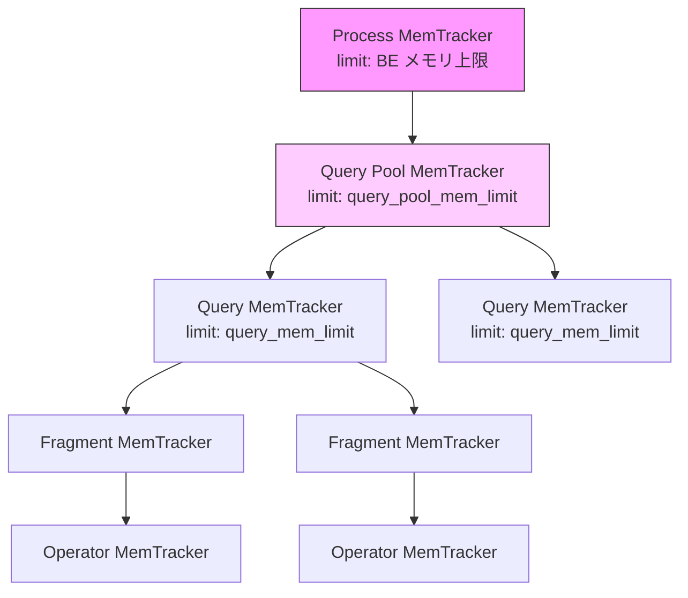
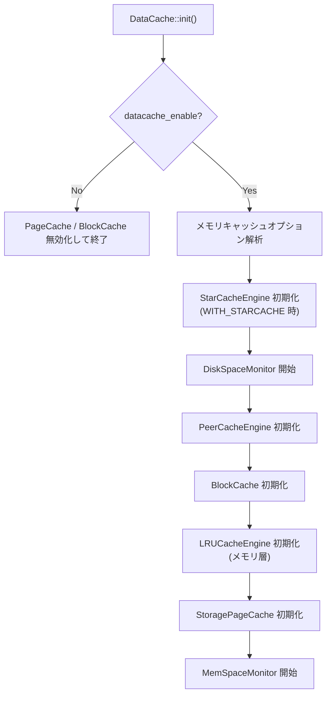
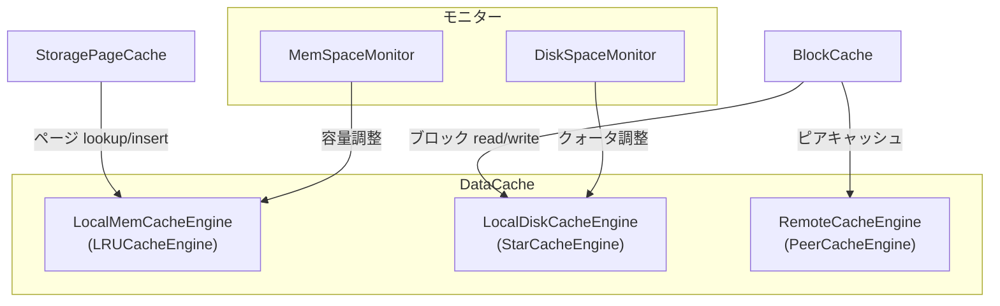
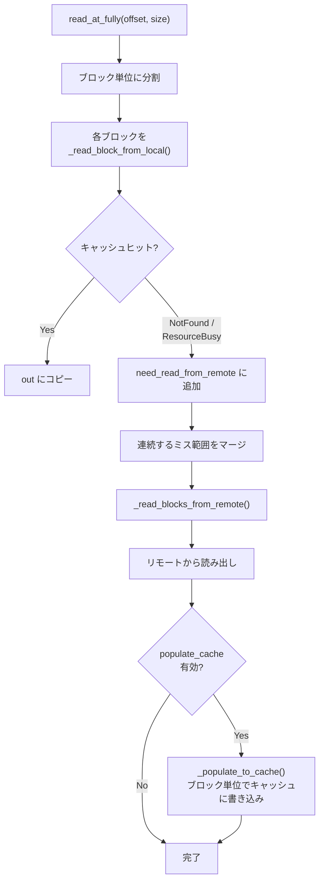

# 第24章 メモリ管理とデータキャッシュ

> **本章で読むソース**
>
> - [`be/src/runtime/mem_tracker.h`](https://github.com/StarRocks/starrocks/blob/4.1.1/be/src/runtime/mem_tracker.h)
> - [`be/src/runtime/mem_tracker.cpp`](https://github.com/StarRocks/starrocks/blob/4.1.1/be/src/runtime/mem_tracker.cpp)
> - [`be/src/runtime/mem_pool.h`](https://github.com/StarRocks/starrocks/blob/4.1.1/be/src/runtime/mem_pool.h)
> - [`be/src/runtime/mem_pool.cpp`](https://github.com/StarRocks/starrocks/blob/4.1.1/be/src/runtime/mem_pool.cpp)
> - [`be/src/runtime/current_thread.h`](https://github.com/StarRocks/starrocks/blob/4.1.1/be/src/runtime/current_thread.h)
> - [`be/src/service/mem_hook.cpp`](https://github.com/StarRocks/starrocks/blob/4.1.1/be/src/service/mem_hook.cpp)
> - [`be/src/cache/datacache.h`](https://github.com/StarRocks/starrocks/blob/4.1.1/be/src/cache/datacache.h)
> - [`be/src/cache/datacache.cpp`](https://github.com/StarRocks/starrocks/blob/4.1.1/be/src/cache/datacache.cpp)
> - [`be/src/cache/mem_cache/page_cache.h`](https://github.com/StarRocks/starrocks/blob/4.1.1/be/src/cache/mem_cache/page_cache.h)
> - [`be/src/cache/mem_cache/local_mem_cache_engine.h`](https://github.com/StarRocks/starrocks/blob/4.1.1/be/src/cache/mem_cache/local_mem_cache_engine.h)
> - [`be/src/cache/disk_cache/block_cache.h`](https://github.com/StarRocks/starrocks/blob/4.1.1/be/src/cache/disk_cache/block_cache.h)
> - [`be/src/cache/disk_cache/starcache_engine.h`](https://github.com/StarRocks/starrocks/blob/4.1.1/be/src/cache/disk_cache/starcache_engine.h)
> - [`be/src/cache/disk_space_monitor.h`](https://github.com/StarRocks/starrocks/blob/4.1.1/be/src/cache/disk_space_monitor.h)
> - [`be/src/cache/mem_space_monitor.h`](https://github.com/StarRocks/starrocks/blob/4.1.1/be/src/cache/mem_space_monitor.h)
> - [`be/src/io/cache_input_stream.h`](https://github.com/StarRocks/starrocks/blob/4.1.1/be/src/io/cache_input_stream.h)
> - [`be/src/io/cache_input_stream.cpp`](https://github.com/StarRocks/starrocks/blob/4.1.1/be/src/io/cache_input_stream.cpp)

## この章の狙い

BE プロセスは、クエリ実行、Compaction、メタデータ管理など多種のワークロードを1プロセスで並行処理する。
メモリ使用量を制御できなければ OOM でプロセスが落ち、全クエリが巻き添えになる。
一方、リモートストレージ(S3 等)からの読み出しは高レイテンシであるため、頻繁にアクセスするデータをローカルにキャッシュしたい。
本章では、この2つの要求を支える仕組みとして、MemTracker による階層的メモリ追跡、MemPool によるアリーナ割り当て、jemalloc フック、そして DataCache の2階層キャッシュ設計を読む。

## 前提

StarRocks の BE は C++ で実装されており、メモリアロケーターとして jemalloc を使用する。
プロセス全体のメモリ使用量はオペレーティングシステムから見ると単一の仮想メモリ空間だが、内部的にはクエリごと、オペレーターごとにメモリの消費量を追跡し、制限を超えた時点でクエリを中断する仕組みを備えている。
ストレージ層については、第17章(Segment ファイルフォーマット)で読んだページ構造と、Lake モードでのリモートストレージアクセスの理解が前提となる。

## MemTracker の階層構造

### 設計の意図

クエリ実行中のメモリ消費を正確に追跡するには、「誰がどれだけ使っているか」を階層的に把握する必要がある。
**MemTracker** は、プロセスからクエリ、さらにオペレーターへと木構造をなすメモリ追跡器である。
子の消費量は自動的に祖先に伝搬する。

MemTracker のコメントがこの階層を説明している。

[`be/src/runtime/mem_tracker.h` L54-L61](https://github.com/StarRocks/starrocks/blob/4.1.1/be/src/runtime/mem_tracker.h#L54-L61)

```cpp
/// A MemTracker tracks memory consumption; it contains an optional limit
/// and can be arranged into a tree structure such that the consumption tracked
/// by a MemTracker is also tracked by its ancestors.
///
/// We use a five-level hierarchy of mem trackers: process, pool, query, fragment
/// instance. Specific parts of the fragment (exec nodes, sinks, etc) will add a
/// fifth level when they are initialized.

```

### 型分類

MemTracker は `MemTrackerType` 列挙で用途別に分類される。
30 種類以上の型が定義されており、クエリ(`QUERY`)、Compaction(`COMPACTION`)、ページキャッシュ(`PAGE_CACHE`)、データキャッシュ(`DATACACHE`)など、BE プロセスの主要なメモリ消費源ごとに型を持つ。

[`be/src/runtime/mem_tracker.h` L81-L122](https://github.com/StarRocks/starrocks/blob/4.1.1/be/src/runtime/mem_tracker.h#L81-L122)

```cpp
enum class MemTrackerType {
    NO_SET,
    PROCESS,
    QUERY,
    QUERY_POOL,
    LOAD,
    // ... (中略) ...
    PAGE_CACHE,
    JIT_CACHE,
    UPDATE,
    CLONE,
    DATACACHE,
    REPLICATION,
    // ... (中略) ...
};

```

実装ファイルではこれらの型からラベル文字列への対応が静的テーブルで保持され、エラーメッセージやメトリクスの表示に使われる。

[`be/src/runtime/mem_tracker.cpp` L48-L82](https://github.com/StarRocks/starrocks/blob/4.1.1/be/src/runtime/mem_tracker.cpp#L48-L82)

```cpp
static std::vector<std::pair<MemTrackerType, std::string>> s_mem_types = {
        {MemTrackerType::PROCESS, "process"},
        {MemTrackerType::QUERY_POOL, "query_pool"},
        {MemTrackerType::LOAD, "load"},
        // ... (中略) ...
        {MemTrackerType::DATACACHE, "datacache"},
        // ... (中略) ...
};

```

### 祖先チェーンの構築

コンストラクターで `parent` を受け取ると、自身を親の子リストに登録し、レベルを親の +1 に設定する。
`Init()` で自身から根に向かって祖先を走査し、`_all_trackers` と `_limit_trackers` の2つのベクターを構築する。

[`be/src/runtime/mem_tracker.cpp` L183-L194](https://github.com/StarRocks/starrocks/blob/4.1.1/be/src/runtime/mem_tracker.cpp#L183-L194)

```cpp
void MemTracker::Init() {
    DCHECK_GE(_limit, -1);
    // populate _all_trackers and _limit_trackers
    MemTracker* tracker = this;
    while (tracker != nullptr) {
        _all_trackers.push_back(tracker);
        if (tracker->has_limit()) _limit_trackers.push_back(tracker);
        tracker = tracker->_parent;
    }
    DCHECK_GT(_all_trackers.size(), 0);
    DCHECK_EQ(_all_trackers[0], this);
}

```

`_all_trackers` は自身(インデックス0)から根(末尾)への順序で格納される。
`_limit_trackers` は制限値(`_limit >= 0`)を持つ祖先だけを集めたサブセットである。

### consume と release

`consume()` は自身と全祖先の消費量カウンターを加算する。
`release()` は減算する。

[`be/src/runtime/mem_tracker.h` L211-L218](https://github.com/StarRocks/starrocks/blob/4.1.1/be/src/runtime/mem_tracker.h#L211-L218)

```cpp
void consume(int64_t bytes) {
    if (bytes == 0) {
        return;
    }
    for (auto* tracker : _all_trackers) {
        tracker->_consumption->add(bytes);
    }
}

```

### try_consume: 制限チェック付き割り当て

`try_consume()` は、根から葉に向かって各祖先が制限を超えないかチェックしながら加算する。
途中で1つでも制限を超える祖先があれば、それまでに加算した分をロールバックして、超過した MemTracker を返す。

[`be/src/runtime/mem_tracker.h` L241-L265](https://github.com/StarRocks/starrocks/blob/4.1.1/be/src/runtime/mem_tracker.h#L241-L265)

```cpp
WARN_UNUSED_RESULT
MemTracker* try_consume(int64_t bytes) {
    if (UNLIKELY(bytes <= 0)) return nullptr;
    int64_t i;
    // Walk the tracker tree top-down.
    for (i = _all_trackers.size() - 1; i >= 0; --i) {
        MemTracker* tracker = _all_trackers[i];
        const int64_t limit = tracker->limit();
        if (limit < 0) {
            tracker->_consumption->add(bytes); // No limit at this tracker.
        } else {
            if (LIKELY(tracker->_consumption->try_add(bytes, limit))) {
                continue;
            } else {
                // Failed for this mem tracker. Roll back the ones that succeeded.
                for (int64_t j = _all_trackers.size() - 1; j > i; --j) {
                    _all_trackers[j]->_consumption->add(-bytes);
                }
                return tracker;
            }
        }
    }
    // Everyone succeeded, return.
    DCHECK_EQ(i, -1);
    return nullptr;
}

```

走査の方向がポイントである。
`_all_trackers` はインデックス 0 が自身、末尾が根だから、`size() - 1` から 0 へ降りる走査は「根から葉」の順序になる。
根(プロセス全体)の制限を先にチェックすることで、プロセス全体がメモリ不足の場合に早期に棄却できる。

### メモリ超過時のエラーメッセージ

制限超過が検出されると `err_msg()` が型ごとに対処法を含むメッセージを生成する。
`QUERY` 型なら `query_mem_limit` の変更を案内し、`RESOURCE_GROUP` 型ならその Resource Group の `mem_limit` の変更を案内する。

[`be/src/runtime/mem_tracker.cpp` L250-L300](https://github.com/StarRocks/starrocks/blob/4.1.1/be/src/runtime/mem_tracker.cpp#L250-L300)

```cpp
std::string MemTracker::err_msg(const std::string& msg, RuntimeState* state) const {
    std::stringstream str;
    str << "Memory of " << label() << " exceed limit. " << msg << " ";
    // ... (中略) ...
    switch (type()) {
    case MemTrackerType::QUERY:
        str << "Mem usage has exceed the limit of single query, You can change the limit by "
               "set session variable query_mem_limit.";
        break;
    case MemTrackerType::PROCESS:
        str << "Mem usage has exceed the limit of BE";
        break;
    // ... (中略) ...
    }
    return str.str();
}

```

MemTracker の階層と制限チェックの関係を図に示す。



`consume()` を呼ぶと、オペレーターから根(Process)まで全祖先のカウンターが更新される。
`try_consume()` は逆に、根から順に制限チェックしながら加算していく。

## TLS バッチングによる追跡オーバーヘッドの削減

### 問題

`consume()` や `release()` は祖先チェーン全体のアトミックカウンターを毎回更新する。
`malloc` / `free` のたびにこの処理を実行すると、アトミック操作のコストが累積して性能に影響する。

### MemCacheManager によるバッチ処理

**CurrentThread** クラスの内部クラス `MemCacheManager` が、スレッドローカルにメモリ消費量を一定量までバッファリングし、閾値(2 MB)を超えた時点でまとめて MemTracker に反映する。

[`be/src/runtime/current_thread.h` L93-L101](https://github.com/StarRocks/starrocks/blob/4.1.1/be/src/runtime/current_thread.h#L93-L101)

```cpp
void consume(int64_t size) {
    size = _consume_from_reserved(size);
    _cache_size += size;
    _allocated_cache_size += size;
    _total_consumed_bytes += size;
    if (_cache_size >= BATCH_SIZE) {
        commit(false);
    }
}

```

`BATCH_SIZE` は 2 MB である。

[`be/src/runtime/current_thread.h` L238](https://github.com/StarRocks/starrocks/blob/4.1.1/be/src/runtime/current_thread.h#L238)

```cpp
const static int64_t BATCH_SIZE = 2 * 1024 * 1024;

```

`commit()` が呼ばれると、蓄積された差分が `MemTracker::consume()` に渡される。
コンテキスト切り替え(別のクエリへの切り替え)時には `commit(true)` が呼ばれ、割り当て量と解放量のカウンターもフラッシュされる。

[`be/src/runtime/current_thread.h` L199-L214](https://github.com/StarRocks/starrocks/blob/4.1.1/be/src/runtime/current_thread.h#L199-L214)

```cpp
void commit(bool is_ctx_shift) {
    MemTracker* cur_tracker = CurrentThread::mem_tracker();
    if (cur_tracker != nullptr) {
        cur_tracker->consume(_cache_size);
    }
    _cache_size = 0;
    if (is_ctx_shift) {
        // Flush all cached info
        if (cur_tracker != nullptr) {
            cur_tracker->update_allocation(_allocated_cache_size);
            cur_tracker->update_deallocation(_deallocated_cache_size);
        }
        _allocated_cache_size = 0;
        _deallocated_cache_size = 0;
    }
}

```

この設計により、個々の `malloc` / `free` ではスレッドローカル変数の加減算だけで済み、アトミック操作は 2 MB ごとに1回に削減される。

## jemalloc フック(mem_hook)

### malloc / free の置き換え

StarRocks は `mem_hook.cpp` で標準ライブラリの `malloc` / `free` 等を自前の関数に置き換えている。
`__attribute__((alias))` を使い、`malloc` シンボルを `my_malloc` に束縛する。

[`be/src/service/mem_hook.cpp` L423-L433](https://github.com/StarRocks/starrocks/blob/4.1.1/be/src/service/mem_hook.cpp#L423-L433)

```cpp
void* malloc(size_t size) __THROW ALIAS(my_malloc);
void free(void* p) __THROW ALIAS(my_free);
void* realloc(void* p, size_t size) __THROW ALIAS(my_realloc);
void* calloc(size_t n, size_t size) __THROW ALIAS(my_calloc);
void cfree(void* ptr) __THROW ALIAS(my_cfree);
void* memalign(size_t align, size_t size) __THROW ALIAS(my_memalign);
void* aligned_alloc(size_t align, size_t size) __THROW ALIAS(my_aligned_alloc);
void* valloc(size_t size) __THROW ALIAS(my_valloc);
void* pvalloc(size_t size) __THROW ALIAS(my_pvalloc);
int posix_memalign(void** r, size_t a, size_t s) __THROW ALIAS(my_posix_memalign);
size_t malloc_usable_size(void* ptr) __THROW ALIAS(my_malloc_usebale_size);

```

### my_malloc の処理の流れ

`my_malloc` は jemalloc の `je_malloc` を呼び出す前後で、MemTracker への通知を行う。
2つのパスがある。

[`be/src/service/mem_hook.cpp` L155-L186](https://github.com/StarRocks/starrocks/blob/4.1.1/be/src/service/mem_hook.cpp#L155-L186)

```cpp
void* my_malloc(size_t size) __THROW {
    STARROCKS_REPORT_LARGE_MEM_ALLOC(size);
    int64_t alloc_size = STARROCKS_NALLOX(size, 0);
    SET_DELTA_MEMORY(alloc_size);
    if (IS_BAD_ALLOC_CATCHED()) {
        // NOTE: do NOT call `tc_malloc_size` here, ...
        TRY_MEM_CONSUME(alloc_size, nullptr);
        void* ptr = STARROCKS_MALLOC(size);
        if (UNLIKELY(ptr == nullptr)) {
            SET_EXCEED_MEM_TRACKER();
            MEMORY_RELEASE_SIZE(alloc_size);
            RESET_DELTA_MEMORY();
        }
        return ptr;
    } else {
        if (UNLIKELY(block_large_memory_alloc(size))) {
            return nullptr;
        }
        void* ptr = STARROCKS_MALLOC(size);
        if (LIKELY(ptr != nullptr)) {
            MEMORY_CONSUME_SIZE(alloc_size);
        } else {
            RESET_DELTA_MEMORY();
        }
        return ptr;
    }
}

```

`IS_BAD_ALLOC_CATCHED()` が true のパスでは、メモリを確保する前に `TRY_MEM_CONSUME` で制限チェックを行い、制限超過ならメモリ確保自体を行わず `nullptr` を返す。
呼び出し側はこの `nullptr` を受けて `std::bad_alloc` を投げ、`TRY_CATCH_BAD_ALLOC` マクロで捕捉して `Status::MemoryLimitExceeded` に変換する。

false のパスでは、先にメモリを確保してから `MEMORY_CONSUME_SIZE` で事後的に通知する。
確保後に通知するため、一時的に制限超過になる可能性がある。
この違いは、全箇所で `bad_alloc` を捕捉する準備がないコードパスでの安全弁として機能する。

### 大規模割り当ての警告

1 GB を超える割り当ては `report_large_memory_alloc()` で警告ログとスタックトレースを出力する。

[`be/src/service/mem_hook.cpp` L109-L126](https://github.com/StarRocks/starrocks/blob/4.1.1/be/src/service/mem_hook.cpp#L109-L126)

```cpp
const size_t large_memory_alloc_report_threshold = 1073741824;
inline thread_local bool skip_report = false;
inline void report_large_memory_alloc(size_t size) {
    if (size > large_memory_alloc_report_threshold && !skip_report) {
        skip_report = true; // to avoid recursive output log
        try {
            auto qid = starrocks::CurrentThread::current().query_id();
            // ... (中略) ...
            LOG(WARNING) << "large memory alloc, query_id:" << print_id(qid)
                         << " acquire:" << size << " bytes, ...";
        } catch (...) {
        }
        skip_report = false;
    }
}

```

`skip_report` フラグで、ログ出力自体がメモリ割り当てを引き起こす再帰を防止している。

## MemPool(アリーナアロケーター)

### 設計

**MemPool** は、小さな割り当てを繰り返すオペレーター(文字列処理、ハッシュテーブル構築等)のために、チャンク単位のアリーナ割り当てを提供する。
個々の `free` は行わず、`clear()` で全領域を一括開放する。

チャンクサイズは初期値 4 KB から割り当てごとに倍増し、上限 512 KB で打ち止めになる。

[`be/src/runtime/mem_pool.h` L157-L161](https://github.com/StarRocks/starrocks/blob/4.1.1/be/src/runtime/mem_pool.h#L157-L161)

```cpp
static const int INITIAL_CHUNK_SIZE = 4 * 1024;

/// The maximum size of chunk that should be allocated. Allocations larger than this
/// size will get their own individual chunk.
static const int MAX_CHUNK_SIZE = 512 * 1024;

```

### 割り当てのホットパス

`allocate()` テンプレート関数は、現在のチャンクに余裕があればアライメントを調整してポインターを返す。
チャンクが足りない場合に限り `find_chunk()` を呼ぶ。

[`be/src/runtime/mem_pool.h` L196-L214](https://github.com/StarRocks/starrocks/blob/4.1.1/be/src/runtime/mem_pool.h#L196-L214)

```cpp
template <bool CHECK_LIMIT_FIRST>
uint8_t* ALWAYS_INLINE allocate(int64_t size, int alignment, int reserve) {
    DCHECK_GE(size, 0);
    if (UNLIKELY(size == 0)) return reinterpret_cast<uint8_t*>(&k_zero_length_region_);

    if (current_chunk_idx_ != -1) {
        ChunkInfo& info = chunks_[current_chunk_idx_];
        int64_t aligned_allocated_bytes = BitUtil::RoundUpToPowerOf2(info.allocated_bytes, alignment);
        if (aligned_allocated_bytes + size + reserve <= info.chunk.size) {
            int64_t padding = aligned_allocated_bytes - info.allocated_bytes;
            uint8_t* result = info.chunk.data + aligned_allocated_bytes;
            // ... (中略) ...
            info.allocated_bytes += padding + size;
            total_allocated_bytes_ += padding + size;
            return result;
        }
    }
    // ... find_chunk ...
}

```

`ALWAYS_INLINE` でインライン化され、チャンク内に余裕がある通常ケースではチャンク探索のオーバーヘッドが生じない。

### チャンクの倍増戦略

`find_chunk()` は空きチャンクの再利用を試み、なければ新規チャンクを割り当てる。
新規チャンクのサイズは `next_chunk_size_` で管理され、割り当て成功後に2倍に更新される。

[`be/src/runtime/mem_pool.cpp` L150-L153](https://github.com/StarRocks/starrocks/blob/4.1.1/be/src/runtime/mem_pool.cpp#L150-L153)

```cpp
total_reserved_bytes_ += chunk_size;
// Don't increment the chunk size until the allocation succeeds: if an attempted
// large allocation fails we don't want to increase the chunk size further.
next_chunk_size_ = static_cast<int>(std::min<int64_t>(chunk_size * 2, MAX_CHUNK_SIZE));

```

この倍増は割り当て成功後にのみ行われる。
失敗した場合にチャンクサイズを増やすと、次の割り当てでさらに大きなチャンクを要求して失敗する悪循環に陥るためである。

## StoragePageCache

### 役割

**StoragePageCache** は Segment ファイルのページ(データページ、インデックスページ等)をメモリ上にキャッシュする。
同じページへの繰り返しアクセスではディスク IO を省略できる。

実装は `LocalMemCacheEngine` へのラッパーである。
`DataCache` のシングルトンから `LocalMemCacheEngine` のポインターを受け取り、操作を委譲する。

[`be/src/cache/mem_cache/page_cache.h` L67-L74](https://github.com/StarRocks/starrocks/blob/4.1.1/be/src/cache/mem_cache/page_cache.h#L67-L74)

```cpp
static StoragePageCache* instance() { return DataCache::GetInstance()->page_cache(); }

StoragePageCache(LocalMemCacheEngine* cache_engine) : _cache(cache_engine), _initialized(true) {}

void init(LocalMemCacheEngine* cache_engine) {
    _cache = cache_engine;
    _initialized.store(true, std::memory_order_relaxed);
}

```

### PageCacheHandle による RAII

キャッシュからルックアップしたエントリは `PageCacheHandle` で保持される。
ハンドルが生存している間はキャッシュエントリが evict されない(ピン留め)。
デストラクターで `release()` を呼び、ピンを外す。

[`be/src/cache/mem_cache/page_cache.h` L140-L145](https://github.com/StarRocks/starrocks/blob/4.1.1/be/src/cache/mem_cache/page_cache.h#L140-L145)

```cpp
~PageCacheHandle() {
    if (_handle != nullptr) {
        StoragePageCacheMetrics::released_page_handle_count++;
        _cache->release(_handle);
    }
}

```

## DataCache: 統合2階層キャッシュ

### 全体構成

**DataCache** は BE プロセスのキャッシュ基盤を統合するシングルトンである。
メモリ層(`LocalMemCacheEngine`)、ディスク層(`LocalDiskCacheEngine`)、リモート層(`RemoteCacheEngine`)の3層を管理する。
そのうえに、ページキャッシュ(`StoragePageCache`)とブロックキャッシュ(`BlockCache`)の2つの利用者向けインターフェースを提供する。

[`be/src/cache/datacache.h` L34-L88](https://github.com/StarRocks/starrocks/blob/4.1.1/be/src/cache/datacache.h#L34-L88)

```cpp
class DataCache {
public:
    static DataCache* GetInstance();

    Status init(const std::vector<StorePath>& store_paths);
    void destroy();

    // ... (中略) ...

    LocalMemCacheEngine* local_mem_cache() { return _local_mem_cache.get(); }
    LocalDiskCacheEngine* local_disk_cache() { return _local_disk_cache.get(); }
    BlockCache* block_cache() const { return _block_cache.get(); }
    StoragePageCache* page_cache() const { return _page_cache.get(); }

private:
    // cache engine
    std::shared_ptr<LocalMemCacheEngine> _local_mem_cache;
    std::shared_ptr<LocalDiskCacheEngine> _local_disk_cache;
    std::shared_ptr<RemoteCacheEngine> _remote_cache;

    std::shared_ptr<BlockCache> _block_cache;
    std::shared_ptr<StoragePageCache> _page_cache;

    std::shared_ptr<DiskSpaceMonitor> _disk_space_monitor;
    std::shared_ptr<MemSpaceMonitor> _mem_space_monitor;
};

```

### 初期化フロー

`DataCache::init()` は以下の順序でコンポーネントを初期化する。

[`be/src/cache/datacache.cpp` L41-L76](https://github.com/StarRocks/starrocks/blob/4.1.1/be/src/cache/datacache.cpp#L41-L76)

```cpp
Status DataCache::init(const std::vector<StorePath>& store_paths) {
    _global_env = GlobalEnv::GetInstance();
    _store_paths = store_paths;
    _block_cache = std::make_shared<BlockCache>();
    _page_cache = std::make_shared<StoragePageCache>();

    if (!config::datacache_enable) {
        config::disable_storage_page_cache = true;
        config::block_cache_enable = false;
        return Status::OK();
    }

    ASSIGN_OR_RETURN(auto mem_cache_options, _init_mem_cache_options());

#if defined(WITH_STARCACHE)
    ASSIGN_OR_RETURN(auto disk_cache_options, _init_disk_cache_options());
    RETURN_IF_ERROR(_init_starcache_engine(&disk_cache_options));
    // ... (中略) ...
#endif

    RETURN_IF_ERROR(_init_lrucache_engine(mem_cache_options));
    RETURN_IF_ERROR(_init_page_cache());

    _mem_space_monitor = std::make_shared<MemSpaceMonitor>(this);
    _mem_space_monitor->start();

    return Status::OK();
}

```

初期化の流れを図に示す。



`datacache_enable` が false の場合、ページキャッシュもブロックキャッシュも無効化される。

### メモリ層: LRUCacheEngine

メモリ層の `LRUCacheEngine` は `ShardedLRUCache` をラップし、LRU 方式でエントリを管理する。
StoragePageCache はこのエンジンを通じてページをキャッシュする。

[`be/src/cache/mem_cache/lrucache_engine.h` L23-L73](https://github.com/StarRocks/starrocks/blob/4.1.1/be/src/cache/mem_cache/lrucache_engine.h#L23-L73)

```cpp
class LRUCacheEngine final : public LocalMemCacheEngine {
public:
    // ... (中略) ...
    bool has_mem_cache() const override { return _cache->get_capacity() > 0; }

private:
    bool _check_write(size_t charge, const MemCacheWriteOptions& options) const;
    std::atomic<bool> _initialized = false;
    std::unique_ptr<ShardedLRUCache> _cache;
};

```

書き込み時には `MemCacheWriteOptions` で優先度と evict 確率を指定できる。
優先度が 0 より大きいエントリ(in-memory テーブルのページなど)は evict されにくくなる。

[`be/src/cache/mem_cache/local_mem_cache_engine.h` L24-L36](https://github.com/StarRocks/starrocks/blob/4.1.1/be/src/cache/mem_cache/local_mem_cache_engine.h#L24-L36)

```cpp
struct MemCacheWriteOptions {
    // The priority of the cache object, only support 0 and 1 now.
    int8_t priority = 0;

    // The probability to evict other items if the cache space is full, ...
    // It is expressed as a percentage. If evict_probability is 10, it means
    // the probability to evict other data is 10%.
    int32_t evict_probability = 100;
};

```

`evict_probability` を 100 未満に設定すると、キャッシュが満杯の場合に確率的に書き込みをスキップする。
頻繁なキャッシュ置換が発生しやすいワークロードでは、この仕組みでスラッシングを緩和できる。

### ディスク層: StarCacheEngine

ディスク層のキャッシュは `StarCacheEngine` が担当する。
StarRocks 独自のキャッシュライブラリである StarCache(`starcache::StarCache`)をラップし、`LocalDiskCacheEngine` インターフェースを実装する。

[`be/src/cache/disk_cache/starcache_engine.h` L37-L89](https://github.com/StarRocks/starrocks/blob/4.1.1/be/src/cache/disk_cache/starcache_engine.h#L37-L89)

```cpp
class StarCacheEngine : public LocalDiskCacheEngine {
public:
    // ... (中略) ...
    Status write(const std::string& key, const IOBuffer& buffer,
                 DiskCacheWriteOptions* options) override;
    Status read(const std::string& key, size_t off, size_t size,
                IOBuffer* buffer, DiskCacheReadOptions* options) override;
    // ... (中略) ...
    bool has_disk_cache() const override {
        return _disk_quota.load(std::memory_order_relaxed) > 0;
    }

private:
    std::shared_ptr<starcache::StarCache> _cache;
    std::unique_ptr<starcache::TimeBasedCacheAdaptor> _cache_adaptor;
    std::atomic<size_t> _disk_quota = 0;
};

```

`TimeBasedCacheAdaptor` は TTL(有効期限)付きのキャッシュアクセスを提供する。
`DiskCacheWriteOptions` では優先度、TTL、非同期書き込み(`async`)、ゼロコピー(`allow_zero_copy`)など細かな制御が可能である。

[`be/src/cache/disk_cache/local_disk_cache_engine.h` L47-L70](https://github.com/StarRocks/starrocks/blob/4.1.1/be/src/cache/disk_cache/local_disk_cache_engine.h#L47-L70)

```cpp
struct DiskCacheWriteOptions {
    int8_t priority = 0;
    uint64_t ttl_seconds = 0;
    bool overwrite = false;
    bool async = false;
    bool allow_zero_copy = false;
    // ... (中略) ...
    int8_t frequency = 0;

    struct Stats {
        int64_t write_mem_bytes = 0;
        int64_t write_disk_bytes = 0;
    } stats;
};

```

`frequency` フィールドは多段 LRU の配置先制御に使われる。
`frequency` が 0 ならコールドセグメント、0 より大きければウォームセグメントに直接配置される。

### BlockCache: ブロック単位のキャッシュアクセス

**BlockCache** はディスク層とリモート層を束ね、固定サイズのブロック単位で読み書きする API を提供する。
Lake モードでリモートストレージからデータを読み込む際に使われる。

[`be/src/cache/disk_cache/block_cache.h` L29-L91](https://github.com/StarRocks/starrocks/blob/4.1.1/be/src/cache/disk_cache/block_cache.h#L29-L91)

```cpp
class BlockCache {
public:
    // ... (中略) ...
    Status write(const CacheKey& cache_key, off_t offset,
                 const IOBuffer& buffer, DiskCacheWriteOptions* options = nullptr);
    Status read(const CacheKey& cache_key, off_t offset, size_t size,
                IOBuffer* buffer, DiskCacheReadOptions* options = nullptr);
    // ... (中略) ...
    size_t block_size() const { return _block_size; }

private:
    size_t _block_size = 0;
    std::shared_ptr<LocalDiskCacheEngine> _local_cache;
    std::shared_ptr<RemoteCacheEngine> _remote_cache;
};

```

2階層キャッシュの構成を図に示す。



StoragePageCache はメモリ層のみを使い、BlockCache はディスク層とリモート層を使う。
この分離により、ローカルテーブルのページキャッシュとリモートストレージのブロックキャッシュが互いに干渉しない。

## DiskSpaceMonitor と MemSpaceMonitor

### DiskSpaceMonitor

**DiskSpaceMonitor** はバックグラウンドスレッドで定期的にディスク使用量を確認し、キャッシュのディスククォータを動的に調整する。

[`be/src/cache/disk_space_monitor.h` L119-L157](https://github.com/StarRocks/starrocks/blob/4.1.1/be/src/cache/disk_space_monitor.h#L119-L157)

```cpp
class DiskSpaceMonitor {
public:
    DiskSpaceMonitor(LocalDiskCacheEngine* cache);
    // ... (中略) ...
    void start();
    void stop();

private:
    void _adjust_datacache_callback();
    bool _adjust_spaces_by_disk_usage();
    void _update_cache_stats();
    Status _update_cache_quota(const std::vector<DirSpace>& dir_spaces);

    std::vector<DiskSpace> _disk_spaces;
    // ... (中略) ...
    LocalDiskCacheEngine* _cache = nullptr;
};

```

`DiskSpace` はディスクごとのキャッシュ容量管理を行う。
`DiskOptions` に low/safe/high の3段階の閾値が設定され、ディスク空き容量に応じてキャッシュクォータを拡縮する。

[`be/src/cache/disk_space_monitor.h` L53-L63](https://github.com/StarRocks/starrocks/blob/4.1.1/be/src/cache/disk_space_monitor.h#L53-L63)

```cpp
struct DiskOptions {
    int64_t cache_lower_limit = 0;
    int64_t cache_upper_limit = 0;

    int64_t low_level_size = 0;
    int64_t safe_level_size = 0;
    int64_t high_level_size = 0;

    int64_t adjust_interval_s = 0;
    int64_t idle_for_expansion_s = 0;
};

```

クォータの調整単位は 10 GB にアラインされる。
これは StarCache の内部ファイルサイズと一致させることで、端数ファイルの処理を減らすためである。

[`be/src/cache/disk_space_monitor.h` L83-L84](https://github.com/StarRocks/starrocks/blob/4.1.1/be/src/cache/disk_space_monitor.h#L83-L84)

```cpp
// We set it to 10G to keep consistent with underlying cache file size,
// which can help reduce processing the special tail files.
const static size_t kQuotaAlignUnit;

```

### MemSpaceMonitor

**MemSpaceMonitor** はメモリキャッシュの容量を監視し、プロセスのメモリ使用量が逼迫した場合にメモリキャッシュのクォータを縮小する。

[`be/src/cache/mem_space_monitor.h` L22-L37](https://github.com/StarRocks/starrocks/blob/4.1.1/be/src/cache/mem_space_monitor.h#L22-L37)

```cpp
class MemSpaceMonitor {
public:
    MemSpaceMonitor(DataCache* datacache) : _datacache(datacache) {}

    void start();
    void stop();

private:
    void _adjust_datacache_callback();
    void _evict_datacache(int64_t bytes_to_dec);

    DataCache* _datacache = nullptr;
    std::thread _adjust_datacache_thread;
    std::atomic<bool> _stopped = false;
};

```

メモリ圧迫時には `_evict_datacache()` でキャッシュエントリを能動的に追い出す。
`DataCache::adjust_mem_capacity()` がこのモニターからの要求を受けて、メモリ層のクォータを縮小する。

[`be/src/cache/datacache.cpp` L100-L111](https://github.com/StarRocks/starrocks/blob/4.1.1/be/src/cache/datacache.cpp#L100-L111)

```cpp
bool DataCache::adjust_mem_capacity(int64_t delta, size_t min_capacity) {
    if (_local_mem_cache != nullptr) {
        Status st = _local_mem_cache->adjust_mem_quota(delta, min_capacity);
        if (st.ok()) {
            return true;
        } else {
            return false;
        }
    } else {
        return false;
    }
}

```

## CacheInputStream によるキャッシュ統合 IO

### 設計

**CacheInputStream** は `SharedBufferedInputStream` をラップし、読み出し時に BlockCache を透過的に利用する。
リモートストレージからのデータ読み出しを、ブロック単位でキャッシュに格納し、次回以降はキャッシュから返す。

コンストラクターでファイル名からハッシュベースのキャッシュキーを生成する。
キーは 12 バイトで、ファイル名の 64bit ハッシュ値と更新時刻(または代替としてファイルサイズ)の 32bit を連結したものである。

[`be/src/io/cache_input_stream.cpp` L36-L66](https://github.com/StarRocks/starrocks/blob/4.1.1/be/src/io/cache_input_stream.cpp#L36-L66)

```cpp
CacheInputStream::CacheInputStream(const std::shared_ptr<SharedBufferedInputStream>& stream,
                                   const std::string& filename, size_t size,
                                   int64_t modification_time)
        : SeekableInputStreamWrapper(stream.get(), kDontTakeOwnership),
          _filename(filename),
          _sb_stream(stream),
          _offset(0),
          _size(size) {
    _cache = BlockCache::instance();
    _block_size = _cache->block_size();

    _cache_key.resize(12);
    char* data = _cache_key.data();
    uint64_t hash_value = HashUtil::hash64(filename.data(), filename.size(), 0);
    memcpy(data, &hash_value, sizeof(hash_value));
    if (modification_time > 0) {
        uint32_t mtime_s = (modification_time >> 9) & 0x00000000FFFFFFFF;
        memcpy(data + 8, &mtime_s, sizeof(mtime_s));
    } else {
        uint32_t file_size = _size;
        memcpy(data + 8, &file_size, sizeof(file_size));
    }
    _buffer_size = 16 * _block_size;
    _buffer.reserve(_buffer_size);
}

```

### read_at_fully の処理フロー

`read_at_fully()` は読み出し範囲をブロックに分割し、各ブロックをまずローカルキャッシュから読む。
キャッシュミスしたブロックを連続する IO 範囲にマージし、リモートストレージからまとめて読み出す。

[`be/src/io/cache_input_stream.cpp` L329-L402](https://github.com/StarRocks/starrocks/blob/4.1.1/be/src/io/cache_input_stream.cpp#L329-L402)

```cpp
Status CacheInputStream::read_at_fully(int64_t offset, void* out, int64_t count) {
    // ... (中略) ...
    for (int64_t i = start_block_id; i <= end_block_id; i++) {
        size_t off = std::max(offset, i * _block_size);
        size_t end = std::min((i + 1) * _block_size, end_offset);
        size_t size = end - off;
        Status st = _read_block_from_local(off, size, p);
        if (st.is_not_found() || st.is_resource_busy()) {
            need_read_from_remote.emplace_back(off, p, size);
        } else if (!st.ok()) {
            return st;
        }
        // ... (中略) ...
    }
    // ... IO 範囲のマージ ...
    for (const auto& io_range : merged_need_read_from_remote) {
        RETURN_IF_ERROR(_read_blocks_from_remote(io_range.offset, io_range.size,
                                                  io_range.write_pointer));
    }
    return Status::OK();
}

```

この処理フローを図に示す。



### キャッシュへの書き戻し(populate)

リモートから読み出したデータは `_populate_to_cache()` でブロック単位にキャッシュへ書き込まれる。
`_already_populated_blocks` セットで同一ライフサイクル内の重複書き込みを防止する。

[`be/src/io/cache_input_stream.cpp` L475-L501](https://github.com/StarRocks/starrocks/blob/4.1.1/be/src/io/cache_input_stream.cpp#L475-L501)

```cpp
void CacheInputStream::_write_cache(int64_t offset, const IOBuffer& iobuf,
                                    DiskCacheWriteOptions* options) {
    DCHECK(offset % _block_size == 0);
    if (_already_populated_blocks.contains(offset / _block_size)) {
        return;
    }

    SCOPED_RAW_TIMER(&_stats.write_block_cache_ns);
    Status r = _cache->write(_cache_key, offset, iobuf, options);
    if (r.ok() || r.is_already_exist()) {
        _already_populated_blocks.emplace(offset / _block_size);
    }
    // ... (中略: 統計更新) ...
}

```

### ピアキャッシュ

ローカルキャッシュでミスした場合、`_can_try_peer_cache()` が true であれば他の BE ノード(ピア)のキャッシュを試す。
ピアキャッシュからの読み出しに成功した場合、そのデータをローカルにも書き戻す。

[`be/src/io/cache_input_stream.cpp` L147-L163](https://github.com/StarRocks/starrocks/blob/4.1.1/be/src/io/cache_input_stream.cpp#L147-L163)

```cpp
} else if (res.is_not_found() && _can_try_peer_cache()) {
    {
        SCOPED_RAW_TIMER(&read_peer_cache_ns);
        res = _read_peer_cache(block_offset, block_size, &block.buffer, &options);
        try_peer_cache = true;
    }
    // ... (中略) ...
    if (res.ok() && _enable_populate_cache) {
        DiskCacheWriteOptions write_options;
        write_options.async = _enable_async_populate_mode;
        // ... (中略) ...
        _write_cache(block_offset, block.buffer, &write_options);
    }
}

```

これにより、同じファイルのブロックが別ノードにキャッシュされていれば、リモートストレージまで読みに行かずに済む。

### 統計情報

`CacheInputStream::Stats` はキャッシュのヒット率を把握するための詳細な統計を記録する。
メモリキャッシュからの読み出しバイト数(`read_mem_cache_bytes`)、ディスクキャッシュからの読み出しバイト数(`read_disk_cache_bytes`)、ピアキャッシュからの読み出しバイト数(`read_peer_cache_bytes`)が区別されている。

[`be/src/io/cache_input_stream.h` L28-L52](https://github.com/StarRocks/starrocks/blob/4.1.1/be/src/io/cache_input_stream.h#L28-L52)

```cpp
struct Stats {
    int64_t read_block_cache_ns = 0;
    int64_t write_block_cache_ns = 0;
    int64_t read_block_cache_count = 0;
    int64_t write_block_cache_count = 0;
    int64_t write_mem_cache_bytes = 0;
    int64_t write_disk_cache_bytes = 0;
    int64_t read_block_cache_bytes = 0;
    int64_t read_mem_cache_bytes = 0;
    int64_t read_disk_cache_bytes = 0;
    int64_t read_peer_cache_bytes = 0;
    // ... (中略) ...
};

```

## 高速化の工夫: DataCache の2階層設計

DataCache の最も特徴的な設計は、メモリ層とディスク層を分離しつつ、それぞれに異なる利用者を割り当てている点である。

StoragePageCache(ローカルテーブルのページキャッシュ)はメモリ層のみを使う。
ページ単位のランダムアクセスが多く、レイテンシが低いメモリキャッシュが適している。

BlockCache(リモートストレージのデータキャッシュ)はディスク層を使う。
リモート IO のレイテンシ(数十ミリ秒)と比較すればローカル SSD のレイテンシ(数百マイクロ秒)は十分に低く、メモリより大容量のキャッシュを確保できる。

ディスク層内部でも、`DiskCacheWriteOptions` の `frequency` フィールドにより、ウォームセグメントとコールドセグメントの2段階で管理される。
頻繁にアクセスされるデータは `frequency > 0` でウォームセグメントに直接配置され、evict されにくくなる。

この設計により、ホットデータ(ローカルテーブルのページ)はメモリに、ウォームデータ(リモートストレージの頻出ブロック)はローカル SSD に、コールドデータ(低頻度アクセスのリモートブロック)はディスクキャッシュのコールドセグメントにと、アクセス頻度に応じた3段階の配置が実現される。

さらに、`MemSpaceMonitor` と `DiskSpaceMonitor` がそれぞれの層のクォータを動的に調整するため、ワークロードの変動にも適応できる。
メモリが逼迫すればメモリキャッシュを縮小し、ディスクに空きがあればディスクキャッシュを自動拡張する。
この動的調整がなければ、運用者が定期的にキャッシュサイズを手動調整する必要がある。

## まとめ

StarRocks の BE は、以下の仕組みでメモリ管理とデータキャッシュを実現している。

- **MemTracker**: プロセスからオペレーターまでの階層的メモリ追跡。`try_consume()` による制限チェックとロールバックで、メモリ超過時にクエリを安全に中断する
- **TLS バッチング**: `MemCacheManager` がスレッドローカルに 2 MB 単位で消費量をバッファリングし、アトミック操作の頻度を削減する
- **jemalloc フック**: `malloc` / `free` を置き換え、全割り当てを MemTracker に自動通知する
- **MemPool**: チャンク倍増のアリーナアロケーターで、小規模割り当ての性能を確保する
- **DataCache**: メモリ層(LRUCacheEngine)、ディスク層(StarCacheEngine)、リモート層(PeerCacheEngine)の3層構成。利用者ごとに適切な層を使い分ける
- **CacheInputStream**: BlockCache を透過的に利用し、リモートストレージからの読み出しをブロック単位でキャッシュする

## 関連する章

- 第17章(Segment ファイルフォーマット): StoragePageCache がキャッシュするページの構造
- 第11章(スキャンオペレーター): スキャン時の MemTracker 連携と CacheInputStream の利用
- 第22章(Resource Group): Resource Group ごとのメモリ制限と MemTracker の関係
