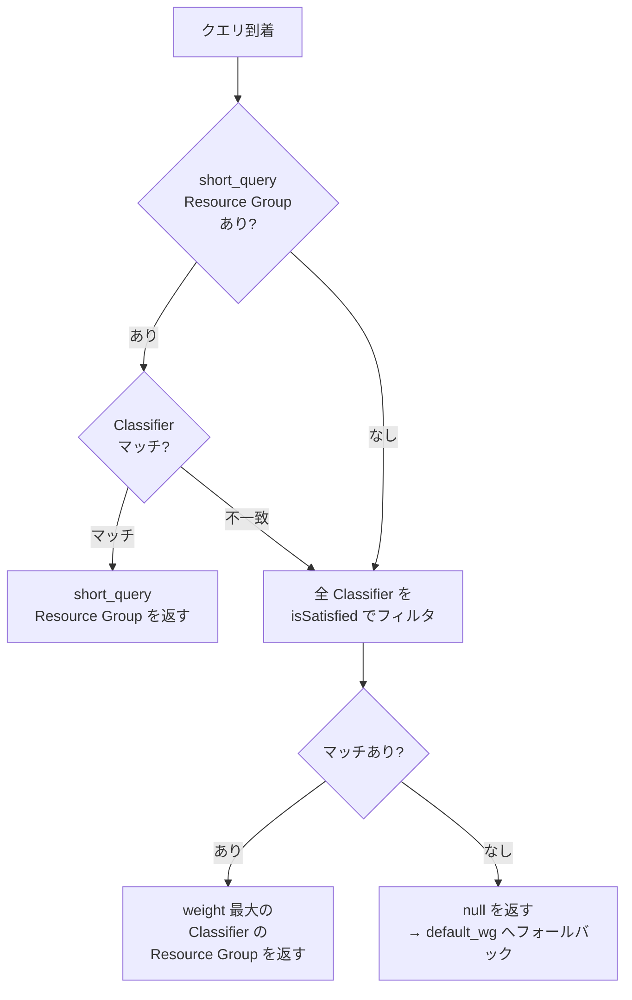
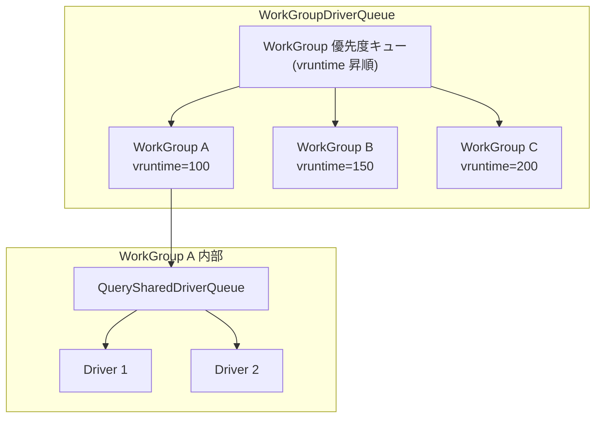
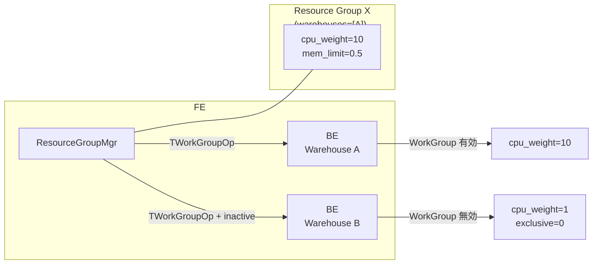

# 第25章 Resource Group と Warehouse

> **本章で読むソース**
>
> - [`fe/fe-core/src/main/java/com/starrocks/catalog/ResourceGroup.java`](https://github.com/StarRocks/starrocks/blob/4.1.1/fe/fe-core/src/main/java/com/starrocks/catalog/ResourceGroup.java)
> - [`fe/fe-core/src/main/java/com/starrocks/catalog/ResourceGroupMgr.java`](https://github.com/StarRocks/starrocks/blob/4.1.1/fe/fe-core/src/main/java/com/starrocks/catalog/ResourceGroupMgr.java)
> - [`fe/fe-core/src/main/java/com/starrocks/catalog/ResourceGroupClassifier.java`](https://github.com/StarRocks/starrocks/blob/4.1.1/fe/fe-core/src/main/java/com/starrocks/catalog/ResourceGroupClassifier.java)
> - [`fe/fe-core/src/main/java/com/starrocks/warehouse/Warehouse.java`](https://github.com/StarRocks/starrocks/blob/4.1.1/fe/fe-core/src/main/java/com/starrocks/warehouse/Warehouse.java)
> - [`fe/fe-core/src/main/java/com/starrocks/server/WarehouseManager.java`](https://github.com/StarRocks/starrocks/blob/4.1.1/fe/fe-core/src/main/java/com/starrocks/server/WarehouseManager.java)
> - [`be/src/exec/workgroup/work_group.h`](https://github.com/StarRocks/starrocks/blob/4.1.1/be/src/exec/workgroup/work_group.h)
> - [`be/src/exec/workgroup/work_group.cpp`](https://github.com/StarRocks/starrocks/blob/4.1.1/be/src/exec/workgroup/work_group.cpp)
> - [`be/src/exec/workgroup/work_group_fwd.h`](https://github.com/StarRocks/starrocks/blob/4.1.1/be/src/exec/workgroup/work_group_fwd.h)
> - [`be/src/exec/pipeline/pipeline_driver_queue.h`](https://github.com/StarRocks/starrocks/blob/4.1.1/be/src/exec/pipeline/pipeline_driver_queue.h)
> - [`be/src/exec/pipeline/pipeline_driver_queue.cpp`](https://github.com/StarRocks/starrocks/blob/4.1.1/be/src/exec/pipeline/pipeline_driver_queue.cpp)

## この章の狙い

マルチテナント環境では、特定のユーザーやワークロードが CPU やメモリを独占すると、他のクエリのレイテンシが悪化する。
StarRocks は **Resource Group** により BE 上のリソースをグループ単位で隔離し、さらに **Warehouse** によって共有データモード(Lake モード)での計算リソースプールを管理する。
本章では、FE 側の Resource Group 定義とクエリ分類の仕組み、BE 側 WorkGroup による CPU/メモリ/並行度の制御、そして Warehouse によるリソースプール管理を追う。

## 前提

第10章で扱ったパイプライン実行モデル、PipelineDriver とそのスケジューリングキューの仕組みを理解していること。
MemTracker による階層的メモリ管理の概念を知っていること。

## Resource Group の概要

**Resource Group** は、CPU 重み、メモリ上限、同時実行数制限などのパラメーターを一括して定義し、クエリごとにリソース消費の上限を設ける仕組みである。
FE 側では `ResourceGroup` クラスがこの定義を保持し、BE 側では `WorkGroup` クラスが実際のリソース制御を担う。
FE は Thrift 構造体 `TWorkGroup` を介して Resource Group の定義を各 BE へ配信する。

## ResourceGroup クラスの構造

`ResourceGroup` クラスは Resource Group の全パラメーターをフィールドとして保持する。

[`fe/fe-core/src/main/java/com/starrocks/catalog/ResourceGroup.java` L165-L204](https://github.com/StarRocks/starrocks/blob/4.1.1/fe/fe-core/src/main/java/com/starrocks/catalog/ResourceGroup.java#L165-L204)

```java
@SerializedName(value = "classifiers")
List<ResourceGroupClassifier> classifiers;
@SerializedName(value = "name")
private String name;
@SerializedName(value = "id")
private long id;

@SerializedName(value = "cpuCoreLimit")
private Integer cpuWeight;
@SerializedName(value = "cpuWeightPercent")
private Integer cpuWeightPercent;
@SerializedName(value = "exclusiveCpuCores")
private Integer exclusiveCpuCores;
@SerializedName(value = "exclusiveCpuPercent")
private Integer exclusiveCpuPercent;

@SerializedName(value = "maxCpuCores")
private Integer maxCpuCores;

@SerializedName(value = "memLimit")
private Double memLimit;

@SerializedName(value = "memPool")
private String memPool;
@SerializedName(value = "bigQueryMemLimit")
private Long bigQueryMemLimit;
@SerializedName(value = "bigQueryScanRowsLimit")
private Long bigQueryScanRowsLimit;
@SerializedName(value = "bigQueryCpuSecondLimit")
private Long bigQueryCpuSecondLimit;
@SerializedName(value = "concurrencyLimit")
private Integer concurrencyLimit;
@SerializedName(value = "spillMemLimitThreshold")
private Double spillMemLimitThreshold;
@SerializedName(value = "workGroupType")
private TWorkGroupType resourceGroupType;
@SerializedName(value = "version")
private long version;
@SerializedName(value = "warehouses")
private List<String> warehouses;

```

CPU 制御には4つの排他的パラメーターがある。
`cpu_weight` はグループ間の相対的な重みを絶対値で指定する。
`cpu_weight_percent` は BE の CPU コア数に対する割合で重みを指定する。
`exclusive_cpu_cores` は専有 CPU コアの絶対数を指定する。
`exclusive_cpu_percent` は専有コア数を BE の CPU コア数に対する割合で指定する。
これら4つのうち正確に1つだけが正の値を持つ必要があり、`validateCpuParameters` で検証される。

[`fe/fe-core/src/main/java/com/starrocks/catalog/ResourceGroup.java` L499-L526](https://github.com/StarRocks/starrocks/blob/4.1.1/fe/fe-core/src/main/java/com/starrocks/catalog/ResourceGroup.java#L499-L526)

```java
public static void validateCpuParameters(Integer cpuWeight, Integer cpuWeightPercent,
                                         Integer exclusiveCpuCores, Integer exclusiveCpuPercent,
                                         Integer maxCpuCores,
                                         TWorkGroupType type, List<String> warehouses) {
    final int minCoreNum = getMinNumHardwareCoresOfBe(warehouses);

    final boolean hasCpuWeight = cpuWeight != null && cpuWeight > 0;
    final boolean hasCpuWeightPercent = cpuWeightPercent != null && cpuWeightPercent > 0;
    final boolean hasExclusiveCpuCores = exclusiveCpuCores != null && exclusiveCpuCores > 0;
    final boolean hasExclusiveCpuPercent = exclusiveCpuPercent != null && exclusiveCpuPercent > 0;

    int trueCount = 0;
    trueCount += hasCpuWeight ? 1 : 0;
    trueCount += hasCpuWeightPercent ? 1 : 0;
    trueCount += hasExclusiveCpuCores ? 1 : 0;
    trueCount += hasExclusiveCpuPercent ? 1 : 0;

    if (trueCount > 1) {
        throw new SemanticException(
                String.format("Exactly only one of '%s', '%s', '%s' or '%s' can be present and positive at the same time",
                        ResourceGroup.CPU_WEIGHT, ResourceGroup.CPU_WEIGHT_PERCENT,
                        ResourceGroup.EXCLUSIVE_CPU_CORES, ResourceGroup.EXCLUSIVE_CPU_PERCENT));
    }
    // ... (中略) ...
}

```

メモリ制御では `memLimit` が BE の全メモリに対する割合(0.0 から 1.0)を表し、ビッグクエリ対策として `bigQueryMemLimit`、`bigQueryScanRowsLimit`、`bigQueryCpuSecondLimit` の3つの閾値がある。
これらを超過したクエリは強制終了される。
`concurrencyLimit` はグループ内の同時実行クエリ数を制限する。
`spillMemLimitThreshold` はメモリ使用がこの閾値を超えたときにスピルを開始する比率を指定する。

組み込みの Resource Group として `default_wg`(ID=2)と `default_mv_wg`(ID=3)が存在し、どのグループにも分類されないクエリや MV 構築用クエリのフォールバック先となる。

## ResourceGroupClassifier によるクエリの分類

**ResourceGroupClassifier** はクエリを Resource Group に割り当てるためのルールを定義する。
分類条件には、ユーザー名、ロール、ソース IP、クエリタイプ(SELECT/INSERT 等)、データベース ID、プランのコスト範囲がある。

[`fe/fe-core/src/main/java/com/starrocks/catalog/ResourceGroupClassifier.java` L37-L57](https://github.com/StarRocks/starrocks/blob/4.1.1/fe/fe-core/src/main/java/com/starrocks/catalog/ResourceGroupClassifier.java#L37-L57)

```java
@SerializedName(value = "id")
private long id;
@SerializedName(value = "user")
private String user;
@SerializedName(value = "role")
private String role;
@SerializedName(value = "queryTypes")
private Set<QueryType> queryTypes;
@SerializedName(value = "sourceIp")
private String sourceIp;
@SerializedName(value = "workgroupId")
private long resourceGroupId;
@SerializedName(value = "databaseIds")
private Set<Long> databaseIds;

@SerializedName(value = "planCpuCostRange")
private CostRange planCpuCostRange;

@SerializedName(value = "planMemCostRange")
private CostRange planMemCostRange;

```

クエリが Classifier にマッチするかどうかは `isSatisfied` メソッドで判定される。
設定されたすべての条件が AND で結合され、すべて満たされたときにマッチとなる。

[`fe/fe-core/src/main/java/com/starrocks/catalog/ResourceGroupClassifier.java` L130-L149](https://github.com/StarRocks/starrocks/blob/4.1.1/fe/fe-core/src/main/java/com/starrocks/catalog/ResourceGroupClassifier.java#L130-L149)

```java
public boolean isSatisfied(String user, List<String> activeRoles, QueryType queryType, String sourceIp,
                           Set<Long> dbIds, double planCpuCost, double planMemCost) {
    if (!isVisible(user, activeRoles, sourceIp)) {
        return false;
    }
    if (CollectionUtils.isNotEmpty(queryTypes) && !this.queryTypes.contains(queryType)) {
        return false;
    }
    if (CollectionUtils.isNotEmpty(databaseIds) && !(CollectionUtils.isNotEmpty(dbIds) && databaseIds.containsAll(dbIds))) {
        return false;
    }
    if (planCpuCostRange != null && !planCpuCostRange.contains(planCpuCost)) {
        return false;
    }
    if (planMemCostRange != null && !planMemCostRange.contains(planMemCost)) {
        return false;
    }

    return true;
}

```

### Classifier の重み付け選択

複数の Classifier がマッチした場合、`weight` メソッドによるスコアが最も高いものが選ばれる。
条件が具体的であるほどスコアが高くなる設計になっている。

[`fe/fe-core/src/main/java/com/starrocks/catalog/ResourceGroupClassifier.java` L164-L188](https://github.com/StarRocks/starrocks/blob/4.1.1/fe/fe-core/src/main/java/com/starrocks/catalog/ResourceGroupClassifier.java#L164-L188)

```java
public double weight() {
    double w = 0;
    if (user != null) {
        w += 1;
    }
    if (role != null) {
        w += 1;
    }
    if (planCpuCostRange != null) {
        w += 1;
    }
    if (planMemCostRange != null) {
        w += 1;
    }
    if (queryTypes != null && !queryTypes.isEmpty()) {
        w += 1 + 0.1 / queryTypes.size();
    }
    if (sourceIp != null) {
        w += 1 + NetUtils.getCidrPrefixLength(sourceIp) / 64.0;
    }
    if (CollectionUtils.isNotEmpty(databaseIds)) {
        w += 10.0 * databaseIds.size();
    }
    return w;
}

```

ユーザー指定、ロール指定、コスト範囲指定はそれぞれ +1 のスコアを加える。
ソース IP はサブネットマスクが狭い(CIDR プレフィックスが長い)ほどスコアが高くなる。
データベース指定は 1 件あたり +10 と圧倒的に重い。
これにより、特定データベースへのアクセスを含むルールが最優先で選ばれる。
クエリタイプの指定は種類数が少ないほどわずかにスコアが高くなる(`0.1 / queryTypes.size()`)。

### ResourceGroupMgr の Resource Group 選択フロー

`ResourceGroupMgr.chooseResourceGroup` が実際のクエリに対して Resource Group を選択する。

[`fe/fe-core/src/main/java/com/starrocks/catalog/ResourceGroupMgr.java` L862-L904](https://github.com/StarRocks/starrocks/blob/4.1.1/fe/fe-core/src/main/java/com/starrocks/catalog/ResourceGroupMgr.java#L862-L904)

```java
public TWorkGroup chooseResourceGroup(ConnectContext ctx, ResourceGroupClassifier.QueryType queryType, Set<Long> databases) {
    List<String> activeRoles = getUnqualifiedRole(ctx);

    readLock();
    try {
        String user = getUnqualifiedUser(ctx);
        String remoteIp = ctx.getRemoteIP();
        // ... (中略) ...

        // check short query first
        if (shortQueryResourceGroup != null) {
            List<ResourceGroupClassifier> shortQueryClassifierList = shortQueryResourceGroup.classifiers.stream()
                    .filter(f -> f.isSatisfied(user, activeRoles, queryType, remoteIp, databases, planCpuCost, planMemCost))
                    .sorted(Comparator.comparingDouble(ResourceGroupClassifier::weight))
                    .collect(Collectors.toList());
            if (!shortQueryClassifierList.isEmpty()) {
                return shortQueryResourceGroup.toThrift();
            }
        }

        List<ResourceGroupClassifier> classifierList =
                classifierMap.values().stream()
                        .filter(f -> f.isSatisfied(user, activeRoles, queryType, remoteIp, databases, planCpuCost,
                                planMemCost))
                        .sorted(Comparator.comparingDouble(ResourceGroupClassifier::weight))
                        .collect(Collectors.toList());
        if (classifierList.isEmpty()) {
            return null;
        } else {
            ResourceGroup rg =
                    id2ResourceGroupMap.get(classifierList.get(classifierList.size() - 1).getResourceGroupId());
            // ... (中略) ...
            return rg.toThrift();
        }
    } finally {
        readUnlock();
    }
}

```

選択の手順は次のとおりである。

1. `short_query` タイプの Resource Group が存在し、そのいずれかの Classifier にマッチすれば即座にそれを返す
2. 全 Classifier の中からマッチするものを weight の昇順でソートし、最大 weight を持つ Classifier の Resource Group を返す

`short_query` タイプが優先されるのは、レイテンシに敏感な短時間クエリを専有 CPU コアで素早く処理するためである。



## BE 側 WorkGroup のリソース制御

FE が定義した Resource Group は Thrift 構造体 `TWorkGroup` として BE に配信され、BE 上では `WorkGroup` クラスとして管理される。
`WorkGroup` は CPU 重み、メモリ制限、並行度制限、ビッグクエリ閾値などの制御パラメーターを保持し、3つの `WorkGroupSchedEntity`(ドライバー用、OLAP スキャン用、コネクタースキャン用)を内部に持つ。

### WorkGroup の生成と初期化

BE は FE から `TWorkGroup` を受信すると、そのフィールドに基づいて `WorkGroup` を構築する。
`cpu_weight_percent` が指定されている場合は BE のコア数に割合を掛けて重みを算出する。

[`be/src/exec/workgroup/work_group.cpp` L116-L181](https://github.com/StarRocks/starrocks/blob/4.1.1/be/src/exec/workgroup/work_group.cpp#L116-L181)

```cpp
WorkGroup::WorkGroup(const TWorkGroup& twg)
        : _name(twg.name),
          _id(twg.id),
          _driver_sched_entity(this),
          _scan_sched_entity(this),
          _connector_scan_sched_entity(this) {
    const int num_cores = CpuInfo::num_cores();
    if (twg.__isset.cpu_weight_percent && twg.cpu_weight_percent > 0) {
        _cpu_weight = std::max<size_t>(1, num_cores * twg.cpu_weight_percent / 100);
    } else if (twg.__isset.cpu_core_limit && twg.cpu_core_limit > 0) {
        _cpu_weight = twg.cpu_core_limit;
    }

    if (twg.__isset.exclusive_cpu_percent && twg.exclusive_cpu_percent > 0) {
        const size_t exclusive_cpu_cores = num_cores * twg.exclusive_cpu_percent / 100;
        if (exclusive_cpu_cores > 0) {
            _exclusive_cpu_cores = exclusive_cpu_cores;
        } else {
            _cpu_weight = 1;
        }
    } else if (twg.__isset.exclusive_cpu_cores) {
        _exclusive_cpu_cores = twg.exclusive_cpu_cores;
    }
    // ... (中略) ...
}

```

`init` メソッドでは MemTracker をセットアップし、スケジューリングキューを初期化する。
共有メモリプールを使う場合は親 MemTracker の制限がそのまま適用され、通常モードでは BE 全体のメモリに `memLimit` 割合を掛けた値が上限となる。

[`be/src/exec/workgroup/work_group.cpp` L190-L214](https://github.com/StarRocks/starrocks/blob/4.1.1/be/src/exec/workgroup/work_group.cpp#L190-L214)

```cpp
void WorkGroup::init(std::shared_ptr<MemTracker>& parent_mem_tracker) {
    if (parent_mem_tracker->type() == MemTrackerType::RESOURCE_GROUP_SHARED_MEMORY_POOL) {
        _memory_limit_bytes = parent_mem_tracker->limit();
        _shared_mem_tracker = parent_mem_tracker;
    } else {
        _memory_limit_bytes = _memory_limit == ABSENT_MEMORY_LIMIT ? parent_mem_tracker->limit()
                                                                   : parent_mem_tracker->limit() * _memory_limit;
    }

    _spill_mem_limit_bytes = _spill_mem_limit_threshold * _memory_limit_bytes;

    _mem_tracker = std::make_shared<MemTracker>(MemTrackerType::RESOURCE_GROUP, _memory_limit_bytes, _name,
                                                parent_mem_tracker.get());
    _mem_tracker->set_reserve_limit(_spill_mem_limit_bytes);

    _driver_sched_entity.set_queue(std::make_unique<pipeline::QuerySharedDriverQueue>(
            StarRocksMetrics::instance()->get_pipeline_executor_metrics()->get_driver_queue_metrics()));
    _scan_sched_entity.set_queue(workgroup::create_scan_task_queue());
    _connector_scan_sched_entity.set_queue(workgroup::create_scan_task_queue());
    // ... (中略) ...
}

```

### 並行度制御

`acquire_running_query_token` がクエリの開始時に呼ばれ、`concurrencyLimit` を超える場合はエラーを返す。
トークンは RAII パターンで管理され、`RunningQueryToken` のデストラクターで自動的にカウントがデクリメントされる。

[`be/src/exec/workgroup/work_group.cpp` L237-L247](https://github.com/StarRocks/starrocks/blob/4.1.1/be/src/exec/workgroup/work_group.cpp#L237-L247)

```cpp
StatusOr<RunningQueryTokenPtr> WorkGroup::acquire_running_query_token(bool enable_group_level_query_queue) {
    int64_t old = _num_running_queries.fetch_add(1);
    if (!enable_group_level_query_queue && _concurrency_limit != ABSENT_CONCURRENCY_LIMIT &&
        old >= _concurrency_limit) {
        _num_running_queries.fetch_sub(1);
        _concurrency_overflow_count++;
        return Status::TooManyTasks(fmt::format("Exceed concurrency limit: {}", _concurrency_limit));
    }
    _num_total_queries++;
    return std::make_unique<RunningQueryToken>(shared_from_this());
}

```

### ビッグクエリ検出

実行中のクエリが CPU 時間、スキャン行数、メモリのいずれかの閾値を超過すると、`check_big_query` がエラーを返してクエリを強制終了する。

[`be/src/exec/workgroup/work_group.cpp` L254-L277](https://github.com/StarRocks/starrocks/blob/4.1.1/be/src/exec/workgroup/work_group.cpp#L254-L277)

```cpp
Status WorkGroup::check_big_query(const QueryContext& query_context) {
    // Check big query run time
    if (_big_query_cpu_nanos_limit) {
        int64_t query_runtime_ns = query_context.cpu_cost();
        if (query_runtime_ns > _big_query_cpu_nanos_limit) {
            _bigquery_count++;
            return Status::BigQueryCpuSecondLimitExceeded(
                    fmt::format("exceed big query cpu limit: current is {}ns but limit is {}ns", query_runtime_ns,
                                _big_query_cpu_nanos_limit));
        }
    }

    // Check scan rows number
    int64_t bigquery_scan_limit =
            query_context.get_scan_limit() > 0 ? query_context.get_scan_limit() : _big_query_scan_rows_limit;
    if (_big_query_scan_rows_limit && query_context.cur_scan_rows_num() > bigquery_scan_limit) {
        _bigquery_count++;
        return Status::BigQueryScanRowsLimitExceeded(
                fmt::format("exceed big query scan_rows limit: current is {} but limit is {}",
                            query_context.cur_scan_rows_num(), _big_query_scan_rows_limit));
    }

    return Status::OK();
}

```

## WorkGroupDriverQueue による CPU スケジューリング

`WorkGroupDriverQueue` は2階層のキューである。
第1階層は Resource Group(WorkGroup)単位の優先度キューで、仮想ランタイム(vruntime)が最小のグループからドライバーを取り出す。
第2階層は各 WorkGroup 内の `QuerySharedDriverQueue` で、ドライバー個別のフェアシェアスケジューリングを行う。



### 仮想ランタイムの更新

`WorkGroupSchedEntity` は各 WorkGroup のスケジューリング状態を管理する。
ドライバーが実行された時間は `incr_runtime_ns` で記録され、実ランタイムを CPU 重みで割った値が仮想ランタイムに加算される。

[`be/src/exec/workgroup/work_group.cpp` L79-L88](https://github.com/StarRocks/starrocks/blob/4.1.1/be/src/exec/workgroup/work_group.cpp#L79-L88)

```cpp
template <typename Q>
void WorkGroupSchedEntity<Q>::incr_runtime_ns(int64_t runtime_ns) {
    _vruntime_ns += runtime_ns / cpu_weight();
    _unadjusted_runtime_ns += runtime_ns;
}

template <typename Q>
void WorkGroupSchedEntity<Q>::adjust_runtime_ns(int64_t runtime_ns) {
    _vruntime_ns += runtime_ns / cpu_weight();
}

```

CPU 重みが大きいグループほど同じ実ランタイムに対する仮想ランタイムの増加量が小さい。
その結果、仮想ランタイムが最小のグループが優先されるスケジューリングにおいて、重みの大きいグループがより多くの CPU 時間を獲得する。
この設計は Linux の CFS(Completely Fair Scheduler)と同じ原理である。

### ドライバーの取り出し

`WorkGroupDriverQueue::take` は仮想ランタイムが最小の WorkGroup からドライバーを1つ取り出す。

[`be/src/exec/pipeline/pipeline_driver_queue.cpp` L256-L302](https://github.com/StarRocks/starrocks/blob/4.1.1/be/src/exec/pipeline/pipeline_driver_queue.cpp#L256-L302)

```cpp
StatusOr<DriverRawPtr> WorkGroupDriverQueue::take(const bool block) {
    std::unique_lock<std::mutex> lock(_global_mutex);

    workgroup::WorkGroupDriverSchedEntity* wg_entity = nullptr;
    while (true) {
        if (_is_closed) {
            return Status::Cancelled("Shutdown");
        }

        wg_entity = _pick_next_wg();
        if (wg_entity != nullptr &&
            !ExecEnv::GetInstance()->workgroup_manager()->should_yield(wg_entity->workgroup())) {
            break;
        }
        // ... (中略) ...
    }

    // If wg only contains one ready driver, it will be not ready anymore
    // after taking away the only one driver.
    if (wg_entity->queue()->size() == 1) {
        _dequeue_workgroup(wg_entity);
    }

    auto maybe_driver = wg_entity->queue()->take(block);
    // ... (中略) ...
    return maybe_driver;
}

```

`_pick_next_wg` は `std::set` に仮想ランタイム昇順で格納された `WorkGroupDriverSchedEntity` の先頭を返す。

[`be/src/exec/pipeline/pipeline_driver_queue.cpp` L389-L394](https://github.com/StarRocks/starrocks/blob/4.1.1/be/src/exec/pipeline/pipeline_driver_queue.cpp#L389-L394)

```cpp
workgroup::WorkGroupDriverSchedEntity* WorkGroupDriverQueue::_pick_next_wg() const {
    if (_wg_entities.empty()) {
        return nullptr;
    }
    return *_wg_entities.begin();
}

```

### yield 判定

ドライバーの実行中に、他の WorkGroup の仮想ランタイムがより小さくなった場合、現在のドライバーに yield(CPU 譲渡)を要求する。

[`be/src/exec/pipeline/pipeline_driver_queue.cpp` L350-L359](https://github.com/StarRocks/starrocks/blob/4.1.1/be/src/exec/pipeline/pipeline_driver_queue.cpp#L350-L359)

```cpp
bool WorkGroupDriverQueue::should_yield(const DriverRawPtr driver, int64_t unaccounted_runtime_ns) const {
    if (ExecEnv::GetInstance()->workgroup_manager()->should_yield(driver->workgroup())) {
        return true;
    }
    // Return true, if the minimum-vruntime workgroup is not current workgroup anymore.
    auto* wg_entity = driver->workgroup()->driver_sched_entity();
    auto* min_entity = _min_wg_entity.load();
    return min_entity != wg_entity && min_entity &&
           min_entity->vruntime_ns() < wg_entity->vruntime_ns() + unaccounted_runtime_ns / wg_entity->cpu_weight();
}

```

`_min_wg_entity` はアトミック変数にキャッシュされており、ロックなしで参照できる。
未計上のランタイムを加味してもなお他のグループの仮想ランタイムが小さければ、yield が発動する。

### 復帰時の仮想ランタイム調整

長時間キューにいなかった WorkGroup が復帰すると、その仮想ランタイムは他のグループより極端に小さくなっている可能性がある。
そのまま挿入すると、復帰したグループが長時間にわたって CPU を独占する。
この問題を防ぐために、復帰時に仮想ランタイムを現在の最小値付近に引き上げる補正が行われる。

[`be/src/exec/pipeline/pipeline_driver_queue.cpp` L397-L419](https://github.com/StarRocks/starrocks/blob/4.1.1/be/src/exec/pipeline/pipeline_driver_queue.cpp#L397-L419)

```cpp
template <bool from_executor>
void WorkGroupDriverQueue::_enqueue_workgroup(workgroup::WorkGroupDriverSchedEntity* wg_entity) {
    _sum_cpu_weight += wg_entity->cpu_weight();
    if constexpr (!from_executor) {
        if (auto* min_wg_entity = _min_wg_entity.load(); min_wg_entity != nullptr) {
            // The workgroup maybe leaves for a long time, which results in that the runtime of it
            // may be much smaller than the other workgroups. If the runtime isn't adjusted, the others
            // will starve. Therefore, the runtime is adjusted according the minimum vruntime in _ready_wgs,
            // and give it half of ideal runtime in a schedule period as compensation.
            int64_t new_vruntime_ns = std::min(min_wg_entity->vruntime_ns() - _ideal_runtime_ns(wg_entity) / 2,
                                               min_wg_entity->runtime_ns() / int64_t(wg_entity->cpu_weight()));
            int64_t diff_vruntime_ns = new_vruntime_ns - wg_entity->vruntime_ns();
            if (diff_vruntime_ns > 0) {
                DCHECK(_wg_entities.find(wg_entity) == _wg_entities.end());
                wg_entity->adjust_runtime_ns(diff_vruntime_ns * wg_entity->cpu_weight());
            }
        }
    }

    _wg_entities.emplace(wg_entity);
    _update_min_wg();
}

```

理想ランタイム(`_ideal_runtime_ns`)は、1スケジューリング周期における CPU 時間を重みで按分した値である。
復帰グループにはこの理想ランタイムの半分だけ補償として差し引かれ、少しだけ優先される。

[`be/src/exec/pipeline/pipeline_driver_queue.cpp` L427-L429](https://github.com/StarRocks/starrocks/blob/4.1.1/be/src/exec/pipeline/pipeline_driver_queue.cpp#L427-L429)

```cpp
int64_t WorkGroupDriverQueue::_ideal_runtime_ns(workgroup::WorkGroupDriverSchedEntity* wg_entity) const {
    return SCHEDULE_PERIOD_PER_WG_NS * _wg_entities.size() * wg_entity->cpu_weight() / _sum_cpu_weight;
}

```

## 専有 CPU コアと ExecutorsManager

`exclusive_cpu_cores` が設定された WorkGroup は、共有スレッドプールではなく専有の `PipelineExecutorSet` を持つ。
`WorkGroupManager::create_workgroup_unlocked` で、`ExecutorsManager` が対象 WorkGroup に CPU コアを割り当て、専有エグゼキューターを生成する。

[`be/src/exec/workgroup/work_group.cpp` L559-L608](https://github.com/StarRocks/starrocks/blob/4.1.1/be/src/exec/workgroup/work_group.cpp#L559-L608)

```cpp
void WorkGroupManager::create_workgroup_unlocked(const WorkGroupPtr& wg, UniqueLockType& unique_lock) {
    // ... (中略) ...
    auto parent_mem_tracker = _shared_mem_tracker_manager.register_workgroup(wg);
    wg->init(parent_mem_tracker);
    _workgroups[unique_id] = wg;

    _sum_cpu_weight += wg->cpu_weight();

    // ... (中略) ...
    _executors_manager.assign_cpuids_to_workgroup(wg.get());
    _executors_manager.update_shared_executors();

    std::unique_ptr<PipelineExecutorSet> exclusive_executors = nullptr;
    {
        const auto& cpuids = _executors_manager.get_cpuids_of_workgroup(wg.get());
        exclusive_executors = _executors_manager.maybe_create_exclusive_executors_unlocked(wg.get(), cpuids);
    }
    if (exclusive_executors != nullptr) {
        wg->set_exclusive_executors(std::move(exclusive_executors));
    } else {
        wg->set_shared_executors(_executors_manager.shared_executors());
    }
    // ... (中略) ...
}

```

専有コアを持つグループは OS レベルで特定の CPU コアにピン止めされたスレッドプールで動作するため、他のグループとの干渉を物理的に排除できる。
専有コアを持たないグループは共有エグゼキューターを使い、仮想ランタイムベースの論理的な公平性で CPU を分け合う。

## Warehouse の概要

**Warehouse** は StarRocks の共有データモード(Lake モード)における計算リソースプールの抽象化である。
Warehouse ごとに CN(Compute Node)のセットを管理し、クエリの実行先となるリソースプールを提供する。

`Warehouse` は抽象クラスであり、`DefaultWarehouse` が組み込み実装として存在する。

[`fe/fe-core/src/main/java/com/starrocks/warehouse/Warehouse.java` L31-L56](https://github.com/StarRocks/starrocks/blob/4.1.1/fe/fe-core/src/main/java/com/starrocks/warehouse/Warehouse.java#L31-L56)

```java
public abstract class Warehouse implements Writable {
    @SerializedName(value = "name")
    protected String name;
    @SerializedName(value = "id")
    private long id;
    @SerializedName(value = "comment")
    protected String comment;

    public Warehouse(long id, String name, String comment) {
        this.id = id;
        this.name = name;
        this.comment = comment;
    }

    // ... (中略) ...

    public abstract Long getAnyWorkerGroupId();

    public abstract void addNodeToCNGroup(ComputeNode node, String cnGroupName) throws DdlException;

    public abstract List<Long> getWorkerGroupIds();

    public abstract boolean isAvailable();
}

```

`Warehouse` は name、id、comment の基本属性を持つ。
内部には CN をグループ化する WorkerGroup(CN Group)の概念があり、`getWorkerGroupIds` で所属する WorkerGroup の ID リストを取得できる。
`isAvailable` は Warehouse がクエリを受け入れ可能かどうかを返す。

4.1.1 時点で、マルチ Warehouse の DDL(`CREATE WAREHOUSE` など)はベースクラスの `WarehouseManager` では未実装であり、`DdlException("Multi-Warehouse is not implemented")` を返す。
エンタープライズ版またはクラウドサービスでサブクラスがこれらを実装する設計になっている。

## WarehouseManager によるライフサイクル管理

`WarehouseManager` は全 Warehouse のレジストリであり、名前引き/ID 引きの両方に対応する2つのマップを ReadWriteLock で保護する。

[`fe/fe-core/src/main/java/com/starrocks/server/WarehouseManager.java` L64-L79](https://github.com/StarRocks/starrocks/blob/4.1.1/fe/fe-core/src/main/java/com/starrocks/server/WarehouseManager.java#L64-L79)

```java
public class WarehouseManager implements Writable {
    // ... (中略) ...
    public static final String DEFAULT_WAREHOUSE_NAME = "default_warehouse";
    public static final long DEFAULT_WAREHOUSE_ID = 0L;

    protected final ComputeResourceProvider computeResourceProvider;

    protected final Map<Long, Warehouse> idToWh = new HashMap<>();
    protected final Map<String, Warehouse> nameToWh = new HashMap<>();

    protected final ReadWriteLock rwLock = new ReentrantReadWriteLock();

    protected final List<WarehouseEventListener> warehouseEventListeners;

```

### デフォルト Warehouse の初期化

`initDefaultWarehouse` は `DefaultWarehouse`(ID=0、名前=`default_warehouse`)を登録する。
冪等性が保証されており、複数回呼ばれても既に登録済みならスキップする。

[`fe/fe-core/src/main/java/com/starrocks/server/WarehouseManager.java` L94-L105](https://github.com/StarRocks/starrocks/blob/4.1.1/fe/fe-core/src/main/java/com/starrocks/server/WarehouseManager.java#L94-L105)

```java
public void initDefaultWarehouse() {
    try (LockCloseable ignored = new LockCloseable(rwLock.writeLock())) {
        if (!nameToWh.containsKey(DEFAULT_WAREHOUSE_NAME)) {
            Warehouse wh = new DefaultWarehouse(DEFAULT_WAREHOUSE_ID, DEFAULT_WAREHOUSE_NAME);
            nameToWh.put(wh.getName(), wh);
            idToWh.put(wh.getId(), wh);
        }
    }
}

```

### ComputeResource の取得

クエリ実行時には `acquireComputeResource` により、指定した Warehouse から利用可能な `ComputeResource` を取得する。
共有データモード以外では常にデフォルトリソースを返す。
共有データモードでは `ComputeResourceProvider` が Warehouse 内の CN Group からリソースを選択する。

[`fe/fe-core/src/main/java/com/starrocks/server/WarehouseManager.java` L205-L224](https://github.com/StarRocks/starrocks/blob/4.1.1/fe/fe-core/src/main/java/com/starrocks/server/WarehouseManager.java#L205-L224)

```java
public ComputeResource acquireComputeResource(CRAcquireContext acquireContext) {
    if (!RunMode.isSharedDataMode()) {
        return WarehouseComputeResource.DEFAULT;
    }
    final long warehouseId = acquireContext.getWarehouseId();
    final Warehouse warehouse = getWarehouse(warehouseId);
    if (warehouse == null) {
        throw ErrorReportException.report(ErrorCode.ERR_UNKNOWN_WAREHOUSE,
                String.format("id: %d", warehouseId));
    }
    Optional<ComputeResource> result = computeResourceProvider.acquireComputeResource(warehouse, acquireContext);
    if (result.isEmpty()) {
        throw ErrorReportException.report(ErrorCode.ERR_WAREHOUSE_UNAVAILABLE, warehouse.getName());
    }
    ComputeResource computeResource = result.get();
    // ... (中略) ...
    return computeResource;
}

```

### Resource Group と Warehouse の連携

Resource Group は `warehouses` フィールドにより特定の Warehouse にバインドできる。
`ResourceGroupMgr.getResourceGroupsNeedToDeliver` は各 BE にResource Group を配信する際、BE が所属する Warehouse を確認し、バインドされた Warehouse に含まれない BE には `inactive` フラグを付与する。

[`fe/fe-core/src/main/java/com/starrocks/catalog/ResourceGroupMgr.java` L764-L775](https://github.com/StarRocks/starrocks/blob/4.1.1/fe/fe-core/src/main/java/com/starrocks/catalog/ResourceGroupMgr.java#L764-L775)

```java
private TWorkGroupOp setInactiveOp(TWorkGroupOp op, String warehouseName) {
    List<String> warehouses = op.getWorkgroup().getWarehouses();
    if (warehouseName == null || warehouses == null || warehouses.isEmpty() || warehouses.contains(warehouseName)) {
        return op;
    }

    TWorkGroupOp newOp = op.deepCopy();
    newOp.getWorkgroup().setInactive(true);
    return newOp;
}

```

BE 側ではこの `inactive` フラグを検出すると、`exclusive_cpu_cores` を 0 に、`cpu_weight` を 1 にリセットする。
これにより、そのBE 上で当該 Resource Group は実質的に無効化される。



## 高速化の工夫: 仮想ランタイムベーススケジューリング

WorkGroupDriverQueue の仮想ランタイムベーススケジューリングは、Linux CFS と同じ原理に基づく公平な CPU 配分の仕組みであり、Resource Group の CPU 隔離における核心的な最適化である。

この手法の要点は3つある。

1. **O(log N) のグループ選択**: `std::set` による仮想ランタイム昇順管理により、次に実行すべきグループの選択が O(log N) で完了する(N は有効な WorkGroup 数)。`_min_wg_entity` のアトミックキャッシュにより、yield 判定はロックなしの O(1) で行える。

2. **重みに基づく比例配分**: 仮想ランタイムの増分 = 実ランタイム / cpu_weight という計算により、重みの大きいグループは仮想ランタイムの増加が緩やかになる。結果として、重みに比例した CPU 時間を自動的に獲得する。重み 10 のグループは重み 1 のグループの約10倍の CPU 時間を得る。

3. **飢餓防止の復帰補正**: 長期間アイドルだったグループの仮想ランタイムを現在の最小値付近に引き上げることで、他のグループの飢餓を防ぐ。同時に、理想ランタイムの半分だけ差し引くことで、復帰グループにも若干の優先権を与え、応答性を確保する。

## まとめ

Resource Group は FE の `ResourceGroupClassifier` によるルールベースのクエリ分類と、BE の `WorkGroup` による実ランタイム制御の2層構造で実現される。
CPU の公平配分は仮想ランタイムスケジューリングで達成され、専有 CPU コアの割り当てにも対応する。
メモリは MemTracker の階層構造で制限し、ビッグクエリの検出と強制終了の仕組みも備える。
Warehouse はこれらの Resource Group を特定の計算リソースプールにバインドし、マルチテナント環境でのリソース隔離の粒度をさらに細かくする。

## 関連する章

- 第10章: Pipeline 実行モデル(PipelineDriver のスケジューリングと WorkGroupDriverQueue の位置づけ)
