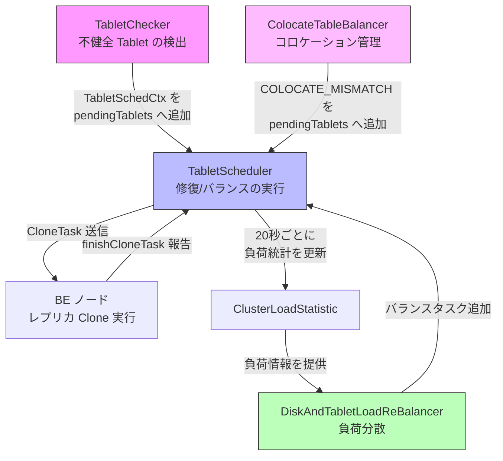
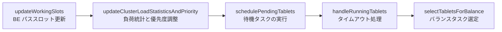

# 第26章 Tablet スケジューラとレプリカ管理

> **本章で読むソース**
>
> - [`fe/fe-core/src/main/java/com/starrocks/clone/TabletScheduler.java`](https://github.com/StarRocks/starrocks/blob/4.1.1/fe/fe-core/src/main/java/com/starrocks/clone/TabletScheduler.java)
> - [`fe/fe-core/src/main/java/com/starrocks/clone/TabletChecker.java`](https://github.com/StarRocks/starrocks/blob/4.1.1/fe/fe-core/src/main/java/com/starrocks/clone/TabletChecker.java)
> - [`fe/fe-core/src/main/java/com/starrocks/clone/TabletSchedCtx.java`](https://github.com/StarRocks/starrocks/blob/4.1.1/fe/fe-core/src/main/java/com/starrocks/clone/TabletSchedCtx.java)
> - [`fe/fe-core/src/main/java/com/starrocks/clone/DiskAndTabletLoadReBalancer.java`](https://github.com/StarRocks/starrocks/blob/4.1.1/fe/fe-core/src/main/java/com/starrocks/clone/DiskAndTabletLoadReBalancer.java)
> - [`fe/fe-core/src/main/java/com/starrocks/clone/ColocateTableBalancer.java`](https://github.com/StarRocks/starrocks/blob/4.1.1/fe/fe-core/src/main/java/com/starrocks/clone/ColocateTableBalancer.java)
> - [`fe/fe-core/src/main/java/com/starrocks/clone/Rebalancer.java`](https://github.com/StarRocks/starrocks/blob/4.1.1/fe/fe-core/src/main/java/com/starrocks/clone/Rebalancer.java)
> - [`fe/fe-core/src/main/java/com/starrocks/catalog/LocalTablet.java`](https://github.com/StarRocks/starrocks/blob/4.1.1/fe/fe-core/src/main/java/com/starrocks/catalog/LocalTablet.java)

## この章の狙い

BE ノードの障害やスケールアウトが起きたとき、StarRocks はレプリカの欠損を自動修復し、クラスタ全体の負荷を均す必要がある。
FE の `clone` パッケージがこの自動修復と負荷分散の中核を担う。
本章では、不健全な Tablet を検出する「TabletChecker」、修復や移動を実行する「TabletScheduler」、スケジューリング情報を保持する「TabletSchedCtx」、そして負荷分散を制御する「DiskAndTabletLoadReBalancer」と「ColocateTableBalancer」の連携を追い、修復と分散の全体像を読み解く。

## 前提

第16章で扱った Tablet とレプリカの関係、第2章の FE メタデータ管理の仕組みを理解していること。
BE のレポートにより FE がレプリカ状態を把握する流れ(ReportHandler)の存在を知っていること。

## 全体アーキテクチャ

Tablet のレプリカ管理は、検出、スケジューリング、実行の3段階で構成される。



**TabletChecker** は FE のデーモンスレッドとして定期的に全テーブルを走査し、不健全な Tablet を検出する。
検出した Tablet は **TabletSchedCtx** としてラップされ、**TabletScheduler** の優先度キューに投入される。
「TabletScheduler」は1秒間隔のデーモンスレッドとして動作し、キューから取り出した Tablet に対して修復(Clone タスク)や冗長レプリカ削除を実行する。
さらに負荷分散フェーズでは **DiskAndTabletLoadReBalancer** がディスク使用率と Tablet 分布の偏りを検出し、バランスタスクを生成する。

## Tablet の健康状態

`LocalTablet.TabletHealthStatus` は Tablet が取りうる健康状態を列挙する。

[`fe/fe-core/src/main/java/com/starrocks/catalog/LocalTablet.java` L77-L90](https://github.com/StarRocks/starrocks/blob/4.1.1/fe/fe-core/src/main/java/com/starrocks/catalog/LocalTablet.java#L77-L90)

```java
    public enum TabletHealthStatus {
        HEALTHY,
        REPLICA_MISSING, // not enough alive replica num.
        VERSION_INCOMPLETE, // alive replica num is enough, but version is missing.
        REPLICA_RELOCATING, // replica is healthy, but is under relocating (e.g. BE is decommission).
        REDUNDANT, // too much replicas.
        FORCE_REDUNDANT, // some replica is missing or bad, but there is no other backends for repair,
        // at least one replica has to be deleted first to make room for new replica.
        COLOCATE_MISMATCH, // replicas do not all locate in right colocate backends set.
        COLOCATE_REDUNDANT, // replicas match the colocate backends set, but redundant.
        NEED_FURTHER_REPAIR, // one of replicas need a definite repair.
        DISK_MIGRATION, // The disk where the replica is located is decommissioned.
        LOCATION_MISMATCH // The location of replica doesn't match the location specified in table property.
    }
```

「TabletScheduler」は、この状態ごとに異なるハンドラメソッドへ処理を振り分ける。

## TabletChecker: 不健全 Tablet の検出

**TabletChecker** は `FrontendDaemon` を継承するデーモンスレッドで、`tablet_sched_checker_interval_seconds` の間隔(デフォルト30秒)で全テーブルの全 Tablet を走査する。

[`fe/fe-core/src/main/java/com/starrocks/clone/TabletChecker.java` L91-L98](https://github.com/StarRocks/starrocks/blob/4.1.1/fe/fe-core/src/main/java/com/starrocks/clone/TabletChecker.java#L91-L98)

```java
public class TabletChecker extends FrontendDaemon {
    private static final Logger LOG = LogManager.getLogger(TabletChecker.class);

    private static final long LOG_PRINT_INTERVAL = 60000L;
    private static final long MIN_LOCK_HOLD_TIME_MS = 100L;

    private final TabletScheduler tabletScheduler;
    private final TabletSchedulerStat stat;
```

メインループの `runAfterCatalogReady` は、まずスケジューラのキューに空きがあるかを確認し、上限を超えていればスキップする。
空きがあれば、緊急テーブル(ADMIN REPAIR TABLE で登録されたもの)のチェックを先行し、その後に通常テーブルのチェックを実行する。

[`fe/fe-core/src/main/java/com/starrocks/clone/TabletChecker.java` L218-L233](https://github.com/StarRocks/starrocks/blob/4.1.1/fe/fe-core/src/main/java/com/starrocks/clone/TabletChecker.java#L218-L233)

```java
    protected void runAfterCatalogReady() {
        int pendingNum = tabletScheduler.getPendingNum();
        int runningNum = tabletScheduler.getRunningNum();
        if (pendingNum > Config.tablet_sched_max_scheduling_tablets
                || runningNum > Config.tablet_sched_max_scheduling_tablets) {
            LOG.info("too many tablets are being scheduled. pending: {}, running: {}, limit: {}. skip check",
                    pendingNum, runningNum, Config.tablet_sched_max_scheduling_tablets);
            return;
        }

        checkAllTablets();

        cleanInvalidUrgentTable();

        stat.counterTabletCheckRound.incrementAndGet();
        LOG.info(stat.incrementalBrief());
```

### ロック保持時間の制御

大規模テーブルで Tablet 数が数十万を超える場合、テーブルロックを長時間保持すると他の DDL がブロックされる。
「TabletChecker」はパーティション単位でロック保持時間を計測し、閾値(`tablet_checker_lock_time_per_cycle_ms`)を超えたらロックを一度解放して再取得する。

[`fe/fe-core/src/main/java/com/starrocks/clone/TabletChecker.java` L400-L420](https://github.com/StarRocks/starrocks/blob/4.1.1/fe/fe-core/src/main/java/com/starrocks/clone/TabletChecker.java#L400-L420)

```java
                long lockElapsedTime = System.currentTimeMillis() - lockStartTime;
                if (lockElapsedTime >= maxLockHoldTimeMs) {
                    locker.unLockTableWithIntensiveDbLock(db.getId(), table.getId(), LockType.READ);
                    locked = false;
                    lockStat.proactiveReleaseCount++;

                    LOG.debug("lock time for one cycle reached the limit {}, release lock.", maxLockHoldTimeMs);
                    lockStat.lockHoldTotalTime += lockElapsedTime;

                    locker.lockTableWithIntensiveDbLock(db.getId(), table.getId(), LockType.READ);
                    locked = true;
                    lockStat.lockAcquireCount++;
                    lockStartTime = System.currentTimeMillis();
                    if (metastore.getTableIncludeRecycleBin(db, table.getId()) == null) {
                        // Get the table by tableId again, ensure it still exists under the lock.
                        return;
                    }
                    // Refresh alive BE list after reacquire the lock
                    aliveBeIdsInCluster =
                            GlobalStateMgr.getCurrentState().getNodeMgr().getClusterInfo().getBackendIds(true);
                }
```

ロック再取得後はテーブルの存在確認と生存 BE リストの再取得を行い、ロック解放中に発生した状態変化にも対応する。

### 修復遅延のバックオフ

不健全な Tablet がすぐに修復対象になるわけではない。
`LocalTablet.readyToBeRepaired` はステータスの優先度に応じて待機時間を変える。

[`fe/fe-core/src/main/java/com/starrocks/catalog/LocalTablet.java` L504-L535](https://github.com/StarRocks/starrocks/blob/4.1.1/fe/fe-core/src/main/java/com/starrocks/catalog/LocalTablet.java#L504-L535)

```java
    public boolean readyToBeRepaired(TabletHealthStatus status, TabletSchedCtx.Priority priority) {
        if (priority == Priority.VERY_HIGH ||
                status == TabletHealthStatus.VERSION_INCOMPLETE ||
                status == TabletHealthStatus.NEED_FURTHER_REPAIR) {
            return true;
        }

        long currentTime = System.currentTimeMillis();

        // first check, wait for next round
        if (lastStatusCheckTime == -1) {
            lastStatusCheckTime = currentTime;
            return false;
        }

        boolean ready = false;
        switch (priority) {
            case HIGH:
                ready = currentTime - lastStatusCheckTime > Config.tablet_sched_repair_delay_factor_second * 1000;
                break;
            case NORMAL:
                ready = currentTime - lastStatusCheckTime > Config.tablet_sched_repair_delay_factor_second * 1000 * 2;
                break;
            case LOW:
                ready = currentTime - lastStatusCheckTime > Config.tablet_sched_repair_delay_factor_second * 1000 * 3;
                break;
            default:
                break;
        }

        return ready;
    }
```

VERY_HIGH 優先度と VERSION_INCOMPLETE は即座に修復対象になる。
HIGH は `tablet_sched_repair_delay_factor_second`(デフォルト60秒)の1倍、NORMAL は2倍、LOW は3倍の待機を設ける。
この段階的バックオフにより、一時的なネットワーク断の自然回復を待つ猶予を確保し、不要な Clone タスクの発行を防ぐ。

## TabletSchedCtx: スケジューリングコンテキスト

**TabletSchedCtx** は Tablet 1つ分のスケジューリング情報を保持するオブジェクトである。
タスクの種類(REPAIR/BALANCE)、優先度(動的/静的)、ソースレプリカ、宛先 BE、CloneTask への参照を持つ。

[`fe/fe-core/src/main/java/com/starrocks/clone/TabletSchedCtx.java` L112-L147](https://github.com/StarRocks/starrocks/blob/4.1.1/fe/fe-core/src/main/java/com/starrocks/clone/TabletSchedCtx.java#L112-L147)

```java
    public enum Type {
        BALANCE, REPAIR
    }

    public enum Priority {
        LOW,
        NORMAL,
        HIGH,
        VERY_HIGH;

        // try to upgrade the priority
        // LOW can only be upgraded to HIGH
        public Priority adjust(Priority origPriority) {
            switch (this) {
                case VERY_HIGH:
                    return VERY_HIGH;
                case HIGH:
                    return origPriority == LOW ? HIGH : VERY_HIGH;
                case NORMAL:
                    return HIGH;
                default:
                    return NORMAL;
            }
        }

    }

    public enum State {
        PENDING, // tablet is not being scheduled
        RUNNING, // tablet is being scheduled
        FINISHED, // task is finished
        CANCELLED, // task is failed
        TIMEOUT, // task is timeout
        UNEXPECTED, // other unexpected errors
        EXPIRED // tablet will be erased soon
    }
```

### 動的優先度の昇格

Tablet が長時間スケジュールされない場合、`adjustPriority` が動的優先度を段階的に引き上げる。

[`fe/fe-core/src/main/java/com/starrocks/clone/TabletSchedCtx.java` L1245-L1268](https://github.com/StarRocks/starrocks/blob/4.1.1/fe/fe-core/src/main/java/com/starrocks/clone/TabletSchedCtx.java#L1245-L1268)

```java
    public boolean adjustPriority(TabletSchedulerStat stat) {
        long currentTime = System.currentTimeMillis();
        if (lastAdjustPrioTime == 0) {
            // skip the first time we adjust this priority
            lastAdjustPrioTime = currentTime;
            return false;
        } else {
            if (currentTime - lastAdjustPrioTime < Config.tablet_sched_max_not_being_scheduled_interval_ms) {
                return false;
            }
        }

        lastAdjustPrioTime = System.currentTimeMillis();

        Priority originDynamicPriority = dynamicPriority;
        dynamicPriority = dynamicPriority.adjust(origPriority);
        if (originDynamicPriority != dynamicPriority) {
            LOG.debug("upgrade dynamic priority from {} to {}, origin: {}, tablet: {}",
                    originDynamicPriority.name(), dynamicPriority.name(), origPriority.name(), tabletId);
            stat.counterTabletPrioUpgraded.incrementAndGet();
            return true;
        }
        return false;
    }
```

`tablet_sched_max_not_being_scheduled_interval_ms` のデフォルトは15分で、この時間を過ぎるたびに動的優先度が1段ずつ上がる。
LOW で投入されたバランスタスクも、長期間滞留すれば NORMAL、HIGH と昇格し、いずれ処理される。
この仕組みにより、高優先度の修復タスクが大量に入っても、低優先度タスクがいつまでも処理されない状態(starvation)を防ぐ。

## TabletScheduler: 修復とバランスの実行

**TabletScheduler** は `FrontendDaemon` を継承し、1秒間隔で動作する FE のデーモンスレッドである。
内部に3つの主要なコレクションを持つ。

[`fe/fe-core/src/main/java/com/starrocks/clone/TabletScheduler.java` L163-L168](https://github.com/StarRocks/starrocks/blob/4.1.1/fe/fe-core/src/main/java/com/starrocks/clone/TabletScheduler.java#L163-L168)

```java
    private PriorityQueue<TabletSchedCtx> pendingTablets = new PriorityQueue<>();
    private final Set<Long> allTabletIds = Sets.newConcurrentHashSet();
    // contains all tabletCtxs which state are RUNNING
    private final Map<Long, TabletSchedCtx> runningTablets = Maps.newHashMap();
    // save the latest 1000 scheduled tablet info
    private final Queue<TabletSchedCtx> schedHistory = EvictingQueue.create(1000);
```

`pendingTablets` は Java の `PriorityQueue` で、動的優先度に基づいて高い順に取り出される。
`allTabletIds` は重複投入を防ぐガードであり、`pendingTablets` と `runningTablets` の和集合に一致する。
`schedHistory` は直近1000件の履歴を保持し、`SHOW TABLET SCHEDULE` コマンドで確認できる。

### メインループの流れ

毎秒実行される `runAfterCatalogReady` が4つのフェーズを順に実行する。

[`fe/fe-core/src/main/java/com/starrocks/clone/TabletScheduler.java` L454-L484](https://github.com/StarRocks/starrocks/blob/4.1.1/fe/fe-core/src/main/java/com/starrocks/clone/TabletScheduler.java#L454-L484)

```java
    protected void runAfterCatalogReady() {
        if (!updateWorkingSlots()) {
            return;
        }

        boolean loadStatUpdated = false;
        if (System.currentTimeMillis() - lastStatUpdateTime > stateUpdateIntervalMs) {
            updateClusterLoadStatisticsAndPriority();
            loadStatUpdated = true;
        }

        schedulePendingTablets();

        handleRunningTablets();

        // selectTabletsForBalance should depend on latest load statistics
        // do not select others balance task when there is running or pending balance tasks
        // to avoid generating repeated task
        if (loadStatUpdated && getBalanceTabletsNumber() <= 0) {
            long startTS = System.currentTimeMillis();
            selectTabletsForBalance();
            long usedTS = System.currentTimeMillis() - startTS;
            if (usedTS > 1000L) {
                LOG.warn("select balance tablets cost too much time: {} seconds", usedTS / 1000L);
            }
        }

        handleForceCleanSchedQ();

        stat.counterTabletScheduleRound.incrementAndGet();
    }
```



フェーズ1の `updateWorkingSlots` は各 BE のディスクパスごとのスロット数を更新する。
フェーズ2は20秒間隔でクラスタ負荷統計を再計算し、全待機 Tablet の動的優先度を調整する。
フェーズ3が処理の本体で、待機キューからバッチ的に Tablet を取り出し、1つずつ `scheduleTablet` で処理する。
フェーズ4では実行中タスクのタイムアウトをチェックし、超過したものをキャンセルする。
フェーズ5は負荷統計が更新された回にのみ実行され、バランスタスクが1つもなければ新たなバランス候補を選定する。

### PathSlot による並行度制御

Clone タスクは BE のディスク I/O を消費する。
同時に大量の Clone を走らせるとサービスに影響が出るため、BE のディスクパスごとにスロット数を制限する。

[`fe/fe-core/src/main/java/com/starrocks/clone/TabletScheduler.java` L2357-L2365](https://github.com/StarRocks/starrocks/blob/4.1.1/fe/fe-core/src/main/java/com/starrocks/clone/TabletScheduler.java#L2357-L2365)

```java
    public static class PathSlot {
        // path hash -> slot num
        private final Map<Long, Slot> pathSlots = Maps.newConcurrentMap();

        public PathSlot(List<Long> paths, int initSlotNum) {
            for (Long pathHash : paths) {
                pathSlots.put(pathHash, new Slot(initSlotNum));
            }
        }
```

スロットの取得は `takeSlot` で行い、空きがなければ -1 を返す。

[`fe/fe-core/src/main/java/com/starrocks/clone/TabletScheduler.java` L2410-L2428](https://github.com/StarRocks/starrocks/blob/4.1.1/fe/fe-core/src/main/java/com/starrocks/clone/TabletScheduler.java#L2410-L2428)

```java
        public synchronized long takeSlot(long pathHash) throws SchedException {
            if (pathHash == -1) {
                if (LOG.isDebugEnabled()) {
                    LOG.debug("path hash is not set. current stack trace: {}", LogUtil.getCurrentStackTrace());
                }
                throw new SchedException(Status.UNRECOVERABLE, "path hash is not set");
            }

            Slot slot = pathSlots.get(pathHash);
            if (slot == null) {
                return -1;
            }
            slot.rectify();
            if (slot.available <= 0) {
                return -1;
            }
            slot.available--;
            return pathHash;
        }
```

Clone タスクのソース側とデスティネーション側の両方でスロットを確保する。
これにより、特定ディスクに Clone が集中することを防ぐ。
デフォルトのスロット数は `tablet_sched_slot_num_per_path` で設定され、2以上64以下にクランプされる。

### 状態ごとのハンドラ振り分け

`handleTabletByTypeAndStatus` はタスク種別と健康状態の組み合わせに応じて処理を分岐する。

[`fe/fe-core/src/main/java/com/starrocks/clone/TabletScheduler.java` L914-L953](https://github.com/StarRocks/starrocks/blob/4.1.1/fe/fe-core/src/main/java/com/starrocks/clone/TabletScheduler.java#L914-L953)

```java
    public void handleTabletByTypeAndStatus(TabletHealthStatus status, TabletSchedCtx tabletCtx, AgentBatchTask batchTask)
            throws SchedException {
        if (tabletCtx.getType() == Type.REPAIR) {
            switch (status) {
                case REPLICA_MISSING:
                    handleReplicaMissing(tabletCtx, batchTask);
                    break;
                case VERSION_INCOMPLETE:
                case NEED_FURTHER_REPAIR: // same as version incomplete, it prefers to the dest replica which need further repair
                    handleReplicaVersionIncomplete(tabletCtx, batchTask);
                    break;
                case REPLICA_RELOCATING:
                    handleReplicaRelocating(tabletCtx, batchTask);
                    break;
                case REDUNDANT:
                    handleRedundantReplica(tabletCtx, false);
                    break;
                case FORCE_REDUNDANT:
                    handleRedundantReplica(tabletCtx, true);
                    break;
                case COLOCATE_MISMATCH:
                    handleColocateMismatch(tabletCtx, batchTask);
                    break;
                case COLOCATE_REDUNDANT:
                    handleColocateRedundant(tabletCtx);
                    break;
                case DISK_MIGRATION:
                    handleDiskMigration(tabletCtx, batchTask);
                    break;
                case LOCATION_MISMATCH:
                    handleLocationMismatch(tabletCtx, batchTask);
                    break;
                default:
                    break;
            }
        } else {
            // balance
            doBalance(tabletCtx, batchTask);
        }
    }
```

REPAIR タスクの場合は状態に応じたメソッドが呼ばれ、BALANCE タスクの場合は `doBalance` を経由して「Rebalancer」に委譲される。

### 冗長レプリカの削除順

REDUNDANT 状態では、削除対象レプリカの選定に10段階の優先順位がある。

[`fe/fe-core/src/main/java/com/starrocks/clone/TabletScheduler.java` L1082-L1119](https://github.com/StarRocks/starrocks/blob/4.1.1/fe/fe-core/src/main/java/com/starrocks/clone/TabletScheduler.java#L1082-L1119)

```java
    /**
     * replica is redundant, which means there are more replicas than we expected, which need to be dropped.
     * we just drop one redundant replica at a time, for safety reason.
     * choosing a replica to drop base on following priority:
     * 1. backend has been dropped
     * 2. replica is bad
     * 3. backend is not available
     * 4. replica's state is CLONE or DECOMMISSION
     * 5. replica's last failed version > 0
     * 6. replica with lower version
     * 7. replica on same host
     * 8. replica not in right cluster
     * 9. replica is the src replica of a rebalance task, we can try to get it from rebalancer
     * 10. replica on higher load backend
     */
    private void handleRedundantReplica(TabletSchedCtx tabletCtx, boolean force) throws SchedException {
        stat.counterReplicaRedundantErr.incrementAndGet();

        Database db = GlobalStateMgr.getCurrentState().getLocalMetastore().getDbIncludeRecycleBin(tabletCtx.getDbId());
        if (db == null) {
            throw new SchedException(Status.UNRECOVERABLE, "db " + tabletCtx.getDbId() + " not exist");
        }
        // Lock acquisition is outside the try so the finally cannot try to unlock
        // a never-acquired lock if lockTableWithIntensiveDbLock itself throws.
        Locker locker = new Locker();
        locker.lockTableWithIntensiveDbLock(db.getId(), tabletCtx.getTblId(), LockType.WRITE);
        try {
            checkMetaExist(tabletCtx);
            if (deleteBackendDropped(tabletCtx, force)
                    || deleteBadReplica(tabletCtx, force)
                    || deleteBackendUnavailable(tabletCtx, force)
                    || deleteCloneOrDecommissionReplica(tabletCtx, force)
                    || deleteLocationMismatchReplica(tabletCtx, force)
                    || deleteReplicaWithFailedVersion(tabletCtx, force)
                    || deleteReplicaWithLowerVersion(tabletCtx, force)
                    || deleteReplicaOnSameHost(tabletCtx, force)
                    || deleteReplicaChosenByRebalancer(tabletCtx, force)
                    || deleteReplicaOnHighLoadBackend(tabletCtx, force)) {
```

短絡評価により、最初にマッチした条件でレプリカを1つだけ削除して終了する。
安全性のために1回のスケジュールで複数のレプリカを同時に削除しない設計になっている。

### 安全なレプリカ削除の DECOMMISSION プロトコル

レプリカを即座に物理削除すると、実行中のトランザクションがそのレプリカへの書き込みに失敗する。
「TabletScheduler」は watermark トランザクション ID を用いた2段階削除を実装する。

[`fe/fe-core/src/main/java/com/starrocks/clone/TabletScheduler.java` L1377-L1415](https://github.com/StarRocks/starrocks/blob/4.1.1/fe/fe-core/src/main/java/com/starrocks/clone/TabletScheduler.java#L1377-L1415)

```java
    protected void deleteReplicaInternal(TabletSchedCtx tabletCtx, Replica replica, String reason, boolean force)
            throws SchedException {
        if (Config.tablet_sched_always_force_decommission_replica) {
            force = true;
        }
        /*
         * Before deleting a replica, we should make sure that there is no running txn on it
         *  and no more txns will be on it.
         * So we do followings:
         * 1. If replica is loadable, set a watermark txn id on it and set it state as DECOMMISSION, but not
         *      deleting it this time. The DECOMMISSION state will ensure that no more txns will be on this replicas.
         * 2. Wait for any txns before the watermark txn id to be finished. If all are finished, which means
         *      this replica is safe to be deleted.
         */
        if (!force && replica.getState().canLoad() && replica.getWatermarkTxnId() == -1) {
            long nextTxnId =
                    GlobalStateMgr.getCurrentState().getGlobalTransactionMgr().getTransactionIDGenerator().getNextTransactionId();
            replica.setWatermarkTxnId(nextTxnId);
            tabletCtx.resetDecommissionedReplicaState();
            tabletCtx.setDecommissionedReplica(replica);
            replica.setState(ReplicaState.DECOMMISSION);
            // set priority to normal because it may wait for a long time. Remain it as VERY_HIGH may block other task.
            tabletCtx.setOrigPriority(Priority.NORMAL);
            LOG.info("decommission tablet:" + tabletCtx.getTabletId() + " type:" + tabletCtx.getType() + " replica:" +
                    replica.getBackendId() + " reason:" + reason + " watermark:" + nextTxnId + " replicas:" +
                    tabletCtx.getTablet().getReplicaInfos());
            throw new SchedException(Status.SCHEDULE_RETRY, "set watermark txn " + nextTxnId);
        } else if (replica.getState() == ReplicaState.DECOMMISSION && replica.getWatermarkTxnId() != -1) {
            long watermarkTxnId = replica.getWatermarkTxnId();
            try {
                if (!GlobalStateMgr.getCurrentState().getGlobalTransactionMgr().isPreviousTransactionsFinished(watermarkTxnId,
                        tabletCtx.getDbId(), Lists.newArrayList(tabletCtx.getTblId()))) {
                    throw new SchedException(Status.SCHEDULE_RETRY,
                            "wait txn before " + watermarkTxnId + " to be finished");
                }
            } catch (AnalysisException e) {
                throw new SchedException(Status.UNRECOVERABLE, e.getMessage());
            }
        }
```

第1回目の呼び出しでは、レプリカの状態を DECOMMISSION に変え、現在のトランザクション ID を watermark として記録する。
DECOMMISSION 状態のレプリカには新しいトランザクションが割り当てられない。
第2回目以降の呼び出しで、watermark 以前の全トランザクションが完了していることを確認してから物理削除を行う。

## DiskAndTabletLoadReBalancer: 負荷分散

**DiskAndTabletLoadReBalancer** は「Rebalancer」抽象クラスを実装し、4種類のバランスを担当する。

[`fe/fe-core/src/main/java/com/starrocks/clone/DiskAndTabletLoadReBalancer.java` L126-L162](https://github.com/StarRocks/starrocks/blob/4.1.1/fe/fe-core/src/main/java/com/starrocks/clone/DiskAndTabletLoadReBalancer.java#L126-L162)

```java
    protected List<TabletSchedCtx> selectAlternativeTabletsForCluster(
            ClusterLoadStatistic clusterStat, TStorageMedium medium) {
        if (RunMode.isSharedDataMode()) {
            return Collections.emptyList();
        }
        List<TabletSchedCtx> alternativeTablets;
        BalanceType balanceType;
        do {
            // balance cluster
            if (!isClusterDiskBalanced(clusterStat, medium)) {
                alternativeTablets = balanceClusterDisk(clusterStat, medium);
                balanceType = BalanceType.INTER_NODE_DISK_USAGE;
            } else {
                alternativeTablets = balanceClusterTablet(clusterStat, medium);
                balanceType = BalanceType.INTER_NODE_TABLET_DISTRIBUTION;
            }
            if (!alternativeTablets.isEmpty()) {
                break;
            }

            // balance backend
            if (!isBackendDiskBalanced(clusterStat, medium)) {
                alternativeTablets = balanceBackendDisk(clusterStat, medium);
                balanceType = BalanceType.INTRA_NODE_DISK_USAGE;
            } else {
                alternativeTablets = balanceBackendTablet(clusterStat, medium);
                balanceType = BalanceType.INTRA_NODE_TABLET_DISTRIBUTION;
            }
        } while (false);

        if (!alternativeTablets.isEmpty()) {
            LOG.info("select tablets to balance {}: total {}, medium {}, tablets[show up to 100]: {}",
                    balanceType.label(), alternativeTablets.size(), medium,
                    alternativeTablets.stream().mapToLong(TabletSchedCtx::getTabletId).limit(100).toArray());
        }
        return alternativeTablets;
    }
```

4種類のバランスは次の優先順位で試行される。

1. **ノード間ディスク使用率**(INTER_NODE_DISK_USAGE): BE 間でディスク使用率の偏りがあれば、高使用率 BE から低使用率 BE へ Tablet を移す
2. **ノード間 Tablet 分布**(INTER_NODE_TABLET_DISTRIBUTION): ディスク使用率が均一でも、Tablet 数の偏りがあれば是正する
3. **ノード内ディスク使用率**(INTRA_NODE_DISK_USAGE): 単一 BE 内のディスク間で使用率に偏りがあれば、ローカル移動で均す
4. **ノード内 Tablet 分布**(INTRA_NODE_TABLET_DISTRIBUTION): 単一 BE 内のディスク間で Tablet 数の偏りを是正する

ノード間バランスはリモート Clone で行い、ノード内バランスはローカル移動(同一 BE 内のパス間コピー)で行う。

## ColocateTableBalancer: コロケーションテーブルの管理

**ColocateTableBalancer** はコロケーションテーブル専用の管理デーモンで、20秒間隔で動作する。
コロケーションテーブルでは、同一コロケーショングループに属するテーブルのバケットが同一 BE 配置を共有する。
この制約のもとで、バケットシーケンス(各バケットがどの BE 群に配置されるか)の修復とリバランスを行う。

[`fe/fe-core/src/main/java/com/starrocks/clone/ColocateTableBalancer.java` L252-L260](https://github.com/StarRocks/starrocks/blob/4.1.1/fe/fe-core/src/main/java/com/starrocks/clone/ColocateTableBalancer.java#L252-L260)

```java
    @Override
    protected void runAfterCatalogReady() {
        if (!Config.tablet_sched_disable_colocate_balance && isSystemStable(GlobalStateMgr
                .getCurrentState().getNodeMgr().getClusterInfo())) {
            relocateAndBalancePerGroup();
            relocateAndBalanceAllGroups();
        }
        matchGroups();
    }
```

バランス実行前に `isSystemStable` で生存 BE が一定期間変化していないことを確認する。
BE の増減直後にバランスを開始すると、クラスタがまだ安定していないうちに不要な移動が発生するためである。

[`fe/fe-core/src/main/java/com/starrocks/clone/ColocateTableBalancer.java` L266-L280](https://github.com/StarRocks/starrocks/blob/4.1.1/fe/fe-core/src/main/java/com/starrocks/clone/ColocateTableBalancer.java#L266-L280)

```java
    protected boolean isSystemStable(SystemInfoService infoService) {
        Set<Long> currentAliveBackendIds = new HashSet<>(infoService.getBackendIds(true));
        if (!currentAliveBackendIds.equals(aliveBackendIds)) {
            aliveBackendIds = currentAliveBackendIds;
            systemStableStartTime = -1L;
            return false;
        }
        if (systemStableStartTime == -1L) {
            systemStableStartTime = System.currentTimeMillis();
            return false;
        }

        return System.currentTimeMillis() - systemStableStartTime
                > Config.tablet_sched_colocate_balance_wait_system_stable_time_s * 1000;
    }
```

`tablet_sched_colocate_balance_wait_system_stable_time_s`(デフォルト600秒)の間、生存 BE の集合が変化しなかった場合にのみバランスが有効になる。

`matchGroups` はバケットシーケンスと実際のレプリカ配置を比較し、不一致があればそのコロケーショングループを unstable とマークして Tablet を「TabletScheduler」へ投入する。

## 最適化の工夫: Clone 並行度のパススロット制御

Tablet の修復やリバランスでは BE のディスク I/O が消費される。
全ディスクに対して無制限に Clone を走らせると、通常のクエリ処理に深刻な影響を与える。
「TabletScheduler」はこの問題を「PathSlot」で解決する。

各 BE のディスクパス(ディスクのハッシュ値で識別)ごとに固定数のスロットを持ち、Clone タスクの開始時にソース側とデスティネーション側の両方でスロットを確保する。
空きスロットがなければタスクは SCHEDULE_RETRY となり次のラウンドに持ち越される。
タスク完了時にスロットは解放される。

この仕組みにより、次の効果が得られる。

- 単一ディスクに Clone が集中せず、サービスへの影響を抑える
- 設定パラメーター(`tablet_sched_slot_num_per_path`)で運用者が並行度を調整できる
- 統計情報(コピー量、所要時間)をパスごとに収集し、将来のスロット数自動調整の基盤を持つ

## まとめ

Tablet のレプリカ管理は「TabletChecker」「TabletScheduler」「Rebalancer」の3層で構成される。
「TabletChecker」が検出した不健全 Tablet は優先度付きキューに投入され、「TabletScheduler」が毎秒の処理ラウンドで修復やバランスを実行する。
修復では BE への CloneTask 送信と完了報告の受理を行い、冗長レプリカの削除では DECOMMISSION による2段階プロトコルでトランザクション安全性を確保する。
バランスでは「DiskAndTabletLoadReBalancer」がノード間/ノード内のディスク使用率と Tablet 分布の4軸で偏りを検出し、「ColocateTableBalancer」がコロケーションテーブル固有のバケットシーケンス管理を担う。
PathSlot によるパスごとの並行度制御と、動的優先度昇格による starvation 防止が、大規模クラスタでの安定運用を支える最適化である。

## 関連する章

- 第16章「Tablet、Rowset とデータモデル」: Tablet とレプリカの基本概念
- 第2章「FE の起動とメタデータ管理」: FE デーモンスレッドとメタデータ管理の枠組み
- 第24章「メモリ管理とデータキャッシュ」: BE リソースの管理
