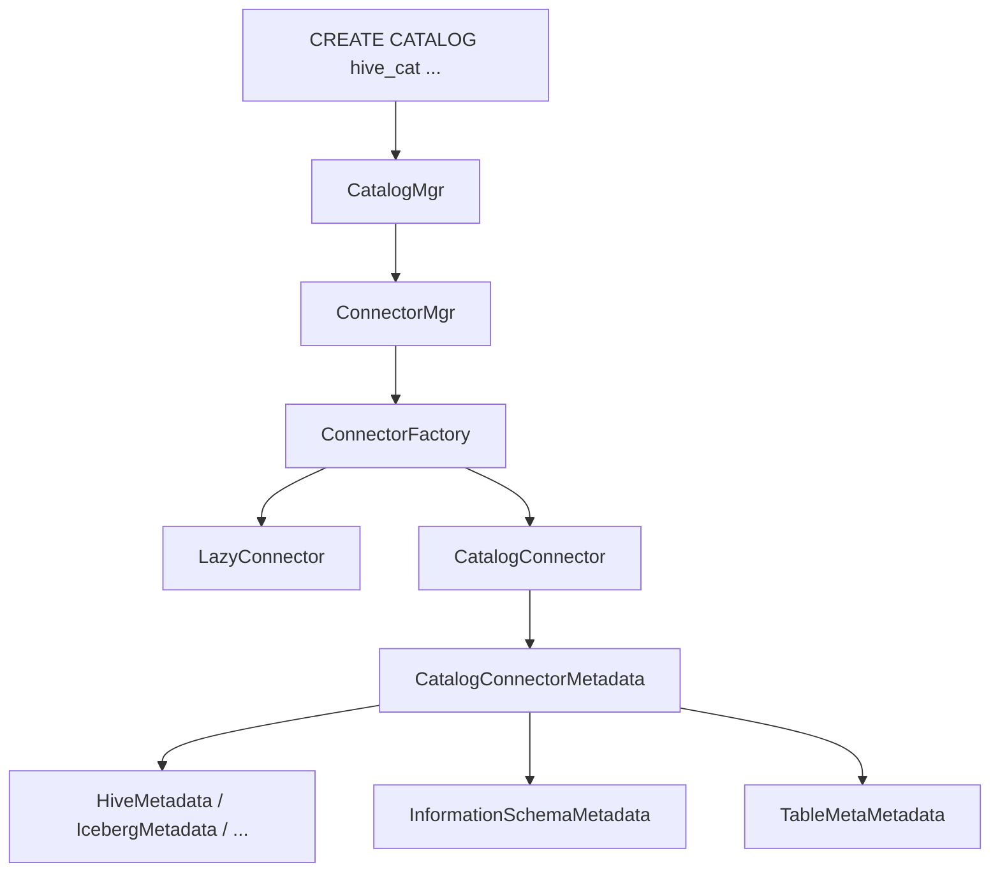
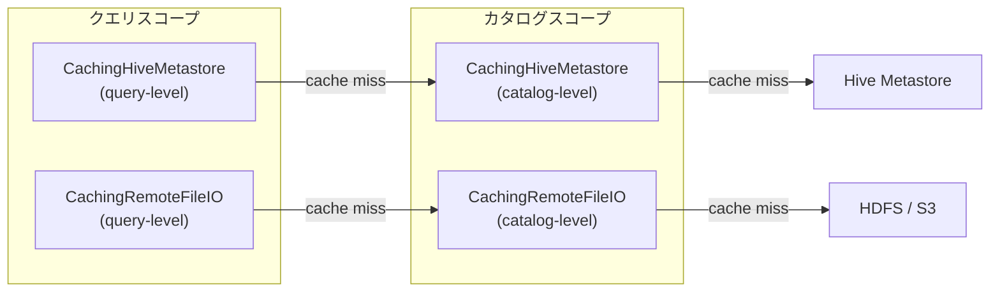
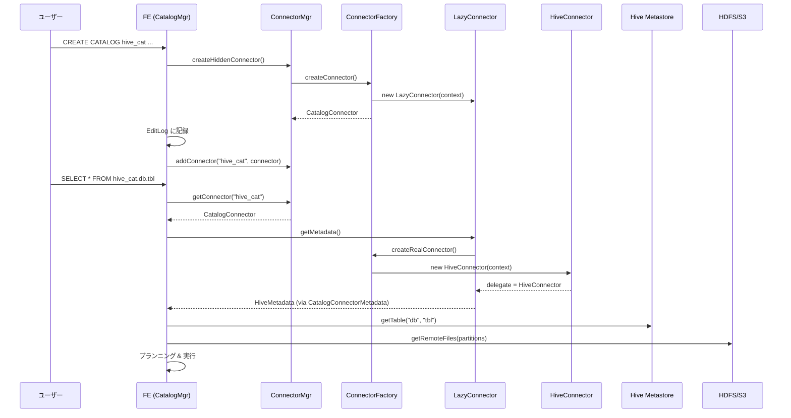

# 第27章 Connector と外部カタログ

> **本章で読むソース**
>
> - [`fe/fe-core/src/main/java/com/starrocks/connector/Connector.java`](https://github.com/StarRocks/starrocks/blob/4.1.1/fe/fe-core/src/main/java/com/starrocks/connector/Connector.java)
> - [`fe/fe-core/src/main/java/com/starrocks/connector/ConnectorMetadata.java`](https://github.com/StarRocks/starrocks/blob/4.1.1/fe/fe-core/src/main/java/com/starrocks/connector/ConnectorMetadata.java)
> - [`fe/fe-core/src/main/java/com/starrocks/connector/ConnectorFactory.java`](https://github.com/StarRocks/starrocks/blob/4.1.1/fe/fe-core/src/main/java/com/starrocks/connector/ConnectorFactory.java)
> - [`fe/fe-core/src/main/java/com/starrocks/connector/ConnectorMgr.java`](https://github.com/StarRocks/starrocks/blob/4.1.1/fe/fe-core/src/main/java/com/starrocks/connector/ConnectorMgr.java)
> - [`fe/fe-core/src/main/java/com/starrocks/connector/CatalogConnector.java`](https://github.com/StarRocks/starrocks/blob/4.1.1/fe/fe-core/src/main/java/com/starrocks/connector/CatalogConnector.java)
> - [`fe/fe-core/src/main/java/com/starrocks/connector/LazyConnector.java`](https://github.com/StarRocks/starrocks/blob/4.1.1/fe/fe-core/src/main/java/com/starrocks/connector/LazyConnector.java)
> - [`fe/fe-core/src/main/java/com/starrocks/connector/ConnectorType.java`](https://github.com/StarRocks/starrocks/blob/4.1.1/fe/fe-core/src/main/java/com/starrocks/connector/ConnectorType.java)
> - [`fe/fe-core/src/main/java/com/starrocks/connector/CatalogConnectorMetadata.java`](https://github.com/StarRocks/starrocks/blob/4.1.1/fe/fe-core/src/main/java/com/starrocks/connector/CatalogConnectorMetadata.java)
> - [`fe/fe-core/src/main/java/com/starrocks/server/CatalogMgr.java`](https://github.com/StarRocks/starrocks/blob/4.1.1/fe/fe-core/src/main/java/com/starrocks/server/CatalogMgr.java)
> - [`fe/fe-core/src/main/java/com/starrocks/connector/hive/HiveConnector.java`](https://github.com/StarRocks/starrocks/blob/4.1.1/fe/fe-core/src/main/java/com/starrocks/connector/hive/HiveConnector.java)
> - [`fe/fe-core/src/main/java/com/starrocks/connector/hive/CachingHiveMetastore.java`](https://github.com/StarRocks/starrocks/blob/4.1.1/fe/fe-core/src/main/java/com/starrocks/connector/hive/CachingHiveMetastore.java)
> - [`fe/fe-core/src/main/java/com/starrocks/connector/CachingRemoteFileIO.java`](https://github.com/StarRocks/starrocks/blob/4.1.1/fe/fe-core/src/main/java/com/starrocks/connector/CachingRemoteFileIO.java)
> - [`fe/fe-core/src/main/java/com/starrocks/connector/iceberg/IcebergConnector.java`](https://github.com/StarRocks/starrocks/blob/4.1.1/fe/fe-core/src/main/java/com/starrocks/connector/iceberg/IcebergConnector.java)
> - [`fe/fe-core/src/main/java/com/starrocks/connector/iceberg/CachingIcebergCatalog.java`](https://github.com/StarRocks/starrocks/blob/4.1.1/fe/fe-core/src/main/java/com/starrocks/connector/iceberg/CachingIcebergCatalog.java)
> - [`fe/fe-core/src/main/java/com/starrocks/connector/jdbc/JDBCConnector.java`](https://github.com/StarRocks/starrocks/blob/4.1.1/fe/fe-core/src/main/java/com/starrocks/connector/jdbc/JDBCConnector.java)
> - [`fe/fe-core/src/main/java/com/starrocks/connector/hive/ConnectorTableMetadataProcessor.java`](https://github.com/StarRocks/starrocks/blob/4.1.1/fe/fe-core/src/main/java/com/starrocks/connector/hive/ConnectorTableMetadataProcessor.java)

## この章の狙い

StarRocks は Hive、Iceberg、Hudi、Paimon、JDBC など多種多様な外部データソースを、内部テーブルと同じ SQL インタフェースで透過的にクエリできる。
この機能の心臓部が **Connector** フレームワークである。
本章では、Connector インタフェースの設計、カタログの生成と管理、メタデータキャッシュの二層構造、そして主要コネクタ(Hive、Iceberg、JDBC)の実装上の特徴を追う。
読み終えると「CREATE CATALOG 文を実行してから外部テーブルのスキャンプランが生成されるまで」に FE 内部で何が起きているかを一通り説明できるようになる。

## 前提

第2章で扱った FE の起動とメタデータ管理の全体像を理解していること。
第6章のオプティマイザがテーブルメタデータをどのように利用するかを知っていること。

## Connector フレームワークの全体像

外部カタログ機構は、次の4つのレイヤーに分かれる。

1. **CatalogMgr** が DDL 文(`CREATE CATALOG` / `DROP CATALOG`)を受け取り、カタログオブジェクトと Connector を生成する。
2. **ConnectorMgr** がカタログ名をキーとして「CatalogConnector」を管理する。
3. **CatalogConnector** が「通常メタデータ」「information_schema」「テーブルメタ」の3つの `ConnectorMetadata` を束ねる。
4. 各コネクタ固有の **ConnectorMetadata** 実装(「HiveMetadata」「IcebergMetadata」など)が、外部データソースへの実際のメタデータ操作を担う。



## Connector と ConnectorMetadata インタフェース

**Connector** はコネクタの最上位インタフェースであり、メソッドは3つしかない。

[`fe/fe-core/src/main/java/com/starrocks/connector/Connector.java` L23-L54](https://github.com/StarRocks/starrocks/blob/4.1.1/fe/fe-core/src/main/java/com/starrocks/connector/Connector.java#L23-L54)

```java
public interface Connector extends MemoryTrackable {
    /**
     * Get the connector meta of connector
     *
     * @return a ConnectorMetadata instance of connector
     */
    ConnectorMetadata getMetadata();

    /**
     * Shutdown the connector by releasing any held resources such as
     * threads, sockets, etc. This method will only be called when no
     * queries are using the connector. After this method is called,
     * no methods will be called on the connector or any objects that
     * have been returned from the connector.
     */
    default void shutdown() {
    }

    /**
     * check connector config
     */
    default void bindConfig(ConnectorConfig config) {
    }

    default boolean supportMemoryTrack() {
        return false;
    }

    default Map<String, Long> estimateCount() {
        return new HashMap<>();
    }
}
```

`getMetadata()` が返す **ConnectorMetadata** は、データベースの一覧取得からテーブルの DDL、パーティション情報、リモートファイル情報、統計情報まで、外部データソースとのやり取りを網羅する巨大なインタフェースである。
すべてのメソッドに default 実装があるため、コネクタごとに必要な操作だけをオーバーライドすれば済む。
主要なメソッドを抜粋する。

[`fe/fe-core/src/main/java/com/starrocks/connector/ConnectorMetadata.java` L69-L95](https://github.com/StarRocks/starrocks/blob/4.1.1/fe/fe-core/src/main/java/com/starrocks/connector/ConnectorMetadata.java#L69-L95)

```java
public interface ConnectorMetadata {
    /**
     * Use connector type as a hint of table type.
     * Caveat: there are exceptions that hive connector may have non-hive(e.g. iceberg) tables.
     */
    default Table.TableType getTableType() {
        throw new StarRocksConnectorException("This connector doesn't support getting table type");
    }

    /**
     * List all database names of connector
     *
     * @return a list of string containing all database names of connector
     */
    default List<String> listDbNames(ConnectContext context) {
        return Lists.newArrayList();
    }

    /**
     * List all table names of the database specific by `dbName`
     *
     * @param dbName - the string of which all table names are listed
     * @return a list of string containing all table names of `dbName`
     */
    default List<String> listTableNames(ConnectContext context, String dbName) {
        return Lists.newArrayList();
    }
```

## ConnectorType とコネクタの種類

サポートされるコネクタの型は **ConnectorType** 列挙型で定義される。
各列挙値がコネクタクラスと設定クラスの組を保持する。

[`fe/fe-core/src/main/java/com/starrocks/connector/ConnectorType.java` L34-L58](https://github.com/StarRocks/starrocks/blob/4.1.1/fe/fe-core/src/main/java/com/starrocks/connector/ConnectorType.java#L34-L58)

```java
public enum ConnectorType {

    ES("es", ElasticsearchConnector.class, EsConfig.class),
    HIVE("hive", HiveConnector.class, null),
    ICEBERG("iceberg", IcebergConnector.class, null),
    JDBC("jdbc", JDBCConnector.class, null),
    HUDI("hudi", HudiConnector.class, null),
    DELTALAKE("deltalake", DeltaLakeConnector.class, null),
    PAIMON("paimon", PaimonConnector.class, null),
    ODPS("odps", OdpsConnector.class, null),
    KUDU("kudu", KuduConnector.class, null),
    UNIFIED("unified", UnifiedConnector.class, null);

    public static final Set<ConnectorType> SUPPORT_TYPE_SET = EnumSet.of(
            ES,
            HIVE,
            ICEBERG,
            JDBC,
            HUDI,
            DELTALAKE,
            PAIMON,
            ODPS,
            KUDU,
            UNIFIED
    );
```

`ConnectorFactory.createRealConnector()` は、この列挙型からコネクタクラスを取得し、リフレクションでインスタンスを生成する。

[`fe/fe-core/src/main/java/com/starrocks/connector/ConnectorFactory.java` L59-L84](https://github.com/StarRocks/starrocks/blob/4.1.1/fe/fe-core/src/main/java/com/starrocks/connector/ConnectorFactory.java#L59-L84)

```java
    public static Connector createRealConnector(ConnectorContext context)
            throws StarRocksConnectorException {
        ConnectorType connectorType = ConnectorType.from(context.getType());
        Class<Connector> connectorClass = connectorType.getConnectorClass();
        Class<ConnectorConfig> ctConfigClass = connectorType.getConfigClass();
        try {
            Constructor connectorConstructor = connectorClass.getDeclaredConstructor(ConnectorContext.class);
            Connector connector = (Connector) connectorConstructor.newInstance(new Object[] {context});

            // init config, then load config
            if (null != connector && null != ctConfigClass) {
                ConnectorConfig connectorConfig = ctConfigClass.newInstance();
                connectorConfig.loadConfig(context.getProperties());
                connector.bindConfig(connectorConfig);
            }

            return connector;
        } catch (InvocationTargetException e) {
            LOG.error(String.format("create [%s] connector failed", context.getType()), e);
            Throwable rootCause = ExceptionUtils.getCause(e);
            throw new StarRocksConnectorException(rootCause.getMessage(), rootCause);
        } catch (Exception e1) {
            LOG.error(String.format("create [%s] connector failed", context.getType()), e1);
            throw new StarRocksConnectorException(e1.getMessage(), e1);
        }
    }
```

## LazyConnector による遅延初期化

`ConnectorFactory.createConnector()` は、コネクタの実体を即座に作らず **LazyConnector** で包む。
`LazyConnector` は `getMetadata()` が初めて呼ばれた時点で `createRealConnector()` を呼び、実際のコネクタインスタンスを生成する。
この遅延初期化により、FE のリプレイ時に外部メタストアへの接続を行わずに済む。

[`fe/fe-core/src/main/java/com/starrocks/connector/LazyConnector.java` L29-L77](https://github.com/StarRocks/starrocks/blob/4.1.1/fe/fe-core/src/main/java/com/starrocks/connector/LazyConnector.java#L29-L77)

```java
public class LazyConnector implements Connector {
    private static final Logger LOG = LogManager.getLogger(LazyConnector.class);
    private Connector delegate;
    private final ConnectorContext context;

    public LazyConnector(ConnectorContext context) {
        this.context = context;
    }

    @Override
    public ConnectorMetadata getMetadata() {
        initIfNeeded();
        return delegate.getMetadata();
    }

    public void initIfNeeded() {
        synchronized (this) {
            if (delegate == null) {
                try {
                    // init access control
                    String serviceName = context.getProperties().get("ranger.plugin.hive.service.name");
                    String accessControl =
                            context.getProperties().getOrDefault("catalog.access.control", Config.access_control);
                    if (serviceName == null || serviceName.isEmpty()) {
                        if (accessControl.equals("ranger")) {
                            Authorizer.getInstance()
                                    .setAccessControl(context.getCatalogName(), new RangerStarRocksAccessController());
                        } else if (accessControl.equals("allowall")) {
                            Authorizer.getInstance()
                                    .setAccessControl(context.getCatalogName(), new AllowAllAccessController());
                        } else {
                            Authorizer.getInstance()
                                    .setAccessControl(context.getCatalogName(), new NativeAccessController());
                        }
                    } else {
                        Authorizer.getInstance().setAccessControl(context.getCatalogName(),
                                new RangerHiveAccessController(serviceName));
                    }
                    // create connector
                    delegate = ConnectorFactory.createRealConnector(context);
                } catch (Exception e) {
                    LOG.error("Failed to init connector [type: {}, name: {}]",
                            context.getType(), context.getCatalogName(), e);
                    throw new StarRocksConnectorException("Failed to init connector [type: %s, name: %s]. msg: %s",
                            context.getType(), context.getCatalogName(), e.getMessage());
                }
            }
        }
    }
```

`initIfNeeded()` は `synchronized` で保護されているため、複数スレッドから同時に呼ばれても初期化は一度だけ行われる。
初期化時にはアクセス制御(Ranger / NativeAccessController)のセットアップも行われる。

## CatalogConnector と CatalogConnectorMetadata

**CatalogConnector** は3つの「Connector」を束ねるファサードである。
`getMetadata()` 呼び出し時に「CatalogConnectorMetadata」を生成し、データベース名に応じてリクエストを適切なメタデータ実装へルーティングする。

[`fe/fe-core/src/main/java/com/starrocks/connector/CatalogConnector.java` L25-L47](https://github.com/StarRocks/starrocks/blob/4.1.1/fe/fe-core/src/main/java/com/starrocks/connector/CatalogConnector.java#L25-L47)

```java
public class CatalogConnector implements Connector {
    private final Connector normalConnector;
    private final Connector informationSchemaConnector;
    private final Connector tableMetaConnector;

    public CatalogConnector(Connector normalConnector, InformationSchemaConnector informationSchemaConnector,
                            TableMetaConnector tableMetaConnector) {
        requireNonNull(normalConnector, "normalConnector is null");
        requireNonNull(informationSchemaConnector, "informationSchemaConnector is null");
        checkArgument(!(normalConnector instanceof InformationSchemaConnector), "normalConnector is InformationSchemaConnector");
        checkArgument(!(normalConnector instanceof TableMetaConnector), "tableMetaConnector is InformationSchemaConnector");
        this.normalConnector = normalConnector;
        this.informationSchemaConnector = informationSchemaConnector;
        this.tableMetaConnector = tableMetaConnector;
    }

    public ConnectorMetadata getMetadata() {
        return new CatalogConnectorMetadata(
                normalConnector.getMetadata(),
                informationSchemaConnector.getMetadata(),
                tableMetaConnector.getMetadata()
        );
    }
```

「CatalogConnectorMetadata」はデータベース名が `information_schema` であれば `informationSchema` へ、テーブル名がメタデータテーブルのパターンに合致すれば `tableMetadata` へ、それ以外は `normal` へ委譲する。

[`fe/fe-core/src/main/java/com/starrocks/connector/CatalogConnectorMetadata.java` L92-L113](https://github.com/StarRocks/starrocks/blob/4.1.1/fe/fe-core/src/main/java/com/starrocks/connector/CatalogConnectorMetadata.java#L92-L113)

```java
    private ConnectorMetadata metadataOfTable(String tableName) {
        // Paimon system table shares the same pattern, ignore it here
        if (getTableType() != Table.TableType.PAIMON && TableMetaMetadata.isMetadataTable(tableName)) {
            return tableMetadata;
        }
        return null;
    }

    private ConnectorMetadata metadataOfTable(Table table) {
        if (table instanceof MetadataTable) {
            return tableMetadata;
        }

        return null;
    }

    private ConnectorMetadata metadataOfDb(String dBName) {
        if (isInfoSchemaDb(dBName)) {
            return informationSchema;
        }
        return normal;
    }
```

## ConnectorMgr と CatalogMgr

**ConnectorMgr** は `ConcurrentHashMap<String, CatalogConnector>` でカタログ名から「CatalogConnector」への対応を管理する。
ReadWriteLock を用いて、読み取り操作(カタログ存在確認、取得)と書き込み操作(作成、削除)を分離している。

[`fe/fe-core/src/main/java/com/starrocks/connector/ConnectorMgr.java` L31-L59](https://github.com/StarRocks/starrocks/blob/4.1.1/fe/fe-core/src/main/java/com/starrocks/connector/ConnectorMgr.java#L31-L59)

```java
public class ConnectorMgr {
    private final ConcurrentHashMap<String, CatalogConnector> connectors = new ConcurrentHashMap<>();
    private final ReadWriteLock connectorLock = new ReentrantReadWriteLock();

    public CatalogConnector createConnector(ConnectorContext context, boolean isReplay) throws StarRocksConnectorException {
        String catalogName = context.getCatalogName();
        CatalogConnector connector = null;
        readLock();
        try {
            Preconditions.checkState(!connectors.containsKey(catalogName),
                    "Connector of catalog '%s' already exists", catalogName);
            connector = ConnectorFactory.createConnector(context, isReplay);
            if (connector == null) {
                return null;
            }
        } catch (StarRocksConnectorException e) {
            throw e;
        } finally {
            readUnlock();
        }

        writeLock();
        try {
            connectors.put(catalogName, connector);
            return connector;
        } finally {
            writeUnLock();
        }
    }
```

**CatalogMgr** は `ConnectorMgr` の上位に位置し、カタログの永続化(EditLog)とコネクタの生成を一体で管理する。
`createCatalog()` メソッドでは、まずコネクタを `createHiddenConnector()` で生成し、成功した場合のみ EditLog に記録してから `connectors` マップへ登録する。

[`fe/fe-core/src/main/java/com/starrocks/server/CatalogMgr.java` L101-L146](https://github.com/StarRocks/starrocks/blob/4.1.1/fe/fe-core/src/main/java/com/starrocks/server/CatalogMgr.java#L101-L146)

```java
    public void createCatalog(String type, String catalogName, String comment, Map<String, String> properties)
            throws DdlException {
        writeLock();
        try {
            if (Strings.isNullOrEmpty(type)) {
                throw new DdlException("Missing properties 'type'");
            }

            Preconditions.checkState(!catalogs.containsKey(catalogName), "Catalog '%s' already exists", catalogName);

            try {
                CatalogConnector connector = connectorMgr.createHiddenConnector(
                        new ConnectorContext(catalogName, type, properties), false);
                if (null == connector) {
                    LOG.error("{} connector [{}] create failed", type, catalogName);
                    throw new DdlException("connector create failed");
                }
                long id = isResourceMappingCatalog(catalogName) ?
                        ConnectorTableId.CONNECTOR_ID_GENERATOR.getNextId().asInt() :
                        GlobalStateMgr.getCurrentState().getNextId();
                Catalog catalog = new ExternalCatalog(id, catalogName, comment, properties);

                if (!isResourceMappingCatalog(catalogName)) {
                    try {
                        GlobalStateMgr.getCurrentState().getEditLog().logCreateCatalog(catalog, wal -> {
                            // add connector after log create catalog
                            catalogs.put(catalogName, catalog);
                            connectorMgr.addConnector(catalogName, connector);
                        });
                    } catch (Exception e) {
                        LOG.warn("create catalog failed, shutdown new connector", e);
                        connector.shutdown();
                        throw e;
                    }
                } else {
                    catalogs.put(catalogName, catalog);
                    connectorMgr.addConnector(catalogName, connector);
                }
            } catch (StarRocksConnectorException e) {
                LOG.error("connector create failed. catalog [{}] ", catalogName, e);
                throw new DdlException(String.format("connector create failed {%s}", e.getMessage()));
            }
        } finally {
            writeUnLock();
        }
    }
```

コネクタ生成を先に行い、EditLog 書き込みのコールバック内でマップへ登録する手順にすることで、ログ書き込みに失敗した場合はコネクタを shutdown して不整合を防いでいる。

## Hive コネクタの内部構造

Hive コネクタは最も機能が豊富な実装であり、メタストアキャッシュとリモートファイルキャッシュの二層構造を備える。

### HiveConnector の初期化

[`fe/fe-core/src/main/java/com/starrocks/connector/hive/HiveConnector.java` L41-L76](https://github.com/StarRocks/starrocks/blob/4.1.1/fe/fe-core/src/main/java/com/starrocks/connector/hive/HiveConnector.java#L41-L76)

```java
    public HiveConnector(ConnectorContext context) {
        this.properties = context.getProperties();
        this.catalogName = context.getCatalogName();
        this.catalogNameType = new CatalogNameType(catalogName, "hive");
        CloudConfiguration cloudConfiguration = CloudConfigurationFactory.buildCloudConfigurationForStorage(properties);
        HdfsEnvironment hdfsEnvironment = new HdfsEnvironment(cloudConfiguration);
        this.internalMgr = new HiveConnectorInternalMgr(catalogName, properties, hdfsEnvironment);
        this.metadataFactory = createMetadataFactory(hdfsEnvironment);
        onCreate();
    }

    @Override
    public ConnectorMetadata getMetadata() {
        return metadataFactory.create();
    }

    private HiveMetadataFactory createMetadataFactory(HdfsEnvironment hdfsEnvironment) {
        IHiveMetastore metastore = internalMgr.createHiveMetastore();
        RemoteFileIO remoteFileIO = internalMgr.createRemoteFileIO();
        return new HiveMetadataFactory(
                catalogName,
                metastore,
                remoteFileIO,
                internalMgr.getHiveMetastoreConf(),
                internalMgr.getRemoteFileConf(),
                internalMgr.getPullRemoteFileExecutor(),
                internalMgr.getupdateRemoteFilesExecutor(),
                internalMgr.getUpdateStatisticsExecutor(),
                internalMgr.getRefreshOthersFeExecutor(),
                internalMgr.isSearchRecursive(),
                internalMgr.enableHmsEventsIncrementalSync(),
                hdfsEnvironment,
                internalMgr.getMetastoreType(),
                properties
        );
    }
```

コンストラクタで「HiveConnectorInternalMgr」を生成し、メタストアクライアント、リモートファイル IO、各種スレッドプールを初期化する。
`getMetadata()` はクエリごとに `HiveMetadataFactory.create()` を呼び、クエリレベルのキャッシュを持つ「HiveMetadata」インスタンスを返す。

### 二層キャッシュアーキテクチャ

「HiveMetadataFactory」は `create()` のたびにクエリレベルのキャッシュ層を生成し、その背後にカタログレベルのキャッシュ層を置く。

[`fe/fe-core/src/main/java/com/starrocks/connector/hive/HiveMetadataFactory.java` L79-L98](https://github.com/StarRocks/starrocks/blob/4.1.1/fe/fe-core/src/main/java/com/starrocks/connector/hive/HiveMetadataFactory.java#L79-L98)

```java
    public HiveMetadata create() {
        HiveMetastoreOperations hiveMetastoreOperations = new HiveMetastoreOperations(
                createQueryLevelInstance(metastore, perQueryMetastoreMaxNum,
                        Optional.of(new AvroSchemaResolver(hdfsEnvironment.getConfiguration()))),
                metastore instanceof CachingHiveMetastore, hdfsEnvironment.getConfiguration(), metastoreType,
                catalogName);
        RemoteFileOperations remoteFileOperations = new RemoteFileOperations(
                CachingRemoteFileIO.createQueryLevelInstance(remoteFileIO, perQueryCacheRemotePathMaxMemoryRatio),
                pullRemoteFileExecutor,
                updateRemoteFilesExecutor,
                isRecursive,
                remoteFileIO instanceof CachingRemoteFileIO,
                hdfsEnvironment.getConfiguration());
        HiveStatisticsProvider statisticsProvider = new HiveStatisticsProvider(hiveMetastoreOperations, remoteFileOperations);

        Optional<HiveCacheUpdateProcessor> cacheUpdateProcessor = getCacheUpdateProcessor();
        return new HiveMetadata(catalogName, hdfsEnvironment, hiveMetastoreOperations, remoteFileOperations,
                statisticsProvider, cacheUpdateProcessor, updateStatisticsExecutor, refreshOthersFeExecutor,
                connectorProperties);
    }
```

この構造を図にすると次のようになる。



クエリレベルのキャッシュは `NEVER_EVICT`(TTL なし)で構成されるため、1クエリ内で同じメタデータを重複取得しない。
カタログレベルのキャッシュは `expireAfterWrite` と `refreshAfterWrite` を設定して、バックグラウンドで非同期に更新する。

### CachingHiveMetastore のキャッシュ構成

「CachingHiveMetastore」は Google Guava の `LoadingCache` と Caffeine の `AsyncLoadingCache` を使い分け、以下のキャッシュを持つ。

[`fe/fe-core/src/main/java/com/starrocks/connector/hive/CachingHiveMetastore.java` L82-L89](https://github.com/StarRocks/starrocks/blob/4.1.1/fe/fe-core/src/main/java/com/starrocks/connector/hive/CachingHiveMetastore.java#L82-L89)

```java
    protected LoadingCache<HivePartitionValue, List<String>> partitionKeysCache;

    // eg: "year=2022/month=10" -> Partition
    protected LoadingCache<HivePartitionName, Partition> partitionCache;
    protected LoadingCache<DatabaseTableName, HivePartitionStats> tableStatsCache;
    protected AsyncLoadingCache<HivePartitionName, HivePartitionStats> partitionStatsCache;
    protected Cache<DatabaseTableName, String> hmsExternalTableCache;
    protected Cache<DatabaseTableName, String> avroSchemaCache;
```

パーティション一覧(`partitionKeysCache`)はリスト操作のレイテンシが低いため、デフォルトではキャッシュしない(`NEVER_CACHE`)設定になっている。
一方、個々のパーティション(`partitionCache`)はメタストアへの問い合わせコストが高いため、`expireAfterWrite` と `refreshAfterWrite` の両方を設定して積極的にキャッシュする。

## CachingRemoteFileIO によるファイルメタデータキャッシュ

**CachingRemoteFileIO** は HDFS/S3 上のファイル一覧をキャッシュする層である。
Caffeine の `LoadingCache` を使い、キーは「RemotePathKey」(パーティションパスを表す)、値はファイル記述子のリストとなる。

[`fe/fe-core/src/main/java/com/starrocks/connector/CachingRemoteFileIO.java` L39-L75](https://github.com/StarRocks/starrocks/blob/4.1.1/fe/fe-core/src/main/java/com/starrocks/connector/CachingRemoteFileIO.java#L39-L75)

```java
public class CachingRemoteFileIO implements RemoteFileIO {
    private static final Logger LOG = LogManager.getLogger(CachingRemoteFileIO.class);

    public static final long NEVER_EVICT = -1;
    public static final long NEVER_REFRESH = -1;
    private final RemoteFileIO fileIO;
    private final LoadingCache<RemotePathKey, List<RemoteFileDesc>> cache;

    protected CachingRemoteFileIO(RemoteFileIO fileIO,
                                  Executor executor,
                                  long expireAfterWriteSec,
                                  long refreshIntervalSec,
                                  double cacheMemorySizeRatio) {
        this.fileIO = fileIO;
        long cacheMemSize = Math.round(Runtime.getRuntime().maxMemory() * cacheMemorySizeRatio);
        this.cache = newCacheBuilder(expireAfterWriteSec, refreshIntervalSec)
                .executor(executor)
                .maximumWeight(cacheMemSize)
                .weigher((RemotePathKey key, List<RemoteFileDesc> value) -> {
                    long size = SizeEstimator.estimate(key);
                    if (!value.isEmpty()) {
                        size += 1L * SizeEstimator.estimate(value.get(0)) * value.size();
                    }
                    if (size > Integer.MAX_VALUE) {
                        size = Integer.MAX_VALUE;
                        LOG.debug("size is larger than max integer, use max integer as weight");
                    }
                    return (int) size;
                })
                .removalListener((RemotePathKey key, List<RemoteFileDesc> value, RemovalCause cause) -> {
                    LOG.debug(String.format("Key=%s, Value.size=%d, Cause=%s",
                            key,
                            value != null ? value.size() : 0,
                            cause));
                })
                .build(key -> fileIO.getRemoteFiles(key).get(key));
    }
```

**最適化ポイント: メモリ重みベースのキャッシュ制御。**
`maximumWeight` に JVM ヒープの一定比率を割り当て、エントリごとに Spark の `SizeEstimator` で実際のオブジェクトサイズを推定して重みとする。
エントリ数ではなくメモリ使用量で上限を管理するため、ファイル数の多いパーティションが少数でもキャッシュを圧迫するケースに適応でき、OOM を防ぎつつキャッシュ効率を最大化する。

`invalidatePartition()` は二層キャッシュの両方を無効化する設計になっている。

[`fe/fe-core/src/main/java/com/starrocks/connector/CachingRemoteFileIO.java` L138-L147](https://github.com/StarRocks/starrocks/blob/4.1.1/fe/fe-core/src/main/java/com/starrocks/connector/CachingRemoteFileIO.java#L138-L147)

```java
    public void invalidatePartition(RemotePathKey pathKey) {
        // fileIO is a CachingRemoteFileIO instance means that the current level is query level metadata,
        // otherwise it's catalog level metadata. Both of two level metadata should be invalidated.
        if (fileIO instanceof CachingRemoteFileIO) {
            ((CachingRemoteFileIO) fileIO).invalidatePartition(pathKey);
            cache.invalidate(pathKey);
        } else {
            cache.invalidate(pathKey);
        }
    }
```

クエリレベルのキャッシュから呼ばれた場合、下位のカタログレベルキャッシュも再帰的に無効化する。
これにより、`REFRESH EXTERNAL TABLE` 実行時にキャッシュ済みパーティションの stale entry を残しにくくしている。

## Iceberg コネクタ

Iceberg コネクタは Hive コネクタとは異なるキャッシュ戦略を採る。
Iceberg 自体がスナップショットベースのメタデータモデルを持つため、Hive のようなパーティション単位のキャッシュではなく、テーブル単位のキャッシュが中心となる。

[`fe/fe-core/src/main/java/com/starrocks/connector/iceberg/IcebergConnector.java` L63-L89](https://github.com/StarRocks/starrocks/blob/4.1.1/fe/fe-core/src/main/java/com/starrocks/connector/iceberg/IcebergConnector.java#L63-L89)

```java
    public IcebergConnector(ConnectorContext context) {
        this.catalogName = context.getCatalogName();
        this.properties = context.getProperties();
        CloudConfiguration cloudConfiguration = CloudConfigurationFactory.buildCloudConfigurationForStorage(properties);
        this.hdfsEnvironment = new HdfsEnvironment(cloudConfiguration);
        this.icebergCatalogProperties = new IcebergCatalogProperties(properties);
        this.connectorProperties = new ConnectorProperties(ConnectorType.ICEBERG, properties);
        this.procedureRegistry = new IcebergProcedureRegistry();

        // Initialize commit queue manager with a supplier that reads the latest FE configuration
        // This is a singleton per catalog, shared across all queries
        this.commitQueueManager = new IcebergCommitQueueManager(() -> {
            IcebergCommitQueueManager.Config queueConfig = new IcebergCommitQueueManager.Config(
                    Config.enable_iceberg_commit_queue,
                    Config.iceberg_commit_queue_timeout_seconds,
                    Config.iceberg_commit_queue_max_size
            );
            return queueConfig;
        });
        LOG.info("IcebergCommitQueueManager initialized for catalog {}: enabled={}, timeoutSeconds={}, maxSize={}",
                catalogName, Config.enable_iceberg_commit_queue,
                Config.iceberg_commit_queue_timeout_seconds, Config.iceberg_commit_queue_max_size);

        if (!isResourceMappingCatalog(this.catalogName)) {
            registerProcedures();
        }
    }
```

`IcebergConnector` は「IcebergCommitQueueManager」をカタログ単位のシングルトンとして保持する。
これは異なるクエリからの同一テーブルへの並行コミットを直列化し、Iceberg のオプティミスティック同時実行制御におけるリトライを抑制する仕組みである。

### ネイティブカタログの遅延構築とキャッシング

`getNativeCatalog()` はネイティブ Iceberg カタログを遅延生成し、メタデータキャッシュが有効な場合は「CachingIcebergCatalog」で包む。

[`fe/fe-core/src/main/java/com/starrocks/connector/iceberg/IcebergConnector.java` L128-L141](https://github.com/StarRocks/starrocks/blob/4.1.1/fe/fe-core/src/main/java/com/starrocks/connector/iceberg/IcebergConnector.java#L128-L141)

```java
    public IcebergCatalog getNativeCatalog() {
        if (icebergNativeCatalog == null) {
            IcebergCatalog nativeCatalog = buildIcebergNativeCatalog();

            if (icebergCatalogProperties.isEnableIcebergMetadataCache() && !isResourceMappingCatalog(catalogName)) {
                nativeCatalog = new CachingIcebergCatalog(catalogName, nativeCatalog,
                        icebergCatalogProperties, buildBackgroundJobPlanningExecutor());
                GlobalStateMgr.getCurrentState().getConnectorTableMetadataProcessor()
                        .registerCachingIcebergCatalog(catalogName, nativeCatalog);
            }
            this.icebergNativeCatalog = nativeCatalog;
        }
        return icebergNativeCatalog;
    }
```

「CachingIcebergCatalog」は Caffeine の `LoadingCache` でテーブルオブジェクトをキャッシュする。
テーブルキャッシュのサイズ制御には、JVM ヒープの一定比率を `maximumWeight` に指定する方式を採用しており、Iceberg テーブルのメタデータサイズ(スキーマ、パーティションスペック、スナップショット情報)を推定して重みとする。

[`fe/fe-core/src/main/java/com/starrocks/connector/iceberg/CachingIcebergCatalog.java` L95-L119](https://github.com/StarRocks/starrocks/blob/4.1.1/fe/fe-core/src/main/java/com/starrocks/connector/iceberg/CachingIcebergCatalog.java#L95-L119)

```java
    public CachingIcebergCatalog(String catalogName, IcebergCatalog delegate, IcebergCatalogProperties icebergProperties,
                                 ExecutorService executorService) {
        this.catalogName = catalogName;
        this.delegate = delegate;
        this.icebergProperties = icebergProperties;
        boolean enableCache = icebergProperties.isEnableIcebergMetadataCache();
        long tableCacheSize = Math.round(Runtime.getRuntime().maxMemory() *
                icebergProperties.getIcebergTableCacheMemoryUsageRatio());
        this.databases = newCacheBuilderWithMaximumSize(
                icebergProperties.getIcebergMetaCacheTtlSec(),
                NEVER_CACHE,
                enableCache ? DEFAULT_CACHE_NUM : NEVER_CACHE).build();
        this.tables = newCacheBuilder(
                icebergProperties.getIcebergMetaCacheTtlSec(),
                icebergProperties.getIcebergTableCacheRefreshIntervalSec())
                .executor(executorService)
                .maximumWeight(tableCacheSize)
                .weigher((Weigher<IcebergTableName, Table>) this::weighTableEntry)
                .removalListener((IcebergTableName key, Table value, RemovalCause cause) -> {
                    if (key != null) {
                        LOG.debug("iceberg table cache removal: {}.{}, cause={}, evicted={}",
                                key.dbName, key.tableName,
                                cause, cause.wasEvicted());
                    }
                })
```

Iceberg はカタログタイプとして Hive Metastore、Glue、REST、Hadoop、JDBC の5種をサポートする。
`buildIcebergNativeCatalog()` で `IcebergCatalogType` に応じて適切なカタログ実装を選択する。

[`fe/fe-core/src/main/java/com/starrocks/connector/iceberg/IcebergConnector.java` L91-L117](https://github.com/StarRocks/starrocks/blob/4.1.1/fe/fe-core/src/main/java/com/starrocks/connector/iceberg/IcebergConnector.java#L91-L117)

```java
    private IcebergCatalog buildIcebergNativeCatalog() {
        IcebergCatalogType nativeCatalogType = icebergCatalogProperties.getCatalogType();
        Configuration conf = hdfsEnvironment.getConfiguration();

        if (Config.enable_iceberg_custom_worker_thread) {
            LOG.info("Default iceberg worker thread number changed " + Config.iceberg_worker_num_threads);
            Properties props = System.getProperties();
            props.setProperty(ThreadPools.WORKER_THREAD_POOL_SIZE_PROP,
                    String.valueOf(Config.iceberg_worker_num_threads));
        }

        switch (nativeCatalogType) {
            case HIVE_CATALOG:
                return new IcebergHiveCatalog(catalogName, conf, properties);
            case GLUE_CATALOG:
                return new IcebergGlueCatalog(catalogName, conf, properties);
            case REST_CATALOG:
                return new IcebergRESTCatalog(catalogName, conf, properties);
            case HADOOP_CATALOG:
                return new IcebergHadoopCatalog(catalogName, conf, properties);
            case JDBC_CATALOG:
                return new IcebergJdbcCatalog(catalogName, conf, properties);
            default:
                throw new StarRocksConnectorException("Property %s is missing or not supported now.",
                        ICEBERG_CATALOG_TYPE);
        }
    }
```

## JDBC コネクタ

JDBC コネクタは外部の RDBMS(MySQL、PostgreSQL など)をカタログとして登録する仕組みである。
他のコネクタと異なりファイルシステム上のデータではなく JDBC プロトコルでデータを取得するため、リモートファイルキャッシュは持たない。

[`fe/fe-core/src/main/java/com/starrocks/connector/jdbc/JDBCConnector.java` L34-L65](https://github.com/StarRocks/starrocks/blob/4.1.1/fe/fe-core/src/main/java/com/starrocks/connector/jdbc/JDBCConnector.java#L34-L65)

```java
public class JDBCConnector implements Connector {

    private static final Logger LOG = LogManager.getLogger(JDBCConnector.class);

    private final Map<String, String> properties;
    private final String catalogName;

    private ConnectorMetadata metadata;

    public JDBCConnector(ConnectorContext context) {
        this.catalogName = context.getCatalogName();
        this.properties = context.getProperties();
        validate(JDBCResource.DRIVER_CLASS);
        validate(JDBCResource.URI);
        validate(JDBCResource.USER);
        validate(JDBCResource.PASSWORD);
        validate(JDBCResource.DRIVER_URL);

        // CHECK_SUM used to check the `Dirver` file's integrity in `be`, we only compute it when creating catalog,
        // and put it into properties and then persisted, when `fe` replay create catalog, we can skip it.
        if (this.properties.get(JDBCResource.CHECK_SUM) == null) {
            computeDriverChecksum();
        }

        // Try to create jdbc metadata, if failed, it will be created later when `getMetadata`.
        try {
            metadata = new JDBCMetadata(properties, catalogName);
        } catch (Exception e) {
            metadata = null;
            LOG.error("Failed to create jdbc metadata on [catalog : {}]", catalogName, e);
        }
    }
```

JDBC コネクタは作成時にドライバ URL から MD5 チェックサムを計算し、プロパティに保存する。
BE 側でドライバファイルをロードする際に、このチェックサムを用いてファイルの完全性を検証する。
`getMetadata()` は「JDBCMetadata」のインスタンスをキャッシュし、初回生成に失敗した場合は次回呼び出し時にリトライする。

## バックグラウンドメタデータリフレッシュ

**ConnectorTableMetadataProcessor** は `FrontendDaemon` を継承したバックグラウンドスレッドであり、定期的にキャッシュされた外部テーブルのメタデータを更新する。
Hive、Iceberg、Paimon の3種のカタログに対応する。

[`fe/fe-core/src/main/java/com/starrocks/connector/hive/ConnectorTableMetadataProcessor.java` L52-L98](https://github.com/StarRocks/starrocks/blob/4.1.1/fe/fe-core/src/main/java/com/starrocks/connector/hive/ConnectorTableMetadataProcessor.java#L52-L98)

```java
public class ConnectorTableMetadataProcessor extends FrontendDaemon {
    private static final Logger LOG = LogManager.getLogger(ConnectorTableMetadataProcessor.class);

    private final Set<BaseTableInfo> registeredTableInfos = Sets.newConcurrentHashSet();

    private final Map<CatalogNameType, CacheUpdateProcessor> cacheUpdateProcessors =
            new ConcurrentHashMap<>();

    private final ExecutorService refreshRemoteFileExecutor;
    private final Map<String, IcebergCatalog> cachingIcebergCatalogs = new ConcurrentHashMap<>();
    private final Map<String, Catalog> paimonCatalogs = new ConcurrentHashMap<>();

    public void registerTableInfo(BaseTableInfo tableInfo) {
        registeredTableInfos.add(tableInfo);
    }

    public void registerCacheUpdateProcessor(CatalogNameType catalogNameType, CacheUpdateProcessor cache) {
        LOG.info("register to update {}:{} metadata cache in the ConnectorTableMetadataProcessor",
                catalogNameType.getCatalogName(), catalogNameType.getCatalogType());
        cacheUpdateProcessors.put(catalogNameType, cache);
    }

    public void unRegisterCacheUpdateProcessor(CatalogNameType catalogNameType) {
        LOG.info("unregister to update {}:{} metadata cache in the ConnectorTableMetadataProcessor",
                catalogNameType.getCatalogName(), catalogNameType.getCatalogType());
        cacheUpdateProcessors.remove(catalogNameType);
    }

    public void registerCachingIcebergCatalog(String catalogName, IcebergCatalog icebergCatalog) {
        LOG.info("register to caching iceberg catalog on {} in the ConnectorTableMetadataProcessor", catalogName);
        cachingIcebergCatalogs.put(catalogName, icebergCatalog);
    }

    public void unRegisterCachingIcebergCatalog(String catalogName) {
        LOG.info("unregister to caching iceberg catalog on {} in the ConnectorTableMetadataProcessor", catalogName);
        cachingIcebergCatalogs.remove(catalogName);
    }

    public void registerPaimonCatalog(String catalogName, Catalog paimonCatalog) {
        LOG.info("register to caching paimon catalog on {} in the ConnectorTableMetadataProcessor", catalogName);
        paimonCatalogs.put(catalogName, paimonCatalog);
    }

    public void unRegisterPaimonCatalog(String catalogName) {
        LOG.info("unregister to caching paimon catalog on {} in the ConnectorTableMetadataProcessor", catalogName);
        paimonCatalogs.remove(catalogName);
    }
```

各コネクタは初期化時にこのプロセッサへキャッシュ更新ハンドラを登録する。
Hive コネクタは `HiveCacheUpdateProcessor` を登録してパーティションキャッシュとファイルキャッシュを更新し、Iceberg コネクタは「CachingIcebergCatalog」自体を登録してテーブルキャッシュのリフレッシュを行う。

## CREATE CATALOG からクエリ実行までの流れ

ここまでの要素を時系列に整理する。



1. `CREATE CATALOG` で「CatalogConnector」が生成されるが、中身の「HiveConnector」はまだ初期化されない。
2. 最初のクエリで `getMetadata()` が呼ばれた時点で「LazyConnector」が実際のコネクタを初期化する。
3. メタデータ取得はクエリレベルキャッシュを経由し、ミスした場合のみカタログレベルキャッシュ、さらにミスした場合のみ外部メタストアへ問い合わせる。

## まとめ

StarRocks の外部カタログフレームワークは、「Connector」/「ConnectorMetadata」インタフェースによる統一的な抽象化と、「CatalogConnector」「CatalogConnectorMetadata」によるメタデータルーティングで成り立つ。
「LazyConnector」による遅延初期化は、FE リプレイ時の可用性と起動速度を両立させている。
メタデータキャッシュはクエリレベルとカタログレベルの二層構造で、前者はクエリ内の重複取得を排除し、後者はメタストアへのネットワーク往復を削減する。
「CachingRemoteFileIO」のメモリ重みベースのキャッシュ制御は、ファイル数の偏りに起因する OOM を防ぐ実装上の工夫である。
Iceberg コネクタは「IcebergCommitQueueManager」でコミットの直列化を行い、Hive コネクタは `ConnectorTableMetadataProcessor` によるバックグラウンドリフレッシュでキャッシュ鮮度を維持する。

## 関連する章

- 第2章 FE の起動とメタデータ管理: カタログの永続化と EditLog の仕組み
- 第6章 Cascades オプティマイザと Memo: 外部テーブルの統計情報がコスト推定にどう使われるか
- 第11章 スキャンオペレーター: 外部テーブルのスキャンがどのように実行されるか
- 第20章 Lake モードと StarOS: 共有データモードにおける外部データアクセスとの関係
