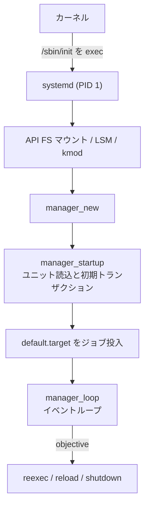
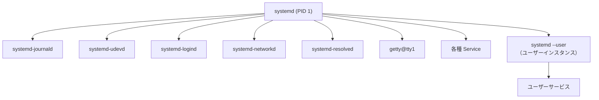

# 第1章 systemd の全体像とプロセスツリー

> 本章で読むソース
>
> - [`meson.build`](https://github.com/systemd/systemd/blob/v261.1/meson.build#L3-L14)
> - [`src/core/main.c`](https://github.com/systemd/systemd/blob/v261.1/src/core/main.c#L3433-L3470)
> - [`src/core/main.c`](https://github.com/systemd/systemd/blob/v261.1/src/core/main.c#L3486-L3496)
> - [`src/core/main.c`](https://github.com/systemd/systemd/blob/v261.1/src/core/main.c#L3738-L3771)
> - [`src/core/main.c`](https://github.com/systemd/systemd/blob/v261.1/src/core/main.c#L2319-L2337)
> - [`src/core/main.c`](https://github.com/systemd/systemd/blob/v261.1/src/core/main.c#L2742-L2758)
> - [`src/systemd/sd-daemon.h`](https://github.com/systemd/systemd/blob/v261.1/src/systemd/sd-daemon.h#L53-L71)
> - [`src/basic/special.h`](https://github.com/systemd/systemd/blob/v261.1/src/basic/special.h#L4-L4)

## この章の狙い

systemd がどのようなプログラム群から構成され、起動後にどのようなプロセスツリーを形成するのかを把握する。
本書全体の地図として、PID 1 のマネージャーを中心に据え、主要デーモンとソースツリーの対応を示す。

## 前提

読者は Linux の起動が「カーネルが最初のユーザー空間プロセス（PID 1）を実行する」ところから始まることを理解していることを前提とする。
プロセスの `fork`/`exec`、ファイルディスクリプタ、シグナルの基本も既知とする。

## systemd とは何か

systemd は Linux のシステムとサービスを管理するスイートである。
中核は PID 1 として動作する init であり、ユニットと呼ばれる宣言的な設定単位に基づいてサービス、マウント、ソケット、デバイスなどを起動し、依存関係に従って順序づける。
本書が対象とするバージョンは 261.1（タグ `v261.1`）である。

バージョンはビルド定義に固定されている。

[`meson.build` L3-L14](https://github.com/systemd/systemd/blob/v261.1/meson.build#L3-L14)

```meson
project('systemd', 'c',
        version : files('meson.version'),
        license : 'LGPLv2+',
        default_options: [
                'c_std=gnu17',
                'prefix=/usr',
                'sysconfdir=/etc',
                'localstatedir=/var',
                'warning_level=2',
        ],
        meson_version : '>= 0.62.0',
)
```

systemd の設計思想は、従来の SysV init が抱えていた二つの弱点への回答として理解できる。
一つは起動の直列性である。
SysV init はスクリプトを番号順に逐次実行するため、独立したサービスも直列に並んで起動が遅くなる。
systemd はソケットとバスの活性化を使い、依存が満たされたユニットを並行して起動する。
もう一つは状態の追跡である。
systemd は各サービスのプロセスを cgroup に閉じ込め、二重フォークした子孫プロセスも取りこぼさずに管理下に置く。

## 主要バイナリ

systemd スイートは多数の実行ファイルからなる。
本書で扱う中心的なものを役割ごとに挙げる。

**`systemd`**（PID 1、システムとサービスのマネージャー）。
ユニットの読み込み、依存関係の解決、ジョブの実行、プロセスの監視を担う中核である。
ソースは `src/core/` にあり、エントリポイントは `src/core/main.c` の `main` 関数である。

**`systemctl`**（マネージャーを制御するコマンドラインクライアント）。
サービスの起動や停止や有効化、状態照会を行う。
`systemd` とは D-Bus 越しに通信する。
ソースは `src/systemctl/` にある。

**`systemd-journald`**（構造化ログの収集デーモン）。
サービスの標準出力やカーネルメッセージを受け取り、インデックス付きバイナリ形式で保存する。
ソースは `src/journal/` にあり、閲覧クライアントは `journalctl`（`src/journal/journalctl.c`）である。

**`systemd-udevd`**（デバイスマネージャー）。
カーネルの uevent を受け取り、デバイスノードの生成やルールに基づく属性付与を行う。
ソースは `src/udev/`（デーモンは `src/udev/udevd.c`）にある。

**`systemd-networkd`**（ネットワーク設定デーモン）。
リンクやアドレス、ルートを宣言的に構成する。
ソースは `src/network/`（デーモンは `src/network/networkd.c`）にある。

**`systemd-resolved`**（名前解決デーモン）。
DNS、LLMNR、mDNS を統合して問い合わせに応える。
ソースは `src/resolve/`（デーモンは `src/resolve/resolved.c`）にある。

**`systemd-logind`**（ログインとセッションの管理デーモン）。
ユーザーセッション、シート、電源操作の権限を管理する。
ソースは `src/login/`（デーモンは `src/login/logind.c`）にある。

これらのデーモンは、いずれも PID 1 が起動して監視する通常のサービスである。
PID 1 だけが特別な init プロセスであり、残りは Service ユニットとして管理される。

## ソースツリーの構成

`src/` の主要ディレクトリは次の層に分かれる。

| パス | 役割 |
|------|------|
| `src/fundamental/` | カーネルと共有できる最小依存のコード（EFI スタブでも使う） |
| `src/basic/` | 文字列やハッシュマップなど基礎ライブラリ。静的にリンクされる |
| `src/shared/` | basic の上に立つ共有ライブラリ。ユニットのインストールなど上位機能 |
| `src/libsystemd/` | 公開ライブラリ `libsystemd`（`sd-event`、`sd-bus`、`sd-daemon` など） |
| `src/core/` | PID 1 本体。マネージャー、ユニット、ジョブ、各ユニット種別 |
| `src/systemctl/` | 制御クライアント |
| `src/journal/`, `src/udev/`, `src/network/`, `src/resolve/`, `src/login/` | 各デーモン |

依存の向きは `fundamental` を底として、`basic` → `shared` → 各実行ファイルへと一方向に積み上がる。
公開 API である `libsystemd` は `src/systemd/` にヘッダを置き、外部プログラムからも利用できる。
たとえばソケットアクティベーションで渡されるファイルディスクリプタの受け取り方は `sd-daemon.h` に定義される。

[`src/systemd/sd-daemon.h` L53-L71](https://github.com/systemd/systemd/blob/v261.1/src/systemd/sd-daemon.h#L53-L71)

```c
/* The first passed file descriptor is fd 3 */
#define SD_LISTEN_FDS_START 3

/*
  Returns how many file descriptors have been passed, or a negative
  errno code on failure. Optionally, removes the $LISTEN_FDS,
  $LISTEN_PID, $LISTEN_PIDFDID, and $LISTEN_FDNAMES variables from the
  environment (recommended, but problematic in threaded environments).
  ...
*/
int sd_listen_fds(int unset_environment);
```

## PID 1 の起動フロー

`main` 関数は最初にタイムスタンプを取り、自分が PID 1 かどうかで動作を大きく分ける。

[`src/core/main.c` L3433-L3470](https://github.com/systemd/systemd/blob/v261.1/src/core/main.c#L3433-L3470)

```c
int main(int argc, char *argv[]) {
        ...
        /* Take timestamps early on */
        dual_timestamp_from_monotonic(&kernel_timestamp, 0);
        dual_timestamp_now(&userspace_timestamp);

        /* Figure out whether we need to do initialize the system, or if we already did that because we are
         * reexecuting. */
        skip_setup = early_skip_setup_check(argc, argv);

        /* If we get started via the /sbin/init symlink then we are called 'init'. After a subsequent
         * reexecution we are then called 'systemd'. ... */
        program_invocation_short_name = systemd;
        (void) prctl(PR_SET_NAME, systemd);
```

PID 1 として起動されると、システム全体の初期化を引き受ける。

[`src/core/main.c` L3486-L3496](https://github.com/systemd/systemd/blob/v261.1/src/core/main.c#L3486-L3496)

```c
        if (getpid_cached() == 1) {
                /* When we run as PID 1 force system mode */
                arg_runtime_scope = RUNTIME_SCOPE_SYSTEM;

                /* Disable the umask logic */
                umask(0);

                /* Make sure that at least initially we do not ever log to journald/syslogd, because it might
                 * not be activated yet (even though the log socket for it exists). */
                log_set_prohibit_ipc(true);
```

PID 1 の初期化では、早期 API ファイルシステム（`/proc`、`/sys`、`/dev`）のマウント、セキュリティ機構（SELinux などの LSM）の読み込み、カーネルモジュールのロードが順に行われる。
この段階では journald がまだ動いていないため、ログはカーネルのリングバッファ（`/dev/kmsg`）に出す。
ユーザーインスタンスとして起動された場合は、これらのシステム初期化を飛ばして `RUNTIME_SCOPE_USER` で動く。

初期化を終えると、マネージャーオブジェクトを確保して起動する。

[`src/core/main.c` L3738-L3771](https://github.com/systemd/systemd/blob/v261.1/src/core/main.c#L3738-L3771)

```c
        r = manager_new(arg_runtime_scope,
                        arg_action == ACTION_TEST ? MANAGER_TEST_FULL : 0,
                        &m);
        ...
        set_manager_defaults(m);
        set_manager_settings(m);
        manager_set_first_boot(m, first_boot);
        manager_set_switching_root(m, arg_switched_root);

        /* Remember whether we should queue the default job */
        queue_default_job = !arg_serialization || arg_switched_root;

        before_startup = now(CLOCK_MONOTONIC);

        r = manager_startup(m, arg_serialization, fds, named_listen_fds, /* root= */ NULL);
```

`manager_startup` はユニットファイルを読み込み、初期トランザクションを構築する。
その後、既定の起動先ユニットをジョブとして投入する。

[`src/core/main.c` L2742-L2758](https://github.com/systemd/systemd/blob/v261.1/src/core/main.c#L2742-L2758)

```c
        if (arg_default_unit)
                unit = arg_default_unit;
        else if (in_initrd())
                unit = SPECIAL_INITRD_TARGET;
        else
                unit = SPECIAL_DEFAULT_TARGET;

        log_debug("Activating default unit: %s", unit);

        r = manager_load_startable_unit_or_warn(m, unit, NULL, &target);
```

既定の起動先は `default.target` である。

[`src/basic/special.h` L4](https://github.com/systemd/systemd/blob/v261.1/src/basic/special.h#L4-L4)

```c
#define SPECIAL_DEFAULT_TARGET "default.target"
```

`default.target` は通常 `graphical.target` か `multi-user.target` へのシンボリックリンクである。
このターゲットを起動する要求が、依存する `sysinit.target`、`basic.target`、各サービスを芋づる式に引き込み、ブート全体を駆動する。

起動処理が終わると、`main` はメインループへ入る。

[`src/core/main.c` L2319-L2337](https://github.com/systemd/systemd/blob/v261.1/src/core/main.c#L2319-L2337)

```c
        for (;;) {
                int objective = manager_loop(m);
                if (objective < 0) {
                        *ret_error_message = "Failed to run main loop";
                        return log_struct_errno(LOG_EMERG, objective,
                                                LOG_MESSAGE("Failed to run main loop: %m"),
                                                LOG_MESSAGE_ID(SD_MESSAGE_CORE_MAINLOOP_FAILED_STR));
                }
                ...
```

`manager_loop` はイベントループを回し続け、リロード、再実行、シャットダウンなどの「目的」（objective）を返したときにだけ抜ける。
リロードや再実行では設定を読み直して同じループに戻り、シャットダウン系では後始末に進む。

ブート全体の流れを図にすると次のようになる。



## 起動後のプロセスツリー

PID 1 は、依存関係に従ってサービスを起動する。
各サービスは PID 1 から `fork` + `exec` され、専用の cgroup に配置される。
journald、udevd、logind、networkd、resolved などのデーモンも、この仕組みで起動される通常のサービスである。



ユーザーごとのセッションでは、PID 1 が `systemd --user` をそのユーザー権限で起動する。
ユーザーインスタンスはシステムインスタンスと同じ `src/core/` のコードで動くが、`RUNTIME_SCOPE_USER` として振る舞い、ユーザー自身のユニットだけを管理する。

## 最適化の工夫：cgroup によるプロセス追跡

サービスのプロセス管理で systemd が採る機構が、cgroup を使ったグループ単位の追跡である。
従来の init はサービスが二重フォークで親から切り離されると、そのデーモンプロセスを見失いやすかった。
systemd は各サービスを固有の cgroup に入れるため、サービスが何回フォークしても、生成された全プロセスは同じ cgroup に属し続ける。
サービスを停止するときは cgroup 内の全プロセスへまとめてシグナルを送れるので、取り残しのプロセスを残さずに確実に終了させられる。
プロセスの帰属をカーネルの階層構造で判定できる点が、PID をたどる方式より速く確実である理由である。

## まとめ

systemd は PID 1 のマネージャーを中心に、journald、udevd、logind、networkd、resolved などのデーモンを通常のサービスとして起動して監視するスイートである。
PID 1 は API ファイルシステムのマウントとセキュリティ初期化を済ませてからマネージャーを構築し、`default.target` をジョブとして投入してブートを駆動する。
その後はイベントループに入り、リロードや再実行、シャットダウンの目的を受けたときだけループを抜ける。
ソースツリーは `fundamental` → `basic` → `shared` → 各実行ファイルという一方向の依存で積み上がり、cgroup によってサービスのプロセスをグループ単位で確実に追跡する。

## 関連する章

- 第2章（ユニットファイルと依存関係モデル）
- 第4章（sd-event イベントループ）
- 第5章（sd-bus と D-Bus 連携）
