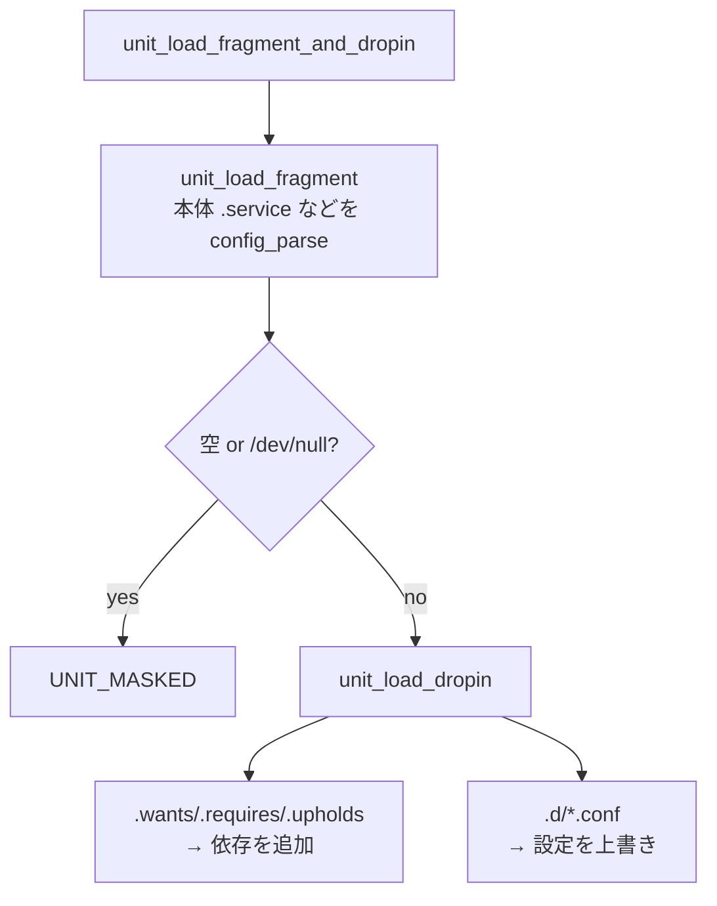

# 第2章 ユニットファイルと依存関係モデル

> 本章で読むソース
>
> - [`src/basic/unit-def.h`](https://github.com/systemd/systemd/blob/v261.1/src/basic/unit-def.h#L9-L24)
> - [`src/basic/unit-def.h`](https://github.com/systemd/systemd/blob/v261.1/src/basic/unit-def.h#L221-L277)
> - [`src/core/load-fragment.c`](https://github.com/systemd/systemd/blob/v261.1/src/core/load-fragment.c#L6113-L6201)
> - [`src/core/load-fragment.c`](https://github.com/systemd/systemd/blob/v261.1/src/core/load-fragment.c#L249-L304)
> - [`src/core/unit.c`](https://github.com/systemd/systemd/blob/v261.1/src/core/unit.c#L1438-L1478)
> - [`src/core/load-dropin.c`](https://github.com/systemd/systemd/blob/v261.1/src/core/load-dropin.c#L109-L150)
> - [`src/shared/install.c`](https://github.com/systemd/systemd/blob/v261.1/src/shared/install.c#L1391-L1398)
> - [`src/shared/install.c`](https://github.com/systemd/systemd/blob/v261.1/src/shared/install.c#L2033-L2120)

## この章の狙い

ユニットファイルがどのような構造を持ち、systemd が依存関係と順序をどのモデルで表すのかを理解する。
`Requires` や `Wants`、`After` や `Before` の違いを、コードが読み込む過程に沿って把握する。

## 前提

第1章で PID 1 のマネージャーがユニットを読み込んでブートを駆動することを見た。
本章はその「ユニット」の中身に踏み込む。
ユニットファイルが INI 形式のテキストであること、`systemctl enable` でサービスを有効化することは既知とする。

## ユニットの種別

ユニットは管理対象の種類ごとに型を持つ。
型の一覧は `UnitType` として定義される。

[`src/basic/unit-def.h` L9-L24](https://github.com/systemd/systemd/blob/v261.1/src/basic/unit-def.h#L9-L24)

```c
typedef enum UnitType {
        UNIT_SERVICE,
        UNIT_MOUNT,
        UNIT_SWAP,
        UNIT_SOCKET,
        UNIT_TARGET,
        UNIT_DEVICE,
        UNIT_AUTOMOUNT,
        UNIT_TIMER,
        UNIT_PATH,
        UNIT_SLICE,
        UNIT_SCOPE,
        _UNIT_TYPE_MAX,
        _UNIT_TYPE_INVALID = -EINVAL,
        _UNIT_TYPE_ERRNO_MAX = -ERRNO_MAX, /* Ensure the whole errno range fits into this enum */
} UnitType;
```

型はファイル名の拡張子で決まる。
`foo.service` は Service、`foo.socket` は Socket、`foo.target` は Target である。
Service は実際にプロセスを起動する型、Target は複数のユニットをまとめる同期点の型、Socket はソケットアクティベーションのための待ち受け口を表す型である。
Device はカーネルの udev が公開するデバイスに対応し、Mount と Automount はマウントポイントを、Slice と scope は cgroup 階層上の資源管理単位を表す。

## ユニットファイルのセクション

ユニットファイルは INI 形式で、セクションに設定キーを並べる。
セクションは大きく三つに分かれる。

- **`[Unit]`**：型に依存しない共通設定であり、説明文や依存関係や順序を書く。
- **型固有セクション**（`[Service]`、`[Socket]`、`[Mount]` など）：その型だけが解釈する設定を書く。
- **`[Install]`**：`systemctl enable` が使う有効化情報であり、ランタイムのマネージャーは読まない。

どのセクションのどのキーをどの関数で解釈するかは、型ごとの設定テーブルで決まる。
`unit_load_fragment` がユニットファイルを開き、その型のセクション定義を渡して `config_parse` を呼ぶ。

[`src/core/load-fragment.c` L6113-L6201](https://github.com/systemd/systemd/blob/v261.1/src/core/load-fragment.c#L6113-L6201)

```c
int unit_load_fragment(Unit *u) {
        ...
        r = unit_file_find_fragment(u->manager->unit_id_map,
                                    u->manager->unit_name_map,
                                    u->id,
                                    &fragment,
                                    &names);
        ...
                if (null_or_empty(&st)) {
                        /* Unit file is masked */
                        u->load_state = u->perpetual ? UNIT_LOADED : UNIT_MASKED;
                        ...
                } else {
                        ...
                        /* Now, parse the file contents */
                        r = config_parse(u->id, fragment, f,
                                         UNIT_VTABLE(u)->sections,
                                         config_item_perf_lookup, load_fragment_gperf_lookup,
                                         0,
                                         u,
                                         NULL);
```

ファイルが空か `/dev/null` へのシンボリックリンクであれば、そのユニットは「マスク」されたとみなされ、起動できなくなる。
`systemctl mask` はこの空リンクを作ることで実現される。

## 依存関係の型

`[Unit]` セクションに書く依存関係は、内部では `UnitDependency` の値に対応づけられる。

[`src/basic/unit-def.h` L221-L277](https://github.com/systemd/systemd/blob/v261.1/src/basic/unit-def.h#L221-L277)

```c
typedef enum UnitDependency {
        /* Positive dependencies */
        UNIT_REQUIRES,
        UNIT_REQUISITE,
        UNIT_WANTS,
        UNIT_BINDS_TO,
        UNIT_PART_OF,
        UNIT_UPHOLDS,

        /* Inverse of the above */
        UNIT_REQUIRED_BY,             /* inverse of 'requires' is 'required_by' */
        ...
        /* Order */
        UNIT_BEFORE,                  /* inverse of 'before' is 'after' and vice versa */
        UNIT_AFTER,
        ...
} UnitDependency;
```

依存関係の設計で重要なのは、要求と順序が直交していることである。
`Requires` は「この二つを一緒に起動する」という要求の関係であり、どちらを先に起動するかは指定しない。
`After` と `Before` は起動の順序だけを指定し、一緒に起動するかどうかには関与しない。
両方を書いてはじめて「A を起動するとき B も起動し、しかも B を先に立ち上げる」という意図になる。

主な正の依存関係の違いは次の通りである。

- **`Requires`**：依存先が起動に失敗すると自分も起動を取りやめる強い要求である。
- **`Wants`**：依存先を一緒に起動しようとするが、失敗しても自分は起動を続ける弱い要求である。
- **`Requisite`**：依存先がすでに起動済みでなければ失敗し、自分では起動しない。
- **`BindsTo`**：`Requires` に加え、依存先が停止すると自分も停止する、より強い束縛である。

依存関係を書いた行は `config_parse_unit_deps` が解釈する。
`ltype` に依存の型（`UNIT_REQUIRES` など）が渡され、値を空白で区切って一つずつ依存として登録する。

[`src/core/load-fragment.c` L249-L304](https://github.com/systemd/systemd/blob/v261.1/src/core/load-fragment.c#L249-L304)

```c
        UnitDependency d = ltype;
        Unit *u = userdata;

        assert(filename);
        assert(lvalue);
        assert(rvalue);

        for (const char *p = rvalue;;) {
                _cleanup_free_ char *word = NULL, *k = NULL;
                int r;

                r = extract_first_word(&p, &word, NULL, EXTRACT_RETAIN_ESCAPE);
                if (r == 0)
                        return 0;
                // ... (中略) ...
                r = unit_add_dependency_by_name(u, d, k, true, UNIT_DEPENDENCY_FILE);
                if (r < 0)
                        log_syntax(unit, LOG_WARNING, filename, line, r, "Failed to add dependency on %s, ignoring: %m", k);
        }
```

依存を登録するとき、逆向きの関係も同時に張られる。
`A` が `Requires=B` を持つなら、`B` 側には `UNIT_REQUIRED_BY` が自動で追加される。
この双方向のリンクにより、依存元と依存先のどちらからでも関係をたどれる。

## フラグメントとドロップイン

ユニットの読み込みは、本体ファイル（フラグメント）とドロップインの二段構えである。
`unit_load_fragment_and_dropin` が両者を順に呼ぶ。

[`src/core/unit.c` L1438-L1478](https://github.com/systemd/systemd/blob/v261.1/src/core/unit.c#L1438-L1478)

```c
int unit_load_fragment_and_dropin(Unit *u, bool fragment_required) {
        int r;
        ...
        /* Load a .{service,socket,...} file */
        r = unit_load_fragment(u);
        ...
        /* Load drop-in directory data. ... */
        r = unit_load_dropin(u);
        if (r < 0)
                return r;
```

ドロップインは、ユニット名に `.d` を付けたディレクトリ（例 `foo.service.d/`）に置く `.conf` 断片である。
本体ファイルを書き換えずに設定を上書きしたり追加したりできる。

[`src/core/load-dropin.c` L109-L150](https://github.com/systemd/systemd/blob/v261.1/src/core/load-dropin.c#L109-L150)

```c
int unit_load_dropin(Unit *u) {
        _cleanup_strv_free_ char **l = NULL;
        int r;

        /* Load dependencies from .wants, .requires and .upholds directories */
        r = process_deps(u, UNIT_WANTS, ".wants");
        ...
        r = process_deps(u, UNIT_REQUIRES, ".requires");
        ...
        /* Load .conf dropins */
        r = unit_find_dropin_paths(u, /* use_unit_path_cache= */ true, &l);
        ...
        STRV_FOREACH(f, u->dropin_paths) {
                struct stat st;
                r = config_parse(u->id, *f, NULL,
                                 UNIT_VTABLE(u)->sections,
                                 config_item_perf_lookup, load_fragment_gperf_lookup,
                                 0, u, &st);
```

`unit_load_dropin` は二種類のドロップインを扱う。
一つは `.wants`、`.requires`、`.upholds` という名前のディレクトリで、中のシンボリックリンクが依存関係を表す。
もう一つは `.conf` 断片で、本体ファイルと同じパーサ（`config_parse`）で読み、後から読んだ値が前の値を上書きする。

読み込みの全体像は次のようになる。



## `[Install]` セクションと有効化

`[Install]` セクションは、ランタイムのマネージャーではなく `systemctl enable` が読む。
解釈対象のキーは次のテーブルで定義される。

[`src/shared/install.c` L1391-L1398](https://github.com/systemd/systemd/blob/v261.1/src/shared/install.c#L1391-L1398)

```c
        const ConfigTableItem items[] = {
                { "Install", "Alias",           config_parse_alias,            0, &info->aliases           },
                { "Install", "WantedBy",        config_parse_strv,             0, &info->wanted_by         },
                { "Install", "RequiredBy",      config_parse_strv,             0, &info->required_by       },
                { "Install", "UpheldBy",        config_parse_strv,             0, &info->upheld_by         },
                { "Install", "DefaultInstance", config_parse_default_instance, 0, info                     },
                { "Install", "Also",            config_parse_also,             0, ctx                      },
                {}
        };
```

`WantedBy=multi-user.target` を持つサービスを有効化すると、`multi-user.target.wants/` の中にそのサービスへのシンボリックリンクが作られる。
このリンクこそが、先ほどの `unit_load_dropin` が `.wants` ディレクトリから読み取る依存の実体である。

[`src/shared/install.c` L2033-L2120](https://github.com/systemd/systemd/blob/v261.1/src/shared/install.c#L2033-L2120)

```c
static int install_info_symlink_wants(
                RuntimeScope scope,
                UnitFileFlags file_flags,
                InstallInfo *info,
                const LookupPaths *lp,
                const char *config_path,
                char **list,
                const char *suffix,
                InstallChange **changes,
                size_t *n_changes) {
        // ... (中略) ...
        STRV_FOREACH(s, list) {
                _cleanup_free_ char *path = NULL, *dst = NULL;
                // ... (中略) ...
                path = strjoin(config_path, "/", dst, suffix, n);
                if (!path)
                        return -ENOMEM;

                q = create_symlink(lp, info->path, path, /* force= */ true, changes, n_changes);
```

有効化はユニットファイルを書き換えず、シンボリックリンクの作成だけで表現される。
無効化は同じリンクを消すだけで済む。
`[Install]` の情報がランタイムの依存グラフに直接反映されるのではなく、ファイルシステム上のリンクを経由して次回読み込み時に依存へ変換される点が、この二段構えの要である。

## 最適化の工夫：ユニット名マップのキャッシュ

ユニットの探索で systemd が効かせる機構が、ユニット名からファイルパスへのマップのキャッシュである。
systemd は複数のディレクトリ（`/etc/systemd/system`、`/run/systemd/system`、`/usr/lib/systemd/system` など）を優先順位付きで探索する。
ユニットを読み込むたびに全ディレクトリを走査すると、数百のユニットを扱うブート時に無駄が大きい。
`unit_load_fragment` は探索の前に `unit_file_build_name_map` を呼び、`unit_cache_timestamp_hash` でディレクトリ群のタイムスタンプを確認する。
ハッシュが前回と変わっていなければマップを再構築せず、キャッシュ済みの `unit_id_map` から直接パスを引く。
ディレクトリの変更がないときはファイルシステムの走査を丸ごと省けるため、依存解決で同じユニットを繰り返し参照しても探索コストが積み上がらない。

## まとめ

ユニットは種別（Service、Target、Socket など）ごとに型を持ち、`[Unit]`、型固有、`[Install]` の三種のセクションで設定される。
依存関係は要求（`Requires`、`Wants` など）と順序（`After`、`Before`）が直交して表現され、登録時に逆向きの関係も自動で張られる。
読み込みは本体フラグメントとドロップインの二段構えで、ドロップインは依存を追加する `.wants` 系ディレクトリと設定を上書きする `.conf` 断片からなる。
`systemctl enable` は `[Install]` の指定に従ってシンボリックリンクを作り、それが次回読み込み時に依存へ変換される。

## 関連する章

- 第1章（systemd の全体像とプロセスツリー）
- 第7章（ユニットの状態遷移とロード）
- 第8章（ジョブとトランザクション）
