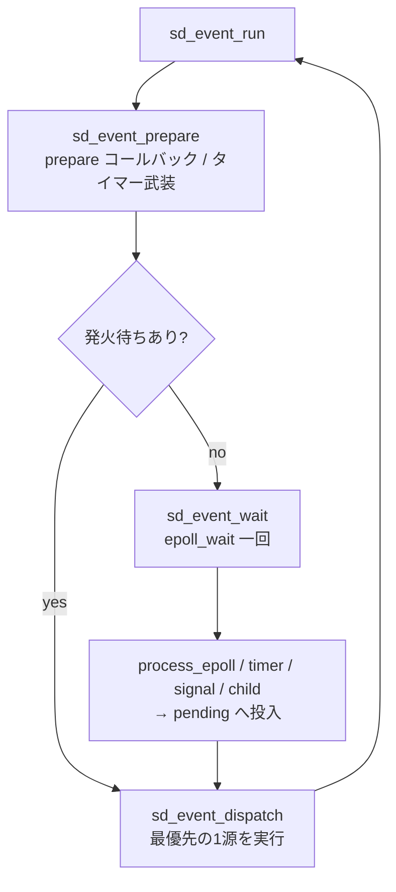

# 第4章 sd-event イベントループ

> 本章で読むソース
>
> - [`src/libsystemd/sd-event/sd-event.c`](https://github.com/systemd/systemd/blob/v261.1/src/libsystemd/sd-event/sd-event.c#L116-L186)
> - [`src/libsystemd/sd-event/event-source.h`](https://github.com/systemd/systemd/blob/v261.1/src/libsystemd/sd-event/event-source.h#L153-L169)
> - [`src/libsystemd/sd-event/sd-event.c`](https://github.com/systemd/systemd/blob/v261.1/src/libsystemd/sd-event/sd-event.c#L508-L530)
> - [`src/libsystemd/sd-event/sd-event.c`](https://github.com/systemd/systemd/blob/v261.1/src/libsystemd/sd-event/sd-event.c#L199-L223)
> - [`src/libsystemd/sd-event/sd-event.c`](https://github.com/systemd/systemd/blob/v261.1/src/libsystemd/sd-event/sd-event.c#L4553-L4624)
> - [`src/libsystemd/sd-event/sd-event.c`](https://github.com/systemd/systemd/blob/v261.1/src/libsystemd/sd-event/sd-event.c#L4666-L4708)
> - [`src/libsystemd/sd-event/sd-event.c`](https://github.com/systemd/systemd/blob/v261.1/src/libsystemd/sd-event/sd-event.c#L4926-L4998)

## この章の狙い

`libsystemd` が提供する汎用イベントループ `sd-event` を読む。
PID 1 のマネージャーも各デーモンも、このループの上で動く。
epoll をどう包み、多様なイベントソースをどう一つのループに束ねるのか、そして優先度とタイマーをどう扱うのかを把握する。

## 前提

読者は `epoll_wait`、`timerfd`、`signalfd`、`pidfd` などの Linux のイベント通知機構を知っていることを前提とする。
第3章で見た Hashmap と、優先度付きキュー（`Prioq`、二分ヒープ）の概念を用いる。

## sd-event が解く問題

サーバプログラムは、ファイルディスクリプタの読み書き可能、タイマーの満了、シグナルの受信、子プロセスの終了といった多様なイベントを一つのループで待ち受ける。
Linux ではこれらをすべてファイルディスクリプタに写像でき、`epoll` で束ねられる。
`sd-event` はその写像とディスパッチを引き受け、利用者はイベントソース（event source）を登録してコールバックを書くだけで済む。

## sd_event オブジェクトの構造

イベントループの状態は `struct sd_event` に集約される。

[`src/libsystemd/sd-event/sd-event.c` L116-L186](https://github.com/systemd/systemd/blob/v261.1/src/libsystemd/sd-event/sd-event.c#L116-L186)

```c
struct sd_event {
        unsigned n_ref;

        int epoll_fd;
        int watchdog_fd;

        Prioq *pending;
        Prioq *prepare;

        /* timerfd_create() only supports these five clocks so far. ... */
        struct clock_data realtime;
        struct clock_data boottime;
        struct clock_data monotonic;
        struct clock_data realtime_alarm;
        struct clock_data boottime_alarm;
        ...
        sd_event_source **signal_sources; /* indexed by signal number */
        Hashmap *signal_data; /* indexed by priority */

        Hashmap *child_sources;
        ...
        struct epoll_event *event_queue;

        LIST_HEAD(sd_event_source, sources);
        ...
};
```

中心にあるのは一つの `epoll_fd` である。
すべてのイベントソースは、最終的にこの epoll に登録されたファイルディスクリプタへ集約される。
`pending` は発火待ちのイベントソースを優先度順に並べる優先度付きキューである。
`signal_sources` はシグナル番号で引く配列、`child_sources` は監視中の子プロセスの Hashmap で、種類ごとに引きやすい索引を用意している。

## イベントソースの種類

登録できるイベントソースには、I/O（ファイルディスクリプタ）、五種のタイマー、シグナル、子プロセス、コールバック後処理（post）、終了時（exit）、inotify、リソース圧（pressure）がある。
それぞれ専用の登録関数（`sd_event_add_io`、`sd_event_add_time`、`sd_event_add_signal`、`sd_event_add_child` など）を持つ。
I/O イベントソースの登録は、渡されたファイルディスクリプタを epoll に加えるだけである。

[`src/libsystemd/sd-event/sd-event.c` L508-L530](https://github.com/systemd/systemd/blob/v261.1/src/libsystemd/sd-event/sd-event.c#L508-L530)

```c
static int source_io_register(
                sd_event_source *s,
                int enabled,
                uint32_t events) {
        ...
        struct epoll_event ev = {
                .events = events | (enabled == SD_EVENT_ONESHOT ? EPOLLONESHOT : 0),
                .data.ptr = s,
        };

        if (epoll_ctl(s->event->epoll_fd,
                      s->io.registered ? EPOLL_CTL_MOD : EPOLL_CTL_ADD,
                      s->io.fd, &ev) < 0)
                return -errno;

        s->io.registered = true;

        return 0;
}
```

登録の要は `ev.data.ptr = s` である。
epoll のイベントに、そのイベントソースオブジェクト自身へのポインタを結びつける。
`epoll_wait` が返したイベントから、追加の探索なしにどのイベントソースかを直接引ける。
シグナルは `signalfd`、子プロセスは `pidfd`、タイマーは `timerfd` という形で、いずれもファイルディスクリプタに写して同じ epoll に載せる。

## 優先度の扱い

各イベントソースは整数の優先度を持ち、値が小さいほど先に処理される。
発火待ちのキュー `pending` はこの優先度で順序づけられる。

[`src/libsystemd/sd-event/sd-event.c` L199-L223](https://github.com/systemd/systemd/blob/v261.1/src/libsystemd/sd-event/sd-event.c#L199-L223)

```c
static int pending_prioq_compare(const void *a, const void *b) {
        const sd_event_source *x = a, *y = b;
        int r;
        ...
        /* Enabled ones first */
        r = CMP(x->enabled == SD_EVENT_OFF, y->enabled == SD_EVENT_OFF);
        if (r != 0)
                return r;

        /* Non rate-limited ones first. */
        r = CMP(!!x->ratelimited, !!y->ratelimited);
        if (r != 0)
                return r;

        /* Lower priority values first */
        r = CMP(x->priority, y->priority);
        if (r != 0)
                return r;

        /* Older entries first */
        return CMP(x->pending_iteration, y->pending_iteration);
}
```

比較は多段である。
無効な源と レート制限中の源を後ろに回し、次に優先度の小さい順、同じ優先度なら発火した反復（iteration）の古い順に並べる。
同一優先度で古いものを先に出すことで、同じ優先度のイベントが飢餓に陥らない。

## ループの一反復

ループの一回転は、準備（prepare）、待機（wait）、ディスパッチ（dispatch）の三段からなる。
`sd_event_run` がこの三つを順に呼ぶ。

[`src/libsystemd/sd-event/sd-event.c` L4926-L4998](https://github.com/systemd/systemd/blob/v261.1/src/libsystemd/sd-event/sd-event.c#L4926-L4998)

```c
_public_ int sd_event_run(sd_event *e, uint64_t timeout) {
        int r;
        ...
        r = sd_event_prepare(e);
        if (r == 0)
                /* There was nothing? Then wait... */
                r = sd_event_wait(e, timeout);
        ...
        if (r > 0) {
                /* There's something now, then let's dispatch it */
                r = sd_event_dispatch(e);
                if (r < 0)
                        return r;

                return 1;
        }

        return r;
}

_public_ int sd_event_loop(sd_event *e) {
        ...
        while (e->state != SD_EVENT_FINISHED) {
                r = sd_event_run(e, UINT64_MAX);
                if (r < 0)
                        return r;
        }

        return e->exit_code;
}
```

`sd_event_prepare` は各源の prepare コールバックを呼び、タイマーを再武装（arm）し、すでに発火待ちの源があるかを確認する。

[`src/libsystemd/sd-event/sd-event.c` L4553-L4624](https://github.com/systemd/systemd/blob/v261.1/src/libsystemd/sd-event/sd-event.c#L4553-L4624)

```c
_public_ int sd_event_prepare(sd_event *e) {
        ...
        e->iteration++;

        e->state = SD_EVENT_PREPARING;
        r = event_prepare(e);
        ...
        r = event_arm_timer(e, &e->realtime);
        ...
        if (event_next_pending(e) || e->need_process_child || e->buffered_inotify_data_list)
                goto pending;

        e->state = SD_EVENT_ARMED;
        return 0;
```

準備の段階でタイマーを epoll に載せておくため、待機は `epoll_wait` 一回に集約される。
`sd_event_wait` はその `epoll_wait` を呼び、返ってきたイベントをイベントソースへ振り分ける。

[`src/libsystemd/sd-event/sd-event.c` L4666-L4708](https://github.com/systemd/systemd/blob/v261.1/src/libsystemd/sd-event/sd-event.c#L4666-L4708)

```c
static int process_epoll(sd_event *e, usec_t timeout, int64_t threshold, int64_t *ret_min_priority) {
        ...
        n_event_queue = MAX(e->n_sources, 1u);
        if (!GREEDY_REALLOC(e->event_queue, n_event_queue))
                return -ENOMEM;
        ...
        for (;;) {
                r = epoll_wait_usec(
                                e->epoll_fd,
                                e->event_queue,
                                n_event_max,
                                timeout);
                if (r < 0)
                        return r;
                ...
```

`epoll_wait` が返したイベントは `pending` キューに積まれ、`sd_event_dispatch` が優先度順に一つ取り出してコールバックを呼ぶ。
一反復で発火するのは最優先の一つのイベントソースだけで、次の反復でまた準備からやり直す。
これにより、コールバックの中でイベントソースが追加されたり削除されたりしても、キューの状態を毎回作り直して整合を保てる。

反復の全体像を図にする。



## 最適化の工夫：タイマーの合体

`sd-event` が効かせる代表的な機構が、タイマーの合体（coalescing）である。
各クロックは一つの timerfd を共有し、二つの優先度付きキューを持つ。

[`src/libsystemd/sd-event/event-source.h` L153-L169](https://github.com/systemd/systemd/blob/v261.1/src/libsystemd/sd-event/event-source.h#L153-L169)

```c
struct clock_data {
        WakeupType wakeup;
        int fd;

        /* For all clocks we maintain two priority queues each, one
         * ordered for the earliest times the events may be
         * dispatched, and one ordered by the latest times they must
         * have been dispatched. The range between the top entries in
         * the two prioqs is the time window we can freely schedule
         * wakeups in */

        Prioq *earliest;
        Prioq *latest;
        usec_t next;

        bool needs_rearm;
};
```

各タイマー源は「最も早く発火してよい時刻」と「遅くとも発火すべき時刻」の二つを持つ。
`earliest` キューは前者で、`latest` キューは後者で順序づけられる。
両キューの先頭が作る時間の窓の中でなら、timerfd をいつ鳴らすかを自由に選べる。
複数のタイマーの窓が重なっていれば、それらを一度の起床にまとめられる。

一つのクロックあたり timerfd は一つだけで、次の起床時刻だけを設定する点も効く。
数千のタイマーがあっても、カーネルに登録する timerfd は五クロック分に固定される。
窓による合体で起床回数そのものを減らせるため、電力消費と CPU 起床のオーバーヘッドの両方を抑えられる。
利用者は `sd_event_source_set_accuracy` で窓の広さ（許容誤差）を指定でき、精度と省電力を引き換えにできる。

## まとめ

`sd-event` は epoll を中核に、I/O、タイマー、シグナル、子プロセスなど多様なイベントソースを一つのループへ束ねる汎用ループである。
イベントソースは最終的にファイルディスクリプタへ写され、epoll イベントにソースへのポインタを結びつけることで追加探索なしに振り分ける。
一反復は準備と待機とディスパッチの三段からなり、発火待ちを優先度付きキューで並べて最優先の一つのイベントソースだけを処理する。
タイマーはクロックごとに一つの timerfd を共有し、早い時刻と遅い時刻の二キューが作る窓の中で起床を合体させ、起床回数を最小化する。

## 関連する章

- 第3章（fundamental と basic のメモリ管理とデータ構造）
- 第5章（sd-bus と D-Bus 連携）
- 第6章（マネージャーとメインループ）
