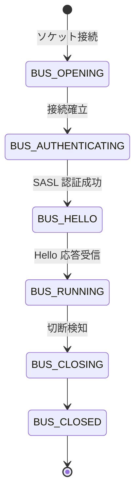

# 第5章 sd-bus と D-Bus 連携

> 本章で読むソース
>
> - [`src/libsystemd/sd-bus/sd-bus.c`](https://github.com/systemd/systemd/blob/v261.1/src/libsystemd/sd-bus/sd-bus.c#L3278-L3342)
> - [`src/libsystemd/sd-bus/sd-bus.c`](https://github.com/systemd/systemd/blob/v261.1/src/libsystemd/sd-bus/sd-bus.c#L3002-L3046)
> - [`src/libsystemd/sd-bus/bus-message.c`](https://github.com/systemd/systemd/blob/v261.1/src/libsystemd/sd-bus/bus-message.c#L1308-L1441)
> - [`src/libsystemd/sd-bus/bus-match.h`](https://github.com/systemd/systemd/blob/v261.1/src/libsystemd/sd-bus/bus-match.h#L6-L29)
> - [`src/libsystemd/sd-bus/bus-match.c`](https://github.com/systemd/systemd/blob/v261.1/src/libsystemd/sd-bus/bus-match.c#L27-L51)
> - [`src/libsystemd/sd-bus/bus-objects.c`](https://github.com/systemd/systemd/blob/v261.1/src/libsystemd/sd-bus/bus-objects.c#L1518-L1567)

## この章の狙い

`libsystemd` に含まれる D-Bus のクライアントとサーバの実装 `sd-bus` を読む。
接続の確立から、メッセージのシリアライズ、受信メッセージの振り分け、マッチルールによるシグナル購読までを追う。
`systemctl` が PID 1 と話すときも、この `sd-bus` が使われる。

## 前提

読者は D-Bus の基本概念（バス、サービス名、オブジェクトパス、インターフェース、メソッド、シグナル）を知っていることを前提とする。
第4章の `sd-event` を用いる。
`sd-bus` は `sd-event` に統合でき、バスのファイルディスクリプタをイベントループに載せて非同期に処理できる。

## D-Bus と sd-bus

D-Bus はプロセス間通信のためのメッセージバスである。
クライアントはメソッドを呼び、サービスは応答を返し、状態変化はシグナルとして配信される。
`sd-bus` はこのプロトコルの軽量な実装で、外部依存を持たず、`sd-event` と組み合わせて使える点が libdbus との違いである。

## 接続の状態遷移

バス接続はソケットの確立から順に状態を進める。
`sd_bus_process` が各状態に応じた処理関数へ分岐する。

[`src/libsystemd/sd-bus/sd-bus.c` L3278-L3342](https://github.com/systemd/systemd/blob/v261.1/src/libsystemd/sd-bus/sd-bus.c#L3278-L3342)

```c
static int bus_process_internal(sd_bus *bus, sd_bus_message **ret) {
        ...
        switch (bus->state) {

        case BUS_UNSET:
                return -ENOTCONN;

        case BUS_CLOSED:
                return -ECONNRESET;

        case BUS_WATCH_BIND:
                r = bus_socket_process_watch_bind(bus);
                break;

        case BUS_OPENING:
                r = bus_socket_process_opening(bus);
                break;

        case BUS_AUTHENTICATING:
                r = bus_socket_process_authenticating(bus);
                break;

        case BUS_RUNNING:
        case BUS_HELLO:
                r = process_running(bus, ret);
                ...
        case BUS_CLOSING:
                return process_closing(bus, ret);
        ...
        }
```

接続はソケットを開き（`BUS_OPENING`）、SASL 認証を通し（`BUS_AUTHENTICATING`）、バスに自分のサービス名を登録する `Hello` 呼び出しを済ませて（`BUS_HELLO`）、通常運転（`BUS_RUNNING`）に入る。



`sd_bus_process` は一回の呼び出しで一つの処理を進める非ブロッキング関数である。
処理すべきものがなければ 0 を返し、呼び出し側は `sd_bus_wait`（内部でバスの fd を待つ）で次のイベントまでスリープする。
この設計により、バスの処理をイベントループの一つのイベントソースとして組み込める。

## メッセージのシリアライズ

D-Bus メッセージは、型ごとに定められたアラインメントに従ってバイト列へ直列化される。
基本型の追加は `message_append_basic` が担う。

[`src/libsystemd/sd-bus/bus-message.c` L1308-L1441](https://github.com/systemd/systemd/blob/v261.1/src/libsystemd/sd-bus/bus-message.c#L1308-L1441)

```c
int message_append_basic(sd_bus_message *m, char type, const void *p, const void **stored) {
        ...
        switch (type) {

        case SD_BUS_TYPE_STRING:
                /* To make things easy we'll serialize a NULL string
                 * into the empty string */
                p = strempty(p);

                if (!utf8_is_valid(p))
                        return -EINVAL;

                align = 4;
                sz = 4 + strlen(p) + 1;
                break;
        ...
        case SD_BUS_TYPE_SIGNATURE:
                p = strempty(p);
                ...
                align = 1;
                sz = 1 + strlen(p) + 1;
                break;
        ...
        default:
                align = bus_type_get_alignment(type);
                sz = bus_type_get_size(type);
        }
        ...
        a = message_extend_body(m, align, sz);
        if (!a)
                return -ENOMEM;

        if (IN_SET(type, SD_BUS_TYPE_STRING, SD_BUS_TYPE_OBJECT_PATH)) {
                *(uint32_t*) a = sz - 5;
                memcpy((uint8_t*) a + 4, p, sz - 4);
                ...
        } else if (type == SD_BUS_TYPE_SIGNATURE) {
                *(uint8_t*) a = sz - 2;
                memcpy((uint8_t*) a + 1, p, sz - 1);
                ...
        } else {
                memcpy(a, p, sz);
                ...
        }
```

型ごとにアラインメント（`align`）とサイズ（`sz`）が決まる。
文字列は 4 バイト境界に長さ（`uint32_t`）を置き、その後に本体と終端 NUL を続ける。
シグネチャは長さが 255 以下と決まっているため、長さを 1 バイトで表す。
`message_extend_body` が指定アラインメントまでパディングを詰めてから領域を確保するので、書き込む側はアラインメントを気にせず値を置ける。
シリアライズしながら同時にシグネチャ文字列を組み立てる点も特徴で、送信前に型情報が確定する。

メッセージは複数のメモリ断片（body part）に分けて構築できる。
ファイルディスクリプタを含むメッセージでは、fd 本体は別配列で管理し、メッセージ内には fd の索引だけを `uint32_t` として書く。
実際の fd は補助データ（`SCM_RIGHTS`）としてソケット経由で渡される。

## 受信メッセージの振り分け

`BUS_RUNNING` 状態で受け取ったメッセージは `process_message` が段階的に処理する。

[`src/libsystemd/sd-bus/sd-bus.c` L3002-L3046](https://github.com/systemd/systemd/blob/v261.1/src/libsystemd/sd-bus/sd-bus.c#L3002-L3046)

```c
static int process_message(sd_bus *bus, sd_bus_message *m) {
        ...
        r = process_hello(bus, m);
        if (r != 0)
                goto finish;

        r = process_reply(bus, m);
        if (r != 0)
                goto finish;

        r = process_fd_check(bus, m);
        if (r != 0)
                goto finish;

        r = process_filter(bus, m);
        if (r != 0)
                goto finish;

        r = process_match(bus, m);
        if (r != 0)
                goto finish;

        r = process_builtin(bus, m);
        if (r != 0)
                goto finish;

        r = bus_process_object(bus, m);

finish:
        bus->current_message = NULL;
        return r;
}
```

処理は上から順に試し、どこかが処理を引き受けたら（0 以外を返したら）そこで止める。
まず未処理の `Hello` 応答を捌き、次に自分が出したメソッド呼び出しへの返信（`process_reply`）を対応する待ちに引き当てる。
続いてフィルタとマッチルール（シグナル購読）、標準インターフェース（`process_builtin`）を経て、最後に登録済みオブジェクトのメソッド呼び出しを `bus_process_object` が処理する。

## マッチルールとマッチツリー

シグナルの購読は、送信者やインターフェースなどの条件を並べたマッチルールで表す。
条件の種類は `BusMatchNodeType` で定義される。

[`src/libsystemd/sd-bus/bus-match.h` L6-L29](https://github.com/systemd/systemd/blob/v261.1/src/libsystemd/sd-bus/bus-match.h#L6-L29)

```c
typedef enum BusMatchNodeType {
        BUS_MATCH_ROOT,
        BUS_MATCH_VALUE,
        BUS_MATCH_LEAF,

        /* The following are all different kinds of compare nodes */
        BUS_MATCH_SENDER,
        BUS_MATCH_MESSAGE_TYPE,
        BUS_MATCH_DESTINATION,
        BUS_MATCH_INTERFACE,
        BUS_MATCH_MEMBER,
        BUS_MATCH_PATH,
        BUS_MATCH_PATH_NAMESPACE,
        BUS_MATCH_ARG,
        BUS_MATCH_ARG_LAST = BUS_MATCH_ARG + 63,
        ...
} BusMatchNodeType;
```

複数のマッチルールは平坦なリストではなく、条件を段にした木として保持される。
コード内のコメントが、その木の形を具体例で示している。

[`src/libsystemd/sd-bus/bus-match.c` L27-L51](https://github.com/systemd/systemd/blob/v261.1/src/libsystemd/sd-bus/bus-match.c#L27-L51)

```c
 *  results in this tree:
 *
 *  BUS_MATCH_ROOT
 *  + BUS_MATCH_MESSAGE_TYPE
 *  | ` BUS_MATCH_VALUE: value == signal
 *  |   + DBUS_MATCH_SENDER
 *  |   | + BUS_MATCH_VALUE: value == foo
 *  |   | | ` DBUS_MATCH_INTERFACE
 *  |   | |   ` BUS_MATCH_VALUE: value == bar
 *  |   | |     ` BUS_MATCH_LEAF: A
 *  ...
 *  ` BUS_MATCH_SENDER
 *    ` BUS_MATCH_VALUE: value == miau
 *      ` BUS_MATCH_LEAF: E
 */
```

木は、条件の種類の段（`BUS_MATCH_MESSAGE_TYPE` など）と値の段（`BUS_MATCH_VALUE`）を交互に重ね、葉（`BUS_MATCH_LEAF`）にコールバックを置く。
同じ条件を持つルール同士は木の枝を共有する。

## オブジェクトとメソッド呼び出し

サービス側は、オブジェクトパスごとにインターフェースとメソッドを登録する。
メソッド呼び出しメッセージが届くと、`bus_process_object` が宛先パスから登録ノードを探す。

[`src/libsystemd/sd-bus/bus-objects.c` L1518-L1567](https://github.com/systemd/systemd/blob/v261.1/src/libsystemd/sd-bus/bus-objects.c#L1518-L1567)

```c
int bus_process_object(sd_bus *bus, sd_bus_message *m) {
        ...
        if (m->header->type != SD_BUS_MESSAGE_METHOD_CALL)
                return 0;

        if (hashmap_isempty(bus->nodes))
                return 0;
        ...
        do {
                bus->nodes_modified = false;

                r = object_find_and_run(bus, m, m->path, false, &found_object);
                if (r != 0)
                        return r;

                /* Look for fallback prefixes */
                OBJECT_PATH_FOREACH_PREFIX(prefix, m->path) {
                        ...
                        r = object_find_and_run(bus, m, prefix, true, &found_object);
                        if (r != 0)
                                return r;
                }
        } while (bus->nodes_modified);
```

登録ノードは `bus->nodes` という Hashmap にオブジェクトパスをキーとして格納される。
まず完全一致のパスで探し、見つからなければパスの接頭辞を短くしながらフォールバック登録（サブツリー全体を受け持つハンドラ）を探す。
このフォールバックにより、`/org/freedesktop/systemd1/unit/...` のような可変のパス群を一つのハンドラでまとめて処理できる。

## 最適化の工夫：マッチツリーによる枝の共有

`sd-bus` がシグナル配信で効かせる機構が、マッチルールの木構造である。
PID 1 のような多数のマッチルールを持つプロセスでは、受信シグナルごとに全ルールと総当たりで比較すると、ルール数に比例したコストがかかる。
木は条件の段を共有するため、あるシグナルのメッセージ型が `signal` でなければ、その枝の下にぶら下がる全ルールを一度に枝刈りできる。
共通の接頭条件（型、送信者、インターフェース）を持つルールが多いほど、比較回数が総当たりより大きく減る。
条件のうちハッシュ可能なもの（`BUS_MATCH_CAN_HASH` が真の種類）は子ノードをハッシュで引けるため、同じ段での分岐選択も定数時間に近づく。
値の照合を「木を一度だけ降りる」操作に落とすことで、ルール数が増えても一メッセージあたりのマッチコストを抑えている。

## まとめ

`sd-bus` は外部依存を持たない D-Bus 実装で、接続をソケット確立から認証、`Hello`、通常運転へと状態遷移させる。
メッセージは型ごとのアラインメントに従って直列化され、シグネチャを同時に組み立て、fd は索引化して補助データで渡す。
受信メッセージは返信、フィルタ、マッチ、標準インターフェース、オブジェクトの順に段階処理され、`sd_bus_process` の一回の呼び出しが一つの処理を進める。
マッチルールは条件の段を共有する木として保持され、枝刈りとハッシュ分岐によって多数のルールでもマッチコストを抑える。

## 関連する章

- 第4章（sd-event イベントループ）
- 第6章（マネージャーとメインループ）
- 第7章（ユニットの状態遷移とロード）
