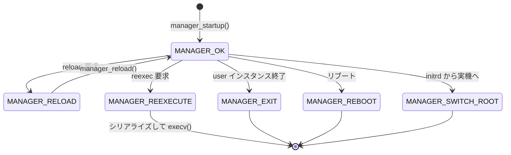

# 第6章 Manager とメインループ

> 本章で読むソース
>
> - [`src/core/manager.h`](https://github.com/systemd/systemd/blob/v261.1/src/core/manager.h)
> - [`src/core/manager.c`](https://github.com/systemd/systemd/blob/v261.1/src/core/manager.c)
> - [`src/core/main.c`](https://github.com/systemd/systemd/blob/v261.1/src/core/main.c)

## この章の狙い

PID 1 として起動した systemd が最初に組み立てるのが**マネージャー**である。
マネージャーはすべてのユニットとジョブを束ねる中心オブジェクトであり、イベントループを回して外界の出来事に反応し続ける。
本章では `main()` の初期化から `manager_new()` によるオブジェクト生成、`manager_startup()` による構成読み込み、`manager_loop()` によるイベント駆動までの全行程を追う。

## 前提

- 第4章の `sd-event`（イベントループ基盤）を理解していること
- 第5章の `sd-bus`（D-Bus 接続）を理解していること
- ユニットとジョブの用語（第2章）を把握していること

## main(): PID 1 のブートストラップ

`src/core/main.c` の `main()` は、カーネルから制御を渡された直後の最初のユーザー空間コードである。

`main()` は自分が PID 1 かどうかで初期化を大きく分岐させる。
`getpid_cached() == 1` のときはシステムモードを強制し、`umask(0)` を設定し、`/proc` や `/sys` などの API ファイルシステムを自力でマウントする。

[`src/core/main.c` L3486-L3599](https://github.com/systemd/systemd/blob/v261.1/src/core/main.c#L3486-L3599)

```c
        if (getpid_cached() == 1) {
                /* When we run as PID 1 force system mode */
                arg_runtime_scope = RUNTIME_SCOPE_SYSTEM;

                /* Disable the umask logic */
                umask(0);
```

ユーザーインスタンスとして起動した場合は `RUNTIME_SCOPE_USER` を設定し、マウントなどのシステム初期化は行わない。

[`src/core/main.c` L3601-L3618](https://github.com/systemd/systemd/blob/v261.1/src/core/main.c#L3601-L3618)

初期化の後半は起動の種類を問わず共通である。
シグナルハンドラをリセットし、設定ファイルとコマンドライン引数をパースし、実行時環境を整える。

[`src/core/main.c` L3729-L3771](https://github.com/systemd/systemd/blob/v261.1/src/core/main.c#L3729-L3771)

```c
        r = manager_new(arg_runtime_scope,
                        arg_action == ACTION_TEST ? MANAGER_TEST_FULL : 0,
                        &m);
        if (r < 0) {
                log_struct_errno(LOG_EMERG, r,
                                 LOG_MESSAGE("Failed to allocate manager object: %m"),
                                 LOG_MESSAGE_ID(SD_MESSAGE_CORE_MANAGER_ALLOCATE_STR));
                error_message = "Failed to allocate manager object";
                goto finish;
        }
```

`manager_new()` でマネージャーを生成し、`manager_startup()` で構成を読み込み、`invoke_main_loop()` でイベントループへ入る。
この三段構えが systemd の起動の骨格である。

`arg_serialization` が存在しない、または `switched_root` の場合にだけ `queue_default_job` を真にする。
再実行（reexec）で引き継いだ状態がある場合はデフォルトジョブを積み直さない。

[`src/core/main.c` L3762-L3781](https://github.com/systemd/systemd/blob/v261.1/src/core/main.c#L3762-L3781)

## manager_new(): 中心オブジェクトの生成

`manager_new()` はマネージャー構造体を確保し、各フィールドを初期値で埋める。

すべてのファイルディスクリプタは `-EBADF` で初期化し、まだ開いていないことを明示する。
`current_job_id` は 1 から始め、0 を「値なし」を表す番兵として空けておく。

[`src/core/manager.c` L909-L949](https://github.com/systemd/systemd/blob/v261.1/src/core/manager.c#L909-L949)

```c
        *m = (Manager) {
                .runtime_scope = runtime_scope,
                .objective = _MANAGER_OBJECTIVE_INVALID,
                .previous_objective = _MANAGER_OBJECTIVE_INVALID,
                // ... (中略) ...
                 /* start as id #1, so that we can leave #0 around as "null-like" value */
                .current_job_id = 1,
```

続いてユニット表などのハッシュマップと、ジョブの実行キューである優先度付きキュー（`run_queue`）を確保する。

[`src/core/manager.c` L970-L1000](https://github.com/systemd/systemd/blob/v261.1/src/core/manager.c#L970-L1000)

```c
        r = hashmap_ensure_allocated(&m->units, &string_hash_ops);
        // ... (中略) ...
        r = prioq_ensure_allocated(&m->run_queue, compare_job_priority);
        if (r < 0)
                return r;

        r = manager_setup_prefix(m);
        // ... (中略) ...
        r = sd_event_default(&m->event);
```

`sd_event_default()` でイベントループを取得したうえで、シグナル、cgroup、時刻変更、`SIGCHLD` などのイベントソースを次々に登録していく。

[`src/core/manager.c` L1002-L1042](https://github.com/systemd/systemd/blob/v261.1/src/core/manager.c#L1002-L1042)

```c
                r = manager_setup_signals(m);
                // ... (中略) ...
                r = manager_setup_cgroup(m);
                // ... (中略) ...
                r = manager_setup_time_change(m);
                // ... (中略) ...
                r = manager_setup_sigchld_event_source(m);
```

通知ソケット（`sd_notify` の受け口）だけはここで作らない。
再実行をまたいでシリアライズされる可能性があるため、`manager_startup()` の脱シリアライズ後にまとめて設定する。

[`src/core/manager.c` L1067-L1072](https://github.com/systemd/systemd/blob/v261.1/src/core/manager.c#L1067-L1072)

## manager_startup(): 構成の読み込みと coldplug

`manager_startup()` は、生成済みのマネージャーに実際の構成を流し込む。

まずジェネレータ（`manager_run_generators()`）を走らせて動的なユニットファイルを生成し、ユニット探索パスを確定する。

[`src/core/manager.c` L2138-L2152](https://github.com/systemd/systemd/blob/v261.1/src/core/manager.c#L2138-L2152)

その後、設定ファイルからユニットを列挙し、再実行時はシリアライズされた状態を復元する。

[`src/core/manager.c` L2169-L2180](https://github.com/systemd/systemd/blob/v261.1/src/core/manager.c#L2169-L2180)

```c
                /* First, enumerate what we can from all config files */
                dual_timestamp_now(m->timestamps + manager_timestamp_initrd_mangle(MANAGER_TIMESTAMP_UNITS_LOAD_START));
                manager_enumerate_perpetual(m);
                manager_enumerate(m);
                // ... (中略) ...
                /* Second, deserialize if there is something to deserialize */
                if (serialization) {
                        r = manager_deserialize(m, serialization, fds);
```

ユニットが揃ったところで通知ソケットや D-Bus 接続などの外部インターフェイスを設定し、`manager_coldplug()` を呼ぶ。

[`src/core/manager.c` L2212-L2241](https://github.com/systemd/systemd/blob/v261.1/src/core/manager.c#L2212-L2241)

```c
                /* We might have deserialized the notify fd, but if we didn't then let's create it now */
                r = manager_setup_notify(m);
                // ... (中略) ...
                /* Connect to the bus if we are good for it */
                manager_setup_bus(m);
                // ... (中略) ...
                /* Third, fire things up! */
                manager_coldplug(m);
```

**coldplug** は、すでに存在している状態（起動途中でカーネルにマウント済みのファイルシステムや、稼働中のプロセスなど）を、各ユニットの状態機械へ反映させる処理である。
再実行後にプロセスを再起動せずに管理を引き継げるのは、この coldplug が既存の実体を状態機械に接続し直すためである。

## manager_loop(): イベントループの中核

構成が整うと、systemd は `manager_loop()` に入って外界の出来事を待ち続ける。

ループ本体は `m->objective == MANAGER_OK` である限り回り続ける。
各周回では、まず複数の内部キューを優先度順に処理し、そのいずれかが仕事をした場合は `continue` でループ先頭へ戻る。
どのキューも空になって初めて `sd_event_run()` でイベント待機に入る。

[`src/core/manager.c` L3430-L3477](https://github.com/systemd/systemd/blob/v261.1/src/core/manager.c#L3430-L3477)

```c
        while (m->objective == MANAGER_OK) {

                if (!ratelimit_below(&m->event_loop_ratelimit)) {
                        /* Yay, something is going seriously wrong, pause a little */
                        log_warning("Looping too fast. Throttling execution a little.");
                        sleep(1);
                }

                (void) watchdog_ping();

                if (manager_dispatch_load_queue(m) > 0)
                        continue;

                if (manager_dispatch_gc_job_queue(m) > 0)
                        continue;
                // ... (中略) ...
                if (manager_dispatch_dbus_queue(m) > 0)
                        continue;

                /* Sleep for watchdog runtime wait time */
                r = sd_event_run(m->event, watchdog_runtime_wait(/* divisor= */ 2));
                if (r < 0)
                        return log_error_errno(r, "Failed to run event loop: %m");
        }
```

キューを先に空にしてからイベント待機へ入る構造には理由がある。
`sd_event_run()` はブロックしうるので、処理すべき内部作業が残ったまま待機に入ると、その作業の完了が外部イベント到来まで遅れてしまう。
`continue` で先頭へ戻す設計は、内部状態が完全に落ち着いた時点でだけスリープに入ることを保証する。

### run_queue: ジョブ実行の遅延ディスパッチ

ジョブの実際の実行は、ループ本体ではなくイベントソース `run_queue_event_source` を介して行われる。

`manager_trigger_run_queue()` は、実行キューが空なら該当イベントソースを無効化し、非空なら `SD_EVENT_ONESHOT` で一度だけ発火させる。

[`src/core/manager.c` L2708-L2718](https://github.com/systemd/systemd/blob/v261.1/src/core/manager.c#L2708-L2718)

```c
void manager_trigger_run_queue(Manager *m) {
        int r;

        assert(m);

        r = sd_event_source_set_enabled(
                        m->run_queue_event_source,
                        prioq_isempty(m->run_queue) ? SD_EVENT_OFF : SD_EVENT_ONESHOT);
        if (r < 0)
                log_warning_errno(r, "Failed to enable job run queue event source, ignoring: %m");
}
```

発火したディスパッチャは、優先度付きキューの先頭から順にジョブを取り出して `job_run_and_invalidate()` を呼ぶ。

[`src/core/manager.c` L2686-L2706](https://github.com/systemd/systemd/blob/v261.1/src/core/manager.c#L2686-L2706)

```c
static int manager_dispatch_run_queue(sd_event_source *source, void *userdata) {
        Manager *m = ASSERT_PTR(userdata);
        Job *j;

        assert(source);

        while ((j = prioq_peek(m->run_queue))) {
                assert(j->installed);
                assert(j->in_run_queue);

                (void) job_run_and_invalidate(j);
        }
```

### 最適化: 優先度付きキューによるジョブ選択

ジョブの実行キューを単純な連結リストではなく優先度付きキュー（`prioq`）で持つ点が、この設計の要である。
`compare_job_priority` を比較関数とする二分ヒープで実装されるため、次に実行すべき最優先ジョブの取得と要素の追加がともに対数時間で済む。
起動直後には数百から数千のジョブが同時に積まれるため、線形走査で毎回最優先を探す実装では周回コストが要素数に比例して膨らむ。
ヒープにすることで、大量のジョブを抱えても一定の効率で処理順を決められる。

## objective による状態遷移

マネージャーの制御は `objective` フィールドが決める。
これは列挙型 `ManagerObjective` で、通常運転を表す `MANAGER_OK` から、終了や再実行、リブートまでを表す。

[`src/core/manager.h` L46-L59](https://github.com/systemd/systemd/blob/v261.1/src/core/manager.h#L46-L59)

```c
typedef enum ManagerObjective {
        MANAGER_OK,
        MANAGER_EXIT,
        MANAGER_RELOAD,
        MANAGER_REEXECUTE,
        MANAGER_REBOOT,
        MANAGER_SOFT_REBOOT,
        MANAGER_POWEROFF,
        MANAGER_HALT,
        MANAGER_KEXEC,
        MANAGER_SWITCH_ROOT,
        _MANAGER_OBJECTIVE_MAX,
        _MANAGER_OBJECTIVE_INVALID = -EINVAL,
} ManagerObjective;
```

`manager_loop()` は `objective` が `MANAGER_OK` でなくなると値を返して抜ける。
その値を受け取るのが `invoke_main_loop()` である。

`invoke_main_loop()` は `manager_loop()` を無限ループで囲み、返ってきた `objective` に応じて処理を分ける。
`MANAGER_RELOAD` なら設定を再読込して `manager_loop()` へ戻り、`MANAGER_REEXECUTE` なら状態をシリアライズして値を返し、呼び出し元が自分自身を `execv()` し直す。

[`src/core/main.c` L2319-L2394](https://github.com/systemd/systemd/blob/v261.1/src/core/main.c#L2319-L2394)

```c
        for (;;) {
                int objective = manager_loop(m);
                // ... (中略) ...
                switch (objective) {

                case MANAGER_RELOAD: {
                        // ... (中略) ...
                        if (manager_reload(m) < 0)
                                m->objective = MANAGER_OK;
                        // ... (中略) ...
                        continue;
                }

                case MANAGER_REEXECUTE:
                        // ... (中略) ...
                        return objective;
```



`MANAGER_RELOAD` だけがループ内で `MANAGER_OK` へ戻る自己遷移を持ち、その他の目的値はいずれもループを終了させる。
リロードが失敗した場合は `objective` を `MANAGER_OK` に戻し、何事もなかったかのように運転を続ける。

## まとめ

systemd のブートストラップは `main()` から始まり、`manager_new()` で中心オブジェクトを生成し、`manager_startup()` で構成を読み込み、`manager_loop()` でイベント駆動に入る三段構成である。
`manager_loop()` は内部キューを優先度順に空にしてから `sd_event_run()` でスリープに入り、内部状態が落ち着いた時点でだけ外部イベントを待つ。
ジョブの実行は優先度付きキューと専用イベントソースを介して遅延ディスパッチされ、大量のジョブを対数時間で捌く。
マネージャーの制御は `objective` フィールドが握り、リロードだけが運転継続へ戻り、他の目的値は再実行やリブートへとループを畳む。

## 関連する章

- 第4章：`sd-event`（`manager_loop()` が回すイベントループの実装）
- 第7章：ユニット抽象化（マネージャーが束ねる `Unit` の構造）
- 第8章：ジョブとトランザクション（run_queue に積まれるジョブの生成）
