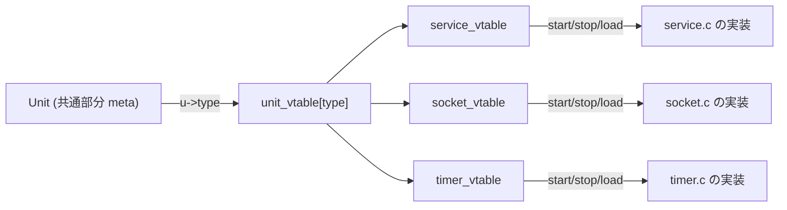

# 第7章 Unit 抽象化と UnitType

> 本章で読むソース
>
> - [`src/basic/unit-def.h`](https://github.com/systemd/systemd/blob/v261.1/src/basic/unit-def.h)
> - [`src/core/unit.h`](https://github.com/systemd/systemd/blob/v261.1/src/core/unit.h)
> - [`src/core/unit.c`](https://github.com/systemd/systemd/blob/v261.1/src/core/unit.c)

## この章の狙い

systemd が管理するすべての対象は、Service であれ Socket であれ Timer であれ、共通の**ユニット**という抽象に載る。
本章では、ユニットの共通部分 `Unit` と、種別ごとの振る舞いを注入する仮想テーブル `UnitVTable` の関係を読み解く。
そのうえで、ユニットの読み込み（`unit_load()`）、起動（`unit_start()`）、状態変化の通知（`unit_notify()`）という三つの入口を追い、種別非依存の共通処理と種別依存のコールバックがどこで切り替わるかを確認する。

## 前提

- 第6章のマネージャーとイベントループを理解していること
- 第2章のユニットと依存関係の概念を把握していること

## UnitType: 11 種類のユニット

systemd のユニット種別は列挙型 `UnitType` で定義される。

[`src/basic/unit-def.h` L9-L24](https://github.com/systemd/systemd/blob/v261.1/src/basic/unit-def.h#L9-L24)

```c
typedef enum UnitType {
        UNIT_SERVICE,
        UNIT_MOUNT,
        UNIT_SWAP,
        UNIT_SOCKET,
        UNIT_TARGET,
        UNIT_DEVICE,
        UNIT_AUTOMOUNT,
        UNIT_TIMER,
        UNIT_PATH,
        UNIT_SLICE,
        UNIT_SCOPE,
        _UNIT_TYPE_MAX,
        _UNIT_TYPE_INVALID = -EINVAL,
        _UNIT_TYPE_ERRNO_MAX = -ERRNO_MAX, /* Ensure the whole errno range fits into this enum */
} UnitType;
```

Service はプロセスを、Socket は待受ソケットを、Timer はタイマーを、Target は同期点を表す。
どれもプロセス管理という共通の枠に載るが、実際に何をするかは種別ごとに大きく異なる。

## Unit と種別構造体のメモリレイアウト

種別ごとの構造体は、先頭に共通部分 `Unit` を `meta` という名前で埋め込む。
たとえば `Socket` 構造体の先頭は `Unit meta;` である。

[`src/core/socket.h` L78-L80](https://github.com/systemd/systemd/blob/v261.1/src/core/socket.h#L78-L80)

```c
        Unit meta;
```

先頭に共通部分を置くため、種別構造体へのポインタはそのまま `Unit*` として扱える。
`UNIT()` マクロは種別構造体から `&(u)->meta` を取り出し、`SERVICE()` などのキャストマクロ（`DEFINE_CAST`）は逆に `Unit*` を種別ポインタへ戻す。

[`src/core/unit.h` L797-L811](https://github.com/systemd/systemd/blob/v261.1/src/core/unit.h#L797-L811)

```c
/* For casting a unit into the various unit types */
#define DEFINE_CAST(UPPERCASE, MixedCase)                               \
        static inline MixedCase* UPPERCASE(Unit *u) {                   \
                if (_unlikely_(!u || u->type != UNIT_##UPPERCASE))      \
                        return NULL;                                    \
                                                                        \
                return (MixedCase*) u;                                  \
        }

/* For casting the various unit types into a unit */
#define UNIT(u)                                         \
        ({                                              \
                typeof(u) _u_ = (u);                    \
                Unit *_w_ = _u_ ? &(_u_)->meta : NULL;  \
                _w_;                                    \
        })
```

`DEFINE_CAST` は `u->type` を検査してから戻すので、型の取り違えを実行時に検出できる。

## UnitVTable: 種別ごとの振る舞いの注入

種別ごとの振る舞いは仮想テーブル `UnitVTable` に集約される。
これは C で多態を実現する関数ポインタの表であり、`load`、`start`、`stop`、`reload`、`serialize` などの操作を種別ごとに差し替える。

[`src/core/unit.h` L529-L595](https://github.com/systemd/systemd/blob/v261.1/src/core/unit.h#L529-L595)

```c
typedef struct UnitVTable {
        /* How much memory does an object of this unit type need */
        size_t object_size;

        /* If greater than 0, the offset into the object where
         * ExecContext is found, if the unit type has that */
        size_t exec_context_offset;
        // ... (中略) ...
        /* Actually load data from disk. This may fail, and should set
         * load_state to UNIT_LOADED, UNIT_MERGED or leave it at
         * UNIT_STUB if no configuration could be found. */
        int (*load)(Unit *u);
        // ... (中略) ...
        int (*start)(Unit *u);
        int (*stop)(Unit *u);
        int (*reload)(Unit *u);
```

先頭の `object_size` は、その種別の構造体全体のサイズを表す。
`exec_context_offset` などは、種別構造体の中で `ExecContext` や `CGroupContext` が置かれる位置（オフセット）を記録する。
共通コードは、種別構造体の詳細を知らなくても、このオフセットを使って共通の下位構造へ到達できる。

各種別の実装は、自分の仮想テーブルを一つ定義する。
それらを一つの配列 `unit_vtable` に、`UnitType` を添字として並べる。

[`src/core/unit.c` L82-L94](https://github.com/systemd/systemd/blob/v261.1/src/core/unit.c#L82-L94)

```c
const UnitVTable * const unit_vtable[_UNIT_TYPE_MAX] = {
        [UNIT_SERVICE]   = &service_vtable,
        [UNIT_SOCKET]    = &socket_vtable,
        [UNIT_TARGET]    = &target_vtable,
        [UNIT_DEVICE]    = &device_vtable,
        [UNIT_MOUNT]     = &mount_vtable,
        [UNIT_AUTOMOUNT] = &automount_vtable,
        [UNIT_SWAP]      = &swap_vtable,
        [UNIT_TIMER]     = &timer_vtable,
        [UNIT_PATH]      = &path_vtable,
        [UNIT_SLICE]     = &slice_vtable,
        [UNIT_SCOPE]     = &scope_vtable,
};
```

`UNIT_VTABLE()` は、ユニットの `type` を添字にこの配列を引くだけの薄いインライン関数である。

[`src/core/unit.h` L792-L794](https://github.com/systemd/systemd/blob/v261.1/src/core/unit.h#L792-L794)

```c
static inline const UnitVTable* UNIT_VTABLE(const Unit *u) {
        return unit_vtable[u->type];
}
```

### 最適化: 仮想テーブルの配列引きによる分岐排除

共通コードは種別ごとの `if` や `switch` を持たず、`UNIT_VTABLE(u)->start(u)` のように配列を一度引いて関数ポインタを呼ぶ。
種別が 11 個であっても分岐は増えず、種別の追加は配列に一要素と仮想テーブルを一つ足すだけで済む。
これは C++ の仮想関数テーブルと同じ発想であり、型ごとの分岐を実行時のポインタ間接参照一回に畳み込む。
`exec_context_offset` のようなオフセットを仮想テーブルに持たせる設計も同じ狙いで、共通の下位構造へのアクセスを種別非依存の一様なコードで書ける。



## unit_load(): 共通処理と種別コールバックの合流点

`unit_load()` はユニットを構成ファイルから読み込む共通の入口である。

まず読み込みキューから自分を外し、まだ `UNIT_STUB`（未読込）状態のときだけ処理を進める。
実際のファイル読み込みは種別の `load` コールバックに委ねる。

[`src/core/unit.c` L1687-L1719](https://github.com/systemd/systemd/blob/v261.1/src/core/unit.c#L1687-L1719)

```c
        if (u->load_state != UNIT_STUB)
                return 0;
        // ... (中略) ...
        r = UNIT_VTABLE(u)->load(u);
        if (r < 0)
                goto fail;

        assert(u->load_state != UNIT_STUB);
```

読み込みに成功すると、種別によらず共通の依存関係を補う。
slice への従属、マウント依存、起動時ユニットの登録などをここでまとめて追加する。

[`src/core/unit.c` L1721-L1748](https://github.com/systemd/systemd/blob/v261.1/src/core/unit.c#L1721-L1748)

```c
        if (u->load_state == UNIT_LOADED) {
                unit_add_to_target_deps_queue(u);

                r = unit_add_slice_dependencies(u);
                // ... (中略) ...
                r = unit_add_mount_dependencies(u);
                // ... (中略) ...
                r = unit_add_startup_units(u);
```

失敗時は `load_state` を `UNIT_NOT_FOUND`、`UNIT_BAD_SETTING`、`UNIT_ERROR` のいずれかに落とす。
このうち `UNIT_BAD_SETTING` は種別コールバックが `-ENOEXEC` を返したときにだけ設定される。

[`src/core/unit.c` L1759-L1766](https://github.com/systemd/systemd/blob/v261.1/src/core/unit.c#L1759-L1766)

```c
fail:
        u->load_state = u->load_state == UNIT_STUB ? UNIT_NOT_FOUND :
                                     r == -ENOEXEC ? UNIT_BAD_SETTING :
                                                     UNIT_ERROR;
        u->load_error = r;
```

`UnitLoadState` は読み込みの結果を表す。

[`src/basic/unit-def.h` L26-L36](https://github.com/systemd/systemd/blob/v261.1/src/basic/unit-def.h#L26-L36)

```c
typedef enum UnitLoadState {
        UNIT_STUB,
        UNIT_LOADED,
        UNIT_NOT_FOUND,    /* error condition #1: unit file not found */
        UNIT_BAD_SETTING,  /* error condition #2: we couldn't parse some essential unit file setting */
        UNIT_ERROR,        /* error condition #3: other "system" error, catchall for the rest */
        UNIT_MERGED,
        UNIT_MASKED,
        _UNIT_LOAD_STATE_MAX,
        _UNIT_LOAD_STATE_INVALID = -EINVAL,
} UnitLoadState;
```

## unit_start(): 前提検査の共通化

`unit_start()` も同じ構造を持つ。
種別によらない前提検査を共通コードで済ませ、最後に種別の `start` コールバックを呼ぶ。

すでに稼働中なら `-EALREADY`、停止処理中なら `-EAGAIN` を返し、未読込のユニットは起動しない。

[`src/core/unit.c` L1959-L1967](https://github.com/systemd/systemd/blob/v261.1/src/core/unit.c#L1959-L1967)

```c
        state = unit_active_state(u);
        if (UNIT_IS_ACTIVE_OR_RELOADING(state))
                return -EALREADY;
        if (IN_SET(state, UNIT_DEACTIVATING, UNIT_MAINTENANCE))
                return -EAGAIN;

        /* Units that aren't loaded cannot be started */
        if (u->load_state != UNIT_LOADED)
                return -EINVAL;
```

続いて `Condition=` と `Assert=` を評価し、種別が未対応なら `-EOPNOTSUPP`、依存関係が満たされていなければ `-ENOLINK` を返す。

[`src/core/unit.c` L1976-L1996](https://github.com/systemd/systemd/blob/v261.1/src/core/unit.c#L1976-L1996)

```c
        if (state != UNIT_ACTIVATING &&
            !unit_test_condition(u))
                return log_unit_debug_errno(u, SYNTHETIC_ERRNO(ECOMM), "Starting requested but condition not met. Not starting unit.");
        // ... (中略) ...
        if (!unit_type_supported(u->type))
                return -EOPNOTSUPP;
        // ... (中略) ...
        if (!unit_verify_deps(u))
                return -ENOLINK;
```

すべての検査を通ると、最後に種別の `start` を呼ぶ。

[`src/core/unit.c` L2043-L2048](https://github.com/systemd/systemd/blob/v261.1/src/core/unit.c#L2043-L2048)

```c
        unit_add_to_dbus_queue(u);

        if (!u->activation_details) /* Older details object wins */
                u->activation_details = activation_details_ref(details);

        return UNIT_VTABLE(u)->start(u);
```

## unit_notify(): 状態遷移の集約点

種別の実装は、内部状態が変わるたびに `unit_notify()` を呼び、旧状態（`os`）と新状態（`ns`）を共通コードへ伝える。
`UnitActiveState` は種別ごとの細かな内部状態を、エンジンが理解できる粗い状態へ丸めたものである。

[`src/basic/unit-def.h` L38-L49](https://github.com/systemd/systemd/blob/v261.1/src/basic/unit-def.h#L38-L49)

```c
typedef enum UnitActiveState {
        UNIT_ACTIVE,
        UNIT_RELOADING,
        UNIT_INACTIVE,
        UNIT_FAILED,
        UNIT_ACTIVATING,
        UNIT_DEACTIVATING,
        UNIT_MAINTENANCE,
        UNIT_REFRESHING,
        _UNIT_ACTIVE_STATE_MAX,
        _UNIT_ACTIVE_STATE_INVALID = -EINVAL,
} UnitActiveState;
```

`unit_notify()` は状態変化に応じて多くの共通処理を回す。
タイムスタンプを更新し、失敗ユニットの集合を保守し、非アクティブへ落ちたときは cgroup と状態ファイルを片付ける。

[`src/core/unit.c` L2758-L2782](https://github.com/systemd/systemd/blob/v261.1/src/core/unit.c#L2758-L2782)

```c
        /* Update timestamps for state changes */
        if (!MANAGER_IS_RELOADING(m)) {
                dual_timestamp_now(&u->state_change_timestamp);
                // ... (中略) ...
        }

        /* Keep track of failed units */
        (void) manager_update_failed_units(m, u, ns == UNIT_FAILED);

        /* Make sure the cgroup and state files are always removed when we become inactive */
        if (UNIT_IS_INACTIVE_OR_FAILED(ns)) {
                // ... (中略) ...
                unit_prune_cgroup(u);
                unit_unlink_state_files(u);
```

状態変化がジョブに起因しない場合（`unexpected`）は、依存関係を遡って起動または停止を波及させる。
これが、ユニット単体の状態変化から依存グラフ全体へ波及が伝わる仕組みである。

[`src/core/unit.c` L2790-L2808](https://github.com/systemd/systemd/blob/v261.1/src/core/unit.c#L2790-L2808)

```c
                /* Let's propagate state changes to the job */
                if (u->job)
                        unexpected = unit_process_job(u->job, ns, reload_success);
                else
                        unexpected = true;
                // ... (中略) ...
                if (unexpected) {
                        if (UNIT_IS_INACTIVE_OR_FAILED(os) && UNIT_IS_ACTIVE_OR_ACTIVATING(ns))
                                retroactively_start_dependencies(u);
                        else if (UNIT_IS_ACTIVE_OR_ACTIVATING(os) && UNIT_IS_INACTIVE_OR_DEACTIVATING(ns))
                                retroactively_stop_dependencies(u);
                }
```

## 依存関係の追加

`unit_add_dependency()` は 2 つのユニットの間に**依存関係**を張る。
依存種別 `UnitDependency` を、下位の「アトム」（`UnitDependencyAtom`）へ変換してから整合性を検査する。

[`src/core/unit.c` L3186-L3207](https://github.com/systemd/systemd/blob/v261.1/src/core/unit.c#L3186-L3207)

```c
int unit_add_dependency(
                Unit *u,
                UnitDependency d,
                Unit *other,
                bool add_reference,
                UnitDependencyMask mask) {

        UnitDependencyAtom a;
        int r;
        // ... (中略) ...
        u = unit_follow_merge(u);
        other = unit_follow_merge(other);
        a = unit_dependency_to_atom(d);
        assert(a >= 0);
```

依存関係を意味ごとの「アトム」に分解しておくことで、`Triggers=` や `Slice=` のような種別固有の制約を、共通コードのアトム検査だけで一貫して弾ける。
たとえば Device ユニットは遅延できないため `Before=` を拒否し、トリガー不可の種別は `Triggers=` を拒否する。

## まとめ

systemd のユニットは、共通部分 `Unit` を先頭に埋め込んだ種別構造体と、種別ごとの振る舞いを注入する仮想テーブル `UnitVTable` の組で表される。
共通コードは `UNIT_VTABLE(u)` で配列を一度引くだけで種別の操作を呼び分け、種別ごとの分岐を持たない。
`unit_load()`、`unit_start()`、`unit_notify()` はいずれも、種別非依存の前提検査や後処理を共通化し、種別固有の一点だけをコールバックに委ねる合流点として働く。
状態変化は `unit_notify()` に集約され、そこから依存関係の波及やジョブの進行が駆動される。

## 関連する章

- 第6章：マネージャー（ユニットを束ねてイベントループを回す親）
- 第8章：ジョブとトランザクション（unit_start を呼ぶジョブエンジン）
- 第9章：Service ユニット（本章の仮想テーブルを実装する代表例）
