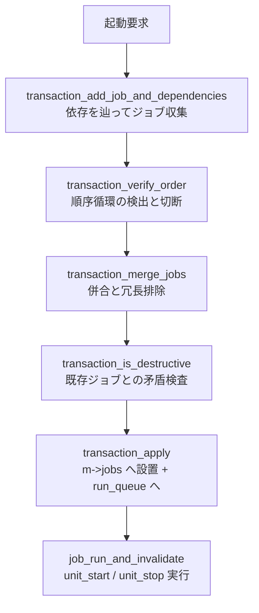

# 第8章 Job とトランザクション

> 本章で読むソース
>
> - [`src/core/job.h`](https://github.com/systemd/systemd/blob/v261.1/src/core/job.h)
> - [`src/core/job.c`](https://github.com/systemd/systemd/blob/v261.1/src/core/job.c)
> - [`src/core/transaction.c`](https://github.com/systemd/systemd/blob/v261.1/src/core/transaction.c)

## この章の狙い

「あるユニットを起動せよ」という要求は、そのユニット単体では完結しない。
依存するユニットも同時に起動する必要があり、順序制約も守らなければならない。
systemd はこの一括の状態変更を**トランザクション**として組み立て、依存関係を辿ってジョブを集め、順序の循環を検出して壊し、既存のジョブと矛盾しないかを検査してから一斉に適用する。
本章では、**ジョブ**の型体系と併合、トランザクションの構築から活性化までの十段階、そしてジョブの実行を追う。

## 前提

- 第7章のユニット抽象と `unit_start()` / `unit_stop()` を理解していること
- 第6章の run_queue（ジョブ実行キュー）を把握していること

## JobType: ジョブの型体系

ジョブは一つのユニットに対する一つの状態変更要求である。
その種類が `JobType` で定義される。

[`src/core/job.h` L7-L50](https://github.com/systemd/systemd/blob/v261.1/src/core/job.h#L7-L50)

```c
enum JobType {
        JOB_START,                  /* if a unit does not support being started, we'll just wait until it becomes active */
        JOB_VERIFY_ACTIVE,

        JOB_STOP,

        JOB_RELOAD,                 /* if running, reload */

        /* Note that restarts are first treated like JOB_STOP, but
         * then instead of finishing are patched to become
         * JOB_START. */
        JOB_RESTART,                /* If running, stop. Then start unconditionally. */

        _JOB_TYPE_MAX_MERGING,
        // ... (中略) ...
        JOB_NOP = _JOB_TYPE_MAX_MERGING, /* do nothing */

        _JOB_TYPE_MAX_IN_TRANSACTION,
        // ... (中略) ...
};
```

型は三段階に区切られる。
`_JOB_TYPE_MAX_MERGING` までは併合できる型、`_JOB_TYPE_MAX_IN_TRANSACTION` まではトランザクションに入れる型、それ以降（`JOB_TRY_RESTART` など）はトランザクション投入前に単純な型へ潰される型である。

ジョブには実行状態 `JobState`（`JOB_WAITING` / `JOB_RUNNING` / `JOB_FINISHED`）と、完了理由を表す `JobResult` がある。

[`src/core/job.h` L52-L76](https://github.com/systemd/systemd/blob/v261.1/src/core/job.h#L52-L76)

```c
typedef enum JobState {
        JOB_WAITING,
        JOB_RUNNING,
        JOB_FINISHED,
        _JOB_STATE_MAX,
        _JOB_STATE_INVALID = -EINVAL,
} JobState;
```

### ジョブの併合表

同一ユニットに複数の要求が集まったとき、systemd は可能なら一つのジョブへ併合する。
併合の規則は三角行列 `job_merging_table` に静的に埋め込まれている。

[`src/core/job.c` L416-L441](https://github.com/systemd/systemd/blob/v261.1/src/core/job.c#L416-L441)

```c
static const JobType job_merging_table[] = {
/* What \ With       *  JOB_START            JOB_VERIFY_ACTIVE JOB_STOP JOB_RELOAD */
/*********************************************************************************/
/* JOB_START         */
/* JOB_VERIFY_ACTIVE */ JOB_START,
/* JOB_STOP          */ -1,                  -1,
/* JOB_RELOAD        */ JOB_RELOAD_OR_START, JOB_RELOAD,       -1,
/* JOB_RESTART       */ JOB_RESTART,         JOB_RESTART,      -1,      JOB_RESTART,
};

JobType job_type_lookup_merge(JobType a, JobType b) {
        assert_cc(ELEMENTSOF(job_merging_table) == _JOB_TYPE_MAX_MERGING * (_JOB_TYPE_MAX_MERGING - 1) / 2);
        // ... (中略) ...
        return job_merging_table[(a - 1) * a / 2 + b];
}
```

### 最適化: 三角行列による併合判定

`job_type_lookup_merge()` は二つの型を大小で正規化し、`(a - 1) * a / 2 + b` という添字で一次元配列を引く。
これは対称な併合関係の上三角だけを格納した表であり、`if` の連鎖を配列参照一回に畳み込む。
`-1` は併合不可（同時に投入すると矛盾）を表す。
たとえば `JOB_START` と `JOB_STOP` は併合できず、`JOB_START` と `JOB_VERIFY_ACTIVE` は `JOB_START` に併合される。
コメントにある結合律と推移律が成り立つよう表を設計してあるため、三つ以上の要求も順に二項併合するだけで一貫した結果が得られる。

## トランザクションの構築

要求は `transaction_add_job_and_dependencies()` で受け取る。
この関数は指定ユニットのジョブを作り、依存関係を辿って必要なジョブを再帰的に引き込む。

引き込む前に、ユニットが正しく読み込まれているかを確認する。
リロード中なら、その場で `unit_coldplug()` を呼んで状態を確定させ、未コールドプラグのユニットの状態を見ないようにする。

[`src/core/transaction.c` L941-L973](https://github.com/systemd/systemd/blob/v261.1/src/core/transaction.c#L941-L973)

```c
int transaction_add_job_and_dependencies(
                Transaction *tr,
                JobType type,
                Unit *unit,
                Job *by,
                TransactionAddFlags flags,
                sd_bus_error *e) {
        // ... (中略) ...
        if (MANAGER_IS_RELOADING(unit->manager))
                unit_coldplug(unit);
        // ... (中略) ...
        if (!UNIT_IS_LOAD_COMPLETE(unit->load_state))
                return sd_bus_error_setf(e, BUS_ERROR_LOAD_FAILED, "Unit %s is not loaded properly.", unit->id);
```

集めたジョブは、いったんマネージャーの本番ジョブ表とは別の一時領域（`tr->jobs`）に置かれる。
`transaction_add_one_job()` は、同一ユニットに既存の候補ジョブがあれば再利用し、なければ新規に作って一時リストへ前置する。

[`src/core/transaction.c` L805-L846](https://github.com/systemd/systemd/blob/v261.1/src/core/transaction.c#L805-L846)

## transaction_activate(): 十段階の活性化

集めたジョブを本番へ反映する中核が `transaction_activate()` である。
この関数は、循環検出のために全ジョブの世代番号を 0 に戻してから、複数の段階を順に適用する。

[`src/core/transaction.c` L711-L761](https://github.com/systemd/systemd/blob/v261.1/src/core/transaction.c#L711-L761)

```c
int transaction_activate(
                Transaction *tr,
                Manager *m,
                JobMode mode,
                Set *affected_jobs,
                sd_bus_error *e) {
        // ... (中略) ...
        /* Reset the generation counter of all installed jobs. */
        HASHMAP_FOREACH(j, m->jobs)
                j->generation = 0;

        /* First step: figure out which jobs matter. */
        transaction_find_jobs_that_matter_to_anchor(tr->anchor_job, generation++);

        /* Second step: Try not to stop any running services if we don't have to. */
        r = transaction_minimize_impact(tr, mode, e);
        // ... (中略) ...
        /* Third step: Drop redundant jobs. */
        transaction_drop_redundant(tr);

        for (;;) {
                /* Fourth step: Let's remove unneeded jobs that might be lurking. */
                if (mode != JOB_ISOLATE)
                        transaction_collect_garbage(tr);

                /* Fifth step: verify order makes sense and correct cycles if necessary and possible. */
                r = transaction_verify_order(tr, &generation, e);
                if (r >= 0)
                        break;
                if (r != -EAGAIN)
                        return log_warning_errno(r, ...);
        }
```

順序検証で循環が壊れて `-EAGAIN` が返る間はループし、循環が消えるまで検証をやり直す。
続いて併合とゴミ集めを繰り返し、破壊的でないかを検査し、最後に適用する。

[`src/core/transaction.c` L763-L802](https://github.com/systemd/systemd/blob/v261.1/src/core/transaction.c#L763-L802)

```c
        /* Ninth step: check whether we can actually apply this. */
        r = transaction_is_destructive(tr, mode, e);
        if (r < 0)
                return log_notice_errno(r, "Requested transaction contradicts existing jobs: %s",
                                        bus_error_message(e, r));

        /* Tenth step: apply changes. */
        r = transaction_apply(tr, m, mode, affected_jobs);
```

## 順序循環の検出と切断

`transaction_verify_order_one()` は、順序グラフを深さ優先で辿って循環を探す。
世代番号（`generation`）で訪問済みを判定し、マーカー（`marker`）に「どこから来たか」を記録して経路を復元できるようにする。

[`src/core/transaction.c` L340-L364](https://github.com/systemd/systemd/blob/v261.1/src/core/transaction.c#L340-L364)

```c
static int transaction_verify_order_one(Transaction *tr, Job *j, Job *from, unsigned generation, sd_bus_error *e) {
        // ... (中略) ...
        /* Have we seen this before? */
        if (j->generation == generation) {
                // ... (中略) ...
                /* If the marker is NULL we have been here already and decided the job was loop-free from
                 * here. Hence shortcut things and return right-away. */
                if (!j->marker)
                        return 0;
```

現在の世代で再訪し、かつマーカーが残っている場合は循環である。
マーカーを辿って経路を遡り、アンカーにとって必須でない（`job_matters_to_anchor()` が偽）ジョブを一つ削除して循環を断つ。

[`src/core/transaction.c` L369-L382](https://github.com/systemd/systemd/blob/v261.1/src/core/transaction.c#L369-L382)

```c
                for (Job *k = from; k; k = (k->generation == generation && k->marker != k) ? k->marker : NULL) {
                        // ... (中略) ...
                        if (!delete && hashmap_contains(tr->jobs, k->unit) && !job_matters_to_anchor(k))
                                /* Ok, we can drop this one, so let's do so. */
                                delete = k;

                        /* Check if this in fact was the beginning of the cycle. */
                        if (k == j)
                                break;
                }
```

削除できるジョブが見つかれば `-EAGAIN` を返し、活性化ループが検証をやり直す。
必須ジョブしかなく循環を壊せない場合は `BUS_ERROR_TRANSACTION_ORDER_IS_CYCLIC` を返して失敗させる。

深さ優先の探索から戻るときは、マーカーを `NULL` に落として「この頂点から先は循環なし」を記録する。

[`src/core/transaction.c` L452-L490](https://github.com/systemd/systemd/blob/v261.1/src/core/transaction.c#L452-L490)

```c
        /* Make the marker point to where we come from, so that we can find our way backwards if we want to
         * break a cycle. We use a special marker for the beginning: we point to ourselves. */
        j->marker = from ?: j;
        j->generation = generation;
        // ... (中略) ...
        /* Ok, let's backtrack, and remember that this entry is not on our path anymore. */
        j->marker = NULL;
```

### 最適化: マーカーを親ポインタに兼用した循環検出

この探索は、訪問済み集合や経路スタックを別に確保しない。
`generation` を毎回インクリメントすることで、前回までの探索が残した状態をクリアせずに使い回せる。
`marker` は二重の役割を担う。
探索中は「経路上の親」を指して循環経路の復元に使い、探索を抜けた頂点では `NULL` になって「ここから循環なし」の枝刈りに使う。
一頂点あたり整数と一ポインタだけで、グラフを一度なぞる線形時間で循環の検出と切断点の選定を同時に行う。

## transaction_apply(): 本番への反映

順序と併合が確定すると、`transaction_apply()` が一時ジョブを本番ジョブ表 `m->jobs` へ移す。
`JOB_ISOLATE` / `JOB_FLUSH` の場合は、新トランザクションに含まれない既存ジョブを先に打ち切る。

[`src/core/transaction.c` L644-L672](https://github.com/systemd/systemd/blob/v261.1/src/core/transaction.c#L644-L672)

```c
        if (IN_SET(mode, JOB_ISOLATE, JOB_FLUSH)) {
                /* When isolating first kill all installed jobs which aren't part of the new transaction. */
                HASHMAP_FOREACH(j, m->jobs) {
                        // ... (中略) ...
                        job_finish_and_invalidate(j, JOB_CANCELED, false, false);
                }
        }
```

各ジョブを `job_install()` で設置し、run_queue と D-Bus キューへ積み、タイマーを起動する。

[`src/core/transaction.c` L674-L699](https://github.com/systemd/systemd/blob/v261.1/src/core/transaction.c#L674-L699)

```c
        while ((j = hashmap_steal_first(tr->jobs))) {
                // ... (中略) ...
                installed_job = job_install(j);
                // ... (中略) ...
                job_add_to_run_queue(j);
                job_add_to_dbus_queue(j);
                job_start_timer(j, false);
                job_shutdown_magic(j);
```



## job_run_and_invalidate(): ジョブの実行

run_queue から取り出されたジョブは `job_run_and_invalidate()` で実行される。
まずキューから外し、`JOB_WAITING` かつ実行可能（先行依存が済んでいる）ときだけ走らせる。

[`src/core/job.c` L916-L935](https://github.com/systemd/systemd/blob/v261.1/src/core/job.c#L916-L935)

```c
int job_run_and_invalidate(Job *j) {
        // ... (中略) ...
        prioq_remove(j->manager->run_queue, j, &j->run_queue_idx);
        j->in_run_queue = false;

        if (j->state != JOB_WAITING)
                return 0;

        if (!job_is_runnable(j))
                return -EAGAIN;

        job_start_timer(j, true);
        job_set_state(j, JOB_RUNNING);
```

型に応じて `job_perform_on_unit()` へ入り、`JOB_START` なら `unit_start()`、`JOB_STOP` と `JOB_RESTART` なら `unit_stop()`、`JOB_RELOAD` なら `unit_reload()` を呼ぶ。

[`src/core/job.c` L881-L902](https://github.com/systemd/systemd/blob/v261.1/src/core/job.c#L881-L902)

```c
        switch (t) {
                case JOB_START:
                        r = unit_start(u, a);
                        wait_only = r == -EBADR; /* If the unit type does not support starting, then simply wait. */
                        break;

                case JOB_RESTART:
                        t = JOB_STOP;
                        _fallthrough_;
                case JOB_STOP:
                        r = unit_stop(u);
                        // ... (中略) ...
                case JOB_RELOAD:
                        r = unit_reload(u);
```

`JOB_RESTART` はまず `JOB_STOP` として実行され、完了時に `JOB_START` へ差し替わる。
ジョブが即座に消える可能性があるため、`job_perform_on_unit()` は ID を控えて実行後に有効性を確認する。

## まとめ

systemd の状態変更は、単一のジョブではなくトランザクションとして構築される。
`transaction_add_job_and_dependencies()` が依存を辿ってジョブを一時領域に集め、`transaction_activate()` の十段階が併合と冗長排除と順序検証を経て本番へ反映する。
順序循環は、世代番号とマーカー（親ポインタ兼枝刈りフラグ）を使う深さ優先探索で線形時間に検出し、必須でないジョブを一つ削って壊す。
併合は上三角行列の一次元インデックスで定数時間に判定される。
本番へ設置されたジョブは run_queue から `job_run_and_invalidate()` で取り出され、型に応じて `unit_start()` などを呼ぶ。

## 関連する章

- 第6章：マネージャー（run_queue にジョブを積み、優先度順に処理する）
- 第7章：ユニット（ジョブが呼ぶ unit_start / unit_stop の実装）
- 第9章：Service ユニット（JOB_START が起動する代表的なユニット）
