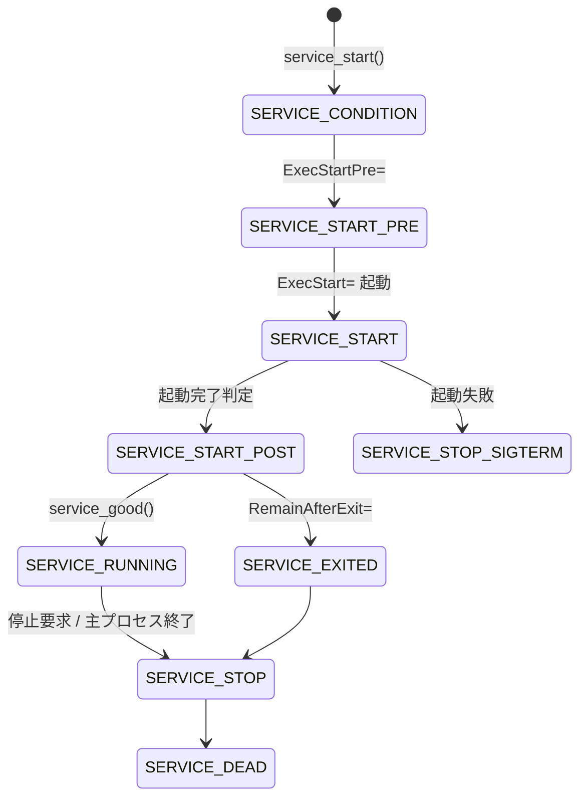

# 第9章 Service ユニットの起動シーケンス

> 本章で読むソース
>
> - [`src/core/service.h`](https://github.com/systemd/systemd/blob/v261.1/src/core/service.h)
> - [`src/core/service.c`](https://github.com/systemd/systemd/blob/v261.1/src/core/service.c)
> - [`src/core/execute.c`](https://github.com/systemd/systemd/blob/v261.1/src/core/execute.c)

## この章の狙い

`Service` は systemd が管理するユニットの中で最も複雑で、プロセスの起動と監視を担う。
本章では、`ServiceType` が起動完了の判定基準をどう変えるかを整理し、`service_start()` から `SERVICE_RUNNING` に至る状態遷移の連鎖を追う。
そのうえで、プロセス生成が `exec_spawn()` を通じて別バイナリ `systemd-executor` に委ねられる仕組みと、その設計理由を読み解く。

## 前提

- 第7章のユニット抽象と仮想テーブルを理解していること
- 第8章のジョブが `unit_start()` から `service_start()` を呼ぶ流れを把握していること
- 第12章の cgroup を先に読むと `exec_spawn()` の cgroup 配置が理解しやすい（未読でも本章は追える）

## ServiceType: 起動完了の判定基準

Service の振る舞いを大きく左右するのが `ServiceType` である。
これは「いつ起動が完了したとみなすか」を決める。

[`src/core/service.h` L35-L46](https://github.com/systemd/systemd/blob/v261.1/src/core/service.h#L35-L46)

```c
typedef enum ServiceType {
        SERVICE_SIMPLE,        /* we fork and go on right-away (i.e. modern socket activated daemons) */
        SERVICE_FORKING,       /* forks by itself (i.e. traditional daemons) */
        SERVICE_ONESHOT,       /* we fork and wait until the program finishes (i.e. programs like fsck which run and need to finish before we continue) */
        SERVICE_DBUS,          /* we fork and wait until a specific D-Bus name appears on the bus */
        SERVICE_NOTIFY,        /* we fork and wait until a daemon sends us a ready message with sd_notify() */
        SERVICE_NOTIFY_RELOAD, /* just like SERVICE_NOTIFY, but also implements a reload protocol via SIGHUP */
        SERVICE_IDLE,          /* much like simple, but delay exec() until all jobs are dispatched. */
        SERVICE_EXEC,          /* we fork and wait until we execute exec() (this means our own setup is waited for) */
        _SERVICE_TYPE_MAX,
        _SERVICE_TYPE_INVALID = -EINVAL,
} ServiceType;
```

`SERVICE_SIMPLE` は fork したら即座に起動完了とみなす。
`SERVICE_FORKING` は起動プロセスの終了を待つ。
`SERVICE_NOTIFY` は `sd_notify()` の `READY=1` を待ち、`SERVICE_DBUS` はバス名の出現を待ち、`SERVICE_EXEC` は子が `execve()` に到達するまで待つ。

起動時に実行するコマンドは種別ごとに `ServiceExecCommand` で分類される。

[`src/core/service.h` L55-L66](https://github.com/systemd/systemd/blob/v261.1/src/core/service.h#L55-L66)

```c
typedef enum ServiceExecCommand {
        SERVICE_EXEC_CONDITION,
        SERVICE_EXEC_START_PRE,
        SERVICE_EXEC_START,
        SERVICE_EXEC_START_POST,
        SERVICE_EXEC_RELOAD,
        SERVICE_EXEC_RELOAD_POST,
        SERVICE_EXEC_STOP,
        SERVICE_EXEC_STOP_POST,
        _SERVICE_EXEC_COMMAND_MAX,
        _SERVICE_EXEC_COMMAND_INVALID = -EINVAL,
} ServiceExecCommand;
```

## service_start(): 起動の初期化

ジョブエンジンが `unit_start()` を呼ぶと、仮想テーブル経由で `service_start()` に到達する。
この関数はまず自動再起動待ちの特例を処理し、続いて起動に向けて状態を初期化する。

[`src/core/service.c` L3344-L3399](https://github.com/systemd/systemd/blob/v261.1/src/core/service.c#L3344-L3399)

```c
static int service_start(Unit *u) {
        Service *s = ASSERT_PTR(SERVICE(u));
        int r;

        if (s->state == SERVICE_AUTO_RESTART) {
                // ... (中略) ...
                service_enter_restart(s, /* shortcut= */ true);
                return -EAGAIN;
        }

        assert(IN_SET(s->state, SERVICE_DEAD, SERVICE_FAILED, SERVICE_DEAD_RESOURCES_PINNED, SERVICE_AUTO_RESTART_QUEUED));

        r = unit_acquire_invocation_id(u);
        // ... (中略) ...
        s->result = SERVICE_SUCCESS;
        // ... (中略) ...
        service_enter_condition(s);
        return 1;
}
```

各種状態をリセットし、招請 ID（invocation ID）を取得したうえで、`service_enter_condition()` から状態機械の連鎖に入る。

## 起動の状態遷移

起動は複数の中間状態を経る。
各状態は `service_enter_*()` という関数で表され、次の状態へ自ら遷移する。

`service_enter_start_pre()` は `ExecStartPre=` のコマンドがあれば実行して `SERVICE_START_PRE` に入り、なければ `service_enter_start()` へ直行する。

[`src/core/service.c` L2838-L2867](https://github.com/systemd/systemd/blob/v261.1/src/core/service.c#L2838-L2867)

```c
static void service_enter_start_pre(Service *s) {
        // ... (中略) ...
        s->control_command = s->exec_command[SERVICE_EXEC_START_PRE];
        if (s->control_command) {
                // ... (中略) ...
                r = service_spawn(s, s->control_command, ...);
                // ... (中略) ...
                service_set_state(s, SERVICE_START_PRE);
        } else
                service_enter_start(s);
```

`service_enter_start()` が主プロセスを起動する。
ここで `ServiceType` によって、起動後の遷移先が分かれる。

[`src/core/service.c` L2806-L2832](https://github.com/systemd/systemd/blob/v261.1/src/core/service.c#L2806-L2832)

```c
        switch (s->type) {

        case SERVICE_SIMPLE:
        case SERVICE_IDLE:
                /* For simple services we immediately start the START_POST binaries. */
                (void) service_set_main_pidref(s, TAKE_PIDREF(pidref), &c->exec_status.start_timestamp);
                return service_enter_start_post(s);

        case SERVICE_FORKING:
                /* For forking services we wait until the start process exited. */
                s->control_pid = TAKE_PIDREF(pidref);
                return service_set_state(s, SERVICE_START);

        case SERVICE_ONESHOT:
        case SERVICE_EXEC:
        case SERVICE_DBUS:
        case SERVICE_NOTIFY:
        case SERVICE_NOTIFY_RELOAD:
                (void) service_set_main_pidref(s, TAKE_PIDREF(pidref), &c->exec_status.start_timestamp);
                return service_set_state(s, SERVICE_START);
```

`SERVICE_SIMPLE` は主 PID を記録して即座に `service_enter_start_post()` へ進む。
他の種別は `SERVICE_START` に留まり、それぞれの完了条件（プロセス終了、通知、バス名出現、`execve()` 到達）を待つ。

`service_enter_start_post()` は `ExecStartPost=` を実行し、終われば `service_enter_running()` を呼ぶ。

[`src/core/service.c` L2672-L2698](https://github.com/systemd/systemd/blob/v261.1/src/core/service.c#L2672-L2698)

```c
static void service_enter_start_post(Service *s) {
        // ... (中略) ...
        s->control_command = s->exec_command[SERVICE_EXEC_START_POST];
        if (s->control_command) {
                // ... (中略) ...
                service_set_state(s, SERVICE_START_POST);
        } else
                service_enter_running(s, SERVICE_SUCCESS);
```

`service_enter_running()` が起動完了の判定を下す。
結果が成功で、主プロセスが生きていれば `SERVICE_RUNNING` に入る。
`RemainAfterExit=` が真なら、プロセスが終了していても `SERVICE_EXITED` として活性を保つ。

[`src/core/service.c` L2636-L2670](https://github.com/systemd/systemd/blob/v261.1/src/core/service.c#L2636-L2670)

```c
static void service_enter_running(Service *s, ServiceResult f) {
        // ... (中略) ...
        if (s->result != SERVICE_SUCCESS)
                service_enter_signal(s, SERVICE_STOP_SIGTERM, f);
        else if (service_good(s)) {
                // ... (中略) ...
                service_set_state(s, SERVICE_RUNNING);
                // ... (中略) ...
        } else if (s->remain_after_exit)
                service_set_state(s, SERVICE_EXITED);
        else
                service_enter_stop(s, SERVICE_SUCCESS);
```



状態遷移図では、`SERVICE_CONDITION` を起点に `ExecStartPre=` の有無で経路が分かれ、種別ごとの完了判定を経て `SERVICE_RUNNING` に至る主経路を描いた。
`ServiceState` には停止側の細かな状態（`SERVICE_STOP_SIGTERM`、`SERVICE_FINAL_SIGKILL` など）も多数あるが、ここでは起動の主経路に絞った。

## exec_spawn(): systemd-executor への委譲

プロセスの実際の生成は `service_spawn()` から `exec_spawn()` へ委ねられる。
`exec_spawn()` は、PID 1 の中で直接 `execve()` するのではなく、専用バイナリ `systemd-executor` を起動する。

[`src/core/service.c` L2211-L2219](https://github.com/systemd/systemd/blob/v261.1/src/core/service.c#L2211-L2219)

```c
        r = exec_spawn(UNIT(s),
                       c,
                       &s->exec_context,
                       &exec_params,
                       s->exec_runtime,
                       &s->cgroup_context,
                       &pidref);
```

`exec_spawn()` は、起動に必要な文脈（`ExecContext`、コマンド、ファイルディスクリプタ）をシリアライズファイルに書き出し、`systemd-executor` にそのファイルディスクリプタを渡して起動する。
executor はそれを脱シリアライズし、サンドボックス設定を適用してから目的のバイナリを `execve()` する。

[`src/core/execute.c` L533-L589](https://github.com/systemd/systemd/blob/v261.1/src/core/execute.c#L533-L589)

```c
        r = open_serialization_file("sd-executor-state", &f);
        // ... (中略) ...
        r = exec_serialize_invocation(f, fdset, context, command, params, runtime, cgroup_context);
        // ... (中略) ...
        /* The executor binary is pinned, to avoid compatibility problems during upgrades. */
        r = posix_spawn_wrapper(
                        FORMAT_PROC_FD_PATH(unit->manager->executor_fd),
                        STRV_MAKE(unit->manager->executor_path,
                                  "--deserialize", serialization_fd_number,
                                  "--log-level", max_log_levels,
                                  "--log-target", log_target_to_string(manager_get_executor_log_target(unit->manager))),
                        environ,
                        cgtarget,
                        &pidref);
```

executor バイナリは第6章で見たように起動時にピン留めされる。
アップグレードでファイルが置き換わっても、稼働中の PID 1 は古い executor を参照し続けられる。

### 最適化: CLONE_VM と executor 分離による CoW トラップ回避

`exec_spawn()` の設計理由は、コメントに明記されている。

[`src/core/execute.c` L526-L531](https://github.com/systemd/systemd/blob/v261.1/src/core/execute.c#L526-L531)

```c
        /* In order to avoid copy-on-write traps and OOM-kills when pid1's memory.current is above the
         * child's memory.max, serialize all the state needed to start the unit, and pass it to the
         * systemd-executor binary. clone() with CLONE_VM + CLONE_VFORK will pause the parent until the exec
         * and ensure all memory is shared. The child immediately execs the new binary so the delay should
         * be minimal. If glibc 2.39 is available pidfd_spawn() is used in order to get a race-free pid fd
         * and to clone directly into the target cgroup (if we booted with cgroupv2). */
```

PID 1 は大量のメモリを抱える。
従来のように `fork()` してから子側でサンドボックス設定を組み立てると、子は親のアドレス空間を copy-on-write で引き継ぐ。
子のサンドボックスに厳しい `MemoryMax=` が設定されていると、コピーオンライトによる書き込みが子のメモリ上限に触れて OOM kill を招きうる。
`CLONE_VM | CLONE_VFORK` で親のメモリを共有したまま子を作り、子が即座に `systemd-executor` を `execve()` することで、この問題を避ける。
executor を独立バイナリにしたのは、起動処理のコードを PID 1 のアドレス空間から切り離し、実行のたびに新しいバイナリのメモリで走らせるためでもある。
`CLONE_INTO_CGROUP` が使えれば、目的の cgroup へ直接クローンでき、生成直後のプロセスが一瞬でも cgroup 外に出ることを防ぐ。

## まとめ

Service ユニットは `ServiceType` によって起動完了の判定基準を変え、`SERVICE_SIMPLE` は fork 即完了、`SERVICE_NOTIFY` は通知待ち、`SERVICE_EXEC` は `execve()` 到達待ちとする。
`service_start()` から始まる状態機械は、`service_enter_start_pre()`、`service_enter_start()`、`service_enter_start_post()`、`service_enter_running()` と連鎖し、各状態は次の状態へ自ら遷移する。
プロセス生成は `exec_spawn()` が専用バイナリ `systemd-executor` に委ね、起動文脈をシリアライズして渡す。
`CLONE_VM | CLONE_VFORK` でメモリを共有したまま即 exec することで、PID 1 の巨大なアドレス空間を子へコピーせず、CoW トラップと OOM kill を避ける。

## 関連する章

- 第7章：ユニット抽象（service_vtable を通じた呼び出し）
- 第8章：ジョブ（JOB_START が service_start を呼ぶ）
- 第10章：ソケットアクティベーション（Socket が Service を起動する連携）
