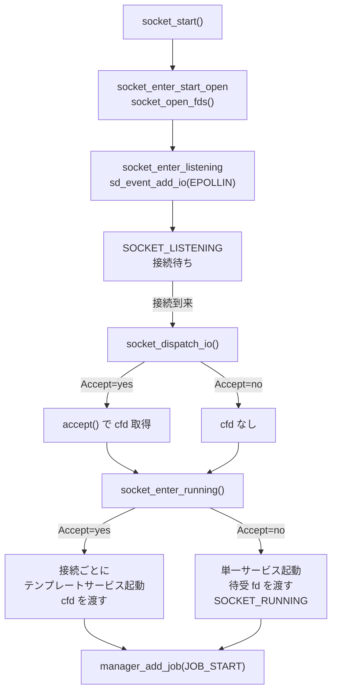

# 第10章 ソケットアクティベーション

> 本章で読むソース
>
> - [`src/core/socket.h`](https://github.com/systemd/systemd/blob/v261.1/src/core/socket.h)
> - [`src/core/socket.c`](https://github.com/systemd/systemd/blob/v261.1/src/core/socket.c)

## この章の狙い

**ソケットアクティベーション**は systemd の代表的な機能である。
サービス本体をあらかじめ起動しておく代わりに、待受ソケットだけを systemd が開いておき、接続が来た瞬間にサービスを起動して待受ソケットを引き渡す。
本章では、Socket ユニットが待受ソケットを開いて監視する流れ（`socket_start()` から `SOCKET_LISTENING`）と、接続到来時にサービスを起動する流れ（`socket_dispatch_io()` から `socket_enter_running()`）を追う。
`Accept=no` と `Accept=yes` の二方式の違いにも踏み込む。

## 前提

- 第9章の Service 起動シーケンスを理解していること
- 第4章の `sd-event`（I/O イベントソース）を把握していること

## SocketState: 待受と起動の状態

Socket ユニットの状態は `SocketState` で表される。

[`src/basic/unit-def.h` L169-L188](https://github.com/systemd/systemd/blob/v261.1/src/basic/unit-def.h#L169-L188)

```c
typedef enum SocketState {
        SOCKET_DEAD,
        SOCKET_START_PRE,
        SOCKET_START_OPEN,
        SOCKET_START_CHOWN,
        SOCKET_START_POST,
        SOCKET_LISTENING,
        SOCKET_DEFERRED,
        SOCKET_RUNNING,
        SOCKET_STOP_PRE,
        // ... (中略) ...
        _SOCKET_STATE_MAX,
        _SOCKET_STATE_INVALID = -EINVAL,
} SocketState;
```

`SOCKET_LISTENING` が待受状態、`SOCKET_RUNNING` が接続を受けてサービスを起動した状態である。
起動時は `SOCKET_START_OPEN`（ソケット生成）、`SOCKET_START_CHOWN`（所有者変更）と細かく分かれる。

## socket_start(): 待受ソケットを開く

`socket_start()` は状態を初期化して `socket_enter_start_pre()` に入る。

[`src/core/socket.c` L2609-L2627](https://github.com/systemd/systemd/blob/v261.1/src/core/socket.c#L2609-L2627)

```c
static int socket_start(Unit *u) {
        Socket *s = ASSERT_PTR(SOCKET(u));
        int r;

        assert(IN_SET(s->state, SOCKET_DEAD, SOCKET_FAILED));

        r = unit_acquire_invocation_id(u);
        // ... (中略) ...
        socket_enter_start_pre(s);
        return 1;
}
```

`ExecStartPre=` の後、`socket_enter_start_open()` が待受ソケットを実際に生成する。
ここで一つ注意深い設計がある。
プロセスを起こさない純粋な中間状態であっても、`socket_set_state()` で明示的に状態遷移を起こす。

[`src/core/socket.c` L2313-L2334](https://github.com/systemd/systemd/blob/v261.1/src/core/socket.c#L2313-L2334)

```c
static void socket_enter_start_open(Socket *s) {
        // ... (中略) ...
        /* We force a state transition here even though we're not spawning any process (i.e. the state is purely
         * intermediate), so that failure of socket_open_fds() always causes a state change in unit_notify().
         * Otherwise, if no Exec*= is defined, we might go from previous SOCKET_FAILED to SOCKET_FAILED,
         * meaning the OnFailure= deps are unexpectedly skipped (#35635). */

        socket_set_state(s, SOCKET_START_OPEN);

        r = socket_open_fds(s);
        if (r < 0) {
                log_unit_error_errno(UNIT(s), r, "Failed to listen on sockets: %m");
                socket_enter_stop_pre(s, SOCKET_FAILURE_RESOURCES);
                return;
        }

        socket_enter_start_chown(s);
```

これは、状態が変わらないと `OnFailure=` の依存が起動されない不具合（#35635）を避けるための意図的な遷移である。
ソケット生成後、必要なら所有者を変更し（`socket_enter_start_chown()`）、`ExecStartPost=` を経て `socket_enter_listening()` に至る。

## socket_enter_listening(): イベントループへの登録

`socket_enter_listening()` は待受ソケットをイベントループに登録し、`SOCKET_LISTENING` に入る。

[`src/core/socket.c` L2247-L2265](https://github.com/systemd/systemd/blob/v261.1/src/core/socket.c#L2247-L2265)

```c
static void socket_enter_listening(Socket *s) {
        // ... (中略) ...
        r = socket_watch_fds(s);
        if (r < 0) {
                log_unit_warning_errno(UNIT(s), r, "Failed to watch sockets: %m");
                socket_enter_stop_pre(s, SOCKET_FAILURE_RESOURCES);
                return;
        }

        socket_set_state(s, SOCKET_LISTENING);
}
```

`socket_watch_fds()` は各待受 fd を `sd_event_add_io()` で `EPOLLIN` 監視に登録し、コールバックとして `socket_dispatch_io()` を設定する。

[`src/core/socket.c` L1796-L1815](https://github.com/systemd/systemd/blob/v261.1/src/core/socket.c#L1796-L1815)

```c
        LIST_FOREACH(port, p, s->ports) {
                if (p->fd < 0)
                        continue;

                if (p->event_source) {
                        r = sd_event_source_set_enabled(p->event_source, SD_EVENT_ON);
                        // ... (中略) ...
                } else {
                        r = sd_event_add_io(UNIT(s)->manager->event, &p->event_source, p->fd, EPOLLIN, socket_dispatch_io, p);
                        // ... (中略) ...
                }

                r = sd_event_source_set_ratelimit(p->event_source, s->poll_limit.interval, s->poll_limit.burst);
```

### 最適化: 待受 fd だけを監視するイベント駆動待機

待受状態のあいだ、サービス本体のプロセスは一切存在しない。
systemd は待受 fd を `EPOLLIN` でイベントループに預けるだけで、接続が来るまで CPU も RSS も消費しない。
この方式には二つの効果がある。
一つは、多数のサービスを「待受だけ」の状態で並列に用意でき、ブート時にサービス本体の起動を後回しにして起動時間を短縮できること。
もう一つは、Socket ユニット同士の待受を先に全部開いておけば、サービス間の起動順序の依存を減らせること（接続はカーネルのソケットバッファに溜まるため、相手サービスが起動途中でも接続は失われない）。
`sd_event_source_set_ratelimit()` で待受 fd のポーリング頻度に上限をかけ、暴走する接続で PID 1 が飽和しないようにもしている。

## socket_dispatch_io(): 接続到来

接続が来ると `socket_dispatch_io()` が発火する。
待受状態でなければ何もしない。
`Accept=yes` の場合はここで `accept()` し、接続 fd を得る。

[`src/core/socket.c` L3182-L3215](https://github.com/systemd/systemd/blob/v261.1/src/core/socket.c#L3182-L3215)

```c
static int socket_dispatch_io(sd_event_source *source, int fd, uint32_t revents, void *userdata) {
        SocketPort *p = ASSERT_PTR(userdata);
        int cfd = -EBADF;
        // ... (中略) ...
        if (p->socket->state != SOCKET_LISTENING)
                return 0;
        // ... (中略) ...
        if (p->socket->accept &&
            p->type == SOCKET_SOCKET &&
            socket_address_can_accept(&p->address)) {

                cfd = socket_accept_in_cgroup(p->socket, p, fd);
                if (cfd == -EAGAIN) /* Spurious accept() */
                        return 0;
                if (cfd < 0)
                        goto fail;

                socket_apply_socket_options(p->socket, p, cfd);
        }

        socket_enter_running(p->socket, cfd);
        return 0;
```

`Accept=no` の場合は `accept()` せず、待受 fd をそのままサービスへ渡すため、`cfd` は無効（`-EBADF`）のまま `socket_enter_running()` へ進む。

## socket_enter_running(): 二つのアクティベーション方式

`socket_enter_running()` が実際にサービスを起動する。
`cfd` の有無で `Accept=no` と `Accept=yes` に分岐する。

`Accept=no`（`cfd < 0`）では、待受ソケットそのものをサービスに渡し、単一のサービスインスタンスを起動する。
すでに起動待ちがあれば何もしない。

[`src/core/socket.c` L2463-L2496](https://github.com/systemd/systemd/blob/v261.1/src/core/socket.c#L2463-L2496)

```c
        if (cfd < 0) { /* Accept=no case */
                bool pending = false;
                Unit *other;

                /* If there's already a start pending don't bother to do anything */
                UNIT_FOREACH_DEPENDENCY(other, UNIT(s), UNIT_ATOM_TRIGGERS)
                        if (unit_active_or_pending(other)) {
                                pending = true;
                                break;
                        }

                if (!pending) {
                        // ... (中略) ...
                        r = manager_add_job(UNIT(s)->manager, JOB_START, UNIT_DEREF(s->service), JOB_REPLACE, &error, /* ret= */ NULL);
                        if (r < 0)
                                goto queue_error;
                }

                socket_set_state(s, SOCKET_RUNNING);
```

`Accept=yes`（`cfd >= 0`）では、接続ごとに新しいサービスインスタンス（テンプレートユニット）を起動し、接続 fd だけをそれに渡す。
接続数の上限や送信元ごとの上限を検査したうえで、`service_set_socket_fd()` で fd の所有権をサービスへ移す。

[`src/core/socket.c` L2497-L2568](https://github.com/systemd/systemd/blob/v261.1/src/core/socket.c#L2497-L2568)

```c
        } else { /* Accept=yes case */
                // ... (中略) ...
                if (s->n_connections >= s->max_connections) {
                        log_unit_warning(UNIT(s), "Too many incoming connections (%u), dropping connection.",
                                         s->n_connections);
                        goto refuse;
                }
                // ... (中略) ...
                r = socket_load_service_unit(s, cfd, &service);
                // ... (中略) ...
                r = service_set_socket_fd(SERVICE(service), cfd, s, p, s->selinux_context_from_net);
                // ... (中略) ...
                /* We passed ownership of the fd and socket peer to the service now. */
                TAKE_FD(cfd);
                TAKE_PTR(p);

                s->n_connections++;

                r = manager_add_job(UNIT(s)->manager, JOB_START, service, JOB_REPLACE, &error, /* ret= */ NULL);
```

`socket_enter_running()` の入口では、暴走を防ぐトリガー回数の上限を検査する。
上限に達すると起動を拒否して停止に入る。

[`src/core/socket.c` L2457-L2461](https://github.com/systemd/systemd/blob/v261.1/src/core/socket.c#L2457-L2461)

```c
        if (!ratelimit_below(&s->trigger_limit)) {
                log_unit_warning(UNIT(s), "Trigger limit hit, refusing further activation.");
                socket_enter_stop_pre(s, SOCKET_FAILURE_TRIGGER_LIMIT_HIT);
                goto refuse;
        }
```



`Accept=no` と `Accept=yes` の違いは、渡す fd とサービスインスタンスの粒度にある。
`Accept=no` は待受 fd を一つのサービスに渡す（多くのモダンなデーモンが自分で `accept()` する方式）。
`Accept=yes` は接続 fd を接続ごとの短命サービスに渡す（古典的な inetd 方式）。
いずれも最終的に `manager_add_job()` で `JOB_START` を積み、第8章のトランザクションを経てサービスが起動する。

## まとめ

ソケットアクティベーションは、サービス本体を起動せずに待受 fd だけをイベントループに預けて待つ機構である。
`socket_start()` から `socket_open_fds()` でソケットを生成し、`socket_enter_listening()` が `EPOLLIN` 監視を登録して `SOCKET_LISTENING` に入る。
接続が来ると `socket_dispatch_io()` が発火し、`socket_enter_running()` がサービスを起動する。
`Accept=no` は待受 fd を単一サービスへ、`Accept=yes` は `accept()` した接続 fd を接続ごとの短命サービスへ渡す。
待受だけの状態は CPU もプロセスも消費しないため、ブート時のサービス起動を後回しにでき、起動順序の依存も減らせる。

## 関連する章

- 第9章：Service（起動される側。socket fd を受け取る）
- 第8章：ジョブとトランザクション（manager_add_job による JOB_START）
- 第11章：Timer, Path, Target（Socket と同じくトリガー型のユニット）
