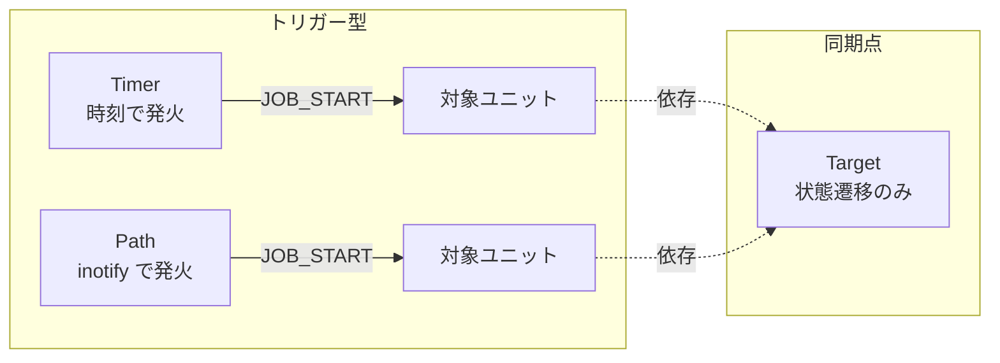

# 第11章 Timer, Path, Target ユニット

> 本章で読むソース
>
> - [`src/core/timer.c`](https://github.com/systemd/systemd/blob/v261.1/src/core/timer.c)
> - [`src/core/path.c`](https://github.com/systemd/systemd/blob/v261.1/src/core/path.c)
> - [`src/core/target.c`](https://github.com/systemd/systemd/blob/v261.1/src/core/target.c)

## この章の狙い

Service と Socket に続いて、残るトリガー型のユニットと同期用のユニットを扱う。
Timer は時刻で、Path はファイルシステムの変化で、それぞれ別のユニットを起動する。
Target はプロセスもソケットも持たず、依存関係の同期点として機能する。
本章では、Timer が単調時計とリアルタイム時計の二本立てで発火を管理する仕組み、Path が inotify とポーリングをどう組み合わせるか、Target がなぜ状態遷移だけで成立するかを読み解く。

## 前提

- 第7章のユニット抽象と `unit_notify()` を理解していること
- 第10章のトリガー型ユニット（Socket）の状態機械を把握していること
- 第4章の `sd-event` のタイマーソースと I/O ソースを把握していること

## Timer: 時刻によるトリガー

Timer の状態は `TimerState` で表される。

[`src/basic/unit-def.h` L211-L219](https://github.com/systemd/systemd/blob/v261.1/src/basic/unit-def.h#L211-L219)

```c
typedef enum TimerState {
        TIMER_DEAD,
        TIMER_WAITING,
        TIMER_RUNNING,
        TIMER_ELAPSED,
        TIMER_FAILED,
        _TIMER_STATE_MAX,
        _TIMER_STATE_INVALID = -EINVAL,
} TimerState;
```

`timer_start()` は、永続タイマー用のスタンプファイルから前回発火時刻を読み込み、`timer_enter_waiting()` に入る。

[`src/core/timer.c` L665-L704](https://github.com/systemd/systemd/blob/v261.1/src/core/timer.c#L665-L704)

```c
static int timer_start(Unit *u) {
        Timer *t = ASSERT_PTR(TIMER(u));
        int r;

        assert(IN_SET(t->state, TIMER_DEAD, TIMER_FAILED));
        // ... (中略) ...
        if (t->stamp_path) {
                struct stat st;

                if (stat(t->stamp_path, &st) >= 0) {
                        // ... (中略) ...
                        ft = timespec_load(&st.st_mtim);
                        if (ft < now(CLOCK_REALTIME))
                                t->last_trigger.realtime = ft;
                        // ... (中略) ...
                }
        // ... (中略) ...
        t->result = TIMER_SUCCESS;
        timer_enter_waiting(t, false);
        return 1;
}
```

### 二本立ての時計

`timer_enter_waiting()` は、設定された各タイマー値を単調時計系（`OnBootSec=` や `OnUnitActiveSec=` など）とカレンダー系（`OnCalendar=`）に振り分ける。
カレンダー系は次回発火時刻を `calendar_spec_next_usec()` で計算し、`next_elapse_realtime` に集約する。

[`src/core/timer.c` L394-L455](https://github.com/systemd/systemd/blob/v261.1/src/core/timer.c#L394-L455)

```c
                if (v->base == TIMER_CALENDAR) {
                        // ... (中略) ...
                        r = calendar_spec_next_usec(v->calendar_spec, b, &v->next_elapse);
                        if (r < 0)
                                continue;

                        v->next_elapse += random_offset;
                        // ... (中略) ...
                        if (!found_realtime)
                                t->next_elapse_realtime = v->next_elapse;
                        else
                                t->next_elapse_realtime = MIN(t->next_elapse_realtime, v->next_elapse);

                        found_realtime = true;
```

単調系は基準時刻（`base`）に相対値を足して `next_elapse_monotonic_or_boottime` に集約する。

見つかったそれぞれについて、単調系は `CLOCK_MONOTONIC`（または `CLOCK_BOOTTIME_ALARM`）のタイマーソースを、リアルタイム系は `CLOCK_REALTIME`（または `CLOCK_REALTIME_ALARM`）のタイマーソースを `sd_event_add_time()` で登録する。

[`src/core/timer.c` L548-L560](https://github.com/systemd/systemd/blob/v261.1/src/core/timer.c#L548-L560)

```c
                        r = sd_event_add_time(
                                        UNIT(t)->manager->event,
                                        &t->monotonic_event_source,
                                        t->wake_system ? CLOCK_BOOTTIME_ALARM : CLOCK_MONOTONIC,
                                        t->next_elapse_monotonic_or_boottime, t->accuracy_usec,
                                        timer_dispatch, t);
```

どちらか一方の時計しか使わないタイマーでは、他方のイベントソースは `SD_EVENT_OFF` で無効化される。
両系を同時に扱えるため、一つの Timer ユニットに `OnCalendar=` と `OnBootSec=` を混在させても、それぞれ適切な時計で発火する。

### 最適化: accuracy_usec によるタイマー合体

`sd_event_add_time()` の第 6 引数 `t->accuracy_usec` は、発火の許容誤差である。
`sd-event` はこの誤差の範囲でタイマーの発火時刻を近隣のタイマーと揃え、複数のタイマーを一度のウェイクアップでまとめて処理する。
これにより、多数のタイマーが個別に CPU を起こすことを防ぎ、消費電力を抑える。
`RandomizedDelaySec=` によるランダム遅延（`add_random_delay()`）も併用され、多数のマシンや多数のタイマーが同時刻に一斉発火して負荷が集中することを避ける。

発火すると `timer_dispatch()` を経て `timer_enter_running()` が呼ばれ、トリガー対象のユニットに `JOB_START` を積む。

[`src/core/timer.c` L644-L658](https://github.com/systemd/systemd/blob/v261.1/src/core/timer.c#L644-L658)

```c
        r = manager_add_job(UNIT(t)->manager, JOB_START, trigger, JOB_REPLACE, &error, &job);
        if (r < 0) {
                log_unit_warning(UNIT(t), "Failed to queue unit startup job: %s", bus_error_message(&error, r));
                goto fail;
        }

        dual_timestamp_now(&t->last_trigger);
        // ... (中略) ...
        if (t->stamp_path)
                touch_file(t->stamp_path, true, t->last_trigger.realtime, UID_INVALID, GID_INVALID, MODE_INVALID);

        timer_set_state(t, TIMER_RUNNING);
```

発火時刻はスタンプファイルにも記録される。
これが永続タイマー（`Persistent=yes`）の基盤で、システムが停止していた間に逃した発火を、次回起動時に検出して追いつける。

## Path: ファイルシステム変化によるトリガー

Path の状態は `PathState` で表される。

[`src/basic/unit-def.h` L107-L110](https://github.com/systemd/systemd/blob/v261.1/src/basic/unit-def.h#L107-L110)

```c
typedef enum PathState {
        PATH_DEAD,
        PATH_WAITING,
        PATH_RUNNING,
```

`path_start()` は必要なディレクトリを作り、`path_enter_waiting()` に入る。

[`src/core/path.c` L629-L645](https://github.com/systemd/systemd/blob/v261.1/src/core/path.c#L629-L645)

```c
static int path_start(Unit *u) {
        Path *p = ASSERT_PTR(PATH(u));
        int r;

        assert(IN_SET(p->state, PATH_DEAD, PATH_FAILED));
        // ... (中略) ...
        path_mkdir(p);

        p->result = PATH_SUCCESS;
        path_enter_waiting(p, true, false);

        return 1;
}
```

### inotify とチェックの二重化

`path_enter_waiting()` は、まず条件が既に満たされているか（監視対象のファイルが既に存在するかなど）を `path_check_good()` で確認する。
満たされていれば inotify を張らずに即 `path_enter_running()` へ進む。

[`src/core/path.c` L593-L616](https://github.com/systemd/systemd/blob/v261.1/src/core/path.c#L593-L616)

```c
        if (path_check_good(p, initial, from_trigger_notify, &trigger_path)) {
                log_unit_debug(UNIT(p), "Got triggered by '%s'.", trigger_path);
                path_enter_running(p, trigger_path);
                return;
        }

        r = path_watch(p);
        // ... (中略) ...
        /* Hmm, so now we have created inotify watches, but the file
         * might have appeared/been removed by now, so we must
         * recheck */

        if (path_check_good(p, false, from_trigger_notify, &trigger_path)) {
                log_unit_debug(UNIT(p), "Got triggered by '%s'.", trigger_path);
                path_enter_running(p, trigger_path);
                return;
        }

        path_set_state(p, PATH_WAITING);
```

### 最適化: 監視登録後の再チェックによる取りこぼし防止

`path_watch()` で inotify を張ってから、もう一度 `path_check_good()` を呼ぶ点が要である。
inotify の登録と条件チェックの間にファイルが出現すると、登録前の変化は inotify では拾えない。
監視を張った直後に再チェックすることで、この隙間に起きた変化を確実に捉える。
inotify はカーネルからのイベント通知であり、ポーリングと違って変化がないあいだは CPU を消費しない。
初回チェックで満たされていれば inotify すら張らないため、待機のコストを最小化している。

inotify がイベントを通知すると `path_dispatch_io()` が発火し、条件が満たされていれば `path_enter_running()` へ進む。

[`src/core/path.c` L784-L791](https://github.com/systemd/systemd/blob/v261.1/src/core/path.c#L784-L791)

```c
        changed = path_spec_fd_event(found, revents);
        if (changed < 0)
                goto fail;

        if (changed)
                path_enter_running(p, found->path);
        else
                path_enter_waiting(p, false, false);
```

`path_enter_running()` は Socket や Timer と同じく `manager_add_job()` で `JOB_START` を積む。
暴走を防ぐトリガー上限の検査も共通している。

[`src/core/path.c` L525-L549](https://github.com/systemd/systemd/blob/v261.1/src/core/path.c#L525-L549)

```c
        if (!ratelimit_below(&p->trigger_limit)) {
                log_unit_warning(UNIT(p), "Trigger limit hit, refusing further activation.");
                path_enter_dead(p, PATH_FAILURE_TRIGGER_LIMIT_HIT);
                return;
        }
        // ... (中略) ...
        r = manager_add_job(UNIT(p)->manager, JOB_START, trigger, JOB_REPLACE, &error, &job);
```

## Target: 依存関係の同期点

Target はプロセスもソケットも持たない。
状態は活性か否かの二値だけである。

[`src/basic/unit-def.h` L204-L209](https://github.com/systemd/systemd/blob/v261.1/src/basic/unit-def.h#L204-L209)

```c
typedef enum TargetState {
        TARGET_DEAD,
        TARGET_ACTIVE,
        _TARGET_STATE_MAX,
        _TARGET_STATE_INVALID = -EINVAL,
} TargetState;
```

`target_start()` は招請 ID を取得して状態を `TARGET_ACTIVE` にするだけで、外部プロセスを一切起こさない。

[`src/core/target.c` L107-L119](https://github.com/systemd/systemd/blob/v261.1/src/core/target.c#L107-L119)

```c
static int target_start(Unit *u) {
        Target *t = ASSERT_PTR(TARGET(u));
        int r;

        assert(t->state == TARGET_DEAD);

        r = unit_acquire_invocation_id(u);
        if (r < 0)
                return r;

        target_set_state(t, TARGET_ACTIVE);
        return 1;
}
```

Target の価値は、状態そのものではなく依存関係にある。
`target_load()` から呼ばれる `target_add_default_dependencies()` は、Target が要求するユニットとの間に順序依存を自動で補う。

[`src/core/target.c` L44-L58](https://github.com/systemd/systemd/blob/v261.1/src/core/target.c#L44-L58)

```c
        /* Imply ordering for requirement dependencies on target units. Note that when the user created a
         * contradicting ordering manually we won't add anything in here to make sure we don't create a
         * loop.
         *
         * Note that quite likely iterating through these dependencies will add new dependencies, which
         * conflicts with the hashmap-based iteration logic. Hence, instead of iterating through the
         * dependencies and acting on them as we go, first take an "atomic snapshot" of sorts and iterate
         * through that. */

        n_others = unit_get_dependency_array(UNIT(t), UNIT_ATOM_ADD_DEFAULT_TARGET_DEPENDENCY_QUEUE, &others);
        if (n_others < 0)
                return n_others;

        FOREACH_ARRAY(i, others, n_others) {
                r = unit_add_default_target_dependency(*i, UNIT(t));
                if (r < 0)
                        return r;
        }
```

これにより、Target の開始ジョブは依存先の開始ジョブを引き込み、順序依存に従ってそれらの開始試行が落ち着いた後で完了する同期点になる。
ただし `Wants=` の失敗は Target の失敗を意味せず、`active` は関連ユニットすべての成功を保証しない。
`multi-user.target` や `graphical.target` のようなブートの節目は、この同期点を積み重ねて表現される。



## まとめ

Timer は単調時計とリアルタイム時計の二本のタイマーソースを使い分け、`accuracy_usec` による発火合体とランダム遅延で負荷と消費電力を抑える。
永続タイマーはスタンプファイルに発火時刻を記録し、停止中に逃した発火に追いつく。
Path は inotify で待機し、監視登録の直後に再チェックすることで登録の隙間に起きた変化を取りこぼさない。
Timer と Path はいずれも `manager_add_job()` で `JOB_START` を積むトリガー型で、Socket と同じ構造を持つ。
Target はプロセスを持たず、状態遷移と自動補完される順序依存だけでブートの同期点を表現する。

## 関連する章

- 第7章：ユニット抽象（各ユニットの vtable と unit_notify）
- 第8章：ジョブとトランザクション（トリガーが積む JOB_START）
- 第10章：ソケットアクティベーション（同じトリガー構造を持つ Socket）
