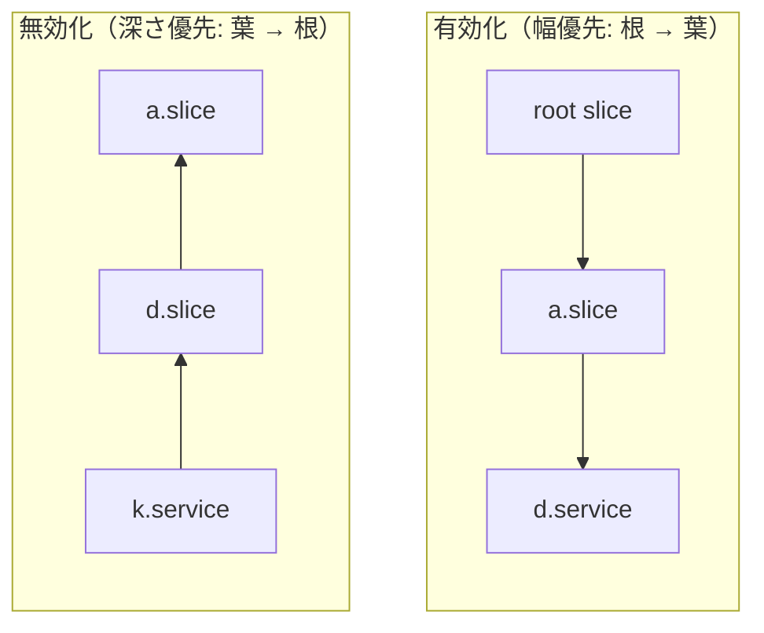

# 第12章 cgroup v2 統合

> 本章で読むソース
>
> - [`src/core/cgroup.h`](https://github.com/systemd/systemd/blob/v261.1/src/core/cgroup.h)
> - [`src/core/cgroup.c`](https://github.com/systemd/systemd/blob/v261.1/src/core/cgroup.c)

## この章の狙い

systemd はすべてのユニットをカーネルの cgroup 階層へ対応づけ、CPU とメモリと IO の資源を制御する。
本章では、ユニットが要求するコントローラの集合（マスク）がどう計算され、cgroup がどの順序で生成され更新されるか、そしてプロセスが去った空グループをどう検出するかを追う。
対象は cgroup v2（統合階層）を中心とする。

## 前提

- 第6章のマネージャーとイベントループを理解していること
- 第7章のユニット抽象化（`Unit` 構造）を把握していること
- cgroup v2 が「ディレクトリ木」であり、各ノードの `cgroup.subtree_control` で子に見せるコントローラを制御する、という基本を知っていること

## 二つの状態: 設定と実行時

cgroup 関連のデータは、ユニット設定から来る不変部分と、実行時に更新される可変部分に分かれる。
不変部分が `CGroupContext` であり、ユニットファイルの `CPUWeight=` や `MemoryMax=` などの指定をそのまま保持する。

[`src/core/cgroup.h` L120-L135](https://github.com/systemd/systemd/blob/v261.1/src/core/cgroup.h#L120-L135)

```c
/* The user-supplied cgroup-related configuration options. This remains mostly immutable while the service
 * manager is running (except for an occasional SetProperties() configuration change), outside of reload
 * cycles. */
typedef struct CGroupContext {
        bool io_accounting;
        bool memory_accounting;
        bool tasks_accounting;
        bool ip_accounting;
```

可変部分が `CGroupRuntime` であり、ユニットが初めて実体化（realize）されたときに確保される。
ここに、そのユニットの cgroup パス、どのコントローラが有効化済みかを表すマスク群、inotify の監視ディスクリプタが収まる。

[`src/core/cgroup.h` L283-L292](https://github.com/systemd/systemd/blob/v261.1/src/core/cgroup.h#L283-L292)

```c
        /* Counterparts in the cgroup filesystem */
        char *cgroup_path;
        uint64_t cgroup_id;
        CGroupMask cgroup_realized_mask;           /* In which hierarchies does this unit's cgroup exist? (only relevant on cgroup v1) */
        CGroupMask cgroup_enabled_mask;            /* Which controllers are enabled (or more correctly: enabled for the children) for this unit's cgroup? (only relevant on cgroup v2) */
        CGroupMask cgroup_invalidated_mask;        /* A mask specifying controllers which shall be considered invalidated, and require re-realization */
        CGroupMask cgroup_members_mask;            /* A cache for the controllers required by all children of this cgroup (only relevant for slice units) */
```

設定を分離しておくと、リロードで設定を差し替えても、実行時に確定した cgroup パスや監視状態を捨てずに済む。
`cgroup_realized_mask` は cgroup v1 用、`cgroup_enabled_mask` は cgroup v2 用であり、同じ realize 処理が両方の階層モデルを一つのコードで扱う。

## マネージャーの cgroup 初期化

マネージャー生成時に `manager_setup_cgroup()` が cgroup 基盤を用意する。
自身が属する cgroup パスを調べ、`/sys/fs/cgroup` を `O_PATH` で開いてアンマウントを防ぎ、空グループ検出のためのイベントソースと inotify を登録する。

[`src/core/cgroup.c` L3298-L3348](https://github.com/systemd/systemd/blob/v261.1/src/core/cgroup.c#L3298-L3348)

```c
        /* 1. Determine hierarchy */
        m->cgroup_root = mfree(m->cgroup_root);
        r = cg_pid_get_path(0, &m->cgroup_root);
        if (r < 0)
                return log_error_errno(r, "Cannot determine cgroup we are running in: %m");
        // ... (中略) ...
        /* 2. Pin the cgroupfs mount, so that it cannot be unmounted */
        safe_close(m->pin_cgroupfs_fd);
        m->pin_cgroupfs_fd = open("/sys/fs/cgroup", O_PATH|O_CLOEXEC|O_DIRECTORY);
        // ... (中略) ...
        m->cgroup_inotify_fd = inotify_init1(IN_NONBLOCK|IN_CLOEXEC);
```

続いて PID 1 自身を `init.scope` へ移し、ルート直下に残った他のプロセスもそこへ退避させる。
最後にカーネルが対応するコントローラの集合を調べ、`m->cgroup_supported` に記録する。

[`src/core/cgroup.c` L3359-L3386](https://github.com/systemd/systemd/blob/v261.1/src/core/cgroup.c#L3359-L3386)

```c
        /* 5. Make sure we are in the special "init.scope" unit in the root slice. */
        const char *scope_path = strjoina(m->cgroup_root, "/" SPECIAL_INIT_SCOPE);
        r = cg_create_and_attach(scope_path, /* pid= */ 0);
        // ... (中略) ...
        /* 6. Figure out which controllers are supported */
        r = cg_mask_supported_subtree(m->cgroup_root, &m->cgroup_supported);
```

`cgroup_supported` は以後すべてのマスク計算で AND を取る上限として働く。
カーネルが持たないコントローラを要求しても、この段階でマスクから落ちる。

## コントローラマスクの計算

ユニットがどのコントローラを必要とするかは、複数のマスク関数を合成して決まる。
基点は `unit_get_own_mask()` であり、そのユニット自身が資源制御と BPF と委譲のために要求するコントローラを返す。

cgroup v2 では、あるコントローラを子で使うには、親が `cgroup.subtree_control` でそれを有効化していなければならない。
このため systemd は、子孫全員が要求するコントローラの和集合を親へ伝播させる。
その和集合が `unit_get_members_mask()` である。

[`src/core/cgroup.c` L1814-L1837](https://github.com/systemd/systemd/blob/v261.1/src/core/cgroup.c#L1814-L1837)

```c
CGroupMask unit_get_members_mask(Unit *u) {
        assert(u);

        /* Returns the mask of controllers all of the unit's children require, merged */

        CGroupRuntime *crt = unit_get_cgroup_runtime(u);
        if (crt && crt->cgroup_members_mask_valid)
                return crt->cgroup_members_mask; /* Use cached value if possible */

        CGroupMask m = 0;
        if (u->type == UNIT_SLICE) {
                Unit *member;

                UNIT_FOREACH_DEPENDENCY(member, u, UNIT_ATOM_SLICE_OF)
                        m |= unit_get_subtree_mask(member); /* note that this calls ourselves again, for the children */
        }
        // ... (中略) ...
        return m;
}
```

この関数は slice の子を再帰的に辿るため、深い階層では計算が重い。
そこで結果を `cgroup_members_mask` にキャッシュし、`cgroup_members_mask_valid` が真の間は再計算しない。
構成が変わると `unit_invalidate_cgroup_members_masks()` が祖先方向へキャッシュ無効化を伝播させ、次回の問い合わせで正しい値を再計算させる。

これらを束ねて、実際に cgroup へ適用する二つのマスクが決まる。
`unit_get_target_mask()` は「このユニット自身に有効化すべきコントローラ」を、`unit_get_enable_mask()` は「このユニットの子に見せるべきコントローラ」を返す。

[`src/core/cgroup.c` L1902-L1915](https://github.com/systemd/systemd/blob/v261.1/src/core/cgroup.c#L1902-L1915)

```c
CGroupMask unit_get_enable_mask(Unit *u) {
        CGroupMask mask;

        /* This returns the cgroup mask of all controllers to enable
         * for the children of a specific cgroup. This is primarily
         * useful for the unified cgroup hierarchy, where each cgroup
         * controls which controllers are enabled for its children. */

        mask = unit_get_members_mask(u);
        mask &= u->manager->cgroup_supported;
        mask &= ~unit_get_ancestor_disable_mask(u);

        return mask;
}
```

どちらも `cgroup_supported` で上限を切り、祖先の `DisableControllers=` を差し引く。
これにより、カーネルが持たないコントローラや、上位で明示的に禁止されたコントローラは決して有効化されない。

## 実体化: 生成と有効化の順序

ユニットの cgroup を実際に作り、コントローラを整えるのが `unit_realize_cgroup_now()` である。
すでに目標状態に達していれば何もしないが、そうでなければ、無効化と有効化を正しい順序で行う。

[`src/core/cgroup.c` L2565-L2603](https://github.com/systemd/systemd/blob/v261.1/src/core/cgroup.c#L2565-L2603)

```c
static int unit_realize_cgroup_now(Unit *u, ManagerState state) {
        CGroupMask target_mask, enable_mask;
        Unit *slice;
        int r;
        // ... (中略) ...
        if (unit_has_mask_realized(u, target_mask, enable_mask))
                return 0;

        /* Disable controllers below us, if there are any */
        r = unit_realize_cgroup_now_disable(u, state);
        // ... (中略) ...
        /* Enable controllers above us, if there are any */
        slice = UNIT_GET_SLICE(u);
        if (slice) {
                r = unit_realize_cgroup_now_enable(slice, state);
                // ... (中略) ...
        }

        /* Now actually deal with the cgroup we were trying to realise and set attributes */
        r = unit_update_cgroup(u, target_mask, enable_mask, state);
```

順序には理由がある。
cgroup v2 では、コントローラを有効化するときは根から葉へ幅優先で進めなければならず、無効化するときは葉から根へ深さ優先で進めなければならない。
親が有効化していないコントローラを子で使うことはできず、子がまだ使っているコントローラを親で無効化することもできないからだ。

有効化の側は、まず自分の slice を再帰的に実体化してから自分を更新する。

[`src/core/cgroup.c` L2445-L2474](https://github.com/systemd/systemd/blob/v261.1/src/core/cgroup.c#L2445-L2474)

```c
static int unit_realize_cgroup_now_enable(Unit *u, ManagerState state) {
        CGroupMask target_mask, enable_mask, new_target_mask, new_enable_mask;
        Unit *slice;
        int r;
        // ... (中略) ...
        /* First go deal with this unit's parent, or we won't be able to enable
         * any new controllers at this layer. */
        slice = UNIT_GET_SLICE(u);
        if (slice) {
                r = unit_realize_cgroup_now_enable(slice, state);
                if (r < 0)
                        return r;
        }
```

無効化の側は逆に、slice の子孫を先に処理してから自分へ戻る。



`unit_update_cgroup()` が、この順序の各段で実際のファイルシステム操作を行う。
cgroup ディレクトリを作り、`cg_enable()` で `cgroup.subtree_control` を書き換え、実際に有効化できたコントローラを `cgroup_enabled_mask` に記録し直す。

[`src/core/cgroup.c` L2165-L2181](https://github.com/systemd/systemd/blob/v261.1/src/core/cgroup.c#L2165-L2181)

```c
        /* For v2 we preserve enabled controllers in delegated units, adjust others, */
        if (created || !unit_cgroup_delegate(u)) {
                CGroupMask result_mask = 0;

                /* Enable all controllers we need */
                r = cg_enable(u->manager->cgroup_supported, enable_mask, crt->cgroup_path, &result_mask);
                // ... (中略) ...
                /* Remember what's actually enabled now */
                crt->cgroup_enabled_mask = result_mask;
        }

        /* Keep track that this is now realized */
        crt->cgroup_realized_mask = target_mask;

        /* Set attributes */
        cgroup_context_apply(u, target_mask, state);
```

最後に `cgroup_context_apply()` が、`CPUWeight=` や `MemoryMax=` などの設定値を対応する cgroup 属性ファイルへ書き込む。

## 属性の適用

`cgroup_context_apply()` は、適用対象マスクに含まれるコントローラごとに、設定値を属性ファイルへ落とし込む。
たとえば CPU コントローラが対象なら、重みとクォータを書き込む。

[`src/core/cgroup.c` L1507-L1518](https://github.com/systemd/systemd/blob/v261.1/src/core/cgroup.c#L1507-L1518)

```c
        /* These attributes don't exist on the host cgroup root. */
        if ((apply_mask & CGROUP_MASK_CPU) && !is_local_root) {
                uint64_t weight;

                if (cgroup_context_has_cpu_weight(c))
                        weight = cgroup_context_cpu_weight(c, state);
                else
                        weight = CGROUP_WEIGHT_DEFAULT;

                cgroup_apply_cpu_idle(u, weight);
                cgroup_apply_cpu_weight(u, weight);
                cgroup_apply_cpu_quota(u, c->cpu_quota_per_sec_usec, c->cpu_quota_period_usec);
        }
```

ホストのルート cgroup には存在しない属性があるため、`is_local_root` の判定で書き込みを飛ばす。
コンテナ内で読み取り専用マウントに当たった場合も、`EROFS` や `ENOENT` は無視して処理を続ける。

## 空グループの検出

サービスのプロセスがすべて終了すると、cgroup は「空（populated=0）」になる。
systemd はこれを検出してユニットを非アクティブへ遷移させる。
`unit_watch_cgroup()` が各 cgroup の `cgroup.events` ファイルに inotify 監視を張る。

[`src/core/cgroup.c` L2034-L2046](https://github.com/systemd/systemd/blob/v261.1/src/core/cgroup.c#L2034-L2046)

```c
        r = cg_get_path(crt->cgroup_path, "cgroup.events", &events);
        if (r < 0)
                return log_oom();

        crt->cgroup_control_inotify_wd = inotify_add_watch(u->manager->cgroup_inotify_fd, events, IN_MODIFY);
        if (crt->cgroup_control_inotify_wd < 0) {

                if (errno == ENOENT) /* If the directory is already gone we don't need to track it, so this
                                      * is not an error */
                        return 0;
```

`cgroup.events` が変化すると `on_cgroup_inotify_event()` が発火し、監視ディスクリプタからユニットを引き当てて `unit_check_cgroup_events()` を呼ぶ。
そこで `populated` 属性を読み、値が 1 なら空キューから外し、0 なら空キューへ加える。

[`src/core/cgroup.c` L3187-L3201](https://github.com/systemd/systemd/blob/v261.1/src/core/cgroup.c#L3187-L3201)

```c
        r = cg_get_keyed_attribute(
                        crt->cgroup_path,
                        "cgroup.events",
                        STRV_MAKE("populated", "frozen"),
                        values);
        if (r < 0)
                return r;

        /* The cgroup.events notifications can be merged together so act as we saw the given state for the
         * first time. The functions we call to handle given state are idempotent, which makes them
         * effectively remember the previous state. */
        if (streq(values[0], "1"))
                unit_remove_from_cgroup_empty_queue(u);
        else
                unit_add_to_cgroup_empty_queue(u);
```

inotify はイベントを併合しうるため、状態を毎回属性の実値から読み直す。
キューへの出し入れがべき等になっているので、通知が併合されても最終状態は正しく収束する。

## 最適化: メンバーマスクのキャッシュと最小限の subtree_control 書き換え

この設計の要は、コントローラの伝播計算をキャッシュし、cgroup への書き込みを必要最小限に絞ることにある。

`unit_get_members_mask()` は slice の全子孫を再帰で辿るため、素朴に毎回計算すると階層の深さと幅に比例したコストがかかる。
結果を `cgroup_members_mask` に保存し `cgroup_members_mask_valid` で有効性を管理することで、構成が変わらない限り再帰を一度も回さずに答えを返す。
無効化は変更のあった枝の祖先方向にだけ伝播するので、無関係な部分木のキャッシュは生き残る。

さらに `unit_has_mask_realized()` が、目標マスクと現状マスクの差分を排他的論理和で調べ、すでに目標状態なら realize 全体を早期に打ち切る。

[`src/core/cgroup.c` L2375-L2378](https://github.com/systemd/systemd/blob/v261.1/src/core/cgroup.c#L2375-L2378)

```c
        return crt->cgroup_path &&
                ((crt->cgroup_realized_mask ^ target_mask) & CGROUP_MASK_V1) == 0 &&
                ((crt->cgroup_enabled_mask ^ enable_mask) & CGROUP_MASK_V2) == 0 &&
                crt->cgroup_invalidated_mask == 0;
```

`cgroup.subtree_control` への書き込みはカーネル側で階層のロックを伴うため、無駄な書き換えは全体の起動を遅らせる。
差分がゼロなら `cg_enable()` を呼ばずに済ませることで、数千ユニットを一斉に起動しても書き込み回数を実際に変化した箇所だけへ抑えられる。

## まとめ

systemd は各ユニットを cgroup 階層のノードへ対応づけ、設定を `CGroupContext`、実行時状態を `CGroupRuntime` に分けて持つ。
必要なコントローラは、自身の要求と子孫の要求（メンバーマスク）と兄弟の要求を合成し、カーネルが対応する範囲と祖先の禁止指定で絞って決まる。
実体化は、有効化を根から葉へ幅優先、無効化を葉から根へ深さ優先で行い、cgroup v2 の階層制約を満たす。
メンバーマスクのキャッシュと差分判定により、大量のユニットを起動しても `cgroup.subtree_control` への書き込みを実際に変化した箇所だけへ抑える。
プロセスが去った空グループは `cgroup.events` の inotify 監視で検出し、べき等なキュー操作で状態を収束させる。

## 関連する章

- 第6章：マネージャーとメインループ（realize キューと空キューを回すディスパッチャ）
- 第7章：ユニット抽象化（`CGroupContext` を持つユニットの構造）
- 第13章：BPF によるリソース制約（cgroup に紐づく BPF 疑似コントローラ）
